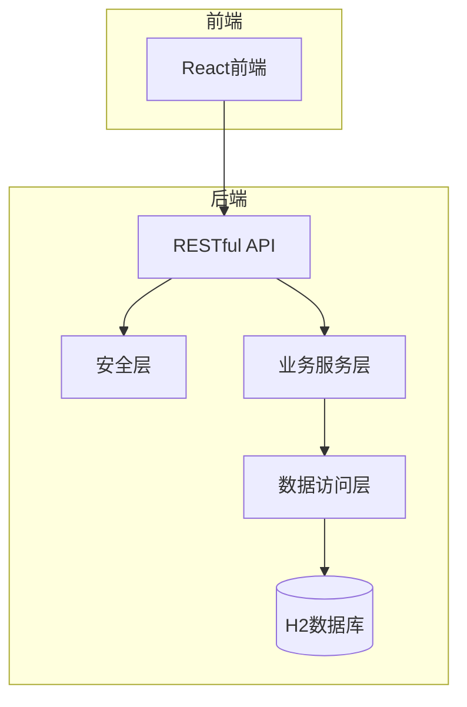
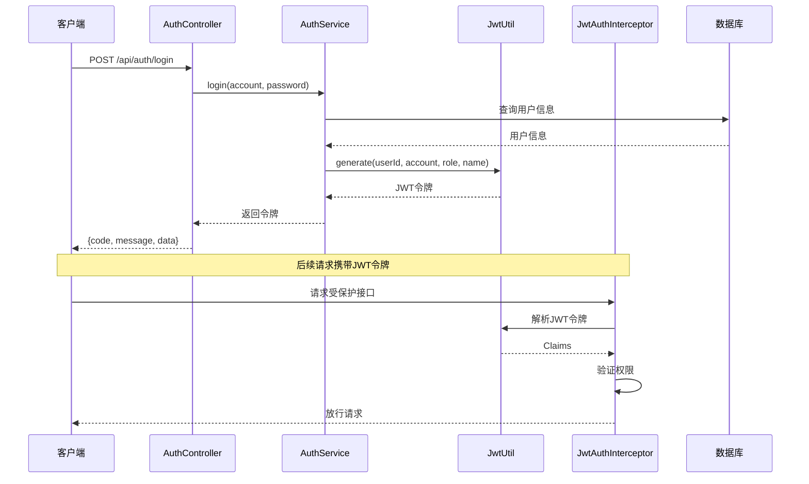
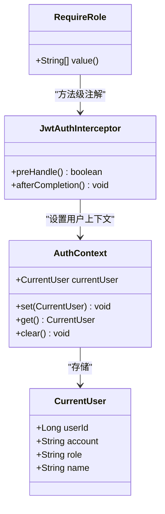
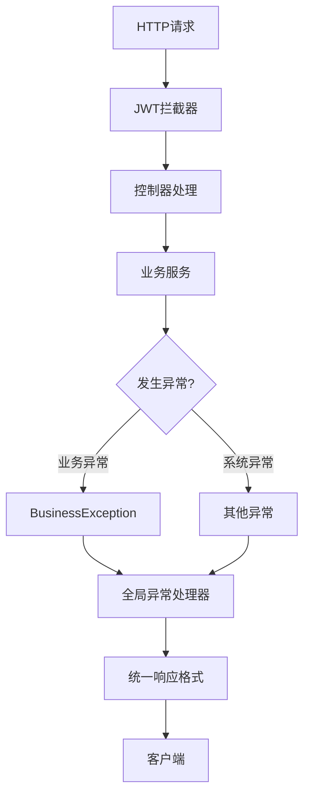

# API接口文档

<cite>
**本文档引用的文件**
- [AuthController.java](file://backend/src/main/java/com/zjsu/scholarship/controller/AuthController.java)
- [StudentController.java](file://backend/src/main/java/com/zjsu/scholarship/controller/StudentController.java)
- [CounselorController.java](file://backend/src/main/java/com/zjsu/scholarship/controller/CounselorController.java)
- [AdminController.java](file://backend/src/main/java/com/zjsu/scholarship/controller/AdminController.java)
- [PublicController.java](file://backend/src/main/java/com/zjsu/scholarship/controller/PublicController.java)
- [AuthService.java](file://backend/src/main/java/com/zjsu/scholarship/service/AuthService.java)
- [JwtUtil.java](file://backend/src/main/java/com/zjsu/scholarship/security/JwtUtil.java)
- [JwtAuthInterceptor.java](file://backend/src/main/java/com/zjsu/scholarship/security/JwtAuthInterceptor.java)
- [RequireRole.java](file://backend/src/main/java/com/zjsu/scholarship/security/RequireRole.java)
- [R.java](file://backend/src/main/java/com/zjsu/scholarship/common/R.java)
- [GlobalExceptionHandler.java](file://backend/src/main/java/com/zjsu/scholarship/common/GlobalExceptionHandler.java)
- [application.yml](file://backend/src/main/resources/application.yml)
- [schema.sql](file://backend/src/main/resources/db/schema.sql)
- [api.js](file://frontend/src/api.js)
- [README.md](file://README.md)
</cite>

## 目录
1. [简介](#简介)
2. [项目结构](#项目结构)
3. [核心组件](#核心组件)
4. [架构概览](#架构概览)
5. [详细组件分析](#详细组件分析)
6. [依赖分析](#依赖分析)
7. [性能考虑](#性能考虑)
8. [故障排除指南](#故障排除指南)
9. [结论](#结论)
10. [附录](#附录)

## 简介
本项目是基于Spring Boot开发的奖学金管理系统，采用前后端分离架构，提供完整的认证授权、学生综测、辅导员审核、管理员管理等功能。系统支持RESTful API接口，采用JWT令牌进行身份认证，通过注解实现细粒度的权限控制。

## 项目结构
后端采用标准的MVC架构，主要分为以下层次：
- 控制器层：负责接收HTTP请求并返回响应
- 服务层：封装业务逻辑和数据处理
- 数据访问层：MyBatis-Plus实现的数据持久化
- 安全层：JWT认证和权限拦截
- 配置层：应用配置和全局异常处理



**图表来源**
- [AuthController.java:11-44](file://backend/src/main/java/com/zjsu/scholarship/controller/AuthController.java#L11-L44)
- [StudentController.java:22-86](file://backend/src/main/java/com/zjsu/scholarship/controller/StudentController.java#L22-L86)
- [JwtAuthInterceptor.java:12-65](file://backend/src/main/java/com/zjsu/scholarship/security/JwtAuthInterceptor.java#L12-L65)

**章节来源**
- [README.md:123-154](file://README.md#L123-L154)

## 核心组件
系统的核心组件包括：

### 认证组件
- **JwtUtil**：JWT令牌生成和解析
- **AuthService**：用户认证和密码处理
- **JwtAuthInterceptor**：JWT拦截器和权限验证

### 控制器组件
- **AuthController**：用户认证相关接口
- **StudentController**：学生相关功能接口
- **CounselorController**：辅导员相关功能接口
- **AdminController**：管理员相关功能接口
- **PublicController**：公开接口

### 响应格式
系统统一使用R<T>包装响应，包含code、message、data三个字段：
- code：状态码，0表示成功，非0表示失败
- message：描述信息
- data：实际数据内容

**章节来源**
- [R.java:3-39](file://backend/src/main/java/com/zjsu/scholarship/common/R.java#L3-L39)
- [GlobalExceptionHandler.java:8-23](file://backend/src/main/java/com/zjsu/scholarship/common/GlobalExceptionHandler.java#L8-L23)

## 架构概览
系统采用分层架构，通过中间件实现横切关注点。



**图表来源**
- [AuthController.java:21-24](file://backend/src/main/java/com/zjsu/scholarship/controller/AuthController.java#L21-L24)
- [AuthService.java:32-55](file://backend/src/main/java/com/zjsu/scholarship/service/AuthService.java#L32-L55)
- [JwtUtil.java:28-42](file://backend/src/main/java/com/zjsu/scholarship/security/JwtUtil.java#L28-L42)
- [JwtAuthInterceptor.java:20-58](file://backend/src/main/java/com/zjsu/scholarship/security/JwtAuthInterceptor.java#L20-L58)

## 详细组件分析

### 认证接口

#### 登录接口
- **HTTP方法**：POST
- **URL路径**：`/api/auth/login`
- **请求参数**：
  ```json
  {
    "account": "string",
    "password": "string"
  }
  ```
- **响应格式**：
  ```json
  {
    "code": 0,
    "message": "ok",
    "data": {
      "token": "string",
      "account": "string",
      "name": "string",
      "role": "string",
      "usingInitialPassword": "boolean"
    }
  }
  ```
- **状态码**：
  - 200：登录成功
  - 400：账号不存在或密码错误
  - 401：未登录或令牌缺失
  - 403：无权限访问

**章节来源**
- [AuthController.java:21-24](file://backend/src/main/java/com/zjsu/scholarship/controller/AuthController.java#L21-L24)
- [AuthService.java:32-55](file://backend/src/main/java/com/zjsu/scholarship/service/AuthService.java#L32-L55)

#### 获取当前用户信息
- **HTTP方法**：GET
- **URL路径**：`/api/auth/me`
- **请求头**：Authorization: Bearer {token}
- **响应格式**：
  ```json
  {
    "code": 0,
    "message": "ok",
    "data": {
      "userId": 1,
      "account": "string",
      "role": "string",
      "name": "string"
    }
  }
  ```

**章节来源**
- [AuthController.java:26-35](file://backend/src/main/java/com/zjsu/scholarship/controller/AuthController.java#L26-L35)

#### 修改密码
- **HTTP方法**：POST
- **URL路径**：`/api/auth/change-password`
- **请求参数**：
  ```json
  {
    "oldPassword": "string",
    "newPassword": "string"
  }
  ```
- **响应格式**：
  ```json
  {
    "code": 0,
    "message": "ok",
    "data": null
  }
  ```

**章节来源**
- [AuthController.java:37-42](file://backend/src/main/java/com/zjsu/scholarship/controller/AuthController.java#L37-L42)
- [AuthService.java:57-76](file://backend/src/main/java/com/zjsu/scholarship/service/AuthService.java#L57-L76)

### 学生接口

#### 获取个人信息
- **HTTP方法**：GET
- **URL路径**：`/api/student/me`
- **权限要求**：STUDENT
- **响应格式**：
  ```json
  {
    "code": 0,
    "message": "ok",
    "data": {
      "student": "Student对象",
      "year": "AcademicYear对象",
      "evaluation": "EvaluationRecord对象"
    }
  }
  ```

**章节来源**
- [StudentController.java:113-123](file://backend/src/main/java/com/zjsu/scholarship/controller/StudentController.java#L113-L123)

#### 获取综测填报数据
- **HTTP方法**：GET
- **URL路径**：`/api/student/evaluation/items`
- **权限要求**：STUDENT
- **响应格式**：
  ```json
  {
    "code": 0,
    "message": "ok",
    "data": {
      "evaluation": "EvaluationRecord对象",
      "appraisals": "MoralAppraisal列表",
      "moralRecords": "MoralRecordItem列表",
      "courses": "CourseGrade列表",
      "riItems": "ResearchInnovationItem列表",
      "psItems": "ProfessionalSkillItem列表",
      "owItems": "OrganizationWorkItem列表",
      "saItems": "SportsAestheticsItem列表",
      "lpItems": "LaborPracticeItem列表"
    }
  }
  ```

**章节来源**
- [StudentController.java:126-162](file://backend/src/main/java/com/zjsu/scholarship/controller/StudentController.java#L126-L162)

#### 提交综测
- **HTTP方法**：POST
- **URL路径**：`/api/student/evaluation/submit`
- **权限要求**：STUDENT
- **响应格式**：
  ```json
  {
    "code": 0,
    "message": "ok",
    "data": {
      "evaluation": "EvaluationRecord对象"
    }
  }
  ```

**章节来源**
- [StudentController.java:165-174](file://backend/src/main/java/com/zjsu/scholarship/controller/StudentController.java#L165-L174)

#### 上传文件
- **HTTP方法**：POST
- **URL路径**：`/api/student/upload`
- **权限要求**：STUDENT
- **请求参数**：multipart/form-data，字段名为file
- **响应格式**：
  ```json
  {
    "code": 0,
    "message": "ok",
    "data": {
      "url": "string"
    }
  }
  ```

**章节来源**
- [StudentController.java:177-183](file://backend/src/main/java/com/zjsu/scholarship/controller/StudentController.java#L177-L183)

#### 品德评议CRUD
- **新增评议**：POST `/api/student/evaluation/appraisals`
- **更新评议**：PUT `/api/student/evaluation/appraisals/{id}`
- **权限要求**：STUDENT
- **响应格式**：返回对应的MoralAppraisal对象

**章节来源**
- [StudentController.java:186-212](file://backend/src/main/java/com/zjsu/scholarship/controller/StudentController.java#L186-L212)

#### 品德记实CRUD
- **新增记实**：POST `/api/student/evaluation/moral-records`
- **更新记实**：PUT `/api/student/evaluation/moral-records/{id}`
- **删除记实**：DELETE `/api/student/evaluation/moral-records/{id}`
- **权限要求**：STUDENT
- **响应格式**：返回对应的MoralRecordItem对象

**章节来源**
- [StudentController.java:215-262](file://backend/src/main/java/com/zjsu/scholarship/controller/StudentController.java#L215-L262)

#### 综合能力模块CRUD
系统提供五个综合能力模块的CRUD接口：
- **研究创新**：POST/PUT/DELETE `/api/student/evaluation/ri-items`
- **专业技能**：POST/PUT/DELETE `/api/student/evaluation/ps-items`
- **组织工作**：POST/PUT/DELETE `/api/student/evaluation/ow-items`
- **体育美育**：POST/PUT/DELETE `/api/student/evaluation/sa-items`
- **劳动实践**：POST/PUT/DELETE `/api/student/evaluation/lp-items`

**章节来源**
- [StudentController.java:265-442](file://backend/src/main/java/com/zjsu/scholarship/controller/StudentController.java#L265-L442)

#### 奖学金申请
- **查询可申请项目**：GET `/api/student/scholarships/eligible`
- **提交申请**：POST `/api/student/applications`
- **查询我的申请**：GET `/api/student/applications`
- **撤回申请**：DELETE `/api/student/applications/{id}`
- **权限要求**：STUDENT

**章节来源**
- [StudentController.java:516-620](file://backend/src/main/java/com/zjsu/scholarship/controller/StudentController.java#L516-L620)

#### 能力突出奖学金资格查询
- **HTTP方法**：GET
- **URL路径**：`/api/student/ability-scholarship/eligibility`
- **权限要求**：STUDENT

**章节来源**
- [StudentController.java:624-634](file://backend/src/main/java/com/zjsu/scholarship/controller/StudentController.java#L624-L634)

#### 考研奖学金申请
- **提交申请**：POST `/api/student/graduate-exam`
- **查询状态**：GET `/api/student/graduate-exam`
- **权限要求**：STUDENT

**章节来源**
- [StudentController.java:638-661](file://backend/src/main/java/com/zjsu/scholarship/controller/StudentController.java#L638-L661)

#### 奖金查询
- **HTTP方法**：GET
- **URL路径**：`/api/student/bonus-amount`
- **权限要求**：STUDENT

**章节来源**
- [StudentController.java:665-676](file://backend/src/main/java/com/zjsu/scholarship/controller/StudentController.java#L665-L676)

#### 申诉管理
- **提交申诉**：POST `/api/student/appeals`
- **查询我的申诉**：GET `/api/student/appeals`
- **权限要求**：STUDENT

**章节来源**
- [StudentController.java:680-717](file://backend/src/main/java/com/zjsu/scholarship/controller/StudentController.java#L680-L717)

### 辅导员接口

#### 学生管理
- **查询学生列表**：GET `/api/counselor/students`
- **权限要求**：COUNSELOR/ADMIN

**章节来源**
- [CounselorController.java:72-89](file://backend/src/main/java/com/zjsu/scholarship/controller/CounselorController.java#L72-L89)

#### 待审核材料
- **获取待审核列表**：GET `/api/counselor/items/pending`
- **权限要求**：COUNSELOR/ADMIN

**章节来源**
- [CounselorController.java:91-135](file://backend/src/main/java/com/zjsu/scholarship/controller/CounselorController.java#L91-L135)

#### 材料审核
- **审核品德记实**：POST `/api/counselor/items/moral-record/{id}/review`
- **审核研究创新**：POST `/api/counselor/items/ri/{id}/review`
- **审核专业技能**：POST `/api/counselor/items/ps/{id}/review`
- **审核组织工作**：POST `/api/counselor/items/ow/{id}/review`
- **审核体育美育**：POST `/api/counselor/items/sa/{id}/review`
- **审核劳动实践**：POST `/api/counselor/items/lp/{id}/review`
- **权限要求**：COUNSELOR/ADMIN

**章节来源**
- [CounselorController.java:160-230](file://backend/src/main/java/com/zjsu/scholarship/controller/CounselorController.java#L160-L230)

#### 申请审核
- **查询申请列表**：GET `/api/counselor/applications`
- **审核申请**：POST `/api/counselor/applications/{id}/review`
- **批量审核**：POST `/api/counselor/applications/batch-review`
- **权限要求**：COUNSELOR/ADMIN

**章节来源**
- [CounselorController.java:233-299](file://backend/src/main/java/com/zjsu/scholarship/controller/CounselorController.java#L233-L299)

#### 批量品德评议
- **批量评议**：POST `/api/counselor/batch-appraisal`
- **查询可评议学生**：GET `/api/counselor/batch-appraisal/students`
- **权限要求**：COUNSELOR/ADMIN

**章节来源**
- [CounselorController.java:308-375](file://backend/src/main/java/com/zjsu/scholarship/controller/CounselorController.java#L308-L375)

### 管理员接口

#### 学年管理
- **查询学年列表**：GET `/api/admin/years`
- **创建学年**：POST `/api/admin/years`
- **权限要求**：ADMIN

**章节来源**
- [AdminController.java:64-76](file://backend/src/main/java/com/zjsu/scholarship/controller/AdminController.java#L64-L76)

#### 奖学金项目管理
- **查询项目列表**：GET `/api/admin/projects`
- **创建项目**：POST `/api/admin/projects`
- **更新项目状态**：PUT `/api/admin/projects/{id}/status`
- **更新项目**：PUT `/api/admin/projects/{id}`
- **删除项目**：DELETE `/api/admin/projects/{id}`
- **执行排名**：POST `/api/admin/projects/{id}/rank`
- **发布结果**：POST `/api/admin/projects/{id}/publish`
- **权限要求**：ADMIN

**章节来源**
- [AdminController.java:79-154](file://backend/src/main/java/com/zjsu/scholarship/controller/AdminController.java#L79-L154)

#### 统计看板
- **获取仪表板数据**：GET `/api/admin/stats/dashboard`
- **权限要求**：ADMIN

**章节来源**
- [AdminController.java:178-190](file://backend/src/main/java/com/zjsu/scholarship/controller/AdminController.java#L178-L190)

#### 排名查询
- **查询排名**：GET `/api/admin/ranking?yearId={yearId}&major={major}`
- **权限要求**：ADMIN

**章节来源**
- [AdminController.java:193-209](file://backend/src/main/java/com/zjsu/scholarship/controller/AdminController.java#L193-L209)

#### 获奖名单预览
- **获取获奖预览**：GET `/api/admin/projects/{id}/award-preview`
- **权限要求**：ADMIN

**章节来源**
- [AdminController.java:212-265](file://backend/src/main/java/com/zjsu/scholarship/controller/AdminController.java#L212-L265)

#### 数据导出
- **导出账号信息**：GET `/api/admin/export/accounts`
- **权限要求**：ADMIN

**章节来源**
- [AdminController.java:268-282](file://backend/src/main/java/com/zjsu/scholarship/controller/AdminController.java#L268-L282)

#### 演示数据
- **生成演示数据**：POST `/api/admin/seed-demo`
- **权限要求**：ADMIN

**章节来源**
- [AdminController.java:285-289](file://backend/src/main/java/com/zjsu/scholarship/controller/AdminController.java#L285-L289)

#### 批量导入
- **下载学生模板**：GET `/api/admin/import/template/students`
- **下载成绩模板**：GET `/api/admin/import/template/grades`
- **导入学生数据**：POST `/api/admin/import/students`
- **导入成绩数据**：POST `/api/admin/import/grades`
- **权限要求**：ADMIN

**章节来源**
- [AdminController.java:292-313](file://backend/src/main/java/com/zjsu/scholarship/controller/AdminController.java#L292-L313)

#### 学生代表管理
- **查询代表列表**：GET `/api/admin/representatives`
- **添加代表**：POST `/api/admin/representatives`
- **删除代表**：DELETE `/api/admin/representatives/{id}`
- **检查比例**：GET `/api/admin/representatives/check-ratio`
- **权限要求**：ADMIN

**章节来源**
- [AdminController.java:317-376](file://backend/src/main/java/com/zjsu/scholarship/controller/AdminController.java#L317-L376)

#### 处分管理
- **查询处分记录**：GET `/api/admin/discipline`
- **添加处分**：POST `/api/admin/discipline`
- **解决处分**：PUT `/api/admin/discipline/{id}/resolve`
- **删除处分**：DELETE `/api/admin/discipline/{id}`
- **权限要求**：ADMIN

**章节来源**
- [AdminController.java:380-422](file://backend/src/main/java/com/zjsu/scholarship/controller/AdminController.java#L380-L422)

#### 申诉管理
- **查询申诉记录**：GET `/api/admin/appeals`
- **处理申诉**：PUT `/api/admin/appeals/{id}/process`
- **权限要求**：ADMIN

**章节来源**
- [AdminController.java:426-452](file://backend/src/main/java/com/zjsu/scholarship/controller/AdminController.java#L426-L452)

### 公开接口

#### 成绩单查询
- **查询获奖结果**：GET `/api/public/results?keyword={keyword}`
- **无需登录**：公开访问

**章节来源**
- [PublicController.java:28-59](file://backend/src/main/java/com/zjsu/scholarship/controller/PublicController.java#L28-L59)

#### 项目查询
- **查询公开项目**：GET `/api/public/projects`
- **无需登录**：公开访问

**章节来源**
- [PublicController.java:61-76](file://backend/src/main/java/com/zjsu/scholarship/controller/PublicController.java#L61-L76)

## 依赖分析

### 权限控制机制
系统通过注解和拦截器实现多层级权限控制：



**图表来源**
- [RequireRole.java:10-12](file://backend/src/main/java/com/zjsu/scholarship/security/RequireRole.java#L10-L12)
- [JwtAuthInterceptor.java:40-51](file://backend/src/main/java/com/zjsu/scholarship/security/JwtAuthInterceptor.java#L40-L51)
- [JwtAuthInterceptor.java:32-38](file://backend/src/main/java/com/zjsu/scholarship/security/JwtAuthInterceptor.java#L32-L38)

### 错误处理机制
系统采用统一的异常处理机制：



**图表来源**
- [GlobalExceptionHandler.java:12-21](file://backend/src/main/java/com/zjsu/scholarship/common/GlobalExceptionHandler.java#L12-L21)
- [R.java:24-30](file://backend/src/main/java/com/zjsu/scholarship/common/R.java#L24-L30)

**章节来源**
- [JwtAuthInterceptor.java:20-58](file://backend/src/main/java/com/zjsu/scholarship/security/JwtAuthInterceptor.java#L20-L58)
- [GlobalExceptionHandler.java:8-23](file://backend/src/main/java/com/zjsu/scholarship/common/GlobalExceptionHandler.java#L8-L23)

## 性能考虑
- **数据库连接池**：使用H2内存数据库，适合开发测试环境
- **文件上传**：最大文件大小20MB，请求大小30MB
- **JWT过期时间**：默认24小时
- **缓存策略**：系统未实现专门的缓存层

## 故障排除指南

### 常见错误码
- **200**：操作成功
- **400**：参数错误或业务逻辑错误
- **401**：未登录或令牌无效
- **403**：权限不足
- **500**：服务器内部错误

### 常见问题
1. **登录失败**：检查账号密码是否正确，确认用户状态为ACTIVE
2. **401错误**：确认请求头中包含正确的Authorization: Bearer token
3. **403错误**：检查用户角色是否满足接口权限要求
4. **文件上传失败**：确认文件大小不超过20MB限制

**章节来源**
- [AuthService.java:35-45](file://backend/src/main/java/com/zjsu/scholarship/service/AuthService.java#L35-L45)
- [JwtAuthInterceptor.java:26-28](file://backend/src/main/java/com/zjsu/scholarship/security/JwtAuthInterceptor.java#L26-L28)
- [application.yml:30-32](file://backend/src/main/resources/application.yml#L30-L32)

## 结论
本奖学金管理系统提供了完整的认证授权、学生综测、辅导员审核、管理员管理等功能。系统采用RESTful API设计，通过JWT实现安全认证，通过注解实现细粒度权限控制。接口设计清晰，响应格式统一，便于前端集成和维护。

## 附录

### 接口测试工具
系统支持多种测试方式：

#### Postman集合
- **基础设置**：在Postman中创建环境变量
  - base_url: http://localhost:8080/api
  - token: {{token}}

#### curl命令示例
```bash
# 登录获取令牌
curl -X POST http://localhost:8080/api/auth/login \
  -H "Content-Type: application/json" \
  -d '{"account":"20231001","password":"123456"}'

# 获取当前用户信息
curl -X GET http://localhost:8080/api/auth/me \
  -H "Authorization: Bearer {{token}}"
```

### 数据库结构
系统使用H2数据库，包含以下主要表：
- users：用户表
- students：学生表
- academic_years：学年表
- evaluation_records：综测记录表
- scholarship_projects：奖学金项目表
- applications：申请表

**章节来源**
- [schema.sql:7-402](file://backend/src/main/resources/db/schema.sql#L7-L402)
- [README.md:188-200](file://README.md#L188-L200)