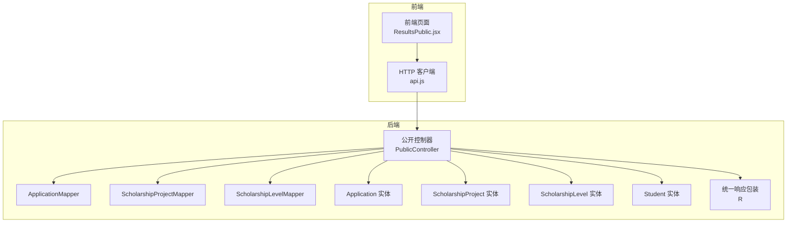
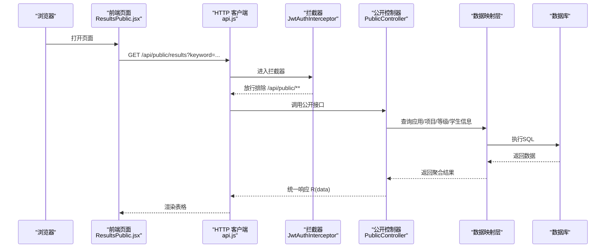
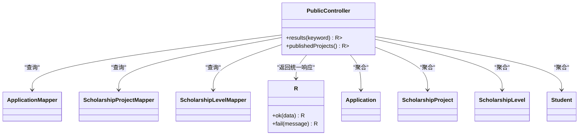

# 公开接口

<cite>
**本文引用的文件**
- [PublicController.java](file://backend/src/main/java/com/zjsu/scholarship/controller/PublicController.java)
- [R.java](file://backend/src/main/java/com/zjsu/scholarship/common/R.java)
- [WebMvcConfig.java](file://backend/src/main/java/com/zjsu/scholarship/config/WebMvcConfig.java)
- [JwtAuthInterceptor.java](file://backend/src/main/java/com/zjsu/scholarship/security/JwtAuthInterceptor.java)
- [Application.java](file://backend/src/main/java/com/zjsu/scholarship/entity/Application.java)
- [ScholarshipProject.java](file://backend/src/main/java/com/zjsu/scholarship/entity/ScholarshipProject.java)
- [ScholarshipLevel.java](file://backend/src/main/java/com/zjsu/scholarship/entity/ScholarshipLevel.java)
- [Student.java](file://backend/src/main/java/com/zjsu/scholarship/entity/Student.java)
- [ApplicationMapper.java](file://backend/src/main/java/com/zjsu/scholarship/mapper/ApplicationMapper.java)
- [ScholarshipProjectMapper.java](file://backend/src/main/java/com/zjsu/scholarship/mapper/ScholarshipProjectMapper.java)
- [ScholarshipLevelMapper.java](file://backend/src/main/java/com/zjsu/scholarship/mapper/ScholarshipLevelMapper.java)
- [ResultsPublic.jsx](file://frontend/src/pages/ResultsPublic.jsx)
- [api.js](file://frontend/src/api.js)
- [application.yml](file://backend/src/main/resources/application.yml)
- [schema.sql](file://backend/src/main/resources/db/schema.sql)
</cite>

## 目录
1. [简介](#简介)
2. [项目结构](#项目结构)
3. [核心组件](#核心组件)
4. [架构概览](#架构概览)
5. [详细组件分析](#详细组件分析)
6. [依赖分析](#依赖分析)
7. [性能考虑](#性能考虑)
8. [故障排查指南](#故障排查指南)
9. [结论](#结论)
10. [附录](#附录)

## 简介
本文件面向“公开接口”的API文档，聚焦系统中无需认证即可访问的公共接口，包括：
- 奖学金结果的公开查询接口
- 奖学金项目的公开查询接口

这些接口用于对外展示系统中的公开信息，例如获奖名单、项目信息等。文档将说明接口的访问限制与数据权限、可公开访问的信息范围、调用示例与响应格式，并给出安全考虑、隐私保护措施以及缓存与性能优化建议。

## 项目结构
公开接口位于后端控制器层，通过统一的REST风格路径暴露；前端页面通过封装的HTTP客户端进行调用；拦截器配置排除了公开接口的鉴权拦截，确保匿名访问。

图表来源
- [PublicController.java:1-78](file://backend/src/main/java/com/zjsu/scholarship/controller/PublicController.java#L1-L78)
- [ResultsPublic.jsx:1-41](file://frontend/src/pages/ResultsPublic.jsx#L1-L41)
- [api.js:1-44](file://frontend/src/api.js#L1-L44)

章节来源
- [PublicController.java:1-78](file://backend/src/main/java/com/zjsu/scholarship/controller/PublicController.java#L1-L78)
- [WebMvcConfig.java:23-31](file://backend/src/main/java/com/zjsu/scholarship/config/WebMvcConfig.java#L23-L31)
- [ResultsPublic.jsx:1-41](file://frontend/src/pages/ResultsPublic.jsx#L1-L41)
- [api.js:1-44](file://frontend/src/api.js#L1-L44)

## 核心组件
- 公开控制器 PublicController：提供 /api/public 下的公开接口，不依赖JWT认证。
- 统一响应包装 R：所有接口返回统一结构，包含 code、message、data 字段。
- 前端 ResultsPublic 页面与 api.js 客户端：负责调用公开接口并渲染结果。
- 数据映射与实体：Application、ScholarshipProject、ScholarshipLevel、Student 及其 Mapper。

章节来源
- [PublicController.java:11-26](file://backend/src/main/java/com/zjsu/scholarship/controller/PublicController.java#L11-L26)
- [R.java:3-38](file://backend/src/main/java/com/zjsu/scholarship/common/R.java#L3-L38)
- [ResultsPublic.jsx:6-12](file://frontend/src/pages/ResultsPublic.jsx#L6-L12)
- [api.js:5-8](file://frontend/src/api.js#L5-L8)

## 架构概览
公开接口的访问链路如下：
- 前端页面通过 api.js 发起 GET 请求到 /api/public/results 或 /api/public/projects
- WebMvc 配置排除 /api/public/** 的鉴权拦截，允许匿名访问
- 控制器根据参数查询数据库，组装公开字段并返回统一响应

图表来源
- [WebMvcConfig.java:23-31](file://backend/src/main/java/com/zjsu/scholarship/config/WebMvcConfig.java#L23-L31)
- [JwtAuthInterceptor.java:20-28](file://backend/src/main/java/com/zjsu/scholarship/security/JwtAuthInterceptor.java#L20-L28)
- [PublicController.java:28-59](file://backend/src/main/java/com/zjsu/scholarship/controller/PublicController.java#L28-L59)

## 详细组件分析

### 接口清单与规范

- 接口：公开结果查询
  - 方法：GET
  - 路径：/api/public/results
  - 认证：无需
  - 参数：
    - keyword（可选）：支持按学号、姓名、项目名称模糊检索
  - 响应：统一结构 R，data 为数组，元素字段见下表

- 接口：公开项目查询
  - 方法：GET
  - 路径：/api/public/projects
  - 认证：无需
  - 参数：无
  - 响应：统一结构 R，data 为数组，元素字段见下表

章节来源
- [PublicController.java:28-59](file://backend/src/main/java/com/zjsu/scholarship/controller/PublicController.java#L28-L59)
- [PublicController.java:61-76](file://backend/src/main/java/com/zjsu/scholarship/controller/PublicController.java#L61-L76)
- [R.java:16-26](file://backend/src/main/java/com/zjsu/scholarship/common/R.java#L16-L26)

### 响应数据模型

- 公开结果列表项（/api/public/results）
  - 字段：
    - studentNo：学号
    - name：姓名
    - college：学院
    - major：专业
    - projectName：项目名称
    - levelName：等级名称
    - amount：金额
    - basicTotal：基本分快照
    - abilityTotal：能力分快照
    - basicRank：基本分排名快照
    - abilityRank：能力分排名快照

- 公开项目列表项（/api/public/projects）
  - 字段：
    - project：ScholarshipProject 对象
    - levels：该项目的等级列表（ScholarshipLevel[]）

章节来源
- [PublicController.java:44-56](file://backend/src/main/java/com/zjsu/scholarship/controller/PublicController.java#L44-L56)
- [PublicController.java:68-74](file://backend/src/main/java/com/zjsu/scholarship/controller/PublicController.java#L68-L74)
- [Application.java:14-42](file://backend/src/main/java/com/zjsu/scholarship/entity/Application.java#L14-L42)
- [ScholarshipProject.java:14-49](file://backend/src/main/java/com/zjsu/scholarship/entity/ScholarshipProject.java#L14-L49)
- [ScholarshipLevel.java:12-25](file://backend/src/main/java/com/zjsu/scholarship/entity/ScholarshipLevel.java#L12-L25)
- [Student.java:10-32](file://backend/src/main/java/com/zjsu/scholarship/entity/Student.java#L10-L32)

### 访问限制与数据权限
- 访问限制：
  - 公开接口无需认证头，直接放行
  - WebMvc 配置明确排除 /api/public/** 的鉴权拦截
- 数据权限：
  - 结果查询仅返回已批准/已发布状态的应用，并聚合公开字段
  - 项目查询返回已发布/评审中/开放状态的项目及其等级
  - 不涉及个人隐私信息（如身份证、联系方式等），仅展示公开信息

章节来源
- [WebMvcConfig.java:27-30](file://backend/src/main/java/com/zjsu/scholarship/config/WebMvcConfig.java#L27-L30)
- [PublicController.java:30-31](file://backend/src/main/java/com/zjsu/scholarship/controller/PublicController.java#L30-L31)
- [PublicController.java:63-65](file://backend/src/main/java/com/zjsu/scholarship/controller/PublicController.java#L63-L65)

### 调用示例与前端集成
- 前端调用示例（ResultsPublic.jsx）：
  - 加载：在组件挂载时调用 /api/public/results
  - 搜索：支持 keyword 参数进行模糊检索
  - 渲染：使用 Ant Design 表格展示结果
- 前端 HTTP 客户端（api.js）：
  - 基础路径：/api
  - 自动附加 Authorization 头（仅在登录后），公开接口不受影响

章节来源
- [ResultsPublic.jsx:11](file://frontend/src/pages/ResultsPublic.jsx#L11)
- [api.js:5-8](file://frontend/src/api.js#L5-L8)

### 错误处理与统一响应
- 统一响应结构：
  - code：整数，0 表示成功，非 0 表示错误
  - message：字符串，错误信息
  - data：任意类型，实际数据
- 前端错误处理：
  - 当 code 非 0 时，弹出错误提示并拒绝 Promise
  - 401 特殊处理：触发登出与跳转

章节来源
- [R.java:3-38](file://backend/src/main/java/com/zjsu/scholarship/common/R.java#L3-L38)
- [api.js:18-41](file://frontend/src/api.js#L18-L41)

## 依赖分析
公开接口的依赖关系如下：

图表来源
- [PublicController.java:15-26](file://backend/src/main/java/com/zjsu/scholarship/controller/PublicController.java#L15-L26)
- [ApplicationMapper.java:1-8](file://backend/src/main/java/com/zjsu/scholarship/mapper/ApplicationMapper.java#L1-L8)
- [ScholarshipProjectMapper.java:1-8](file://backend/src/main/java/com/zjsu/scholarship/mapper/ScholarshipProjectMapper.java#L1-L8)
- [ScholarshipLevelMapper.java:1-8](file://backend/src/main/java/com/zjsu/scholarship/mapper/ScholarshipLevelMapper.java#L1-L8)
- [R.java:16-26](file://backend/src/main/java/com/zjsu/scholarship/common/R.java#L16-L26)

章节来源
- [PublicController.java:15-26](file://backend/src/main/java/com/zjsu/scholarship/controller/PublicController.java#L15-L26)

## 性能考虑
- 查询逻辑
  - 结果查询：先筛选 APPROVED/PUBLISHED 的应用，再逐条关联学生、项目、等级，最后按 keyword 进行内存过滤
  - 项目查询：查询项目及对应等级，按 ID 倒序返回
- 性能建议
  - 在数据库层面为相关字段建立索引（如应用状态、项目状态、项目ID、学生ID等）
  - 对于高频查询，可在应用层引入只读副本或缓存（见“缓存策略”）
  - 前端分页或限制返回数量，避免一次性返回大量数据
- 缓存策略
  - 项目列表：可缓存一段时间（如 5 分钟），以降低数据库压力
  - 结果列表：因数据更新频繁且需实时展示，建议短时缓存或不缓存，必要时采用“写后失效”
  - 缓存键：可基于时间戳或版本号，结合 keyword 参数生成
- 前端优化
  - 使用虚拟滚动展示长列表
  - 搜索采用防抖，减少请求频率

[本节为通用性能建议，不直接分析具体文件]

## 故障排查指南
- 常见问题
  - 401 未授权：通常出现在需要认证的接口或拦截器生效时，公开接口不会返回 401
  - 403 权限不足：公开接口不会出现此错误
  - 业务错误：当返回 code 非 0 时，message 中会包含错误原因
- 前端错误处理
  - api.js 对响应进行统一处理，遇到非 0 code 会弹出错误提示
  - 401 时自动登出并跳转至登录页
- 后端拦截器
  - JwtAuthInterceptor 会对非公开路径进行 JWT 校验，公开路径会被明确放行

章节来源
- [api.js:18-41](file://frontend/src/api.js#L18-L41)
- [WebMvcConfig.java:27-30](file://backend/src/main/java/com/zjsu/scholarship/config/WebMvcConfig.java#L27-L30)
- [JwtAuthInterceptor.java:20-28](file://backend/src/main/java/com/zjsu/scholarship/security/JwtAuthInterceptor.java#L20-L28)

## 结论
公开接口为系统提供了透明、可访问的信息展示能力，覆盖结果查询与项目查询两大场景。通过统一响应结构与前端友好封装，既保证了易用性，也便于扩展。在部署生产环境时，建议结合数据库索引、缓存与前端优化策略，进一步提升性能与用户体验。

[本节为总结性内容，不直接分析具体文件]

## 附录

### 接口定义一览

- 公开结果查询
  - 方法：GET
  - 路径：/api/public/results
  - 参数：
    - keyword（可选）：学号/姓名/项目名称
  - 响应：R<List<Map>>

- 公开项目查询
  - 方法：GET
  - 路径：/api/public/projects
  - 参数：无
  - 响应：R<List<Map>>

章节来源
- [PublicController.java:28-59](file://backend/src/main/java/com/zjsu/scholarship/controller/PublicController.java#L28-L59)
- [PublicController.java:61-76](file://backend/src/main/java/com/zjsu/scholarship/controller/PublicController.java#L61-L76)

### 数据模型与字段说明

- Application（应用）
  - 关键字段：status、studentId、projectId、finalLevelId、snapshotBasicTotal、snapshotAbilityTotal、snapshotBasicRank、snapshotAbilityRank
- ScholarshipProject（项目）
  - 关键字段：status、projectName、typeCode、applyStartAt、applyEndAt
- ScholarshipLevel（等级）
  - 关键字段：levelName、levelOrder、amount、ratio、quota
- Student（学生）
  - 关键字段：studentNo、name、college、major

章节来源
- [Application.java:14-42](file://backend/src/main/java/com/zjsu/scholarship/entity/Application.java#L14-L42)
- [ScholarshipProject.java:14-49](file://backend/src/main/java/com/zjsu/scholarship/entity/ScholarshipProject.java#L14-L49)
- [ScholarshipLevel.java:12-25](file://backend/src/main/java/com/zjsu/scholarship/entity/ScholarshipLevel.java#L12-L25)
- [Student.java:10-32](file://backend/src/main/java/com/zjsu/scholarship/entity/Student.java#L10-L32)

### 安全与隐私保护
- 公开接口仅返回公开字段，不涉及个人敏感信息
- 生产环境建议：
  - 限制公开接口的并发与速率，防止滥用
  - 对高频访问的接口增加缓存，降低数据库压力
  - 日志脱敏，避免记录敏感字段
  - 使用 HTTPS 与 CDN 加速，提升安全性与性能

[本节为通用安全建议，不直接分析具体文件]