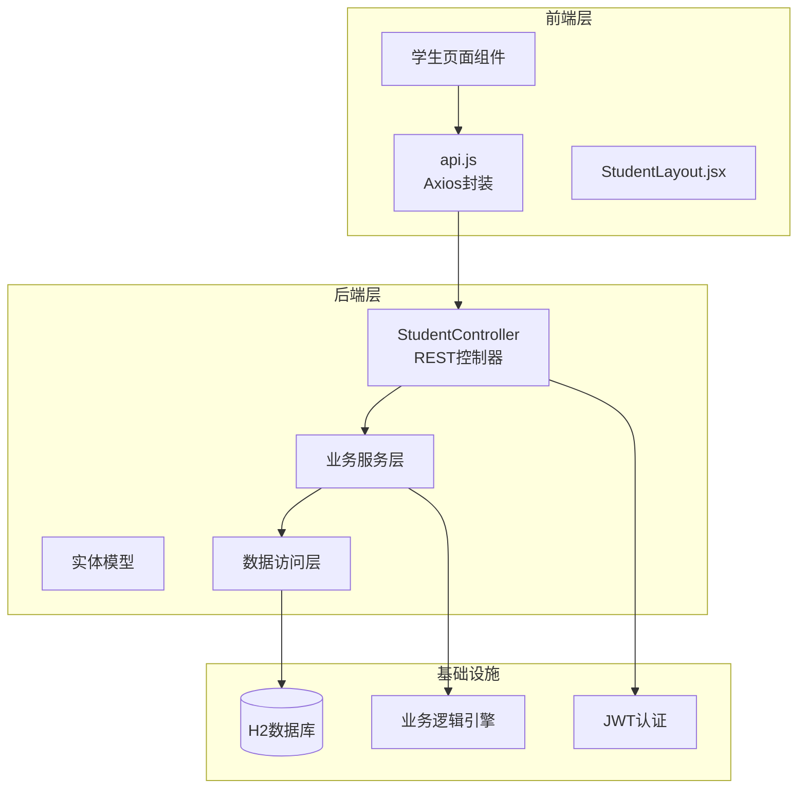
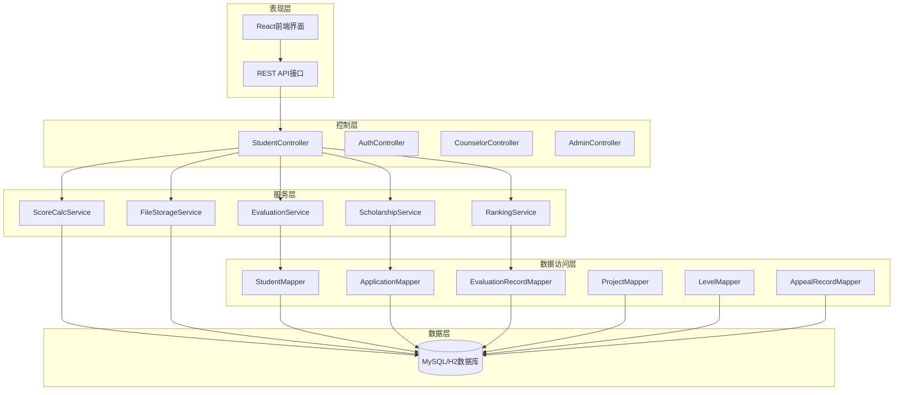

# 学生接口

<cite>
**本文档引用的文件**
- [StudentController.java](file://backend/src/main/java/com/zjsu/scholarship/controller/StudentController.java)
- [Student.java](file://backend/src/main/java/com/zjsu/scholarship/entity/Student.java)
- [Application.java](file://backend/src/main/java/com/zjsu/scholarship/entity/Application.java)
- [AppealRecord.java](file://backend/src/main/java/com/zjsu/scholarship/entity/AppealRecord.java)
- [ScholarshipService.java](file://backend/src/main/java/com/zjsu/scholarship/service/ScholarshipService.java)
- [ScoreCalcService.java](file://backend/src/main/java/com/zjsu/scholarship/service/ScoreCalcService.java)
- [RankingService.java](file://backend/src/main/java/com/zjsu/scholarship/service/RankingService.java)
- [MoralAppraisal.java](file://backend/src/main/java/com/zjsu/scholarship/entity/MoralAppraisal.java)
- [ResearchInnovationItem.java](file://backend/src/main/java/com/zjsu/scholarship/entity/ResearchInnovationItem.java)
- [RequireRole.java](file://backend/src/main/java/com/zjsu/scholarship/security/RequireRole.java)
- [api.js](file://frontend/src/api.js)
- [Applications.jsx](file://frontend/src/pages/student/Applications.jsx)
- [Appeal.jsx](file://frontend/src/pages/student/Appeal.jsx)
- [README.md](file://README.md)
</cite>

## 目录
1. [简介](#简介)
2. [项目结构](#项目结构)
3. [核心组件](#核心组件)
4. [架构概览](#架构概览)
5. [详细组件分析](#详细组件分析)
6. [依赖关系分析](#依赖关系分析)
7. [性能考虑](#性能考虑)
8. [故障排除指南](#故障排除指南)
9. [结论](#结论)

## 简介

学生接口是奖学金管理系统的核心功能模块，专为学生用户设计，提供完整的个人信息管理、奖学金申请、成绩申诉、综合测评等功能。该系统基于《浙江工商大学学生素质评价办法》(2025版) 和《浙江工商大学奖学金实施办法》(2025版) 开发，采用前后端分离架构，使用Spring Boot + React技术栈构建。

系统主要功能包括：
- 学生基本信息管理（增删改查）
- 综合测评填报（品德评议、品德记实、综合能力各模块）
- 奖学金申请与状态查询
- 成绩申诉处理
- 评分计算与排名管理
- 能力突出奖学金自动判定

## 项目结构

奖学金管理系统采用标准的分层架构设计，后端使用Spring Boot框架，前端使用React技术栈。



**图表来源**
- [StudentController.java:1-25](file://backend/src/main/java/com/zjsu/scholarship/controller/StudentController.java#L1-L25)
- [api.js:1-44](file://frontend/src/api.js#L1-L44)

**章节来源**
- [README.md:123-154](file://README.md#L123-L154)

## 核心组件

### 学生控制器（StudentController）

学生控制器是系统的核心入口，负责处理所有学生相关的API请求。该控制器使用`@RequireRole("STUDENT")`注解确保只有学生角色可以访问。

主要职责：
- 学生基本信息管理
- 综合测评数据管理
- 奖学金申请管理
- 申诉记录管理
- 评分计算与排名查询

### 评分计算引擎（ScoreCalcService）

评分计算引擎实现了2025版规则的完整评分算法，包括：
- 品德评议分计算（自评×5% + 学生代表×60% + 辅导员×35%）
- 品德记实分计算（基准60分 + 荣誉加分 - 处分扣分）
- 专业素质加权平均分计算
- 综合能力各模块评分计算

### 排名服务（RankingService）

排名服务负责奖学金等级分配和排名计算，实现双排名机制：
- 基本项排名（专业素质×70% + 品德总分×30%）
- 综合能力排名（75 + 各模块加权）
- 等级分配算法（一等3%、二等6%、三等12%）

### 奖学金服务（ScholarshipService）

奖学金服务提供专项奖学金功能：
- 能力突出奖学金自动判定
- 考研奖学金申报
- 申报限制校验
- 奖金发放规则计算

**章节来源**
- [StudentController.java:22-86](file://backend/src/main/java/com/zjsu/scholarship/controller/StudentController.java#L22-L86)
- [ScoreCalcService.java:18-423](file://backend/src/main/java/com/zjsu/scholarship/service/ScoreCalcService.java#L18-L423)
- [RankingService.java:25-437](file://backend/src/main/java/com/zjsu/scholarship/service/RankingService.java#L25-L437)
- [ScholarshipService.java:21-280](file://backend/src/main/java/com/zjsu/scholarship/service/ScholarshipService.java#L21-L280)

## 架构概览

系统采用分层架构设计，确保关注点分离和代码可维护性。



**图表来源**
- [StudentController.java:48-86](file://backend/src/main/java/com/zjsu/scholarship/controller/StudentController.java#L48-L86)
- [ScholarshipService.java:33-49](file://backend/src/main/java/com/zjsu/scholarship/service/ScholarshipService.java#L33-L49)

## 详细组件分析

### 学生基本信息管理

#### 获取学生信息接口

**接口定义**
- 方法：GET
- 路径：`/api/student/me`
- 权限：STUDENT

**功能说明**
获取当前登录学生的完整信息，包括基本信息、当前学年和综合测评记录。

**请求参数**
- 无

**响应数据结构**
```json
{
  "student": {
    "id": 1,
    "userId": 1,
    "studentNo": "20231001",
    "name": "张明",
    "gender": "男",
    "college": "信息与电子工程学院",
    "major": "人工智能",
    "grade": "2023",
    "className": "1班",
    "dormNo": "3-301",
    "cet4Score": 520,
    "cet6Score": 480,
    "peScore": 85.5,
    "laborEvaluation": "PASS",
    "peExempt": false
  },
  "year": {
    "id": 1,
    "yearName": "2025-2026",
    "startDate": "2025-09-01",
    "endDate": "2026-06-30",
    "status": "ACTIVE"
  },
  "evaluation": {
    "id": 1,
    "studentId": 1,
    "academicYearId": 1,
    "basicTotal": 85.6,
    "abilityTotal": 78.9,
    "basicRank": 15,
    "abilityRank": 23,
    "status": "SUBMITTED"
  }
}
```

**业务逻辑**
1. 从认证上下文中获取当前学生账户
2. 查询当前激活的学年
3. 查找或创建综合测评记录
4. 返回包含学生信息、学年信息和测评记录的组合数据

**数据验证规则**
- 学生档案必须存在
- 当前必须有有效的学年
- 综合测评记录可自动创建

**章节来源**
- [StudentController.java:113-123](file://backend/src/main/java/com/zjsu/scholarship/controller/StudentController.java#L113-L123)

#### 综合测评数据获取接口

**接口定义**
- 方法：GET
- 路径：`/api/student/evaluation/items`
- 权限：STUDENT

**功能说明**
获取综合测评填报所需的所有数据，包括品德评议、品德记实、课程成绩和综合能力各模块数据。

**请求参数**
- 无

**响应数据结构**
```json
{
  "evaluation": {
    "id": 1,
    "studentId": 1,
    "academicYearId": 1,
    "basicTotal": 85.6,
    "abilityTotal": 78.9,
    "basicRank": 15,
    "abilityRank": 23
  },
  "appraisals": [...],           // 品德评议列表
  "moralRecords": [...],         // 品德记实列表
  "courses": [...],              // 课程成绩列表
  "riItems": [...],              // 研究创新项目列表
  "psItems": [...],              // 专业技能项目列表
  "owItems": [...],              // 组织工作项目列表
  "saItems": [...],              // 体育美育项目列表
  "lpItems": [...],              // 劳动实践项目列表
  "totalScore": 164.5            // 总分（由前端计算）
}
```

**业务逻辑**
1. 获取当前学年和综合测评记录
2. 查询各类测评数据（品德、能力各模块）
3. 按时间倒序排列某些数据（如品德记实）
4. 返回完整的数据集合供前端展示

**数据验证规则**
- 必须有当前激活的学年
- 每个模块的数据都可能为空数组

**章节来源**
- [StudentController.java:126-162](file://backend/src/main/java/com/zjsu/scholarship/controller/StudentController.java#L126-L162)

### 品德评议管理

#### 品德评议新增接口

**接口定义**
- 方法：POST
- 路径：`/api/student/evaluation/appraisals`
- 权限：STUDENT

**功能说明**
新增一条品德评议记录，系统自动计算六维总分并更新基本分。

**请求参数**
```json
{
  "appraiserType": "SELF",           // 评议人类型：SELF/STUDENT_REP/COUNSELOR
  "politicalLiteracy": 18.5,         // 政治素养
  "legalAwareness": 17.0,            // 法治观念  
  "mentalQuality": 19.0,             // 心理素质
  "integrityScore": 20.0,            // 诚实守信
  "teamwork": 18.5,                  // 团队协作
  "socialResponsibility": 19.5,      // 社会责任
  "createdAt": "2025-09-15T10:30:00"
}
```

**响应数据结构**
返回新增的品德评议记录，包含自动生成的总分。

**业务逻辑**
1. 获取当前学生和学年信息
2. 查找或创建综合测评记录
3. 设置评估记录的所属测评记录ID
4. 计算六维总分（每维0-20分）
5. 更新基本分（需要重新计算）

**数据验证规则**
- 六维分数必须在0-20范围内
- 评议人类型必须为指定枚举值之一
- 自动设置创建时间和评估记录ID

**章节来源**
- [StudentController.java:186-197](file://backend/src/main/java/com/zjsu/scholarship/controller/StudentController.java#L186-L197)

#### 品德评议更新接口

**接口定义**
- 方法：PUT
- 路径：`/api/student/evaluation/appraisals/{id}`
- 权限：STUDENT

**功能说明**
更新现有的品德评议记录，支持修改六维评分。

**请求参数**
与新增接口相同，但需要提供记录ID。

**业务逻辑**
1. 验证记录存在性和归属关系
2. 设置更新参数（保持评估记录ID不变）
3. 重新计算六维总分
4. 更新基本分

**数据验证规则**
- 只能修改自己创建的记录
- 已审核通过的记录不可修改

**章节来源**
- [StudentController.java:199-212](file://backend/src/main/java/com/zjsu/scholarship/controller/StudentController.java#L199-L212)

### 品德记实管理

#### 品德记实新增接口

**接口定义**
- 方法：POST
- 路径：`/api/student/evaluation/moral-records`
- 权限：STUDENT

**功能说明**
新增品德记实记录，系统根据记录类型自动计算加分或扣分。

**请求参数**
```json
{
  "itemType": "VOLUNTEER",           // 记实类型：VOLUNTEER/ DISCIPLINE/ HONOR/ COLLECTIVE_HONOR
  "hours": 24,                       // 志愿服务时长（小时）
  "honorLevel": "NATIONAL",          // 荣誉级别：NATIONAL/PROVINCIAL/CITY/SCHOOL/COLLEGE
  "rawValue": 15,                    // 原始分数（可选）
  "description": "参与山区支教活动"
}
```

**响应数据结构**
返回新增的品德记实记录，包含自动计算的分数。

**业务逻辑**
1. 根据不同类型计算分数：
   - 志愿服务：每4小时4分，最多10分
   - 处分：负分值（根据级别）
   - 荣誉：按级别给分
   - 集体荣誉：按级别给分
2. 设置默认状态为"PENDING"
3. 更新基本分

**数据验证规则**
- 不同类型的字段约束不同
- 总加分不超过20分（院班活动）
- 集体荣誉加分不超过20分

**章节来源**
- [StudentController.java:215-228](file://backend/src/main/java/com/zjsu/scholarship/controller/StudentController.java#L215-L228)

#### 品德记实更新接口

**接口定义**
- 方法：PUT
- 路径：`/api/student/evaluation/moral-records/{id}`
- 权限：STUDENT

**功能说明**
更新品德记实记录，支持修改但不能修改已审核通过的记录。

**业务逻辑**
1. 验证记录存在性和归属关系
2. 检查记录状态（已审核通过不可修改）
3. 重新计算分数
4. 更新基本分

**数据验证规则**
- 已审核通过的记录不可修改
- 修改后状态重置为"PENDING"

**章节来源**
- [StudentController.java:230-248](file://backend/src/main/java/com/zjsu/scholarship/controller/StudentController.java#L230-L248)

#### 品德记实删除接口

**接口定义**
- 方法：DELETE
- 路径：`/api/student/evaluation/moral-records/{id}`
- 权限：STUDENT

**功能说明**
删除品德记实记录，已审核通过的记录不可删除。

**业务逻辑**
1. 验证记录存在性和归属关系
2. 检查记录状态（已审核通过不可删除）
3. 删除记录并更新基本分

**数据验证规则**
- 已审核通过的记录不可删除
- 删除后自动重新计算基本分

**章节来源**
- [StudentController.java:250-262](file://backend/src/main/java/com/zjsu/scholarship/controller/StudentController.java#L250-L262)

### 综合能力模块管理

系统提供五个综合能力模块，每个模块都有相似的CRUD操作模式：

#### 研究创新模块

**接口定义**
- 新增：POST `/api/student/evaluation/ri-items`
- 更新：PUT `/api/student/evaluation/ri-items/{id}`
- 删除：DELETE `/api/student/evaluation/ri-items/{id}`

**评分规则**
- 竞赛：按级别和奖项给分，A类竞赛系数1.2，B类1.0，C类0.5
- 论文：SCI Q1-Q4分别80-30分，CSSCI 40分
- 专利：发明50分，实用新型17分，外观设计13分
- 项目：按级别和状态给分（批准/结题/逾期）

**章节来源**
- [StudentController.java:264-279](file://backend/src/main/java/com/zjsu/scholarship/controller/StudentController.java#L264-L279)
- [ScoreCalcService.java:184-262](file://backend/src/main/java/com/zjsu/scholarship/service/ScoreCalcService.java#L184-L262)

#### 专业技能模块

**接口定义**
- 新增：POST `/api/student/evaluation/ps-items`
- 更新：PUT `/api/student/evaluation/ps-items/{id}`
- 删除：DELETE `/api/student/evaluation/ps-items/{id}`

**评分规则**
- CET4：≥550分10分，≥425分6分
- CET6：≥520分15分，≥425分12分
- 计算机等级：三级10分，二级6分
- 职业证书：高级30分，中级20分，初级10分
- 入学考试：12分

**章节来源**
- [StudentController.java:280-320](file://backend/src/main/java/com/zjsu/scholarship/controller/StudentController.java#L280-L320)
- [ScoreCalcService.java:292-324](file://backend/src/main/java/com/zjsu/scholarship/service/ScoreCalcService.java#L292-L324)

#### 组织工作模块

**接口定义**
- 新增：POST `/api/student/evaluation/ow-items`
- 更新：PUT `/api/student/evaluation/ow-items/{id}`
- 删除：DELETE `/api/student/evaluation/ow-items/{id}`

**评分规则**
- 岗位分 + 绩效分，按任期系数计算
- 任期<6个月：0分
- 6-12个月：50%
- >12个月：100%
- 不称职=0分

**章节来源**
- [StudentController.java:321-360](file://backend/src/main/java/com/zjsu/scholarship/controller/StudentController.java#L321-L360)
- [ScoreCalcService.java:326-342](file://backend/src/main/java/com/zjsu/scholarship/service/ScoreCalcService.java#L326-L342)

#### 体育美育模块

**接口定义**
- 新增：POST `/api/student/evaluation/sa-items`
- 更新：PUT `/api/student/evaluation/sa-items/{id}`
- 删除：DELETE `/api/student/evaluation/sa-items/{id}`

**评分规则**
- 竞赛级别：国家级50分，省级30分，市级18分，校级12分，院级5分
- 奖项：一等奖50%，二等奖35%，三等奖25%
- 团队系数：核心成员0.8，普通成员0.5

**章节来源**
- [StudentController.java:362-401](file://backend/src/main/java/com/zjsu/scholarship/controller/StudentController.java#L362-L401)
- [ScoreCalcService.java:344-371](file://backend/src/main/java/com/zjsu/scholarship/service/ScoreCalcService.java#L344-L371)

#### 劳动实践模块

**接口定义**
- 新增：POST `/api/student/evaluation/lp-items`
- 更新：PUT `/api/student/evaluation/lp-items/{id}`
- 删除：DELETE `/api/student/evaluation/lp-items/{id}`

**评分规则**
- 与体育美育相同的竞赛评分体系
- 团队系数同样适用

**章节来源**
- [StudentController.java:403-442](file://backend/src/main/java/com/zjsu/scholarship/controller/StudentController.java#L403-L442)
- [ScoreCalcService.java:359-371](file://backend/src/main/java/com/zjsu/scholarship/service/ScoreCalcService.java#L359-L371)

### 奖学金申请管理

#### 查询可申请项目接口

**接口定义**
- 方法：GET
- 路径：`/api/student/scholarships/eligible`
- 权限：STUDENT

**功能说明**
查询当前学年开放的奖学金项目，包括每个项目的等级配置、推荐等级、资格检查结果等。

**请求参数**
- 无

**响应数据结构**
```json
[
  {
    "project": {
      "id": 1,
      "projectName": "优秀学生综合奖学金",
      "typeCode": "COMPREHENSIVE",
      "status": "OPEN"
    },
    "levels": [
      {
        "id": 1,
        "levelName": "一等奖",
        "levelOrder": 1,
        "ratio": 3.0,
        "quota": 15
      },
      {
        "id": 2,
        "levelName": "二等奖",
        "levelOrder": 2,
        "ratio": 6.0,
        "quota": 30
      }
    ],
    "recommendLevelId": 1,
    "eligibilityCheck": null,
    "application": null,
    "evaluation": {
      "basicTotal": 85.6,
      "abilityTotal": 78.9,
      "basicRank": 15,
      "abilityRank": 23
    }
  }
]
```

**业务逻辑**
1. 获取当前激活的学年
2. 查询所有开放状态的奖学金项目
3. 对每个项目计算推荐等级和资格检查
4. 检查学生是否已申请过该项目

**数据验证规则**
- 只显示状态为OPEN、REVIEWING、PUBLISHED的项目
- 如果已申请过该项目，会在application字段中返回

**章节来源**
- [StudentController.java:516-547](file://backend/src/main/java/com/zjsu/scholarship/controller/StudentController.java#L516-L547)

#### 提交奖学金申请接口

**接口定义**
- 方法：POST
- 路径：`/api/student/applications`
- 权限：STUDENT

**功能说明**
提交奖学金申请，系统进行多重验证后创建申请记录。

**请求参数**
```json
{
  "projectId": 1,                    // 奖学金项目ID
  "applicationCategory": "ABILITY"   // 申请类别：ABILITY/COMPREHENSIVE/SPECIAL/GRADUATE_EXAM/NAMED
}
```

**业务逻辑**
1. 验证项目存在且处于开放状态
2. 检查学生是否已申请过该项目
3. 获取当前学年和综合测评记录
4. 执行资格检查（硬性条件校验）
5. 检查申报限制（每类限报一项）
6. 创建申请记录并设置快照数据

**数据验证规则**
- 项目必须在开放期内
- 学生每类只能申请一次（综合奖学金除外）
- 必须满足硬性条件（均分≥75、体育≥80、劳动合格等）

**章节来源**
- [StudentController.java:549-589](file://backend/src/main/java/com/zjsu/scholarship/controller/StudentController.java#L549-L589)

#### 查询我的申请接口

**接口定义**
- 方法：GET
- 路径：`/api/student/applications`
- 权限：STUDENT

**功能说明**
查询当前学生的所有奖学金申请记录，包括项目信息、等级信息和状态。

**请求参数**
- 无

**响应数据结构**
```json
[
  {
    "application": {
      "id": 1,
      "studentId": 1,
      "projectId": 1,
      "status": "SUBMITTED",
      "submittedAt": "2025-09-20T14:30:00"
    },
    "project": {
      "projectName": "优秀学生综合奖学金",
      "typeCode": "COMPREHENSIVE"
    },
    "autoLevel": {
      "levelName": "一等奖",
      "levelOrder": 1
    },
    "finalLevel": null
  }
]
```

**业务逻辑**
1. 查询当前学生的所有申请记录
2. 关联查询项目信息
3. 关联查询推荐等级和最终授予等级

**数据验证规则**
- 只能查看自己的申请记录
- 按提交时间倒序排列

**章节来源**
- [StudentController.java:591-607](file://backend/src/main/java/com/zjsu/scholarship/controller/StudentController.java#L591-L607)

#### 撤销申请接口

**接口定义**
- 方法：DELETE
- 路径：`/api/student/applications/{id}`
- 权限：STUDENT

**功能说明**
撤销已提交但未审核的奖学金申请。

**请求参数**
- 路径参数：申请ID

**业务逻辑**
1. 验证申请存在且属于当前学生
2. 检查申请状态必须为SUBMITTED
3. 删除申请记录

**数据验证规则**
- 只能撤销未审核的申请
- 已审核或已发布的申请不可撤销

**章节来源**
- [StudentController.java:609-620](file://backend/src/main/java/com/zjsu/scholarship/controller/StudentController.java#L609-L620)

### 专项奖学金功能

#### 能力突出奖学金资格查询

**接口定义**
- 方法：GET
- 路径：`/api/student/ability-scholarship/eligibility`
- 权限：STUDENT

**功能说明**
查询学生是否具备申请能力突出奖学金的资格。

**请求参数**
- 无

**响应数据结构**
```json
{
  "eligibility": {
    "learningExcellence": true,           // 学习优秀奖资格
    "abilityOutstanding": false,          // 综合能力突出奖资格
    "researchInnovation": true,           // 研究创新奖资格
    "learningExcellenceReason": "专业素质排名第15名（进入前20%）",
    "abilityOutstandingReason": null,
    "researchInnovationReason": "学科竞赛 NATIONAL THIRD，排名2",
    "alreadyHasComprehensive": false,     // 是否已获得综合奖学金
    "message": "可申报：学习优秀奖、研究创新奖（每人限报一项）"
  },
  "student": {
    "name": "张明",
    "studentNo": "20231001"
  }
}
```

**业务逻辑**
1. 检查是否已获得综合奖学金
2. 计算基本项和能力项排名前20%
3. 检查研究创新条件（竞赛或论文）
4. 生成资格报告

**数据验证规则**
- 已获得综合奖学金的学生不可申请能力突出奖学金
- 每人只能申请一种能力突出奖学金

**章节来源**
- [StudentController.java:624-634](file://backend/src/main/java/com/zjsu/scholarship/controller/StudentController.java#L624-L634)

#### 考研奖学金申请

**接口定义**
- 方法：POST
- 路径：`/api/student/graduate-exam`
- 权限：STUDENT

**功能说明**
提交考研奖学金申请，系统根据录取情况自动分级。

**请求参数**
```json
{
  "isAdmitted": true,                // 是否被录取
  "hasInterviewQualification": false, // 是否有面试资格
  "admitSchool": "清华大学",         // 录取学校
  "admitMajor": "计算机科学",        // 录取专业
  "admitDate": "2025-06-15"
}
```

**业务逻辑**
1. 检查本学年是否已提交过申请
2. 根据录取情况自动确定最终等级
3. 创建申请记录

**数据验证规则**
- 每学年只能提交一次
- 自动分级：被录取=一等奖，有面试资格=二等奖

**章节来源**
- [StudentController.java:638-649](file://backend/src/main/java/com/zjsu/scholarship/controller/StudentController.java#L638-L649)

#### 考研奖学金状态查询

**接口定义**
- 方法：GET
- 路径：`/api/student/graduate-exam`
- 权限：STUDENT

**功能说明**
查询考研奖学金申请状态。

**请求参数**
- 无

**响应数据结构**
```json
{
  "application": {
    "id": 1,
    "studentId": 1,
    "status": "SUBMITTED",
    "isAdmitted": true,
    "finalLevel": "FIRST",
    "submittedAt": "2025-09-20T14:30:00"
  },
  "student": {
    "name": "张明",
    "studentNo": "20231001"
  }
}
```

**章节来源**
- [StudentController.java:651-661](file://backend/src/main/java/com/zjsu/scholarship/controller/StudentController.java#L651-L661)

#### 奖金金额查询

**接口定义**
- 方法：GET
- 路径：`/api/student/bonus-amount`
- 权限：STUDENT

**功能说明**
查询学生应得的奖金金额，按最高额原则发放。

**请求参数**
- 无

**响应数据结构**
```json
{
  "amount": 2500.00,                 // 应发奖金金额
  "message": "应发奖金 2500.00 元（同获多项荣誉时按最高额发放）"
}
```

**业务逻辑**
1. 查询所有已批准或已发布的申请
2. 获取每个等级的金额
3. 返回最高金额

**数据验证规则**
- 综合奖学金与单项奖学金可同时获得
- 按最高金额发放

**章节来源**
- [StudentController.java:665-676](file://backend/src/main/java/com/zjsu/scholarship/controller/StudentController.java#L665-L676)

### 成绩申诉管理

#### 提交申诉接口

**接口定义**
- 方法：POST
- 路径：`/api/student/appeals`
- 权限：STUDENT

**功能说明**
提交成绩申诉，支持向学院或学工部申诉。

**请求参数**
```json
{
  "applicationId": 1,                // 关联的奖学金申请ID
  "projectId": 1,                    // 奖学金项目ID
  "appealLevel": "COLLEGE",          // 申诉级别：COLLEGE/UNIVERSITY
  "reason": "对评审结果有异议，认为评分不公"  // 申诉理由
}
```

**业务逻辑**
1. 检查是否存在未处理的申诉
2. 创建申诉记录，状态设为"PENDING"
3. 设置提交时间

**数据验证规则**
- 同一申请同一级别的申诉只能有一个未处理的
- 申诉级别必须为指定枚举值之一

**章节来源**
- [StudentController.java:680-707](file://backend/src/main/java/com/zjsu/scholarship/controller/StudentController.java#L680-L707)

#### 查询申诉记录接口

**接口定义**
- 方法：GET
- 路径：`/api/student/appeals`
- 权限：STUDENT

**功能说明**
查询当前学生的所有申诉记录。

**请求参数**
- 无

**响应数据结构**
```json
[
  {
    "id": 1,
    "applicationId": 1,
    "studentId": 1,
    "projectId": 1,
    "appealLevel": "COLLEGE",
    "reason": "对评审结果有异议",
    "status": "PENDING",
    "response": null,
    "submittedAt": "2025-09-20T14:30:00",
    "respondedAt": null
  }
]
```

**业务逻辑**
1. 查询当前学生的所有申诉记录
2. 按提交时间倒序排列

**数据验证规则**
- 只能查询自己的申诉记录

**章节来源**
- [StudentController.java:709-717](file://backend/src/main/java/com/zjsu/scholarship/controller/StudentController.java#L709-L717)

## 依赖关系分析

系统采用清晰的分层架构，各层之间通过接口进行交互，降低耦合度。

```mermaid
graph TB
subgraph "权限控制层"
RR[RequireRole注解]
AC[AuthContext]
JWT[JWT工具]
end
subgraph "控制器层"
SC[StudentController]
CC[CounselorController]
ADC[AdminController]
PC[PublicController]
end
subgraph "服务层"
ES[EvaluationService]
SS[ScholarshipService]
RS[RankingService]
SCS[ScoreCalcService]
FSS[FileStorageService]
end
subgraph "数据访问层"
SM[StudentMapper]
AM[ApplicationMapper]
EM[EvaluationRecordMapper]
PM[ProjectMapper]
LEM[LevelMapper]
ARMA[AppealRecordMapper]
CIM[CourseGradeMapper]
MAM[MoralAppraisalMapper]
MRIM[MoralRecordItemMapper]
RIM[ResearchInnovationItemMapper]
PSIM[ProfessionalSkillItemMapper]
OWIM[OrganizationWorkItemMapper]
SAIM[SportsAestheticsItemMapper]
LPIM[LaborPracticeItemMapper]
end
subgraph "实体层"
ST[Student]
APP[Application]
ER[EvaluationRecord]
PRJ[ScholarshipProject]
LVL[ScholarshipLevel]
AR[AppealRecord]
CG[CourseGrade]
MA[MoralAppraisal]
MRI[MoralRecordItem]
RI[ResearchInnovationItem]
PSI[ProfessionalSkillItem]
OWI[OrganizationWorkItem]
SAI[SportsAestheticsItem]
LPI[LaborPracticeItem]
end
RR --> SC
AC --> SC
JWT --> SC
SC --> ES
SC --> SS
SC --> RS
SC --> SCS
SC --> FSS
ES --> SM
SS --> AM
RS --> EM
SCS --> ST
SCS --> CG
SCS --> MA
SCS --> RI
SCS --> PSI
SCS --> OWI
SCS --> SAI
SCS --> LPI
SC --> CIM
SC --> MAM
SC --> MRIM
SC --> RIM
SC --> PSIM
SC --> OWIM
SC --> SAIM
SC --> LPIM
SC --> ARMA
SM --> ST
AM --> APP
EM --> ER
PM --> PRJ
LEM --> LVL
ARMA --> AR
CIM --> CG
MAM --> MA
MRIM --> MRI
RIM --> RI
PSIM --> PSI
OWIM --> OWI
SAIM --> SAI
LPIM --> LPI
```



**图表来源**
- [StudentController.java:24](file://backend/src/main/java/com/zjsu/scholarship/controller/StudentController.java#L24)
- [RequireRole.java:10-12](file://backend/src/main/java/com/zjsu/scholarship/security/RequireRole.java#L10-L12)

**章节来源**
- [StudentController.java:27-86](file://backend/src/main/java/com/zjsu/scholarship/controller/StudentController.java#L27-L86)

## 性能考虑

### 数据库优化策略

1. **索引优化**
   - 学生表：按学号、姓名建立索引
   - 申请表：按学生ID、项目ID、状态建立复合索引
   - 评分表：按评估记录ID建立索引

2. **查询优化**
   - 使用分页查询避免大量数据传输
   - 缓存常用配置数据（项目、等级、规则）
   - 批量操作减少数据库往返

3. **事务管理**
   - 评分计算使用事务保证数据一致性
   - 批量操作使用批处理提高效率

### 缓存策略

1. **静态数据缓存**
   - 学年配置、项目配置、等级配置
   - 评分规则、计算系数

2. **会话缓存**
   - 用户权限信息
   - 学生基本信息

3. **计算结果缓存**
   - 综测结果快照
   - 排名结果

### 并发控制

1. **乐观锁**
   - 评分记录更新使用版本号控制
   - 防止并发修改导致的数据不一致

2. **分布式锁**
   - 排名计算使用分布式锁防止重复执行
   - 项目状态变更使用锁保证原子性

## 故障排除指南

### 常见错误及解决方案

#### 权限相关错误

**错误现象**
```
{
  "code": 403,
  "message": "无权操作他人数据"
}
```

**可能原因**
- 访问了不属于当前学生的数据
- 操作了已审核通过的记录

**解决方案**
- 检查数据归属关系
- 遵循记录状态规则

#### 数据验证错误

**错误现象**
```
{
  "code": 400,
  "message": "不符合申报条件：基本项排名未进入前30%"
}
```

**可能原因**
- 未满足硬性条件
- 课程不及格
- 外语成绩不达标

**解决方案**
- 检查综合测评结果
- 确认硬性条件是否满足

#### 业务逻辑错误

**错误现象**
```
{
  "code": 400,
  "message": "您已申请过该项目"
}
```

**可能原因**
- 重复申请
- 申报限制冲突

**解决方案**
- 撤销现有申请后再申请
- 选择其他类别申请

### 调试建议

1. **启用日志**
   ```bash
   # application.yml
   logging:
     level:
       com.zjsu.scholarship: debug
   ```

2. **数据库监控**
   - 使用H2控制台查看数据状态
   - 监控慢查询和死锁

3. **前端调试**
   - 检查API响应格式
   - 验证JWT令牌有效性

**章节来源**
- [StudentController.java:104-110](file://backend/src/main/java/com/zjsu/scholarship/controller/StudentController.java#L104-L110)
- [RankingService.java:311-429](file://backend/src/main/java/com/zjsu/scholarship/service/RankingService.java#L311-L429)

## 结论

学生接口模块提供了完整的奖学金管理系统功能，具有以下特点：

### 技术优势
- **清晰的分层架构**：前后端分离，职责明确
- **完善的权限控制**：基于角色的细粒度权限管理
- **强大的业务逻辑**：完整的评分计算和排名算法
- **良好的扩展性**：模块化设计便于功能扩展

### 功能完整性
- 覆盖了学生在校期间的主要需求
- 提供了从信息管理到申请评审的全流程支持
- 实现了复杂的评分计算和等级分配算法

### 用户体验
- **简洁的API设计**：遵循RESTful规范
- **清晰的错误提示**：友好的错误信息
- **实时的状态反馈**：及时的状态更新

### 安全保障
- **JWT认证**：安全的令牌机制
- **数据验证**：多层次的数据验证
- **权限控制**：严格的访问控制

该系统为高校奖学金管理提供了标准化的解决方案，具有良好的可移植性和维护性，能够满足现代高校对学生综合素质评价和奖学金评选的需求。