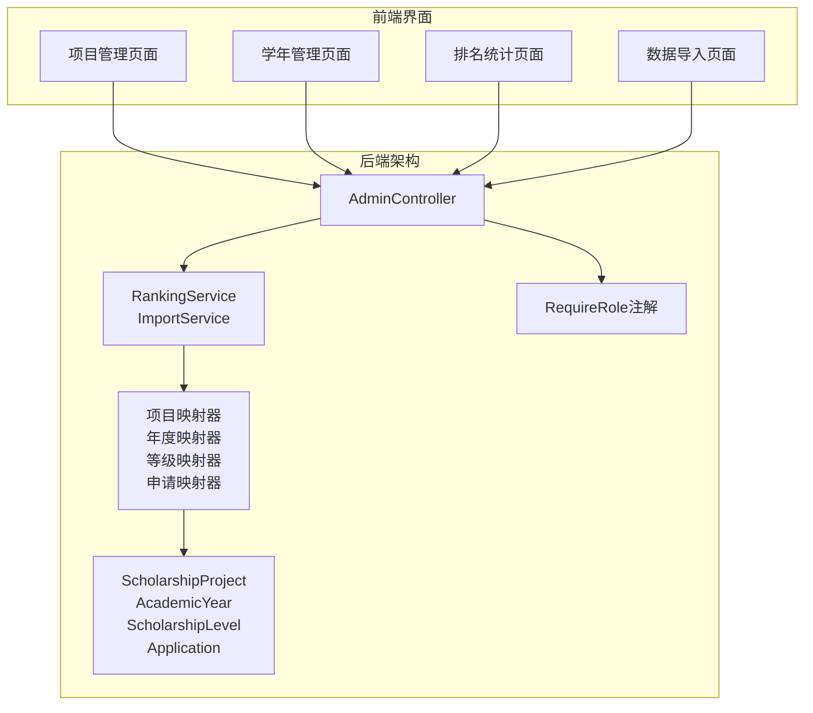
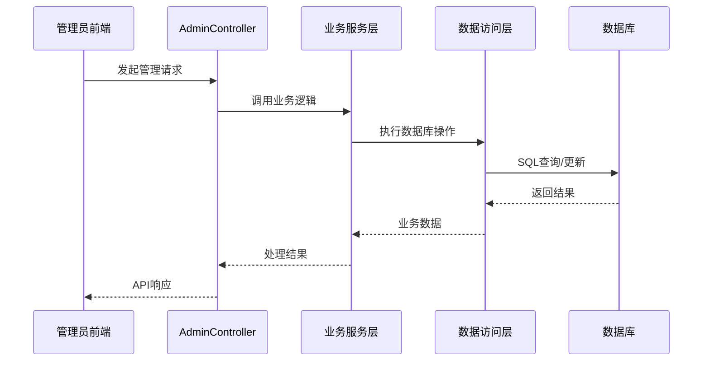
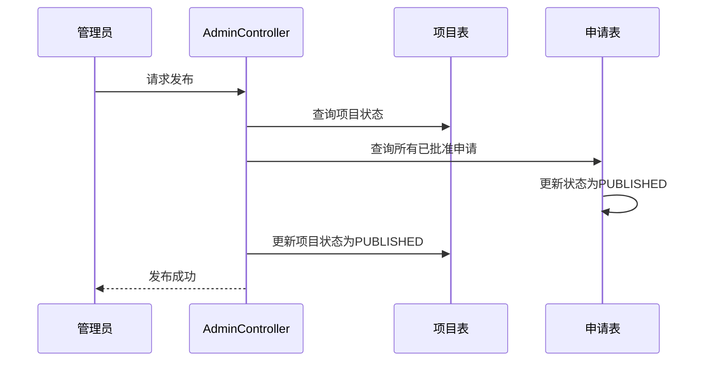
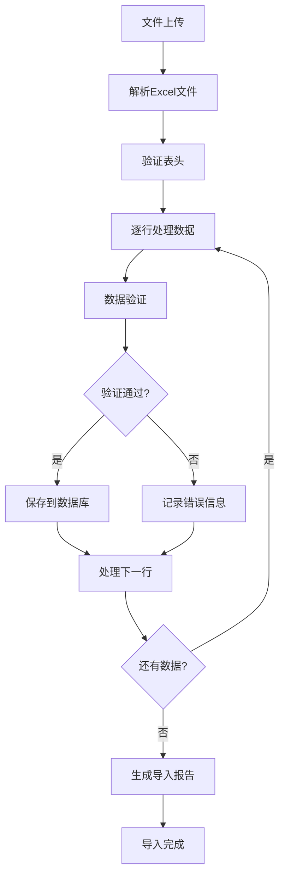
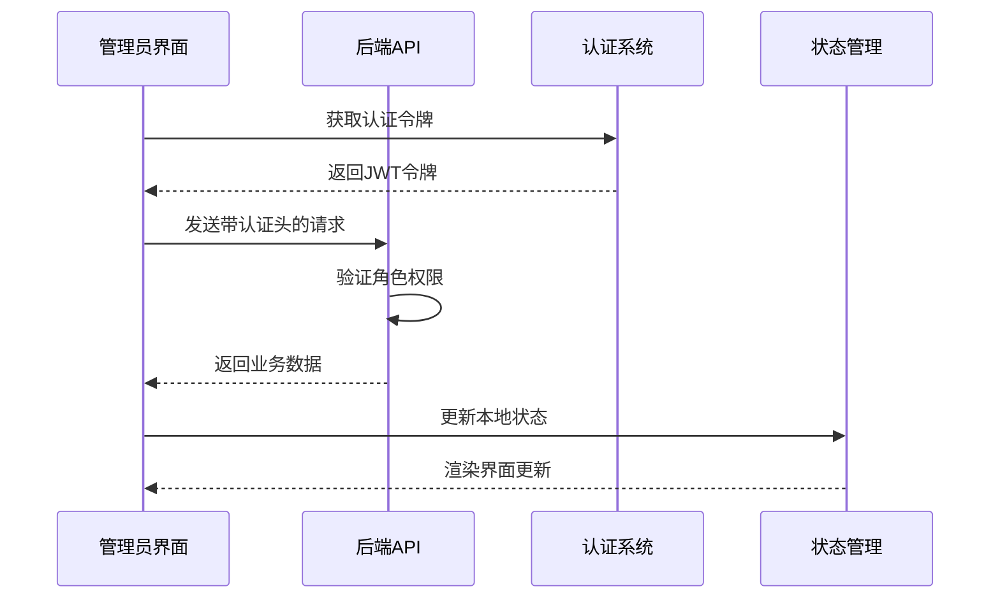
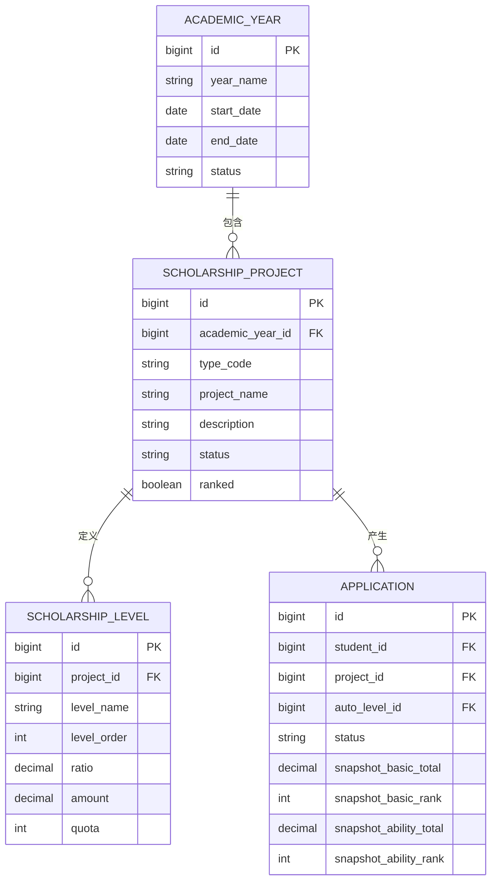

# 管理员接口

<cite>
**本文档引用的文件**
- [AdminController.java](file://backend/src/main/java/com/zjsu/scholarship/controller/AdminController.java)
- [RankingService.java](file://backend/src/main/java/com/zjsu/scholarship/service/RankingService.java)
- [ImportService.java](file://backend/src/main/java/com/zjsu/scholarship/service/ImportService.java)
- [ScholarshipProject.java](file://backend/src/main/java/com/zjsu/scholarship/entity/ScholarshipProject.java)
- [AcademicYear.java](file://backend/src/main/java/com/zjsu/scholarship/entity/AcademicYear.java)
- [ScholarshipLevel.java](file://backend/src/main/java/com/zjsu/scholarship/entity/ScholarshipLevel.java)
- [Application.java](file://backend/src/main/java/com/zjsu/scholarship/entity/Application.java)
- [RequireRole.java](file://backend/src/main/java/com/zjsu/scholarship/security/RequireRole.java)
- [Projects.jsx](file://frontend/src/pages/admin/Projects.jsx)
- [Years.jsx](file://frontend/src/pages/admin/Years.jsx)
- [Ranking.jsx](file://frontend/src/pages/admin/Ranking.jsx)
- [Import.jsx](file://frontend/src/pages/admin/Import.jsx)
- [api.js](file://frontend/src/api.js)
</cite>

## 目录
1. [简介](#简介)
2. [项目结构](#项目结构)
3. [核心组件](#核心组件)
4. [架构概览](#架构概览)
5. [详细组件分析](#详细组件分析)
6. [依赖分析](#依赖分析)
7. [性能考虑](#性能考虑)
8. [故障排除指南](#故障排除指南)
9. [结论](#结论)
10. [附录](#附录)

## 简介
本文件为奖学金管理系统管理员功能的完整API接口文档，涵盖系统配置管理、奖学金项目管理、年度管理、排名统计、数据导入导出等核心功能。文档详细说明了管理员的最高权限和系统级操作接口，提供了完整的配置参数说明、数据结构定义、批量操作执行机制与错误处理策略，并包含系统维护和监控相关的接口说明。

## 项目结构
后端采用Spring Boot架构，控制器位于`controller`包，服务层位于`service`包，实体类位于`entity`包，映射器位于`mapper`包。前端使用React + Ant Design，页面位于`frontend/src/pages/admin`目录。



**图表来源**
- [AdminController.java:1-528](file://backend/src/main/java/com/zjsu/scholarship/controller/AdminController.java#L1-L528)
- [RankingService.java:1-437](file://backend/src/main/java/com/zjsu/scholarship/service/RankingService.java#L1-L437)
- [ImportService.java:1-195](file://backend/src/main/java/com/zjsu/scholarship/service/ImportService.java#L1-L195)

**章节来源**
- [AdminController.java:1-528](file://backend/src/main/java/com/zjsu/scholarship/controller/AdminController.java#L1-L528)
- [RequireRole.java:1-13](file://backend/src/main/java/com/zjsu/scholarship/security/RequireRole.java#L1-L13)

## 核心组件
管理员接口主要由以下核心组件构成：

### 控制器层
- **AdminController**: 提供所有管理员相关API接口
- **权限控制**: 使用`@RequireRole`注解实现角色权限控制

### 服务层
- **RankingService**: 实现双排名算法和等级分配逻辑
- **ImportService**: 处理Excel数据的批量导入和导出

### 数据模型
- **ScholarshipProject**: 奖学金项目实体
- **AcademicYear**: 学年配置实体
- **ScholarshipLevel**: 奖学金等级实体
- **Application**: 申请记录实体

**章节来源**
- [AdminController.java:20-61](file://backend/src/main/java/com/zjsu/scholarship/controller/AdminController.java#L20-L61)
- [RankingService.java:14-47](file://backend/src/main/java/com/zjsu/scholarship/service/RankingService.java#L14-L47)
- [ImportService.java:20-34](file://backend/src/main/java/com/zjsu/scholarship/service/ImportService.java#L20-L34)

## 架构概览
管理员接口采用分层架构设计，确保职责分离和代码可维护性。



**图表来源**
- [AdminController.java:63-190](file://backend/src/main/java/com/zjsu/scholarship/controller/AdminController.java#L63-L190)
- [RankingService.java:62-227](file://backend/src/main/java/com/zjsu/scholarship/service/RankingService.java#L62-L227)
- [ImportService.java:74-181](file://backend/src/main/java/com/zjsu/scholarship/service/ImportService.java#L74-L181)

## 详细组件分析

### 系统配置管理

#### 年度管理接口
管理员可以管理学年配置，包括创建、查询和状态管理。

**接口定义**
- GET `/api/admin/years` - 查询所有学年配置
- POST `/api/admin/years` - 创建新学年配置

**请求参数**
- yearName: 学年名称（必填）
- startDate: 开始日期（必填）
- endDate: 结束日期（必填）
- status: 状态（默认ACTIVE）

**响应数据结构**
```json
{
  "id": 1,
  "yearName": "2026-2027",
  "startDate": "2026-09-01",
  "endDate": "2027-08-31",
  "status": "ACTIVE",
  "fillStartAt": null,
  "fillEndAt": null,
  "reviewStartAt": null,
  "reviewEndAt": null,
  "publicStartAt": null,
  "publicEndAt": null
}
```

**章节来源**
- [AdminController.java:64-76](file://backend/src/main/java/com/zjsu/scholarship/controller/AdminController.java#L64-L76)
- [AcademicYear.java:11-26](file://backend/src/main/java/com/zjsu/scholarship/entity/AcademicYear.java#L11-L26)

#### 学生代表管理
管理员可以管理学生代表的选举和统计。

**接口定义**
- GET `/api/admin/representatives` - 查询学生代表列表
- POST `/api/admin/representatives` - 新增学生代表
- DELETE `/api/admin/representatives/{id}` - 删除学生代表
- GET `/api/admin/representatives/check-ratio` - 检查代表比例

**章节来源**
- [AdminController.java:317-376](file://backend/src/main/java/com/zjsu/scholarship/controller/AdminController.java#L317-L376)

### 奖学金项目管理

#### 项目生命周期管理
管理员可以完整管理奖学金项目的生命周期。

**接口定义**
- GET `/api/admin/projects` - 查询项目列表
- POST `/api/admin/projects` - 创建新项目
- PUT `/api/admin/projects/{id}` - 更新项目配置
- DELETE `/api/admin/projects/{id}` - 删除项目
- PUT `/api/admin/projects/{id}/status` - 更新项目状态

**项目配置参数**
- academicYearId: 学年ID（必填）
- typeCode: 项目类型代码（必填）
- projectName: 项目名称（必填）
- description: 项目描述
- minWeightedAvg: 加权平均分最低要求
- minPeScore: 体育成绩最低要求
- needLaborPass: 是否需要劳动教育合格
- foreignLangRequirement: 外语要求
- noDiscipline: 是否无处分要求
- foreignLangAvgMin: 外语课平均分最低要求
- foreignLangAvgFirst: 一等奖外语平均分要求
- requireCet4Pass: 是否要求CET4合格
- rankBasicMaxRatio: 基本项排名最大比例
- rankAbilityFirst: 一等奖能力项排名比例
- rankBasicFirst: 一等奖基本项排名比例

**章节来源**
- [AdminController.java:79-154](file://backend/src/main/java/com/zjsu/scholarship/controller/AdminController.java#L79-L154)
- [ScholarshipProject.java:14-49](file://backend/src/main/java/com/zjsu/scholarship/entity/ScholarshipProject.java#L14-L49)

#### 等级和条件配置
项目支持多等级配置和申请条件设置。

**等级配置参数**
- levelName: 等级名称（必填）
- levelOrder: 等级排序（必填）
- allocType: 分配方式（ratio或fixed）
- ratio: 比例（百分比）
- quota: 固定名额
- amount: 奖金金额
- rankBasicMaxRatio: 该等级基本项排名限制
- rankAbilityMaxRatio: 该等级能力项排名限制

**申请条件类型**
- TOTAL_RANK_TOP_RATIO: 综测总分排名前N%
- ACADEMIC_MIN: 智育下限≥
- NO_DISCIPLINE: 无处分（值=1）
- DEGREE_TYPE: 培养类型
- GRADE: 年级
- INNOVATION_MIN: 创新分下限≥

**章节来源**
- [AdminController.java:455-526](file://backend/src/main/java/com/zjsu/scholarship/controller/AdminController.java#L455-L526)
- [ScholarshipLevel.java:11-25](file://backend/src/main/java/com/zjsu/scholarship/entity/ScholarshipLevel.java#L11-L25)

### 排名统计管理

#### 双排名算法实现
管理员可以执行完整的双排名算法，包括基本项排名和综合能力排名。

**接口定义**
- POST `/api/admin/projects/{id}/rank` - 执行排名和等级分配
- GET `/api/admin/projects/{id}/award-preview` - 获奖名单预览
- GET `/api/admin/ranking` - 综合排名查询

**排名算法流程**
```mermaid
flowchart TD
Start([开始排名]) --> Recalculate[全员重算综测分]
Recalculate --> DoubleRank[双排名：basicRank, abilityRank]
DoubleRank --> Filter[按基本项排名过滤(默认前30%)]
Filter --> SortByAbility[按能力排名排序]
SortByAbility --> CalculateQuota[计算各等级名额]
CalculateQuota --> FirstClass[一等奖特殊校验]
FirstClass --> OtherLevels[其他等级分配]
OtherLevels --> WriteResults[写入推荐等级到申请记录]
WriteResults --> UpdateProject[更新项目状态]
UpdateProject --> End([完成])
```

**图表来源**
- [RankingService.java:62-227](file://backend/src/main/java/com/zjsu/scholarship/service/RankingService.java#L62-L227)

**章节来源**
- [AdminController.java:156-265](file://backend/src/main/java/com/zjsu/scholarship/controller/AdminController.java#L156-L265)
- [RankingService.java:14-437](file://backend/src/main/java/com/zjsu/scholarship/service/RankingService.java#L14-L437)

#### 排名发布管理
管理员可以发布获奖结果，将申请状态从审核中更新为已发布。

**接口定义**
- POST `/api/admin/projects/{id}/publish` - 发布获奖结果

**发布流程**


**图表来源**
- [AdminController.java:161-175](file://backend/src/main/java/com/zjsu/scholarship/controller/AdminController.java#L161-L175)

**章节来源**
- [AdminController.java:161-175](file://backend/src/main/java/com/zjsu/scholarship/controller/AdminController.java#L161-L175)

### 数据导入导出

#### Excel批量导入
管理员可以批量导入学生信息和课程成绩数据。

**接口定义**
- GET `/api/admin/import/template/students` - 下载学生导入模板
- GET `/api/admin/import/template/grades` - 下载成绩导入模板
- POST `/api/admin/import/students` - 导入学生名单
- POST `/api/admin/import/grades` - 导入课程成绩

**导入模板格式**
- 学生导入模板：包含学号、姓名、性别、学院、专业、年级、班级、宿舍号、CET4成绩、CET6成绩、体育成绩、劳动教育状态等字段
- 成绩导入模板：包含学号、课程名称、学分、成绩等字段

**导入处理流程**


**图表来源**
- [ImportService.java:74-181](file://backend/src/main/java/com/zjsu/scholarship/service/ImportService.java#L74-L181)

**章节来源**
- [AdminController.java:291-313](file://backend/src/main/java/com/zjsu/scholarship/controller/AdminController.java#L291-L313)
- [ImportService.java:20-195](file://backend/src/main/java/com/zjsu/scholarship/service/ImportService.java#L20-L195)

#### 账户导出功能
管理员可以导出学生账户信息为CSV格式。

**接口定义**
- GET `/api/admin/export/accounts` - 导出学生账户信息

**导出内容**
- 学号、姓名、专业、年级、班级、初始密码
- 文件编码：UTF-8，包含BOM头

**章节来源**
- [AdminController.java:268-282](file://backend/src/main/java/com/zjsu/scholarship/controller/AdminController.java#L268-L282)

### 系统监控和统计

#### 看板统计
管理员可以查看系统的整体运行状态和统计数据。

**接口定义**
- GET `/api/admin/stats/dashboard` - 获取看板统计数据

**统计指标**
- 学生总数
- 奖学金项目数量
- 申请总数
- 已批准申请数
- 待处理申请数
- 评估记录数

**章节来源**
- [AdminController.java:178-190](file://backend/src/main/java/com/zjsu/scholarship/controller/AdminController.java#L178-L190)

#### 处分管理
管理员可以管理学生的处分记录。

**接口定义**
- GET `/api/admin/discipline` - 查询处分记录
- POST `/api/admin/discipline` - 新增处分记录
- PUT `/api/admin/discipline/{id}/resolve` - 解除处分
- DELETE `/api/admin/discipline/{id}` - 删除处分记录

**处分记录字段**
- studentId: 学生ID
- caseDescription: 处分事由
- penaltyType: 处罚类型
- penaltyDuration: 处罚期限
- isResolved: 是否已解除
- createdAt: 创建时间
- resolvedAt: 解除时间

**章节来源**
- [AdminController.java:380-422](file://backend/src/main/java/com/zjsu/scholarship/controller/AdminController.java#L380-L422)

#### 申诉管理
管理员可以处理学生的申诉申请。

**接口定义**
- GET `/api/admin/appeals` - 查询申诉记录
- PUT `/api/admin/appeals/{id}/process` - 处理申诉

**申诉状态**
- SUBMITTED: 已提交
- UNDER_CONSIDERATION: 审核中
- APPROVED: 已批准
- REJECTED: 已拒绝

**章节来源**
- [AdminController.java:426-452](file://backend/src/main/java/com/zjsu/scholarship/controller/AdminController.java#L426-L452)

### 权限控制机制

#### 角色权限体系
系统采用基于注解的权限控制机制。

**角色定义**
- ADMIN: 系统管理员（最高权限）
- COUNSELOR: 辅导员（部分权限）

**权限注解**
```java
@RequireRole({"ADMIN", "COUNSELOR"})
public class AdminController {
    // 部分接口需要COUNSELOR权限
}

@RequireRole("ADMIN")
public class AdminController {
    // 高级管理操作需要ADMIN权限
}
```

**章节来源**
- [AdminController.java:22-61](file://backend/src/main/java/com/zjsu/scholarship/controller/AdminController.java#L22-L61)
- [RequireRole.java:8-12](file://backend/src/main/java/com/zjsu/scholarship/security/RequireRole.java#L8-L12)

## 依赖分析

### 后端组件依赖关系

```mermaid
graph TB
AdminController[AdminController] --> RankingService
AdminController --> ImportService
AdminController --> DataSeedService
AdminController --> AcademicYearMapper
AdminController --> ScholarshipProjectMapper
AdminController --> ScholarshipLevelMapper
AdminController --> ScholarshipCriterionMapper
AdminController --> ApplicationMapper
AdminController --> StudentMapper
AdminController --> EvaluationRecordMapper
AdminController --> StudentRepresentativeMapper
AdminController --> DisciplineRecordMapper
AdminController --> AppealRecordMapper
RankingService --> EvaluationService
RankingService --> EvaluationRecordMapper
RankingService --> ScholarshipProjectMapper
RankingService --> ScholarshipLevelMapper
RankingService --> ApplicationMapper
RankingService --> StudentMapper
ImportService --> UserMapper
ImportService --> StudentMapper
ImportService --> CourseGradeMapper
```



**图表来源**
- [AdminController.java:25-61](file://backend/src/main/java/com/zjsu/scholarship/controller/AdminController.java#L25-L61)
- [RankingService.java:28-46](file://backend/src/main/java/com/zjsu/scholarship/service/RankingService.java#L28-L46)
- [ImportService.java:23-34](file://backend/src/main/java/com/zjsu/scholarship/service/ImportService.java#L23-L34)

### 前端交互流程



**图表来源**
- [api.js:10-41](file://frontend/src/api.js#L10-L41)
- [Projects.jsx:28-56](file://frontend/src/pages/admin/Projects.jsx#L28-L56)
- [Import.jsx:48-79](file://frontend/src/pages/admin/Import.jsx#L48-L79)

**章节来源**
- [Projects.jsx:1-416](file://frontend/src/pages/admin/Projects.jsx#L1-L416)
- [Years.jsx:1-53](file://frontend/src/pages/admin/Years.jsx#L1-L53)
- [Ranking.jsx:1-105](file://frontend/src/pages/admin/Ranking.jsx#L1-L105)
- [Import.jsx:1-203](file://frontend/src/pages/admin/Import.jsx#L1-L203)

## 性能考虑
- **批量操作优化**: 导入功能采用流式处理，避免内存溢出
- **数据库事务**: 排名算法使用事务保证数据一致性
- **缓存策略**: 建议在高频查询场景添加适当的缓存机制
- **分页查询**: 大数据量查询使用分页避免性能问题
- **并发控制**: 关键业务操作使用乐观锁防止并发冲突

## 故障排除指南

### 常见错误类型
1. **权限不足**: `@RequireRole`注解导致的权限错误
2. **数据验证失败**: Excel导入时的数据格式错误
3. **业务逻辑异常**: 排名算法中的条件检查失败
4. **数据库约束冲突**: 唯一性约束违反

### 错误处理策略
- **前端提示**: 使用Ant Design的消息组件显示错误信息
- **状态码规范**: 统一使用HTTP状态码和业务状态码
- **日志记录**: 完整记录错误堆栈和上下文信息
- **降级处理**: 关键功能失败时提供降级方案

**章节来源**
- [ImportService.java:128-132](file://backend/src/main/java/com/zjsu/scholarship/service/ImportService.java#L128-L132)
- [RankingService.java:311-429](file://backend/src/main/java/com/zjsu/scholarship/service/RankingService.java#L311-L429)

## 结论
管理员接口提供了完整的奖学金管理系统管理功能，涵盖了从基础配置到高级业务处理的各个方面。系统采用清晰的分层架构和严格的权限控制，确保了系统的安全性和可维护性。通过标准化的API设计和完善的错误处理机制，为管理员提供了高效、可靠的管理工具。

## 附录

### API接口汇总表

| 功能模块 | 接口路径 | 方法 | 权限要求 | 主要用途 |
|---------|----------|------|----------|----------|
| 年度管理 | `/api/admin/years` | GET/POST | COUNSELOR | 查询和创建学年配置 |
| 项目管理 | `/api/admin/projects` | GET/POST | COUNSELOR | 查询和创建奖学金项目 |
| 项目管理 | `/api/admin/projects/{id}` | PUT/DELETE | ADMIN | 更新和删除项目 |
| 排名管理 | `/api/admin/projects/{id}/rank` | POST | COUNSELOR | 执行双排名算法 |
| 排名管理 | `/api/admin/projects/{id}/publish` | POST | COUNSELOR | 发布获奖结果 |
| 排名管理 | `/api/admin/projects/{id}/award-preview` | GET | COUNSELOR | 获奖名单预览 |
| 排名管理 | `/api/admin/ranking` | GET | COUNSELOR | 综合排名查询 |
| 数据导入 | `/api/admin/import/template/students` | GET | ADMIN | 下载学生导入模板 |
| 数据导入 | `/api/admin/import/template/grades` | GET | ADMIN | 下载成绩导入模板 |
| 数据导入 | `/api/admin/import/students` | POST | ADMIN | 导入学生名单 |
| 数据导入 | `/api/admin/import/grades` | POST | ADMIN | 导入课程成绩 |
| 数据导出 | `/api/admin/export/accounts` | GET | ADMIN | 导出学生账户信息 |
| 看板统计 | `/api/admin/stats/dashboard` | GET | COUNSELOR | 获取系统统计数据 |
| 处分管理 | `/api/admin/discipline` | GET/POST | ADMIN | 查询和新增处分记录 |
| 处分管理 | `/api/admin/discipline/{id}/resolve` | PUT | ADMIN | 解除处分 |
| 申诉管理 | `/api/admin/appeals` | GET/PUT | COUNSELOR | 查询和处理申诉 |

### 数据模型关系图



**图表来源**
- [AcademicYear.java:14-26](file://backend/src/main/java/com/zjsu/scholarship/entity/AcademicYear.java#L14-L26)
- [ScholarshipProject.java:14-49](file://backend/src/main/java/com/zjsu/scholarship/entity/ScholarshipProject.java#L14-L49)
- [ScholarshipLevel.java:13-25](file://backend/src/main/java/com/zjsu/scholarship/entity/ScholarshipLevel.java#L13-L25)
- [Application.java:14-42](file://backend/src/main/java/com/zjsu/scholarship/entity/Application.java#L14-L42)