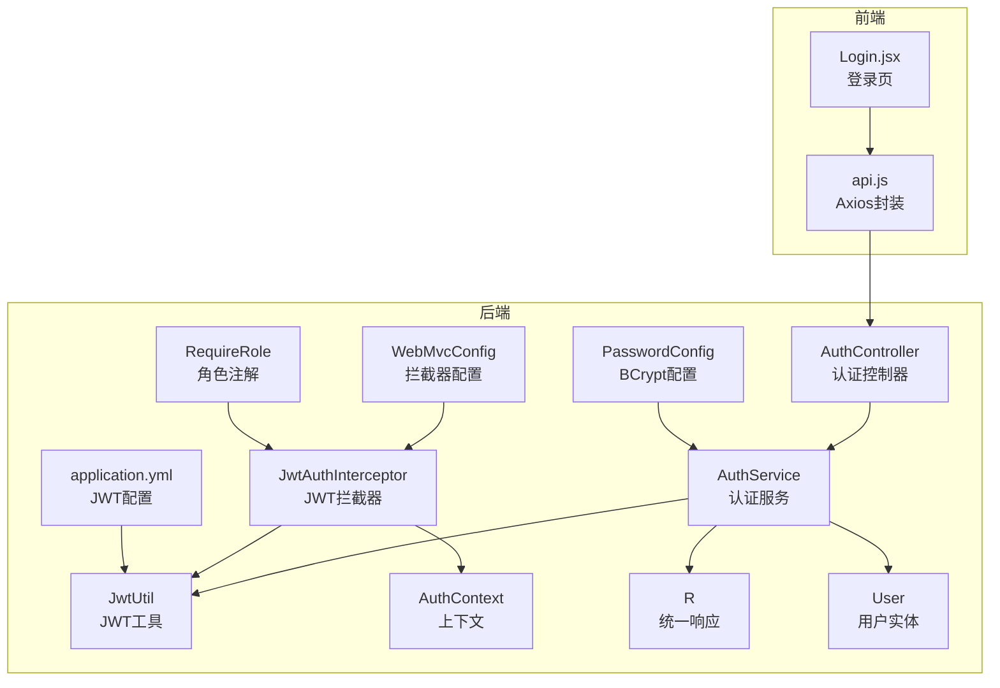
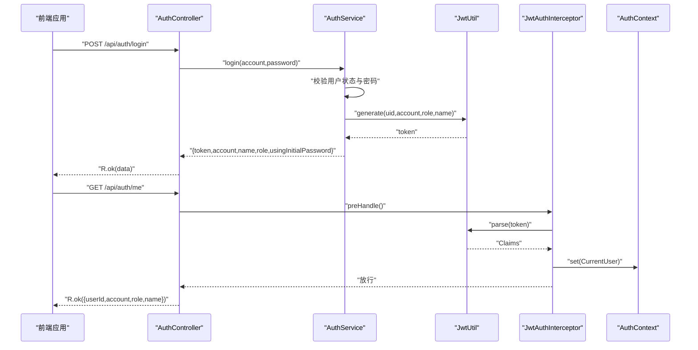
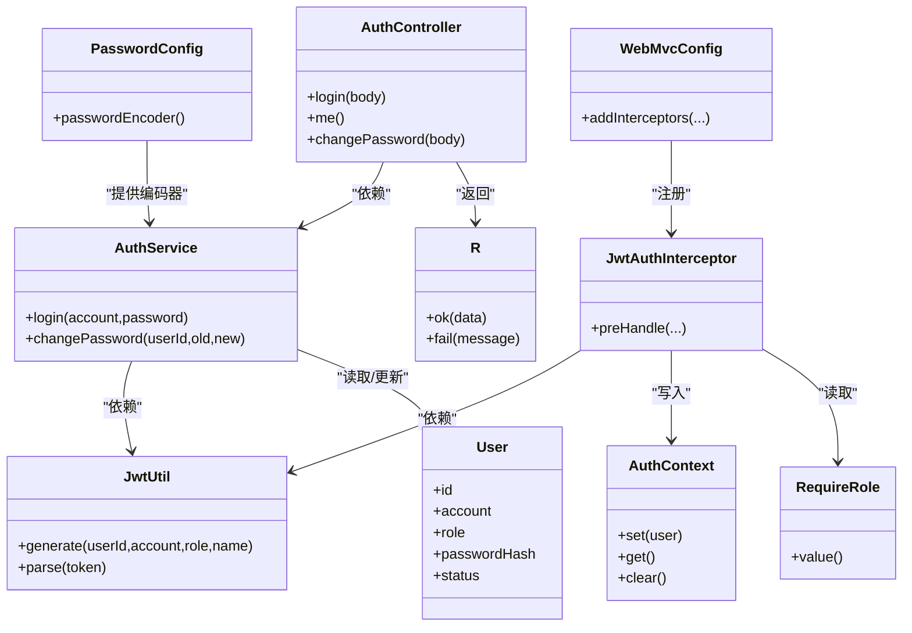

# 认证接口

<cite>
**本文引用的文件**
- [AuthController.java](file://backend/src/main/java/com/zjsu/scholarship/controller/AuthController.java)
- [AuthService.java](file://backend/src/main/java/com/zjsu/scholarship/service/AuthService.java)
- [JwtUtil.java](file://backend/src/main/java/com/zjsu/scholarship/security/JwtUtil.java)
- [JwtAuthInterceptor.java](file://backend/src/main/java/com/zjsu/scholarship/security/JwtAuthInterceptor.java)
- [RequireRole.java](file://backend/src/main/java/com/zjsu/scholarship/security/RequireRole.java)
- [AuthContext.java](file://backend/src/main/java/com/zjsu/scholarship/security/AuthContext.java)
- [WebMvcConfig.java](file://backend/src/main/java/com/zjsu/scholarship/config/WebMvcConfig.java)
- [PasswordConfig.java](file://backend/src/main/java/com/zjsu/scholarship/config/PasswordConfig.java)
- [R.java](file://backend/src/main/java/com/zjsu/scholarship/common/R.java)
- [User.java](file://backend/src/main/java/com/zjsu/scholarship/entity/User.java)
- [application.yml](file://backend/src/main/resources/application.yml)
- [Login.jsx](file://frontend/src/pages/Login.jsx)
- [api.js](file://frontend/src/api.js)
</cite>

## 目录
1. [简介](#简介)
2. [项目结构](#项目结构)
3. [核心组件](#核心组件)
4. [架构总览](#架构总览)
5. [详细接口说明](#详细接口说明)
6. [依赖关系分析](#依赖关系分析)
7. [性能与安全考量](#性能与安全考量)
8. [故障排查指南](#故障排查指南)
9. [结论](#结论)
10. [附录：接口测试示例](#附录接口测试示例)

## 简介
本文件面向前后端开发者与测试人员，提供系统认证相关接口的完整API文档。重点覆盖用户登录、个人信息查询、密码修改等认证流程，详述JWT令牌的生成、传递与验证机制、角色权限拦截策略、密码加密与安全建议，并给出请求与响应示例、常见问题与排错指引。

## 项目结构
后端采用Spring Boot + MyBatis-Plus，认证相关代码集中在以下模块：
- 控制器层：/backend/src/main/java/com/zjsu/scholarship/controller/AuthController.java
- 服务层：/backend/src/main/java/com/zjsu/scholarship/service/AuthService.java
- 安全与拦截：/backend/src/main/java/com/zjsu/scholarship/security/JwtUtil.java、JwtAuthInterceptor.java、RequireRole.java、AuthContext.java
- Web配置：/backend/src/main/java/com/zjsu/scholarship/config/WebMvcConfig.java、PasswordConfig.java
- 响应封装：/backend/src/main/java/com/zjsu/scholarship/common/R.java
- 实体模型：/backend/src/main/java/com/zjsu/scholarship/entity/User.java
- 配置文件：/backend/src/main/resources/application.yml
- 前端登录页与API封装：/frontend/src/pages/Login.jsx、/frontend/src/api.js

图表来源
- [AuthController.java:1-44](file://backend/src/main/java/com/zjsu/scholarship/controller/AuthController.java#L1-L44)
- [AuthService.java:1-77](file://backend/src/main/java/com/zjsu/scholarship/service/AuthService.java#L1-L77)
- [JwtUtil.java:1-52](file://backend/src/main/java/com/zjsu/scholarship/security/JwtUtil.java#L1-L52)
- [JwtAuthInterceptor.java:1-65](file://backend/src/main/java/com/zjsu/scholarship/security/JwtAuthInterceptor.java#L1-L65)
- [RequireRole.java:1-13](file://backend/src/main/java/com/zjsu/scholarship/security/RequireRole.java#L1-L13)
- [AuthContext.java:1-20](file://backend/src/main/java/com/zjsu/scholarship/security/AuthContext.java#L1-L20)
- [WebMvcConfig.java:1-49](file://backend/src/main/java/com/zjsu/scholarship/config/WebMvcConfig.java#L1-L49)
- [PasswordConfig.java:1-15](file://backend/src/main/java/com/zjsu/scholarship/config/PasswordConfig.java#L1-L15)
- [R.java:1-39](file://backend/src/main/java/com/zjsu/scholarship/common/R.java#L1-L39)
- [User.java:1-24](file://backend/src/main/java/com/zjsu/scholarship/entity/User.java#L1-L24)
- [application.yml:1-52](file://backend/src/main/resources/application.yml#L1-L52)

章节来源
- [AuthController.java:1-44](file://backend/src/main/java/com/zjsu/scholarship/controller/AuthController.java#L1-L44)
- [WebMvcConfig.java:1-49](file://backend/src/main/java/com/zjsu/scholarship/config/WebMvcConfig.java#L1-L49)

## 核心组件
- 认证控制器：提供登录、当前用户信息查询、修改密码等接口。
- 认证服务：负责用户校验、密码匹配、令牌签发与密码更新。
- JWT工具：生成与解析JWT，读取密钥与过期时间配置。
- JWT拦截器：从请求头提取令牌、解析并注入上下文，执行角色权限校验。
- 角色注解：标记接口所需角色，配合拦截器实现权限控制。
- 上下文：线程本地存储当前用户信息，供业务方法读取。
- Web配置：注册拦截器、排除登录与公开接口、跨域设置。
- 密码配置：BCrypt编码器，用于密码哈希与校验。
- 统一响应：R<T>封装标准响应结构，便于前端统一处理。

章节来源
- [AuthController.java:1-44](file://backend/src/main/java/com/zjsu/scholarship/controller/AuthController.java#L1-L44)
- [AuthService.java:1-77](file://backend/src/main/java/com/zjsu/scholarship/service/AuthService.java#L1-L77)
- [JwtUtil.java:1-52](file://backend/src/main/java/com/zjsu/scholarship/security/JwtUtil.java#L1-L52)
- [JwtAuthInterceptor.java:1-65](file://backend/src/main/java/com/zjsu/scholarship/security/JwtAuthInterceptor.java#L1-L65)
- [RequireRole.java:1-13](file://backend/src/main/java/com/zjsu/scholarship/security/RequireRole.java#L1-L13)
- [AuthContext.java:1-20](file://backend/src/main/java/com/zjsu/scholarship/security/AuthContext.java#L1-L20)
- [WebMvcConfig.java:1-49](file://backend/src/main/java/com/zjsu/scholarship/config/WebMvcConfig.java#L1-L49)
- [PasswordConfig.java:1-15](file://backend/src/main/java/com/zjsu/scholarship/config/PasswordConfig.java#L1-L15)
- [R.java:1-39](file://backend/src/main/java/com/zjsu/scholarship/common/R.java#L1-L39)

## 架构总览
认证流程由前端发起登录请求，后端验证凭据后签发JWT；后续请求由拦截器解析令牌并注入上下文，控制器据此执行业务逻辑与权限校验。

图表来源
- [AuthController.java:21-35](file://backend/src/main/java/com/zjsu/scholarship/controller/AuthController.java#L21-L35)
- [AuthService.java:32-55](file://backend/src/main/java/com/zjsu/scholarship/service/AuthService.java#L32-L55)
- [JwtUtil.java:28-42](file://backend/src/main/java/com/zjsu/scholarship/security/JwtUtil.java#L28-L42)
- [JwtAuthInterceptor.java:20-58](file://backend/src/main/java/com/zjsu/scholarship/security/JwtAuthInterceptor.java#L20-L58)
- [AuthContext.java:6-8](file://backend/src/main/java/com/zjsu/scholarship/security/AuthContext.java#L6-L8)

## 详细接口说明

### 登录接口
- 方法与路径
  - POST /api/auth/login
- 请求体
  - account: string，账号（学号/工号）
  - password: string，密码
- 成功响应
  - data.token: string，JWT访问令牌
  - data.account: string，账号
  - data.name: string，姓名
  - data.role: string，角色（STUDENT/COUNSELOR/ADMIN）
  - data.usingInitialPassword: boolean，是否使用初始密码（用于引导修改）
- 错误响应
  - 账号不存在、账号被冻结、账号或密码错误等业务异常
- 前端使用
  - 前端登录页提交表单后调用此接口，拿到token后存入全局状态并跳转对应角色页面

章节来源
- [AuthController.java:21-24](file://backend/src/main/java/com/zjsu/scholarship/controller/AuthController.java#L21-L24)
- [AuthService.java:32-55](file://backend/src/main/java/com/zjsu/scholarship/service/AuthService.java#L32-L55)
- [R.java:16-30](file://backend/src/main/java/com/zjsu/scholarship/common/R.java#L16-L30)
- [Login.jsx:22-34](file://frontend/src/pages/Login.jsx#L22-L34)

### 当前用户信息接口
- 方法与路径
  - GET /api/auth/me
- 请求头
  - Authorization: Bearer {token}
- 成功响应
  - data.userId: number，用户ID
  - data.account: string，账号
  - data.role: string，角色
  - data.name: string，姓名
- 权限说明
  - 需要已登录且令牌有效

章节来源
- [AuthController.java:26-35](file://backend/src/main/java/com/zjsu/scholarship/controller/AuthController.java#L26-L35)
- [JwtAuthInterceptor.java:20-58](file://backend/src/main/java/com/zjsu/scholarship/security/JwtAuthInterceptor.java#L20-L58)

### 修改密码接口
- 方法与路径
  - POST /api/auth/change-password
- 请求头
  - Authorization: Bearer {token}
- 请求体
  - oldPassword: string，旧密码
  - newPassword: string，新密码（至少6位）
- 成功响应
  - R.ok()
- 错误响应
  - 新密码长度不足、原密码错误、用户不存在等

章节来源
- [AuthController.java:37-42](file://backend/src/main/java/com/zjsu/scholarship/controller/AuthController.java#L37-L42)
- [AuthService.java:57-75](file://backend/src/main/java/com/zjsu/scholarship/service/AuthService.java#L57-L75)

### 退出登录（说明）
- 说明
  - 后端不提供专门的“登出”接口。由于JWT在服务端无状态存储，无法直接使令牌失效。
  - 建议前端清除本地token，拦截器对缺失或无效令牌统一返回401。
- 前端行为
  - 响应拦截器在收到401时清理token并跳转登录页

章节来源
- [JwtAuthInterceptor.java:25-29](file://backend/src/main/java/com/zjsu/scholarship/security/JwtAuthInterceptor.java#L25-L29)
- [api.js:18-31](file://frontend/src/api.js#L18-L31)

## 依赖关系分析
- 控制器依赖服务层，服务层依赖JWT工具、用户映射与BCrypt编码器。
- 拦截器依赖JWT工具解析令牌，写入AuthContext，并结合RequireRole注解进行角色校验。
- Web配置注册拦截器并对登录与公开接口进行排除。

图表来源
- [AuthController.java:13-19](file://backend/src/main/java/com/zjsu/scholarship/controller/AuthController.java#L13-L19)
- [AuthService.java:16-30](file://backend/src/main/java/com/zjsu/scholarship/service/AuthService.java#L16-L30)
- [JwtUtil.java:15-26](file://backend/src/main/java/com/zjsu/scholarship/security/JwtUtil.java#L15-L26)
- [JwtAuthInterceptor.java:11-18](file://backend/src/main/java/com/zjsu/scholarship/security/JwtAuthInterceptor.java#L11-L18)
- [RequireRole.java:8-12](file://backend/src/main/java/com/zjsu/scholarship/security/RequireRole.java#L8-L12)
- [AuthContext.java:3-8](file://backend/src/main/java/com/zjsu/scholarship/security/AuthContext.java#L3-L8)
- [WebMvcConfig.java:11-21](file://backend/src/main/java/com/zjsu/scholarship/config/WebMvcConfig.java#L11-L21)
- [PasswordConfig.java:8-14](file://backend/src/main/java/com/zjsu/scholarship/config/PasswordConfig.java#L8-L14)
- [R.java:3-38](file://backend/src/main/java/com/zjsu/scholarship/common/R.java#L3-L38)
- [User.java:10-23](file://backend/src/main/java/com/zjsu/scholarship/entity/User.java#L10-L23)

## 性能与安全考量

### JWT令牌生成、传递与验证
- 生成
  - 使用对称密钥（HMAC-SHA）签名，载荷包含uid、account、role、name。
  - 过期时间来自配置（小时），默认24小时。
- 传递
  - 前端在请求头添加Authorization: Bearer {token}。
  - 登录成功后，前端将token存入全局状态并在后续请求自动附加。
- 验证
  - 拦截器从请求头解析Bearer令牌，解析失败或过期统一抛出401。
  - 解析成功后将用户信息注入AuthContext，供控制器读取。

章节来源
- [JwtUtil.java:24-50](file://backend/src/main/java/com/zjsu/scholarship/security/JwtUtil.java#L24-L50)
- [application.yml:42-45](file://backend/src/main/resources/application.yml#L42-L45)
- [api.js:10-16](file://frontend/src/api.js#L10-L16)
- [JwtAuthInterceptor.java:20-58](file://backend/src/main/java/com/zjsu/scholarship/security/JwtAuthInterceptor.java#L20-L58)

### 角色权限拦截机制
- 注解方式
  - 在控制器类或方法上使用@RequireRole({"ADMIN","COUNSELOR"})等声明所需角色。
- 拦截逻辑
  - 若方法或类标注了@RequireRole，则要求当前用户角色必须在允许列表中，否则返回403。
  - 未标注则不限制角色。

章节来源
- [RequireRole.java:8-12](file://backend/src/main/java/com/zjsu/scholarship/security/RequireRole.java#L8-L12)
- [JwtAuthInterceptor.java:40-51](file://backend/src/main/java/com/zjsu/scholarship/security/JwtAuthInterceptor.java#L40-L51)

### 密码加密策略
- 编码器
  - 使用BCryptPasswordEncoder进行密码哈希与匹配。
- 登录校验
  - 若用户存在passwordHash则用BCrypt匹配；否则回退到模拟表比对初始密码。
- 修改密码
  - 新密码长度至少6位，通过后使用BCrypt编码并更新数据库。

章节来源
- [PasswordConfig.java:8-14](file://backend/src/main/java/com/zjsu/scholarship/config/PasswordConfig.java#L8-L14)
- [AuthService.java:38-44](file://backend/src/main/java/com/zjsu/scholarship/service/AuthService.java#L38-L44)
- [AuthService.java:57-75](file://backend/src/main/java/com/zjsu/scholarship/service/AuthService.java#L57-L75)
- [User.java:18](file://backend/src/main/java/com/zjsu/scholarship/entity/User.java#L18)

### 安全建议
- 生产环境务必替换默认密钥与过期时间，避免硬编码。
- 建议启用HTTPS，防止令牌在传输中泄露。
- 考虑引入刷新令牌（refresh token）机制以支持更灵活的会话管理。
- 对敏感接口增加频率限制与IP白名单策略（可扩展）。

## 故障排查指南
- 401 未登录或令牌缺失
  - 现象：请求头缺少Authorization或非Bearer格式。
  - 处理：确保携带正确的Bearer token。
- 401 令牌无效或已过期
  - 现象：令牌解析失败或已超过有效期。
  - 处理：引导用户重新登录获取新token。
- 403 无权限访问该资源
  - 现象：当前用户角色不在@RequireRole允许列表。
  - 处理：确认账号角色或联系管理员。
- 400 账号或密码错误
  - 现象：登录时账号不存在、账号被冻结或密码不正确。
  - 处理：检查输入并确认初始密码是否需要修改。
- 400 新密码长度不足或原密码错误
  - 现象：修改密码时新密码少于6位或旧密码不匹配。
  - 处理：按提示重试。

章节来源
- [JwtAuthInterceptor.java:25-29](file://backend/src/main/java/com/zjsu/scholarship/security/JwtAuthInterceptor.java#L25-L29)
- [JwtAuthInterceptor.java:52-56](file://backend/src/main/java/com/zjsu/scholarship/security/JwtAuthInterceptor.java#L52-L56)
- [AuthService.java:35-45](file://backend/src/main/java/com/zjsu/scholarship/service/AuthService.java#L35-L45)
- [AuthService.java:58-71](file://backend/src/main/java/com/zjsu/scholarship/service/AuthService.java#L58-L71)
- [api.js:18-31](file://frontend/src/api.js#L18-L31)

## 结论
本认证体系基于JWT实现无状态鉴权，结合拦截器与角色注解完成权限控制。登录、查询当前用户、修改密码三大核心接口清晰明确，配合前端统一的请求拦截与错误处理，形成完整的认证闭环。生产部署需关注密钥安全、令牌过期策略与可能的刷新令牌方案。

## 附录：接口测试示例

### 登录
- 请求
  - POST /api/auth/login
  - Content-Type: application/json
  - Body:
    - account: "20231001"
    - password: "123456"
- 成功响应
  - 200 OK
  - Body: { code: 0, message: "ok", data: { token, account, name, role, usingInitialPassword } }

章节来源
- [AuthController.java:21-24](file://backend/src/main/java/com/zjsu/scholarship/controller/AuthController.java#L21-L24)
- [AuthService.java:32-55](file://backend/src/main/java/com/zjsu/scholarship/service/AuthService.java#L32-L55)

### 查询当前用户
- 请求
  - GET /api/auth/me
  - Authorization: Bearer {token}
- 成功响应
  - 200 OK
  - Body: { code: 0, message: "ok", data: { userId, account, role, name } }

章节来源
- [AuthController.java:26-35](file://backend/src/main/java/com/zjsu/scholarship/controller/AuthController.java#L26-L35)
- [JwtAuthInterceptor.java:20-58](file://backend/src/main/java/com/zjsu/scholarship/security/JwtAuthInterceptor.java#L20-L58)

### 修改密码
- 请求
  - POST /api/auth/change-password
  - Authorization: Bearer {token}
  - Content-Type: application/json
  - Body:
    - oldPassword: "123456"
    - newPassword: "newpass123"
- 成功响应
  - 200 OK
  - Body: { code: 0, message: "ok", data: null }

章节来源
- [AuthController.java:37-42](file://backend/src/main/java/com/zjsu/scholarship/controller/AuthController.java#L37-L42)
- [AuthService.java:57-75](file://backend/src/main/java/com/zjsu/scholarship/service/AuthService.java#L57-L75)

### 退出登录
- 行为说明
  - 服务端不提供专门登出接口；前端在收到401时清除token并跳转登录页。
- 前端示例
  - 请求拦截器在响应为401时触发清理与跳转逻辑。

章节来源
- [api.js:18-31](file://frontend/src/api.js#L18-L31)
- [JwtAuthInterceptor.java:25-29](file://backend/src/main/java/com/zjsu/scholarship/security/JwtAuthInterceptor.java#L25-L29)