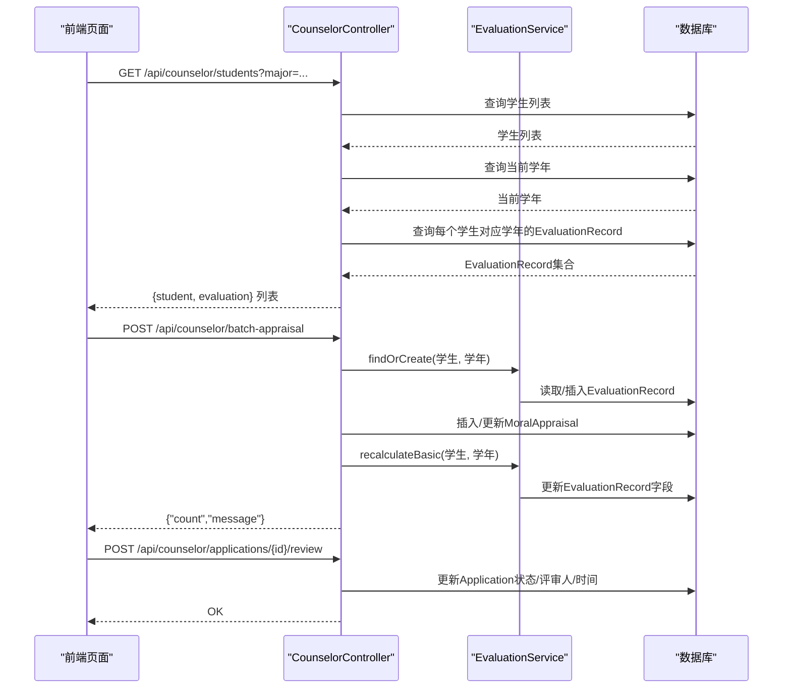
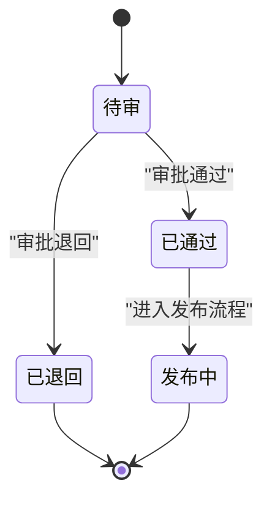
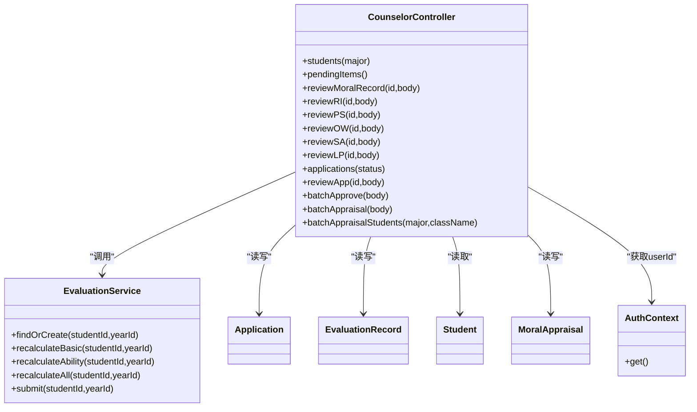

# 辅导员接口

<cite>
**本文引用的文件**
- [CounselorController.java](file://backend/src/main/java/com/zjsu/scholarship/controller/CounselorController.java)
- [EvaluationService.java](file://backend/src/main/java/com/zjsu/scholarship/service/EvaluationService.java)
- [AuthContext.java](file://backend/src/main/java/com/zjsu/scholarship/security/AuthContext.java)
- [RequireRole.java](file://backend/src/main/java/com/zjsu/scholarship/security/RequireRole.java)
- [Application.java](file://backend/src/main/java/com/zjsu/scholarship/entity/Application.java)
- [EvaluationRecord.java](file://backend/src/main/java/com/zjsu/scholarship/entity/EvaluationRecord.java)
- [Student.java](file://backend/src/main/java/com/zjsu/scholarship/entity/Student.java)
- [MoralAppraisal.java](file://backend/src/main/java/com/zjsu/scholarship/entity/MoralAppraisal.java)
- [AcademicYear.java](file://backend/src/main/java/com/zjsu/scholarship/entity/AcademicYear.java)
- [ResearchInnovationItem.java](file://backend/src/main/java/com/zjsu/scholarship/entity/ResearchInnovationItem.java)
- [ProfessionalSkillItem.java](file://backend/src/main/java/com/zjsu/scholarship/entity/ProfessionalSkillItem.java)
- [OrganizationWorkItem.java](file://backend/src/main/java/com/zjsu/scholarship/entity/OrganizationWorkItem.java)
- [SportsAestheticsItem.java](file://backend/src/main/java/com/zjsu/scholarship/entity/SportsAestheticsItem.java)
- [LaborPracticeItem.java](file://backend/src/main/java/com/zjsu/scholarship/entity/LaborPracticeItem.java)
- [application.yml](file://backend/src/main/resources/application.yml)
- [Students.jsx](file://frontend/src/pages/counselor/Students.jsx)
- [Applications.jsx](file://frontend/src/pages/counselor/Applications.jsx)
- [Review.jsx](file://frontend/src/pages/counselor/Review.jsx)
- [Appraisal.jsx](file://frontend/src/pages/counselor/Appraisal.jsx)
</cite>

## 目录
1. [简介](#简介)
2. [项目结构](#项目结构)
3. [核心组件](#核心组件)
4. [架构总览](#架构总览)
5. [详细组件分析](#详细组件分析)
6. [依赖分析](#依赖分析)
7. [性能考虑](#性能考虑)
8. [故障排查指南](#故障排查指南)
9. [结论](#结论)
10. [附录](#附录)

## 简介
本文件面向“辅导员”角色，系统化梳理与“学生信息查看与编辑、申请审核、综合测评记录创建与修改”相关的后端API与前端交互方式。重点说明：
- 辅导员的权限范围与数据访问边界（仅限其负责的学生）
- 审核流程的状态转换与业务规则
- 批量操作与数据导出的可行性说明
- 接口参数、请求/响应格式与典型使用示例
- 权限验证机制与安全上下文

## 项目结构
后端采用Spring Boot + MyBatis-Plus，控制器位于controller包，服务层在service包，实体与映射器分别在entity与mapper包；前端使用React + Ant Design，页面位于frontend/src/pages/counselor。

```mermaid
graph TB
subgraph "后端"
CC["CounselorController<br/>/api/counselor"]
ES["EvaluationService"]
AC["AuthContext<br/>线程本地上下文"]
RR["RequireRole<br/>@RequireRole({\"COUNSELOR\",\"ADMIN\"})"]
EVA["EvaluationRecord"]
APP["Application"]
STU["Student"]
MAP["各Mapper集合"]
end
subgraph "前端"
UI_STU["Students.jsx<br/>学生综测进度"]
UI_APP["Applications.jsx<br/>申请审核"]
UI_REV["Review.jsx<br/>材料审核"]
UI_APR["Appraisal.jsx<br/>辅导员批量评议"]
end
UI_STU --> CC
UI_APP --> CC
UI_REV --> CC
UI_APR --> CC
CC --> ES
CC --> MAP
CC --> EVA
CC --> APP
CC --> STU
CC --> AC
CC --> RR
```

图表来源
- [CounselorController.java:18-65](file://backend/src/main/java/com/zjsu/scholarship/controller/CounselorController.java#L18-L65)
- [EvaluationService.java:22-61](file://backend/src/main/java/com/zjsu/scholarship/service/EvaluationService.java#L22-L61)
- [AuthContext.java:3-19](file://backend/src/main/java/com/zjsu/scholarship/security/AuthContext.java#L3-L19)
- [RequireRole.java:8-12](file://backend/src/main/java/com/zjsu/scholarship/security/RequireRole.java#L8-L12)

章节来源
- [CounselorController.java:18-65](file://backend/src/main/java/com/zjsu/scholarship/controller/CounselorController.java#L18-L65)
- [application.yml:1-52](file://backend/src/main/resources/application.yml#L1-L52)

## 核心组件
- 控制器：CounselorController，提供学生信息、材料审核、申请审核、批量评议等接口，统一由@RequireRole标注，限定角色为COUNSELOR或ADMIN。
- 服务层：EvaluationService，封装基本项与综合能力的评分计算、记录查找/创建、提交与重算逻辑。
- 实体模型：EvaluationRecord、Application、Student、MoralAppraisal及各类能力模块条目（ResearchInnovationItem等），承载数据结构与状态字段。
- 安全上下文：AuthContext与RequireRole，用于在控制器方法上注入当前用户信息并进行角色校验。

章节来源
- [CounselorController.java:18-65](file://backend/src/main/java/com/zjsu/scholarship/controller/CounselorController.java#L18-L65)
- [EvaluationService.java:22-61](file://backend/src/main/java/com/zjsu/scholarship/service/EvaluationService.java#L22-L61)
- [AuthContext.java:3-19](file://backend/src/main/java/com/zjsu/scholarship/security/AuthContext.java#L3-L19)
- [RequireRole.java:8-12](file://backend/src/main/java/com/zjsu/scholarship/security/RequireRole.java#L8-L12)

## 架构总览
下图展示辅导员相关接口的调用链路与数据流：



图表来源
- [CounselorController.java:72-89](file://backend/src/main/java/com/zjsu/scholarship/controller/CounselorController.java#L72-L89)
- [CounselorController.java:308-348](file://backend/src/main/java/com/zjsu/scholarship/controller/CounselorController.java#L308-L348)
- [CounselorController.java:259-279](file://backend/src/main/java/com/zjsu/scholarship/controller/CounselorController.java#L259-L279)
- [EvaluationService.java:63-87](file://backend/src/main/java/com/zjsu/scholarship/service/EvaluationService.java#L63-L87)
- [EvaluationService.java:91-135](file://backend/src/main/java/com/zjsu/scholarship/service/EvaluationService.java#L91-L135)

## 详细组件分析

### 1) 学生信息查看与筛选
- 接口路径
  - GET /api/counselor/students
- 请求参数
  - major：可选，按专业筛选
- 返回结构
  - 数组，每项包含student（学生对象）、evaluation（当前学年综测记录）
- 权限与范围
  - 内部通过allStudents(major)查询当前辅导员负责的学生集合，再关联当前学年EvaluationRecord
- 响应字段要点
  - evaluation中包含基本项与综合能力相关字段，具体见EvaluationRecord实体

章节来源
- [CounselorController.java:72-89](file://backend/src/main/java/com/zjsu/scholarship/controller/CounselorController.java#L72-L89)
- [Student.java:10-33](file://backend/src/main/java/com/zjsu/scholarship/entity/Student.java#L10-L33)
- [EvaluationRecord.java:11-45](file://backend/src/main/java/com/zjsu/scholarship/entity/EvaluationRecord.java#L11-L45)

### 2) 综合测评记录创建与修改（辅导员批量6维度评议）
- 接口路径
  - POST /api/counselor/batch-appraisal
  - GET /api/counselor/batch-appraisal/students
- 请求参数（批量评议）
  - body.appraisals：数组，每项包含studentId与6个维度分数（政治素养、法治意识、心理素质、诚信品德、团队协作、社会责任）
- 返回结构
  - {"count","message"}
- 业务逻辑
  - 通过EvaluationService.findOrCreate获取/创建EvaluationRecord
  - 在同一记录下查找或创建MoralAppraisal（appraiserType=COUNSELOR）
  - 更新MoralAppraisal后调用recalculateBasic重新计算基本项
- 权限与范围
  - 仅对当前学年有效；若无有效学年则抛出异常
- 前端使用
  - Appraisal.jsx提供筛选（专业/班级）与批量保存入口

章节来源
- [CounselorController.java:308-348](file://backend/src/main/java/com/zjsu/scholarship/controller/CounselorController.java#L308-L348)
- [CounselorController.java:350-375](file://backend/src/main/java/com/zjsu/scholarship/controller/CounselorController.java#L350-L375)
- [EvaluationService.java:63-87](file://backend/src/main/java/com/zjsu/scholarship/service/EvaluationService.java#L63-L87)
- [EvaluationService.java:91-135](file://backend/src/main/java/com/zjsu/scholarship/service/EvaluationService.java#L91-L135)
- [MoralAppraisal.java:11-36](file://backend/src/main/java/com/zjsu/scholarship/entity/MoralAppraisal.java#L11-L36)
- [Appraisal.jsx:25-74](file://frontend/src/pages/counselor/Appraisal.jsx#L25-L74)

### 3) 申请审核（状态更新）
- 接口路径
  - GET /api/counselor/applications?status=...
  - POST /api/counselor/applications/{id}/review
  - POST /api/counselor/applications/batch-review
- 请求参数
  - GET applications：status可选，支持SUBMITTED/APPROVED/REJECTED/PUBLISHED等
  - POST review：body需包含status（APPROVED或REJECTED），通过时可选finalLevelId（不提供则默认autoLevelId）
  - POST batch-review：body包含ids数组，批量将状态从SUBMITTED改为APPROVED
- 业务规则
  - 仅当Application.status为SUBMITTED时允许批量通过
  - 通过时清空rejectReason并设置reviewerId与reviewedAt
  - 驳回时要求提供reason，并清空finalLevelId
- 返回结构
  - review：R.ok()
  - batch-review：{"approved":n}

章节来源
- [CounselorController.java:233-257](file://backend/src/main/java/com/zjsu/scholarship/controller/CounselorController.java#L233-L257)
- [CounselorController.java:259-279](file://backend/src/main/java/com/zjsu/scholarship/controller/CounselorController.java#L259-L279)
- [CounselorController.java:281-299](file://backend/src/main/java/com/zjsu/scholarship/controller/CounselorController.java#L281-L299)
- [Application.java:13-43](file://backend/src/main/java/com/zjsu/scholarship/entity/Application.java#L13-L43)

### 4) 材料审核（待审核列表与单项审核）
- 接口路径
  - GET /api/counselor/items/pending
  - POST /api/counselor/items/{kind}/{id}/review
- 待审核数据分类
  - 品德记实：moralRecords
  - 研究创新：riItems
  - 专业技能：psItems
  - 组织工作：owItems
  - 体育美育：saItems
  - 劳动实践：lpItems
- 审核状态
  - kind取值：moral-record/ri/ps/ow/sa/lp
  - body需包含status（APPROVED或REJECTED），驳回时需提供remark
- 业务影响
  - 各类条目审核通过后，触发对应模块的重算（如basic或ability）

章节来源
- [CounselorController.java:91-135](file://backend/src/main/java/com/zjsu/scholarship/controller/CounselorController.java#L91-L135)
- [CounselorController.java:160-230](file://backend/src/main/java/com/zjsu/scholarship/controller/CounselorController.java#L160-L230)
- [ResearchInnovationItem.java:12-49](file://backend/src/main/java/com/zjsu/scholarship/entity/ResearchInnovationItem.java#L12-L49)
- [ProfessionalSkillItem.java:12-33](file://backend/src/main/java/com/zjsu/scholarship/entity/ProfessionalSkillItem.java#L12-L33)
- [OrganizationWorkItem.java:12-39](file://backend/src/main/java/com/zjsu/scholarship/entity/OrganizationWorkItem.java#L12-L39)
- [SportsAestheticsItem.java:12-37](file://backend/src/main/java/com/zjsu/scholarship/entity/SportsAestheticsItem.java#L12-L37)
- [LaborPracticeItem.java:12-37](file://backend/src/main/java/com/zjsu/scholarship/entity/LaborPracticeItem.java#L12-L37)
- [Review.jsx:21-45](file://frontend/src/pages/counselor/Review.jsx#L21-L45)

### 5) 权限与数据访问边界
- 角色控制
  - @RequireRole({"COUNSELOR","ADMIN"})统一保护所有接口
- 数据范围
  - 所有查询均通过allStudents(major)限定为当前辅导员负责的学生集合
  - 申请审核与材料审核均基于上述学生集合过滤
- 审批人信息
  - 审核接口写入reviewerId与reviewedAt，来源于AuthContext.get().userId

章节来源
- [CounselorController.java:20-21](file://backend/src/main/java/com/zjsu/scholarship/controller/CounselorController.java#L20-L21)
- [CounselorController.java:67-70](file://backend/src/main/java/com/zjsu/scholarship/controller/CounselorController.java#L67-L70)
- [CounselorController.java:235-244](file://backend/src/main/java/com/zjsu/scholarship/controller/CounselorController.java#L235-L244)
- [CounselorController.java:160-169](file://backend/src/main/java/com/zjsu/scholarship/controller/CounselorController.java#L160-L169)
- [AuthContext.java:10-18](file://backend/src/main/java/com/zjsu/scholarship/security/AuthContext.java#L10-L18)

### 6) 审核流程状态转换与业务规则
- Application状态机（关键状态）
  - SUBMITTED → APPROVED/REJECTED（辅导员/管理员）
  - APPROVED → PUBLISHED（发布阶段，不在本控制器范围内）
- 关键约束
  - 仅SUBMITTED状态可批量通过
  - 通过时finalLevelId默认取autoLevelId，同时清空rejectReason
  - 驳回时必须提供reason，清空finalLevelId
- 重算联动
  - 材料审核通过后，根据条目类型调用recalculateBasic或recalculateAbility，进而更新EvaluationRecord



图表来源
- [Application.java:34-42](file://backend/src/main/java/com/zjsu/scholarship/entity/Application.java#L34-L42)
- [CounselorController.java:259-279](file://backend/src/main/java/com/zjsu/scholarship/controller/CounselorController.java#L259-L279)

### 7) 批量操作与数据导出
- 批量操作
  - 批量通过：POST /api/counselor/applications/batch-review，传入ids数组
  - 批量评议：POST /api/counselor/batch-appraisal，传入appraisals数组
- 数据导出
  - 当前后端未提供专门的数据导出接口；前端页面提供表格展示与筛选，可结合浏览器打印或第三方库实现导出（非后端接口）

章节来源
- [CounselorController.java:281-299](file://backend/src/main/java/com/zjsu/scholarship/controller/CounselorController.java#L281-L299)
- [CounselorController.java:308-348](file://backend/src/main/java/com/zjsu/scholarship/controller/CounselorController.java#L308-L348)
- [Applications.jsx:37-43](file://frontend/src/pages/counselor/Applications.jsx#L37-L43)
- [Appraisal.jsx:66-74](file://frontend/src/pages/counselor/Appraisal.jsx#L66-L74)

### 8) 接口使用示例
- 查看学生综测进度（按专业筛选）
  - GET /api/counselor/students?major=人工智能
- 批量辅导员评议
  - POST /api/counselor/batch-appraisal
  - Body示例（简化）：{"appraisals":[{"studentId":1,"politicalLiteracy":18,...}]}
- 单条申请审核
  - POST /api/counselor/applications/123/review
  - Body示例（通过）：{"status":"APPROVED","finalLevelId":5}
  - Body示例（驳回）：{"status":"REJECTED","reason":"材料不齐"}
- 批量通过申请
  - POST /api/counselor/applications/batch-review
  - Body示例：{"ids":[1,2,3]}
- 查看待审核材料
  - GET /api/counselor/items/pending
- 单项材料审核
  - POST /api/counselor/items/ri/1001/review
  - Body示例（通过）：{"status":"APPROVED"}
  - Body示例（驳回）：{"status":"REJECTED","remark":"不符合要求"}

章节来源
- [CounselorController.java:72-89](file://backend/src/main/java/com/zjsu/scholarship/controller/CounselorController.java#L72-L89)
- [CounselorController.java:308-348](file://backend/src/main/java/com/zjsu/scholarship/controller/CounselorController.java#L308-L348)
- [CounselorController.java:259-279](file://backend/src/main/java/com/zjsu/scholarship/controller/CounselorController.java#L259-L279)
- [CounselorController.java:281-299](file://backend/src/main/java/com/zjsu/scholarship/controller/CounselorController.java#L281-L299)
- [CounselorController.java:91-135](file://backend/src/main/java/com/zjsu/scholarship/controller/CounselorController.java#L91-L135)
- [CounselorController.java:160-230](file://backend/src/main/java/com/zjsu/scholarship/controller/CounselorController.java#L160-L230)

## 依赖分析
- 控制器到服务层
  - CounselorController依赖EvaluationService进行记录查找/创建与重算
- 控制器到实体/映射器
  - 通过各Mapper访问学生、申请、记录、条目等数据
- 安全控制
  - RequireRole注解与AuthContext共同保证接口仅COUNSELOR/ADMIN可访问，并注入当前用户ID



图表来源
- [CounselorController.java:18-65](file://backend/src/main/java/com/zjsu/scholarship/controller/CounselorController.java#L18-L65)
- [EvaluationService.java:22-61](file://backend/src/main/java/com/zjsu/scholarship/service/EvaluationService.java#L22-L61)
- [AuthContext.java:3-19](file://backend/src/main/java/com/zjsu/scholarship/security/AuthContext.java#L3-L19)
- [Application.java:13-43](file://backend/src/main/java/com/zjsu/scholarship/entity/Application.java#L13-L43)
- [EvaluationRecord.java:11-45](file://backend/src/main/java/com/zjsu/scholarship/entity/EvaluationRecord.java#L11-L45)
- [Student.java:10-33](file://backend/src/main/java/com/zjsu/scholarship/entity/Student.java#L10-L33)
- [MoralAppraisal.java:11-36](file://backend/src/main/java/com/zjsu/scholarship/entity/MoralAppraisal.java#L11-L36)

章节来源
- [CounselorController.java:18-65](file://backend/src/main/java/com/zjsu/scholarship/controller/CounselorController.java#L18-L65)
- [EvaluationService.java:22-61](file://backend/src/main/java/com/zjsu/scholarship/service/EvaluationService.java#L22-L61)

## 性能考虑
- 批量操作建议
  - 批量评议与批量申请通过尽量减少数据库往返次数，已在控制器内循环处理；若数据量大，建议前端分批提交
- 查询优化
  - students与applications接口已按当前学年与学生集合过滤，避免全表扫描
- 重算成本
  - recalculateBasic/recalculateAbility涉及多表聚合与多次计算，建议在必要时触发（如审核通过后）

## 故障排查指南
- 常见错误与定位
  - “记录不存在”：检查条目ID是否正确，确认条目属于当前学年且未被删除
  - “当前没有有效学年”：确认academic_years中存在ACTIVE学年
  - “status 只能为 APPROVED 或 REJECTED”：确保提交的status值合法
  - “申请不存在”：确认Application ID有效且仍存在于当前学生集合中
- 审核状态异常
  - 若批量通过无效，请确认Application.status确为SUBMITTED
- 审批人信息
  - reviewerId与reviewedAt为空：确认登录用户具备COUNSELOR角色且AuthContext已正确注入

章节来源
- [CounselorController.java:162-164](file://backend/src/main/java/com/zjsu/scholarship/controller/CounselorController.java#L162-L164)
- [CounselorController.java:314-315](file://backend/src/main/java/com/zjsu/scholarship/controller/CounselorController.java#L314-L315)
- [CounselorController.java:263-265](file://backend/src/main/java/com/zjsu/scholarship/controller/CounselorController.java#L263-L265)
- [CounselorController.java:262-262](file://backend/src/main/java/com/zjsu/scholarship/controller/CounselorController.java#L262-L262)

## 结论
本接口体系围绕“辅导员职责边界”设计，通过角色注解与数据集合过滤确保权限隔离；以EvaluationService为核心实现评分计算与记录维护，配合多类条目审核与批量操作，覆盖从学生信息查看、材料审核到申请审批的完整闭环。建议在生产环境完善数据导出接口与更细粒度的审计日志，以满足合规与追溯需求。

## 附录

### A. 接口清单与参数说明
- GET /api/counselor/students?major=...
  - 返回：[{student, evaluation}]
- GET /api/counselor/batch-appraisal/students?major=&className=
  - 返回：[{student, evaluation, appraisal?}]
- POST /api/counselor/batch-appraisal
  - Body：{"appraisals":[{"studentId":...,"politicalLiteracy":...,...}]}
  - 返回：{"count","message"}
- GET /api/counselor/items/pending
  - 返回：{moralRecords:[],riItems:[],psItems:[],owItems:[],saItems:[],lpItems:[]}
- POST /api/counselor/items/{kind}/{id}/review
  - Body（通过）：{"status":"APPROVED"}
  - Body（驳回）：{"status":"REJECTED","remark":"..."}
- GET /api/counselor/applications?status=...
  - 返回：[{application,student,project,autoLevel?,finalLevel?}]
- POST /api/counselor/applications/{id}/review
  - Body（通过）：{"status":"APPROVED","finalLevelId":?}
  - Body（驳回）：{"status":"REJECTED","reason":"..."}
- POST /api/counselor/applications/batch-review
  - Body：{"ids":[...]}

章节来源
- [CounselorController.java:72-89](file://backend/src/main/java/com/zjsu/scholarship/controller/CounselorController.java#L72-L89)
- [CounselorController.java:350-375](file://backend/src/main/java/com/zjsu/scholarship/controller/CounselorController.java#L350-L375)
- [CounselorController.java:308-348](file://backend/src/main/java/com/zjsu/scholarship/controller/CounselorController.java#L308-L348)
- [CounselorController.java:91-135](file://backend/src/main/java/com/zjsu/scholarship/controller/CounselorController.java#L91-L135)
- [CounselorController.java:233-257](file://backend/src/main/java/com/zjsu/scholarship/controller/CounselorController.java#L233-L257)
- [CounselorController.java:259-279](file://backend/src/main/java/com/zjsu/scholarship/controller/CounselorController.java#L259-L279)
- [CounselorController.java:281-299](file://backend/src/main/java/com/zjsu/scholarship/controller/CounselorController.java#L281-L299)

### B. 前端页面与接口映射
- 学生综测进度：Students.jsx → GET /api/counselor/students
- 申请审核：Applications.jsx → GET/POST /api/counselor/applications*
- 材料审核：Review.jsx → GET/POST /api/counselor/items/*
- 辅导员批量评议：Appraisal.jsx → GET/POST /api/counselor/batch-appraisal*

章节来源
- [Students.jsx:17-20](file://frontend/src/pages/counselor/Students.jsx#L17-L20)
- [Applications.jsx:17-18](file://frontend/src/pages/counselor/Applications.jsx#L17-L18)
- [Review.jsx:25-25](file://frontend/src/pages/counselor/Review.jsx#L25-L25)
- [Appraisal.jsx:28-31](file://frontend/src/pages/counselor/Appraisal.jsx#L28-L31)