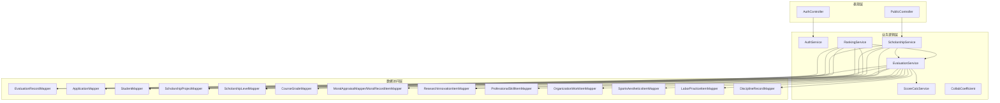
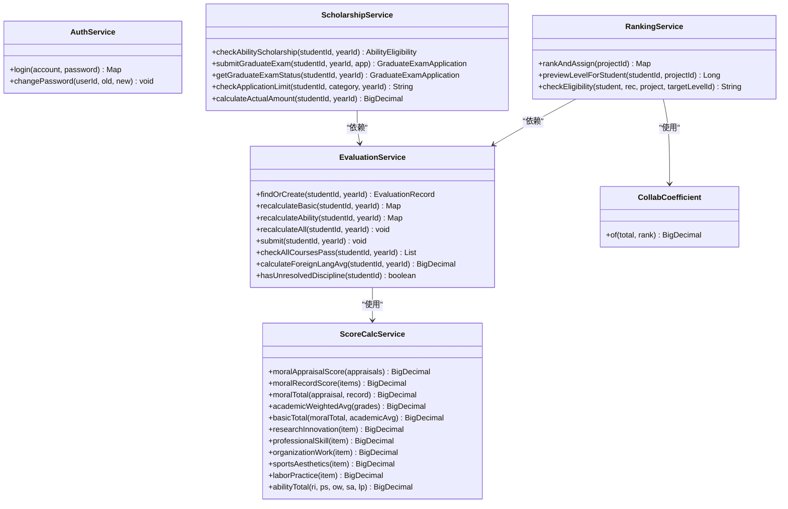
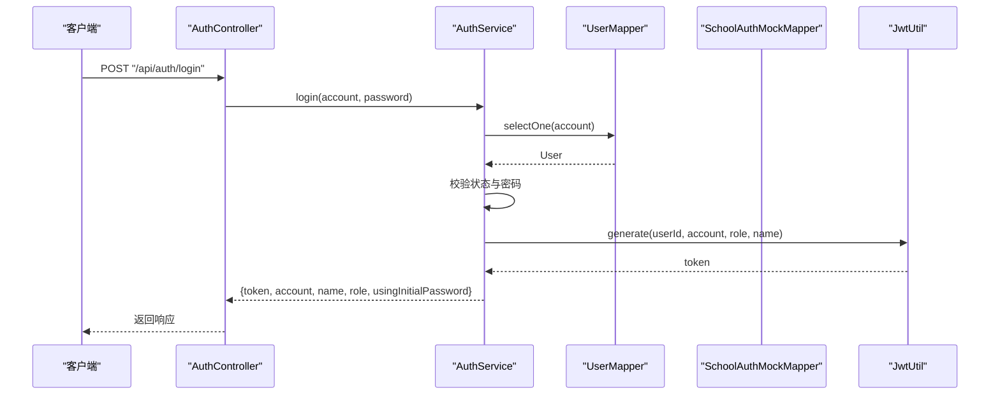
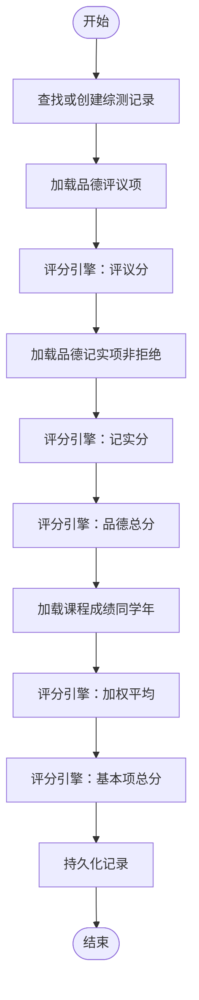
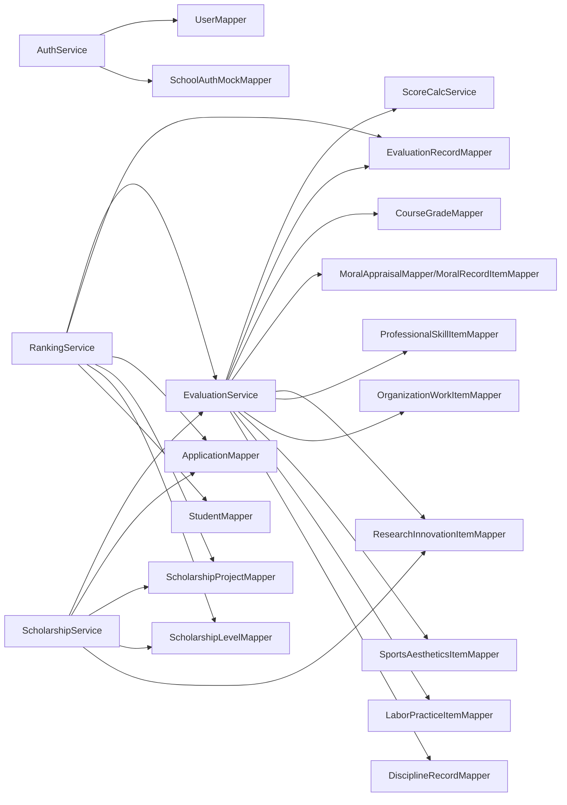

# 业务逻辑层

<cite>
**本文引用的文件**
- [AuthService.java](file://backend/src/main/java/com/zjsu/scholarship/service/AuthService.java)
- [EvaluationService.java](file://backend/src/main/java/com/zjsu/scholarship/service/EvaluationService.java)
- [ScholarshipService.java](file://backend/src/main/java/com/zjsu/scholarship/service/ScholarshipService.java)
- [ScoreCalcService.java](file://backend/src/main/java/com/zjsu/scholarship/service/ScoreCalcService.java)
- [RankingService.java](file://backend/src/main/java/com/zjsu/scholarship/service/RankingService.java)
- [CollabCoefficient.java](file://backend/src/main/java/com/zjsu/scholarship/service/CollabCoefficient.java)
- [BusinessException.java](file://backend/src/main/java/com/zjsu/scholarship/common/BusinessException.java)
- [JwtUtil.java](file://backend/src/main/java/com/zjsu/scholarship/security/JwtUtil.java)
- [application.yml](file://backend/src/main/resources/application.yml)
- [EvaluationRecord.java](file://backend/src/main/java/com/zjsu/scholarship/entity/EvaluationRecord.java)
- [Application.java](file://backend/src/main/java/com/zjsu/scholarship/entity/Application.java)
- [ScholarshipProject.java](file://backend/src/main/java/com/zjsu/scholarship/entity/ScholarshipProject.java)
- [AuthController.java](file://backend/src/main/java/com/zjsu/scholarship/controller/AuthController.java)
- [PublicController.java](file://backend/src/main/java/com/zjsu/scholarship/controller/PublicController.java)
</cite>

## 目录
1. [引言](#引言)
2. [项目结构](#项目结构)
3. [核心组件](#核心组件)
4. [架构总览](#架构总览)
5. [详细组件分析](#详细组件分析)
6. [依赖分析](#依赖分析)
7. [性能考虑](#性能考虑)
8. [故障排查指南](#故障排查指南)
9. [结论](#结论)
10. [附录](#附录)

## 引言
本设计文档聚焦奖学金管理系统的业务逻辑层（Service 层），系统采用 Spring Boot + MyBatis-Plus 架构，Service 层承担完整的业务编排、规则校验、数据转换与事务控制职责。本文围绕以下目标展开：
- 明确 Service 层职责边界与设计原则（事务管理、业务规则验证、数据转换）
- 深入解析五大核心服务的业务流程与算法实现：认证服务、综合测评服务、奖学金服务、评分计算引擎、等级分配服务
- 描述评分算法细节（基本项、综合能力评分与等级分配规则）
- 解释状态管理与并发控制机制
- 提供异常处理策略与数据一致性保障方案
- 给出性能优化与缓存策略建议

## 项目结构
后端采用标准分层架构，Service 层位于 Controller 与 Mapper 之间，向上承接接口请求，向下协调数据访问与领域规则。

图表来源
- [AuthController.java:11-44](file://backend/src/main/java/com/zjsu/scholarship/controller/AuthController.java#L11-L44)
- [PublicController.java:11-78](file://backend/src/main/java/com/zjsu/scholarship/controller/PublicController.java#L11-L78)
- [AuthService.java:16-77](file://backend/src/main/java/com/zjsu/scholarship/service/AuthService.java#L16-L77)
- [EvaluationService.java:22-61](file://backend/src/main/java/com/zjsu/scholarship/service/EvaluationService.java#L22-L61)
- [ScholarshipService.java:21-49](file://backend/src/main/java/com/zjsu/scholarship/service/ScholarshipService.java#L21-L49)
- [RankingService.java:25-47](file://backend/src/main/java/com/zjsu/scholarship/service/RankingService.java#L25-L47)
- [ScoreCalcService.java:18-423](file://backend/src/main/java/com/zjsu/scholarship/service/ScoreCalcService.java#L18-L423)

章节来源
- [application.yml:1-52](file://backend/src/main/resources/application.yml#L1-L52)

## 核心组件
- 认证服务（AuthService）：负责登录校验、密码变更、令牌签发；统一处理账号状态与初始密码迁移。
- 综合测评服务（EvaluationService）：双轨制评分（基本项=品德×30%+专业×70%；综合能力=75+五模块加权），支持单项重算与整体提交。
- 评分计算引擎（ScoreCalcService）：实现2025版规则的评分算法，覆盖品德评议、品德记实、专业素质、五模块评分与合作系数。
- 奖学金服务（ScholarshipService）：能力突出奖学金自动判定、考研奖学金申请、申报限制校验、奖金发放规则。
- 等级分配服务（RankingService）：执行双排名与等级分配，提供硬性条件校验与预览功能。

章节来源
- [AuthService.java:16-77](file://backend/src/main/java/com/zjsu/scholarship/service/AuthService.java#L16-L77)
- [EvaluationService.java:22-61](file://backend/src/main/java/com/zjsu/scholarship/service/EvaluationService.java#L22-L61)
- [ScoreCalcService.java:18-423](file://backend/src/main/java/com/zjsu/scholarship/service/ScoreCalcService.java#L18-L423)
- [ScholarshipService.java:21-49](file://backend/src/main/java/com/zjsu/scholarship/service/ScholarshipService.java#L21-L49)
- [RankingService.java:25-47](file://backend/src/main/java/com/zjsu/scholarship/service/RankingService.java#L25-L47)

## 架构总览
Service 层通过依赖注入聚合各 Mapper，围绕实体模型进行业务编排，并在关键路径上使用声明式事务确保原子性与一致性。

图表来源
- [AuthService.java:16-77](file://backend/src/main/java/com/zjsu/scholarship/service/AuthService.java#L16-L77)
- [EvaluationService.java:22-61](file://backend/src/main/java/com/zjsu/scholarship/service/EvaluationService.java#L22-L61)
- [ScoreCalcService.java:18-423](file://backend/src/main/java/com/zjsu/scholarship/service/ScoreCalcService.java#L18-L423)
- [ScholarshipService.java:21-49](file://backend/src/main/java/com/zjsu/scholarship/service/ScholarshipService.java#L21-L49)
- [RankingService.java:25-47](file://backend/src/main/java/com/zjsu/scholarship/service/RankingService.java#L25-L47)
- [CollabCoefficient.java:6-27](file://backend/src/main/java/com/zjsu/scholarship/service/CollabCoefficient.java#L6-L27)

## 详细组件分析

### 认证服务（AuthService）
- 职责边界
  - 用户登录：账户存在性与状态校验、密码匹配（支持初始密码与哈希密码两种模式）、签发 JWT。
  - 密码管理：旧密码校验、新密码长度校验、密码加密与更新。
- 设计原则
  - 安全性：密码使用编码器存储，登录失败与状态异常抛出业务异常。
  - 可维护性：分离真实用户与模拟初始密码路径，便于迁移。
- 关键流程（登录）

图表来源
- [AuthController.java:21-24](file://backend/src/main/java/com/zjsu/scholarship/controller/AuthController.java#L21-L24)
- [AuthService.java:32-55](file://backend/src/main/java/com/zjsu/scholarship/service/AuthService.java#L32-L55)
- [JwtUtil.java:28-42](file://backend/src/main/java/com/zjsu/scholarship/security/JwtUtil.java#L28-L42)

章节来源
- [AuthService.java:16-77](file://backend/src/main/java/com/zjsu/scholarship/service/AuthService.java#L16-L77)
- [JwtUtil.java:15-52](file://backend/src/main/java/com/zjsu/scholarship/security/JwtUtil.java#L15-L52)

### 综合测评服务（EvaluationService）
- 职责边界
  - 基本项计算：品德评议分、品德记实分、品德总分、专业素质（加权平均）、基本项总分。
  - 综合能力计算：研究创新、专业技能、组织工作、体育美育、劳动实践五模块评分与总分。
  - 提交流程：统一重算并提交状态更新。
- 设计原则
  - 事务性：基本项与综合能力重算、整体提交均在事务内完成，保证一致性。
  - 可扩展性：评分算法由 ScoreCalcService 实现，Service 仅编排。
- 关键流程（基本项重算）

图表来源
- [EvaluationService.java:91-135](file://backend/src/main/java/com/zjsu/scholarship/service/EvaluationService.java#L91-L135)
- [ScoreCalcService.java:28-178](file://backend/src/main/java/com/zjsu/scholarship/service/ScoreCalcService.java#L28-L178)

章节来源
- [EvaluationService.java:22-308](file://backend/src/main/java/com/zjsu/scholarship/service/EvaluationService.java#L22-L308)
- [ScoreCalcService.java:18-423](file://backend/src/main/java/com/zjsu/scholarship/service/ScoreCalcService.java#L18-L423)

### 评分计算引擎（ScoreCalcService）
- 基本项评分
  - 品德评议分：自评×5% + 学生代表×60% + 辅导员×35%，六维维度求和。
  - 品德记实分：基准60分 + 各项增减分（荣誉、集体荣誉、处分），分别设上限。
  - 品德总分：评议×70% + 记实×30%。
  - 专业素质：课程加权平均。
  - 基本项总分：品德总分×30% + 专业素质×70%。
- 综合能力评分
  - 研究创新：竞赛/论文/专利/项目等分类基础分，结合类别系数与合作系数（含核心成员系数）。
  - 专业技能：CET4/6、计算机等级、证书等级、入学考试等。
  - 组织工作：岗位分+绩效分×任期系数。
  - 体育美育、劳动实践：按级别对应基础分，团队按核心成员系数折算。
  - 综合能力总分：75 + Σ各模块加权。
- 合作系数（CollabCoefficient）
  - 基于总人数与排名的二维表，提供分摊系数，确保多人成果公平分配。

章节来源
- [ScoreCalcService.java:18-423](file://backend/src/main/java/com/zjsu/scholarship/service/ScoreCalcService.java#L18-L423)
- [CollabCoefficient.java:6-27](file://backend/src/main/java/com/zjsu/scholarship/service/CollabCoefficient.java#L6-L27)

### 奖学金服务（ScholarshipService）
- 能力突出奖学金自动判定
  - 学习优秀奖：基本项排名前20%且未获综合奖学金。
  - 综合能力突出奖：综合能力排名前20%且未获综合奖学金。
  - 研究创新奖：国家级三等奖/省级一等奖、SCI/EI/ISTP一作等。
- 考研奖学金
  - 申报限制：每学年仅一次；根据录取情况自动定级。
- 申报限制校验
  - 能力突出、单项、专项每人限报一项；综合奖学金不限。
- 奖金发放规则
  - 综合与单项可并列，按最高金额发放。

章节来源
- [ScholarshipService.java:21-280](file://backend/src/main/java/com/zjsu/scholarship/service/ScholarshipService.java#L21-L280)

### 等级分配服务（RankingService）
- 双排名与等级分配
  - 全员重算综测分 → 基本项降序排名 → 综合能力降序排名 → 基本项前30%筛选 → 按等级比例切分 → 一等奖额外校验（基本项前15% + 能力前30%）。
- 硬性条件校验
  - 全部课程合格且加权≥75；基本项排名前30%（一等奖前15%+前30%）；外语条件（课均分或CET4/6）；体育≥80（非免测）；劳动教育合格；无未解除处分。
- 预览功能
  - 根据项目参数与学生排名预估推荐等级。

章节来源
- [RankingService.java:25-437](file://backend/src/main/java/com/zjsu/scholarship/service/RankingService.java#L25-L437)
- [EvaluationRecord.java:11-45](file://backend/src/main/java/com/zjsu/scholarship/entity/EvaluationRecord.java#L11-L45)
- [Application.java:11-43](file://backend/src/main/java/com/zjsu/scholarship/entity/Application.java#L11-L43)
- [ScholarshipProject.java:11-50](file://backend/src/main/java/com/zjsu/scholarship/entity/ScholarshipProject.java#L11-L50)

## 依赖分析
- 组件耦合
  - EvaluationService 与 ScoreCalcService 强依赖，前者负责数据聚合，后者负责纯算法。
  - RankingService 依赖 EvaluationService 的重算结果与实体快照。
  - ScholarshipService 依赖 EvaluationService 的资格校验与项目规则。
- 外部依赖
  - MyBatis-Plus Mapper 接口、H2 数据库、JWT 工具、Spring Security 编码器。
- 并发与一致性
  - 使用 @Transactional 确保关键路径原子性；双排名与等级分配在单事务内完成，避免中间态读取。

图表来源
- [EvaluationService.java:22-61](file://backend/src/main/java/com/zjsu/scholarship/service/EvaluationService.java#L22-L61)
- [RankingService.java:25-47](file://backend/src/main/java/com/zjsu/scholarship/service/RankingService.java#L25-L47)
- [ScholarshipService.java:21-49](file://backend/src/main/java/com/zjsu/scholarship/service/ScholarshipService.java#L21-L49)
- [AuthService.java:16-30](file://backend/src/main/java/com/zjsu/scholarship/service/AuthService.java#L16-L30)

## 性能考虑
- 事务范围控制
  - 将批量重算与写入合并为单事务，减少锁竞争与重复计算。
- 批量操作优化
  - 双排名阶段对记录集进行内存排序，避免多次数据库排序；必要时可引入分页游标。
- 缓存策略
  - 项目规则（如等级比例、外语门槛）可缓存于内存，降低频繁查询成本。
  - 评分引擎中的合作系数表可常驻内存，避免重复构造。
- I/O 优化
  - 评分计算与规则判断尽量在内存完成，减少 Mapper 调用次数。
- 并发控制
  - 排名与等级分配采用排他锁或分布式锁，防止并发重入导致的排名错乱。
- 日志与监控
  - 对关键耗时步骤（重算、排序、写入）埋点，结合慢查询日志定位瓶颈。

## 故障排查指南
- 登录失败
  - 账号不存在、账号冻结、密码错误、初始密码与哈希密码混用场景。
  - 排查要点：检查用户状态、密码编码器匹配、初始密码表是否存在。
- 评分异常
  - 品德评议/记实为空、课程成绩缺失、合作系数越界。
  - 排查要点：确认输入数据完整性、评分引擎边界值处理。
- 排名与等级分配异常
  - 基本项/能力项排名为空、等级比例计算错误、一等奖额外校验不通过。
  - 排查要点：确认重算是否完成、项目规则字段是否正确、过滤阈值计算。
- 事务回滚
  - 关键路径抛出业务异常或运行时异常导致回滚，需检查异常类型与事务传播行为。

章节来源
- [BusinessException.java:3-19](file://backend/src/main/java/com/zjsu/scholarship/common/BusinessException.java#L3-L19)
- [AuthService.java:35-45](file://backend/src/main/java/com/zjsu/scholarship/service/AuthService.java#L35-L45)
- [RankingService.java:105-117](file://backend/src/main/java/com/zjsu/scholarship/service/RankingService.java#L105-L117)

## 结论
Service 层通过清晰的职责划分与严格的事务控制，实现了从认证、评分、评审到等级分配的完整闭环。评分算法遵循2025版规则，具备良好的可扩展性；等级分配采用双排名与硬性条件校验，兼顾公平与效率。建议在生产环境进一步完善缓存与并发控制策略，持续优化批量重算与排序性能。

## 附录
- API 示例（基于现有控制器）
  - 登录：POST /api/auth/login
  - 当前用户：GET /api/auth/me
  - 修改密码：POST /api/auth/change-password
  - 成绩查询：GET /api/public/results
  - 项目查询：GET /api/public/projects

章节来源
- [AuthController.java:11-44](file://backend/src/main/java/com/zjsu/scholarship/controller/AuthController.java#L11-L44)
- [PublicController.java:11-78](file://backend/src/main/java/com/zjsu/scholarship/controller/PublicController.java#L11-L78)