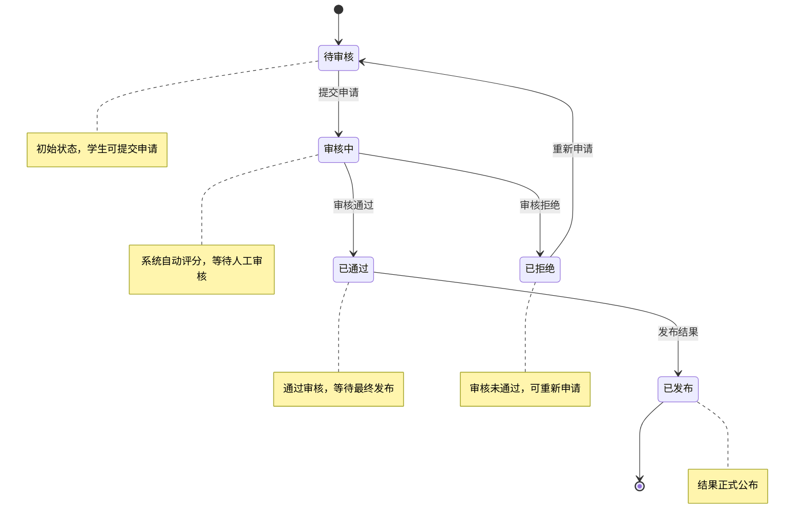
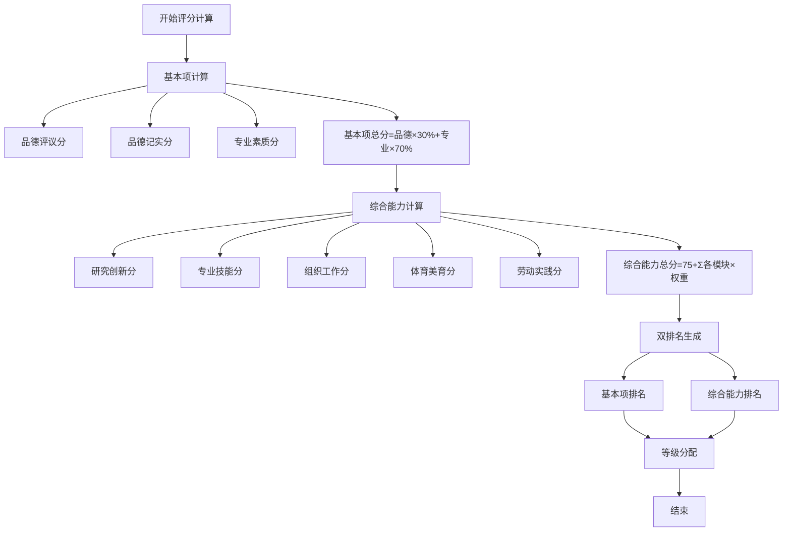
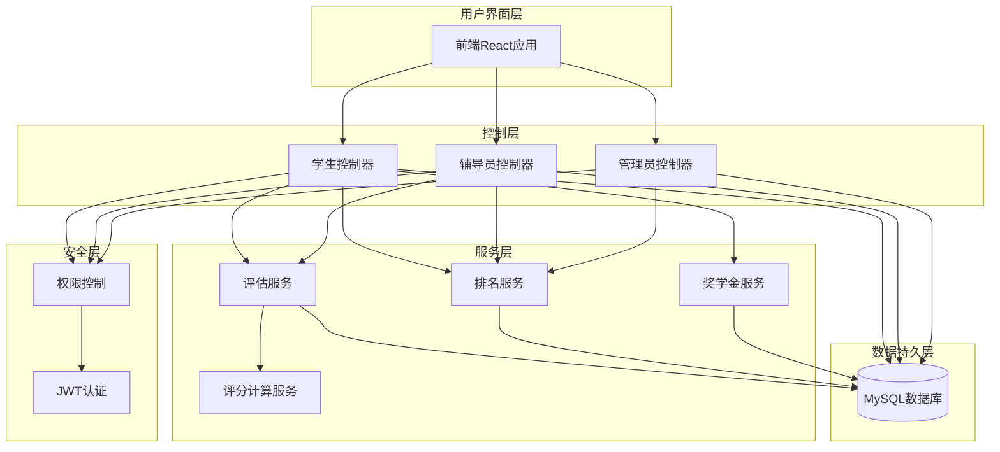
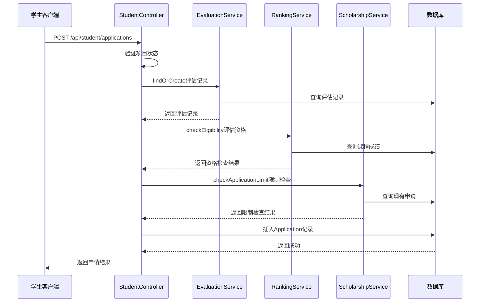
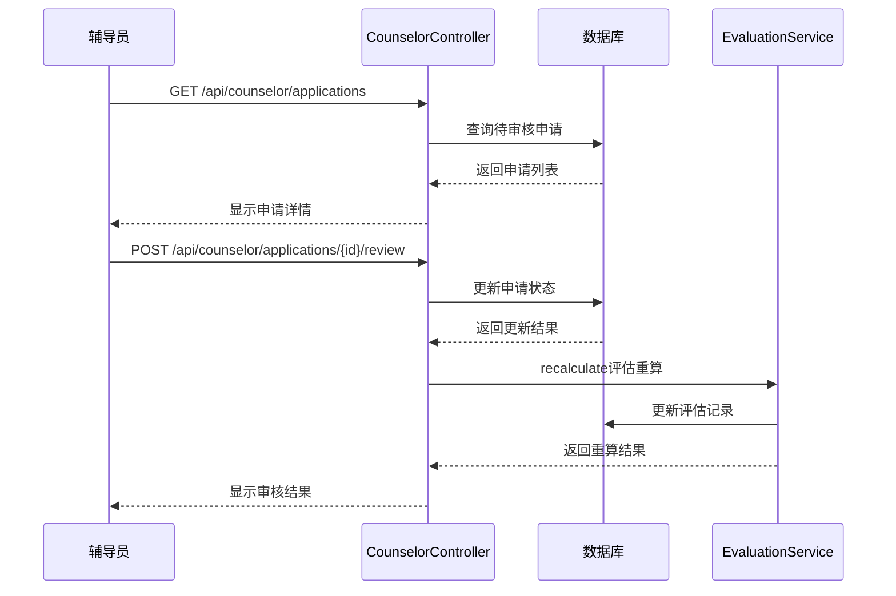
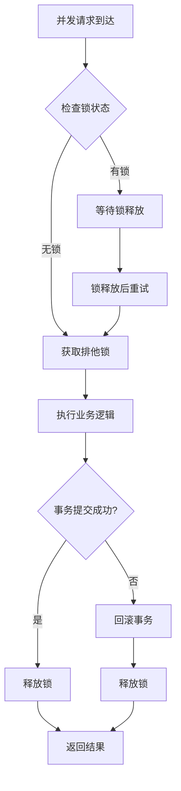
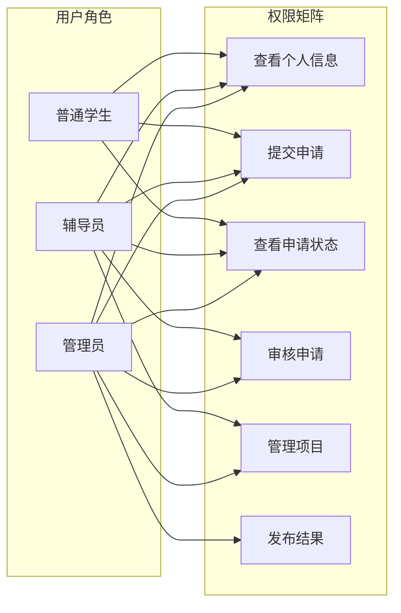
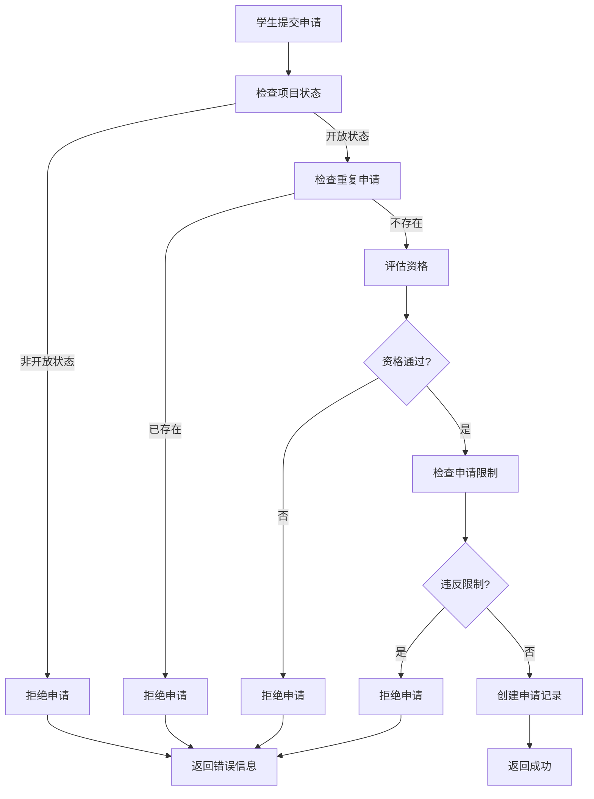
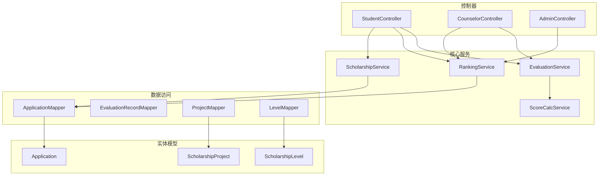
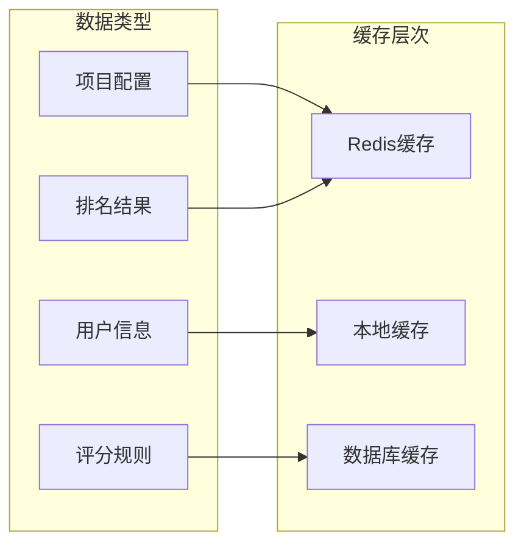

# 奖学金申请服务

<cite>
**本文档引用的文件**
- [ScholarshipApplication.java](file://backend/src/main/java/com/zjsu/scholarship/ScholarshipApplication.java)
- [ScholarshipService.java](file://backend/src/main/java/com/zjsu/scholarship/service/ScholarshipService.java)
- [Application.java](file://backend/src/main/java/com/zjsu/scholarship/entity/Application.java)
- [ApplicationMapper.java](file://backend/src/main/java/com/zjsu/scholarship/mapper/ApplicationMapper.java)
- [StudentController.java](file://backend/src/main/java/com/zjsu/scholarship/controller/StudentController.java)
- [RankingService.java](file://backend/src/main/java/com/zjsu/scholarship/service/RankingService.java)
- [EvaluationService.java](file://backend/src/main/java/com/zjsu/scholarship/service/EvaluationService.java)
- [ScholarshipProject.java](file://backend/src/main/java/com/zjsu/scholarship/entity/ScholarshipProject.java)
- [ScholarshipLevel.java](file://backend/src/main/java/com/zjsu/scholarship/entity/ScholarshipLevel.java)
- [AuthContext.java](file://backend/src/main/java/com/zjsu/scholarship/security/AuthContext.java)
- [AdminController.java](file://backend/src/main/java/com/zjsu/scholarship/controller/AdminController.java)
- [CounselorController.java](file://backend/src/main/java/com/zjsu/scholarship/controller/CounselorController.java)
- [schema.sql](file://backend/src/main/resources/db/schema.sql)
- [ScoreCalcService.java](file://backend/src/main/java/com/zjsu/scholarship/service/ScoreCalcService.java)
- [R.java](file://backend/src/main/java/com/zjsu/scholarship/common/R.java)
</cite>

## 目录
1. [引言](#引言)
2. [项目结构](#项目结构)
3. [核心组件](#核心组件)
4. [架构概览](#架构概览)
5. [详细组件分析](#详细组件分析)
6. [依赖分析](#依赖分析)
7. [性能考虑](#性能考虑)
8. [故障排除指南](#故障排除指南)
9. [结论](#结论)

## 引言

奖学金申请服务是一个基于Spring Boot开发的综合性奖学金评选管理系统，依据《浙江工商大学奖学金实施办法》(2025版)设计。该系统实现了完整的奖学金申请生命周期管理，包括申请创建、材料审核、进度跟踪和结果通知等环节。

系统采用双轨制评分体系，结合基本项（品德+专业素质）和综合能力（研究创新+专业技能+组织工作+体育美育+劳动实践）进行双重排名，确保评选的公平性和科学性。支持多种奖学金类型，包括优秀学生综合奖学金、能力突出奖学金、单项奖学金、专项奖学金和国家奖学金等。

## 项目结构

奖学金申请服务采用标准的Spring Boot三层架构模式，主要分为以下层次：

**图表来源**
- [StudentController.java:1-719](file://backend/src/main/java/com/zjsu/scholarship/controller/StudentController.java#L1-L719)
- [ScholarshipService.java:1-280](file://backend/src/main/java/com/zjsu/scholarship/service/ScholarshipService.java#L1-L280)
- [EvaluationService.java:1-308](file://backend/src/main/java/com/zjsu/scholarship/service/EvaluationService.java#L1-L308)

**章节来源**
- [ScholarshipApplication.java:1-14](file://backend/src/main/java/com/zjsu/scholarship/ScholarshipApplication.java#L1-L14)
- [schema.sql:1-402](file://backend/src/main/resources/db/schema.sql#L1-L402)

## 核心组件

### 申请状态管理

系统实现了完整的申请状态生命周期管理，涵盖以下状态转换：

**图表来源**
- [Application.java:34-35](file://backend/src/main/java/com/zjsu/scholarship/entity/Application.java#L34-L35)
- [StudentController.java:549-589](file://backend/src/main/java/com/zjsu/scholarship/controller/StudentController.java#L549-L589)

### 评分计算引擎

系统采用双轨制评分体系，实现基本项和综合能力的独立计算：

**图表来源**
- [ScoreCalcService.java:28-178](file://backend/src/main/java/com/zjsu/scholarship/service/ScoreCalcService.java#L28-L178)
- [ScoreCalcService.java:405-414](file://backend/src/main/java/com/zjsu/scholarship/service/ScoreCalcService.java#L405-L414)

**章节来源**
- [ScholarshipService.java:55-171](file://backend/src/main/java/com/zjsu/scholarship/service/ScholarshipService.java#L55-L171)
- [EvaluationService.java:91-173](file://backend/src/main/java/com/zjsu/scholarship/service/EvaluationService.java#L91-L173)

## 架构概览

系统采用分层架构设计，确保关注点分离和代码的可维护性：

**图表来源**
- [StudentController.java:22-86](file://backend/src/main/java/com/zjsu/scholarship/controller/StudentController.java#L22-L86)
- [CounselorController.java:18-65](file://backend/src/main/java/com/zjsu/scholarship/controller/CounselorController.java#L18-L65)
- [AdminController.java:20-61](file://backend/src/main/java/com/zjsu/scholarship/controller/AdminController.java#L20-L61)

## 详细组件分析

### 申请流程管理

#### 申请创建流程

学生申请流程实现了严格的验证和控制机制：

**图表来源**
- [StudentController.java:549-589](file://backend/src/main/java/com/zjsu/scholarship/controller/StudentController.java#L549-L589)
- [RankingService.java:311-429](file://backend/src/main/java/com/zjsu/scholarship/service/RankingService.java#L311-L429)
- [ScholarshipService.java:223-240](file://backend/src/main/java/com/zjsu/scholarship/service/ScholarshipService.java#L223-L240)

#### 材料审核流程

辅导员审核流程确保了评审的公正性和透明度：

**图表来源**
- [CounselorController.java:233-279](file://backend/src/main/java/com/zjsu/scholarship/controller/CounselorController.java#L233-L279)
- [EvaluationService.java:177-184](file://backend/src/main/java/com/zjsu/scholarship/service/EvaluationService.java#L177-L184)

### 状态控制系统

#### 申请状态转换规则

系统实现了严格的申请状态转换控制：

| 当前状态 | 可转换状态 | 触发条件 | 说明 |
|---------|-----------|----------|------|
| 待审核 | 审核中 | 学生提交申请 | 自动转换 |
| 审核中 | 已通过 | 审核通过 | 人工确认 |
| 审核中 | 已拒绝 | 审核不通过 | 人工确认 |
| 已通过 | 已发布 | 管理员发布 | 系统操作 |
| 已拒绝 | 待审核 | 学生重新申请 | 重新提交 |
| 已发布 | - | - | 终态 |

#### 并发控制策略

系统采用多层并发控制机制确保数据一致性：

**图表来源**
- [Application.java:34-42](file://backend/src/main/java/com/zjsu/scholarship/entity/Application.java#L34-L42)
- [StudentController.java:609-620](file://backend/src/main/java/com/zjsu/scholarship/controller/StudentController.java#L609-L620)

### 权限控制机制

#### 角色权限体系

系统实现了基于角色的权限控制（RBAC）：

**图表来源**
- [AuthContext.java:10-18](file://backend/src/main/java/com/zjsu/scholarship/security/AuthContext.java#L10-L18)
- [StudentController.java:24](file://backend/src/main/java/com/zjsu/scholarship/controller/StudentController.java#L24)
- [CounselorController.java:20](file://backend/src/main/java/com/zjsu/scholarship/controller/CounselorController.java#L20)
- [AdminController.java:22](file://backend/src/main/java/com/zjsu/scholarship/controller/AdminController.java#L22)

### 材料验证逻辑

#### 申请限制检查

系统实现了多层次的申请限制检查：

**图表来源**
- [StudentController.java:549-589](file://backend/src/main/java/com/zjsu/scholarship/controller/StudentController.java#L549-L589)
- [ScholarshipService.java:223-240](file://backend/src/main/java/com/zjsu/scholarship/service/ScholarshipService.java#L223-L240)

#### 资格验证规则

系统实现了严格的资格验证机制：

| 验证项目 | 验证规则 | 通过条件 | 说明 |
|---------|----------|----------|------|
| 课程成绩 | 全部课程≥60分 | 通过 | 基础要求 |
| 加权平均分 | ≥75分 | 通过 | 综合能力要求 |
| 基本项排名 | 前30% | 通过 | 过滤门槛 |
| 外语水平 | 课均分≥75或CET4≥425 | 通过 | 外语要求 |
| 体育成绩 | ≥80分或免测 | 通过 | 体育要求 |
| 劳动教育 | 合格 | 通过 | 劳动教育要求 |
| 处分记录 | 无未解除处分 | 通过 | 品德要求 |

**章节来源**
- [RankingService.java:311-429](file://backend/src/main/java/com/zjsu/scholarship/service/RankingService.java#L311-L429)
- [EvaluationService.java:264-306](file://backend/src/main/java/com/zjsu/scholarship/service/EvaluationService.java#L264-L306)

## 依赖分析

系统采用模块化设计，各组件间依赖关系清晰：

**图表来源**
- [ScholarshipService.java:24-49](file://backend/src/main/java/com/zjsu/scholarship/service/ScholarshipService.java#L24-L49)
- [StudentController.java:27-86](file://backend/src/main/java/com/zjsu/scholarship/controller/StudentController.java#L27-L86)

**章节来源**
- [schema.sql:294-315](file://backend/src/main/resources/db/schema.sql#L294-L315)
- [Application.java:14-42](file://backend/src/main/java/com/zjsu/scholarship/entity/Application.java#L14-L42)

## 性能考虑

### 数据库优化

系统采用了多项数据库优化策略：

1. **索引优化**：为常用查询字段建立索引，包括学生ID、项目ID、状态字段等
2. **查询优化**：使用分页查询避免大数据集加载
3. **连接池配置**：合理配置数据库连接池参数
4. **事务管理**：使用合适的事务隔离级别

### 缓存策略

系统实现了多层次缓存机制：

### 并发处理

系统采用异步处理和批量操作提升性能：

1. **批量评分**：支持批量计算学生成绩
2. **异步审核**：审核结果异步通知
3. **缓存预热**：启动时预加载常用数据

## 故障排除指南

### 常见问题及解决方案

#### 申请提交失败

**问题现象**：学生无法提交奖学金申请

**可能原因**：
1. 项目状态不是开放状态
2. 学生已存在相同项目的申请
3. 资格检查未通过
4. 申请限制检查失败

**解决步骤**：
1. 检查项目状态：`GET /api/admin/projects`
2. 验证学生资格：`GET /api/student/scholarships/eligible`
3. 清理重复申请：`DELETE /api/student/applications/{id}`

#### 审核流程异常

**问题现象**：辅导员无法审核申请

**可能原因**：
1. 申请状态不是待审核
2. 权限不足
3. 数据库连接异常

**解决步骤**：
1. 检查申请状态：`GET /api/counselor/applications`
2. 验证权限：确认用户角色
3. 重启数据库服务

#### 排名计算错误

**问题现象**：排名结果不正确

**可能原因**：
1. 评分计算错误
2. 数据同步延迟
3. 排名算法问题

**解决步骤**：
1. 重新计算评分：`POST /api/admin/projects/{id}/rank`
2. 检查数据完整性
3. 验证算法逻辑

**章节来源**
- [StudentController.java:549-589](file://backend/src/main/java/com/zjsu/scholarship/controller/StudentController.java#L549-L589)
- [CounselorController.java:259-279](file://backend/src/main/java/com/zjsu/scholarship/controller/CounselorController.java#L259-L279)
- [AdminController.java:156-175](file://backend/src/main/java/com/zjsu/scholarship/controller/AdminController.java#L156-L175)

## 结论

奖学金申请服务是一个功能完整、架构清晰的综合性管理系统。系统通过双轨制评分体系和严格的权限控制，确保了奖学金评选的公平性和透明度。

### 主要优势

1. **完整的生命周期管理**：从申请创建到结果发布的全流程覆盖
2. **严格的权限控制**：基于角色的细粒度权限管理
3. **可靠的并发控制**：多层并发控制确保数据一致性
4. **灵活的配置管理**：支持不同类型的奖学金项目配置
5. **完善的审核机制**：人工审核与系统评分相结合

### 技术特色

1. **双轨制评分体系**：基本项和综合能力双重评估
2. **智能资格检查**：自动化的申请资格验证
3. **可视化状态管理**：清晰的申请状态流转
4. **可扩展的架构**：模块化设计便于功能扩展

该系统为高校奖学金管理工作提供了强有力的技术支撑，有效提升了工作效率和管理水平。