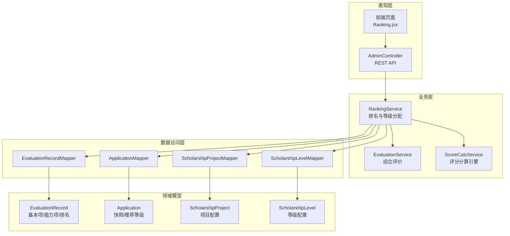
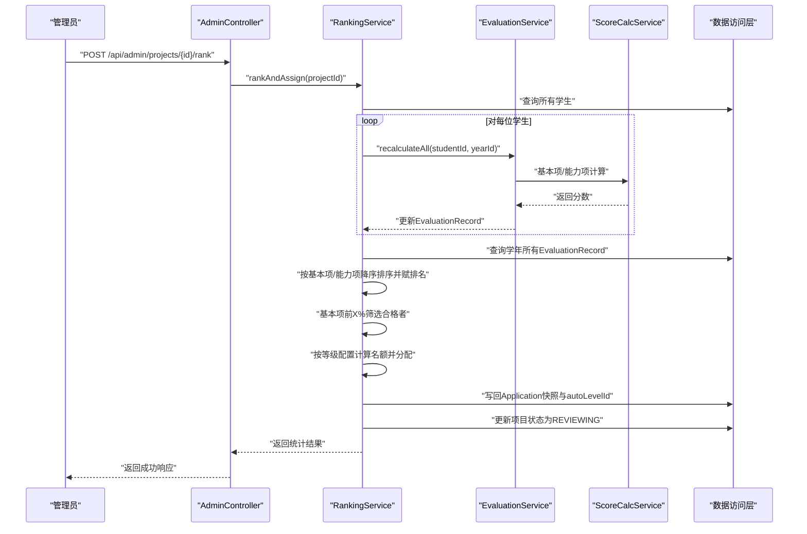
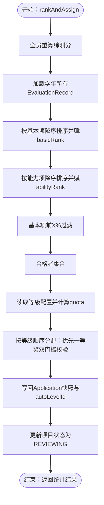
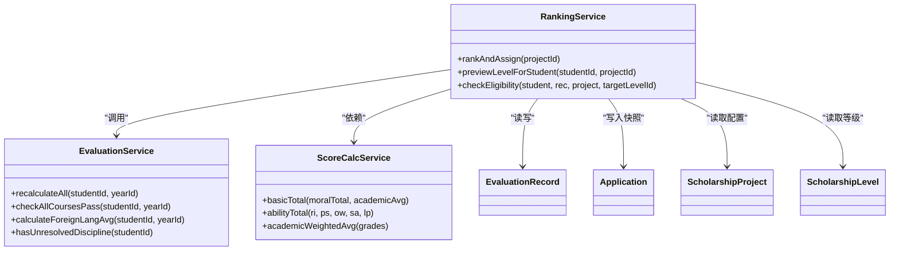

# 排名统计服务

<cite>
**本文档引用的文件**
- [RankingService.java](file://backend/src/main/java/com/zjsu/scholarship/service/RankingService.java)
- [EvaluationService.java](file://backend/src/main/java/com/zjsu/scholarship/service/EvaluationService.java)
- [ScoreCalcService.java](file://backend/src/main/java/com/zjsu/scholarship/service/ScoreCalcService.java)
- [ScholarshipProject.java](file://backend/src/main/java/com/zjsu/scholarship/entity/ScholarshipProject.java)
- [ScholarshipLevel.java](file://backend/src/main/java/com/zjsu/scholarship/entity/ScholarshipLevel.java)
- [EvaluationRecord.java](file://backend/src/main/java/com/zjsu/scholarship/entity/EvaluationRecord.java)
- [Application.java](file://backend/src/main/java/com/zjsu/scholarship/entity/Application.java)
- [EvaluationRecordMapper.java](file://backend/src/main/java/com/zjsu/scholarship/mapper/EvaluationRecordMapper.java)
- [ApplicationMapper.java](file://backend/src/main/java/com/zjsu/scholarship/mapper/ApplicationMapper.java)
- [ScholarshipProjectMapper.java](file://backend/src/main/java/com/zjsu/scholarship/mapper/ScholarshipProjectMapper.java)
- [ScholarshipLevelMapper.java](file://backend/src/main/java/com/zjsu/scholarship/mapper/ScholarshipLevelMapper.java)
- [AdminController.java](file://backend/src/main/java/com/zjsu/scholarship/controller/AdminController.java)
- [Ranking.jsx](file://frontend/src/pages/admin/Ranking.jsx)
- [README.md](file://README.md)
</cite>

## 目录
1. [简介](#简介)
2. [项目结构](#项目结构)
3. [核心组件](#核心组件)
4. [架构概览](#架构概览)
5. [详细组件分析](#详细组件分析)
6. [依赖分析](#依赖分析)
7. [性能考虑](#性能考虑)
8. [故障排除指南](#故障排除指南)
9. [结论](#结论)
10. [附录](#附录)

## 简介
本文件系统性阐述排名统计服务（RankingService）的实现，重点覆盖以下方面：
- 双排名算法设计：基本项排名与综合能力排名的计算与应用
- 等级分配规则：按比例切分与额外门槛控制（一等奖的双门槛校验）
- 数据处理流程：批量重算、增量更新与缓存策略
- 冲突解决机制：并列排名处理、动态调整与公平性保障
- 结果验证与审计：硬性条件校验、快照记录与可追溯性
- 性能优化与大数据量处理：时间复杂度分析与优化建议
- 完整流程图与关键决策点：从数据准备到结果落库的全流程

## 项目结构
后端采用分层架构，排名统计服务位于业务层，依赖数据访问层（Mapper）与实体模型，配合控制器对外提供API。

**图表来源**
- [RankingService.java:25-47](file://backend/src/main/java/com/zjsu/scholarship/service/RankingService.java#L25-L47)
- [EvaluationService.java:22-61](file://backend/src/main/java/com/zjsu/scholarship/service/EvaluationService.java#L22-L61)
- [ScoreCalcService.java:18-23](file://backend/src/main/java/com/zjsu/scholarship/service/ScoreCalcService.java#L18-L23)
- [EvaluationRecordMapper.java:1-8](file://backend/src/main/java/com/zjsu/scholarship/mapper/EvaluationRecordMapper.java#L1-L8)
- [ApplicationMapper.java:1-8](file://backend/src/main/java/com/zjsu/scholarship/mapper/ApplicationMapper.java#L1-L8)
- [ScholarshipProjectMapper.java:1-8](file://backend/src/main/java/com/zjsu/scholarship/mapper/ScholarshipProjectMapper.java#L1-L8)
- [ScholarshipLevelMapper.java:1-8](file://backend/src/main/java/com/zjsu/scholarship/mapper/ScholarshipLevelMapper.java#L1-L8)

**章节来源**
- [RankingService.java:14-26](file://backend/src/main/java/com/zjsu/scholarship/service/RankingService.java#L14-L26)
- [EvaluationService.java:15-23](file://backend/src/main/java/com/zjsu/scholarship/service/EvaluationService.java#L15-L23)
- [ScoreCalcService.java:10-17](file://backend/src/main/java/com/zjsu/scholarship/service/ScoreCalcService.java#L10-L17)

## 核心组件
- RankingService：执行双排名与等级分配的核心服务，负责批量重算、排序、过滤、等级切分与结果写回。
- EvaluationService：负责基本项与能力项的独立与整体重算，支撑RankingService的输入数据质量。
- ScoreCalcService：评分计算引擎，提供基本项与能力项的标准化计算公式与权重。
- 实体与映射器：EvaluationRecord、Application、ScholarshipProject、ScholarshipLevel及其Mapper，承载数据与持久化。

**章节来源**
- [RankingService.java:25-47](file://backend/src/main/java/com/zjsu/scholarship/service/RankingService.java#L25-L47)
- [EvaluationService.java:22-61](file://backend/src/main/java/com/zjsu/scholarship/service/EvaluationService.java#L22-L61)
- [ScoreCalcService.java:18-23](file://backend/src/main/java/com/zjsu/scholarship/service/ScoreCalcService.java#L18-L23)

## 架构概览
RankingService在事务边界内完成一次完整的排名周期：全员重算 → 双排名 → 基本项过滤 → 能力项排序 → 等级分配 → 快照写回 → 状态更新。

**图表来源**
- [RankingService.java:62-227](file://backend/src/main/java/com/zjsu/scholarship/service/RankingService.java#L62-L227)
- [EvaluationService.java:169-173](file://backend/src/main/java/com/zjsu/scholarship/service/EvaluationService.java#L169-L173)
- [ScoreCalcService.java:173-178](file://backend/src/main/java/com/zjsu/scholarship/service/ScoreCalcService.java#L173-L178)

**章节来源**
- [RankingService.java:49-61](file://backend/src/main/java/com/zjsu/scholarship/service/RankingService.java#L49-L61)
- [AdminController.java:192-209](file://backend/src/main/java/com/zjsu/scholarship/controller/AdminController.java#L192-L209)

## 详细组件分析

### 排名算法与等级分配
- 双排名：基于EvaluationRecord的basicTotal与abilityTotal分别进行降序排序，得到basicRank与abilityRank。
- 基本项过滤：根据ScholarshipProject的rankBasicMaxRatio（默认30%）筛选基本项排名合格者。
- 等级分配：按ScholarshipLevel的levelOrder升序遍历，计算每等级quota（若未设置则按ratio与总人数计算），优先分配给合格且未超限额的学生；一等奖（levelOrder=1）追加基本项前15%与能力项前30%的双门槛校验。
- 快照写回：将EvaluationRecord的快照（basicTotal/basicRank/abilityTotal/abilityRank）写入Application，便于后续审核与发布。

**图表来源**
- [RankingService.java:62-227](file://backend/src/main/java/com/zjsu/scholarship/service/RankingService.java#L62-L227)

**章节来源**
- [RankingService.java:62-195](file://backend/src/main/java/com/zjsu/scholarship/service/RankingService.java#L62-L195)
- [ScholarshipProject.java:43-48](file://backend/src/main/java/com/zjsu/scholarship/entity/ScholarshipProject.java#L43-L48)
- [ScholarshipLevel.java:17-24](file://backend/src/main/java/com/zjsu/scholarship/entity/ScholarshipLevel.java#L17-L24)

### 等级分配规则详解
- 等级数量与权重：由ScholarshipLevel按levelOrder升序排列，系统按ratio或quota分配名额。
- 分数区间划分：通过rankBasicMaxRatio与rankAbilityMaxRatio对特定等级设置额外排名上限，实现更精细的区间控制。
- 等级权重计算：quota = total × ratio ÷ 100（向下取整），确保整数名额与公平分配。
- 一等奖特殊门槛：当目标等级为一等奖时，追加basicRank ≤ 15% 且 abilityRank ≤ 30% 的双重校验。

**章节来源**
- [RankingService.java:127-195](file://backend/src/main/java/com/zjsu/scholarship/service/RankingService.java#L127-L195)
- [ScholarshipLevel.java:18-24](file://backend/src/main/java/com/zjsu/scholarship/entity/ScholarshipLevel.java#L18-L24)
- [ScholarshipProject.java:45-48](file://backend/src/main/java/com/zjsu/scholarship/entity/ScholarshipProject.java#L45-L48)

### 数据处理流程
- 批量计算：遍历全体学生，调用EvaluationService.recalculateAll，确保EvaluationRecord的basicTotal与abilityTotal最新。
- 增量更新：仅在必要字段变更时更新，避免全量写入；排序后统一批量更新排名字段。
- 缓存策略：当前实现未显式缓存，但可通过数据库索引与排序结果复用降低重复计算成本。

**章节来源**
- [RankingService.java:68-103](file://backend/src/main/java/com/zjsu/scholarship/service/RankingService.java#L68-L103)
- [EvaluationService.java:169-173](file://backend/src/main/java/com/zjsu/scholarship/service/EvaluationService.java#L169-L173)

### 排名冲突与并列处理
- 并列处理：排序使用降序比较器，相同分数的相对顺序取决于数据库存储顺序；为保证一致性，建议在排序时增加稳定排序或二次键（如studentId）以消除不确定性。
- 动态调整：通过rankBasicMaxRatio与rankAbilityMaxRatio对等级设置上限，避免极端分数集中导致的过度拥挤。
- 公平性保障：一等奖双门槛校验确保高分同时具备基本素养与综合能力，提升等级含金量。

**章节来源**
- [RankingService.java:88-100](file://backend/src/main/java/com/zjsu/scholarship/service/RankingService.java#L88-L100)
- [RankingService.java:167-190](file://backend/src/main/java/com/zjsu/scholarship/service/RankingService.java#L167-L190)

### 结果验证与审计
- 硬性条件校验：checkEligibility提供完整五条件校验，包括课程全部合格、加权平均分、基本项排名、外语条件、体育与劳动教育、处分状态等。
- 快照审计：Application记录snapshotBasicTotal、snapshotBasicRank、snapshotAbilityTotal、snapshotAbilityRank，确保最终授予时可追溯。
- 额外校验：previewLevelForStudent支持预估推荐等级，便于学生自助核验。

**章节来源**
- [RankingService.java:229-292](file://backend/src/main/java/com/zjsu/scholarship/service/RankingService.java#L229-L292)
- [RankingService.java:294-429](file://backend/src/main/java/com/zjsu/scholarship/service/RankingService.java#L294-L429)
- [Application.java:20-27](file://backend/src/main/java/com/zjsu/scholarship/entity/Application.java#L20-L27)

### 前端集成与展示
- 排名页面：Admin/Ranking.jsx通过GET /api/admin/ranking?yearId=...获取按基本项排名排序的数据，前端再进行专业过滤与动态排名展示。
- 学年选择：自动选择ACTIVE学年，支持专业与年级筛选。

**章节来源**
- [Ranking.jsx:15-29](file://frontend/src/pages/admin/Ranking.jsx#L15-L29)
- [AdminController.java:192-209](file://backend/src/main/java/com/zjsu/scholarship/controller/AdminController.java#L192-L209)

## 依赖分析
RankingService依赖多个Mapper与EvaluationService，耦合集中在数据访问与评分计算上；实体间关系清晰，Application与EvaluationRecord通过studentId关联。

**图表来源**
- [RankingService.java:25-47](file://backend/src/main/java/com/zjsu/scholarship/service/RankingService.java#L25-L47)
- [EvaluationService.java:22-61](file://backend/src/main/java/com/zjsu/scholarship/service/EvaluationService.java#L22-L61)
- [ScoreCalcService.java:18-23](file://backend/src/main/java/com/zjsu/scholarship/service/ScoreCalcService.java#L18-L23)

**章节来源**
- [RankingService.java:25-47](file://backend/src/main/java/com/zjsu/scholarship/service/RankingService.java#L25-L47)

## 性能考虑
- 时间复杂度
  - 排序阶段：O(n log n)，涉及两次完整排序（基本项与能力项）。
  - 过滤与分配：O(n) + O(L)（L为等级数），整体仍受排序主导。
- 空间复杂度：O(n)（临时列表保存排序结果）。
- 优化建议
  - 数据库索引：为EvaluationRecord的academicYearId、basicTotal、abilityTotal建立索引，加速查询与排序。
  - 批量操作：使用批量更新减少网络往返；排序后一次性写回。
  - 并行化：在全员重算阶段，可考虑分批并发处理不同学生，注意事务隔离与幂等性。
  - 缓存：对常读配置（如ScholarshipProject、ScholarshipLevel）进行本地缓存，降低频繁查询成本。
  - 分页与增量：在前端展示与审计场景，采用分页与增量刷新，避免一次性渲染大量数据。

[本节为通用性能指导，无需具体文件来源]

## 故障排除指南
- 项目不存在：rankAndAssign在项目为空时抛出业务异常，检查projectId与ScholarshipProject是否存在。
- 无学生数据：当学年无EvaluationRecord时，直接返回空结果，确认学生与学年配置正确。
- 排名异常：若出现并列排名不稳定，建议在排序时增加二级键（如studentId）以保证稳定性。
- 等级分配不足：若等级名额合计小于合格人数，需调整ScholarshipLevel的quota或ratio，确保总名额覆盖。
- 外语条件不满足：checkEligibility会返回具体原因，关注calculateForeignLangAvg与CET4/CET6判定逻辑。
- 处分影响：hasUnresolvedDiscipline为true时直接判定不通过，需先处理相关记录。

**章节来源**
- [RankingService.java:64-84](file://backend/src/main/java/com/zjsu/scholarship/service/RankingService.java#L64-L84)
- [RankingService.java:311-429](file://backend/src/main/java/com/zjsu/scholarship/service/RankingService.java#L311-L429)
- [EvaluationService.java:299-306](file://backend/src/main/java/com/zjsu/scholarship/service/EvaluationService.java#L299-L306)

## 结论
RankingService实现了严谨的双排名与等级分配流程，结合项目配置与等级规则，确保奖学金评选的公平性与可追溯性。通过硬性条件校验与快照机制，系统在自动化的同时保留了人工审核的入口。建议在生产环境中进一步完善索引、批量更新与缓存策略，以支撑更大规模的数据处理需求。

## 附录

### API参考
- 管理员端
  - GET /api/admin/ranking?yearId=...：获取指定学年的排名数据（按基本项排名升序）
  - POST /api/admin/projects/{id}/rank：触发项目排名与等级分配
- 学生端
  - GET /api/student/scholarships/eligible：查询学生可申请的奖学金（含预估推荐等级）

**章节来源**
- [README.md:158-182](file://README.md#L158-L182)
- [AdminController.java:192-209](file://backend/src/main/java/com/zjsu/scholarship/controller/AdminController.java#L192-L209)