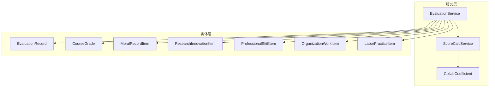
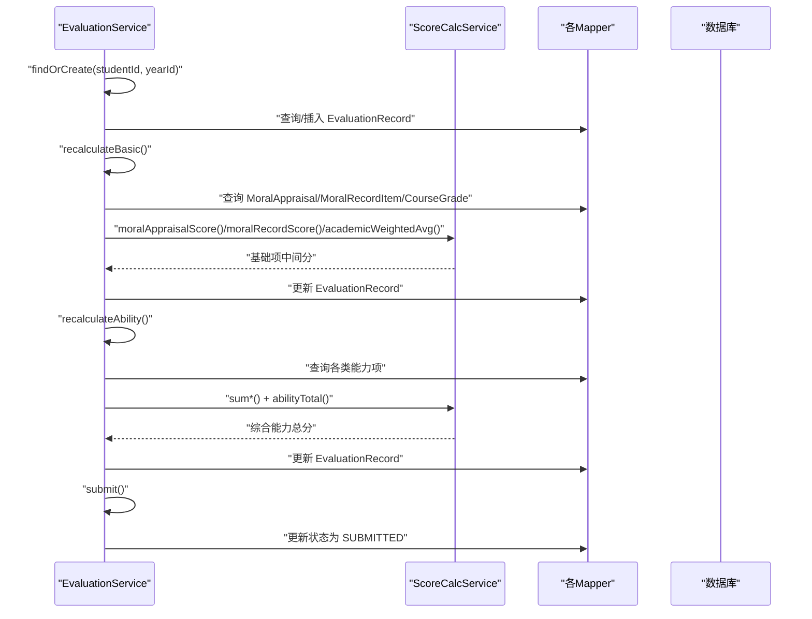
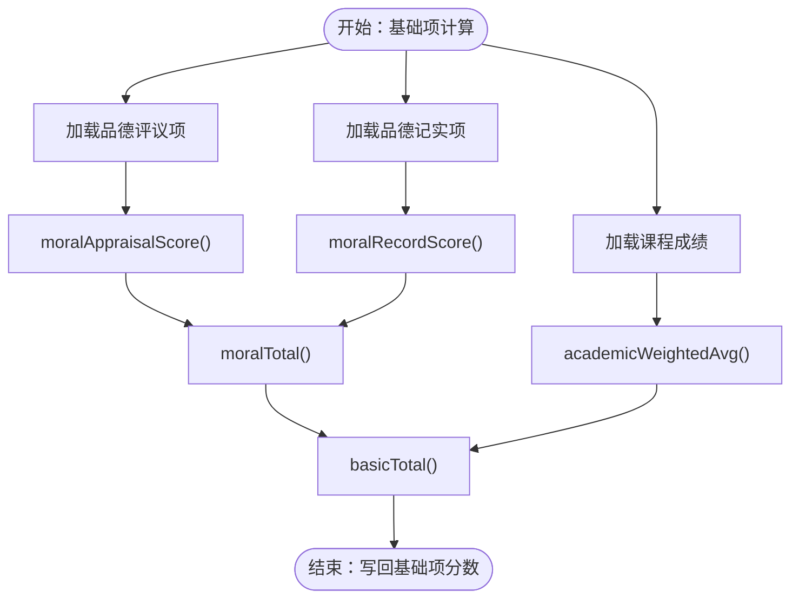
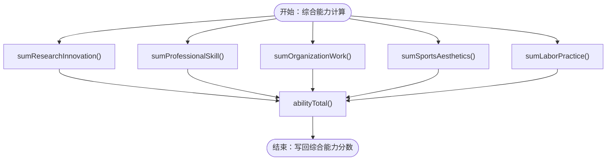
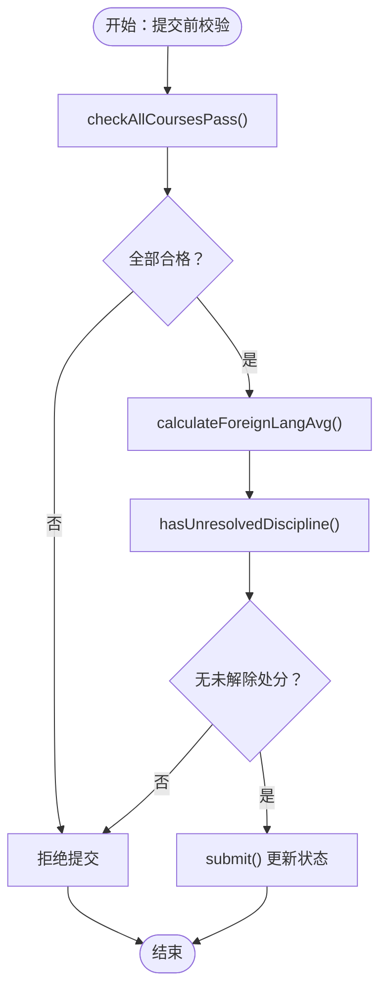
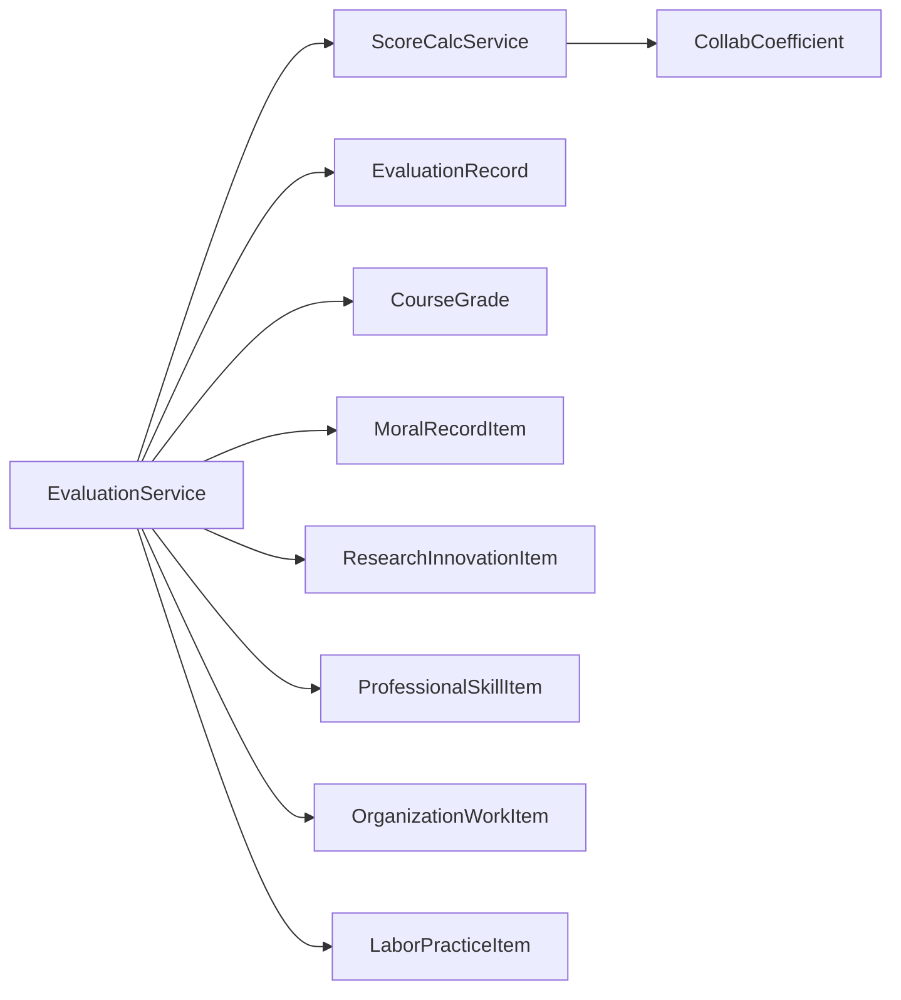

# 综合测评服务

<cite>
**本文引用的文件**
- [EvaluationService.java](file://backend/src/main/java/com/zjsu/scholarship/service/EvaluationService.java)
- [ScoreCalcService.java](file://backend/src/main/java/com/zjsu/scholarship/service/ScoreCalcService.java)
- [CollabCoefficient.java](file://backend/src/main/java/com/zjsu/scholarship/service/CollabCoefficient.java)
- [EvaluationRecord.java](file://backend/src/main/java/com/zjsu/scholarship/entity/EvaluationRecord.java)
- [ScholarshipProject.java](file://backend/src/main/java/com/zjsu/scholarship/entity/ScholarshipProject.java)
- [CourseGrade.java](file://backend/src/main/java/com/zjsu/scholarship/entity/CourseGrade.java)
- [MoralRecordItem.java](file://backend/src/main/java/com/zjsu/scholarship/entity/MoralRecordItem.java)
- [ResearchInnovationItem.java](file://backend/src/main/java/com/zjsu/scholarship/entity/ResearchInnovationItem.java)
- [ProfessionalSkillItem.java](file://backend/src/main/java/com/zjsu/scholarship/entity/ProfessionalSkillItem.java)
- [OrganizationWorkItem.java](file://backend/src/main/java/com/zjsu/scholarship/entity/OrganizationWorkItem.java)
- [LaborPracticeItem.java](file://backend/src/main/java/com/zjsu/scholarship/entity/LaborPracticeItem.java)
</cite>

## 目录
1. [简介](#简介)
2. [项目结构](#项目结构)
3. [核心组件](#核心组件)
4. [架构概览](#架构概览)
5. [详细组件分析](#详细组件分析)
6. [依赖分析](#依赖分析)
7. [性能考虑](#性能考虑)
8. [故障排查指南](#故障排查指南)
9. [结论](#结论)
10. [附录](#附录)

## 简介
本文件面向“综合测评服务”的实现与使用，围绕 EvaluationService 的测评计算与审核功能展开，系统性阐述以下内容：
- 基础测评项目的评分计算逻辑：课程成绩、纪律记录、劳动实践等指标的评分规则与边界条件
- 综合能力测评的实现机制：道德品行评估、专业技能考核、研究创新活动等能力项的量化标准与权重合成
- 测评数据的采集、验证与处理流程：数据完整性检查、异常值处理策略
- 测评结果的审核机制与权限控制策略
- 测评算法的数学模型与计算公式：权重分配与分数合成规则
- 实际案例：不同类型测评项目的评分计算过程演示

## 项目结构
后端采用分层架构，核心由服务层、实体层与映射器层组成。与综合测评直接相关的关键模块如下：
- 服务层：EvaluationService（主业务）、ScoreCalcService（评分引擎）、CollabCoefficient（合作系数）
- 实体层：EvaluationRecord（综测记录）、各类测评子项实体（课程成绩、品德记实、研究创新、专业技能、组织工作、劳动实践等）
- 控制器层：Admin、Counselor、Student、Public 等控制器负责接口入口与权限控制

图表来源
- [EvaluationService.java:1-308](file://backend/src/main/java/com/zjsu/scholarship/service/EvaluationService.java#L1-L308)
- [ScoreCalcService.java:1-423](file://backend/src/main/java/com/zjsu/scholarship/service/ScoreCalcService.java#L1-L423)
- [CollabCoefficient.java:1-28](file://backend/src/main/java/com/zjsu/scholarship/service/CollabCoefficient.java#L1-L28)
- [EvaluationRecord.java:1-45](file://backend/src/main/java/com/zjsu/scholarship/entity/EvaluationRecord.java#L1-L45)
- [CourseGrade.java:1-21](file://backend/src/main/java/com/zjsu/scholarship/entity/CourseGrade.java#L1-L21)
- [MoralRecordItem.java:1-34](file://backend/src/main/java/com/zjsu/scholarship/entity/MoralRecordItem.java#L1-L34)
- [ResearchInnovationItem.java:1-49](file://backend/src/main/java/com/zjsu/scholarship/entity/ResearchInnovationItem.java#L1-L49)
- [ProfessionalSkillItem.java:1-33](file://backend/src/main/java/com/zjsu/scholarship/entity/ProfessionalSkillItem.java#L1-L33)
- [OrganizationWorkItem.java:1-39](file://backend/src/main/java/com/zjsu/scholarship/entity/OrganizationWorkItem.java#L1-L39)
- [LaborPracticeItem.java:1-37](file://backend/src/main/java/com/zjsu/scholarship/entity/LaborPracticeItem.java#L1-L37)

章节来源
- [EvaluationService.java:1-308](file://backend/src/main/java/com/zjsu/scholarship/service/EvaluationService.java#L1-L308)
- [ScoreCalcService.java:1-423](file://backend/src/main/java/com/zjsu/scholarship/service/ScoreCalcService.java#L1-L423)

## 核心组件
- EvaluationService：负责综测记录的获取/创建、基础项与综合能力项的重新计算、提交状态更新；提供课程全科合格校验、外语课加权平均分计算、未解除处分校验等前置条件检查
- ScoreCalcService：评分引擎，实现所有单项与模块的量化计算、权重合成与边界约束（上限、下限、合作系数、核心成员系数等）
- CollabCoefficient：多人成果分摊系数表，按总人数与排名确定作者得分占比
- EvaluationRecord：综测记录实体，承载基础项与综合能力项的中间态与最终态分数
- 各子项实体：CourseGrade、MoralRecordItem、ResearchInnovationItem、ProfessionalSkillItem、OrganizationWorkItem、LaborPracticeItem，用于承载原始数据与评审状态

章节来源
- [EvaluationService.java:23-61](file://backend/src/main/java/com/zjsu/scholarship/service/EvaluationService.java#L23-L61)
- [ScoreCalcService.java:18-423](file://backend/src/main/java/com/zjsu/scholarship/service/ScoreCalcService.java#L18-L423)
- [CollabCoefficient.java:6-27](file://backend/src/main/java/com/zjsu/scholarship/service/CollabCoefficient.java#L6-L27)
- [EvaluationRecord.java:13-44](file://backend/src/main/java/com/zjsu/scholarship/entity/EvaluationRecord.java#L13-L44)

## 架构概览
EvaluationService 通过注入 ScoreCalcService 与各 Mapper 执行数据查询与写回，形成“查询-计算-持久化”的闭环。提交流程在事务中执行，确保基础项与综合能力项同时更新。

图表来源
- [EvaluationService.java:63-184](file://backend/src/main/java/com/zjsu/scholarship/service/EvaluationService.java#L63-L184)
- [ScoreCalcService.java:28-178](file://backend/src/main/java/com/zjsu/scholarship/service/ScoreCalcService.java#L28-L178)
- [ScoreCalcService.java:401-414](file://backend/src/main/java/com/zjsu/scholarship/service/ScoreCalcService.java#L401-L414)

## 详细组件分析

### 基础测评项目评分计算
- 品德评议分：基于自评、学生代表、辅导员三类评分的加权求和，权重分别为 5%、60%、35%
- 品德记实分：以 60 分为基准，叠加个人荣誉、集体荣誉与处分等增减分，分别设置上限
- 品德总分：评议分 × 70% + 记实分 × 30%
- 专业素质：课程加权平均分，忽略缺考或缺分记录
- 基本项总分：品德总分 × 30% + 专业素质 × 70%

图表来源
- [EvaluationService.java:91-135](file://backend/src/main/java/com/zjsu/scholarship/service/EvaluationService.java#L91-L135)
- [ScoreCalcService.java:28-178](file://backend/src/main/java/com/zjsu/scholarship/service/ScoreCalcService.java#L28-L178)

章节来源
- [EvaluationService.java:91-135](file://backend/src/main/java/com/zjsu/scholarship/service/EvaluationService.java#L91-L135)
- [ScoreCalcService.java:28-178](file://backend/src/main/java/com/zjsu/scholarship/service/ScoreCalcService.java#L28-L178)

### 综合能力测评实现机制
- 研究创新：按竞赛、论文、专利、项目四类设定基础分，结合竞赛类别系数、合作系数与核心成员系数进行折算
- 专业技能：四六级、计算机等级、证书、入学考试等按等级或门槛赋分
- 组织工作：岗位分 + 绩效分，乘以任期系数；不称职者计 0
- 体育美育/劳动实践：按级别与奖项设定基础分，团队成员按核心成员与否乘以不同系数
- 综合能力总分：75 + 各模块加权求和（研究创新 30%、专业技能 25%、组织工作 15%、体育美育 15%、劳动实践 15%）

图表来源
- [EvaluationService.java:139-167](file://backend/src/main/java/com/zjsu/scholarship/service/EvaluationService.java#L139-L167)
- [EvaluationService.java:188-256](file://backend/src/main/java/com/zjsu/scholarship/service/EvaluationService.java#L188-L256)
- [ScoreCalcService.java:184-414](file://backend/src/main/java/com/zjsu/scholarship/service/ScoreCalcService.java#L184-L414)

章节来源
- [EvaluationService.java:139-167](file://backend/src/main/java/com/zjsu/scholarship/service/EvaluationService.java#L139-L167)
- [EvaluationService.java:188-256](file://backend/src/main/java/com/zjsu/scholarship/service/EvaluationService.java#L188-L256)
- [ScoreCalcService.java:184-414](file://backend/src/main/java/com/zjsu/scholarship/service/ScoreCalcService.java#L184-L414)

### 数据收集、验证与处理流程
- 数据完整性检查
  - 课程成绩：缺失分数或学分的记录被忽略，避免影响加权平均
  - 品德记实：支持原始增减分与荣誉等级两种入参方式，兼容历史数据
  - 审核状态：仅统计非“已拒绝”状态的记录
- 异常值处理
  - 品德记实：个人荣誉与集体荣誉分别设上限，处分项取负值，最终得分不低于 0
  - 研究创新：合作系数与核心成员系数取最小值，避免高分膨胀
  - 综合能力：按固定权重合成，避免极端项主导
- 提交前校验
  - 全科合格校验：任一课程分数低于 60 分则视为不合格
  - 外语课加权平均：筛选包含“英语/外语/English”的课程，计算加权均分
  - 未解除处分：存在未解除处分则不可提交

图表来源
- [EvaluationService.java:264-306](file://backend/src/main/java/com/zjsu/scholarship/service/EvaluationService.java#L264-L306)

章节来源
- [EvaluationService.java:264-306](file://backend/src/main/java/com/zjsu/scholarship/service/EvaluationService.java#L264-L306)

### 审核机制与权限控制策略
- 审核状态字段：各子项实体包含“待审/已批准/已拒绝”状态，仅“已批准”项计入综测
- 权限控制：控制器层通过注解与拦截器限制访问角色（管理员、辅导员、学生），提交操作通常限定为学生端，审核操作限定为辅导员/管理员
- 状态流转：从草稿到提交，提交后进入评审阶段，最终发布

说明：具体控制器与拦截器实现不在本次分析范围内，但服务层通过“REJECTED”过滤与“SUBMITTED”状态更新体现了审核与发布的关键节点。

章节来源
- [MoralRecordItem.java:29-30](file://backend/src/main/java/com/zjsu/scholarship/entity/MoralRecordItem.java#L29-L30)
- [ResearchInnovationItem.java:45-46](file://backend/src/main/java/com/zjsu/scholarship/entity/ResearchInnovationItem.java#L45-L46)
- [ProfessionalSkillItem.java:29-30](file://backend/src/main/java/com/zjsu/scholarship/entity/ProfessionalSkillItem.java#L29-L30)
- [OrganizationWorkItem.java:35-36](file://backend/src/main/java/com/zjsu/scholarship/entity/OrganizationWorkItem.java#L35-L36)
- [LaborPracticeItem.java:33-34](file://backend/src/main/java/com/zjsu/scholarship/entity/LaborPracticeItem.java#L33-L34)
- [EvaluationService.java:177-184](file://backend/src/main/java/com/zjsu/scholarship/service/EvaluationService.java#L177-L184)

### 数学模型与计算公式
- 基础项
  - 品德评议分：自评 × 5% + 学生代表 × 60% + 辅导员 × 35%
  - 品德记实分：基准 60 + Σ(个人荣誉 ≤ 20) + Σ(集体荣誉 ≤ 20) + Σ(处分)
  - 品德总分：评议分 × 70% + 记实分 × 30%
  - 专业素质：Σ(成绩 × 学分)/Σ(学分)
  - 基本项总分：品德总分 × 30% + 专业素质 × 70%
- 综合能力
  - 综合能力总分 = 75 + 研究创新 × 30% + 专业技能 × 25% + 组织工作 × 15% + 体育美育 × 15% + 劳动实践 × 15%
- 合作系数与核心成员系数
  - 多人成果按系数表分配，核心成员与非核心成员取更小系数，避免高分膨胀

章节来源
- [ScoreCalcService.java:28-178](file://backend/src/main/java/com/zjsu/scholarship/service/ScoreCalcService.java#L28-L178)
- [ScoreCalcService.java:184-414](file://backend/src/main/java/com/zjsu/scholarship/service/ScoreCalcService.java#L184-L414)
- [CollabCoefficient.java:8-26](file://backend/src/main/java/com/zjsu/scholarship/service/CollabCoefficient.java#L8-L26)

### 实际案例
- 案例一：课程全科合格校验
  - 输入：某学年课程成绩集合（含缺考/缺分记录）
  - 处理：仅保留有分数与学分的记录，计算加权平均；若存在 < 60 分的课程，则判定不合格
  - 输出：不合格课程清单（空列表表示全部合格）
- 案例二：品德记实分
  - 输入：若干品德记实项（志愿者时长、处分、个人荣誉、集体荣誉）
  - 处理：按类型计算增减分，分别累加并设上限，最终不得低于 0
  - 输出：品德记实总分
- 案例三：研究创新计分（竞赛）
  - 输入：竞赛级别、获奖等级、竞赛类别、总作者数、本人排名、是否带导师、是否核心成员
  - 处理：查表获得基础分 → 应用类别系数 → 应用合作系数 → 核心成员取更小系数
  - 输出：单项得分（保留两位小数）

章节来源
- [EvaluationService.java:264-297](file://backend/src/main/java/com/zjsu/scholarship/service/EvaluationService.java#L264-L297)
- [ScoreCalcService.java:62-125](file://backend/src/main/java/com/zjsu/scholarship/service/ScoreCalcService.java#L62-L125)
- [ScoreCalcService.java:184-262](file://backend/src/main/java/com/zjsu/scholarship/service/ScoreCalcService.java#L184-L262)

## 依赖分析
- EvaluationService 对 ScoreCalcService 的强依赖体现在所有评分计算逻辑的委托
- 各 Mapper 为 EvaluationService 提供数据读取与写回能力
- CollabCoefficient 作为纯工具类被 ScoreCalcService 使用，降低复杂度

图表来源
- [EvaluationService.java:25-61](file://backend/src/main/java/com/zjsu/scholarship/service/EvaluationService.java#L25-L61)
- [ScoreCalcService.java:18-19](file://backend/src/main/java/com/zjsu/scholarship/service/ScoreCalcService.java#L18-L19)
- [CollabCoefficient.java:6-17](file://backend/src/main/java/com/zjsu/scholarship/service/CollabCoefficient.java#L6-L17)

章节来源
- [EvaluationService.java:25-61](file://backend/src/main/java/com/zjsu/scholarship/service/EvaluationService.java#L25-L61)
- [ScoreCalcService.java:18-19](file://backend/src/main/java/com/zjsu/scholarship/service/ScoreCalcService.java#L18-L19)
- [CollabCoefficient.java:6-17](file://backend/src/main/java/com/zjsu/scholarship/service/CollabCoefficient.java#L6-L17)

## 性能考虑
- 事务边界：基础项与综合能力项计算均在单事务内完成，减少并发写冲突
- 查询优化：按学生与学年维度过滤，避免全表扫描
- 计算优化：BigDecimal 使用统一舍入模式，避免重复构造对象
- 合作系数：预置二维表，按总人数与排名快速定位系数，时间复杂度低

## 故障排查指南
- 课程加权平均为 0
  - 检查是否存在有效成绩与学分；确认缺考/缺分记录已被正确忽略
- 品德记实总分为负
  - 检查处分项是否为负值；确认个人荣誉与集体荣誉是否超过上限
- 研究创新得分为 0
  - 检查项目类型是否受支持；确认合作系数与核心成员系数是否导致过低
- 提交失败
  - 检查全科合格校验、外语课均分门槛、未解除处分状态

章节来源
- [EvaluationService.java:264-306](file://backend/src/main/java/com/zjsu/scholarship/service/EvaluationService.java#L264-L306)
- [ScoreCalcService.java:159-178](file://backend/src/main/java/com/zjsu/scholarship/service/ScoreCalcService.java#L159-L178)
- [ScoreCalcService.java:127-150](file://backend/src/main/java/com/zjsu/scholarship/service/ScoreCalcService.java#L127-L150)

## 结论
EvaluationService 与 ScoreCalcService 共同构建了完整的综合测评体系：前者负责数据流与状态管理，后者提供严谨的评分规则与边界控制。通过明确的审核状态、严格的前置校验与可追溯的计算过程，系统实现了公平、透明、可复现的测评结果生成与发布。

## 附录
- 与测评相关的项目配置实体（用于评审条件与排名比例控制）
  - ScholarshipProject：包含最低加权平均、最低品德分、劳动实践要求、外语课均分底线、是否处分限制、基本项/能力项排名比例等

章节来源
- [ScholarshipProject.java:17-49](file://backend/src/main/java/com/zjsu/scholarship/entity/ScholarshipProject.java#L17-L49)