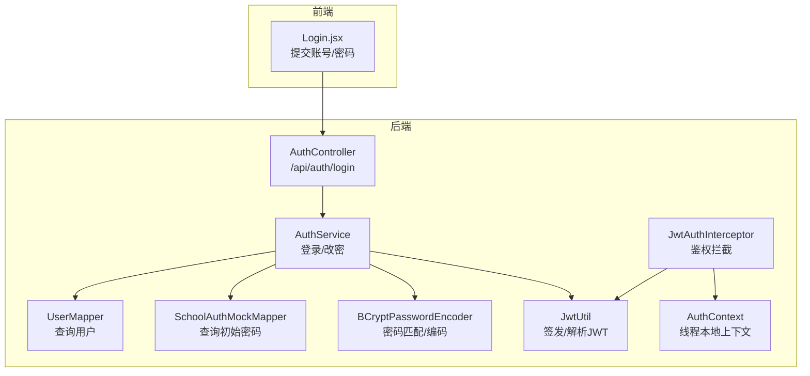
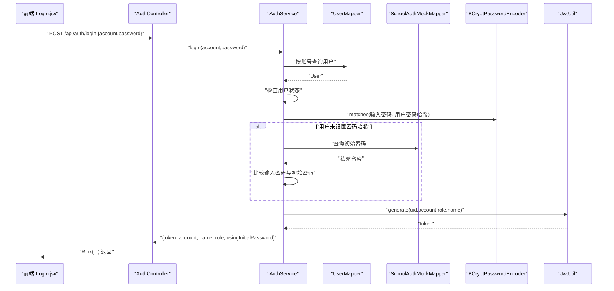
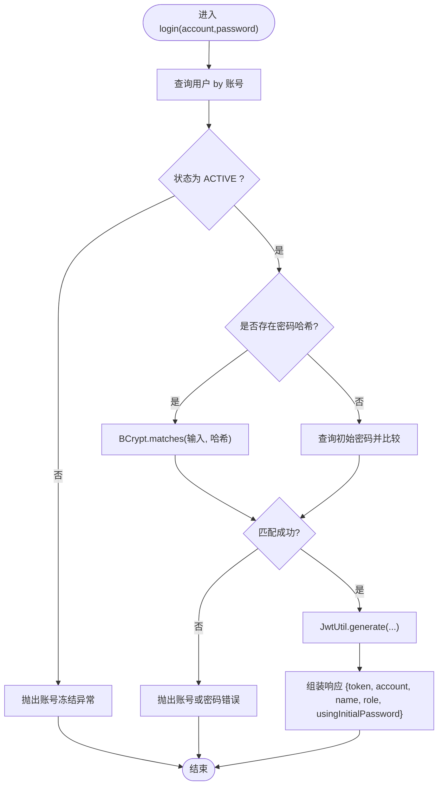
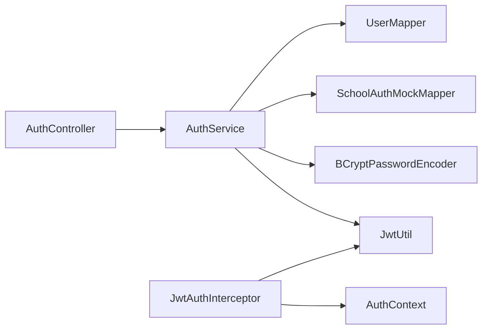

# 认证服务

<cite>
**本文引用的文件**
- [AuthService.java](file://backend/src/main/java/com/zjsu/scholarship/service/AuthService.java)
- [AuthController.java](file://backend/src/main/java/com/zjsu/scholarship/controller/AuthController.java)
- [JwtUtil.java](file://backend/src/main/java/com/zjsu/scholarship/security/JwtUtil.java)
- [PasswordConfig.java](file://backend/src/main/java/com/zjsu/scholarship/config/PasswordConfig.java)
- [User.java](file://backend/src/main/java/com/zjsu/scholarship/entity/User.java)
- [UserMapper.java](file://backend/src/main/java/com/zjsu/scholarship/mapper/UserMapper.java)
- [SchoolAuthMockMapper.java](file://backend/src/main/java/com/zjsu/scholarship/mapper/SchoolAuthMockMapper.java)
- [application.yml](file://backend/src/main/resources/application.yml)
- [BusinessException.java](file://backend/src/main/java/com/zjsu/scholarship/common/BusinessException.java)
- [AuthContext.java](file://backend/src/main/java/com/zjsu/scholarship/security/AuthContext.java)
- [JwtAuthInterceptor.java](file://backend/src/main/java/com/zjsu/scholarship/security/JwtAuthInterceptor.java)
- [RequireRole.java](file://backend/src/main/java/com/zjsu/scholarship/security/RequireRole.java)
- [Login.jsx](file://frontend/src/pages/Login.jsx)
</cite>

## 目录
1. [简介](#简介)
2. [项目结构](#项目结构)
3. [核心组件](#核心组件)
4. [架构总览](#架构总览)
5. [详细组件分析](#详细组件分析)
6. [依赖分析](#依赖分析)
7. [性能考虑](#性能考虑)
8. [故障排除指南](#故障排除指南)
9. [结论](#结论)
10. [附录](#附录)

## 简介
本文件面向认证服务的实现与使用，重点围绕 AuthService 的用户认证与密码管理功能展开，涵盖以下主题：
- 登录流程：用户凭证验证、密码哈希匹配、初始密码检查、JWT 令牌生成
- 密码安全策略：BCrypt 编码器、密码强度校验、安全最佳实践
- 用户状态检查：账号激活状态与冻结状态处理
- JWT 令牌：生成、签名与有效期管理
- 异常处理与安全防护：认证失败策略、拦截器与上下文管理
- 实际调用示例：前后端交互与参数传递

## 项目结构
后端采用分层架构，认证相关的关键模块如下：
- 控制层：AuthController 提供 /api/auth 下的认证接口
- 业务层：AuthService 封装登录与改密逻辑
- 安全层：JwtUtil、JwtAuthInterceptor、AuthContext、RequireRole
- 配置层：PasswordConfig 声明 BCrypt 编码器；application.yml 提供 JWT 密钥与过期时长
- 数据访问层：UserMapper、SchoolAuthMockMapper
- 实体层：User

图表来源
- [AuthController.java:11-44](file://backend/src/main/java/com/zjsu/scholarship/controller/AuthController.java#L11-L44)
- [AuthService.java:16-77](file://backend/src/main/java/com/zjsu/scholarship/service/AuthService.java#L16-L77)
- [UserMapper.java:1-8](file://backend/src/main/java/com/zjsu/scholarship/mapper/UserMapper.java#L1-L8)
- [SchoolAuthMockMapper.java:1-8](file://backend/src/main/java/com/zjsu/scholarship/mapper/SchoolAuthMockMapper.java#L1-L8)
- [PasswordConfig.java:8-15](file://backend/src/main/java/com/zjsu/scholarship/config/PasswordConfig.java#L8-L15)
- [JwtUtil.java:15-52](file://backend/src/main/java/com/zjsu/scholarship/security/JwtUtil.java#L15-L52)
- [JwtAuthInterceptor.java:11-65](file://backend/src/main/java/com/zjsu/scholarship/security/JwtAuthInterceptor.java#L11-L65)
- [AuthContext.java:3-20](file://backend/src/main/java/com/zjsu/scholarship/security/AuthContext.java#L3-L20)

章节来源
- [AuthController.java:11-44](file://backend/src/main/java/com/zjsu/scholarship/controller/AuthController.java#L11-L44)
- [AuthService.java:16-77](file://backend/src/main/java/com/zjsu/scholarship/service/AuthService.java#L16-L77)
- [application.yml:42-46](file://backend/src/main/resources/application.yml#L42-L46)

## 核心组件
- AuthService：负责登录与改密的核心业务逻辑，封装密码匹配、状态检查与令牌生成。
- AuthController：暴露 REST 接口，接收前端请求并返回统一封装结果。
- JwtUtil：基于 HMAC 的 JWT 生成与解析，支持自定义密钥与过期时间。
- PasswordConfig：声明 BCryptPasswordEncoder Bean，用于密码编码与匹配。
- JwtAuthInterceptor：全局拦截器，校验 Authorization 头中的 Bearer Token，并注入角色权限。
- AuthContext：线程本地存储当前用户上下文，便于控制器与服务层读取。
- User、UserMapper、SchoolAuthMockMapper：数据模型与访问层。

章节来源
- [AuthService.java:16-77](file://backend/src/main/java/com/zjsu/scholarship/service/AuthService.java#L16-L77)
- [AuthController.java:11-44](file://backend/src/main/java/com/zjsu/scholarship/controller/AuthController.java#L11-L44)
- [JwtUtil.java:15-52](file://backend/src/main/java/com/zjsu/scholarship/security/JwtUtil.java#L15-L52)
- [PasswordConfig.java:8-15](file://backend/src/main/java/com/zjsu/scholarship/config/PasswordConfig.java#L8-L15)
- [JwtAuthInterceptor.java:11-65](file://backend/src/main/java/com/zjsu/scholarship/security/JwtAuthInterceptor.java#L11-L65)
- [AuthContext.java:3-20](file://backend/src/main/java/com/zjsu/scholarship/security/AuthContext.java#L3-L20)
- [User.java:10-24](file://backend/src/main/java/com/zjsu/scholarship/entity/User.java#L10-L24)
- [UserMapper.java:1-8](file://backend/src/main/java/com/zjsu/scholarship/mapper/UserMapper.java#L1-L8)
- [SchoolAuthMockMapper.java:1-8](file://backend/src/main/java/com/zjsu/scholarship/mapper/SchoolAuthMockMapper.java#L1-L8)

## 架构总览
认证流程从前端发起登录请求，经由控制器进入业务层，结合数据访问层与安全工具完成验证与签发，随后通过拦截器在后续请求中进行鉴权。

图表来源
- [Login.jsx:22-34](file://frontend/src/pages/Login.jsx#L22-L34)
- [AuthController.java:21-24](file://backend/src/main/java/com/zjsu/scholarship/controller/AuthController.java#L21-L24)
- [AuthService.java:32-55](file://backend/src/main/java/com/zjsu/scholarship/service/AuthService.java#L32-L55)
- [UserMapper.java:1-8](file://backend/src/main/java/com/zjsu/scholarship/mapper/UserMapper.java#L1-L8)
- [SchoolAuthMockMapper.java:1-8](file://backend/src/main/java/com/zjsu/scholarship/mapper/SchoolAuthMockMapper.java#L1-L8)
- [PasswordConfig.java:8-15](file://backend/src/main/java/com/zjsu/scholarship/config/PasswordConfig.java#L8-L15)
- [JwtUtil.java:28-42](file://backend/src/main/java/com/zjsu/scholarship/security/JwtUtil.java#L28-L42)

## 详细组件分析

### AuthService：登录与改密
- 登录流程要点
  - 查询用户：按账号精确查询用户记录
  - 状态检查：仅 ACTIVE 状态允许登录，否则抛出业务异常
  - 密码匹配：若用户已有密码哈希则使用 BCrypt 匹配；否则回退到初始密码比对
  - 令牌生成：成功后调用 JwtUtil 生成包含 uid/account/role/name 的 JWT
  - 返回字段：token、account、name、role、usingInitialPassword
- 改密流程要点
  - 新密码长度校验（至少 6 位）
  - 旧密码校验策略与登录一致（哈希或初始密码）
  - 使用 BCrypt 对新密码进行编码并更新用户记录

图表来源
- [AuthService.java:32-55](file://backend/src/main/java/com/zjsu/scholarship/service/AuthService.java#L32-L55)
- [User.java:10-24](file://backend/src/main/java/com/zjsu/scholarship/entity/User.java#L10-L24)
- [PasswordConfig.java:8-15](file://backend/src/main/java/com/zjsu/scholarship/config/PasswordConfig.java#L8-L15)
- [JwtUtil.java:28-42](file://backend/src/main/java/com/zjsu/scholarship/security/JwtUtil.java#L28-L42)

章节来源
- [AuthService.java:32-55](file://backend/src/main/java/com/zjsu/scholarship/service/AuthService.java#L32-L55)
- [AuthService.java:57-75](file://backend/src/main/java/com/zjsu/scholarship/service/AuthService.java#L57-L75)

### AuthController：REST 接口
- /api/auth/login：接收 {account, password}，调用 AuthService.login 并统一封装返回
- /api/auth/me：读取 AuthContext 中的当前用户信息
- /api/auth/change-password：接收 {oldPassword, newPassword}，调用 AuthService.changePassword

章节来源
- [AuthController.java:21-42](file://backend/src/main/java/com/zjsu/scholarship/controller/AuthController.java#L21-L42)

### JwtUtil：JWT 生成与解析
- 密钥与过期：从配置读取 app.jwt.secret 与 app.jwt.expire-hours
- 生成：构建 claims（uid、account、role、name），设置签发时间与过期时间，使用 HMAC 签名
- 解析：验证签名并提取 payload

章节来源
- [JwtUtil.java:18-26](file://backend/src/main/java/com/zjsu/scholarship/security/JwtUtil.java#L18-L26)
- [JwtUtil.java:28-42](file://backend/src/main/java/com/zjsu/scholarship/security/JwtUtil.java#L28-L42)
- [JwtUtil.java:44-50](file://backend/src/main/java/com/zjsu/scholarship/security/JwtUtil.java#L44-L50)
- [application.yml:42-46](file://backend/src/main/resources/application.yml#L42-L46)

### 密码安全策略与配置
- 编码器：通过 PasswordConfig 声明 BCryptPasswordEncoder Bean，确保密码以哈希形式存储与匹配
- 初始密码：未设置密码哈希的用户可使用初始密码登录，登录后应强制修改密码
- 密码强度：AuthService 在改密时要求新密码长度至少 6 位

章节来源
- [PasswordConfig.java:8-15](file://backend/src/main/java/com/zjsu/scholarship/config/PasswordConfig.java#L8-L15)
- [AuthService.java:57-60](file://backend/src/main/java/com/zjsu/scholarship/service/AuthService.java#L57-L60)

### 用户状态检查与冻结处理
- 状态字段：User.status 字段用于标识账号是否 ACTIVE
- 冻结处理：非 ACTIVE 状态直接抛出业务异常，阻止登录

章节来源
- [User.java:10-24](file://backend/src/main/java/com/zjsu/scholarship/entity/User.java#L10-L24)
- [AuthService.java:36](file://backend/src/main/java/com/zjsu/scholarship/service/AuthService.java#L36)

### JWT 令牌生成、签名与有效期
- 生成：JwtUtil.generate 构造 claims 并设置过期时间（小时级）
- 签名：使用对称密钥（HMAC）进行签名
- 有效期：由配置项 app.jwt.expire-hours 控制，默认 24 小时

章节来源
- [JwtUtil.java:28-42](file://backend/src/main/java/com/zjsu/scholarship/security/JwtUtil.java#L28-L42)
- [application.yml:42-46](file://backend/src/main/resources/application.yml#L42-L46)

### 全局鉴权拦截与上下文注入
- 拦截器：JwtAuthInterceptor 从 Authorization 头解析 Bearer Token，解析失败或过期抛出业务异常
- 上下文：解析成功后将用户信息注入 AuthContext，供后续处理器使用
- 角色校验：结合 RequireRole 注解进行角色权限控制

章节来源
- [JwtAuthInterceptor.java:20-58](file://backend/src/main/java/com/zjsu/scholarship/security/JwtAuthInterceptor.java#L20-L58)
- [AuthContext.java:3-20](file://backend/src/main/java/com/zjsu/scholarship/security/AuthContext.java#L3-L20)
- [RequireRole.java:8-13](file://backend/src/main/java/com/zjsu/scholarship/security/RequireRole.java#L8-L13)

### 前端登录调用示例
- 前端 Login.jsx 发送 POST /auth/login，携带 {account, password}
- 成功后根据返回的 token 与 role 进行路由跳转，并持久化用户信息

章节来源
- [Login.jsx:22-34](file://frontend/src/pages/Login.jsx#L22-L34)

## 依赖分析
- 组件耦合
  - AuthService 依赖 UserMapper、SchoolAuthMockMapper、PasswordEncoder、JwtUtil
  - AuthController 依赖 AuthService
  - JwtAuthInterceptor 依赖 JwtUtil 与 AuthContext
- 外部依赖
  - Spring Security BCryptPasswordEncoder
  - JSON Web Tokens（io.jsonwebtoken）

图表来源
- [AuthController.java:15-19](file://backend/src/main/java/com/zjsu/scholarship/controller/AuthController.java#L15-L19)
- [AuthService.java:19-30](file://backend/src/main/java/com/zjsu/scholarship/service/AuthService.java#L19-L30)
- [JwtAuthInterceptor.java:14-18](file://backend/src/main/java/com/zjsu/scholarship/security/JwtAuthInterceptor.java#L14-L18)

章节来源
- [AuthController.java:15-19](file://backend/src/main/java/com/zjsu/scholarship/controller/AuthController.java#L15-L19)
- [AuthService.java:19-30](file://backend/src/main/java/com/zjsu/scholarship/service/AuthService.java#L19-L30)
- [JwtAuthInterceptor.java:14-18](file://backend/src/main/java/com/zjsu/scholarship/security/JwtAuthInterceptor.java#L14-L18)

## 性能考虑
- 密码匹配：BCrypt 匹配为 O(log n) 的计算，建议避免在高并发场景下进行额外的二次查询
- 缓存策略：可考虑缓存热点用户的状态与角色，减少数据库访问
- 令牌过期：合理设置过期时间，平衡安全性与用户体验
- 日志与监控：对认证失败与异常进行统计，识别潜在攻击行为

## 故障排除指南
- 常见异常与处理
  - 账号不存在/账号或密码错误：AuthService 抛出业务异常，前端提示错误并保持登录页
  - 账号已冻结：提示联系管理员
  - 未登录或令牌缺失/令牌无效或已过期：拦截器抛出相应业务异常，前端引导重新登录
- 安全建议
  - 生产环境务必更换默认密钥与缩短令牌有效期
  - 对登录接口增加限流与防暴力破解策略
  - 建议启用 HTTPS 与安全响应头

章节来源
- [AuthService.java:35-45](file://backend/src/main/java/com/zjsu/scholarship/service/AuthService.java#L35-L45)
- [JwtAuthInterceptor.java:26-28](file://backend/src/main/java/com/zjsu/scholarship/security/JwtAuthInterceptor.java#L26-L28)
- [JwtAuthInterceptor.java:54-56](file://backend/src/main/java/com/zjsu/scholarship/security/JwtAuthInterceptor.java#L54-L56)
- [BusinessException.java:3-20](file://backend/src/main/java/com/zjsu/scholarship/common/BusinessException.java#L3-L20)

## 结论
AuthService 将用户状态检查、密码匹配与令牌生成整合为清晰的登录流程，配合全局拦截器与上下文管理实现统一的鉴权机制。通过 BCrypt 编码器与合理的安全配置，系统在保证易用性的同时具备良好的安全性。建议在生产环境中进一步强化密钥管理、令牌策略与访问控制。

## 附录
- 关键配置项
  - app.jwt.secret：JWT 对称密钥
  - app.jwt.expire-hours：令牌过期小时数
- 前端调用要点
  - 登录接口：POST /auth/login，Body 为 {account, password}
  - 请求头：Authorization: Bearer <token>
  - 成功后根据返回的 role 进行路由跳转

章节来源
- [application.yml:42-46](file://backend/src/main/resources/application.yml#L42-L46)
- [Login.jsx:22-34](file://frontend/src/pages/Login.jsx#L22-L34)
- [JwtAuthInterceptor.java:25-29](file://backend/src/main/java/com/zjsu/scholarship/security/JwtAuthInterceptor.java#L25-L29)