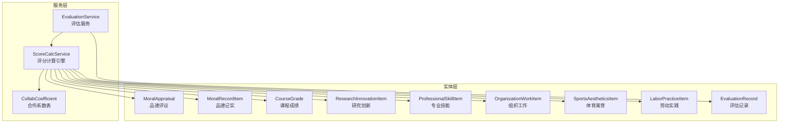
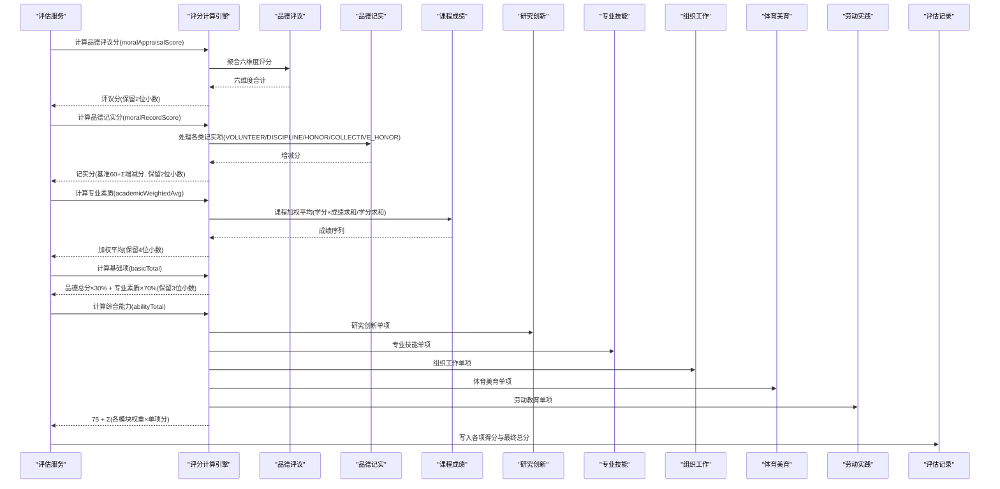
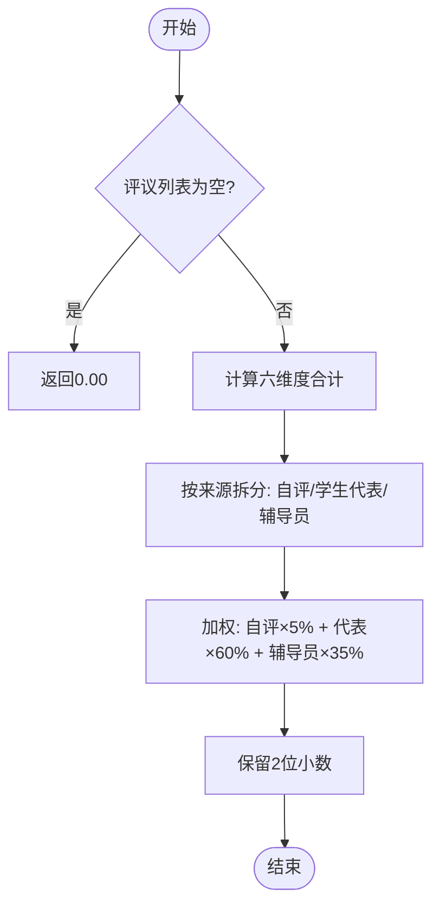
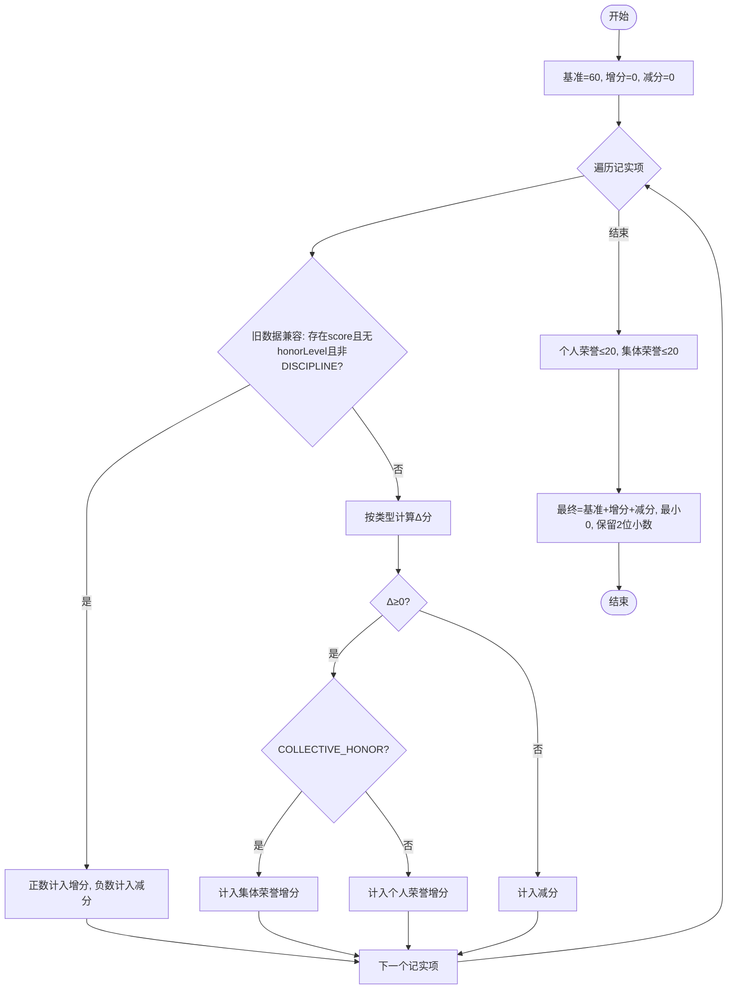
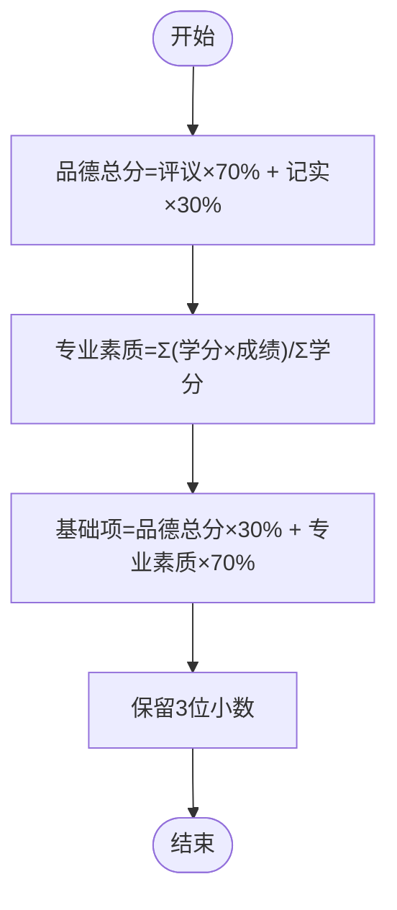
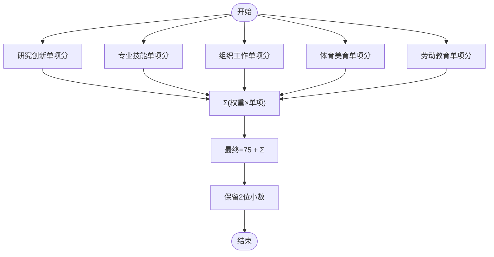
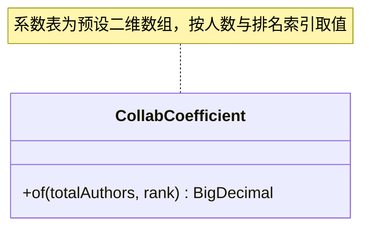
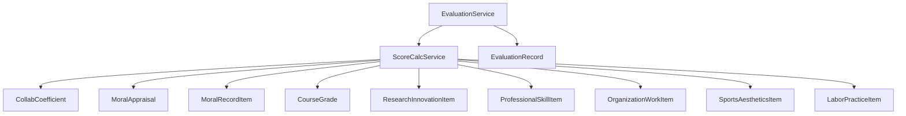
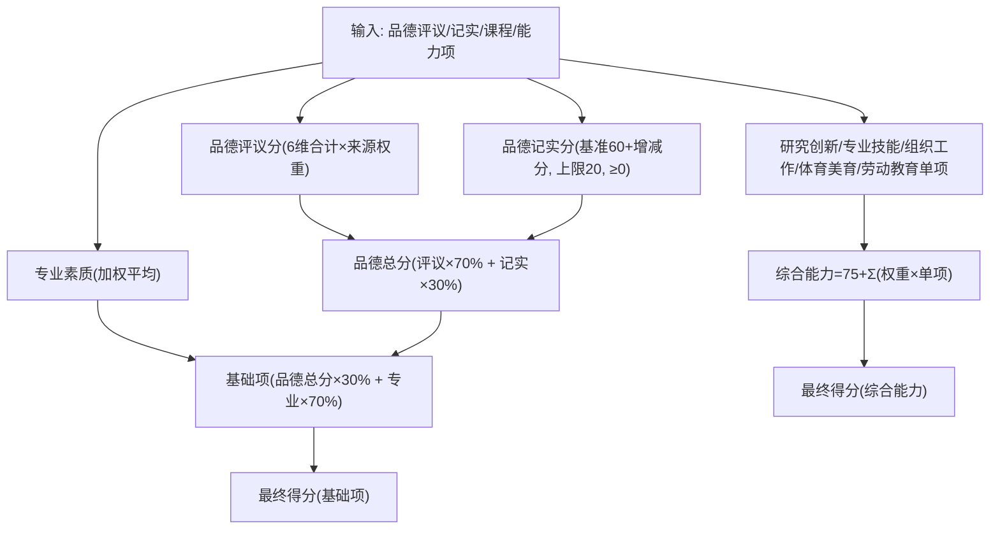

# 评分计算服务

<cite>
**本文引用的文件**
- [ScoreCalcService.java](file://backend/src/main/java/com/zjsu/scholarship/service/ScoreCalcService.java)
- [CollabCoefficient.java](file://backend/src/main/java/com/zjsu/scholarship/service/CollabCoefficient.java)
- [EvaluationService.java](file://backend/src/main/java/com/zjsu/scholarship/service/EvaluationService.java)
- [MoralAppraisal.java](file://backend/src/main/java/com/zjsu/scholarship/entity/MoralAppraisal.java)
- [MoralRecordItem.java](file://backend/src/main/java/com/zjsu/scholarship/entity/MoralRecordItem.java)
- [CourseGrade.java](file://backend/src/main/java/com/zjsu/scholarship/entity/CourseGrade.java)
- [ResearchInnovationItem.java](file://backend/src/main/java/com/zjsu/scholarship/entity/ResearchInnovationItem.java)
- [ProfessionalSkillItem.java](file://backend/src/main/java/com/zjsu/scholarship/entity/ProfessionalSkillItem.java)
- [OrganizationWorkItem.java](file://backend/src/main/java/com/zjsu/scholarship/entity/OrganizationWorkItem.java)
- [SportsAestheticsItem.java](file://backend/src/main/java/com/zjsu/scholarship/entity/SportsAestheticsItem.java)
- [LaborPracticeItem.java](file://backend/src/main/java/com/zjsu/scholarship/entity/LaborPracticeItem.java)
- [EvaluationRecord.java](file://backend/src/main/java/com/zjsu/scholarship/entity/EvaluationRecord.java)
</cite>

## 目录
1. [简介](#简介)
2. [项目结构](#项目结构)
3. [核心组件](#核心组件)
4. [架构概览](#架构概览)
5. [详细组件分析](#详细组件分析)
6. [依赖分析](#依赖分析)
7. [性能考虑](#性能考虑)
8. [故障排除指南](#故障排除指南)
9. [结论](#结论)
10. [附录](#附录)

## 简介
本文件系统性阐述评分计算服务的设计与实现，重点围绕 ScoreCalcService 的评分算法引擎，覆盖以下方面：
- 基础分计算：品德评议分、品德记实分、专业素质加权平均分
- 加权平均：基础项与综合能力模块的加权合成
- 等级转换与最终得分：从原始数据到最终评分的完整流程
- 评分项目类型：学术成绩、能力项、特殊贡献等指标的计算公式与权重
- 精度控制与四舍五入规则：统一的数值精度策略
- 异常处理机制：无效数据过滤、边界值处理、异常分数修正
- 扩展点与自定义配置：支持不同奖学金项目的评分需求

## 项目结构
评分计算服务位于后端模块中，采用按功能域划分的包结构，核心服务与实体模型分离，便于维护与扩展。

图表来源
- [ScoreCalcService.java:18-423](file://backend/src/main/java/com/zjsu/scholarship/service/ScoreCalcService.java#L18-L423)
- [CollabCoefficient.java:1-28](file://backend/src/main/java/com/zjsu/scholarship/service/CollabCoefficient.java#L1-L28)
- [EvaluationService.java:120-154](file://backend/src/main/java/com/zjsu/scholarship/service/EvaluationService.java#L120-L154)
- [MoralAppraisal.java:1-36](file://backend/src/main/java/com/zjsu/scholarship/entity/MoralAppraisal.java#L1-L36)
- [MoralRecordItem.java:1-34](file://backend/src/main/java/com/zjsu/scholarship/entity/MoralRecordItem.java#L1-L34)
- [CourseGrade.java:1-21](file://backend/src/main/java/com/zjsu/scholarship/entity/CourseGrade.java#L1-L21)
- [ResearchInnovationItem.java:1-49](file://backend/src/main/java/com/zjsu/scholarship/entity/ResearchInnovationItem.java#L1-L49)
- [ProfessionalSkillItem.java:1-33](file://backend/src/main/java/com/zjsu/scholarship/entity/ProfessionalSkillItem.java#L1-L33)
- [OrganizationWorkItem.java:1-39](file://backend/src/main/java/com/zjsu/scholarship/entity/OrganizationWorkItem.java#L1-L39)
- [SportsAestheticsItem.java:1-37](file://backend/src/main/java/com/zjsu/scholarship/entity/SportsAestheticsItem.java#L1-L37)
- [LaborPracticeItem.java:1-37](file://backend/src/main/java/com/zjsu/scholarship/entity/LaborPracticeItem.java#L1-L37)
- [EvaluationRecord.java:1-45](file://backend/src/main/java/com/zjsu/scholarship/entity/EvaluationRecord.java#L1-L45)

章节来源
- [ScoreCalcService.java:18-423](file://backend/src/main/java/com/zjsu/scholarship/service/ScoreCalcService.java#L18-L423)
- [EvaluationService.java:120-154](file://backend/src/main/java/com/zjsu/scholarship/service/EvaluationService.java#L120-L154)

## 核心组件
- ScoreCalcService：评分算法引擎，负责基础分与综合能力的计算、加权合成与最终得分确定。
- CollabCoefficient：多人成果分摊系数表，用于研究创新等多作者成果的贡献分摊。
- 评估服务：调用评分引擎并写入评估记录，统一处理精度与状态。

章节来源
- [ScoreCalcService.java:18-423](file://backend/src/main/java/com/zjsu/scholarship/service/ScoreCalcService.java#L18-L423)
- [CollabCoefficient.java:1-28](file://backend/src/main/java/com/zjsu/scholarship/service/CollabCoefficient.java#L1-L28)
- [EvaluationService.java:120-154](file://backend/src/main/java/com/zjsu/scholarship/service/EvaluationService.java#L120-L154)

## 架构概览
评分计算服务遵循“服务-实体”分层设计，ScoreCalcService 通过聚合各类实体数据进行计算，并由 EvaluationService 写入评估记录。

图表来源
- [ScoreCalcService.java:28-178](file://backend/src/main/java/com/zjsu/scholarship/service/ScoreCalcService.java#L28-L178)
- [ScoreCalcService.java:184-414](file://backend/src/main/java/com/zjsu/scholarship/service/ScoreCalcService.java#L184-L414)
- [EvaluationService.java:120-154](file://backend/src/main/java/com/zjsu/scholarship/service/EvaluationService.java#L120-L154)

## 详细组件分析

### 品德评议分计算
- 六维度合计：政治素养、法治观念、心理素质、诚实守信、团队协作、社会责任，每维满分为20分，合计保留2位小数。
- 来源加权：自评×5% + 学生代表×60% + 辅导员(班主任)×35%，最终保留2位小数。

图表来源
- [ScoreCalcService.java:28-46](file://backend/src/main/java/com/zjsu/scholarship/service/ScoreCalcService.java#L28-L46)
- [MoralAppraisal.java:20-31](file://backend/src/main/java/com/zjsu/scholarship/entity/MoralAppraisal.java#L20-L31)

章节来源
- [ScoreCalcService.java:28-56](file://backend/src/main/java/com/zjsu/scholarship/service/ScoreCalcService.java#L28-L56)
- [MoralAppraisal.java:11-36](file://backend/src/main/java/com/zjsu/scholarship/entity/MoralAppraisal.java#L11-L36)

### 品德记实分计算
- 基准分：60分
- 增减分规则：
  - 志愿服务：按小时计，每4小时计4分，额外不足4小时计2分，上限10分；按4小时取整，余数>0加2分，再与10比较取最小。
  - 处分：按原始值取负，处分区间为0.5~2至10不等（规则来源于注释说明）。
  - 个人荣誉：国家级20、省级15、市级12、校级8、院级5；若提供rawValue且>0则直接使用。
  - 集体荣誉：优良学风班5、学风特优班10、先进团支部5、五四团支部8；同样支持rawValue覆盖。
- 上限控制：个人荣誉与集体荣誉分别不超过20分；最终不得低于0分。
- 结果：基准分+Σ增分+Σ减分，保留2位小数且非负。

图表来源
- [ScoreCalcService.java:96-125](file://backend/src/main/java/com/zjsu/scholarship/service/ScoreCalcService.java#L96-L125)
- [MoralRecordItem.java:19-26](file://backend/src/main/java/com/zjsu/scholarship/entity/MoralRecordItem.java#L19-L26)

章节来源
- [ScoreCalcService.java:58-157](file://backend/src/main/java/com/zjsu/scholarship/service/ScoreCalcService.java#L58-L157)
- [MoralRecordItem.java:11-34](file://backend/src/main/java/com/zjsu/scholarship/entity/MoralRecordItem.java#L11-L34)

### 品德总分与专业素质
- 品德总分：评议分×70% + 记实分×30%，保留2位小数。
- 专业素质：课程加权平均分，按学分×成绩求和除以学分求和，保留4位小数。

图表来源
- [ScoreCalcService.java:152-178](file://backend/src/main/java/com/zjsu/scholarship/service/ScoreCalcService.java#L152-L178)
- [CourseGrade.java:18-19](file://backend/src/main/java/com/zjsu/scholarship/entity/CourseGrade.java#L18-L19)

章节来源
- [ScoreCalcService.java:152-178](file://backend/src/main/java/com/zjsu/scholarship/service/ScoreCalcService.java#L152-L178)
- [CourseGrade.java:1-21](file://backend/src/main/java/com/zjsu/scholarship/entity/CourseGrade.java#L1-L21)

### 综合能力模块计算
综合能力总分 = 75 + Σ(模块权重×单项分)，其中：
- 研究创新：按竞赛级别与奖项、期刊级别、专利类型、项目级别与状态分别计算基础分，再乘以类别系数与合作系数，保留2位小数。
- 专业技能：英语（CET4/CET6）、计算机等级、证书等级、入学考试等，按条件映射分值。
- 组织工作：岗位分+绩效分，乘以任期系数（<6月=0，6~12月=0.5，≥12月=1），若绩效为“不称职”则得0。
- 体育美育/劳动教育：按竞赛级别与奖项计算基础分，团队核心成员系数0.8，非核心0.5，保留2位小数。

图表来源
- [ScoreCalcService.java:184-414](file://backend/src/main/java/com/zjsu/scholarship/service/ScoreCalcService.java#L184-L414)
- [ResearchInnovationItem.java:19-43](file://backend/src/main/java/com/zjsu/scholarship/entity/ResearchInnovationItem.java#L19-L43)
- [ProfessionalSkillItem.java:19-24](file://backend/src/main/java/com/zjsu/scholarship/entity/ProfessionalSkillItem.java#L19-L24)
- [OrganizationWorkItem.java:23-30](file://backend/src/main/java/com/zjsu/scholarship/entity/OrganizationWorkItem.java#L23-L30)
- [SportsAestheticsItem.java:22-28](file://backend/src/main/java/com/zjsu/scholarship/entity/SportsAestheticsItem.java#L22-L28)
- [LaborPracticeItem.java:22-28](file://backend/src/main/java/com/zjsu/scholarship/entity/LaborPracticeItem.java#L22-L28)

章节来源
- [ScoreCalcService.java:184-414](file://backend/src/main/java/com/zjsu/scholarship/service/ScoreCalcService.java#L184-L414)
- [ResearchInnovationItem.java:1-49](file://backend/src/main/java/com/zjsu/scholarship/entity/ResearchInnovationItem.java#L1-L49)
- [ProfessionalSkillItem.java:1-33](file://backend/src/main/java/com/zjsu/scholarship/entity/ProfessionalSkillItem.java#L1-L33)
- [OrganizationWorkItem.java:1-39](file://backend/src/main/java/com/zjsu/scholarship/entity/OrganizationWorkItem.java#L1-L39)
- [SportsAestheticsItem.java:1-37](file://backend/src/main/java/com/zjsu/scholarship/entity/SportsAestheticsItem.java#L1-L37)
- [LaborPracticeItem.java:1-37](file://backend/src/main/java/com/zjsu/scholarship/entity/LaborPracticeItem.java#L1-L37)

### 合作系数 CollabCoefficient
- 多人成果按作者总数与个人排名查找系数表，限制最大6人行，列数等于排名，取对应系数。
- 核心成员系数下限：核心成员最多0.8，非核心最多0.5；若存在指导教师，则作者数与排名均减1后再计算。

图表来源
- [CollabCoefficient.java:1-28](file://backend/src/main/java/com/zjsu/scholarship/service/CollabCoefficient.java#L1-L28)

章节来源
- [CollabCoefficient.java:1-28](file://backend/src/main/java/com/zjsu/scholarship/service/CollabCoefficient.java#L1-L28)
- [ScoreCalcService.java:242-258](file://backend/src/main/java/com/zjsu/scholarship/service/ScoreCalcService.java#L242-L258)

### 评估记录与精度控制
- 评估服务在写入各项得分时统一进行精度控制：
  - 品德评议分、品德记实分、专业素质、综合能力单项与最终总分：保留2位小数
  - 基础项总分：保留3位小数
- 评估记录实体包含完整的中间与最终得分字段，便于审计与复核。

章节来源
- [EvaluationService.java:120-154](file://backend/src/main/java/com/zjsu/scholarship/service/EvaluationService.java#L120-L154)
- [EvaluationRecord.java:19-44](file://backend/src/main/java/com/zjsu/scholarship/entity/EvaluationRecord.java#L19-L44)

## 依赖分析
- ScoreCalcService 依赖 CollabCoefficient 进行多人成果分摊。
- 评估服务调用评分引擎并写入评估记录，形成闭环。
- 实体模型提供评分所需的输入数据结构。

图表来源
- [ScoreCalcService.java:18-423](file://backend/src/main/java/com/zjsu/scholarship/service/ScoreCalcService.java#L18-L423)
- [CollabCoefficient.java:1-28](file://backend/src/main/java/com/zjsu/scholarship/service/CollabCoefficient.java#L1-L28)
- [EvaluationService.java:120-154](file://backend/src/main/java/com/zjsu/scholarship/service/EvaluationService.java#L120-L154)
- [EvaluationRecord.java:1-45](file://backend/src/main/java/com/zjsu/scholarship/entity/EvaluationRecord.java#L1-L45)

章节来源
- [ScoreCalcService.java:18-423](file://backend/src/main/java/com/zjsu/scholarship/service/ScoreCalcService.java#L18-L423)
- [EvaluationService.java:120-154](file://backend/src/main/java/com/zjsu/scholarship/service/EvaluationService.java#L120-L154)

## 性能考虑
- 时间复杂度：各单项计算多为线性扫描，整体 O(n)，n 为输入项数量。
- 空间复杂度：除系数表外，主要为常量级临时变量，空间开销小。
- 精度策略：根据用途选择合适的保留位数（2/3/4位），避免累积误差放大。
- 可扩展性：通过枚举与映射表（如荣誉等级、期刊级别、竞赛级别）易于新增或调整分值。

## 故障排除指南
- 无效数据过滤：
  - 评议与记实项：空列表返回0；单项缺失字段跳过或按默认值处理。
  - 课程成绩：缺省分数或学分则跳过，避免除零。
- 边界值处理：
  - 记实分上限：个人荣誉与集体荣誉分别不超过20分；最终不得低于0。
  - 研究创新：志愿服务按4小时取整并限制上限；竞赛/论文/专利/项目按规则映射基础分。
- 异常分数修正：
  - 合作系数与核心成员系数取最小值，防止过度放分。
  - 组织工作绩效为“不称职”直接计0。
- 精度问题：
  - 按用途保留不同小数位，统一使用半入半舍模式，保证结果一致性。

章节来源
- [ScoreCalcService.java:30-46](file://backend/src/main/java/com/zjsu/scholarship/service/ScoreCalcService.java#L30-L46)
- [ScoreCalcService.java:102-125](file://backend/src/main/java/com/zjsu/scholarship/service/ScoreCalcService.java#L102-L125)
- [ScoreCalcService.java:164-170](file://backend/src/main/java/com/zjsu/scholarship/service/ScoreCalcService.java#L164-L170)
- [ScoreCalcService.java:339-341](file://backend/src/main/java/com/zjsu/scholarship/service/ScoreCalcService.java#L339-L341)

## 结论
ScoreCalcService 提供了完整的评分算法引擎，覆盖品德、专业素质与综合能力三大板块，通过明确的权重分配、严格的边界控制与统一的精度策略，确保评分结果的准确性与可复现性。其模块化设计与系数表机制便于针对不同奖学金项目进行灵活扩展与定制。

## 附录

### 数学公式与权重
- 品德总分：$ \text{品德总分} = \text{评议分} \times 0.7 + \text{记实分} \times 0.3 $
- 专业素质：$ \text{专业素质} = \frac{\sum (\text{学分}_i \times \text{成绩}_i)}{\sum \text{学分}_i} $
- 基础项：$ \text{基础项} = \text{品德总分} \times 0.3 + \text{专业素质} \times 0.7 $
- 综合能力：$ \text{综合能力} = 75 + \text{研究创新} \times 0.3 + \text{专业技能} \times 0.25 + \text{组织工作} \times 0.15 + \text{体育美育} \times 0.15 + \text{劳动教育} \times 0.15 $

### 关键流程图（从原始数据到最终评分）

图表来源
- [ScoreCalcService.java:28-178](file://backend/src/main/java/com/zjsu/scholarship/service/ScoreCalcService.java#L28-L178)
- [ScoreCalcService.java:184-414](file://backend/src/main/java/com/zjsu/scholarship/service/ScoreCalcService.java#L184-L414)