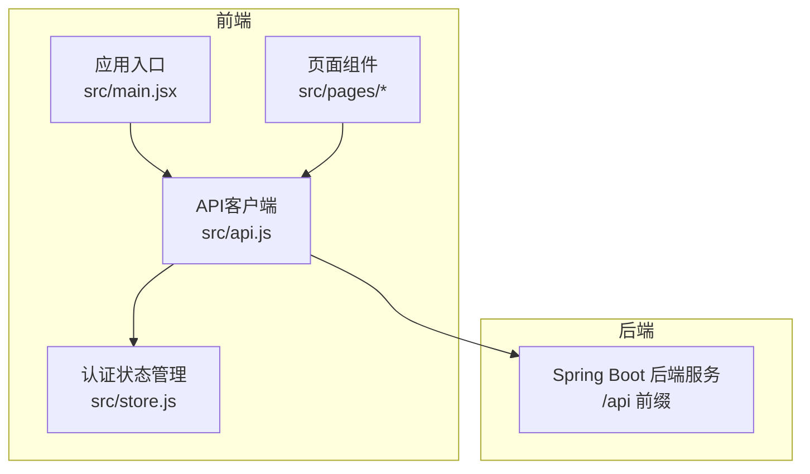
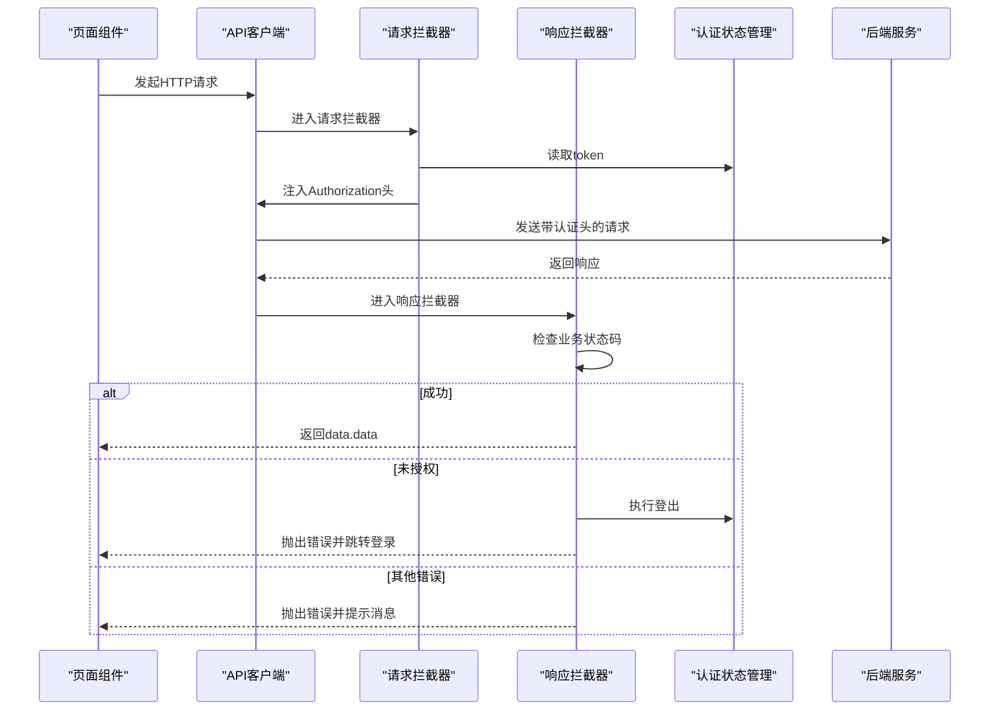
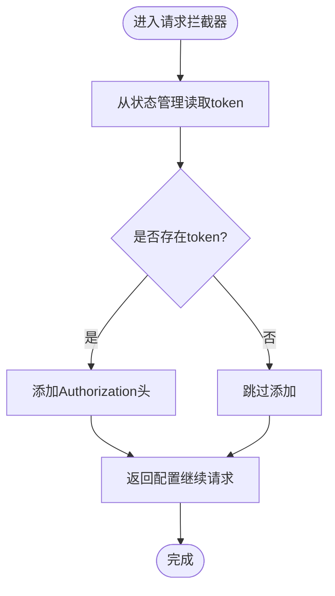
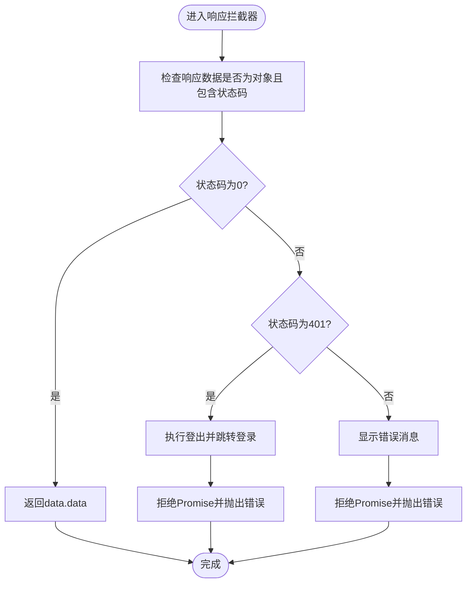
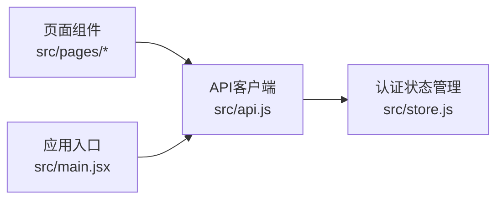

# API集成设计

<cite>
**本文档引用的文件**
- [api.js](file://frontend/src/api.js)
- [store.js](file://frontend/src/store.js)
- [package.json](file://frontend/package.json)
- [main.jsx](file://frontend/src/main.jsx)
- [Login.jsx](file://frontend/src/pages/Login.jsx)
- [ChangePassword.jsx](file://frontend/src/pages/ChangePassword.jsx)
- [ResultsPublic.jsx](file://frontend/src/pages/ResultsPublic.jsx)
- [Projects.jsx](file://frontend/src/pages/admin/Projects.jsx)
- [Import.jsx](file://frontend/src/pages/admin/Import.jsx)
- [Ranking.jsx](file://frontend/src/pages/admin/Ranking.jsx)
- [Representatives.jsx](file://frontend/src/pages/admin/Representatives.jsx)
- [Years.jsx](file://frontend/src/pages/admin/Years.jsx)
- [Applications.jsx](file://frontend/src/pages/counselor/Applications.jsx)
</cite>

## 目录
1. [简介](#简介)
2. [项目结构](#项目结构)
3. [核心组件](#核心组件)
4. [架构总览](#架构总览)
5. [详细组件分析](#详细组件分析)
6. [依赖关系分析](#依赖关系分析)
7. [性能考虑](#性能考虑)
8. [故障排除指南](#故障排除指南)
9. [结论](#结论)
10. [附录](#附录)

## 简介
本设计文档聚焦奖学金管理系统前端的API集成方案，系统采用Axios作为HTTP客户端，通过统一的API客户端实例进行请求与响应拦截，实现认证令牌自动注入、统一错误处理、状态码判断以及响应数据格式化。后端接口以REST风格提供，前端通过Axios封装的客户端进行调用，并结合Zustand状态管理实现认证信息持久化与全局共享。

## 项目结构
前端项目采用Vite构建，核心API封装位于src/api.js，全局状态管理位于src/store.js，页面组件位于src/pages下按角色划分（admin、counselor、student）。应用入口在src/main.jsx中配置国际化与主题，并挂载路由。

**图表来源**
- [api.js:1-44](file://frontend/src/api.js#L1-L44)
- [store.js:1-15](file://frontend/src/store.js#L1-L15)
- [main.jsx:1-19](file://frontend/src/main.jsx#L1-L19)

**章节来源**
- [main.jsx:1-19](file://frontend/src/main.jsx#L1-L19)
- [package.json:1-26](file://frontend/package.json#L1-L26)

## 核心组件
- API客户端：基于Axios创建，配置基础URL为"/api"，超时时间为30秒；注册请求与响应拦截器。
- 认证状态管理：使用Zustand持久化存储token与用户信息，支持登录设置与登出清理。
- 页面组件：各角色页面通过API客户端发起HTTP请求，处理异步加载与错误提示。

**章节来源**
- [api.js:5-8](file://frontend/src/api.js#L5-L8)
- [store.js:4-14](file://frontend/src/store.js#L4-L14)

## 架构总览
API客户端负责统一的HTTP通信策略，请求拦截器自动附加认证头，响应拦截器统一处理业务状态码与错误消息，页面组件通过API客户端进行数据交互。

**图表来源**
- [api.js:10-41](file://frontend/src/api.js#L10-L41)
- [store.js:4-14](file://frontend/src/store.js#L4-L14)

## 详细组件分析

### API客户端配置与初始化
- 基础URL：设置为"/api"，所有请求路径相对该前缀。
- 超时时间：30秒，避免长时间阻塞影响用户体验。
- 默认请求头：由请求拦截器动态添加Authorization头，格式为Bearer token。

**章节来源**
- [api.js:5-8](file://frontend/src/api.js#L5-L8)

### 请求拦截器实现
- 令牌读取：从认证状态管理中获取当前token。
- 自动添加认证头：若存在token，则在请求头中添加Authorization字段。
- 请求预处理：可扩展在此处进行请求参数标准化或日志记录。
- 请求日志记录：可在开发环境开启请求日志以便调试。

**图表来源**
- [api.js:10-16](file://frontend/src/api.js#L10-L16)
- [store.js:4-14](file://frontend/src/store.js#L4-L14)

**章节来源**
- [api.js:10-16](file://frontend/src/api.js#L10-L16)

### 响应拦截器设计
- 响应数据处理：检查响应数据是否为对象且包含业务状态码字段，成功时返回data.data。
- 错误统一处理：对非成功状态码进行统一错误提示与拒绝处理。
- 状态码判断：
  - 401未授权：触发登出、显示提示、跳转登录页，并拒绝Promise。
  - 其他错误：显示错误消息并拒绝Promise。
- 网络异常兜底：当响应体无消息时，回退到错误对象或网络异常提示。

**图表来源**
- [api.js:18-41](file://frontend/src/api.js#L18-L41)

**章节来源**
- [api.js:18-41](file://frontend/src/api.js#L18-L41)

### 数据格式化与转换
- 请求数据序列化：默认使用Axios的表单/JSON序列化，上传文件时需手动设置Content-Type为multipart/form-data。
- 响应数据反序列化：响应拦截器统一提取data.data作为业务数据，简化页面组件的数据处理逻辑。

**章节来源**
- [Import.jsx:52](file://frontend/src/pages/admin/Import.jsx#L52)
- [Import.jsx:69](file://frontend/src/pages/admin/Import.jsx#L69)
- [api.js:18-35](file://frontend/src/api.js#L18-L35)

### API调用最佳实践
- 异步处理：页面组件统一使用async/await进行API调用，确保错误捕获与加载状态管理。
- 错误边界：响应拦截器集中处理错误，页面组件只需关注UI反馈与重试逻辑。
- 加载状态管理：建议在页面组件中引入loading状态，在请求开始时设置，请求完成后清除。
- 参数传递：GET请求使用params对象传递查询参数，POST/PUT使用data对象传递请求体。
- 文件上传：上传文件时设置正确的Content-Type，并使用FormData对象封装数据。

**章节来源**
- [Login.jsx:24](file://frontend/src/pages/Login.jsx#L24)
- [ChangePassword.jsx:11](file://frontend/src/pages/ChangePassword.jsx#L11)
- [ResultsPublic.jsx:10](file://frontend/src/pages/ResultsPublic.jsx#L10)
- [Projects.jsx:28](file://frontend/src/pages/admin/Projects.jsx#L28)
- [Projects.jsx:45](file://frontend/src/pages/admin/Projects.jsx#L45)
- [Projects.jsx:48](file://frontend/src/pages/admin/Projects.jsx#L48)
- [Projects.jsx:79](file://frontend/src/pages/admin/Projects.jsx#L79)
- [Projects.jsx:87](file://frontend/src/pages/admin/Projects.jsx#L87)
- [Projects.jsx:91](file://frontend/src/pages/admin/Projects.jsx#L91)
- [Projects.jsx:96](file://frontend/src/pages/admin/Projects.jsx#L96)
- [Ranking.jsx:16](file://frontend/src/pages/admin/Ranking.jsx#L16)
- [Ranking.jsx:25](file://frontend/src/pages/admin/Ranking.jsx#L25)
- [Representatives.jsx:18](file://frontend/src/pages/admin/Representatives.jsx#L18)
- [Representatives.jsx:25](file://frontend/src/pages/admin/Representatives.jsx#L25)
- [Representatives.jsx:33](file://frontend/src/pages/admin/Representatives.jsx#L33)
- [Representatives.jsx:42](file://frontend/src/pages/admin/Representatives.jsx#L42)
- [Representatives.jsx:54](file://frontend/src/pages/admin/Representatives.jsx#L54)
- [Representatives.jsx:69](file://frontend/src/pages/admin/Representatives.jsx#L69)
- [Years.jsx:10](file://frontend/src/pages/admin/Years.jsx#L10)
- [Years.jsx:21](file://frontend/src/pages/admin/Years.jsx#L21)
- [Applications.jsx:16](file://frontend/src/pages/counselor/Applications.jsx#L16)

### API缓存策略与数据同步
- 缓存策略：当前实现未内置缓存层，建议在页面组件层面引入轻量缓存或使用React Query等库实现请求缓存与失效。
- 数据同步：对于需要实时更新的数据，建议在页面组件中使用轮询或WebSocket订阅；对于批量操作，建议使用乐观更新与回滚策略。

[本节为通用指导，不直接分析具体文件，故无章节来源]

### API测试方法与调试工具
- 单元测试：对API客户端的拦截器逻辑进行单元测试，模拟不同状态码与错误场景。
- 集成测试：通过Mock后端接口验证请求头注入、错误处理与页面渲染。
- 调试工具：浏览器开发者工具Network面板观察请求头与响应体；在开发环境开启请求日志辅助定位问题。

[本节为通用指导，不直接分析具体文件，故无章节来源]

## 依赖关系分析
API客户端依赖认证状态管理进行token读取，页面组件依赖API客户端进行数据交互，应用入口负责全局配置与国际化设置。

**图表来源**
- [api.js:1-44](file://frontend/src/api.js#L1-L44)
- [store.js:1-15](file://frontend/src/store.js#L1-L15)
- [main.jsx:1-19](file://frontend/src/main.jsx#L1-L19)

**章节来源**
- [api.js:1-44](file://frontend/src/api.js#L1-L44)
- [store.js:1-15](file://frontend/src/store.js#L1-L15)
- [main.jsx:1-19](file://frontend/src/main.jsx#L1-L19)

## 性能考虑
- 超时控制：30秒超时可避免长时间等待，建议根据接口特性调整。
- 并发优化：使用Promise.all并发请求多个接口，减少页面加载时间。
- 体积优化：合理拆分页面组件，按需加载，降低首屏负担。

[本节为通用指导，不直接分析具体文件，故无章节来源]

## 故障排除指南
- 登录过期：响应拦截器检测到401时会自动登出并跳转登录页，检查token是否正确存储与刷新。
- 网络异常：响应拦截器会显示网络异常提示，检查网络连接与代理配置。
- 参数错误：确认请求参数类型与后端期望一致，GET请求使用params，POST使用data。

**章节来源**
- [api.js:23-32](file://frontend/src/api.js#L23-L32)
- [api.js:36-40](file://frontend/src/api.js#L36-L40)

## 结论
本API集成方案通过Axios统一拦截器实现了认证、错误与响应数据的标准化处理，配合Zustand状态管理与页面组件的异步调用，形成了清晰、可维护的前后端交互模式。建议后续引入缓存与数据同步机制，进一步提升用户体验与系统性能。

## 附录
- 外部依赖：项目使用Axios、Ant Design、React、React Router DOM与Zustand等依赖。
- 国际化与主题：应用入口配置了中文本地化与主题色，确保界面一致性。

**章节来源**
- [package.json:11-20](file://frontend/package.json#L11-L20)
- [main.jsx:12](file://frontend/src/main.jsx#L12)