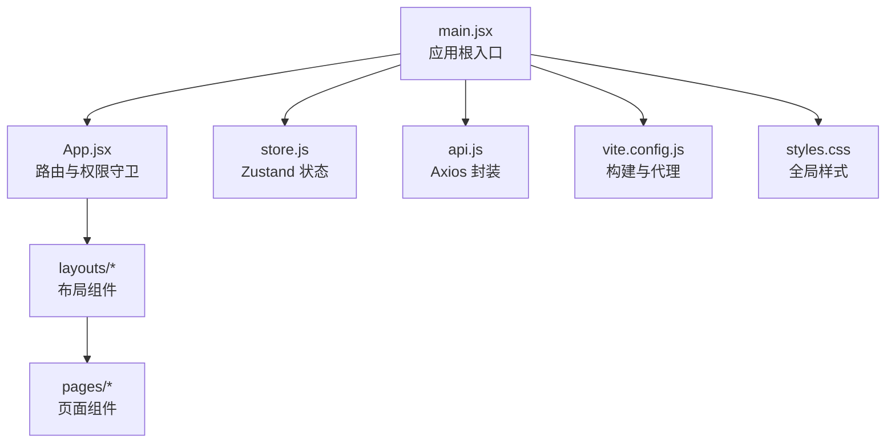
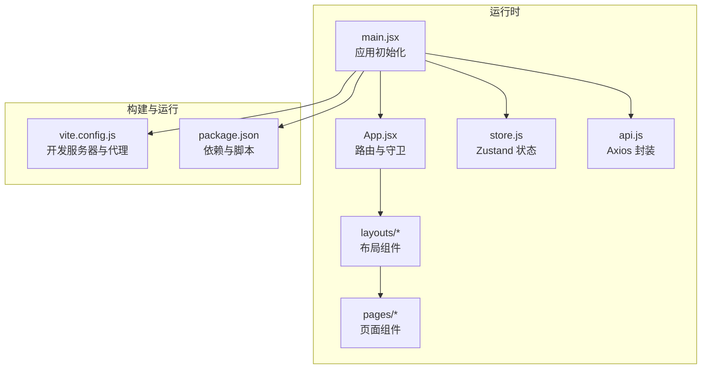
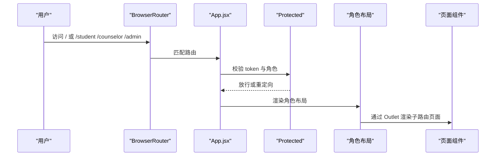
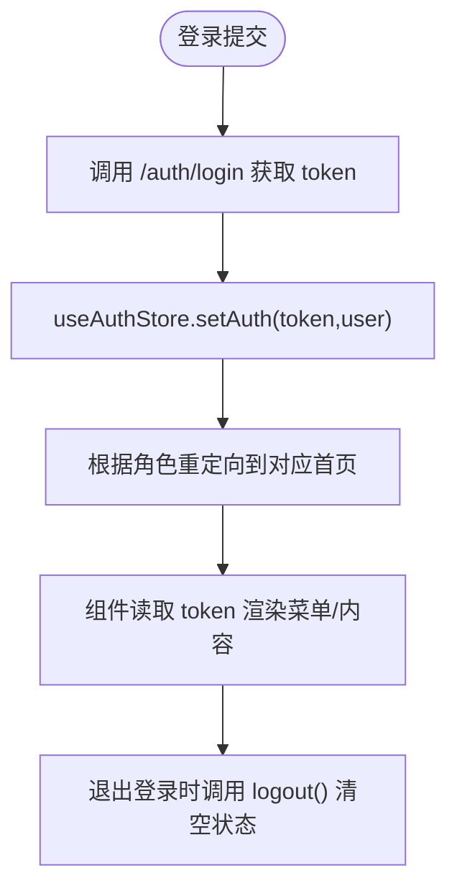
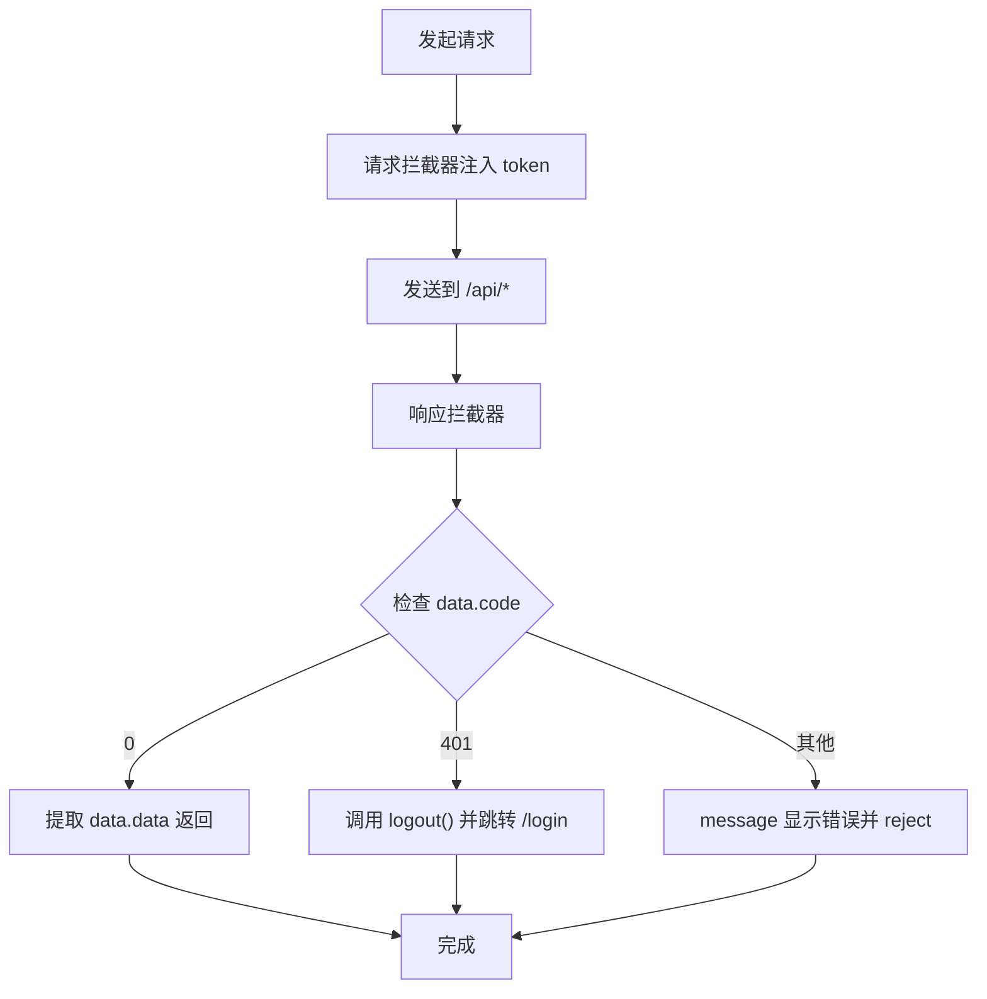
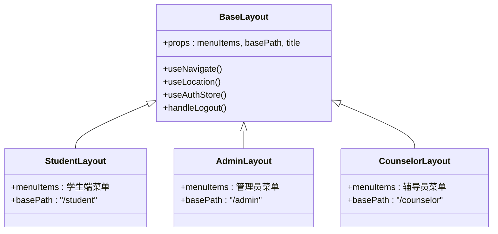
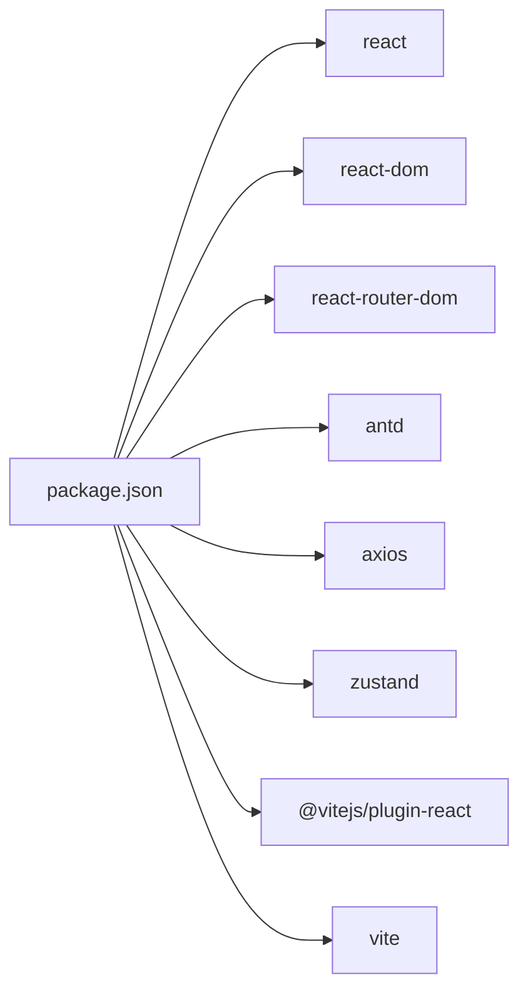

# 前端架构设计

<cite>
**本文引用的文件**
- [frontend/src/main.jsx](file://frontend/src/main.jsx)
- [frontend/src/App.jsx](file://frontend/src/App.jsx)
- [frontend/vite.config.js](file://frontend/vite.config.js)
- [frontend/package.json](file://frontend/package.json)
- [frontend/src/store.js](file://frontend/src/store.js)
- [frontend/src/api.js](file://frontend/src/api.js)
- [frontend/src/layouts/BaseLayout.jsx](file://frontend/src/layouts/BaseLayout.jsx)
- [frontend/src/layouts/StudentLayout.jsx](file://frontend/src/layouts/StudentLayout.jsx)
- [frontend/src/layouts/AdminLayout.jsx](file://frontend/src/layouts/AdminLayout.jsx)
- [frontend/src/layouts/CounselorLayout.jsx](file://frontend/src/layouts/CounselorLayout.jsx)
- [frontend/src/pages/student/Home.jsx](file://frontend/src/pages/student/Home.jsx)
- [frontend/src/pages/Login.jsx](file://frontend/src/pages/Login.jsx)
- [frontend/src/pages/admin/Dashboard.jsx](file://frontend/src/pages/admin/Dashboard.jsx)
- [frontend/src/pages/counselor/Students.jsx](file://frontend/src/pages/counselor/Students.jsx)
- [frontend/src/styles.css](file://frontend/src/styles.css)
- [frontend/index.html](file://frontend/index.html)
</cite>

## 目录
1. [引言](#引言)
2. [项目结构](#项目结构)
3. [核心组件](#核心组件)
4. [架构总览](#架构总览)
5. [详细组件分析](#详细组件分析)
6. [依赖关系分析](#依赖关系分析)
7. [性能考虑](#性能考虑)
8. [故障排查指南](#故障排查指南)
9. [结论](#结论)
10. [附录](#附录)

## 引言
本文件面向奖学金管理系统前端应用，系统采用 React + Vite 技术栈，结合 Ant Design UI 组件库、Zustand 状态管理、Axios 封装与 React Router 路由体系，实现多角色权限控制与模块化页面组织。本文档从架构视角梳理目录结构、模块划分、状态管理、路由与权限守卫、API 调用策略、构建与优化、组件设计原则与复用策略、性能优化以及开发调试与部署配置。

## 项目结构
前端项目位于 frontend 目录，采用“按功能域分层 + 按角色分包”的组织方式：
- 根入口与配置
  - 应用根入口：frontend/src/main.jsx
  - 应用主路由与权限守卫：frontend/src/App.jsx
  - 构建工具配置：frontend/vite.config.js
  - 依赖与脚本：frontend/package.json
  - 全局样式：frontend/src/styles.css
  - HTML 入口：frontend/index.html
- 状态管理
  - Zustand 全局状态：frontend/src/store.js
- API 层
  - Axios 实例与拦截器：frontend/src/api.js
- 布局与页面
  - 基础布局与角色布局：frontend/src/layouts/*
  - 页面组件：frontend/src/pages/*（按角色细分 student/admin/counselor）

图表来源
- [frontend/src/main.jsx:1-19](file://frontend/src/main.jsx#L1-L19)
- [frontend/src/App.jsx:1-83](file://frontend/src/App.jsx#L1-L83)
- [frontend/src/store.js:1-15](file://frontend/src/store.js#L1-L15)
- [frontend/src/api.js:1-44](file://frontend/src/api.js#L1-L44)
- [frontend/vite.config.js:1-21](file://frontend/vite.config.js#L1-L21)
- [frontend/src/styles.css:1-21](file://frontend/src/styles.css#L1-L21)

章节来源
- [frontend/src/main.jsx:1-19](file://frontend/src/main.jsx#L1-L19)
- [frontend/src/App.jsx:1-83](file://frontend/src/App.jsx#L1-L83)
- [frontend/vite.config.js:1-21](file://frontend/vite.config.js#L1-L21)
- [frontend/package.json:1-26](file://frontend/package.json#L1-L26)
- [frontend/src/styles.css:1-21](file://frontend/src/styles.css#L1-L21)
- [frontend/index.html:1-13](file://frontend/index.html#L1-L13)

## 核心组件
- 应用根入口与国际化主题
  - 在根入口中引入 React.StrictMode、Ant Design 国际化与主题配置，并挂载 BrowserRouter 与 App 根组件。
- 路由与权限守卫
  - App.jsx 定义所有路由，使用受保护组件与重定向逻辑实现角色级访问控制。
- 状态管理
  - 使用 Zustand 创建 auth store，支持持久化存储 token 与用户信息。
- API 封装
  - Axios 实例统一设置基础路径与超时，请求拦截注入 Authorization，响应拦截统一处理业务码与错误提示。
- 布局系统
  - BaseLayout 提供侧边菜单、头部用户信息与内容区出口；各角色布局基于 BaseLayout 注入菜单项与标题。

章节来源
- [frontend/src/main.jsx:1-19](file://frontend/src/main.jsx#L1-L19)
- [frontend/src/App.jsx:1-83](file://frontend/src/App.jsx#L1-L83)
- [frontend/src/store.js:1-15](file://frontend/src/store.js#L1-L15)
- [frontend/src/api.js:1-44](file://frontend/src/api.js#L1-L44)
- [frontend/src/layouts/BaseLayout.jsx:1-66](file://frontend/src/layouts/BaseLayout.jsx#L1-L66)

## 架构总览
系统采用“入口配置 → 路由与权限 → 布局与页面 → 状态与 API”的分层架构。Ant Design 提供 UI 基础，Zustand 管理认证状态，Axios 统一封装网络请求，Vite 提供开发与构建支持。

图表来源
- [frontend/src/main.jsx:1-19](file://frontend/src/main.jsx#L1-L19)
- [frontend/src/App.jsx:1-83](file://frontend/src/App.jsx#L1-L83)
- [frontend/src/store.js:1-15](file://frontend/src/store.js#L1-L15)
- [frontend/src/api.js:1-44](file://frontend/src/api.js#L1-L44)
- [frontend/vite.config.js:1-21](file://frontend/vite.config.js#L1-L21)
- [frontend/package.json:1-26](file://frontend/package.json#L1-L26)

## 详细组件分析

### 路由与权限守卫
- 受保护组件 Protected
  - 读取全局 token 与用户角色，未登录或角色不匹配则重定向至登录页。
- 根重定向 RootRedirect
  - 根据用户角色重定向到对应角色首页。
- 路由表
  - 登录页、公开结果页、学生端、辅导员端、管理员端各自独立路由组，子路由按功能划分。
  - 使用 React Router v6 的嵌套路由与 Outlet 渲染布局内的页面内容。

图表来源
- [frontend/src/App.jsx:27-41](file://frontend/src/App.jsx#L27-L41)
- [frontend/src/App.jsx:43-82](file://frontend/src/App.jsx#L43-L82)

章节来源
- [frontend/src/App.jsx:1-83](file://frontend/src/App.jsx#L1-L83)

### Zustand 状态管理
- 全局状态设计
  - 字段：token、user
  - 方法：setAuth(token, user)、logout()
  - 持久化：使用 persist 中间件，键名为 scholarship-auth
- 订阅与使用
  - 页面与布局通过 useAuthStore 读取 token 与 user，用于渲染与权限判断。
  - 登录成功后写入 token 与用户信息，触发组件重新渲染与导航跳转。

图表来源
- [frontend/src/pages/Login.jsx:22-34](file://frontend/src/pages/Login.jsx#L22-L34)
- [frontend/src/store.js:4-14](file://frontend/src/store.js#L4-L14)

章节来源
- [frontend/src/store.js:1-15](file://frontend/src/store.js#L1-L15)
- [frontend/src/pages/Login.jsx:1-76](file://frontend/src/pages/Login.jsx#L1-L76)

### Axios 封装与 API 调用策略
- 实例配置
  - 基础路径：/api
  - 超时：30 秒
- 请求拦截
  - 从 Zustand 读取 token 并注入 Authorization 头。
- 响应拦截
  - 业务码处理：code=0 表示成功透传 data；code=401 触发登出并跳转登录；其他错误弹出消息并拒绝 Promise。
  - 网络错误：优先展示后端返回 message，否则展示默认错误信息。
- 统一错误提示
  - 使用 Ant Design message 组件进行错误提示。

图表来源
- [frontend/src/api.js:5-41](file://frontend/src/api.js#L5-L41)

章节来源
- [frontend/src/api.js:1-44](file://frontend/src/api.js#L1-L44)

### 布局与页面组件
- BaseLayout
  - 提供侧边栏菜单、顶部用户下拉菜单、内容区出口 Outlet、以及“使用初始密码”告警条。
  - 通过 basePath 与 menuItems 注入角色菜单，selectedKeys 自动计算当前选中项。
- 角色布局
  - StudentLayout、AdminLayout、CounselorLayout 分别注入对应菜单项与标题。
- 页面组件示例
  - Login：表单校验、登录接口调用、角色重定向。
  - student/Home：个人信息与测评统计卡片展示，按钮跳转到相关功能页。
  - admin/Dashboard：仪表盘统计卡片，展示关键指标。
  - counselor/Students：学生列表表格，支持专业筛选与分页排序。

图表来源
- [frontend/src/layouts/BaseLayout.jsx:8-66](file://frontend/src/layouts/BaseLayout.jsx#L8-L66)
- [frontend/src/layouts/StudentLayout.jsx:14-17](file://frontend/src/layouts/StudentLayout.jsx#L14-L17)
- [frontend/src/layouts/AdminLayout.jsx:13-16](file://frontend/src/layouts/AdminLayout.jsx#L13-L16)
- [frontend/src/layouts/CounselorLayout.jsx:11-14](file://frontend/src/layouts/CounselorLayout.jsx#L11-L14)

章节来源
- [frontend/src/layouts/BaseLayout.jsx:1-66](file://frontend/src/layouts/BaseLayout.jsx#L1-L66)
- [frontend/src/layouts/StudentLayout.jsx:1-17](file://frontend/src/layouts/StudentLayout.jsx#L1-L17)
- [frontend/src/layouts/AdminLayout.jsx:1-16](file://frontend/src/layouts/AdminLayout.jsx#L1-L16)
- [frontend/src/layouts/CounselorLayout.jsx:1-14](file://frontend/src/layouts/CounselorLayout.jsx#L1-L14)
- [frontend/src/pages/student/Home.jsx:1-98](file://frontend/src/pages/student/Home.jsx#L1-L98)
- [frontend/src/pages/admin/Dashboard.jsx:1-35](file://frontend/src/pages/admin/Dashboard.jsx#L1-L35)
- [frontend/src/pages/counselor/Students.jsx:1-111](file://frontend/src/pages/counselor/Students.jsx#L1-L111)
- [frontend/src/pages/Login.jsx:1-76](file://frontend/src/pages/Login.jsx#L1-L76)

### 组件设计原则与复用策略
- 设计原则
  - 单一职责：布局负责导航与容器，页面负责具体业务数据与交互。
  - 可组合性：BaseLayout 通过 props 注入菜单与标题，实现跨角色复用。
  - 最小状态：仅在需要共享的状态处使用 Zustand，页面内部状态使用 useState。
- 复用策略
  - 高阶组件（HOC）：Protected 作为路由级别的权限 HOC，避免在每个页面重复鉴权。
  - Render Props：BaseLayout 通过 Outlet 实现布局与页面的渲染组合。
  - 组合优于继承：角色布局继承基础布局能力，而非复制代码。

章节来源
- [frontend/src/App.jsx:27-41](file://frontend/src/App.jsx#L27-L41)
- [frontend/src/layouts/BaseLayout.jsx:1-66](file://frontend/src/layouts/BaseLayout.jsx#L1-L66)

## 依赖关系分析
- 运行时依赖
  - React、React Router DOM、Ant Design、Day.js、Axios、Zustand
- 开发依赖
  - @vitejs/plugin-react、vite
- 依赖关系图

图表来源
- [frontend/package.json:11-24](file://frontend/package.json#L11-L24)

章节来源
- [frontend/package.json:1-26](file://frontend/package.json#L1-26)

## 性能考虑
- 代码分割与懒加载
  - 建议对大型页面组件使用 React.lazy 与 Suspense 进行按需加载，减少首屏体积。
- 缓存策略
  - 对静态资源启用浏览器缓存与长效缓存策略；对 API 数据可引入轻量缓存中间件以降低重复请求。
- 构建优化
  - 使用 Vite 默认 Rollup 打包，开启压缩与 Tree Shaking；生产环境配置 CDN 与资源指纹。
- UI 渲染优化
  - 表格与列表组件使用虚拟滚动与分页；图片与大图延迟加载；避免不必要的重渲染。

## 故障排查指南
- 登录后无法进入页面
  - 检查登录接口是否正确返回 token 与用户信息；确认 Protected 是否正确读取 token。
- 权限不足被重定向
  - 检查用户角色与路由守卫角色是否一致；确认 useAuthStore 中 user.role 是否正确。
- 接口 401 错误
  - 检查请求拦截器是否注入 Authorization；确认响应拦截器是否触发登出逻辑。
- 网络异常
  - 查看响应拦截器错误分支，确认 message 提示与错误堆栈；检查后端 CORS 与代理配置。

章节来源
- [frontend/src/pages/Login.jsx:22-34](file://frontend/src/pages/Login.jsx#L22-L34)
- [frontend/src/App.jsx:27-41](file://frontend/src/App.jsx#L27-L41)
- [frontend/src/api.js:18-41](file://frontend/src/api.js#L18-L41)

## 结论
该前端架构以清晰的目录结构与模块划分实现多角色权限控制，配合 Zustand 的轻量状态管理与 Axios 的统一拦截处理，形成稳定可靠的业务层。通过 Ant Design 的组件化与 Vite 的高效构建，系统具备良好的可维护性与扩展性。后续可在路由与页面层面进一步引入懒加载与缓存策略，持续提升用户体验与性能表现。

## 附录
- 开发与构建命令
  - 开发：npm run dev
  - 构建：npm run build
  - 预览：npm run preview
- 本地开发服务器
  - 端口：5173
  - 代理：/api 与 /uploads 代理到后端服务地址
- 全局样式
  - 登录页背景、卡片样式、品牌文案与分数展示样式集中管理

章节来源
- [frontend/package.json:6-10](file://frontend/package.json#L6-L10)
- [frontend/vite.config.js:6-19](file://frontend/vite.config.js#L6-L19)
- [frontend/src/styles.css:1-21](file://frontend/src/styles.css#L1-L21)
- [frontend/index.html:1-13](file://frontend/index.html#L1-L13)