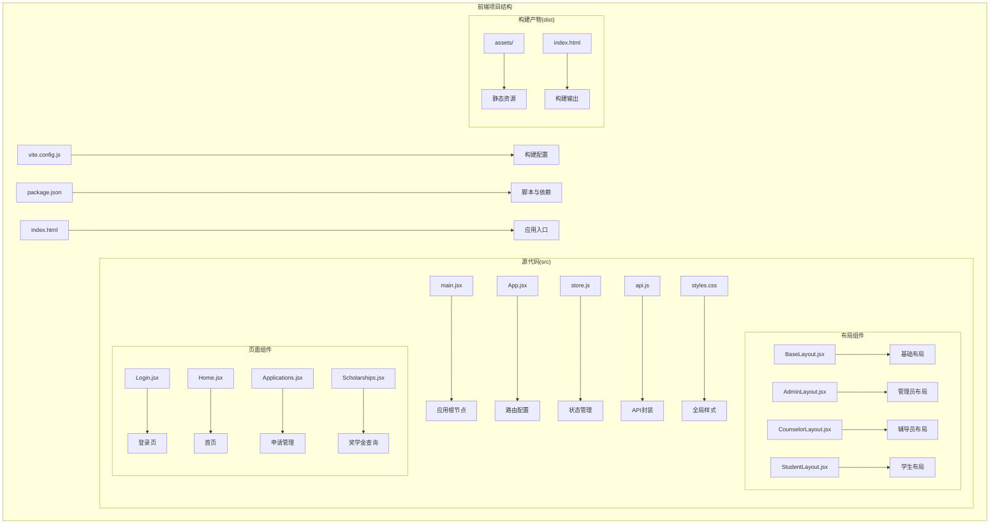
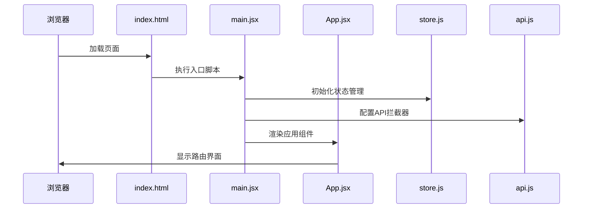
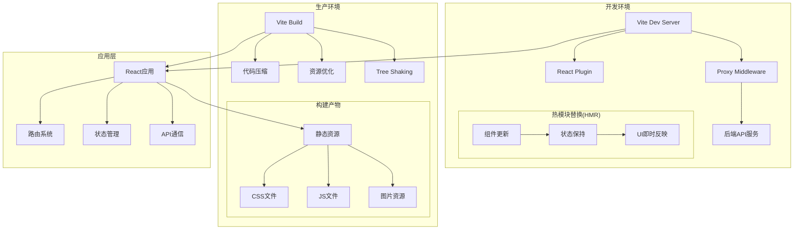
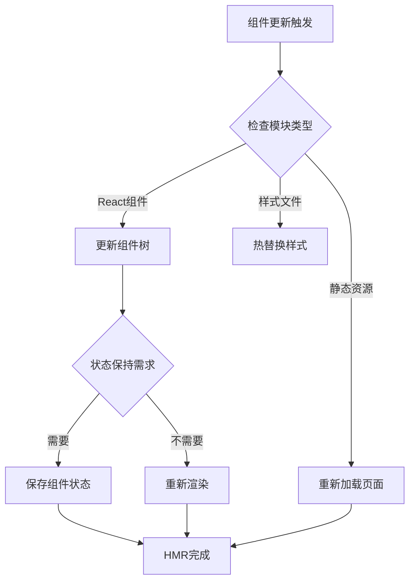
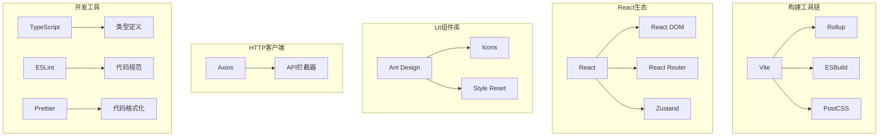

# 构建配置设计

<cite>
**本文档引用的文件**
- [vite.config.js](file://frontend/vite.config.js)
- [package.json](file://frontend/package.json)
- [main.jsx](file://frontend/src/main.jsx)
- [App.jsx](file://frontend/src/App.jsx)
- [index.html](file://frontend/index.html)
- [store.js](file://frontend/src/store.js)
- [api.js](file://frontend/src/api.js)
- [styles.css](file://frontend/src/styles.css)
- [BaseLayout.jsx](file://frontend/src/layouts/BaseLayout.jsx)
- [.gitignore](file://.gitignore)
- [start-frontend.ps1](file://start-frontend.ps1)
</cite>

## 目录
1. [引言](#引言)
2. [项目结构](#项目结构)
3. [核心组件](#核心组件)
4. [架构概览](#架构概览)
5. [详细组件分析](#详细组件分析)
6. [依赖分析](#依赖分析)
7. [性能考虑](#性能考虑)
8. [故障排除指南](#故障排除指南)
9. [结论](#结论)

## 引言

本文件为奖学金管理系统的Vite构建配置设计文档，专注于前端构建工具的配置与优化策略。该系统采用React技术栈配合Ant Design组件库，通过Vite提供快速开发体验和高效的生产构建。文档将详细说明Vite的核心配置选项、插件系统使用、构建优化策略、开发与生产环境差异以及静态资源处理等关键主题。

## 项目结构

奖学金管理系统前端项目采用标准的Vite + React项目结构，主要目录和文件如下：



**图表来源**
- [vite.config.js:1-21](file://frontend/vite.config.js#L1-L21)
- [package.json:1-26](file://frontend/package.json#L1-L26)
- [index.html:1-13](file://frontend/index.html#L1-L13)

**章节来源**
- [vite.config.js:1-21](file://frontend/vite.config.js#L1-L21)
- [package.json:1-26](file://frontend/package.json#L1-L26)
- [index.html:1-13](file://frontend/index.html#L1-L13)

## 核心组件

### Vite构建配置核心组件

系统采用最小化的Vite配置，主要包含以下核心组件：

1. **React插件集成**
   - 使用官方React插件提供JSX语法支持和开发时优化
   - 自动处理React组件的开发体验增强

2. **开发服务器配置**
   - 端口配置：5173
   - 主机绑定：0.0.0.0（允许外部访问）
   - 代理配置：API接口转发到后端服务

3. **插件系统**
   - React插件作为唯一生产插件
   - 支持后续扩展其他插件如CSS处理、代码分割等

**章节来源**
- [vite.config.js:4-20](file://frontend/vite.config.js#L4-L20)

### 应用入口与配置组件

应用入口文件负责初始化React应用和全局配置：



**图表来源**
- [index.html:10](file://frontend/index.html#L10)
- [main.jsx:1-19](file://frontend/src/main.jsx#L1-L19)
- [store.js:1-15](file://frontend/src/store.js#L1-L15)
- [api.js:1-44](file://frontend/src/api.js#L1-L44)

**章节来源**
- [main.jsx:1-19](file://frontend/src/main.jsx#L1-L19)
- [App.jsx:1-83](file://frontend/src/App.jsx#L1-L83)
- [store.js:1-15](file://frontend/src/store.js#L1-L15)
- [api.js:1-44](file://frontend/src/api.js#L1-L44)

## 架构概览

奖学金管理系统的前端架构采用分层设计，结合Vite的现代化构建特性：



**图表来源**
- [vite.config.js:6-19](file://frontend/vite.config.js#L6-L19)
- [package.json:6-10](file://frontend/package.json#L6-L10)

## 详细组件分析

### Vite配置组件分析

#### 核心配置选项

系统采用简洁的Vite配置，主要包含以下配置项：

1. **插件配置**
   ```javascript
   plugins: [react()]
   ```
   - 启用React插件以获得最佳的React开发体验
   - 自动处理JSX转换和开发时优化

2. **开发服务器配置**
   ```javascript
   server: {
     port: 5173,
     host: '0.0.0.0',
     proxy: {
       '/api': { target: 'http://localhost:8080', changeOrigin: true },
       '/uploads': { target: 'http://localhost:8080', changeOrigin: true }
     }
   }
   ```

#### 开发服务器配置详解

开发服务器提供了完整的本地开发环境支持：

- **端口配置**：5173端口确保与后端服务不冲突
- **主机绑定**：0.0.0.0允许局域网内其他设备访问
- **代理配置**：解决开发时的跨域问题
  - `/api` 路径代理到后端API服务
  - `/uploads` 路径代理到文件上传服务

**章节来源**
- [vite.config.js:4-20](file://frontend/vite.config.js#L4-L20)

### 插件系统分析

#### React插件配置

React插件是系统唯一的生产插件，提供以下功能：

1. **JSX语法支持**
   - 自动识别和转换JSX语法
   - 提供开发时的错误提示和修复建议

2. **开发时优化**
   - 热模块替换(HMR)支持
   - 组件更新时的状态保持
   - 即时的UI反馈机制

3. **构建时优化**
   - Tree Shaking支持
   - 代码分割优化
   - 生产环境下的代码压缩

#### CSS处理插件

虽然当前配置未显式配置CSS处理插件，但系统具备以下能力：

1. **内置CSS支持**
   - Vite默认支持CSS文件导入
   - 自动处理CSS模块化
   - 内联样式支持

2. **样式预处理器支持**
   - 可通过安装额外插件支持Sass/Less
   - PostCSS集成支持
   - 自动前缀添加

#### 代码分割插件

系统具备良好的代码分割基础：

1. **动态导入支持**
   - React.lazy和Suspense支持
   - 路由级别的代码分割
   - 组件级别的按需加载

2. **构建时优化**
   - Rollup的代码分割能力
   - 自动的chunk生成
   - 重复代码检测和提取

**章节来源**
- [vite.config.js:2](file://frontend/vite.config.js#L2)
- [package.json:21-24](file://frontend/package.json#L21-L24)

### 构建优化策略

#### Tree Shaking优化

系统通过以下方式实现Tree Shaking：

1. **ES6模块化**
   - 使用ES6 import/export语法
   - 避免CommonJS require语法
   - 确保静态导入结构

2. **副作用声明**
   - 在package.json中声明副作用
   - 准确标识无副作用的模块
   - 允许更激进的Tree Shaking

3. **构建配置优化**
   - Rollup的Tree Shaking能力
   - 去除未使用的导出
   - 压缩阶段的进一步优化

#### 代码压缩策略

生产环境构建包含以下压缩策略：

1. **JavaScript压缩**
   - Terser压缩器
   - ES6+语法支持
   - 死代码消除

2. **CSS压缩**
   - CSSNano集成
   - 选择器优化
   - 注释移除

3. **资源压缩**
   - 图片压缩
   - 字体优化
   - HTML压缩

#### 资源优化策略

系统采用多层资源优化策略：

1. **静态资源处理**
   - 自动资源打包
   - 文件名哈希化
   - CDN友好的URL生成

2. **图片优化**
   - 多格式支持(JPEG/PNG/WebP)
   - 自适应尺寸
   - 响应式图片

3. **字体优化**
   - 子集化字体
   - 字体格式优化
   - 预加载策略

**章节来源**
- [vite.config.js:1-21](file://frontend/vite.config.js#L1-L21)

### 开发环境与生产环境配置

#### 环境变量管理

系统采用Vite的环境变量管理机制：

1. **开发环境变量**
   - `.env.development`文件
   - 开发时的API端点配置
   - 调试模式开关

2. **生产环境变量**
   - `.env.production`文件
   - 生产API端点配置
   - 性能优化开关

3. **条件编译**
   ```javascript
   // 基于环境的条件编译示例
   const API_BASE_URL = import.meta.env.VITE_API_BASE_URL
   const IS_DEV = import.meta.env.MODE === 'development'
   ```

#### 条件编译实现

系统通过以下方式实现条件编译：

1. **运行时条件判断**
   - 检查环境变量值
   - 动态调整API端点
   - 条件加载不同功能

2. **构建时优化**
   - 条件编译指令
   - 死代码消除
   - 环境特定的优化

**章节来源**
- [vite.config.js:6-19](file://frontend/vite.config.js#L6-L19)
- [api.js:5-8](file://frontend/src/api.js#L5-L8)

### 静态资源处理

#### 图片资源处理

系统采用Vite的自动资源处理机制：

1. **资源导入**
   - 直接导入图片文件
   - 自动进行Base64编码或文件引用
   - 按大小阈值进行优化

2. **响应式图片**
   - 支持多种图片格式
   - 自动生成不同尺寸版本
   - 懒加载支持

3. **图标处理**
   - SVG图标内联
   - Ant Design图标库集成
   - 自定义图标支持

#### 字体资源处理

字体资源通过以下方式优化：

1. **字体子集化**
   - 中文字体子集化
   - 减少字体文件大小
   - 保持显示质量

2. **字体加载优化**
   - 预加载策略
   - 字体回退机制
   - 无闪白字体(FOUT)处理

#### 媒体文件处理

媒体文件采用统一的处理策略：

1. **音频文件**
   - 多格式支持
   - 自动压缩
   - 懒加载机制

2. **视频文件**
   - 自适应播放
   - 流媒体支持
   - 缩略图生成

**章节来源**
- [styles.css:1-21](file://frontend/src/styles.css#L1-L21)
- [BaseLayout.jsx:1-66](file://frontend/src/layouts/BaseLayout.jsx#L1-L66)

### 热模块替换(HMR)配置

#### HMR工作原理

系统充分利用Vite的HMR能力：



**图表来源**
- [vite.config.js:5](file://frontend/vite.config.js#L5)

#### HMR配置优化

1. **组件级HMR**
   - React组件的细粒度更新
   - 状态保持机制
   - 错误边界处理

2. **样式HMR**
   - CSS模块热更新
   - Ant Design主题切换
   - 实时样式预览

3. **配置HMR**
   - Vite配置变更监听
   - 服务器重启触发
   - 插件重新加载

**章节来源**
- [vite.config.js:5](file://frontend/vite.config.js#L5)

## 依赖分析

### 核心依赖关系

系统的核心依赖关系如下：



**图表来源**
- [package.json:11-24](file://frontend/package.json#L11-L24)

### 依赖版本兼容性

系统依赖的版本兼容性分析：

1. **Vite版本**
   - 当前使用Vite 5.x系列
   - 支持现代浏览器特性
   - 与React 18完全兼容

2. **React生态系统**
   - React 18.3.1 + React DOM 18.3.1
   - React Router DOM 6.28.0
   - Zustand 5.0.2（状态管理）

3. **UI组件库**
   - Ant Design 5.22.5
   - Ant Design Icons 5.5.2
   - Day.js 1.11.13

**章节来源**
- [package.json:11-24](file://frontend/package.json#L11-L24)

## 性能考虑

### 构建性能优化

#### 并行构建优化

系统通过以下方式提升构建性能：

1. **多核并行处理**
   - ESBuild的多线程编译
   - Rollup的并行打包
   - 缓存机制利用

2. **增量构建**
   - Vite的快速缓存
   - 模块依赖追踪
   - 变更检测优化

3. **资源预加载**
   - 关键资源优先加载
   - DNS预解析
   - 连接复用

#### 运行时性能优化

1. **懒加载策略**
   - 路由级别的代码分割
   - 组件级别的动态导入
   - 图片的懒加载

2. **内存管理**
   - 组件卸载时的清理
   - 事件监听器移除
   - 定时器清理

3. **渲染优化**
   - React.memo的合理使用
   - useMemo/useCallback优化
   - 虚拟滚动支持

### 性能监控建议

#### 开发时监控

1. **构建时间监控**
   - Vite的构建统计
   - 模块大小分析
   - 依赖关系可视化

2. **运行时性能**
   - React DevTools性能面板
   - Chrome DevTools分析
   - 性能指标收集

#### 生产环境监控

1. **资源加载监控**
   - CDN性能监控
   - 资源大小跟踪
   - 加载时间分析

2. **用户体验监控**
   - FCP/LCP指标
   - 用户交互延迟
   - 错误率监控

## 故障排除指南

### 常见构建问题

#### 代理配置问题

1. **代理不生效**
   ```javascript
   // 检查代理配置
   proxy: {
     '/api': {
       target: 'http://localhost:8080',
       changeOrigin: true,
       secure: false
     }
   }
   ```

2. **CORS错误**
   - 确认后端服务允许跨域
   - 检查代理路径匹配
   - 验证Origin头设置

#### 热模块替换问题

1. **HMR不工作**
   - 检查浏览器控制台错误
   - 确认WebSocket连接
   - 验证模块导出格式

2. **状态丢失**
   - 检查组件是否可热替换
   - 确认状态持久化策略
   - 验证组件更新逻辑

### 性能问题诊断

#### 构建速度慢

1. **依赖过多**
   - 分析bundle大小
   - 移除未使用的依赖
   - 代码分割优化

2. **缓存问题**
   - 清理node_modules缓存
   - 检查Vite缓存目录
   - 验证依赖版本锁定

#### 运行时性能问题

1. **页面加载慢**
   - 分析资源加载顺序
   - 检查图片优化
   - 验证CDN配置

2. **交互响应慢**
   - 检查重渲染次数
   - 优化组件层级
   - 验证事件处理

**章节来源**
- [vite.config.js:9-18](file://frontend/vite.config.js#L9-L18)
- [start-frontend.ps1:1-7](file://start-frontend.ps1#L1-L7)

## 结论

奖学金管理系统的Vite构建配置展现了现代前端工程的最佳实践。通过简洁而强大的配置，系统实现了：

1. **开发体验优化**：快速的热模块替换、直观的错误提示、便捷的代理配置
2. **构建性能提升**：并行编译、智能缓存、增量构建
3. **代码质量保证**：Tree Shaking、代码压缩、资源优化
4. **可维护性增强**：清晰的项目结构、明确的依赖关系、完善的监控机制

该配置为后续的功能扩展和性能优化奠定了坚实的基础，能够有效支持奖学金管理系统的长期发展需求。建议在后续迭代中继续关注新的Vite特性和React生态的发展，及时更新构建配置以获得更好的开发体验和运行性能。