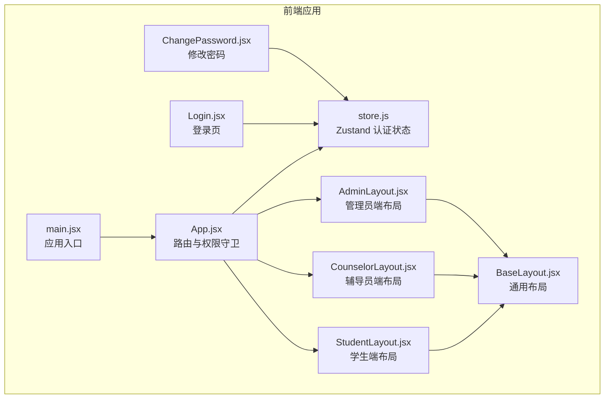
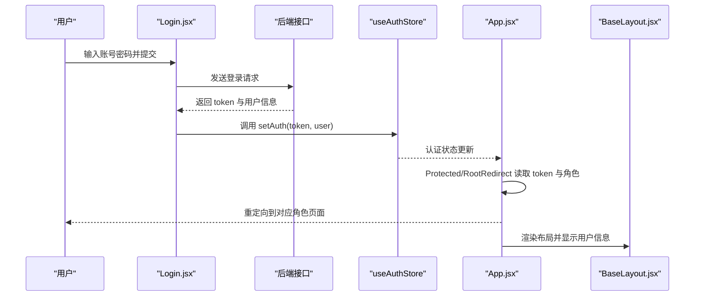
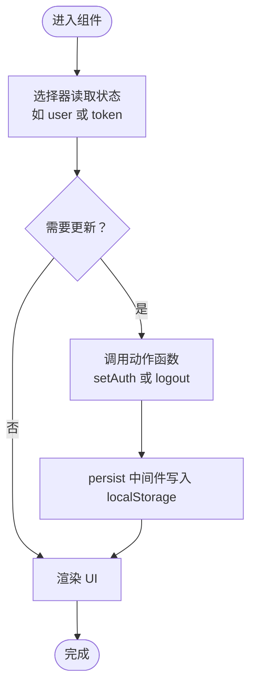
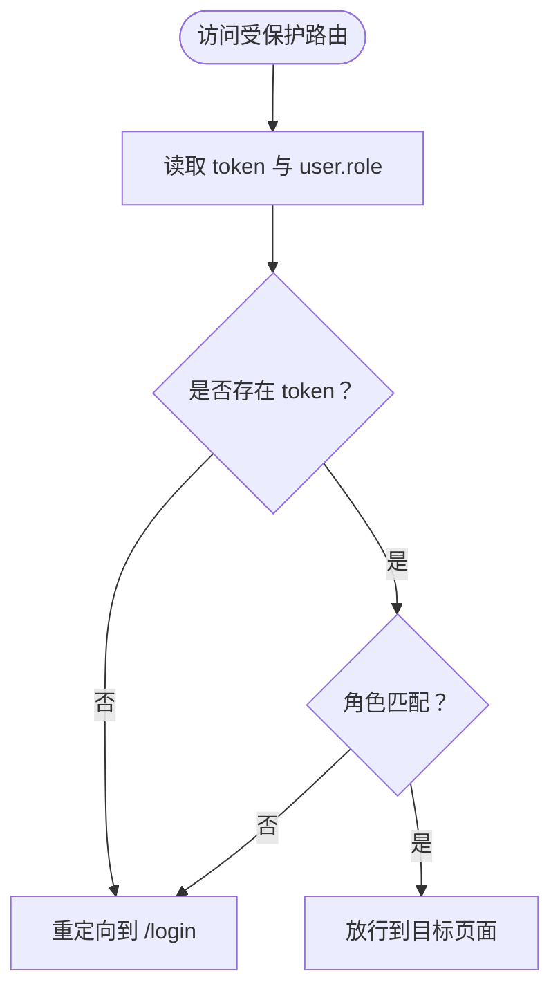
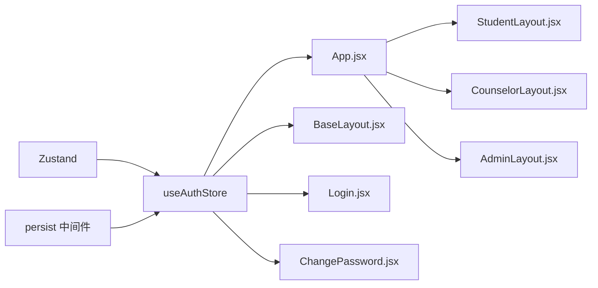

# 状态管理设计

<cite>
**本文引用的文件**
- [store.js](file://frontend/src/store.js)
- [App.jsx](file://frontend/src/App.jsx)
- [main.jsx](file://frontend/src/main.jsx)
- [Login.jsx](file://frontend/src/pages/Login.jsx)
- [BaseLayout.jsx](file://frontend/src/layouts/BaseLayout.jsx)
- [ChangePassword.jsx](file://frontend/src/pages/ChangePassword.jsx)
- [StudentLayout.jsx](file://frontend/src/layouts/StudentLayout.jsx)
- [AdminLayout.jsx](file://frontend/src/layouts/AdminLayout.jsx)
- [CounselorLayout.jsx](file://frontend/src/layouts/CounselorLayout.jsx)
</cite>

## 目录
1. [引言](#引言)
2. [项目结构](#项目结构)
3. [核心组件](#核心组件)
4. [架构总览](#架构总览)
5. [详细组件分析](#详细组件分析)
6. [依赖分析](#依赖分析)
7. [性能考虑](#性能考虑)
8. [故障排查指南](#故障排查指南)
9. [结论](#结论)
10. [附录](#附录)

## 引言
本设计文档聚焦奖学金管理系统的前端状态管理实现，基于 Zustand 的轻量级状态库，采用“单一状态源 + 持久化中间件”的模式，统一管理用户认证状态，并通过自定义 Hook 将状态与组件解耦。系统目前未实现业务数据状态的集中式管理，但通过现有认证状态模型，可扩展出完整的状态管理蓝图：将认证状态、应用配置状态与业务数据状态进行分层与模块化管理，确保状态的扁平化、原子性与可预测性。

## 项目结构
前端项目采用 Vite 构建，入口在 main.jsx 中挂载 React 应用，路由与权限控制集中在 App.jsx，认证状态通过 store.js 定义并持久化到浏览器本地存储。各角色布局组件（学生、辅导员、管理员）均复用基础布局 BaseLayout.jsx，以统一展示用户信息与登出操作。

图表来源
- [main.jsx:10-18](file://frontend/src/main.jsx#L10-L18)
- [App.jsx:43-82](file://frontend/src/App.jsx#L43-L82)
- [store.js:4-14](file://frontend/src/store.js#L4-L14)
- [BaseLayout.jsx:8-65](file://frontend/src/layouts/BaseLayout.jsx#L8-L65)
- [StudentLayout.jsx:14-16](file://frontend/src/layouts/StudentLayout.jsx#L14-L16)
- [AdminLayout.jsx:13-15](file://frontend/src/layouts/AdminLayout.jsx#L13-L15)
- [CounselorLayout.jsx:11-13](file://frontend/src/layouts/CounselorLayout.jsx#L11-L13)
- [Login.jsx:16-34](file://frontend/src/pages/Login.jsx#L16-L34)
- [ChangePassword.jsx:5-16](file://frontend/src/pages/ChangePassword.jsx#L5-L16)

章节来源
- [main.jsx:10-18](file://frontend/src/main.jsx#L10-L18)
- [App.jsx:43-82](file://frontend/src/App.jsx#L43-L82)
- [store.js:4-14](file://frontend/src/store.js#L4-L14)

## 核心组件
- Zustand 认证状态仓库
  - 初始状态：token 为空、user 为 null
  - 动作函数：setAuth(token, user) 设置认证信息；logout() 清空认证信息
  - 持久化：通过 persist 中间件将状态保存至 localStorage，键名为 scholarship-auth
- 权限守卫与根路径重定向
  - Protected 组件：根据 token 与用户角色决定是否放行
  - RootRedirect：根据用户角色重定向到对应角色的首页
- 布局与菜单
  - BaseLayout：展示用户头像、姓名与账号，提供修改密码与退出登录入口
  - 各角色布局：封装菜单项与基础路径，复用 BaseLayout

章节来源
- [store.js:4-14](file://frontend/src/store.js#L4-L14)
- [App.jsx:27-41](file://frontend/src/App.jsx#L27-L41)
- [BaseLayout.jsx:8-65](file://frontend/src/layouts/BaseLayout.jsx#L8-L65)
- [StudentLayout.jsx:4-12](file://frontend/src/layouts/StudentLayout.jsx#L4-L12)
- [AdminLayout.jsx:4-10](file://frontend/src/layouts/AdminLayout.jsx#L4-L10)
- [CounselorLayout.jsx:4-8](file://frontend/src/layouts/CounselorLayout.jsx#L4-L8)

## 架构总览
下图展示了认证状态在应用中的流转：用户在登录页提交凭据后，调用后端接口获取 token 与用户信息，随后通过 setAuth 写入状态；后续路由守卫与布局组件从状态中读取用户信息，实现权限控制与界面渲染。

图表来源
- [Login.jsx:22-34](file://frontend/src/pages/Login.jsx#L22-L34)
- [store.js:6-10](file://frontend/src/store.js#L6-L10)
- [App.jsx:27-41](file://frontend/src/App.jsx#L27-L41)
- [BaseLayout.jsx:10-13](file://frontend/src/layouts/BaseLayout.jsx#L10-L13)

## 详细组件分析

### 认证状态仓库（useAuthStore）
- 设计原则
  - 单一职责：仅管理认证相关状态与动作
  - 不可变性：通过 set 函数传入新对象，避免直接修改旧状态
  - 原子性：setAuth 与 logout 作为独立动作，保证状态变更最小化
- 数据结构
  - token: 字符串或空值，用于携带认证令牌
  - user: 用户对象或空值，包含 account、role、name、usingInitialPassword 等字段
- 初始化与持久化
  - 初始值：token 为空、user 为 null
  - 持久化键名：scholarship-auth
- 使用方式
  - 在组件中通过选择器读取部分状态（如 user、token）
  - 通过动作函数更新状态（如 setAuth、logout）

图表来源
- [store.js:4-14](file://frontend/src/store.js#L4-L14)

章节来源
- [store.js:4-14](file://frontend/src/store.js#L4-L14)

### 登录流程与状态写入
- 流程要点
  - 表单提交后调用后端登录接口
  - 成功后调用 setAuth(token, user)，其中 user 包含 account、role、name、usingInitialPassword
  - 根据角色跳转到对应角色的首页
- 关键实现位置
  - 登录表单与提交逻辑：[Login.jsx:16-34](file://frontend/src/pages/Login.jsx#L16-L34)
  - 动作函数 setAuth 的使用：[Login.jsx:20](file://frontend/src/pages/Login.jsx#L20)

章节来源
- [Login.jsx:16-34](file://frontend/src/pages/Login.jsx#L16-L34)

### 权限守卫与根路径重定向
- Protected 组件
  - 读取 token 与 user.role
  - 若无 token 或角色不匹配，则重定向到登录页
- RootRedirect 组件
  - 依据 user.role 重定向到对应角色的首页
- 应用位置
  - App.jsx 中对所有受保护路由进行包裹与重定向处理

图表来源
- [App.jsx:27-41](file://frontend/src/App.jsx#L27-L41)

章节来源
- [App.jsx:27-41](file://frontend/src/App.jsx#L27-L41)

### 布局与用户信息展示
- BaseLayout
  - 读取 user 并展示姓名与账号
  - 提供修改密码与退出登录入口
  - 退出时调用 logout 并跳转到登录页
- 角色布局
  - StudentLayout/AdminLayout/CounselorLayout 分别注入菜单项与基础路径
  - 复用 BaseLayout 实现统一 UI

章节来源
- [BaseLayout.jsx:8-65](file://frontend/src/layouts/BaseLayout.jsx#L8-L65)
- [StudentLayout.jsx:4-12](file://frontend/src/layouts/StudentLayout.jsx#L4-L12)
- [AdminLayout.jsx:4-10](file://frontend/src/layouts/AdminLayout.jsx#L4-L10)
- [CounselorLayout.jsx:4-8](file://frontend/src/layouts/CounselorLayout.jsx#L4-L8)

### 修改密码与状态更新
- 流程要点
  - 提交旧密码与新密码后，调用后端接口
  - 成功后通过 setAuth 更新 user 的 usingInitialPassword 字段
  - 重置表单并提示成功
- 关键实现位置
  - 动作函数 setAuth 的使用与状态读取：[ChangePassword.jsx:7-16](file://frontend/src/pages/ChangePassword.jsx#L7-L16)

章节来源
- [ChangePassword.jsx:7-16](file://frontend/src/pages/ChangePassword.jsx#L7-L16)

## 依赖分析
- 组件与状态仓库的耦合关系
  - App.jsx、BaseLayout.jsx、Login.jsx、ChangePassword.jsx 直接依赖 useAuthStore
  - 各角色布局组件通过 BaseLayout 间接依赖认证状态
- 外部依赖
  - Zustand：状态管理核心库
  - persist 中间件：提供 localStorage 持久化能力
  - react-router-dom：路由与导航
  - antd：UI 组件库

图表来源
- [store.js:4-14](file://frontend/src/store.js#L4-L14)
- [App.jsx:27-41](file://frontend/src/App.jsx#L27-L41)
- [BaseLayout.jsx:10-13](file://frontend/src/layouts/BaseLayout.jsx#L10-L13)
- [Login.jsx:20](file://frontend/src/pages/Login.jsx#L20)
- [ChangePassword.jsx:7-8](file://frontend/src/pages/ChangePassword.jsx#L7-L8)

章节来源
- [store.js:4-14](file://frontend/src/store.js#L4-L14)
- [App.jsx:27-41](file://frontend/src/App.jsx#L27-L41)

## 性能考虑
- 选择器订阅
  - 通过选择器（如 s => s.user）仅订阅所需字段，减少无关重渲染
- 动作函数原子性
  - 将多个状态更新合并到单个 set 调用，避免中间态导致的重复渲染
- 持久化策略
  - 使用 persist 中间件自动序列化/反序列化，降低手动同步成本
- 扩展建议
  - 对于大型应用，可拆分状态模块（如认证、配置、业务数据），并通过组合多个 Zustand Store 实现模块化
  - 对热点数据可引入缓存与批量更新策略，避免频繁 IO

## 故障排查指南
- 登录后无法跳转或页面空白
  - 检查 setAuth 是否正确调用以及 token 与 user 是否被持久化
  - 参考：[Login.jsx:26-32](file://frontend/src/pages/Login.jsx#L26-L32)、[store.js:6-10](file://frontend/src/store.js#L6-L10)
- 退出登录后仍可访问受保护页面
  - 确认 logout 是否被调用且路由守卫逻辑生效
  - 参考：[BaseLayout.jsx:13](file://frontend/src/layouts/BaseLayout.jsx#L13)、[App.jsx:27-41](file://frontend/src/App.jsx#L27-L41)
- 修改密码后状态未更新
  - 确认 setAuth 是否使用了 getState 获取当前 token 并合并新 user
  - 参考：[ChangePassword.jsx:13-14](file://frontend/src/pages/ChangePassword.jsx#L13-L14)
- 初次加载时用户信息缺失
  - 检查 localStorage 中 scholarship-auth 键是否存在且格式正确
  - 参考：[store.js:12](file://frontend/src/store.js#L12)

章节来源
- [Login.jsx:26-32](file://frontend/src/pages/Login.jsx#L26-L32)
- [store.js:6-10](file://frontend/src/store.js#L6-L10)
- [BaseLayout.jsx:13](file://frontend/src/layouts/BaseLayout.jsx#L13)
- [App.jsx:27-41](file://frontend/src/App.jsx#L27-L41)
- [ChangePassword.jsx:13-14](file://frontend/src/pages/ChangePassword.jsx#L13-L14)
- [store.js:12](file://frontend/src/store.js#L12)

## 结论
当前系统以最小可行的方式实现了认证状态的集中管理与持久化，配合路由守卫与通用布局，满足了多角色权限控制的需求。建议在保持现有认证状态模型的基础上，逐步引入应用配置状态与业务数据状态的模块化管理，遵循状态扁平化、动作原子性与不可变性的原则，持续优化开发体验与运行性能。

## 附录
- 开发体验优化建议
  - 在开发环境启用 Zustand Devtools，便于追踪状态变更与动作调用
  - 对常用选择器抽象为自定义 Hook，提升代码复用性
  - 对持久化数据增加版本迁移策略，避免跨版本兼容问题