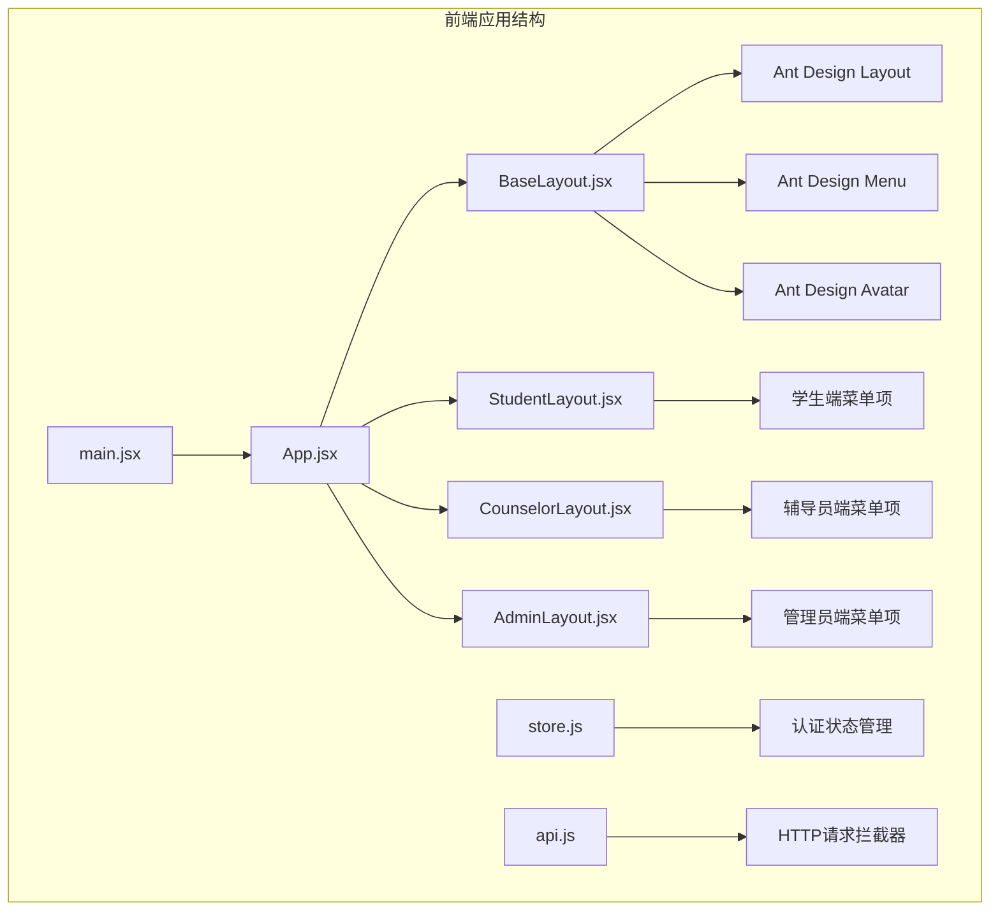
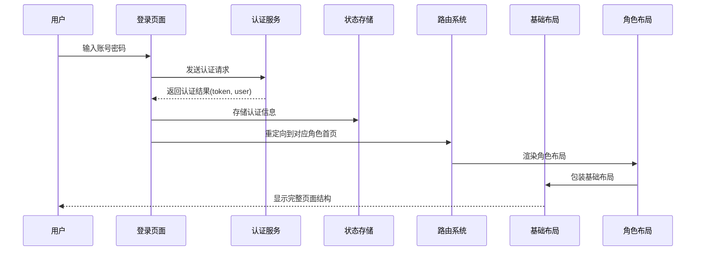
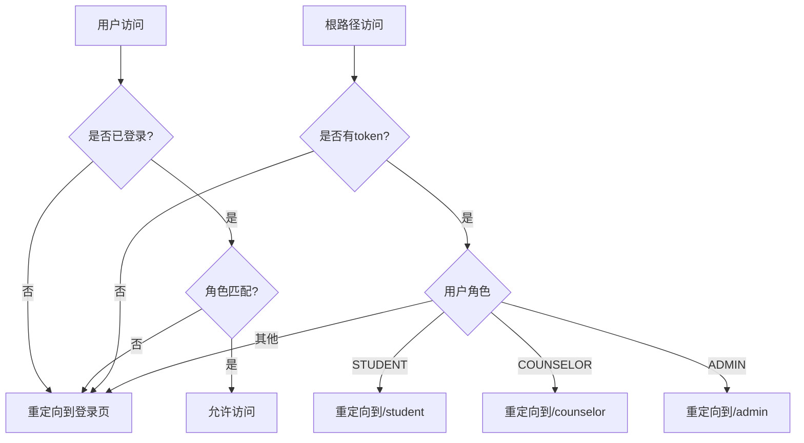
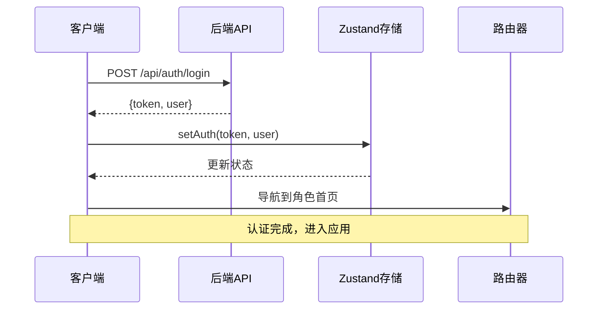
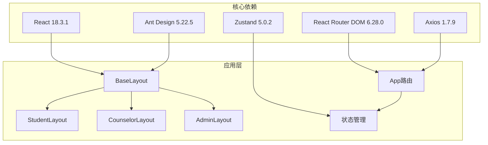

# 布局组件设计

<cite>
**本文档引用的文件**
- [BaseLayout.jsx](file://frontend/src/layouts/BaseLayout.jsx)
- [AdminLayout.jsx](file://frontend/src/layouts/AdminLayout.jsx)
- [CounselorLayout.jsx](file://frontend/src/layouts/CounselorLayout.jsx)
- [StudentLayout.jsx](file://frontend/src/layouts/StudentLayout.jsx)
- [App.jsx](file://frontend/src/App.jsx)
- [main.jsx](file://frontend/src/main.jsx)
- [store.js](file://frontend/src/store.js)
- [api.js](file://frontend/src/api.js)
- [Login.jsx](file://frontend/src/pages/Login.jsx)
- [Home.jsx](file://frontend/src/pages/student/Home.jsx)
- [Dashboard.jsx](file://frontend/src/pages/admin/Dashboard.jsx)
- [Students.jsx](file://frontend/src/pages/counselor/Students.jsx)
- [styles.css](file://frontend/src/styles.css)
- [package.json](file://frontend/package.json)
</cite>

## 目录
1. [引言](#引言)
2. [项目结构](#项目结构)
3. [核心组件](#核心组件)
4. [架构概览](#架构概览)
5. [详细组件分析](#详细组件分析)
6. [依赖关系分析](#依赖关系分析)
7. [性能考虑](#性能考虑)
8. [故障排除指南](#故障排除指南)
9. [结论](#结论)
10. [附录](#附录)

## 引言

奖学金管理系统采用基于React和Ant Design的现代化前端架构，通过精心设计的布局组件体系实现了多角色用户界面的一致性和可维护性。该系统支持学生、辅导员和管理员三种角色，每个角色都有专门的布局组件，同时共享一个基础布局组件来确保用户体验的统一性。

系统的核心设计理念是"差异化功能 + 统一外观"，通过BaseLayout提供通用的导航、侧边栏和头部区域，各角色布局组件专注于特定的功能需求和权限控制。这种设计既保证了代码的复用性，又满足了不同角色用户的特殊需求。

## 项目结构

前端项目采用模块化的文件组织方式，布局组件位于`src/layouts/`目录下，页面组件位于`src/pages/`目录下，全局状态管理位于`src/store.js`，路由配置在`src/App.jsx`中集中管理。



**图表来源**
- [main.jsx:10-18](file://frontend/src/main.jsx#L10-L18)
- [App.jsx:43-82](file://frontend/src/App.jsx#L43-L82)
- [BaseLayout.jsx:8-66](file://frontend/src/layouts/BaseLayout.jsx#L8-L66)

**章节来源**
- [main.jsx:1-19](file://frontend/src/main.jsx#L1-L19)
- [App.jsx:1-83](file://frontend/src/App.jsx#L1-L83)

## 核心组件

### BaseLayout基础布局组件

BaseLayout是整个系统的核心布局组件，它提供了统一的页面框架结构，包括侧边栏导航、头部区域和内容区域。该组件通过props接收菜单配置、基础路径和标题信息，实现了高度的可配置性。

#### 主要功能特性

1. **响应式布局设计**：采用Ant Design的Layout组件，支持灵活的布局组合和响应式适配
2. **动态菜单渲染**：根据传入的menuItems动态生成侧边栏菜单
3. **用户状态管理**：集成了用户信息显示和登出功能
4. **初始密码提示**：自动检测并提示用户更换初始密码

#### 关键实现细节

- **侧边栏宽度**：固定220px宽度，确保菜单项的完整显示
- **头部区域**：包含页面标题和用户信息下拉菜单
- **内容区域**：通过Outlet组件承载子路由内容
- **选中状态管理**：根据当前路径自动高亮对应的菜单项

**章节来源**
- [BaseLayout.jsx:8-66](file://frontend/src/layouts/BaseLayout.jsx#L8-L66)

### 角色专用布局组件

#### StudentLayout学生布局

学生布局专注于学生日常操作的便捷性，菜单项涵盖了从基本信息查询到各类奖学金申请的完整流程。

主要功能包括：
- 个人主页展示学生基本信息和测评结果
- 基本项测评和综合能力测评的在线填报
- 奖学金项目的申请和状态跟踪
- 个人申请记录的查询和申诉功能

#### CounselorLayout辅导员布局

辅导员布局面向教学管理场景，重点提供学生管理和审核功能。

核心功能：
- 学生信息管理和综测进度跟踪
- 材料审核和申请审批流程
- 品德评议功能
- 批量数据处理和统计分析

#### AdminLayout管理员布局

管理员布局提供系统管理功能，涵盖整个奖学金评选流程的管控。

关键功能：
- 统计看板和系统概览
- 学年管理和奖学金项目配置
- 综测排名计算和发布
- 数据导入和学生代表管理

**章节来源**
- [StudentLayout.jsx:1-17](file://frontend/src/layouts/StudentLayout.jsx#L1-L17)
- [CounselorLayout.jsx:1-14](file://frontend/src/layouts/CounselorLayout.jsx#L1-L14)
- [AdminLayout.jsx:1-16](file://frontend/src/layouts/AdminLayout.jsx#L1-L16)

## 架构概览

系统采用分层架构设计，通过路由守卫实现权限控制，通过状态管理实现用户认证信息的持久化存储。



**图表来源**
- [Login.jsx:22-34](file://frontend/src/pages/Login.jsx#L22-L34)
- [store.js:4-14](file://frontend/src/store.js#L4-L14)
- [App.jsx:27-41](file://frontend/src/App.jsx#L27-L41)

**章节来源**
- [App.jsx:27-41](file://frontend/src/App.jsx#L27-L41)
- [store.js:1-15](file://frontend/src/store.js#L1-L15)

## 详细组件分析

### 路由系统集成

系统通过React Router实现嵌套路由，每个角色都有独立的路由配置和权限控制。

```mermaid
graph LR
subgraph "路由层次结构"
A[/] --> B[Protected组件]
B --> C[StudentLayout]
B --> D[CounselorLayout]
B --> E[AdminLayout]
C --> F[/student]
F --> G[Home]
F --> H[BasicEvaluation]
F --> I[AbilityEvaluation]
F --> J[Scholarships]
F --> K[Applications]
F --> L[GraduateExam]
F --> M[Appeal]
D --> N[/counselor]
N --> O[Students]
N --> P[Review]
N --> Q[Applications]
N --> R[Appraisal]
E --> S[/admin]
S --> T[Dashboard]
S --> U[Years]
S --> V[Projects]
S --> W[Ranking]
S --> X[Import]
S --> Y[Representatives]
end
```

**图表来源**
- [App.jsx:49-76](file://frontend/src/App.jsx#L49-L76)

#### 权限控制机制

系统实现了严格的权限控制，通过Protected组件确保只有认证且具有正确角色的用户才能访问相应功能。



**图表来源**
- [App.jsx:27-41](file://frontend/src/App.jsx#L27-L41)

**章节来源**
- [App.jsx:1-83](file://frontend/src/App.jsx#L1-L83)

### 状态管理与认证

系统使用Zustand实现轻量级的状态管理，通过持久化中间件确保用户登录状态在页面刷新后仍然保持。

#### 认证流程



**图表来源**
- [Login.jsx:22-34](file://frontend/src/pages/Login.jsx#L22-L34)
- [store.js:6-10](file://frontend/src/store.js#L6-L10)

**章节来源**
- [store.js:1-15](file://frontend/src/store.js#L1-L15)
- [api.js:10-16](file://frontend/src/api.js#L10-L16)

### 响应式设计原则

系统遵循移动优先的设计原则，通过Ant Design的响应式组件和CSS媒体查询实现跨设备兼容。

#### 设计要点

1. **断点策略**：针对不同屏幕尺寸提供优化的布局
2. **字体缩放**：确保在小屏幕上文字的可读性
3. **间距调整**：根据屏幕尺寸动态调整元素间距
4. **菜单适配**：在移动端提供更好的导航体验

**章节来源**
- [styles.css:1-21](file://frontend/src/styles.css#L1-L21)

## 依赖关系分析

系统依赖关系清晰，主要依赖包括React生态系统、Ant Design组件库和状态管理工具。



**图表来源**
- [package.json:11-20](file://frontend/package.json#L11-L20)

**章节来源**
- [package.json:1-26](file://frontend/package.json#L1-L26)

## 性能考虑

### 代码分割与懒加载

系统通过React.lazy和Suspense实现组件的按需加载，减少初始包体积。

### 状态优化

- 使用Zustand替代Redux，减少不必要的状态更新
- 通过persist中间件实现状态持久化，避免重复登录
- 合理的状态拆分，避免全局状态污染

### 图标优化

Ant Design图标采用按需引入的方式，只打包使用的图标组件。

## 故障排除指南

### 常见问题及解决方案

1. **登录后无法跳转到对应角色页面**
   - 检查后端返回的用户角色信息
   - 确认路由配置中的角色映射

2. **菜单项不显示或显示异常**
   - 验证menuItems数组的格式
   - 检查路由路径的正确性

3. **页面空白或布局错乱**
   - 检查Ant Design版本兼容性
   - 验证CSS样式的正确加载

4. **认证状态丢失**
   - 确认localStorage的可用性
   - 检查persist配置的存储键名

**章节来源**
- [api.js:18-41](file://frontend/src/api.js#L18-L41)
- [Login.jsx:22-34](file://frontend/src/pages/Login.jsx#L22-L34)

## 结论

奖学金管理系统的布局组件设计体现了现代前端开发的最佳实践，通过合理的架构分离和组件化设计，实现了功能的模块化和代码的高复用性。BaseLayout作为核心组件，成功地将通用功能抽象出来，而各角色布局组件则专注于特定业务场景的需求。

该设计的优势在于：
- **可维护性**：清晰的组件层次结构便于维护和扩展
- **可扩展性**：新的角色或功能可以通过继承现有模式快速添加
- **用户体验**：统一的视觉设计和交互模式提升用户满意度
- **技术栈成熟**：基于React和Ant Design的稳定技术栈

未来可以考虑的改进方向包括：
- 添加更多的主题定制选项
- 实现更细粒度的权限控制
- 增强移动端的交互体验
- 优化首屏加载性能

## 附录

### 主题定制方案

系统支持通过Ant Design的ConfigProvider进行主题定制，包括主色调、字体、间距等参数的全局配置。

### 插槽扩展

虽然当前实现没有使用React插槽模式，但可以在BaseLayout中添加插槽属性来支持内容区域的自定义扩展。

### 样式覆盖

通过CSS变量和Ant Design的主题系统，可以实现样式的局部覆盖而不影响全局主题。