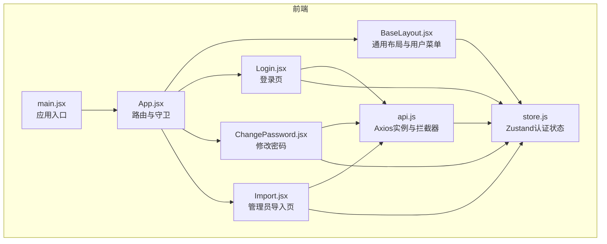
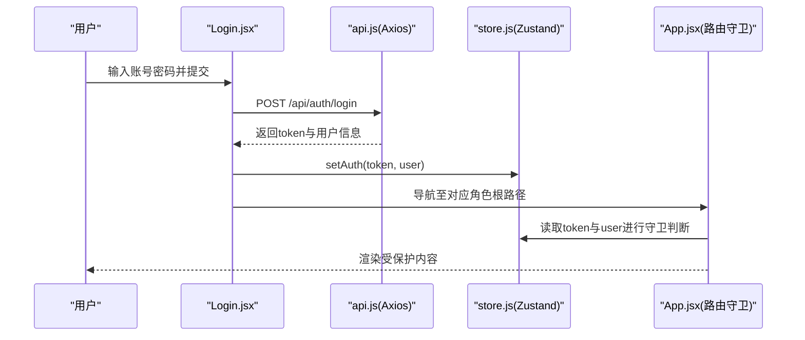
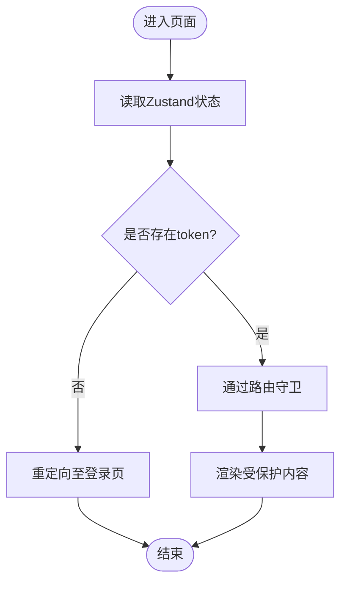
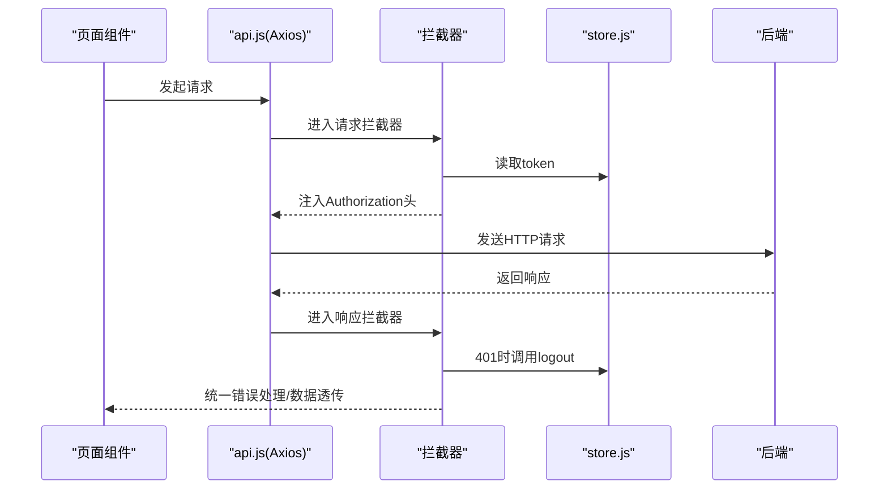
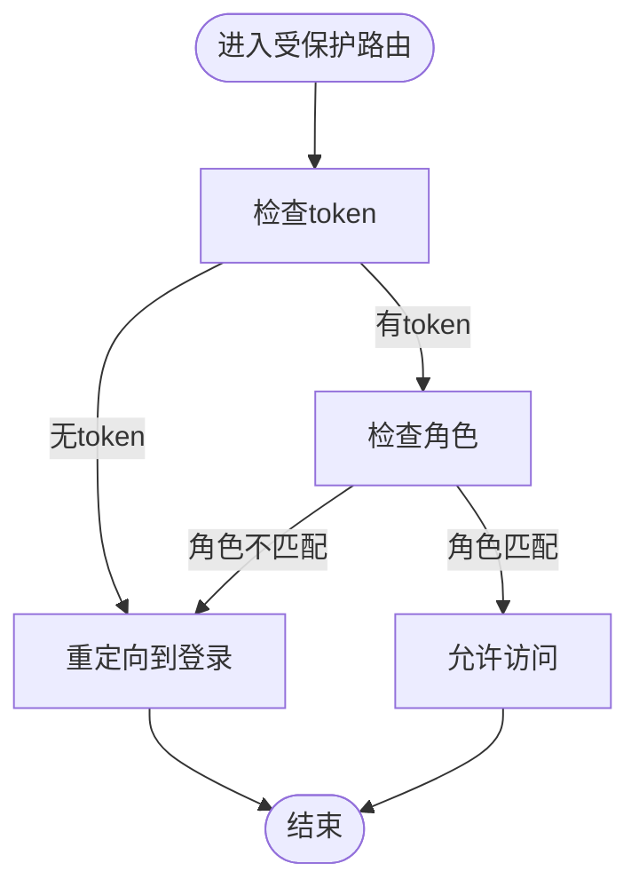
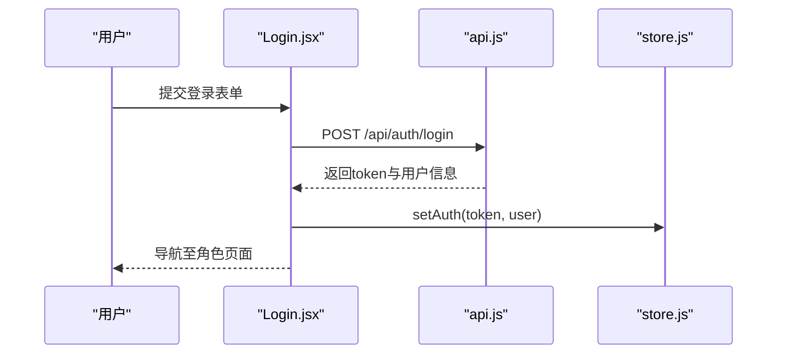
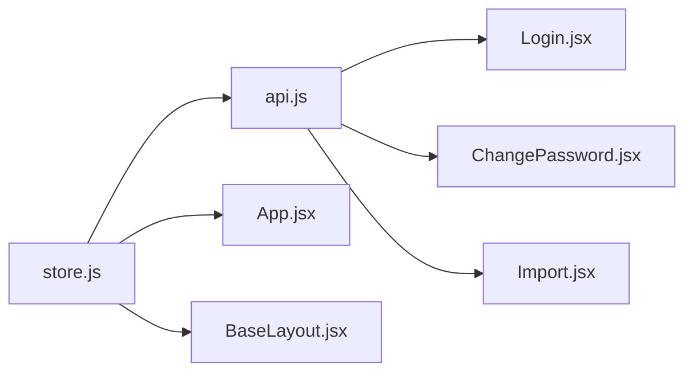

# 状态管理架构

<cite>
**本文引用的文件**
- [store.js](file://frontend/src/store.js)
- [api.js](file://frontend/src/api.js)
- [App.jsx](file://frontend/src/App.jsx)
- [BaseLayout.jsx](file://frontend/src/layouts/BaseLayout.jsx)
- [Login.jsx](file://frontend/src/pages/Login.jsx)
- [ChangePassword.jsx](file://frontend/src/pages/ChangePassword.jsx)
- [Import.jsx](file://frontend/src/pages/admin/Import.jsx)
- [main.jsx](file://frontend/src/main.jsx)
- [package.json](file://frontend/package.json)
- [README.md](file://README.md)
</cite>

## 目录
1. [引言](#引言)
2. [项目结构](#项目结构)
3. [核心组件](#核心组件)
4. [架构总览](#架构总览)
5. [详细组件分析](#详细组件分析)
6. [依赖关系分析](#依赖关系分析)
7. [性能考量](#性能考量)
8. [故障排查指南](#故障排查指南)
9. [结论](#结论)
10. [附录](#附录)

## 引言
本文件系统化梳理奖学金管理系统前端的状态管理架构，聚焦于Zustand在本项目中的使用策略与设计模式。当前系统采用Zustand作为轻量级全局状态容器，结合Axios拦截器实现认证态注入与统一错误处理，并通过路由守卫与布局组件实现基于角色的访问控制。本文将从全局状态设计原则、分层设计（用户态/应用态/业务态）、持久化策略、与API集成、最佳实践、性能优化与调试工具等方面进行深入解析。

## 项目结构
前端采用React + Vite + Ant Design技术栈，状态管理集中在store.js中，API封装在api.js中，路由与守卫在App.jsx中实现，基础布局在BaseLayout.jsx中实现。入口文件main.jsx负责初始化国际化、主题与路由环境。

**图表来源**
- [main.jsx:1-19](file://frontend/src/main.jsx#L1-L19)
- [App.jsx:1-83](file://frontend/src/App.jsx#L1-L83)
- [store.js:1-15](file://frontend/src/store.js#L1-L15)
- [api.js:1-44](file://frontend/src/api.js#L1-L44)
- [BaseLayout.jsx:1-66](file://frontend/src/layouts/BaseLayout.jsx#L1-L66)
- [Login.jsx:1-76](file://frontend/src/pages/Login.jsx#L1-L76)
- [ChangePassword.jsx:1-35](file://frontend/src/pages/ChangePassword.jsx#L1-L35)
- [Import.jsx:1-203](file://frontend/src/pages/admin/Import.jsx#L1-L203)

**章节来源**
- [main.jsx:1-19](file://frontend/src/main.jsx#L1-L19)
- [README.md:123-154](file://README.md#L123-L154)

## 核心组件
- Zustand认证状态存储
  - 提供token与user字段，setAuth用于设置认证态，logout用于清除认证态
  - 使用persist中间件持久化到本地存储，键名为“scholarship-auth”
- Axios实例与拦截器
  - 请求拦截：从Zustand读取token并注入Authorization头
  - 响应拦截：统一处理业务响应码、401登出、错误提示与拒绝Promise
- 路由守卫与角色控制
  - Protected组件：未登录或角色不符则重定向至登录
  - RootRedirect：根据用户角色重定向至对应根路径
- 布局与用户菜单
  - BaseLayout：展示用户信息、修改密码与退出登录
- 登录与修改密码
  - Login：调用/api/auth/login，成功后写入认证态并导航
  - ChangePassword：调用/api/auth/change-password，成功后更新认证态中的密码状态

**章节来源**
- [store.js:4-14](file://frontend/src/store.js#L4-L14)
- [api.js:5-41](file://frontend/src/api.js#L5-L41)
- [App.jsx:27-41](file://frontend/src/App.jsx#L27-L41)
- [BaseLayout.jsx:8-21](file://frontend/src/layouts/BaseLayout.jsx#L8-L21)
- [Login.jsx:16-34](file://frontend/src/pages/Login.jsx#L16-L34)
- [ChangePassword.jsx:5-16](file://frontend/src/pages/ChangePassword.jsx#L5-L16)

## 架构总览
下图展示了状态管理在系统中的位置与交互：Zustand认证状态被Axios拦截器读取以注入JWT，路由守卫与布局组件消费认证状态实现访问控制与用户操作，页面组件通过API模块发起REST请求并更新状态。

**图表来源**
- [Login.jsx:22-34](file://frontend/src/pages/Login.jsx#L22-L34)
- [api.js:10-16](file://frontend/src/api.js#L10-L16)
- [store.js:6-10](file://frontend/src/store.js#L6-L10)
- [App.jsx:27-41](file://frontend/src/App.jsx#L27-L41)

## 详细组件分析

### 认证状态存储（Zustand）
- 设计原则
  - 最小化状态：仅保存token与user，避免冗余
  - 易于序列化：token与user均为可序列化数据
  - 持久化：使用persist中间件，键名“scholarship-auth”，重启后仍保持登录态
- 更新策略
  - setAuth：一次性设置token与user
  - logout：清空token与user，配合401拦截器实现登出
- 订阅与使用
  - 页面组件通过useAuthStore(selector)订阅所需字段，减少重渲染
  - 布局组件同时订阅user与logout，实现用户信息展示与退出登录

**图表来源**
- [App.jsx:27-41](file://frontend/src/App.jsx#L27-L41)
- [store.js:6-10](file://frontend/src/store.js#L6-L10)

**章节来源**
- [store.js:4-14](file://frontend/src/store.js#L4-L14)
- [App.jsx:27-41](file://frontend/src/App.jsx#L27-L41)

### Axios拦截器与认证态注入
- 请求拦截
  - 在请求发送前从Zustand读取token并注入Authorization头
- 响应拦截
  - 业务响应码：当code为0返回data.data；非0统一错误提示并拒绝Promise
  - 401处理：调用Zustand的logout，提示“登录已过期”，跳转登录页
  - 网络错误：提取响应或消息文本，统一提示并拒绝Promise

**图表来源**
- [api.js:10-41](file://frontend/src/api.js#L10-L41)
- [store.js:6-10](file://frontend/src/store.js#L6-L10)

**章节来源**
- [api.js:5-41](file://frontend/src/api.js#L5-L41)

### 路由守卫与角色控制
- Protected组件
  - 未登录：重定向至“/login”
  - 角色不符：重定向至“/login”
  - 符合条件：渲染子组件
- RootRedirect组件
  - 根据用户角色重定向至“/student”、“/counselor”或“/admin”

**图表来源**
- [App.jsx:27-41](file://frontend/src/App.jsx#L27-L41)

**章节来源**
- [App.jsx:27-41](file://frontend/src/App.jsx#L27-L41)

### 布局与用户菜单
- BaseLayout
  - 展示用户信息（姓名与账号）
  - 提供“修改密码”与“退出登录”菜单项
  - 退出登录时调用store的logout并导航至登录页

**章节来源**
- [BaseLayout.jsx:8-21](file://frontend/src/layouts/BaseLayout.jsx#L8-L21)

### 登录与修改密码流程
- 登录
  - 表单提交后调用/api/auth/login
  - 成功后通过setAuth写入token与user，并按角色导航
- 修改密码
  - 调用/api/auth/change-password
  - 成功后通过setAuth更新认证态中的密码状态

**图表来源**
- [Login.jsx:22-34](file://frontend/src/pages/Login.jsx#L22-L34)
- [store.js:6-10](file://frontend/src/store.js#L6-L10)

**章节来源**
- [Login.jsx:16-34](file://frontend/src/pages/Login.jsx#L16-L34)
- [ChangePassword.jsx:5-16](file://frontend/src/pages/ChangePassword.jsx#L5-L16)

### 管理员导入功能中的状态使用
- Import.jsx
  - 通过useAuthStore.getState().token获取token用于直接下载模板等场景
  - 通过api模块发起导入请求并更新本地结果状态

**章节来源**
- [Import.jsx:9-23](file://frontend/src/pages/admin/Import.jsx#L9-L23)
- [Import.jsx:25-38](file://frontend/src/pages/admin/Import.jsx#L25-L38)

## 依赖关系分析
- Zustand版本与依赖
  - package.json声明依赖zustand^5.0.2
- 状态与API耦合
  - api.js依赖store.js读取token
  - 页面组件依赖store.js与api.js
- 路由与布局
  - App.jsx依赖store.js实现守卫
  - BaseLayout.jsx依赖store.js实现用户菜单

**图表来源**
- [package.json:19](file://frontend/package.json#L19)
- [store.js:1-15](file://frontend/src/store.js#L1-L15)
- [api.js:1-44](file://frontend/src/api.js#L1-L44)
- [App.jsx:1-83](file://frontend/src/App.jsx#L1-L83)
- [BaseLayout.jsx:1-66](file://frontend/src/layouts/BaseLayout.jsx#L1-L66)
- [Login.jsx:1-76](file://frontend/src/pages/Login.jsx#L1-L76)
- [ChangePassword.jsx:1-35](file://frontend/src/pages/ChangePassword.jsx#L1-L35)
- [Import.jsx:1-203](file://frontend/src/pages/admin/Import.jsx#L1-L203)

**章节来源**
- [package.json:11-25](file://frontend/package.json#L11-L25)

## 性能考量
- 状态订阅粒度
  - 使用selector仅订阅必要字段，降低重渲染频率
- 拦截器统一处理
  - 减少页面重复逻辑，提升一致性与可维护性
- 持久化策略
  - 使用persist中间件减少重复登录成本，但需注意存储大小与清理策略
- 并发与批处理
  - 对于批量导入等场景，建议在页面层进行并发控制与进度反馈

[本节为通用指导，无需特定文件引用]

## 故障排查指南
- 登录后立即跳转登录页
  - 检查响应拦截器是否正确识别401并调用logout
  - 确认store.js中persist中间件正常工作
- Token未注入导致接口401
  - 检查请求拦截器是否从store读取token并注入Authorization头
- 修改密码后状态未更新
  - 确认setAuth调用是否更新了认证态中的密码状态字段
- 导入功能下载失败
  - 检查useAuthStore.getState().token是否为空
  - 确认后端模板下载接口鉴权逻辑

**章节来源**
- [api.js:18-41](file://frontend/src/api.js#L18-L41)
- [store.js:6-10](file://frontend/src/store.js#L6-L10)
- [ChangePassword.jsx:10-16](file://frontend/src/pages/ChangePassword.jsx#L10-L16)
- [Import.jsx:25-38](file://frontend/src/pages/admin/Import.jsx#L25-L38)

## 结论
本系统采用Zustand实现轻量级认证状态管理，结合Axios拦截器实现统一认证与错误处理，通过路由守卫与布局组件实现基于角色的访问控制。整体设计遵循最小状态、持久化、细粒度订阅与统一拦截的原则，满足奖学金管理系统的认证与权限需求。后续可在业务态与应用态扩展更多store模块，以支持更复杂的业务场景与数据缓存策略。

[本节为总结，无需特定文件引用]

## 附录
- 技术栈与版本
  - React 18、Vite 5、Ant Design 5、Zustand 5、Axios 1.x
- 关键API概览
  - 登录：POST /api/auth/login
  - 获取当前用户：GET /api/auth/me
  - 修改密码：POST /api/auth/change-password
  - 管理员导入：POST /api/admin/import/*
- 演示账号与运行说明
  - 参考项目README中的演示账号与一键运行说明

**章节来源**
- [README.md:8-200](file://README.md#L8-L200)