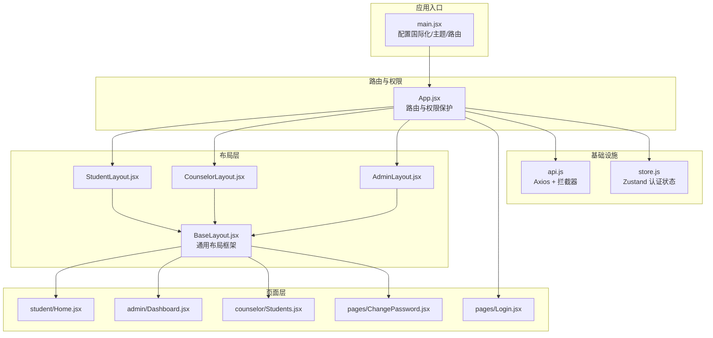
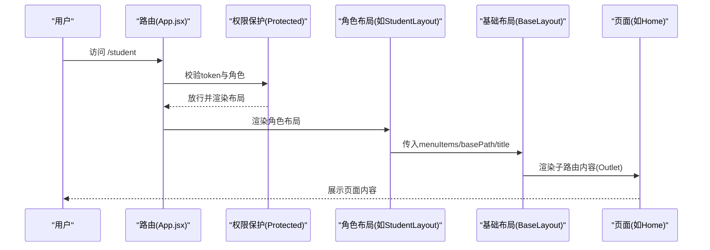
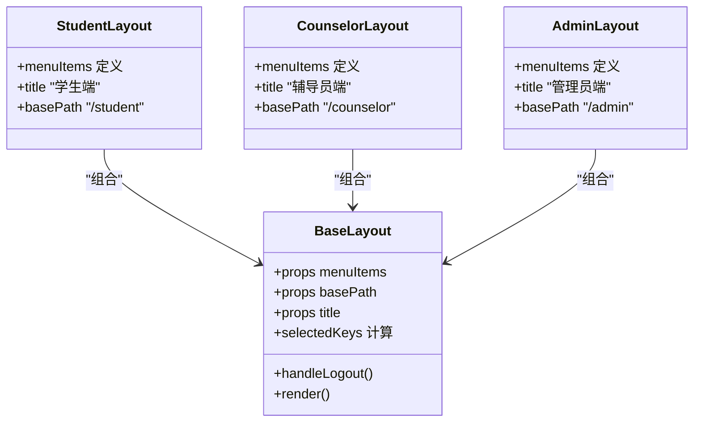
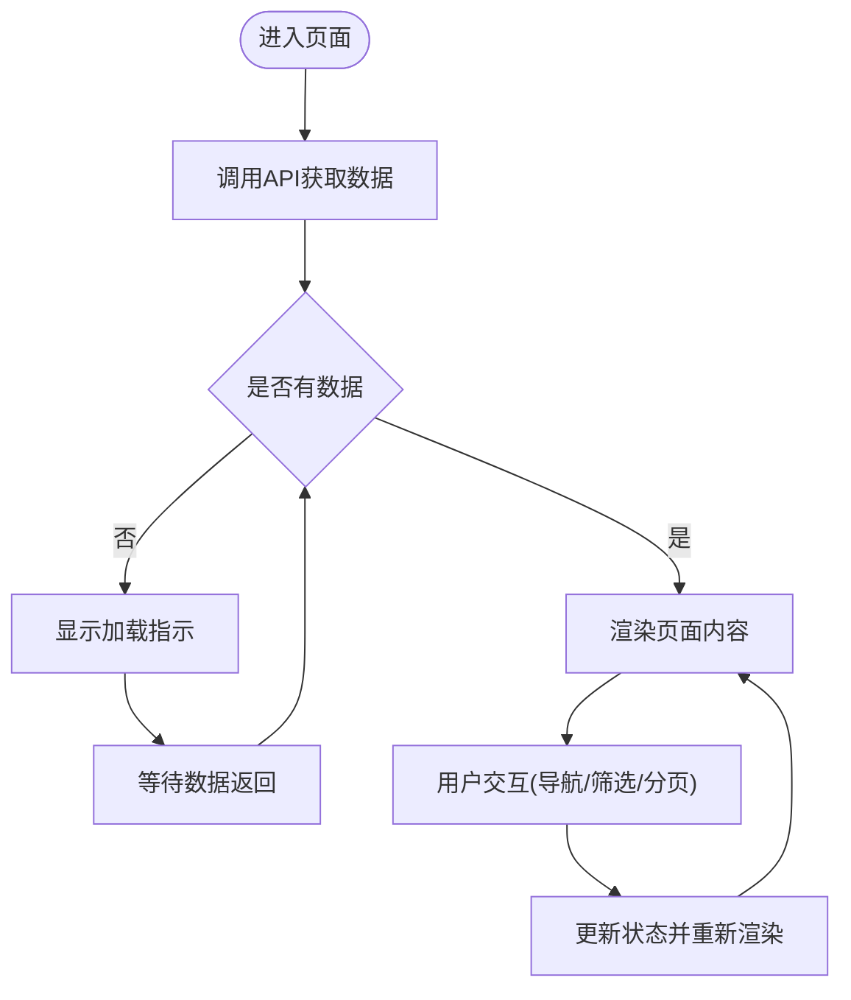
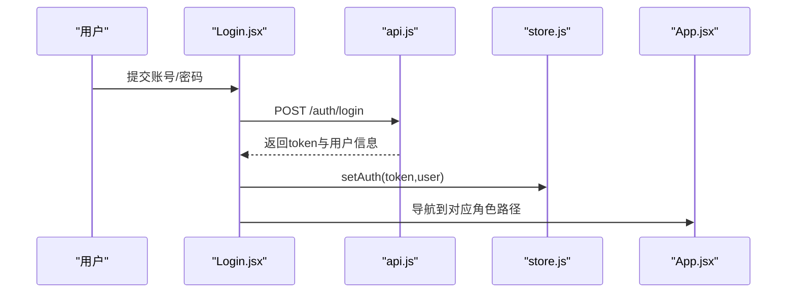
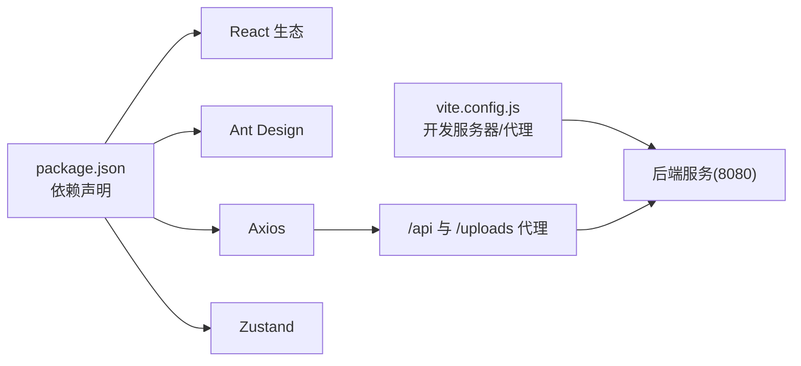

# 组件架构设计

<cite>
**本文引用的文件**
- [App.jsx](file://frontend/src/App.jsx)
- [main.jsx](file://frontend/src/main.jsx)
- [BaseLayout.jsx](file://frontend/src/layouts/BaseLayout.jsx)
- [StudentLayout.jsx](file://frontend/src/layouts/StudentLayout.jsx)
- [CounselorLayout.jsx](file://frontend/src/layouts/CounselorLayout.jsx)
- [AdminLayout.jsx](file://frontend/src/layouts/AdminLayout.jsx)
- [store.js](file://frontend/src/store.js)
- [api.js](file://frontend/src/api.js)
- [Home.jsx](file://frontend/src/pages/student/Home.jsx)
- [Dashboard.jsx](file://frontend/src/pages/admin/Dashboard.jsx)
- [Students.jsx](file://frontend/src/pages/counselor/Students.jsx)
- [Login.jsx](file://frontend/src/pages/Login.jsx)
- [ChangePassword.jsx](file://frontend/src/pages/ChangePassword.jsx)
- [package.json](file://frontend/package.json)
- [vite.config.js](file://frontend/vite.config.js)
</cite>

## 目录
1. [引言](#引言)
2. [项目结构](#项目结构)
3. [核心组件](#核心组件)
4. [架构总览](#架构总览)
5. [详细组件分析](#详细组件分析)
6. [依赖分析](#依赖分析)
7. [性能考虑](#性能考虑)
8. [故障排查指南](#故障排查指南)
9. [结论](#结论)
10. [附录](#附录)

## 引言
本文件面向奖学金管理系统的前端React组件架构，系统性阐述组件层次结构、设计模式与职责分离原则，重点解析基础布局组件BaseLayout与各角色专用布局(StudentLayout、CounselorLayout、AdminLayout)的差异化实现，以及页面组件与功能组件的边界划分。同时，文档覆盖组件间通信机制（props传递、状态提升、事件冒泡）、组件复用策略（高阶组件HOC、Render Props）、生命周期管理与性能优化（memoization、懒加载、条件渲染），并提供测试策略与调试技巧。

## 项目结构
前端采用“路由驱动 + 布局分层”的组织方式：
- 应用入口在main.jsx中配置国际化、主题与路由容器，随后渲染App.jsx。
- App.jsx集中声明路由与权限保护，按角色嵌套对应布局组件。
- 布局层位于layouts目录，提供通用的侧边菜单、头部用户信息与内容区Outlet。
- 页面层位于pages目录，按角色划分子目录，承载具体业务逻辑。
- store.js与api.js分别负责全局状态与HTTP通信拦截。

图表来源
- [main.jsx:10-18](file://frontend/src/main.jsx#L10-L18)
- [App.jsx:43-82](file://frontend/src/App.jsx#L43-L82)
- [BaseLayout.jsx:8-65](file://frontend/src/layouts/BaseLayout.jsx#L8-L65)
- [StudentLayout.jsx:14-16](file://frontend/src/layouts/StudentLayout.jsx#L14-L16)
- [CounselorLayout.jsx:11-13](file://frontend/src/layouts/CounselorLayout.jsx#L11-L13)
- [AdminLayout.jsx:13-15](file://frontend/src/layouts/AdminLayout.jsx#L13-L15)
- [Home.jsx:6-97](file://frontend/src/pages/student/Home.jsx#L6-L97)
- [Dashboard.jsx:6-34](file://frontend/src/pages/admin/Dashboard.jsx#L6-L34)
- [Students.jsx:12-110](file://frontend/src/pages/counselor/Students.jsx#L12-L110)
- [Login.jsx:16-75](file://frontend/src/pages/Login.jsx#L16-L75)
- [ChangePassword.jsx:5-34](file://frontend/src/pages/ChangePassword.jsx#L5-L34)
- [store.js:4-14](file://frontend/src/store.js#L4-L14)
- [api.js:5-41](file://frontend/src/api.js#L5-L41)

章节来源
- [main.jsx:10-18](file://frontend/src/main.jsx#L10-L18)
- [App.jsx:43-82](file://frontend/src/App.jsx#L43-L82)
- [package.json:11-19](file://frontend/package.json#L11-L19)

## 核心组件
- 基础布局BaseLayout：提供Sider菜单、Header用户信息、Content Outlet与通用导航逻辑，接收menuItems、basePath、title等props，实现跨角色复用。
- 角色布局：StudentLayout、CounselorLayout、AdminLayout分别定义各角色的菜单项与标题，通过组合BaseLayout实现差异化展示。
- 页面组件：Home、Dashboard、Students等承担具体业务逻辑，负责数据拉取、状态管理与UI渲染。
- 权限与路由：App.jsx中的Protected与RootRedirect实现基于角色的路由守卫与默认跳转。
- 状态与通信：store.js提供Zustand认证状态，api.js提供Axios实例与请求/响应拦截器。

章节来源
- [BaseLayout.jsx:8-65](file://frontend/src/layouts/BaseLayout.jsx#L8-L65)
- [StudentLayout.jsx:4-16](file://frontend/src/layouts/StudentLayout.jsx#L4-L16)
- [CounselorLayout.jsx:4-13](file://frontend/src/layouts/CounselorLayout.jsx#L4-L13)
- [AdminLayout.jsx:4-15](file://frontend/src/layouts/AdminLayout.jsx#L4-L15)
- [App.jsx:27-41](file://frontend/src/App.jsx#L27-L41)
- [store.js:4-14](file://frontend/src/store.js#L4-L14)
- [api.js:5-41](file://frontend/src/api.js#L5-L41)

## 架构总览
系统采用“布局组件 + 页面组件”的分层架构，配合路由与权限控制，形成清晰的职责边界：
- 布局组件：负责页面框架、导航与用户交互（头像下拉、修改密码、退出登录）。
- 页面组件：负责业务数据获取、状态更新与视图渲染。
- 功能组件：Ant Design提供的卡片、表格、表单等，用于构建页面UI。
- 通信机制：props向下传递、状态通过Zustand提升、事件通过回调向上冒泡或通过store触发。

图表来源
- [App.jsx:49-58](file://frontend/src/App.jsx#L49-L58)
- [App.jsx:27-32](file://frontend/src/App.jsx#L27-L32)
- [StudentLayout.jsx:14-16](file://frontend/src/layouts/StudentLayout.jsx#L14-L16)
- [BaseLayout.jsx:27-64](file://frontend/src/layouts/BaseLayout.jsx#L27-L64)
- [Home.jsx:6-97](file://frontend/src/pages/student/Home.jsx#L6-L97)

## 详细组件分析

### 布局组件体系
- BaseLayout：接收menuItems、basePath、title，内部维护选中菜单计算、用户下拉菜单（修改密码/退出登录）、顶部提示（初始密码提醒）与Outlet占位。
- StudentLayout/CounselorLayout/AdminLayout：仅定义菜单项与标题，通过组合BaseLayout实现差异化导航。
- 通信机制：props向下传递菜单配置；用户操作通过回调触发导航或登出；状态通过useAuthStore提升至全局。

图表来源
- [BaseLayout.jsx:8-65](file://frontend/src/layouts/BaseLayout.jsx#L8-L65)
- [StudentLayout.jsx:4-16](file://frontend/src/layouts/StudentLayout.jsx#L4-L16)
- [CounselorLayout.jsx:4-13](file://frontend/src/layouts/CounselorLayout.jsx#L4-L13)
- [AdminLayout.jsx:4-15](file://frontend/src/layouts/AdminLayout.jsx#L4-L15)

章节来源
- [BaseLayout.jsx:8-65](file://frontend/src/layouts/BaseLayout.jsx#L8-L65)
- [StudentLayout.jsx:4-16](file://frontend/src/layouts/StudentLayout.jsx#L4-L16)
- [CounselorLayout.jsx:4-13](file://frontend/src/layouts/CounselorLayout.jsx#L4-L13)
- [AdminLayout.jsx:4-15](file://frontend/src/layouts/AdminLayout.jsx#L4-L15)

### 页面组件职责分离
- 学生首页Home：负责个人信息展示、测评分数统计与导航按钮，使用useEffect加载数据，条件渲染加载态与数据。
- 管理员仪表盘Dashboard：负责统计数据聚合与可视化展示，使用useEffect在挂载时拉取后台统计。
- 辅导员学生列表Students：负责筛选、排序、分页与表格渲染，使用本地状态管理筛选条件与分页参数。

图表来源
- [Home.jsx:11-15](file://frontend/src/pages/student/Home.jsx#L11-L15)
- [Dashboard.jsx:9-9](file://frontend/src/pages/admin/Dashboard.jsx#L9-L9)
- [Students.jsx:17-22](file://frontend/src/pages/counselor/Students.jsx#L17-L22)

章节来源
- [Home.jsx:6-97](file://frontend/src/pages/student/Home.jsx#L6-L97)
- [Dashboard.jsx:6-34](file://frontend/src/pages/admin/Dashboard.jsx#L6-L34)
- [Students.jsx:12-110](file://frontend/src/pages/counselor/Students.jsx#L12-L110)

### 权限与路由保护
- Protected：校验token与角色，未登录或角色不符则重定向到登录页。
- RootRedirect：根据用户角色进行根路径重定向，避免未登录访问。
- 登录流程：Login.jsx提交凭据，成功后写入store并跳转对应角色首页。

图表来源
- [Login.jsx:22-34](file://frontend/src/pages/Login.jsx#L22-L34)
- [api.js:20-35](file://frontend/src/api.js#L20-L35)
- [store.js:6-11](file://frontend/src/store.js#L6-L11)
- [App.jsx:34-41](file://frontend/src/App.jsx#L34-L41)

章节来源
- [App.jsx:27-41](file://frontend/src/App.jsx#L27-L41)
- [Login.jsx:16-75](file://frontend/src/pages/Login.jsx#L16-L75)
- [store.js:4-14](file://frontend/src/store.js#L4-L14)
- [api.js:5-41](file://frontend/src/api.js#L5-L41)

### 组件复用策略与设计模式
- 组合优于继承：通过BaseLayout + 角色布局的组合实现差异化菜单与标题，避免重复代码。
- Render Props：BaseLayout以props形式接收menuItems，实现菜单项的动态注入，体现Render Props思想。
- HOC：可扩展地封装Protected逻辑，作为高阶组件包装任意需要权限保护的布局或页面。
- Hook复用：useAuthStore与useNavigate在多个组件中被复用，减少重复逻辑。

章节来源
- [BaseLayout.jsx:8-65](file://frontend/src/layouts/BaseLayout.jsx#L8-L65)
- [StudentLayout.jsx:14-16](file://frontend/src/layouts/StudentLayout.jsx#L14-L16)
- [CounselorLayout.jsx:11-13](file://frontend/src/layouts/CounselorLayout.jsx#L11-L13)
- [AdminLayout.jsx:13-15](file://frontend/src/layouts/AdminLayout.jsx#L13-L15)
- [App.jsx:27-32](file://frontend/src/App.jsx#L27-L32)

### 生命周期管理与性能优化
- 生命周期：页面组件普遍使用useEffect进行数据拉取与副作用管理；BaseLayout在渲染时计算选中菜单与处理用户操作。
- 性能优化：
  - 条件渲染：在数据未就绪时显示加载指示，避免空渲染。
  - 状态提升：用户信息与认证状态集中在store，避免多处重复请求。
  - 懒加载：可通过React.lazy与Suspense对大型页面进行按需加载（建议在现有路由基础上扩展）。
  - 表格性能：Students.jsx中使用小尺寸列与固定宽度，结合scroll横向滚动，减少重排。

章节来源
- [Home.jsx:11-15](file://frontend/src/pages/student/Home.jsx#L11-L15)
- [Dashboard.jsx:9-9](file://frontend/src/pages/admin/Dashboard.jsx#L9-L9)
- [Students.jsx:94-107](file://frontend/src/pages/counselor/Students.jsx#L94-L107)
- [BaseLayout.jsx:23-25](file://frontend/src/layouts/BaseLayout.jsx#L23-L25)

### 组件测试策略与调试技巧
- 单元测试：针对纯函数（如numSorter）与工具方法编写测试，验证排序逻辑。
- 集成测试：使用React Testing Library或类似方案，模拟路由与store，验证Protected与布局渲染。
- 端到端测试：Cypress或Playwright，覆盖登录、角色跳转与页面渲染。
- 调试技巧：
  - 在api.js中拦截请求与响应，打印关键字段，定位接口问题。
  - 使用React DevTools追踪组件渲染次数与props变化，识别不必要的重渲染。
  - 在BaseLayout中临时输出current选中键，验证菜单高亮逻辑。

章节来源
- [api.js:10-41](file://frontend/src/api.js#L10-L41)
- [Students.jsx:7-10](file://frontend/src/pages/counselor/Students.jsx#L7-L10)

## 依赖分析
- React与生态：React、React Router DOM、Ant Design、Axios、Zustand。
- 开发工具：Vite提供开发服务器与代理，支持本地联调后端。
- 代理配置：/api与/uploads代理到后端服务，便于前后端联调。

图表来源
- [package.json:11-19](file://frontend/package.json#L11-L19)
- [vite.config.js:6-18](file://frontend/vite.config.js#L6-L18)

章节来源
- [package.json:11-19](file://frontend/package.json#L11-L19)
- [vite.config.js:6-18](file://frontend/vite.config.js#L6-L18)

## 性能考虑
- 渲染优化：优先使用条件渲染与骨架屏，避免大组件在无数据时渲染。
- 网络优化：统一在api.js中设置超时与拦截器，减少重复错误处理代码。
- 状态优化：store仅保存必要字段，避免深层对象频繁变更导致的重渲染。
- 路由优化：按需加载大型页面，降低首屏体积。

## 故障排查指南
- 登录失败：检查api.js请求拦截器是否正确附加Authorization头，确认后端返回的token与用户信息结构。
- 权限跳转异常：核对Protected与RootRedirect的判断逻辑，确保角色匹配。
- 数据为空：确认页面组件的useEffect是否正确调用API，检查响应拦截器对401的处理与store清理逻辑。
- 菜单高亮不正确：检查BaseLayout中current的计算逻辑与basePath一致性。

章节来源
- [api.js:10-41](file://frontend/src/api.js#L10-L41)
- [App.jsx:27-41](file://frontend/src/App.jsx#L27-L41)
- [BaseLayout.jsx:23-25](file://frontend/src/layouts/BaseLayout.jsx#L23-L25)

## 结论
该系统通过“基础布局 + 角色布局 + 页面组件”的分层架构实现了清晰的职责分离与良好的可复用性。配合Zustand与Axios的基础设施，以及基于路由的权限保护，形成了稳定、易维护的前端组件体系。后续可在现有基础上引入按需加载、更完善的单元测试与E2E测试，进一步提升开发效率与系统可靠性。

## 附录
- 关键实现位置参考：
  - 布局与路由：[BaseLayout.jsx:8-65](file://frontend/src/layouts/BaseLayout.jsx#L8-L65)、[App.jsx:43-82](file://frontend/src/App.jsx#L43-L82)
  - 页面组件：[Home.jsx:6-97](file://frontend/src/pages/student/Home.jsx#L6-L97)、[Dashboard.jsx:6-34](file://frontend/src/pages/admin/Dashboard.jsx#L6-L34)、[Students.jsx:12-110](file://frontend/src/pages/counselor/Students.jsx#L12-L110)
  - 状态与通信：[store.js:4-14](file://frontend/src/store.js#L4-L14)、[api.js:5-41](file://frontend/src/api.js#L5-L41)
  - 入口与代理：[main.jsx:10-18](file://frontend/src/main.jsx#L10-L18)、[vite.config.js:6-18](file://frontend/vite.config.js#L6-L18)