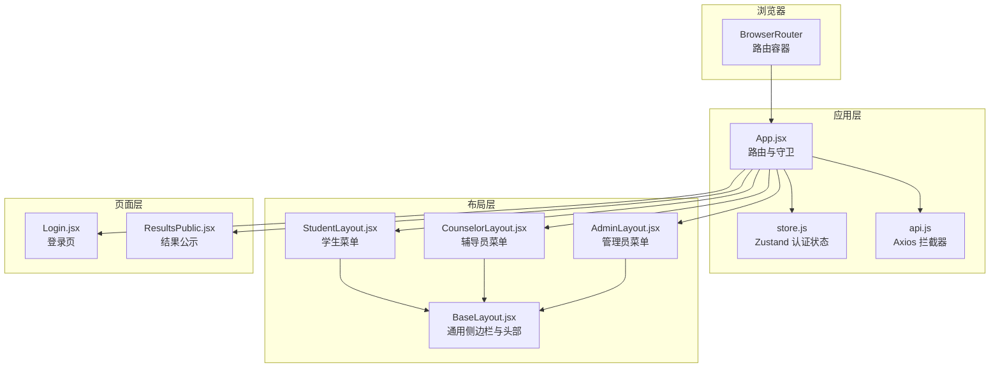
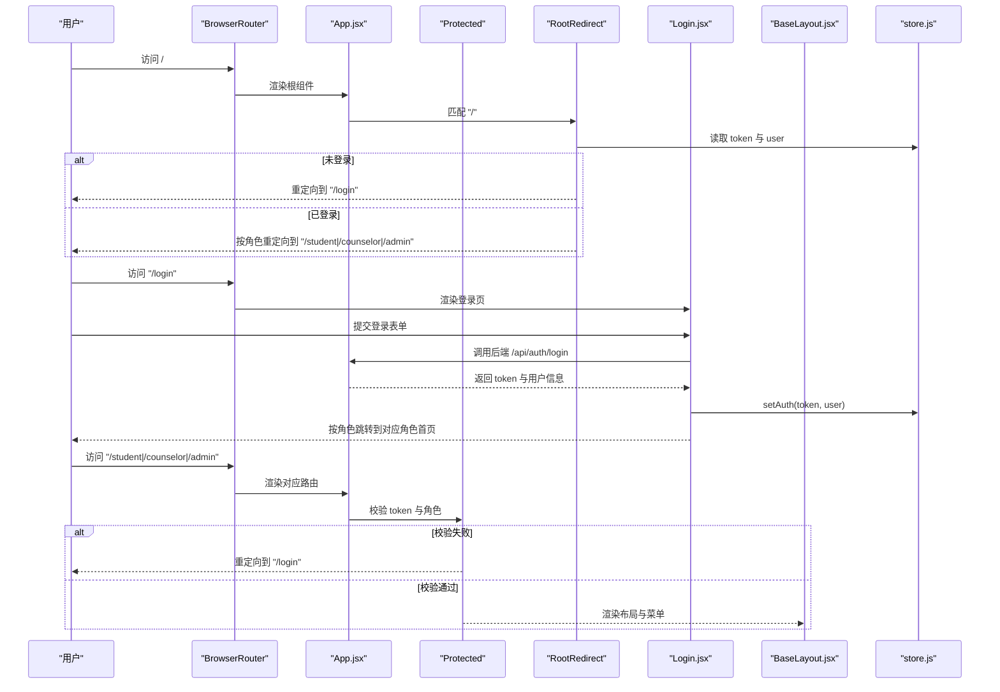
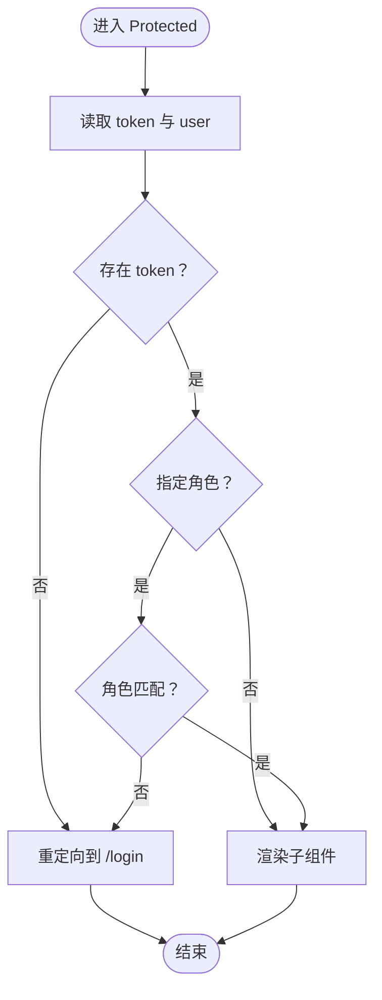
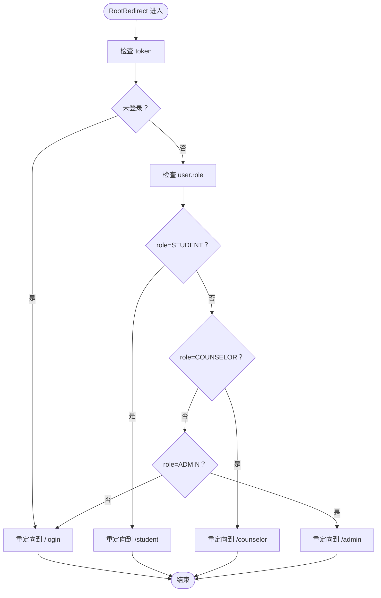
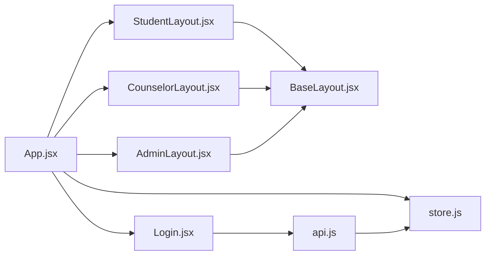

# 路由与权限控制

<cite>
**本文引用的文件**
- [frontend/src/App.jsx](file://frontend/src/App.jsx)
- [frontend/src/main.jsx](file://frontend/src/main.jsx)
- [frontend/src/store.js](file://frontend/src/store.js)
- [frontend/src/layouts/BaseLayout.jsx](file://frontend/src/layouts/BaseLayout.jsx)
- [frontend/src/layouts/StudentLayout.jsx](file://frontend/src/layouts/StudentLayout.jsx)
- [frontend/src/layouts/CounselorLayout.jsx](file://frontend/src/layouts/CounselorLayout.jsx)
- [frontend/src/layouts/AdminLayout.jsx](file://frontend/src/layouts/AdminLayout.jsx)
- [frontend/src/pages/Login.jsx](file://frontend/src/pages/Login.jsx)
- [frontend/src/pages/ResultsPublic.jsx](file://frontend/src/pages/ResultsPublic.jsx)
- [frontend/src/api.js](file://frontend/src/api.js)
- [backend/src/main/java/com/zjsu/scholarship/security/JwtAuthInterceptor.java](file://backend/src/main/java/com/zjsu/scholarship/security/JwtAuthInterceptor.java)
- [backend/src/main/java/com/zjsu/scholarship/security/RequireRole.java](file://backend/src/main/java/com/zjsu/scholarship/security/RequireRole.java)
- [backend/src/main/java/com/zjsu/scholarship/controller/AuthController.java](file://backend/src/main/java/com/zjsu/scholarship/controller/AuthController.java)
- [backend/src/main/java/com/zjsu/scholarship/service/AuthService.java](file://backend/src/main/java/com/zjsu/scholarship/service/AuthService.java)
</cite>

## 目录
1. [简介](#简介)
2. [项目结构](#项目结构)
3. [核心组件](#核心组件)
4. [架构总览](#架构总览)
5. [详细组件分析](#详细组件分析)
6. [依赖关系分析](#依赖关系分析)
7. [性能考虑](#性能考虑)
8. [故障排查指南](#故障排查指南)
9. [结论](#结论)
10. [附录](#附录)

## 简介
本文件系统性阐述奖学金管理系统的前端路由与权限控制机制，覆盖以下主题：
- React Router 的路由配置与嵌套路由
- 权限验证组件 Protected 的设计与实现
- RootRedirect 的登录状态与角色重定向逻辑
- 基于角色的菜单动态生成与页面导航
- 前端路由守卫与后端权限拦截的协同
- 扩展方案：多级权限、动态权限、权限缓存
- 性能优化与 SEO 友好实践

## 项目结构
前端采用 React + React Router + Zustand + Ant Design 构建，路由在应用根组件集中声明，通过受保护的布局组件实现按角色的访问控制。

图表来源
- [frontend/src/main.jsx:10-18](file://frontend/src/main.jsx#L10-L18)
- [frontend/src/App.jsx:43-82](file://frontend/src/App.jsx#L43-L82)
- [frontend/src/store.js:4-14](file://frontend/src/store.js#L4-L14)
- [frontend/src/api.js:5-43](file://frontend/src/api.js#L5-L43)

章节来源
- [frontend/src/main.jsx:1-19](file://frontend/src/main.jsx#L1-L19)
- [frontend/src/App.jsx:1-83](file://frontend/src/App.jsx#L1-L83)

## 核心组件
- 路由与守卫
  - App.jsx 定义所有路由，包含登录页、结果公示页以及三类角色的嵌套路由。
  - Protected 组件负责前端路由守卫：校验 token 存在与角色匹配，不满足则重定向到登录页。
  - RootRedirect 组件根据用户角色进行首页重定向，支持通配符兜底。
- 认证状态
  - store.js 使用 Zustand + persist 实现 token 与用户信息的本地持久化存储。
- 布局与菜单
  - BaseLayout 提供统一的侧边栏菜单、头部用户信息与“修改密码/退出登录”操作。
  - 各角色布局组件定义对应菜单项，形成动态菜单。
- 登录流程
  - Login.jsx 发起登录请求，成功后写入认证状态并按角色跳转至对应角色首页。
- API 交互
  - api.js 注入 Authorization 头部，统一处理 401 与业务错误码，触发登出与跳转。

章节来源
- [frontend/src/App.jsx:27-41](file://frontend/src/App.jsx#L27-L41)
- [frontend/src/store.js:4-14](file://frontend/src/store.js#L4-L14)
- [frontend/src/layouts/BaseLayout.jsx:8-21](file://frontend/src/layouts/BaseLayout.jsx#L8-L21)
- [frontend/src/pages/Login.jsx:16-34](file://frontend/src/pages/Login.jsx#L16-L34)
- [frontend/src/api.js:10-41](file://frontend/src/api.js#L10-L41)

## 架构总览
前端路由与权限控制的整体流程如下：

图表来源
- [frontend/src/App.jsx:34-41](file://frontend/src/App.jsx#L34-L41)
- [frontend/src/App.jsx:27-32](file://frontend/src/App.jsx#L27-L32)
- [frontend/src/pages/Login.jsx:22-34](file://frontend/src/pages/Login.jsx#L22-L34)
- [frontend/src/store.js:6-10](file://frontend/src/store.js#L6-L10)
- [frontend/src/layouts/BaseLayout.jsx:8-21](file://frontend/src/layouts/BaseLayout.jsx#L8-L21)

## 详细组件分析

### Protected 组件：前端路由守卫
- 设计目标
  - 在进入受保护的嵌套路由前，确保用户已登录且具备相应角色。
- 核心逻辑
  - 读取全局认证状态 token 与 user。
  - 若无 token 或角色不匹配，重定向到登录页。
  - 角色匹配则渲染子路由内容。
- 嵌套路由集成
  - 作为各角色布局的父级元素，确保子路由均受同一角色约束。

图表来源
- [frontend/src/App.jsx:27-32](file://frontend/src/App.jsx#L27-L32)

章节来源
- [frontend/src/App.jsx:27-32](file://frontend/src/App.jsx#L27-L32)

### RootRedirect 组件：登录状态与角色重定向
- 设计目标
  - 处理根路径与通配符路径，依据登录状态与角色进行智能重定向。
- 核心逻辑
  - 未登录：重定向到登录页。
  - 已登录：按角色重定向到对应角色首页。
  - 兜底：未知角色同样重定向到登录页。

图表来源
- [frontend/src/App.jsx:34-41](file://frontend/src/App.jsx#L34-L41)

章节来源
- [frontend/src/App.jsx:34-41](file://frontend/src/App.jsx#L34-L41)

### 嵌套路由配置：子路由、路径参数与索引路由
- 配置方式
  - 以角色为单位定义父路由，子路由通过 Route 子元素声明。
  - 使用 index 定义索引路由（如 “/student” 对应的首页）。
- 路径参数传递
  - 当前代码未使用动态路径参数，若需传参可结合 useNavigate/useLocation 或在子路由中声明参数占位。
- 索引路由处理
  - 父路由的 index 路由作为默认子页面，提升用户体验。

章节来源
- [frontend/src/App.jsx:49-58](file://frontend/src/App.jsx#L49-L58)
- [frontend/src/App.jsx:60-66](file://frontend/src/App.jsx#L60-L66)
- [frontend/src/App.jsx:68-76](file://frontend/src/App.jsx#L68-L76)

### 动态菜单生成：角色与菜单项映射
- 菜单来源
  - 各角色布局组件定义静态菜单项数组，包含图标、标签与跳转键。
- 菜单渲染
  - BaseLayout 接收 menuItems、basePath 与 title，自动计算当前选中项并绑定导航。
- 密码与退出
  - 用户下拉菜单提供“修改密码”与“退出登录”，退出时清空认证状态并跳转登录页。

章节来源
- [frontend/src/layouts/StudentLayout.jsx:4-12](file://frontend/src/layouts/StudentLayout.jsx#L4-L12)
- [frontend/src/layouts/CounselorLayout.jsx:4-9](file://frontend/src/layouts/CounselorLayout.jsx#L4-L9)
- [frontend/src/layouts/AdminLayout.jsx:4-11](file://frontend/src/layouts/AdminLayout.jsx#L4-L11)
- [frontend/src/layouts/BaseLayout.jsx:8-21](file://frontend/src/layouts/BaseLayout.jsx#L8-L21)

### 登录流程与认证状态管理
- 登录提交
  - Login.jsx 调用后端接口获取 token 与用户信息，并写入认证状态。
- 角色跳转
  - 根据返回的角色值直接跳转到对应角色首页。
- 认证状态
  - store.js 使用持久化存储，保证刷新后仍保持登录态。

章节来源
- [frontend/src/pages/Login.jsx:22-34](file://frontend/src/pages/Login.jsx#L22-L34)
- [frontend/src/store.js:6-10](file://frontend/src/store.js#L6-L10)

### API 拦截器与错误处理
- 请求拦截
  - 自动注入 Authorization: Bearer token。
- 响应拦截
  - 统一处理业务错误码与 401 未登录，触发登出并跳转登录页。
  - 其他错误统一提示并拒绝 Promise。

章节来源
- [frontend/src/api.js:10-41](file://frontend/src/api.js#L10-L41)

### 后端权限拦截（补充）
- JWT 解析与上下文注入
  - JwtAuthInterceptor 解析 Authorization 头中的 JWT，注入 AuthContext。
- 方法/类型注解
  - RequireRole 注解用于标注控制器方法或类型所需的最低角色集合。
- 权限校验
  - 若请求角色不在 RequireRole 列表中，返回 403。

章节来源
- [backend/src/main/java/com/zjsu/scholarship/security/JwtAuthInterceptor.java:20-57](file://backend/src/main/java/com/zjsu/scholarship/security/JwtAuthInterceptor.java#L20-L57)
- [backend/src/main/java/com/zjsu/scholarship/security/RequireRole.java:8-12](file://backend/src/main/java/com/zjsu/scholarship/security/RequireRole.java#L8-L12)
- [backend/src/main/java/com/zjsu/scholarship/controller/AuthController.java:21-35](file://backend/src/main/java/com/zjsu/scholarship/controller/AuthController.java#L21-L35)
- [backend/src/main/java/com/zjsu/scholarship/service/AuthService.java:32-55](file://backend/src/main/java/com/zjsu/scholarship/service/AuthService.java#L32-L55)

## 依赖关系分析
- 组件耦合
  - App.jsx 作为路由中枢，依赖 store.js 与各角色布局组件。
  - 各角色布局组件依赖 BaseLayout 与菜单项数组。
  - Login.jsx 依赖 api.js 与 store.js。
  - api.js 依赖 store.js 读取 token。
- 外部依赖
  - React Router 用于声明式路由与导航。
  - Ant Design 提供 UI 组件与国际化配置。
  - Axios 用于 HTTP 请求与拦截器。

图表来源
- [frontend/src/App.jsx:43-82](file://frontend/src/App.jsx#L43-L82)
- [frontend/src/store.js:4-14](file://frontend/src/store.js#L4-L14)
- [frontend/src/api.js:5-43](file://frontend/src/api.js#L5-L43)

章节来源
- [frontend/src/App.jsx:1-83](file://frontend/src/App.jsx#L1-L83)
- [frontend/src/store.js:1-15](file://frontend/src/store.js#L1-L15)
- [frontend/src/api.js:1-44](file://frontend/src/api.js#L1-L44)

## 性能考虑
- 路由切换性能
  - 将大型页面组件拆分为独立模块，利用 React.lazy 与 Suspense 实现按需加载。
  - 对频繁切换的页面启用 React.memo 与 useMemo 优化渲染。
- 认证状态持久化
  - 使用 Zustand 的持久化中间件减少重复登录成本。
- 请求拦截优化
  - 在 api.js 中统一设置超时与并发限制，避免过多无效请求。
- SEO 友好
  - 使用 React Helmet 设置标题与元信息，配合静态预渲染或 SSR（如 Next.js）进一步提升 SEO。
  - 为公开页面（如结果公示）提供独立的静态 HTML 生成策略。

## 故障排查指南
- 登录后仍被重定向到登录页
  - 检查登录接口是否正确返回 token 与用户信息。
  - 确认 store.js 的 setAuth 是否被调用。
  - 核对 Protected 组件的角色校验逻辑。
- 角色跳转错误
  - 确认后端返回的 user.role 与前端枚举一致。
  - 检查 RootRedirect 的角色分支逻辑。
- 401 未登录或令牌过期
  - 查看 api.js 响应拦截器对 401 的处理是否触发登出与跳转。
  - 确认 Authorization 头是否正确注入。
- 菜单高亮异常
  - 检查 BaseLayout 的 current 计算逻辑与 basePath 是否匹配。

章节来源
- [frontend/src/pages/Login.jsx:22-34](file://frontend/src/pages/Login.jsx#L22-L34)
- [frontend/src/App.jsx:27-32](file://frontend/src/App.jsx#L27-L32)
- [frontend/src/App.jsx:34-41](file://frontend/src/App.jsx#L34-L41)
- [frontend/src/api.js:18-31](file://frontend/src/api.js#L18-L31)
- [frontend/src/layouts/BaseLayout.jsx:23-25](file://frontend/src/layouts/BaseLayout.jsx#L23-L25)

## 结论
本系统通过前端路由守卫与后端权限拦截相结合的方式，实现了清晰的角色化访问控制。Protected 与 RootRedirect 确保了正确的登录状态与角色重定向；基于角色的动态菜单提升了用户体验；API 拦截器统一处理错误与登出，保障了安全性与一致性。后续可在此基础上扩展多级权限、动态权限与权限缓存等高级能力。

## 附录

### 角色枚举与权限策略
- 角色枚举
  - STUDENT、COUNSELOR、ADMIN。
- 权限策略
  - 前端：Protected 与 RootRedirect 基于角色进行访问控制。
  - 后端：RequireRole 注解与 JwtAuthInterceptor 实施方法级权限校验。

章节来源
- [frontend/src/App.jsx:27-41](file://frontend/src/App.jsx#L27-L41)
- [backend/src/main/java/com/zjsu/scholarship/security/RequireRole.java:8-12](file://backend/src/main/java/com/zjsu/scholarship/security/RequireRole.java#L8-L12)

### 扩展方案
- 多级权限
  - 在用户对象中引入权限点集合，前端在菜单与按钮级做细粒度控制。
- 动态权限
  - 登录后从后端拉取权限清单，前端动态构建菜单与按钮可见性。
- 权限缓存
  - 将权限清单缓存至 localStorage，结合过期时间与刷新策略，降低重复请求。

### SEO 友好实践
- 标题与描述
  - 为不同页面设置唯一标题与描述，便于搜索引擎理解页面内容。
- 静态预渲染
  - 对公开页面（如结果公示）生成静态 HTML，提升首屏加载与 SEO 表现。
- 结构化数据
  - 对重要页面添加结构化数据标记，增强搜索结果的丰富展示。