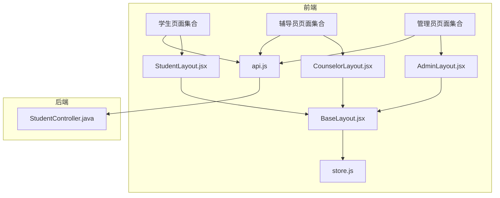
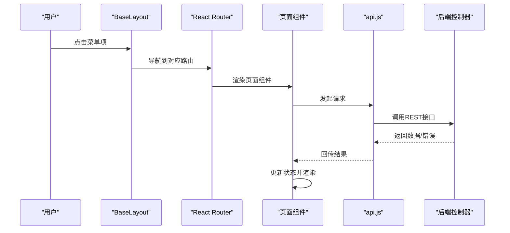
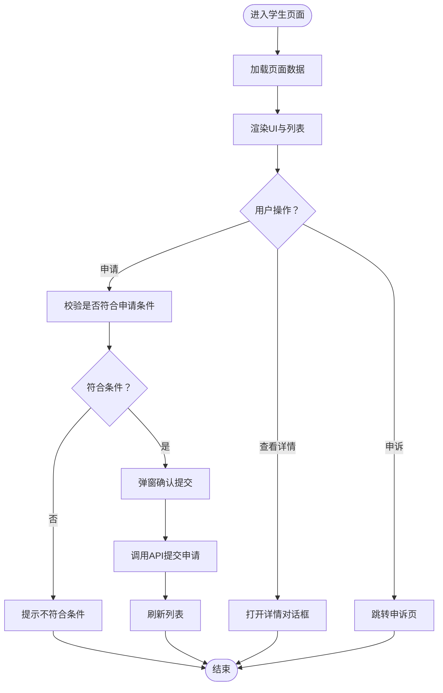
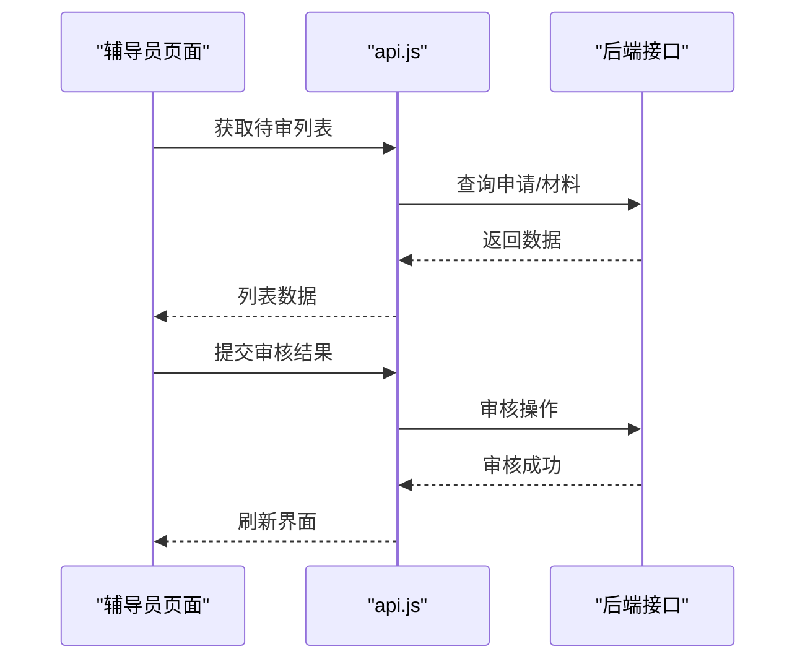
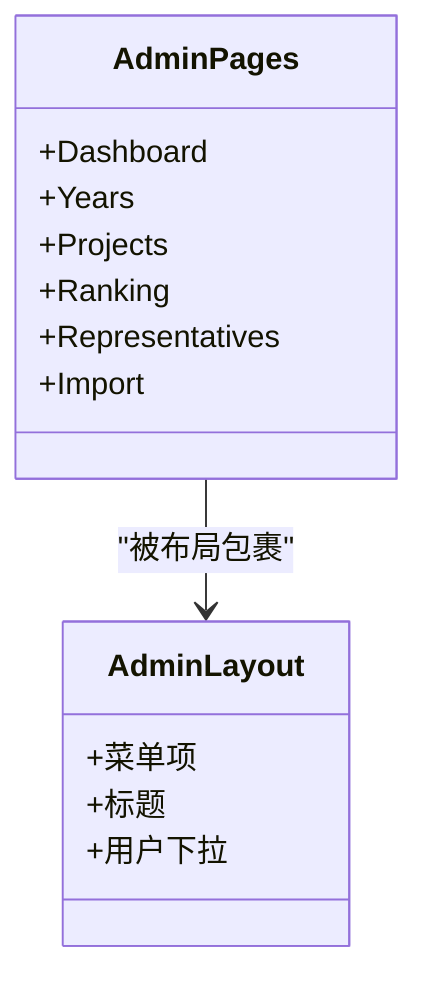
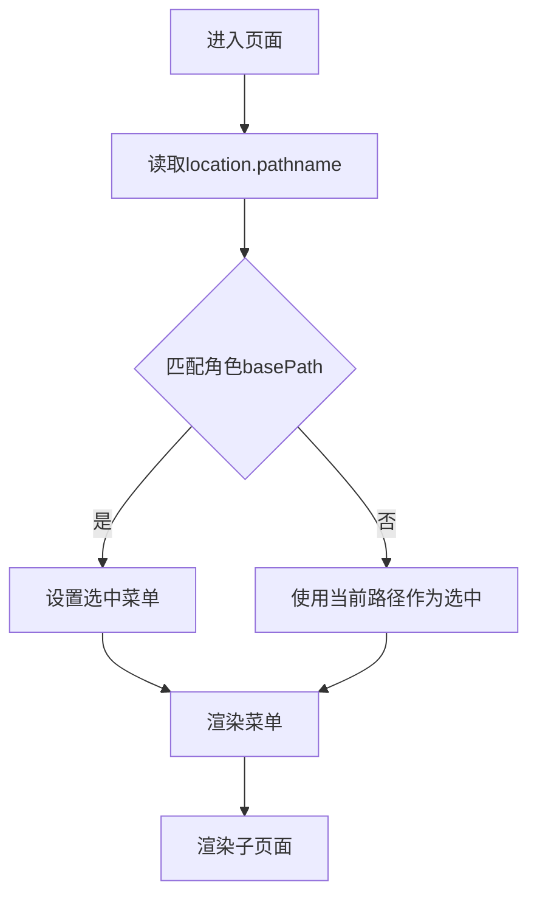
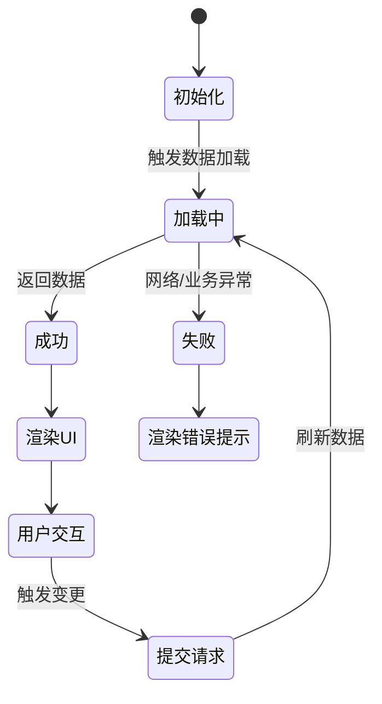
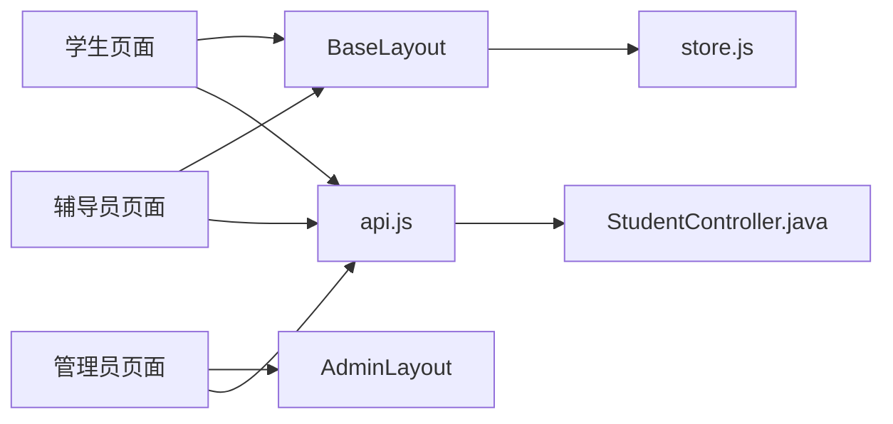

# 页面组件设计

<cite>
**本文引用的文件**
- [README.md](file://README.md)
- [BaseLayout.jsx](file://frontend/src/layouts/BaseLayout.jsx)
- [AdminLayout.jsx](file://frontend/src/layouts/AdminLayout.jsx)
- [CounselorLayout.jsx](file://frontend/src/layouts/CounselorLayout.jsx)
- [StudentLayout.jsx](file://frontend/src/layouts/StudentLayout.jsx)
- [Scholarships.jsx](file://frontend/src/pages/student/Scholarships.jsx)
- [Applications.jsx（学生）](file://frontend/src/pages/student/Applications.jsx)
- [Appeal.jsx（学生）](file://frontend/src/pages/student/Appeal.jsx)
- [Home.jsx（学生）](file://frontend/src/pages/student/Home.jsx)
- [BasicEvaluation.jsx（学生）](file://frontend/src/pages/student/BasicEvaluation.jsx)
- [AbilityEvaluation.jsx（学生）](file://frontend/src/pages/student/AbilityEvaluation.jsx)
- [GraduateExam.jsx（学生）](file://frontend/src/pages/student/GraduateExam.jsx)
- [Applications.jsx（辅导员）](file://frontend/src/pages/counselor/Applications.jsx)
- [Review.jsx（辅导员）](file://frontend/src/pages/counselor/Review.jsx)
- [Appraisal.jsx（辅导员）](file://frontend/src/pages/counselor/Appraisal.jsx)
- [Students.jsx（辅导员）](file://frontend/src/pages/counselor/Students.jsx)
- [Dashboard.jsx（管理员）](file://frontend/src/pages/admin/Dashboard.jsx)
- [Projects.jsx（管理员）](file://frontend/src/pages/admin/Projects.jsx)
- [Ranking.jsx（管理员）](file://frontend/src/pages/admin/Ranking.jsx)
- [Representatives.jsx（管理员）](file://frontend/src/pages/admin/Representatives.jsx)
- [Import.jsx（管理员）](file://frontend/src/pages/admin/Import.jsx)
- [Years.jsx（管理员）](file://frontend/src/pages/admin/Years.jsx)
- [ResultsPublic.jsx](file://frontend/src/pages/ResultsPublic.jsx)
- [ChangePassword.jsx](file://frontend/src/pages/ChangePassword.jsx)
- [Login.jsx](file://frontend/src/pages/Login.jsx)
- [api.js](file://frontend/src/api.js)
- [store.js](file://frontend/src/store.js)
- [StudentController.java](file://backend/src/main/java/com/zjsu/scholarship/controller/StudentController.java)
</cite>

## 目录
1. [引言](#引言)
2. [项目结构](#项目结构)
3. [核心组件](#核心组件)
4. [架构总览](#架构总览)
5. [详细组件分析](#详细组件分析)
6. [依赖分析](#依赖分析)
7. [性能考虑](#性能考虑)
8. [故障排查指南](#故障排查指南)
9. [结论](#结论)
10. [附录](#附录)

## 引言
本设计文档聚焦奖学金管理系统中的页面组件设计，围绕“职责分离”“角色差异化”“生命周期管理”“与布局协作”“性能优化”“测试与调试”六个维度展开。目标是帮助开发者在不深入代码细节的前提下，理解页面组件如何分工协作，如何适配不同角色的业务场景，并掌握可复用的设计模式与最佳实践。

## 项目结构
系统采用前后端分离架构，前端基于 React + Ant Design，后端基于 Spring Boot。页面组件按角色分层组织，统一通过布局组件注入菜单、面包屑与用户上下文；页面内通过 API 模块进行数据交互；全局状态通过 Zustand store 管理认证与用户信息。

图示来源
- [BaseLayout.jsx:1-65](file://frontend/src/layouts/BaseLayout.jsx#L1-L65)
- [AdminLayout.jsx:1-15](file://frontend/src/layouts/AdminLayout.jsx#L1-L15)
- [CounselorLayout.jsx:1-13](file://frontend/src/layouts/CounselorLayout.jsx#L1-L13)
- [StudentLayout.jsx:1-16](file://frontend/src/layouts/StudentLayout.jsx#L1-L16)
- [api.js](file://frontend/src/api.js)
- [store.js](file://frontend/src/store.js)
- [StudentController.java:651-678](file://backend/src/main/java/com/zjsu/scholarship/controller/StudentController.java#L651-L678)

章节来源
- [README.md:1-55](file://README.md#L1-L55)

## 核心组件
- 布局组件：负责菜单、头部、侧边栏、用户下拉、面包屑与 Outlet 插槽，统一承载各角色页面。
- 页面组件：按角色划分，承担数据获取、状态管理、UI 渲染与交互逻辑。
- API 模块：封装 REST 请求，统一错误处理与拦截器。
- 全局状态：Zustand store 提供认证态、用户信息与初始密码提示等。

章节来源
- [BaseLayout.jsx:1-65](file://frontend/src/layouts/BaseLayout.jsx#L1-L65)
- [store.js](file://frontend/src/store.js)
- [api.js](file://frontend/src/api.js)

## 架构总览
页面组件与布局组件通过 React Router 的 Outlet 协作，路由参数驱动菜单高亮与面包屑生成；权限通过布局内的用户菜单与后端接口配合实现；页面组件通过 API 模块与后端交互，返回数据后更新本地状态并渲染。

图示来源
- [BaseLayout.jsx:27-61](file://frontend/src/layouts/BaseLayout.jsx#L27-L61)
- [api.js](file://frontend/src/api.js)
- [StudentController.java:651-678](file://backend/src/main/java/com/zjsu/scholarship/controller/StudentController.java#L651-L678)

## 详细组件分析

### 学生端页面组件
- 个人主页：展示基础信息与快捷入口。
- 基本项测评：呈现基础测评项与分数。
- 综合能力测评：呈现综合能力相关条目。
- 奖学金申报：列出可申请项目，支持条件校验与提交。
- 考研奖学金：查询考研相关申请状态。
- 我的申请：展示历史申请记录与状态。
- 申诉：发起申诉流程。

图示来源
- [Scholarships.jsx:12-35](file://frontend/src/pages/student/Scholarships.jsx#L12-L35)

章节来源
- [Scholarships.jsx:1-35](file://frontend/src/pages/student/Scholarships.jsx#L1-L35)
- [Applications.jsx（学生）](file://frontend/src/pages/student/Applications.jsx)
- [Appeal.jsx（学生）](file://frontend/src/pages/student/Appeal.jsx)
- [Home.jsx（学生）](file://frontend/src/pages/student/Home.jsx)
- [BasicEvaluation.jsx（学生）](file://frontend/src/pages/student/BasicEvaluation.jsx)
- [AbilityEvaluation.jsx（学生）](file://frontend/src/pages/student/AbilityEvaluation.jsx)
- [GraduateExam.jsx（学生）](file://frontend/src/pages/student/GraduateExam.jsx)

### 辅导员端页面组件
- 我的学生：查看所带班级或指导学生的名单与状态。
- 材料审核：对提交的附件与材料进行审核。
- 申请审核：对具体申请进行审核与评级。
- 品德评议：进行思想品德方面的评议与打分。

图示来源
- [Applications.jsx（辅导员）](file://frontend/src/pages/counselor/Applications.jsx)
- [Review.jsx（辅导员）](file://frontend/src/pages/counselor/Review.jsx)
- [Appraisal.jsx（辅导员）](file://frontend/src/pages/counselor/Appraisal.jsx)
- [Students.jsx（辅导员）](file://frontend/src/pages/counselor/Students.jsx)

### 管理员端页面组件
- 统计看板：概览性指标与趋势。
- 学年管理：维护学年周期与状态。
- 奖学金项目：新增/编辑/启用/停用项目。
- 综测排名：查看与导出综合测评排名。
- 学生代表：管理学生代表信息。
- 数据导入：批量导入数据。
- 结果公示：发布最终结果。

图示来源
- [AdminLayout.jsx:1-15](file://frontend/src/layouts/AdminLayout.jsx#L1-L15)
- [Dashboard.jsx（管理员）](file://frontend/src/pages/admin/Dashboard.jsx)
- [Years.jsx（管理员）](file://frontend/src/pages/admin/Years.jsx)
- [Projects.jsx（管理员）](file://frontend/src/pages/admin/Projects.jsx)
- [Ranking.jsx（管理员）](file://frontend/src/pages/admin/Ranking.jsx)
- [Representatives.jsx（管理员）](file://frontend/src/pages/admin/Representatives.jsx)
- [Import.jsx（管理员）](file://frontend/src/pages/admin/Import.jsx)

### 布局组件协作机制
- 路由参数传递：布局根据 basePath 与当前路径决定选中菜单项。
- 权限验证：布局提供用户信息与登出入口，结合后端接口实现角色访问控制。
- 面包屑导航：可通过扩展在布局中生成，当前实现以菜单高亮为主。

图示来源
- [BaseLayout.jsx:23-25](file://frontend/src/layouts/BaseLayout.jsx#L23-L25)
- [BaseLayout.jsx:34-39](file://frontend/src/layouts/BaseLayout.jsx#L34-L39)

章节来源
- [BaseLayout.jsx:1-65](file://frontend/src/layouts/BaseLayout.jsx#L1-L65)
- [AdminLayout.jsx:1-15](file://frontend/src/layouts/AdminLayout.jsx#L1-L15)
- [CounselorLayout.jsx:1-13](file://frontend/src/layouts/CounselorLayout.jsx#L1-L13)
- [StudentLayout.jsx:1-16](file://frontend/src/layouts/StudentLayout.jsx#L1-L16)

### 生命周期管理
- 数据加载：页面组件在挂载时触发一次加载；部分页面在提交后主动刷新。
- 错误处理：通过 API 模块集中处理网络与业务异常；页面组件显示友好提示。
- 状态更新：使用 useState/Reducer 管理本地 UI 状态；Zustand 管理认证态与用户信息。

图示来源
- [Scholarships.jsx:12-35](file://frontend/src/pages/student/Scholarships.jsx#L12-L35)
- [store.js](file://frontend/src/store.js)
- [api.js](file://frontend/src/api.js)

## 依赖分析
- 页面组件依赖布局组件提供一致的导航与用户上下文。
- 页面组件通过 API 模块与后端交互，后端控制器按角色提供相应接口。
- 全局状态 store 为布局与页面提供认证态与用户信息。

图示来源
- [BaseLayout.jsx:11](file://frontend/src/layouts/BaseLayout.jsx#L11)
- [store.js](file://frontend/src/store.js)
- [api.js](file://frontend/src/api.js)
- [StudentController.java:651-678](file://backend/src/main/java/com/zjsu/scholarship/controller/StudentController.java#L651-L678)

章节来源
- [BaseLayout.jsx:1-65](file://frontend/src/layouts/BaseLayout.jsx#L1-L65)
- [AdminLayout.jsx:1-15](file://frontend/src/layouts/AdminLayout.jsx#L1-L15)
- [StudentController.java:651-678](file://backend/src/main/java/com/zjsu/scholarship/controller/StudentController.java#L651-L678)

## 性能考虑
- 懒加载：对非首屏页面组件采用动态导入，减少初始包体。
- 虚拟滚动：对长列表（如排名、学生列表）采用虚拟滚动提升渲染性能。
- 缓存策略：对只读列表数据设置合理缓存时间，避免重复请求；对可变数据采用失效重取。
- 并发控制：对高频请求进行去抖/节流，合并不必要的刷新。
- 图标与资源：按需引入图标与静态资源，避免全量打包。

## 故障排查指南
- 登录态问题：检查 store 中用户信息与 token 是否存在；确认后端 JWT 校验是否通过。
- 菜单不生效：确认 basePath 与当前路径匹配逻辑；检查菜单项 key 与路由一致。
- 数据不更新：确认页面在提交后是否主动刷新；检查 API 返回状态码与错误处理。
- 权限不足：确认后端接口注解与前端路由是否匹配；检查用户角色字段。

章节来源
- [BaseLayout.jsx:13-21](file://frontend/src/layouts/BaseLayout.jsx#L13-L21)
- [store.js](file://frontend/src/store.js)
- [api.js](file://frontend/src/api.js)

## 结论
页面组件设计遵循“布局即基础设施、页面即业务”的原则，通过清晰的职责分离与统一的协作机制，实现了学生、辅导员、管理员三类角色的差异化需求。配合合理的生命周期管理与性能优化策略，系统具备良好的可维护性与用户体验。

## 附录
- 演示账号与端口参考：后端 8080，前端 5173，演示账号见项目说明。
- 页面入口：登录后根据角色自动进入对应布局与菜单。

章节来源
- [README.md:46-55](file://README.md#L46-L55)