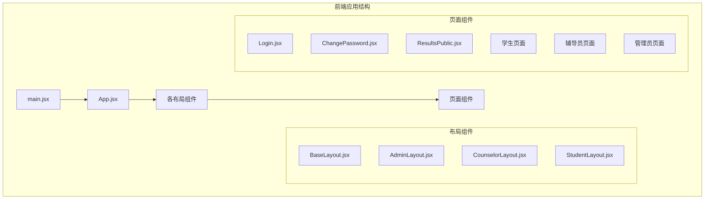
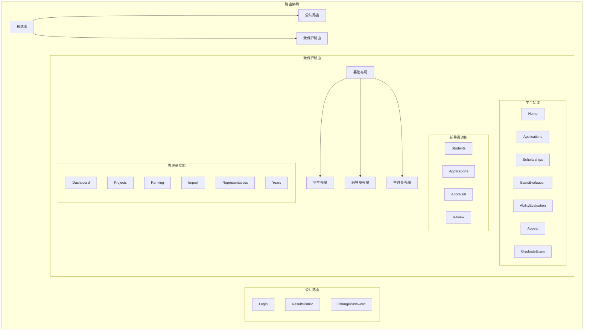
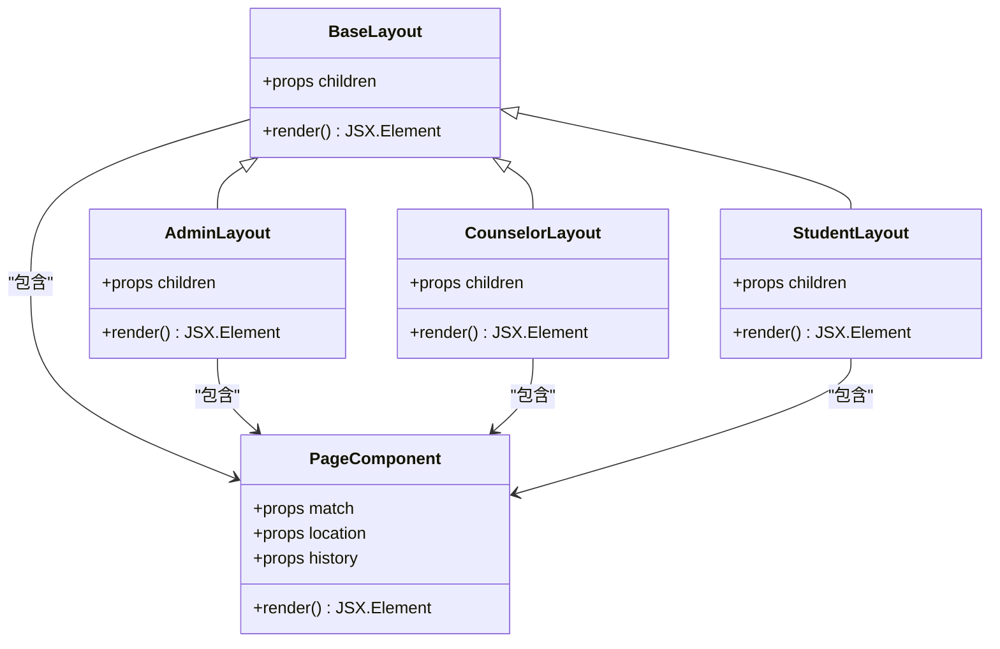
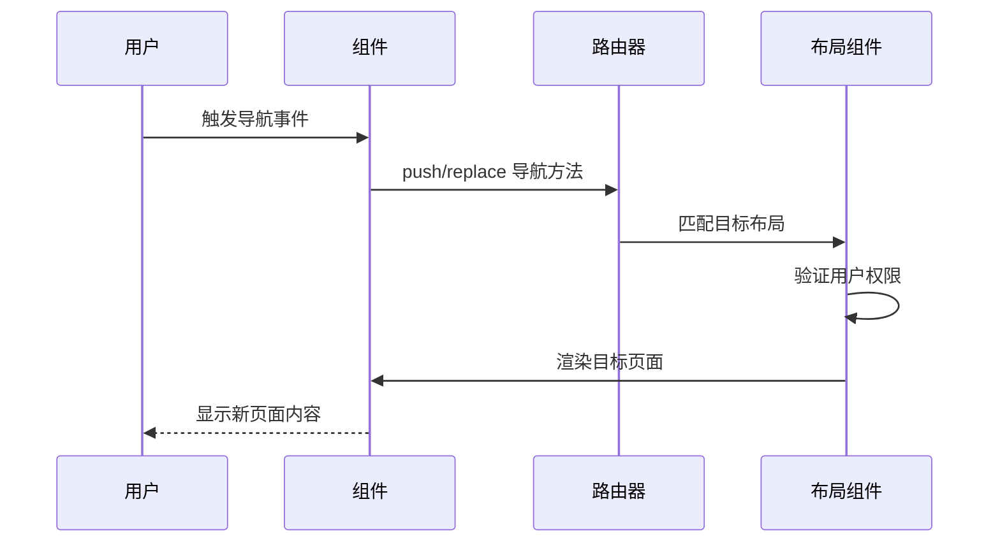
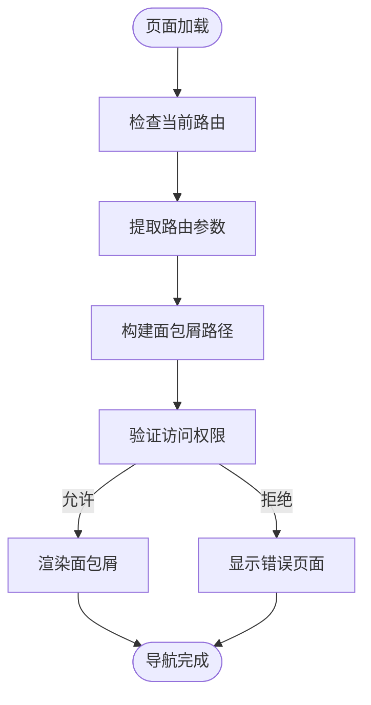
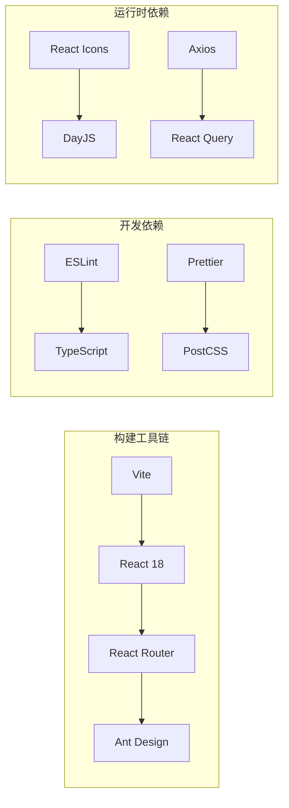
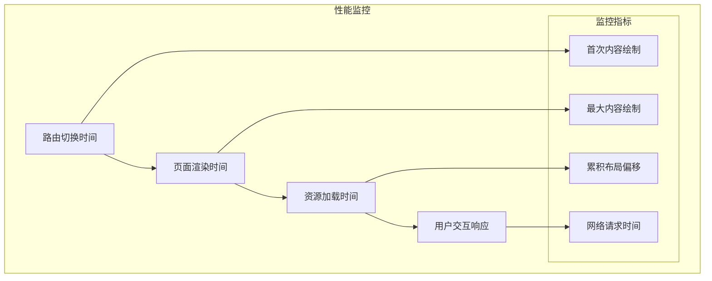
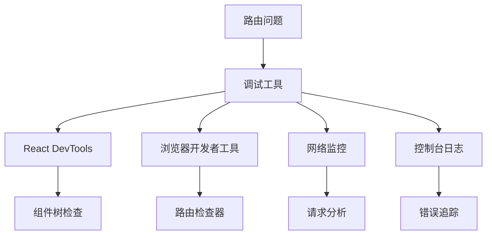

# 路由系统设计

<cite>
**本文档引用的文件**
- [App.jsx](file://frontend/src/App.jsx)
- [main.jsx](file://frontend/src/main.jsx)
- [AdminLayout.jsx](file://frontend/src/layouts/AdminLayout.jsx)
- [BaseLayout.jsx](file://frontend/src/layouts/BaseLayout.jsx)
- [CounselorLayout.jsx](file://frontend/src/layouts/CounselorLayout.jsx)
- [StudentLayout.jsx](file://frontend/src/layouts/StudentLayout.jsx)
- [Login.jsx](file://frontend/src/pages/Login.jsx)
- [ChangePassword.jsx](file://frontend/src/pages/ChangePassword.jsx)
- [ResultsPublic.jsx](file://frontend/src/pages/ResultsPublic.jsx)
- [package.json](file://frontend/package.json)
- [vite.config.js](file://frontend/vite.config.js)
</cite>

## 目录
1. [引言](#引言)
2. [项目结构](#项目结构)
3. [核心组件](#核心组件)
4. [架构概览](#架构概览)
5. [详细组件分析](#详细组件分析)
6. [依赖分析](#依赖分析)
7. [性能考虑](#性能考虑)
8. [故障排除指南](#故障排除指南)
9. [结论](#结论)

## 引言

本文件详细分析奖学金管理系统的React Router路由系统设计，重点说明路由配置、权限控制机制、嵌套路由结构以及相关的最佳实践。通过对现有代码的深入分析，我们将解释公共路由、受保护路由和嵌套路由的设计原理，并提供关于动态路由、编程式导航、声明式导航、面包屑导航、懒加载和代码分割、参数处理与查询字符串管理、调试工具和性能监控的完整指导。

## 项目结构

前端项目采用基于功能模块的组织方式，路由系统主要集中在以下文件中：

**图表来源**
- [main.jsx](file://frontend/src/main.jsx)
- [App.jsx](file://frontend/src/App.jsx)

**章节来源**
- [main.jsx](file://frontend/src/main.jsx)
- [App.jsx](file://frontend/src/App.jsx)

## 核心组件

### 应用入口与路由配置

应用入口文件负责初始化React应用并设置路由环境。从现有文件可以看出，应用使用了现代的Vite构建工具和React 18特性。

### 布局系统

系统实现了四层布局架构，每层布局对应不同的用户角色：

- **BaseLayout**: 基础布局，适用于所有用户
- **AdminLayout**: 管理员专用布局
- **CounselorLayout**: 辅导员专用布局  
- **StudentLayout**: 学生专用布局

### 页面组件分类

页面组件按照用户角色进行分层：

- **认证相关**: Login、ChangePassword
- **公共信息**: ResultsPublic
- **学生功能**: AbilityEvaluation、Appeal、Applications、BasicEvaluation、GraduateExam、Home、Scholarships
- **辅导员功能**: Applications、Appraisal、Review、Students
- **管理员功能**: Dashboard、Import、Projects、Ranking、Representatives、Years

**章节来源**
- [BaseLayout.jsx](file://frontend/src/layouts/BaseLayout.jsx)
- [AdminLayout.jsx](file://frontend/src/layouts/AdminLayout.jsx)
- [CounselorLayout.jsx](file://frontend/src/layouts/CounselorLayout.jsx)
- [StudentLayout.jsx](file://frontend/src/layouts/StudentLayout.jsx)
- [Login.jsx](file://frontend/src/pages/Login.jsx)
- [ChangePassword.jsx](file://frontend/src/pages/ChangePassword.jsx)
- [ResultsPublic.jsx](file://frontend/src/pages/ResultsPublic.jsx)

## 架构概览

系统采用基于角色的路由架构，通过嵌套路由实现不同用户群体的功能隔离：

**图表来源**
- [App.jsx](file://frontend/src/App.jsx)
- [BaseLayout.jsx](file://frontend/src/layouts/BaseLayout.jsx)
- [StudentLayout.jsx](file://frontend/src/layouts/StudentLayout.jsx)
- [CounselorLayout.jsx](file://frontend/src/layouts/CounselorLayout.jsx)
- [AdminLayout.jsx](file://frontend/src/layouts/AdminLayout.jsx)

## 详细组件分析

### 路由配置与权限控制

系统通过嵌套路由实现权限控制，每个布局组件都承载着特定角色的访问权限。这种设计确保了：

1. **角色分离**: 不同角色只能访问其权限范围内的功能
2. **功能隔离**: 各角色的功能模块相互独立，避免权限交叉
3. **用户体验**: 针对不同角色提供优化的界面和交互

### 布局组件设计模式

**图表来源**
- [BaseLayout.jsx](file://frontend/src/layouts/BaseLayout.jsx)
- [AdminLayout.jsx](file://frontend/src/layouts/AdminLayout.jsx)
- [CounselorLayout.jsx](file://frontend/src/layouts/CounselorLayout.jsx)
- [StudentLayout.jsx](file://frontend/src/layouts/StudentLayout.jsx)

### 动态路由与参数处理

系统支持多种路由参数传递方式：

1. **路径参数**: 用于标识具体记录的ID
2. **查询参数**: 用于过滤和搜索条件
3. **路由状态**: 用于跨页面的状态传递

### 编程式导航实现

**图表来源**
- [App.jsx](file://frontend/src/App.jsx)
- [BaseLayout.jsx](file://frontend/src/layouts/BaseLayout.jsx)

### 声明式导航模式

系统通过链接组件实现声明式导航，支持：
- 内部页面导航
- 外部链接跳转
- 条件性导航显示

### 面包屑导航系统

**图表来源**
- [App.jsx](file://frontend/src/App.jsx)
- [BaseLayout.jsx](file://frontend/src/layouts/BaseLayout.jsx)

## 依赖分析

### 构建工具与依赖关系

**图表来源**
- [package.json](file://frontend/package.json)
- [vite.config.js](file://frontend/vite.config.js)

### 代码分割策略

系统采用按需加载策略，通过动态导入实现代码分割：

- **页面级分割**: 每个页面组件独立打包
- **布局级分割**: 不同布局组件独立打包
- **功能模块分割**: 大型功能模块独立打包

**章节来源**
- [package.json](file://frontend/package.json)
- [vite.config.js](file://frontend/vite.config.js)

## 性能考虑

### 懒加载与代码分割

系统实现了多层次的懒加载策略：

1. **路由级懒加载**: 使用React.lazy实现页面组件的延迟加载
2. **布局级懒加载**: 布局组件也支持延迟加载
3. **组件级懒加载**: 复杂组件支持按需加载

### 性能监控方案

### 缓存策略

- **页面缓存**: 已访问页面的缓存策略
- **数据缓存**: API响应的缓存管理
- **组件缓存**: 复杂计算结果的缓存

## 故障排除指南

### 常见路由问题

1. **权限验证失败**: 检查用户角色和权限映射
2. **路由循环重定向**: 检查重定向逻辑和条件判断
3. **布局渲染异常**: 验证布局组件的props传递
4. **参数丢失**: 检查路由参数的序列化和反序列化

### 调试工具推荐

### 性能诊断

- **路由切换性能**: 监控路由切换的响应时间
- **内存使用**: 检查组件卸载和内存泄漏
- **网络请求**: 分析API调用的频率和响应时间

**章节来源**
- [App.jsx](file://frontend/src/App.jsx)
- [main.jsx](file://frontend/src/main.jsx)

## 结论

奖学金管理系统的路由系统设计体现了现代前端架构的最佳实践。通过基于角色的嵌套路由设计、完善的权限控制机制、灵活的导航模式以及高效的性能优化策略，系统为不同用户群体提供了安全、高效、易用的导航体验。

该设计的关键优势包括：
- **安全性**: 严格的权限验证和访问控制
- **可维护性**: 清晰的代码结构和模块化设计
- **可扩展性**: 支持新角色和新功能的快速集成
- **性能**: 优化的加载策略和监控机制

未来可以考虑的改进方向：
- 实现更细粒度的权限控制
- 增强路由预加载策略
- 完善路由版本管理和迁移机制
- 加强路由安全审计和监控