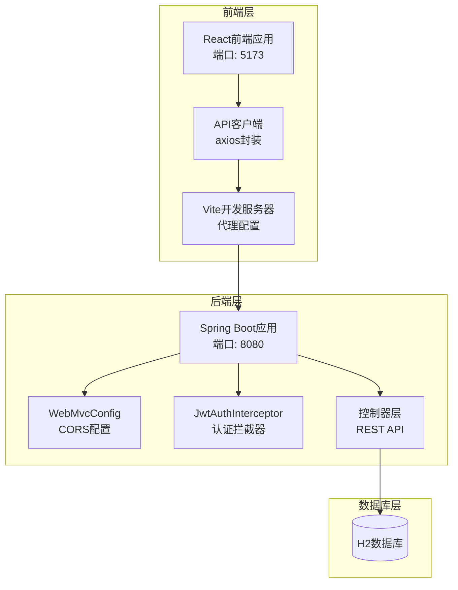
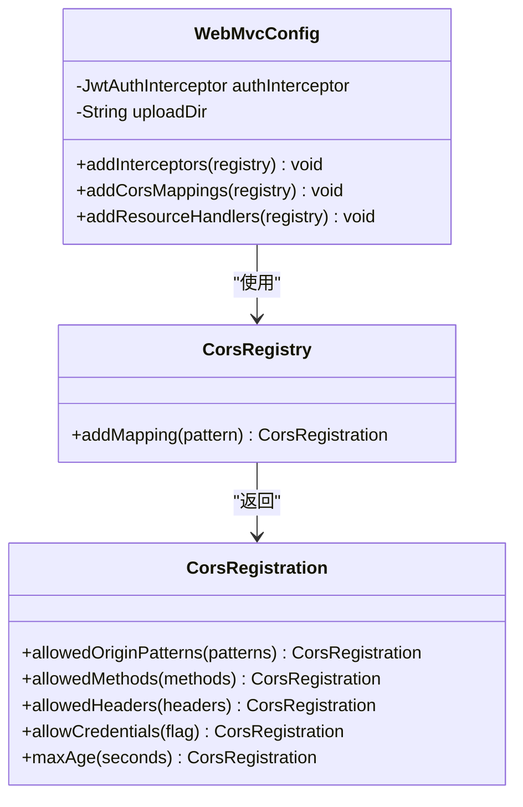
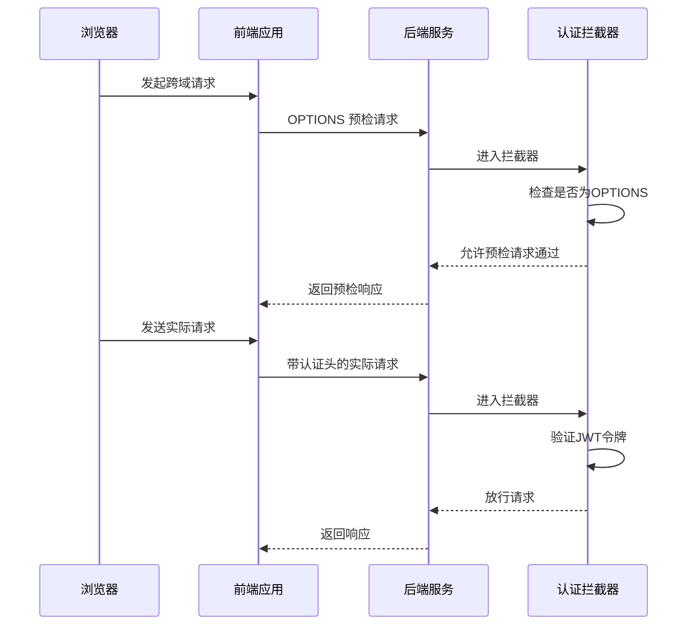
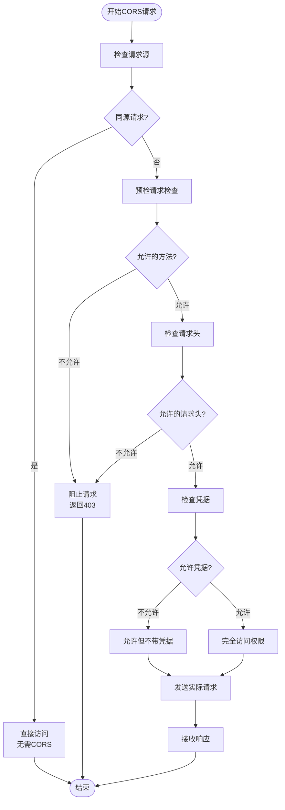
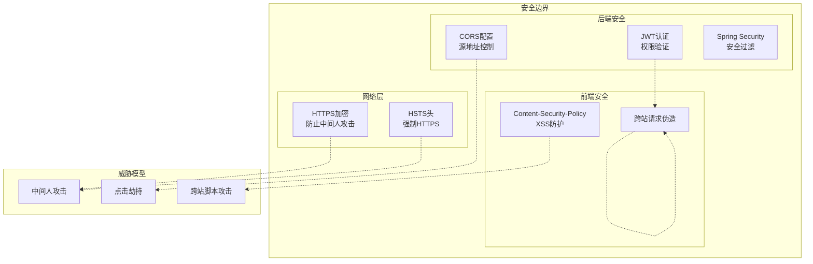
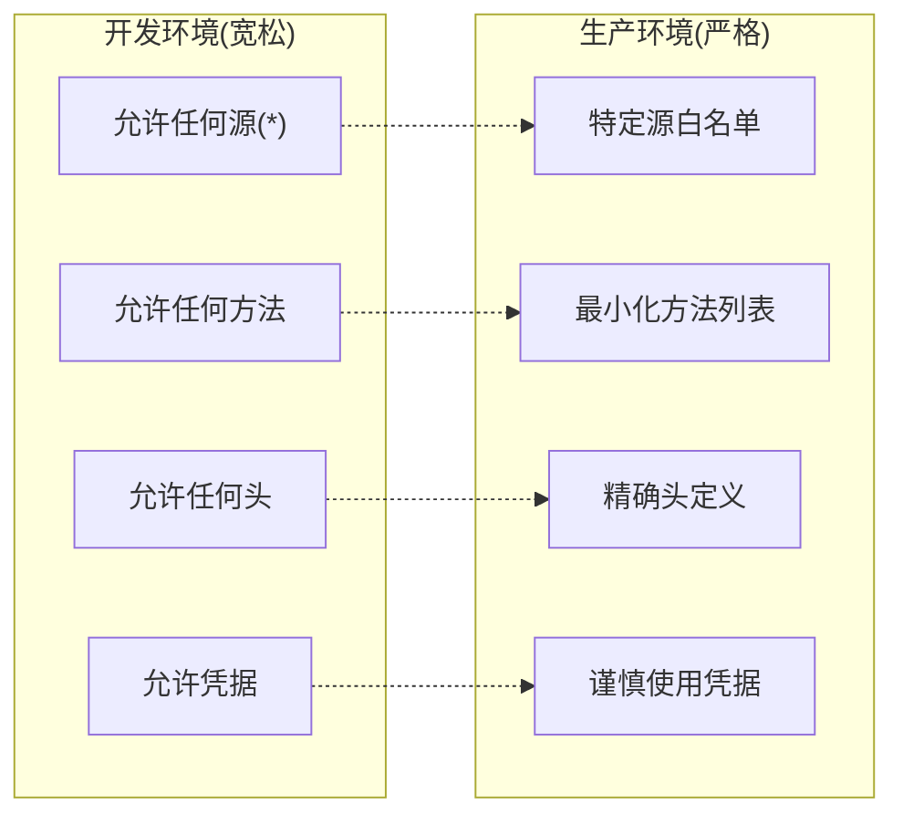
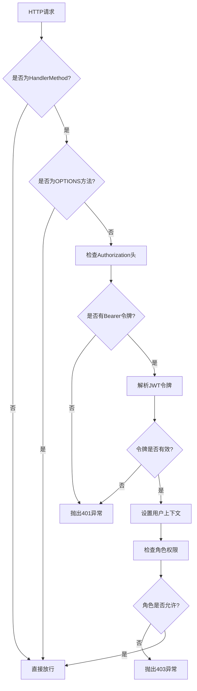
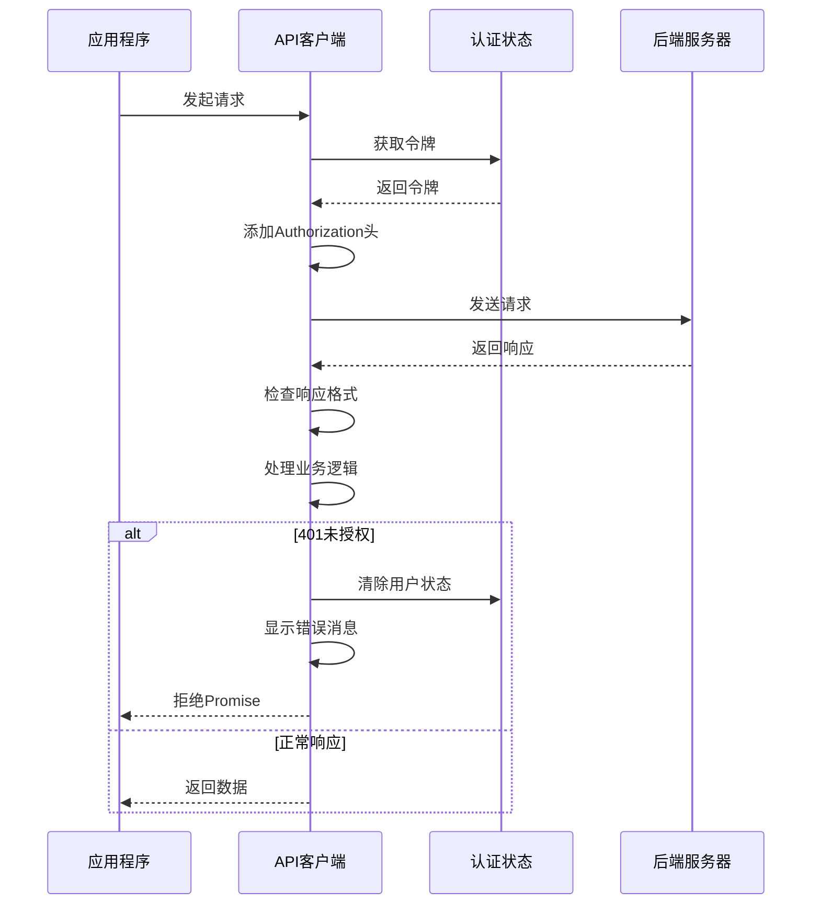
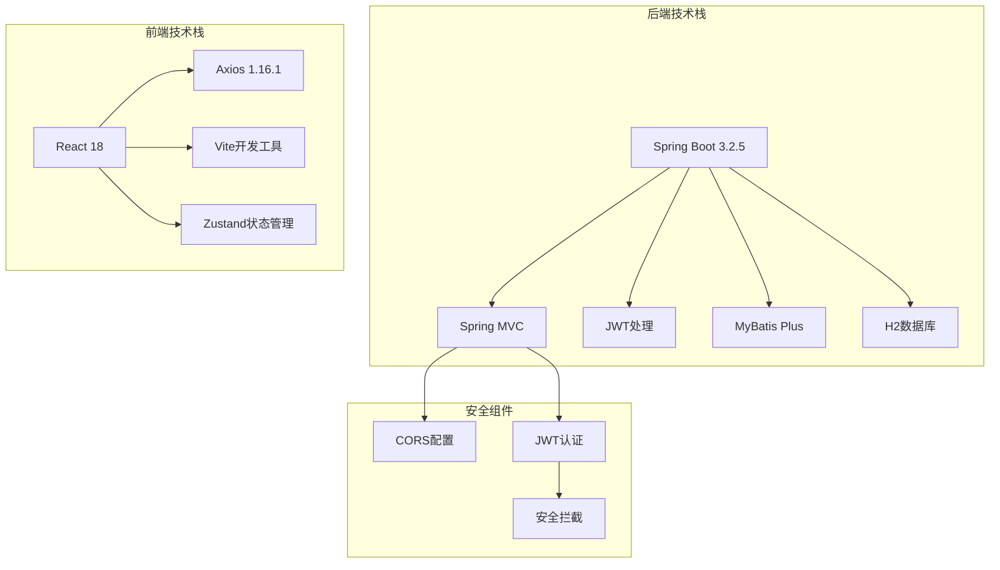
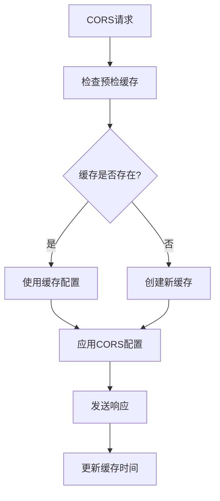

# CORS跨域安全配置

<cite>
**本文档引用的文件**
- [WebMvcConfig.java](file://backend/src/main/java/com/zjsu/scholarship/config/WebMvcConfig.java)
- [application.yml](file://backend/src/main/resources/application.yml)
- [JwtAuthInterceptor.java](file://backend/src/main/java/com/zjsu/scholarship/security/JwtAuthInterceptor.java)
- [AuthController.java](file://backend/src/main/java/com/zjsu/scholarship/controller/AuthController.java)
- [api.js](file://frontend/src/api.js)
- [vite.config.js](file://frontend/vite.config.js)
- [pom.xml](file://backend/pom.xml)
</cite>

## 目录
1. [引言](#引言)
2. [项目结构](#项目结构)
3. [核心组件](#核心组件)
4. [架构概览](#架构概览)
5. [详细组件分析](#详细组件分析)
6. [依赖关系分析](#依赖关系分析)
7. [性能考虑](#性能考虑)
8. [故障排除指南](#故障排除指南)
9. [结论](#结论)
10. [附录](#附录)

## 引言

CORS（跨域资源共享）是现代Web应用中至关重要的安全机制。本文档深入分析了奖学金评估系统中的CORS安全配置，详细解释了CORS机制的工作原理、浏览器同源策略限制，以及在本项目中的具体实现。

CORS机制通过HTTP响应头控制浏览器是否允许跨域请求，确保Web应用在跨域场景下的安全性。浏览器的同源策略限制了来自不同源（协议、域名、端口）的网页脚本对资源的访问，这是防止恶意网站窃取用户数据的重要安全屏障。

## 项目结构

奖学金评估系统采用前后端分离架构，后端使用Spring Boot框架，前端使用React技术栈。整个项目的CORS配置主要集中在后端的WebMvcConfig类中。



**图表来源**
- [WebMvcConfig.java:1-48](file://backend/src/main/java/com/zjsu/scholarship/config/WebMvcConfig.java#L1-L48)
- [vite.config.js:1-20](file://frontend/vite.config.js#L1-L20)

**章节来源**
- [WebMvcConfig.java:1-48](file://backend/src/main/java/com/zjsu/scholarship/config/WebMvcConfig.java#L1-L48)
- [application.yml:1-52](file://backend/src/main/resources/application.yml#L1-L52)
- [pom.xml:1-108](file://backend/pom.xml#L1-L108)

## 核心组件

### CORS配置核心实现

项目中的CORS配置位于WebMvcConfig类中，这是一个标准的Spring MVC配置类，实现了WebMvcConfigurer接口。



**图表来源**
- [WebMvcConfig.java:34-41](file://backend/src/main/java/com/zjsu/scholarship/config/WebMvcConfig.java#L34-L41)

### 认证拦截器与CORS的关系

JwtAuthInterceptor作为Spring MVC拦截器，在CORS预检请求中起到关键作用：



**图表来源**
- [JwtAuthInterceptor.java:20-30](file://backend/src/main/java/com/zjsu/scholarship/security/JwtAuthInterceptor.java#L20-L30)
- [WebMvcConfig.java:34-41](file://backend/src/main/java/com/zjsu/scholarship/config/WebMvcConfig.java#L34-L41)

**章节来源**
- [WebMvcConfig.java:34-41](file://backend/src/main/java/com/zjsu/scholarship/config/WebMvcConfig.java#L34-L41)
- [JwtAuthInterceptor.java:20-30](file://backend/src/main/java/com/zjsu/scholarship/security/JwtAuthInterceptor.java#L20-L30)

## 架构概览

### CORS工作流程

CORS机制通过以下步骤确保跨域请求的安全性：



**图表来源**
- [WebMvcConfig.java:34-41](file://backend/src/main/java/com/zjsu/scholarship/config/WebMvcConfig.java#L34-L41)

### 系统安全架构



**图表来源**
- [WebMvcConfig.java:34-41](file://backend/src/main/java/com/zjsu/scholarship/config/WebMvcConfig.java#L34-L41)
- [JwtAuthInterceptor.java:20-58](file://backend/src/main/java/com/zjsu/scholarship/security/JwtAuthInterceptor.java#L20-L58)

## 详细组件分析

### WebMvcConfig CORS配置详解

#### 全局CORS映射

项目采用了最宽松的CORS配置策略，适用于开发环境：

| 配置项 | 值 | 说明 |
|--------|-----|------|
| 映射路径 | /** | 对所有路径生效 |
| 允许源模式 | "*" | 允许任何源 |
| 允许方法 | GET, POST, PUT, DELETE, OPTIONS | 支持常用HTTP方法 |
| 允许头 | "*" | 允许任意请求头 |
| 凭据 | true | 允许携带Cookie和Authorization头 |
| 缓存时间 | 3600秒 | 预检请求缓存时长 |

#### 安全影响分析

这种配置虽然便于开发，但在生产环境中存在显著安全风险：



**图表来源**
- [WebMvcConfig.java:35-40](file://backend/src/main/java/com/zjsu/scholarship/config/WebMvcConfig.java#L35-L40)

**章节来源**
- [WebMvcConfig.java:34-41](file://backend/src/main/java/com/zjsu/scholarship/config/WebMvcConfig.java#L34-L41)

### JwtAuthInterceptor认证流程

#### 预检请求处理

拦截器对OPTIONS预检请求进行了特殊处理，确保CORS预检能够正常通过：



**图表来源**
- [JwtAuthInterceptor.java:20-58](file://backend/src/main/java/com/zjsu/scholarship/security/JwtAuthInterceptor.java#L20-L58)

**章节来源**
- [JwtAuthInterceptor.java:20-58](file://backend/src/main/java/com/zjsu/scholarship/security/JwtAuthInterceptor.java#L20-L58)

### 前端API客户端配置

#### 开发环境代理配置

前端使用Vite开发服务器进行CORS代理配置：

| 配置项 | 值 | 说明 |
|--------|-----|------|
| 代理端口 | 5173 | 开发服务器端口 |
| 后端目标 | http://localhost:8080 | Spring Boot应用地址 |
| 变更源 | true | 修改请求源头 |
| API前缀 | /api | 代理API请求 |
| 上传前缀 | /uploads | 代理文件上传 |

#### Axios拦截器配置

前端API客户端实现了完整的错误处理和认证管理：



**图表来源**
- [api.js:10-41](file://frontend/src/api.js#L10-L41)
- [vite.config.js:9-18](file://frontend/vite.config.js#L9-L18)

**章节来源**
- [api.js:10-41](file://frontend/src/api.js#L10-L41)
- [vite.config.js:9-18](file://frontend/vite.config.js#L9-L18)

## 依赖关系分析

### 技术栈依赖



**图表来源**
- [pom.xml:26-87](file://backend/pom.xml#L26-L87)

### 关键依赖关系

| 组件 | 依赖 | 版本 | 用途 |
|------|------|------|------|
| Spring Boot | spring-boot-starter-web | 3.2.5 | Web应用基础 |
| JWT | jjwt-api/jjwt-impl | 0.12.5 | JSON Web Token处理 |
| 数据库 | h2 | runtime | 开发数据库 |
| MyBatis | mybatis-plus-spring-boot3-starter | 3.5.5 | ORM框架 |
| 前端Axios | axios | 1.16.1 | HTTP客户端 |

**章节来源**
- [pom.xml:26-87](file://backend/pom.xml#L26-L87)

## 性能考虑

### CORS性能优化

1. **预检请求缓存**: maxAge设置为3600秒，减少重复预检请求
2. **最小化允许头**: 在生产环境建议指定具体头而非使用通配符
3. **精确源控制**: 使用具体的源地址而非通配符
4. **凭据使用**: 谨慎使用allowCredentials，避免不必要的Cookie传输

### 缓存策略



## 故障排除指南

### 常见CORS错误及解决方案

#### 1. 预检请求失败

**症状**: 浏览器显示OPTIONS请求被拒绝

**原因分析**:
- 允许的方法不匹配
- 允许的头不匹配
- 凭据配置问题

**解决方案**:
```javascript
// 在开发环境中临时调整
// 将通配符改为具体值
.allowedMethods("GET", "POST", "PUT", "DELETE", "OPTIONS")
.allowedHeaders("Content-Type", "Authorization")
.allowCredentials(false)
```

#### 2. 认证失败

**症状**: 401未授权错误

**排查步骤**:
1. 检查Authorization头格式
2. 验证JWT令牌有效性
3. 确认令牌未过期

#### 3. 前端代理问题

**症状**: 开发环境下跨域错误

**解决方案**:
```javascript
// 确保Vite代理配置正确
'/api': {
  target: 'http://localhost:8080',
  changeOrigin: true
}
```

### 调试技巧

1. **浏览器开发者工具**: 查看Network标签页中的CORS相关信息
2. **后端日志**: 启用Spring MVC日志以查看CORS处理过程
3. **curl测试**: 使用命令行工具测试CORS配置

**章节来源**
- [WebMvcConfig.java:34-41](file://backend/src/main/java/com/zjsu/scholarship/config/WebMvcConfig.java#L34-L41)
- [JwtAuthInterceptor.java:20-58](file://backend/src/main/java/com/zjsu/scholarship/security/JwtAuthInterceptor.java#L20-L58)

## 结论

本奖学金评估系统的CORS配置体现了开发阶段的安全平衡：在保证开发便利性的同时，通过JWT认证拦截器提供了额外的安全保障。然而，生产环境需要更加严格的CORS配置策略。

### 最佳实践总结

1. **开发环境**: 使用宽松配置便于开发调试
2. **生产环境**: 实施严格的源地址白名单和最小权限原则
3. **凭据管理**: 谨慎使用allowCredentials，避免不必要的Cookie传输
4. **监控告警**: 建立CORS相关错误的监控和告警机制
5. **定期审计**: 定期审查和更新CORS配置策略

### 安全改进建议

1. **实施CSP**: 添加Content-Security-Policy头防止XSS攻击
2. **CSRF防护**: 实现CSRF Token和SameSite Cookie设置
3. **HTTPS强制**: 确保所有通信都通过HTTPS进行
4. **安全头**: 添加X-Frame-Options、X-Content-Type-Options等安全头

## 附录

### 生产环境CORS配置模板

```yaml
# application.yml中的生产环境配置示例
cors:
  allowed-origins:
    - https://yourdomain.com
    - https://www.yourdomain.com
  allowed-methods:
    - GET
    - POST
    - PUT
    - DELETE
  allowed-headers:
    - Content-Type
    - Authorization
    - X-Requested-With
  allow-credentials: true
  max-age: 3600
```

### 安全检查清单

- [ ] CORS配置已从通配符改为具体源
- [ ] 允许的方法已最小化
- [ ] 允许的头已精确化
- [ ] 凭据使用已审查
- [ ] HTTPS已强制启用
- [ ] CSP已添加到响应头
- [ ] CSRF防护已实现
- [ ] 安全日志已启用