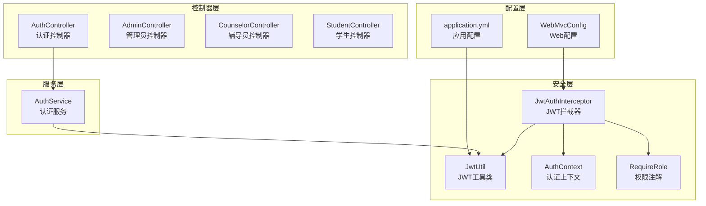
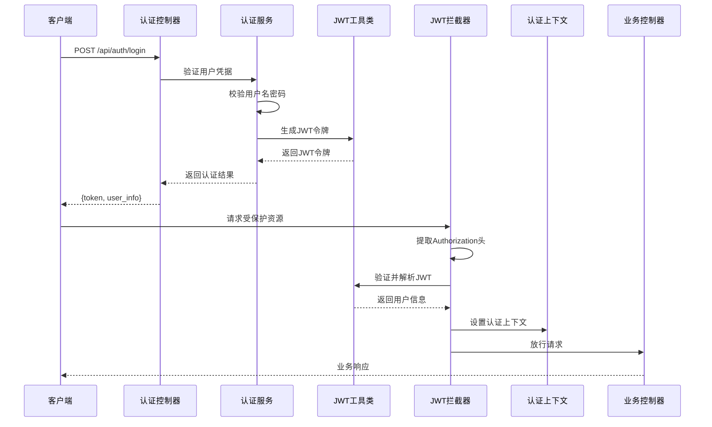
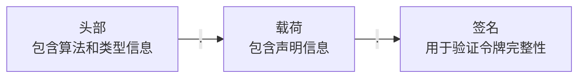
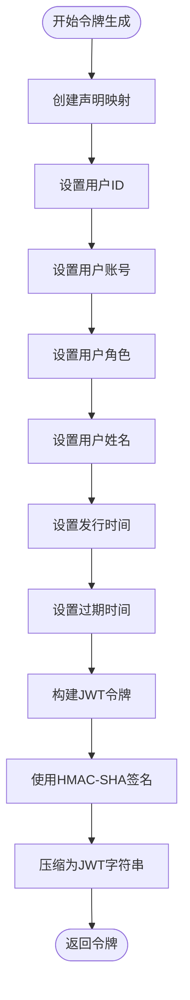
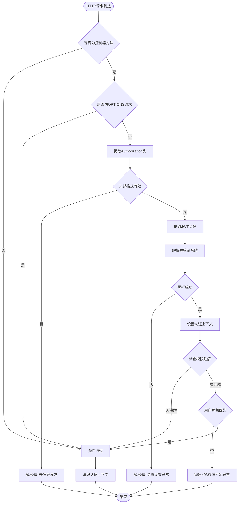
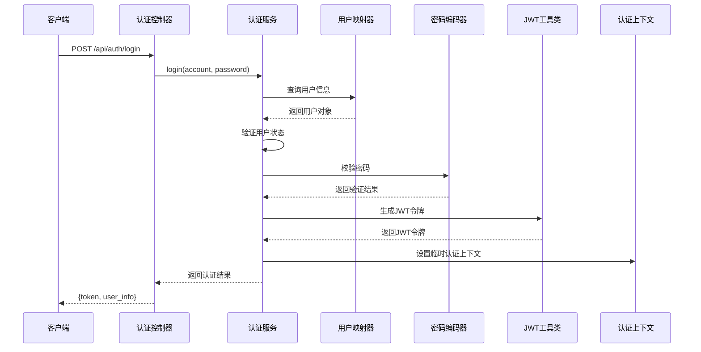
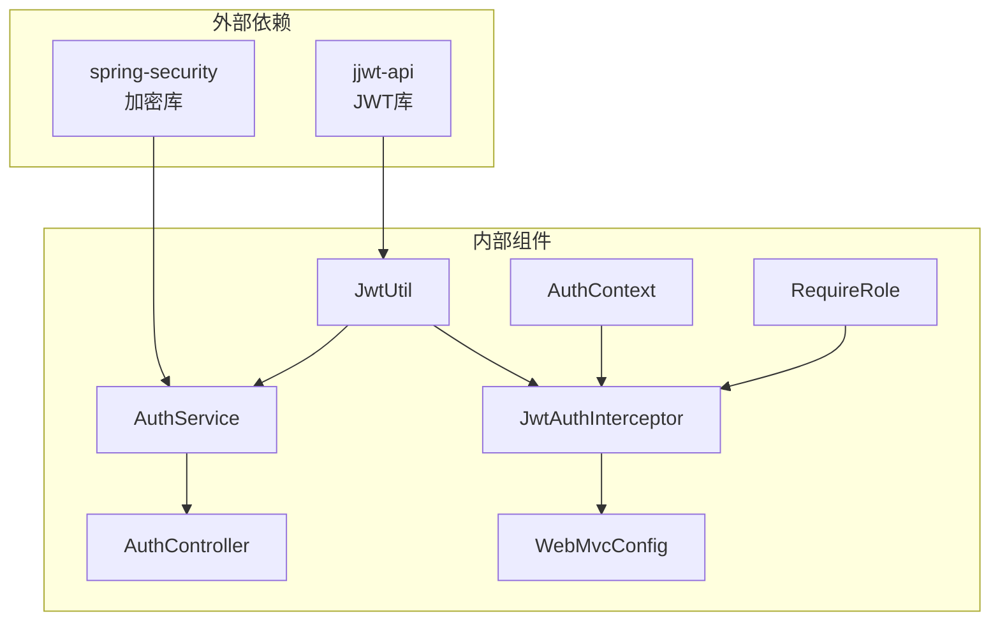

# JWT认证机制

<cite>
**本文档引用的文件**
- [JwtUtil.java](file://backend/src/main/java/com/zjsu/scholarship/security/JwtUtil.java)
- [JwtAuthInterceptor.java](file://backend/src/main/java/com/zjsu/scholarship/security/JwtAuthInterceptor.java)
- [AuthContext.java](file://backend/src/main/java/com/zjsu/scholarship/security/AuthContext.java)
- [RequireRole.java](file://backend/src/main/java/com/zjsu/scholarship/security/RequireRole.java)
- [AuthController.java](file://backend/src/main/java/com/zjsu/scholarship/controller/AuthController.java)
- [AuthService.java](file://backend/src/main/java/com/zjsu/scholarship/service/AuthService.java)
- [WebMvcConfig.java](file://backend/src/main/java/com/zjsu/scholarship/config/WebMvcConfig.java)
- [application.yml](file://backend/src/main/resources/application.yml)
- [R.java](file://backend/src/main/java/com/zjsu/scholarship/common/R.java)
</cite>

## 目录
1. [简介](#简介)
2. [项目结构](#项目结构)
3. [核心组件](#核心组件)
4. [架构概览](#架构概览)
5. [详细组件分析](#详细组件分析)
6. [依赖关系分析](#依赖关系分析)
7. [性能考虑](#性能考虑)
8. [故障排除指南](#故障排除指南)
9. [结论](#结论)
10. [附录](#附录)

## 简介

本项目实现了基于JWT（JSON Web Token）的认证机制，为奖学金申请系统提供安全的身份验证和授权功能。JWT作为一种开放标准（RFC 7519），定义了紧凑且自包含的方式用于在网络应用间安全地传输信息。

该认证系统采用Spring MVC拦截器模式，在请求到达控制器之前进行身份验证和权限检查。系统支持多角色权限控制，包括学生、辅导员和管理员角色，并提供了完整的登录、登出和密码管理功能。

## 项目结构

JWT认证机制在项目中的组织结构如下：



**图表来源**
- [JwtUtil.java:1-52](file://backend/src/main/java/com/zjsu/scholarship/security/JwtUtil.java#L1-L52)
- [JwtAuthInterceptor.java:1-65](file://backend/src/main/java/com/zjsu/scholarship/security/JwtAuthInterceptor.java#L1-L65)
- [WebMvcConfig.java:1-49](file://backend/src/main/java/com/zjsu/scholarship/config/WebMvcConfig.java#L1-L49)

**章节来源**
- [JwtUtil.java:1-52](file://backend/src/main/java/com/zjsu/scholarship/security/JwtUtil.java#L1-L52)
- [JwtAuthInterceptor.java:1-65](file://backend/src/main/java/com/zjsu/scholarship/security/JwtAuthInterceptor.java#L1-L65)
- [WebMvcConfig.java:1-49](file://backend/src/main/java/com/zjsu/scholarship/config/WebMvcConfig.java#L1-L49)

## 核心组件

### JWT工具类（JwtUtil）

JwtUtil是JWT认证机制的核心工具类，负责令牌的生成、解析和验证。该类使用HMAC-SHA算法进行签名，确保令牌的完整性和真实性。

**主要功能：**
- 密钥生成：基于配置的密钥字符串生成HMAC-SHA密钥
- 令牌生成：创建包含用户信息的JWT令牌
- 令牌解析：验证并解析JWT令牌，提取用户信息

**配置参数：**
- `app.jwt.secret`：JWT签名密钥，必须在生产环境中修改
- `app.jwt.expire-hours`：令牌过期时间（小时）

**章节来源**
- [JwtUtil.java:18-26](file://backend/src/main/java/com/zjsu/scholarship/security/JwtUtil.java#L18-L26)
- [JwtUtil.java:28-42](file://backend/src/main/java/com/zjsu/scholarship/security/JwtUtil.java#L28-L42)
- [JwtUtil.java:44-50](file://backend/src/main/java/com/zjsu/scholarship/security/JwtUtil.java#L44-L50)
- [application.yml:42-46](file://backend/src/main/resources/application.yml#L42-L46)

### JWT拦截器（JwtAuthInterceptor）

JwtAuthInterceptor是Spring MVC的拦截器，负责在请求到达控制器之前进行身份验证和权限检查。该拦截器实现了HandlerInterceptor接口，提供了预处理和后处理功能。

**工作流程：**
1. 检查请求是否为OPTIONS预检请求
2. 从Authorization头中提取JWT令牌
3. 验证令牌格式和有效性
4. 解析令牌并设置认证上下文
5. 检查方法级别的权限注解
6. 清理认证上下文

**章节来源**
- [JwtAuthInterceptor.java:20-58](file://backend/src/main/java/com/zjsu/scholarship/security/JwtAuthInterceptor.java#L20-L58)
- [JwtAuthInterceptor.java:60-65](file://backend/src/main/java/com/zjsu/scholarship/security/JwtAuthInterceptor.java#L60-L65)

### 认证上下文（AuthContext）

AuthContext使用ThreadLocal实现线程安全的用户信息存储。它提供了静态方法来设置、获取和清理当前用户的认证信息。

**数据结构：**
- userId：用户标识符
- account：用户账号
- role：用户角色
- name：用户姓名

**章节来源**
- [AuthContext.java:3-20](file://backend/src/main/java/com/zjsu/scholarship/security/AuthContext.java#L3-L20)

### 权限注解（RequireRole）

RequireRole是一个自定义注解，用于在控制器方法或类级别声明所需的访问权限。该注解支持多角色权限控制。

**使用方式：**
- 方法级别：@RequireRole({"ADMIN", "COUNSELOR"})
- 类级别：@RequireRole("STUDENT")

**章节来源**
- [RequireRole.java:8-13](file://backend/src/main/java/com/zjsu/scholarship/security/RequireRole.java#L8-L13)

## 架构概览

JWT认证机制的整体架构采用分层设计，确保了关注点分离和代码的可维护性。



**图表来源**
- [AuthController.java:21-24](file://backend/src/main/java/com/zjsu/scholarship/controller/AuthController.java#L21-L24)
- [AuthService.java:32-55](file://backend/src/main/java/com/zjsu/scholarship/service/AuthService.java#L32-L55)
- [JwtUtil.java:28-42](file://backend/src/main/java/com/zjsu/scholarship/security/JwtUtil.java#L28-L42)
- [JwtAuthInterceptor.java:20-58](file://backend/src/main/java/com/zjsu/scholarship/security/JwtAuthInterceptor.java#L20-L58)

## 详细组件分析

### JWT令牌结构分析

JWT令牌由三部分组成，通过点号（.）分隔：



**头部（Header）内容：**
- alg：签名算法（HMAC SHA）
- typ：令牌类型（JWT）

**载荷（Payload）声明：**
- uid：用户标识符
- account：用户账号
- role：用户角色
- name：用户姓名
- iat：发行时间
- exp：过期时间

**章节来源**
- [JwtUtil.java:28-42](file://backend/src/main/java/com/zjsu/scholarship/security/JwtUtil.java#L28-L42)

### 令牌生成流程



**图表来源**
- [JwtUtil.java:28-42](file://backend/src/main/java/com/zjsu/scholarship/security/JwtUtil.java#L28-L42)

### 身份验证拦截流程



**图表来源**
- [JwtAuthInterceptor.java:20-58](file://backend/src/main/java/com/zjsu/scholarship/security/JwtAuthInterceptor.java#L20-L58)

### 登录认证流程



**图表来源**
- [AuthController.java:21-24](file://backend/src/main/java/com/zjsu/scholarship/controller/AuthController.java#L21-L24)
- [AuthService.java:32-55](file://backend/src/main/java/com/zjsu/scholarship/service/AuthService.java#L32-L55)

**章节来源**
- [AuthController.java:21-24](file://backend/src/main/java/com/zjsu/scholarship/controller/AuthController.java#L21-L24)
- [AuthService.java:32-55](file://backend/src/main/java/com/zjsu/scholarship/service/AuthService.java#L32-L55)

### 权限控制机制

系统实现了基于注解的权限控制机制，支持方法级和类级权限声明：

```mermaid
classDiagram
class RequireRole {
+String[] value()
}
class AuthController {
+login() R~Map~
+me() R~Map~
+changePassword() R~Void~
}
class AdminController {
<<@RequireRole({"ADMIN", "COUNSELOR"})>>
+manageUsers() R~List~
+approveApplications() R~List~
}
class CounselorController {
<<@RequireRole({"COUNSELOR", "ADMIN"})>>
+reviewApplications() R~List~
}
class StudentController {
<<@RequireRole("STUDENT")>>
+applyScholarship() R~List~
}
RequireRole --> AdminController : "注解在类上"
RequireRole --> CounselorController : "注解在类上"
RequireRole --> StudentController : "注解在类上"
```

**图表来源**
- [RequireRole.java:8-13](file://backend/src/main/java/com/zjsu/scholarship/security/RequireRole.java#L8-L13)
- [AdminController.java:21](file://backend/src/main/java/com/zjsu/scholarship/controller/AdminController.java#L21)
- [CounselorController.java:19](file://backend/src/main/java/com/zjsu/scholarship/controller/CounselorController.java#L19)
- [StudentController.java:23](file://backend/src/main/java/com/zjsu/scholarship/controller/StudentController.java#L23)

**章节来源**
- [RequireRole.java:8-13](file://backend/src/main/java/com/zjsu/scholarship/security/RequireRole.java#L8-L13)

## 依赖关系分析

JWT认证机制的依赖关系体现了清晰的关注点分离：



**图表来源**
- [JwtUtil.java:3-7](file://backend/src/main/java/com/zjsu/scholarship/security/JwtUtil.java#L3-L7)
- [AuthService.java:10](file://backend/src/main/java/com/zjsu/scholarship/service/AuthService.java#L10)

**章节来源**
- [JwtUtil.java:3-7](file://backend/src/main/java/com/zjsu/scholarship/security/JwtUtil.java#L3-L7)
- [AuthService.java:10](file://backend/src/main/java/com/zjsu/scholarship/service/AuthService.java#L10)

## 性能考虑

### 令牌缓存策略

当前实现中，JWT令牌在每次请求时都会重新解析和验证。对于高并发场景，可以考虑以下优化：

1. **令牌缓存**：在Redis中缓存最近使用的令牌，减少重复解析
2. **批量验证**：对频繁访问的用户信息进行缓存
3. **异步处理**：使用异步方式处理非关键的权限检查

### 内存管理

- 使用ThreadLocal存储认证上下文，避免内存泄漏
- 在请求完成后及时清理认证上下文
- 合理设置令牌过期时间，平衡安全性与性能

## 故障排除指南

### 常见错误及解决方案

**401 未登录或令牌缺失**
- 检查客户端是否正确设置Authorization头
- 确认令牌格式为"Bearer {token}"
- 验证令牌是否在有效期内

**401 令牌无效或已过期**
- 检查JWT密钥配置是否正确
- 验证服务器时间同步
- 确认令牌签名算法一致

**403 无权限访问该资源**
- 检查用户角色是否正确
- 验证控制器上的权限注解配置
- 确认用户角色与所需权限匹配

**章节来源**
- [JwtAuthInterceptor.java:26-28](file://backend/src/main/java/com/zjsu/scholarship/security/JwtAuthInterceptor.java#L26-L28)
- [JwtAuthInterceptor.java:50-56](file://backend/src/main/java/com/zjsu/scholarship/security/JwtAuthInterceptor.java#L50-L56)

### 调试技巧

1. **启用日志**：在application.yml中调整日志级别
2. **检查配置**：验证JWT密钥和过期时间设置
3. **测试令牌**：使用在线JWT解码器验证令牌结构

**章节来源**
- [application.yml:48-52](file://backend/src/main/resources/application.yml#L48-L52)

## 结论

本JWT认证机制为奖学金申请系统提供了完整、安全的身份验证和授权解决方案。系统采用Spring MVC拦截器模式，实现了透明的身份验证，无需在每个控制器方法中重复编写认证逻辑。

**主要优势：**
- **安全性**：使用HMAC-SHA算法确保令牌完整性
- **灵活性**：支持多角色权限控制和细粒度权限管理
- **易用性**：通过注解简化权限控制的实现
- **可扩展性**：模块化设计便于功能扩展

**改进建议：**
- 实现令牌刷新机制
- 添加令牌撤销列表（Blacklist）
- 集成OAuth 2.0或OpenID Connect
- 实施更严格的CORS配置

## 附录

### JWT配置参数说明

| 参数名 | 默认值 | 描述 | 生产环境建议 |
|--------|--------|------|-------------|
| app.jwt.secret | zjsu-scholarship-secret-key-2026-please-change-in-production-zjsu | JWT签名密钥 | 必须修改为强随机字符串 |
| app.jwt.expire-hours | 24 | 令牌过期时间（小时） | 根据业务需求调整，建议1-48小时 |
| app.upload-dir | ./uploads | 文件上传目录 | 确保目录存在且有写权限 |

**章节来源**
- [application.yml:42-46](file://backend/src/main/resources/application.yml#L42-L46)

### 安全最佳实践

**令牌安全：**
- 使用HTTPS传输JWT令牌
- 设置合理的过期时间
- 在客户端安全存储令牌
- 实施令牌刷新机制

**密钥管理：**
- 使用强随机字符串作为密钥
- 定期轮换JWT密钥
- 在不同环境使用不同的密钥
- 限制密钥访问权限

**常见安全威胁及防护：**

1. **令牌泄露防护**
   - 避免在URL中传递JWT
   - 使用HttpOnly Cookie存储令牌
   - 实施CORS白名单策略

2. **跨站脚本攻击（XSS）防护**
   - 对用户输入进行严格验证
   - 实施内容安全策略（CSP）
   - 使用输出编码防止脚本注入

3. **跨域请求伪造（CSRF）防护**
   - 验证请求来源域名
   - 实施同源策略检查
   - 使用CSRF令牌验证

**章节来源**
- [WebMvcConfig.java:34-41](file://backend/src/main/java/com/zjsu/scholarship/config/WebMvcConfig.java#L34-L41)