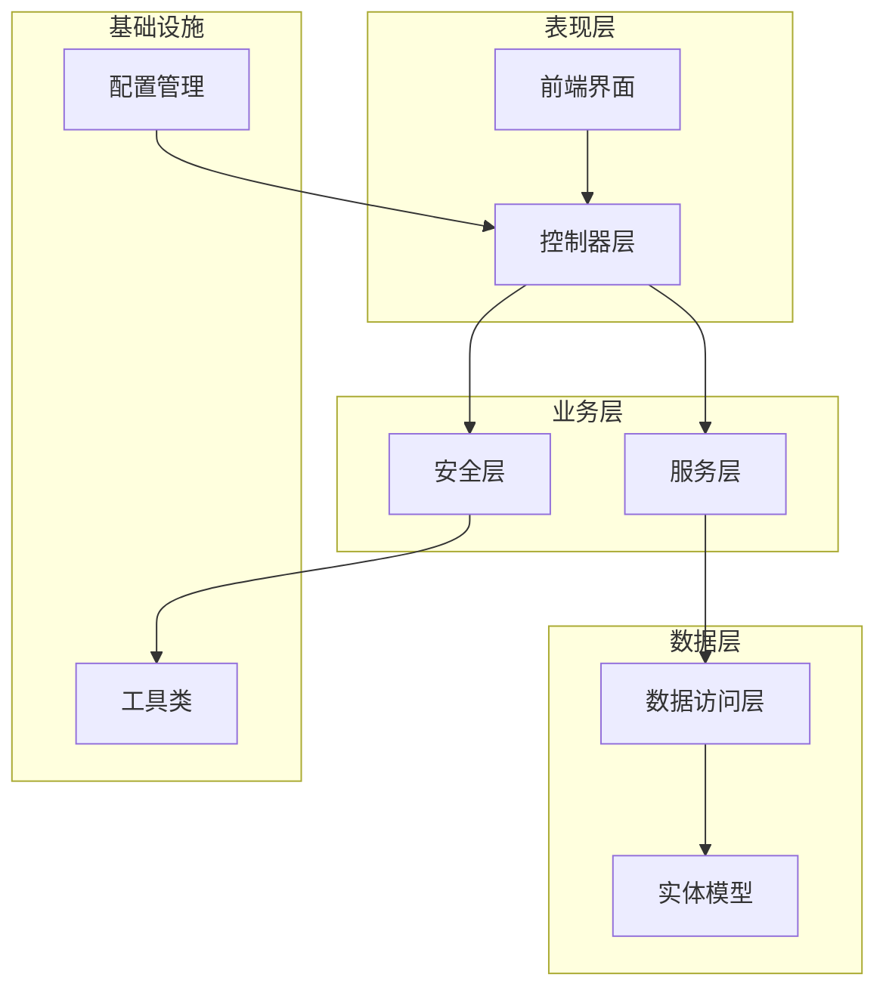
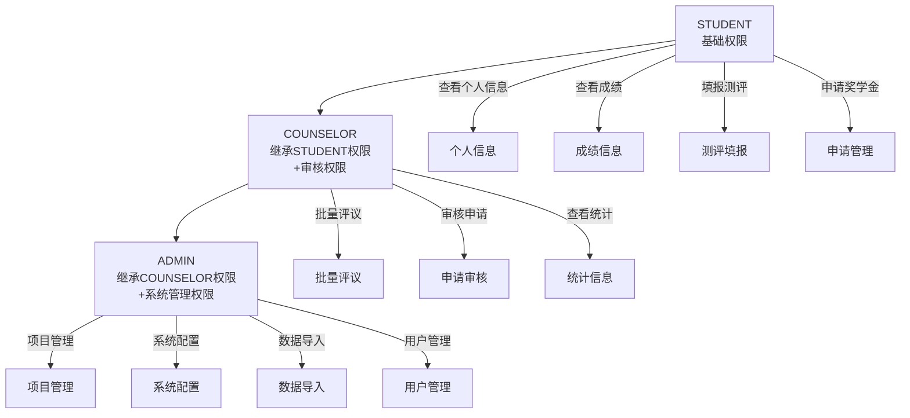
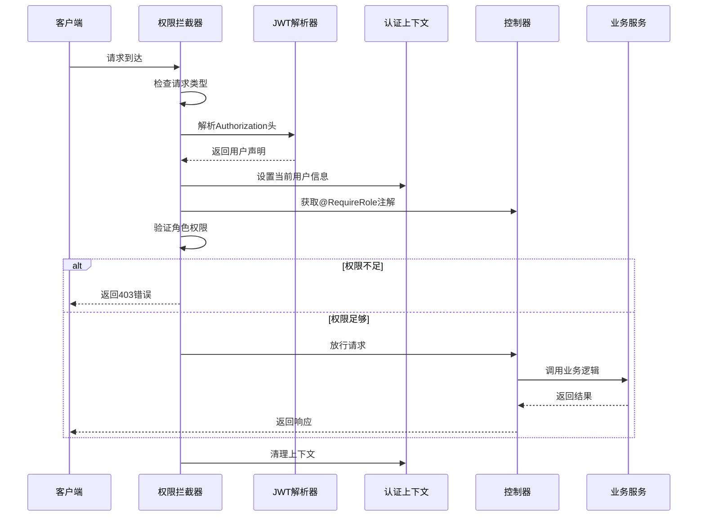
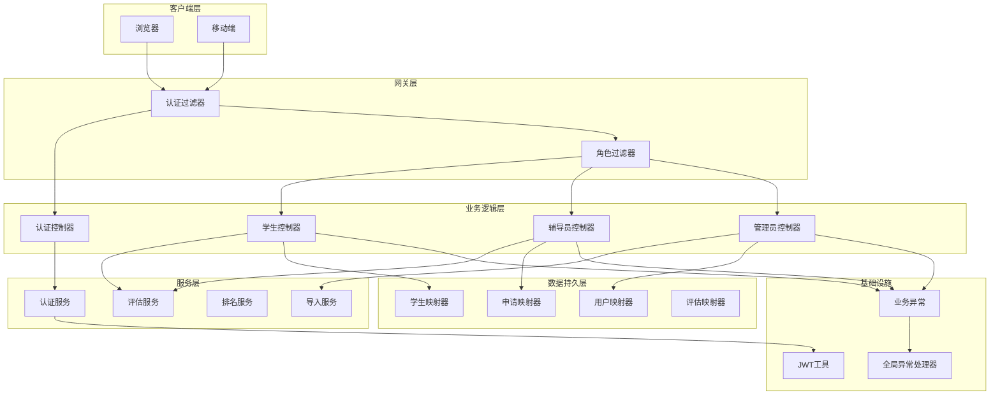
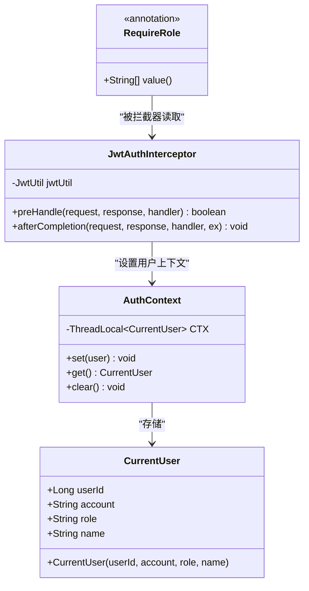
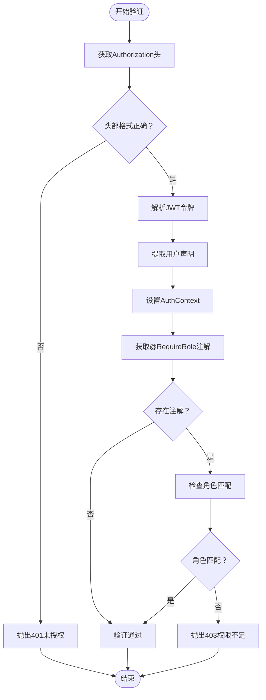
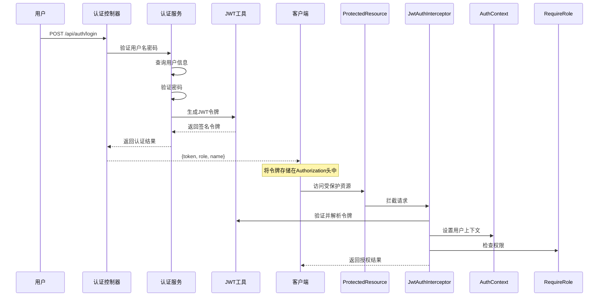
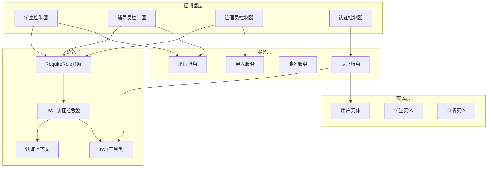
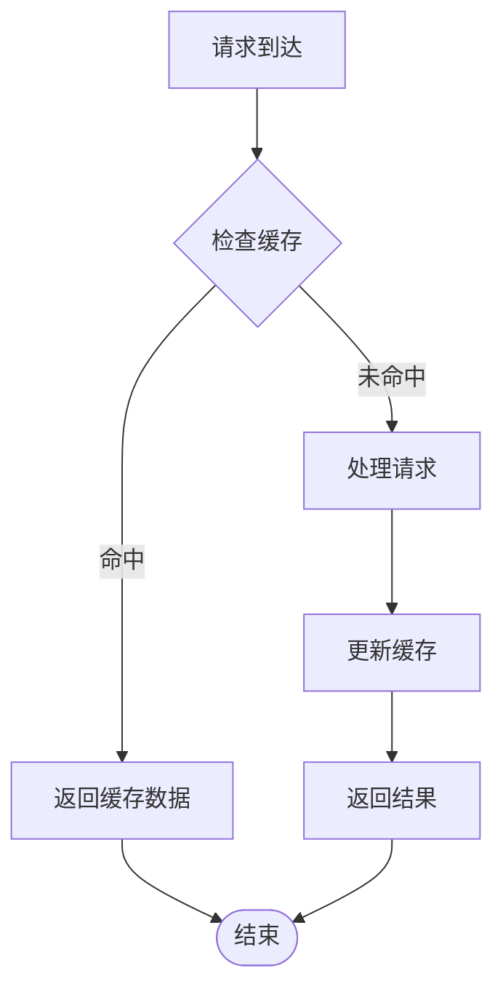

# 基于角色的访问控制

<cite>
**本文档引用的文件**
- [RequireRole.java](file://backend/src/main/java/com/zjsu/scholarship/security/RequireRole.java)
- [JwtAuthInterceptor.java](file://backend/src/main/java/com/zjsu/scholarship/security/JwtAuthInterceptor.java)
- [AuthContext.java](file://backend/src/main/java/com/zjsu/scholarship/security/AuthContext.java)
- [JwtUtil.java](file://backend/src/main/java/com/zjsu/scholarship/security/JwtUtil.java)
- [AdminController.java](file://backend/src/main/java/com/zjsu/scholarship/controller/AdminController.java)
- [CounselorController.java](file://backend/src/main/java/com/zjsu/scholarship/controller/CounselorController.java)
- [StudentController.java](file://backend/src/main/java/com/zjsu/scholarship/controller/StudentController.java)
- [AuthController.java](file://backend/src/main/java/com/zjsu/scholarship/controller/AuthController.java)
- [AuthService.java](file://backend/src/main/java/com/zjsu/scholarship/service/AuthService.java)
- [User.java](file://backend/src/main/java/com/zjsu/scholarship/entity/User.java)
- [GlobalExceptionHandler.java](file://backend/src/main/java/com/zjsu/scholarship/common/GlobalExceptionHandler.java)
- [BusinessException.java](file://backend/src/main/java/com/zjsu/scholarship/common/BusinessException.java)
- [application.yml](file://backend/src/main/resources/application.yml)
</cite>

## 目录
1. [简介](#简介)
2. [项目结构](#项目结构)
3. [核心组件](#核心组件)
4. [架构概览](#架构概览)
5. [详细组件分析](#详细组件分析)
6. [依赖关系分析](#依赖关系分析)
7. [性能考虑](#性能考虑)
8. [故障排除指南](#故障排除指南)
9. [结论](#结论)
10. [附录](#附录)

## 简介

本系统实现了基于角色的访问控制（RBAC）机制，支持三种核心角色：STUDENT（学生）、COUNSELOR（辅导员）和 ADMIN（管理员）。通过JWT令牌认证和拦截器权限验证，确保用户只能访问其权限范围内的功能。

系统采用注解驱动的权限控制方式，通过@RequireRole注解在控制器层面实现细粒度的权限管理。每个角色都有明确的功能边界和权限范围，从基础的信息查看到复杂的系统管理功能。

## 项目结构

系统采用分层架构设计，主要分为以下层次：

**图表来源**
- [application.yml:1-52](file://backend/src/main/resources/application.yml#L1-L52)

**章节来源**
- [application.yml:1-52](file://backend/src/main/resources/application.yml#L1-L52)

## 核心组件

### 角色定义与权限矩阵

系统定义了三种核心角色，每种角色具有不同的权限范围：

| 功能模块 | STUDENT | COUNSELOR | ADMIN |
|---------|---------|-----------|-------|
| **个人信息** | ✓ 查看/编辑 | - | - |
| **学业成绩** | ✓ 查看 | - | - |
| **综合测评** | ✓ 填报/修改 | - | - |
| **奖学金申请** | ✓ 申请/撤回 | - | - |
| **申诉处理** | ✓ 提交/查看 | - | - |
| **辅导员评议** | - | ✓ 批量评议 | - |
| **申请审核** | - | ✓ 审核/批量审核 | - |
| **项目管理** | - | - | ✓ 创建/编辑/删除 |
| **系统配置** | - | - | ✓ 配置管理 |
| **数据导入** | - | - | ✓ 批量导入 |
| **人员管理** | - | - | ✓ 用户管理 |
| **统计报表** | - | ✓ 查看 | ✓ 查看 |

### 权限继承关系

**图表来源**
- [StudentController.java:24](file://backend/src/main/java/com/zjsu/scholarship/controller/StudentController.java#L24)
- [CounselorController.java:21](file://backend/src/main/java/com/zjsu/scholarship/controller/CounselorController.java#L21)
- [AdminController.java:23](file://backend/src/main/java/com/zjsu/scholarship/controller/AdminController.java#L23)

### 权限验证流程

**图表来源**
- [JwtAuthInterceptor.java:21-58](file://backend/src/main/java/com/zjsu/scholarship/security/JwtAuthInterceptor.java#L21-L58)
- [AuthContext.java:6-8](file://backend/src/main/java/com/zjsu/scholarship/security/AuthContext.java#L6-L8)

**章节来源**
- [RequireRole.java:8-12](file://backend/src/main/java/com/zjsu/scholarship/security/RequireRole.java#L8-L12)
- [JwtAuthInterceptor.java:20-58](file://backend/src/main/java/com/zjsu/scholarship/security/JwtAuthInterceptor.java#L20-L58)

## 架构概览

系统采用Spring MVC框架，结合JWT令牌实现无状态认证。整体架构遵循分层设计原则，确保关注点分离和代码可维护性。

**图表来源**
- [AuthController.java:21-43](file://backend/src/main/java/com/zjsu/scholarship/controller/AuthController.java#L21-L43)
- [AuthService.java:32-55](file://backend/src/main/java/com/zjsu/scholarship/service/AuthService.java#L32-L55)
- [JwtAuthInterceptor.java:12-58](file://backend/src/main/java/com/zjsu/scholarship/security/JwtAuthInterceptor.java#L12-L58)

## 详细组件分析

### 注解驱动的权限控制

#### RequireRole注解实现

RequireRole注解是系统权限控制的核心机制，采用运行时注解的方式实现方法级和类级的权限控制。

**图表来源**
- [RequireRole.java:10-12](file://backend/src/main/java/com/zjsu/scholarship/security/RequireRole.java#L10-L12)
- [JwtAuthInterceptor.java:14-18](file://backend/src/main/java/com/zjsu/scholarship/security/JwtAuthInterceptor.java#L14-L18)
- [AuthContext.java:10-18](file://backend/src/main/java/com/zjsu/scholarship/security/AuthContext.java#L10-L18)

RequireRole注解的关键特性：

1. **作用域支持**：同时支持方法级别和类级别注解
2. **多角色支持**：value属性接受字符串数组，支持多个角色
3. **运行时生效**：RetentionPolicy设置为RUNTIME，确保在运行时可读取

**章节来源**
- [RequireRole.java:8-12](file://backend/src/main/java/com/zjsu/scholarship/security/RequireRole.java#L8-L12)

#### 权限验证算法

**图表来源**
- [JwtAuthInterceptor.java:25-50](file://backend/src/main/java/com/zjsu/scholarship/security/JwtAuthInterceptor.java#L25-L50)

**章节来源**
- [JwtAuthInterceptor.java:20-58](file://backend/src/main/java/com/zjsu/scholarship/security/JwtAuthInterceptor.java#L20-L58)

### 角色权限实现

#### 学生角色权限

学生角色拥有最基础的权限，主要集中在个人相关信息管理和基本的奖学金申请功能。

**核心权限范围**：
- 查看个人信息和成绩
- 填报和修改个人综合测评
- 申请和撤回奖学金
- 提交和查看申诉

**章节来源**
- [StudentController.java:24](file://backend/src/main/java/com/zjsu/scholarship/controller/StudentController.java#L24)

#### 辅导员角色权限

辅导员角色在学生权限基础上增加了审核和评议功能，负责整个奖学金评审流程的中间环节。

**核心权限范围**：
- 批量对学生进行品德评议
- 审核学生的各项申请
- 批量审核多个申请
- 查看和管理相关统计数据

**章节来源**
- [CounselorController.java:21](file://backend/src/main/java/com/zjsu/scholarship/controller/CounselorController.java#L21)

#### 管理员角色权限

管理员拥有系统的最高权限，负责整个系统的配置和管理。

**核心权限范围**：
- 项目和规则的完整管理
- 系统配置和参数设置
- 数据导入和导出
- 用户和权限管理
- 统计报表和数据分析

**章节来源**
- [AdminController.java:23](file://backend/src/main/java/com/zjsu/scholarship/controller/AdminController.java#L23)

### 认证与授权流程

**图表来源**
- [AuthController.java:21-43](file://backend/src/main/java/com/zjsu/scholarship/controller/AuthController.java#L21-L43)
- [AuthService.java:32-55](file://backend/src/main/java/com/zjsu/scholarship/service/AuthService.java#L32-L55)
- [JwtAuthInterceptor.java:20-58](file://backend/src/main/java/com/zjsu/scholarship/security/JwtAuthInterceptor.java#L20-L58)

**章节来源**
- [AuthController.java:21-43](file://backend/src/main/java/com/zjsu/scholarship/controller/AuthController.java#L21-L43)
- [AuthService.java:32-55](file://backend/src/main/java/com/zjsu/scholarship/service/AuthService.java#L32-L55)

## 依赖关系分析

系统采用松耦合的设计，各组件之间的依赖关系清晰明确：

**图表来源**
- [RequireRole.java:1-13](file://backend/src/main/java/com/zjsu/scholarship/security/RequireRole.java#L1-L13)
- [JwtAuthInterceptor.java:1-65](file://backend/src/main/java/com/zjsu/scholarship/security/JwtAuthInterceptor.java#L1-L65)
- [StudentController.java:1-25](file://backend/src/main/java/com/zjsu/scholarship/controller/StudentController.java#L1-L25)

**章节来源**
- [RequireRole.java:1-13](file://backend/src/main/java/com/zjsu/scholarship/security/RequireRole.java#L1-L13)
- [JwtAuthInterceptor.java:1-65](file://backend/src/main/java/com/zjsu/scholarship/security/JwtAuthInterceptor.java#L1-L65)

## 性能考虑

### JWT令牌优化

系统使用JWT令牌实现无状态认证，具有以下性能优势：

1. **无状态设计**：服务器不需要存储会话信息
2. **跨域支持**：便于前后端分离部署
3. **轻量传输**：令牌大小适中，网络传输开销小

### 缓存策略

### 异常处理优化

系统采用统一的异常处理机制，确保错误信息的一致性和用户体验的稳定性。

**章节来源**
- [GlobalExceptionHandler.java:12-21](file://backend/src/main/java/com/zjsu/scholarship/common/GlobalExceptionHandler.java#L12-L21)

## 故障排除指南

### 常见权限问题

| 问题现象 | 可能原因 | 解决方案 |
|---------|---------|---------|
| 401 未授权 | 令牌缺失或格式错误 | 检查Authorization头格式，确保Bearer前缀 |
| 403 权限不足 | 用户角色不满足要求 | 确认用户角色配置，检查@RequireRole注解 |
| 令牌过期 | JWT过期时间已到 | 重新登录获取新令牌 |
| 角色验证失败 | 服务器重启后上下文丢失 | 确保拦截器正确清理AuthContext |

### 调试技巧

1. **启用详细日志**：在application.yml中调整日志级别
2. **检查令牌内容**：使用JWT调试工具查看令牌声明
3. **验证用户状态**：确认用户账户状态为ACTIVE

**章节来源**
- [GlobalExceptionHandler.java:10-22](file://backend/src/main/java/com/zjsu/scholarship/common/GlobalExceptionHandler.java#L10-L22)
- [BusinessException.java:3-19](file://backend/src/main/java/com/zjsu/scholarship/common/BusinessException.java#L3-L19)

## 结论

本RBAC系统通过注解驱动的方式实现了灵活而强大的权限控制机制。系统设计充分考虑了扩展性和维护性，三种角色的权限边界清晰，既保证了系统的安全性，又提供了良好的用户体验。

关键优势包括：
- **简洁的权限模型**：三种角色覆盖主要业务场景
- **注解驱动**：开发简单，维护方便
- **安全可靠**：基于JWT的无状态认证
- **性能优良**：无状态设计减少服务器负担

## 附录

### 最佳实践建议

1. **权限设计原则**
   - 最小权限原则：只授予必要的最小权限
   - 职责分离：敏感操作需要更高权限
   - 定期审计：定期检查权限分配合理性

2. **代码规范**
   - 在控制器类和方法上合理使用@RequireRole注解
   - 对于敏感操作，优先使用方法级注解
   - 避免在业务逻辑中重复检查权限

3. **安全配置**
   - 生产环境必须修改默认JWT密钥
   - 合理设置令牌过期时间
   - 实施适当的速率限制

4. **监控和日志**
   - 记录所有权限相关的操作日志
   - 监控异常权限访问尝试
   - 定期分析权限使用模式