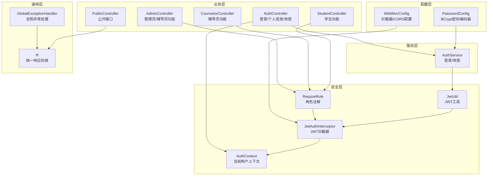
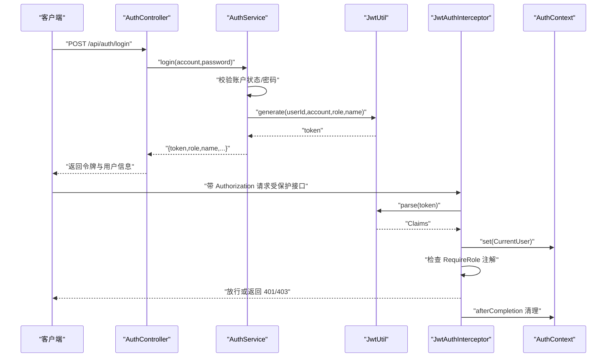
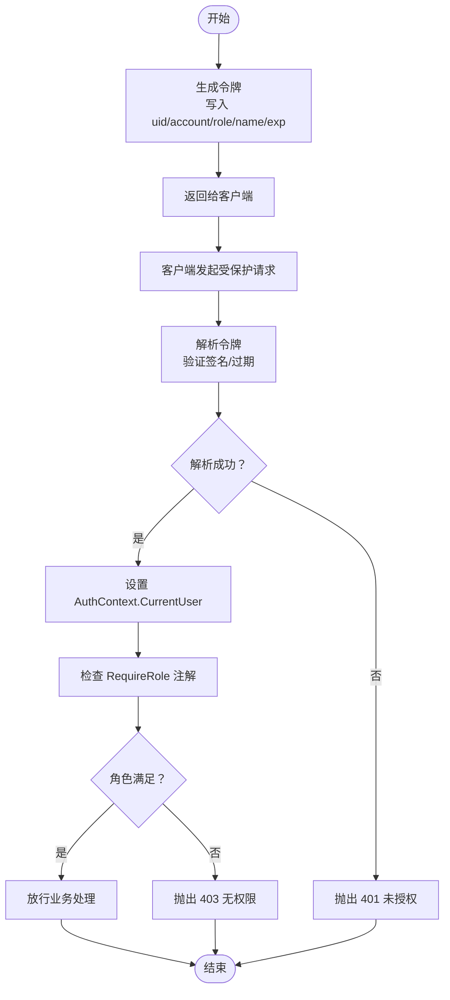
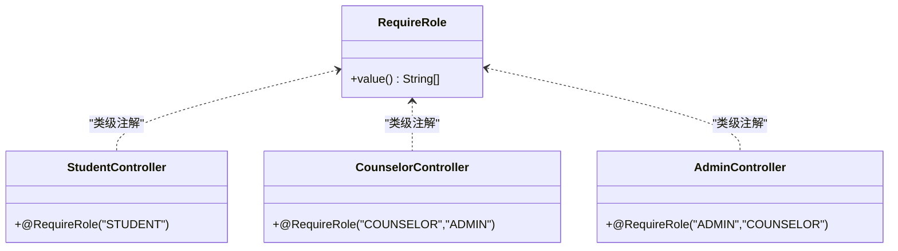
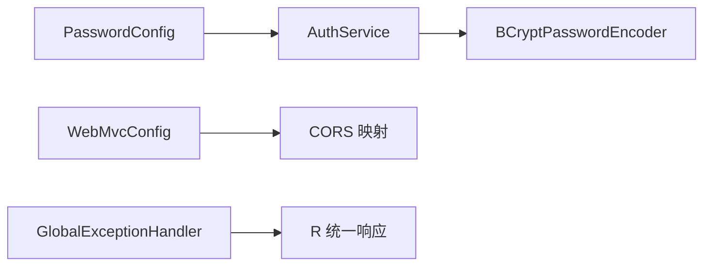
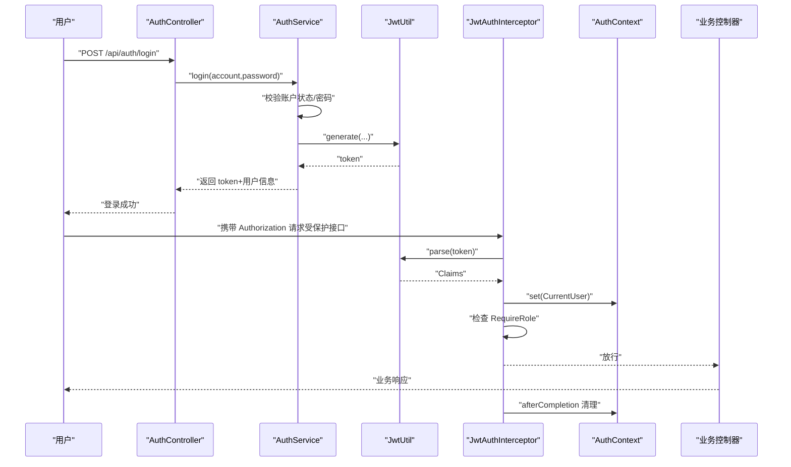
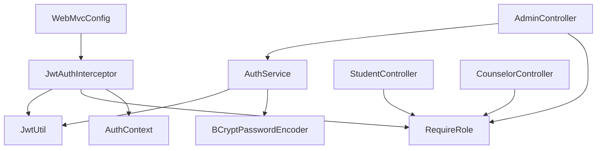

# 安全架构

<cite>
**本文引用的文件**
- [JwtUtil.java](file://backend/src/main/java/com/zjsu/scholarship/security/JwtUtil.java)
- [JwtAuthInterceptor.java](file://backend/src/main/java/com/zjsu/scholarship/security/JwtAuthInterceptor.java)
- [AuthContext.java](file://backend/src/main/java/com/zjsu/scholarship/security/AuthContext.java)
- [RequireRole.java](file://backend/src/main/java/com/zjsu/scholarship/security/RequireRole.java)
- [WebMvcConfig.java](file://backend/src/main/java/com/zjsu/scholarship/config/WebMvcConfig.java)
- [PasswordConfig.java](file://backend/src/main/java/com/zjsu/scholarship/config/PasswordConfig.java)
- [AuthService.java](file://backend/src/main/java/com/zjsu/scholarship/service/AuthService.java)
- [AuthController.java](file://backend/src/main/java/com/zjsu/scholarship/controller/AuthController.java)
- [AdminController.java](file://backend/src/main/java/com/zjsu/scholarship/controller/AdminController.java)
- [CounselorController.java](file://backend/src/main/java/com/zjsu/scholarship/controller/CounselorController.java)
- [StudentController.java](file://backend/src/main/java/com/zjsu/scholarship/controller/StudentController.java)
- [PublicController.java](file://backend/src/main/java/com/zjsu/scholarship/controller/PublicController.java)
- [GlobalExceptionHandler.java](file://backend/src/main/java/com/zjsu/scholarship/common/GlobalExceptionHandler.java)
- [R.java](file://backend/src/main/java/com/zjsu/scholarship/common/R.java)
- [User.java](file://backend/src/main/java/com/zjsu/scholarship/entity/User.java)
- [SchoolAuthMock.java](file://backend/src/main/java/com/zjsu/scholarship/entity/SchoolAuthMock.java)
- [application.yml](file://backend/src/main/resources/application.yml)
</cite>

## 目录
1. [引言](#引言)
2. [项目结构](#项目结构)
3. [核心组件](#核心组件)
4. [架构总览](#架构总览)
5. [详细组件分析](#详细组件分析)
6. [依赖分析](#依赖分析)
7. [性能考虑](#性能考虑)
8. [故障排查指南](#故障排查指南)
9. [结论](#结论)
10. [附录](#附录)

## 引言
本文件面向奖学金管理系统，系统性阐述其安全架构与权限控制机制。重点覆盖以下方面：
- JWT（JSON Web Token）认证：令牌生成、签名验证、过期处理与刷新机制设计建议
- 基于角色的访问控制（RBAC）：STUDENT、COUNSELOR、ADMIN 的权限边界与功能限制
- Spring Security 集成方案：密码加密策略（BCrypt）、CORS 跨域配置与全局异常处理
- 完整认证流程图：从用户登录到权限验证的全过程
- 安全最佳实践：密码强度、会话管理、CSRF 防护等
- 安全漏洞预防与应急响应机制
- 安全配置调试方法与常见问题排查

## 项目结构
后端采用 Spring Boot + MyBatis-Plus 架构，安全相关代码集中在 security、config、controller、service、common 包中，并通过拦截器与注解实现统一鉴权。

图表来源
- [JwtUtil.java:1-52](file://backend/src/main/java/com/zjsu/scholarship/security/JwtUtil.java#L1-L52)
- [JwtAuthInterceptor.java:1-65](file://backend/src/main/java/com/zjsu/scholarship/security/JwtAuthInterceptor.java#L1-L65)
- [AuthContext.java:1-20](file://backend/src/main/java/com/zjsu/scholarship/security/AuthContext.java#L1-L20)
- [RequireRole.java:1-13](file://backend/src/main/java/com/zjsu/scholarship/security/RequireRole.java#L1-L13)
- [WebMvcConfig.java:1-49](file://backend/src/main/java/com/zjsu/scholarship/config/WebMvcConfig.java#L1-L49)
- [PasswordConfig.java:1-15](file://backend/src/main/java/com/zjsu/scholarship/config/PasswordConfig.java#L1-L15)
- [AuthService.java:1-77](file://backend/src/main/java/com/zjsu/scholarship/service/AuthService.java#L1-L77)
- [AuthController.java:1-44](file://backend/src/main/java/com/zjsu/scholarship/controller/AuthController.java#L1-L44)
- [StudentController.java:1-719](file://backend/src/main/java/com/zjsu/scholarship/controller/StudentController.java#L1-L719)
- [CounselorController.java:1-391](file://backend/src/main/java/com/zjsu/scholarship/controller/CounselorController.java#L1-L391)
- [AdminController.java:1-528](file://backend/src/main/java/com/zjsu/scholarship/controller/AdminController.java#L1-L528)
- [PublicController.java:1-78](file://backend/src/main/java/com/zjsu/scholarship/controller/PublicController.java#L1-L78)
- [GlobalExceptionHandler.java:1-23](file://backend/src/main/java/com/zjsu/scholarship/common/GlobalExceptionHandler.java#L1-L23)
- [R.java:1-39](file://backend/src/main/java/com/zjsu/scholarship/common/R.java#L1-L39)

章节来源
- [WebMvcConfig.java:1-49](file://backend/src/main/java/com/zjsu/scholarship/config/WebMvcConfig.java#L1-L49)
- [application.yml:1-52](file://backend/src/main/resources/application.yml#L1-L52)

## 核心组件
- JWT 工具：负责令牌生成与解析，使用对称密钥签名，支持自定义过期时间
- JWT 拦截器：统一处理 Authorization 头，解析令牌，注入当前用户上下文，并根据注解进行角色校验
- 角色注解：在类或方法上声明所需角色集合，实现细粒度权限控制
- 当前用户上下文：线程本地存储当前登录用户信息，供业务层读取
- 密码配置：提供 BCrypt 编码器 Bean，用于密码哈希与匹配
- 认证服务：登录校验（账户状态、密码或初始口令）、令牌签发；改密校验与更新
- 控制器：登录、个人信息、改密；按角色划分的业务控制器；公开接口
- 全局异常处理：捕获业务异常与未捕获异常，统一返回标准响应

章节来源
- [JwtUtil.java:1-52](file://backend/src/main/java/com/zjsu/scholarship/security/JwtUtil.java#L1-L52)
- [JwtAuthInterceptor.java:1-65](file://backend/src/main/java/com/zjsu/scholarship/security/JwtAuthInterceptor.java#L1-L65)
- [RequireRole.java:1-13](file://backend/src/main/java/com/zjsu/scholarship/security/RequireRole.java#L1-L13)
- [AuthContext.java:1-20](file://backend/src/main/java/com/zjsu/scholarship/security/AuthContext.java#L1-L20)
- [PasswordConfig.java:1-15](file://backend/src/main/java/com/zjsu/scholarship/config/PasswordConfig.java#L1-L15)
- [AuthService.java:1-77](file://backend/src/main/java/com/zjsu/scholarship/service/AuthService.java#L1-L77)
- [AuthController.java:1-44](file://backend/src/main/java/com/zjsu/scholarship/controller/AuthController.java#L1-L44)
- [GlobalExceptionHandler.java:1-23](file://backend/src/main/java/com/zjsu/scholarship/common/GlobalExceptionHandler.java#L1-L23)
- [R.java:1-39](file://backend/src/main/java/com/zjsu/scholarship/common/R.java#L1-L39)

## 架构总览
系统采用“拦截器 + 注解 + 上下文”的统一鉴权模式：
- 登录成功后签发 JWT，客户端在后续请求头携带 Authorization: Bearer <token>
- 拦截器解析令牌，填充 AuthContext，随后根据 RequireRole 注解进行角色判定
- 业务控制器仅关注业务逻辑，无需重复处理鉴权细节
- 全局异常处理器统一输出错误信息，避免敏感堆栈泄露

图表来源
- [AuthController.java:1-44](file://backend/src/main/java/com/zjsu/scholarship/controller/AuthController.java#L1-L44)
- [AuthService.java:1-77](file://backend/src/main/java/com/zjsu/scholarship/service/AuthService.java#L1-L77)
- [JwtUtil.java:1-52](file://backend/src/main/java/com/zjsu/scholarship/security/JwtUtil.java#L1-L52)
- [JwtAuthInterceptor.java:1-65](file://backend/src/main/java/com/zjsu/scholarship/security/JwtAuthInterceptor.java#L1-L65)
- [AuthContext.java:1-20](file://backend/src/main/java/com/zjsu/scholarship/security/AuthContext.java#L1-L20)

## 详细组件分析

### JWT 认证组件
- 令牌生成：包含用户标识、账号、角色、姓名等声明，设置签发时间与过期时间
- 令牌解析：使用相同密钥进行签名验证，提取声明并构建当前用户对象
- 过期处理：拦截器在解析失败时抛出业务异常，前端可据此提示重新登录
- 刷新机制：当前实现未内置自动刷新，建议在生产环境引入短期访问令牌 + 长期刷新令牌策略，并在拦截器中增加刷新逻辑

图表来源
- [JwtUtil.java:1-52](file://backend/src/main/java/com/zjsu/scholarship/security/JwtUtil.java#L1-L52)
- [JwtAuthInterceptor.java:1-65](file://backend/src/main/java/com/zjsu/scholarship/security/JwtAuthInterceptor.java#L1-L65)
- [RequireRole.java:1-13](file://backend/src/main/java/com/zjsu/scholarship/security/RequireRole.java#L1-L13)
- [AuthContext.java:1-20](file://backend/src/main/java/com/zjsu/scholarship/security/AuthContext.java#L1-L20)

章节来源
- [JwtUtil.java:1-52](file://backend/src/main/java/com/zjsu/scholarship/security/JwtUtil.java#L1-L52)
- [JwtAuthInterceptor.java:1-65](file://backend/src/main/java/com/zjsu/scholarship/security/JwtAuthInterceptor.java#L1-L65)
- [application.yml:42-46](file://backend/src/main/resources/application.yml#L42-L46)

### RBAC 权限模型
- 角色定义：STUDENT、COUNSELOR、ADMIN
- 角色边界：
  - STUDENT：仅能访问自身相关数据与申请流程
  - COUNSELOR：可审核学生材料、批量评议、查看待审列表等
  - ADMIN：具备管理员功能，部分端点仅 ADMIN 可用
- 实现方式：控制器类或方法上标注 RequireRole，拦截器在 preHandle 中读取注解并比对当前用户角色

图表来源
- [RequireRole.java:1-13](file://backend/src/main/java/com/zjsu/scholarship/security/RequireRole.java#L1-L13)
- [StudentController.java:1-719](file://backend/src/main/java/com/zjsu/scholarship/controller/StudentController.java#L1-L719)
- [CounselorController.java:1-391](file://backend/src/main/java/com/zjsu/scholarship/controller/CounselorController.java#L1-L391)
- [AdminController.java:1-528](file://backend/src/main/java/com/zjsu/scholarship/controller/AdminController.java#L1-L528)

章节来源
- [StudentController.java:1-719](file://backend/src/main/java/com/zjsu/scholarship/controller/StudentController.java#L1-L719)
- [CounselorController.java:1-391](file://backend/src/main/java/com/zjsu/scholarship/controller/CounselorController.java#L1-L391)
- [AdminController.java:1-528](file://backend/src/main/java/com/zjsu/scholarship/controller/AdminController.java#L1-L528)

### Spring Security 集成与配置
- 密码加密：通过 PasswordConfig 提供 BCryptPasswordEncoder Bean，AuthService 使用 matches/encode 完成密码校验与更新
- CORS：WebMvcConfig 对所有路径开放跨域，允许 OPTIONS 方法，允许任意头部与凭据
- 全局异常：GlobalExceptionHandler 捕获 BusinessException 返回统一格式，其他异常记录日志并返回通用错误

图表来源
- [PasswordConfig.java:1-15](file://backend/src/main/java/com/zjsu/scholarship/config/PasswordConfig.java#L1-L15)
- [AuthService.java:1-77](file://backend/src/main/java/com/zjsu/scholarship/service/AuthService.java#L1-L77)
- [WebMvcConfig.java:1-49](file://backend/src/main/java/com/zjsu/scholarship/config/WebMvcConfig.java#L1-L49)
- [GlobalExceptionHandler.java:1-23](file://backend/src/main/java/com/zjsu/scholarship/common/GlobalExceptionHandler.java#L1-L23)
- [R.java:1-39](file://backend/src/main/java/com/zjsu/scholarship/common/R.java#L1-L39)

章节来源
- [PasswordConfig.java:1-15](file://backend/src/main/java/com/zjsu/scholarship/config/PasswordConfig.java#L1-L15)
- [WebMvcConfig.java:1-49](file://backend/src/main/java/com/zjsu/scholarship/config/WebMvcConfig.java#L1-L49)
- [GlobalExceptionHandler.java:1-23](file://backend/src/main/java/com/zjsu/scholarship/common/GlobalExceptionHandler.java#L1-L23)

### 认证与授权流程（完整）

图表来源
- [AuthController.java:1-44](file://backend/src/main/java/com/zjsu/scholarship/controller/AuthController.java#L1-L44)
- [AuthService.java:1-77](file://backend/src/main/java/com/zjsu/scholarship/service/AuthService.java#L1-L77)
- [JwtUtil.java:1-52](file://backend/src/main/java/com/zjsu/scholarship/security/JwtUtil.java#L1-L52)
- [JwtAuthInterceptor.java:1-65](file://backend/src/main/java/com/zjsu/scholarship/security/JwtAuthInterceptor.java#L1-L65)
- [AuthContext.java:1-20](file://backend/src/main/java/com/zjsu/scholarship/security/AuthContext.java#L1-L20)
- [StudentController.java:1-719](file://backend/src/main/java/com/zjsu/scholarship/controller/StudentController.java#L1-L719)

## 依赖分析
- 组件耦合：
  - JwtAuthInterceptor 依赖 JwtUtil 与 RequireRole 注解
  - AuthContext 作为轻量上下文，被各控制器读取
  - WebMvcConfig 将 JwtAuthInterceptor 应用于 /api/** 并排除登录与公开接口
  - AuthService 依赖 JwtUtil、PasswordEncoder、User/SchoolAuthMock 数据模型
- 外部依赖：
  - JWT 库用于签名与解析
  - Spring MVC 拦截器链与注解驱动
  - H2 数据库与 MyBatis-Plus 访问用户与模拟认证表

图表来源
- [JwtAuthInterceptor.java:1-65](file://backend/src/main/java/com/zjsu/scholarship/security/JwtAuthInterceptor.java#L1-L65)
- [JwtUtil.java:1-52](file://backend/src/main/java/com/zjsu/scholarship/security/JwtUtil.java#L1-L52)
- [RequireRole.java:1-13](file://backend/src/main/java/com/zjsu/scholarship/security/RequireRole.java#L1-L13)
- [AuthContext.java:1-20](file://backend/src/main/java/com/zjsu/scholarship/security/AuthContext.java#L1-L20)
- [WebMvcConfig.java:1-49](file://backend/src/main/java/com/zjsu/scholarship/config/WebMvcConfig.java#L1-L49)
- [AuthService.java:1-77](file://backend/src/main/java/com/zjsu/scholarship/service/AuthService.java#L1-L77)
- [PasswordConfig.java:1-15](file://backend/src/main/java/com/zjsu/scholarship/config/PasswordConfig.java#L1-L15)
- [AuthController.java:1-44](file://backend/src/main/java/com/zjsu/scholarship/controller/AuthController.java#L1-L44)
- [StudentController.java:1-719](file://backend/src/main/java/com/zjsu/scholarship/controller/StudentController.java#L1-L719)
- [CounselorController.java:1-391](file://backend/src/main/java/com/zjsu/scholarship/controller/CounselorController.java#L1-L391)
- [AdminController.java:1-528](file://backend/src/main/java/com/zjsu/scholarship/controller/AdminController.java#L1-L528)

章节来源
- [WebMvcConfig.java:1-49](file://backend/src/main/java/com/zjsu/scholarship/config/WebMvcConfig.java#L1-L49)
- [application.yml:1-52](file://backend/src/main/resources/application.yml#L1-L52)

## 性能考虑
- JWT 解析成本极低，适合高并发场景
- 建议开启浏览器缓存静态资源与合理设置 CORS maxAge，减少预检请求
- 对高频接口可考虑在拦截器层做简单缓存（如基于路径的白名单），但需谨慎避免状态不一致
- 密码哈希成本适中，无需额外优化

## 故障排查指南
- 401 未登录/令牌缺失：检查 Authorization 头是否以 Bearer 开头，确认 token 是否正确传递
- 401 令牌无效或已过期：确认 app.jwt.secret 一致且未被篡改；检查服务器时间同步；评估是否需要刷新令牌
- 403 无权限访问：检查控制器上的 RequireRole 注解与当前用户角色是否匹配
- 登录失败：确认账户状态为 ACTIVE；确认密码匹配逻辑；若使用初始口令，确保 SchoolAuthMock 表存在对应记录
- 全局异常：查看 GlobalExceptionHandler 输出，结合日志定位具体异常类型

章节来源
- [JwtAuthInterceptor.java:1-65](file://backend/src/main/java/com/zjsu/scholarship/security/JwtAuthInterceptor.java#L1-L65)
- [GlobalExceptionHandler.java:1-23](file://backend/src/main/java/com/zjsu/scholarship/common/GlobalExceptionHandler.java#L1-L23)
- [AuthService.java:1-77](file://backend/src/main/java/com/zjsu/scholarship/service/AuthService.java#L1-L77)
- [User.java:1-24](file://backend/src/main/java/com/zjsu/scholarship/entity/User.java#L1-L24)
- [SchoolAuthMock.java:1-14](file://backend/src/main/java/com/zjsu/scholarship/entity/SchoolAuthMock.java#L1-L14)

## 结论
系统通过“拦截器 + 注解 + 上下文”的组合实现了清晰、可维护的统一鉴权体系。JWT 令牌与 BCrypt 密码策略满足基本安全需求；RBAC 通过 RequireRole 注解实现细粒度权限控制。建议在生产环境中补充 CSRF 防护、令牌刷新机制与更严格的 CORS 策略，并持续监控与审计访问日志。

## 附录

### 安全最佳实践清单
- 密码强度：最小长度、字符复杂度、定期更换；当前改密逻辑已限制新密码至少 6 位
- 会话管理：短令牌 + 刷新令牌；服务端可引入黑名单或失效时间管理
- CORS：生产环境限制 allowedOrigins，避免通配符；保留 OPTIONS 放行
- CSRF：启用 Spring Security CSRF，或采用 SameSite Cookie 与 Token 校验
- 日志与审计：记录登录、改密、关键业务操作；脱敏敏感字段
- 传输安全：强制 HTTPS，HSTS，TLS 最低版本升级
- 输入校验：对所有外部输入进行参数校验与长度限制

### 安全配置调试方法
- 检查 application.yml 中 app.jwt.secret 与 expire-hours 设置
- 在 WebMvcConfig 中确认拦截路径与排除路径是否符合预期
- 使用浏览器开发者工具检查 Authorization 头与 CORS 响应头
- 启用 DEBUG 日志级别观察拦截器与异常处理行为

章节来源
- [application.yml:42-46](file://backend/src/main/resources/application.yml#L42-L46)
- [WebMvcConfig.java:1-49](file://backend/src/main/java/com/zjsu/scholarship/config/WebMvcConfig.java#L1-L49)
- [GlobalExceptionHandler.java:1-23](file://backend/src/main/java/com/zjsu/scholarship/common/GlobalExceptionHandler.java#L1-L23)