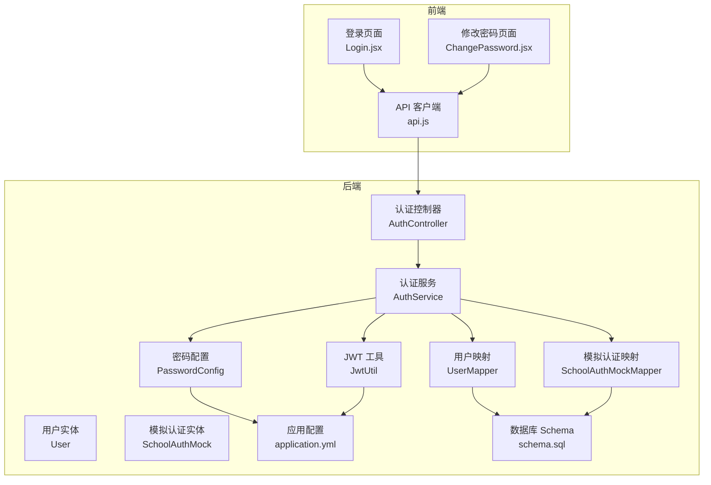
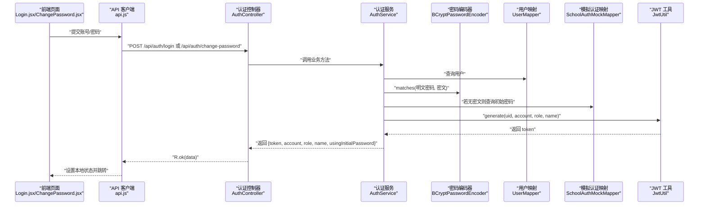
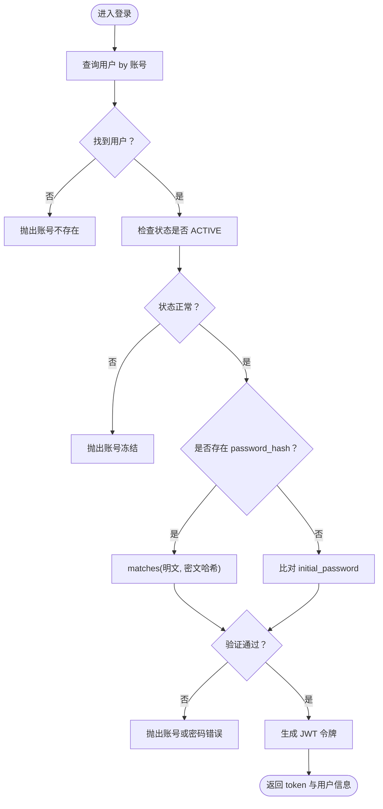
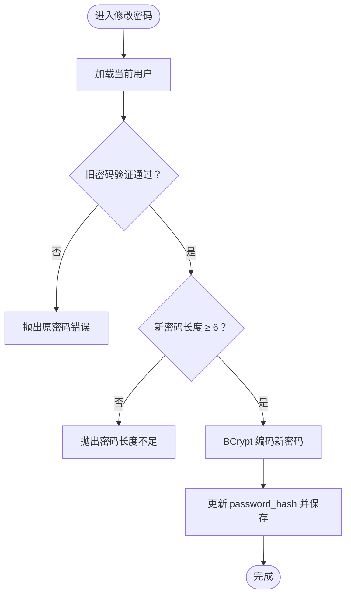
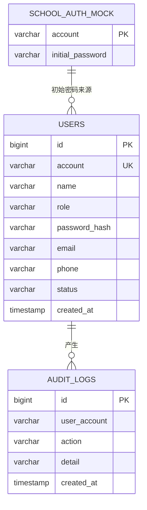
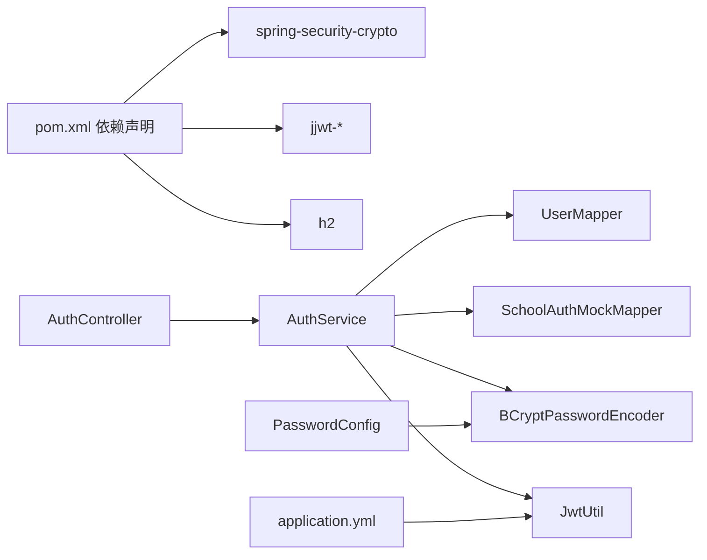

# 密码安全策略

<cite>
**本文引用的文件**
- [PasswordConfig.java](file://backend/src/main/java/com/zjsu/scholarship/config/PasswordConfig.java)
- [AuthService.java](file://backend/src/main/java/com/zjsu/scholarship/service/AuthService.java)
- [AuthController.java](file://backend/src/main/java/com/zjsu/scholarship/controller/AuthController.java)
- [User.java](file://backend/src/main/java/com/zjsu/scholarship/entity/User.java)
- [SchoolAuthMock.java](file://backend/src/main/java/com/zjsu/scholarship/entity/SchoolAuthMock.java)
- [UserMapper.java](file://backend/src/main/java/com/zjsu/scholarship/mapper/UserMapper.java)
- [SchoolAuthMockMapper.java](file://backend/src/main/java/com/zjsu/scholarship/mapper/SchoolAuthMockMapper.java)
- [JwtUtil.java](file://backend/src/main/java/com/zjsu/scholarship/security/JwtUtil.java)
- [application.yml](file://backend/src/main/resources/application.yml)
- [schema.sql](file://backend/src/main/resources/db/schema.sql)
- [pom.xml](file://backend/pom.xml)
- [Login.jsx](file://frontend/src/pages/Login.jsx)
- [ChangePassword.jsx](file://frontend/src/pages/ChangePassword.jsx)
- [api.js](file://frontend/src/api.js)
- [R.java](file://backend/src/main/java/com/zjsu/scholarship/common/R.java)
- [BusinessException.java](file://backend/src/main/java/com/zjsu/scholarship/common/BusinessException.java)
</cite>

## 目录
1. [引言](#引言)
2. [项目结构](#项目结构)
3. [核心组件](#核心组件)
4. [架构概览](#架构概览)
5. [详细组件分析](#详细组件分析)
6. [依赖分析](#依赖分析)
7. [性能考虑](#性能考虑)
8. [故障排查指南](#故障排查指南)
9. [结论](#结论)
10. [附录](#附录)

## 引言
本文件围绕奖学金申请系统的密码安全策略进行系统化梳理，重点覆盖以下方面：
- BCrypt 密码加密算法的实现原理与安全性优势
- PasswordConfig 中的密码加密参数（成本因子、盐值生成、哈希算法选择）
- 注册、登录、修改密码流程中明文密码的加密存储与验证
- 密码强度要求（最小长度、字符类型、历史密码限制等）
- 密码安全最佳实践（密码过期、锁定、暴力破解防护）
- 密码重置流程的安全实现（验证码、邮件、链接有效期）
- 安全审计与监控方案
- 常见漏洞的预防与应急响应流程

## 项目结构
后端采用 Spring Boot + MyBatis-Plus 架构，密码相关逻辑集中在配置、服务与控制器层，并通过 JWT 实现会话管理。前端通过 Axios 封装的 API 客户端与后端交互。

图表来源
- [AuthController.java:1-44](file://backend/src/main/java/com/zjsu/scholarship/controller/AuthController.java#L1-L44)
- [AuthService.java:1-77](file://backend/src/main/java/com/zjsu/scholarship/service/AuthService.java#L1-L77)
- [PasswordConfig.java:1-15](file://backend/src/main/java/com/zjsu/scholarship/config/PasswordConfig.java#L1-L15)
- [JwtUtil.java:1-52](file://backend/src/main/java/com/zjsu/scholarship/security/JwtUtil.java#L1-L52)
- [UserMapper.java:1-8](file://backend/src/main/java/com/zjsu/scholarship/mapper/UserMapper.java#L1-L8)
- [SchoolAuthMockMapper.java:1-8](file://backend/src/main/java/com/zjsu/scholarship/mapper/SchoolAuthMockMapper.java#L1-L8)
- [User.java:1-24](file://backend/src/main/java/com/zjsu/scholarship/entity/User.java#L1-L24)
- [SchoolAuthMock.java:1-14](file://backend/src/main/java/com/zjsu/scholarship/entity/SchoolAuthMock.java#L1-L14)
- [application.yml:1-52](file://backend/src/main/resources/application.yml#L1-L52)
- [schema.sql:1-402](file://backend/src/main/resources/db/schema.sql#L1-L402)

章节来源
- [AuthController.java:1-44](file://backend/src/main/java/com/zjsu/scholarship/controller/AuthController.java#L1-L44)
- [AuthService.java:1-77](file://backend/src/main/java/com/zjsu/scholarship/service/AuthService.java#L1-L77)
- [PasswordConfig.java:1-15](file://backend/src/main/java/com/zjsu/scholarship/config/PasswordConfig.java#L1-L15)
- [JwtUtil.java:1-52](file://backend/src/main/java/com/zjsu/scholarship/security/JwtUtil.java#L1-L52)
- [application.yml:1-52](file://backend/src/main/resources/application.yml#L1-L52)
- [schema.sql:1-402](file://backend/src/main/resources/db/schema.sql#L1-L402)

## 核心组件
- 密码编码器配置：通过 PasswordConfig 提供 BCryptPasswordEncoder Bean，用于统一的密码加密与匹配。
- 认证服务：AuthService 负责登录校验、密码修改、令牌签发与返回。
- 控制器：AuthController 提供 /api/auth/login 与 /api/auth/change-password 接口。
- 实体与映射：User 与 SchoolAuthMock 实体及对应 Mapper，支撑用户凭据与初始密码校验。
- JWT 工具：JwtUtil 基于应用配置生成与解析签名令牌。
- 前端交互：Login.jsx 与 ChangePassword.jsx 通过 api.js 发起请求并处理响应。

章节来源
- [PasswordConfig.java:1-15](file://backend/src/main/java/com/zjsu/scholarship/config/PasswordConfig.java#L1-L15)
- [AuthService.java:1-77](file://backend/src/main/java/com/zjsu/scholarship/service/AuthService.java#L1-L77)
- [AuthController.java:1-44](file://backend/src/main/java/com/zjsu/scholarship/controller/AuthController.java#L1-L44)
- [User.java:1-24](file://backend/src/main/java/com/zjsu/scholarship/entity/User.java#L1-L24)
- [SchoolAuthMock.java:1-14](file://backend/src/main/java/com/zjsu/scholarship/entity/SchoolAuthMock.java#L1-L14)
- [JwtUtil.java:1-52](file://backend/src/main/java/com/zjsu/scholarship/security/JwtUtil.java#L1-L52)
- [Login.jsx:1-76](file://frontend/src/pages/Login.jsx#L1-L76)
- [ChangePassword.jsx:1-35](file://frontend/src/pages/ChangePassword.jsx#L1-L35)
- [api.js:1-44](file://frontend/src/api.js#L1-L44)

## 架构概览
下图展示密码相关的关键交互路径：从前端表单到后端认证服务，再到密码编码器与数据库持久化，最终返回 JWT 令牌。

图表来源
- [AuthController.java:21-42](file://backend/src/main/java/com/zjsu/scholarship/controller/AuthController.java#L21-L42)
- [AuthService.java:32-75](file://backend/src/main/java/com/zjsu/scholarship/service/AuthService.java#L32-L75)
- [UserMapper.java:1-8](file://backend/src/main/java/com/zjsu/scholarship/mapper/UserMapper.java#L1-L8)
- [SchoolAuthMockMapper.java:1-8](file://backend/src/main/java/com/zjsu/scholarship/mapper/SchoolAuthMockMapper.java#L1-L8)
- [JwtUtil.java:28-42](file://backend/src/main/java/com/zjsu/scholarship/security/JwtUtil.java#L28-L42)

## 详细组件分析

### BCrypt 密码加密实现与安全性
- 实现原理
  - 使用 BCryptPasswordEncoder 进行密码散列与校验，具备自适应成本因子与随机盐值，能有效抵御彩虹表与离线暴力破解。
  - 匹配流程：将明文密码与存储的哈希值交由 matches 方法进行验证，内部自动提取盐值并执行相同迭代次数的散列计算。
- 安全优势
  - 成本因子可调，随硬件升级逐步提高，确保未来仍具备足够抗攻击强度。
  - 盐值随机且嵌入哈希结果，避免相同明文产生相同哈希，降低碰撞风险。
  - 高计算复杂度显著增加暴力破解成本。

章节来源
- [PasswordConfig.java:10-13](file://backend/src/main/java/com/zjsu/scholarship/config/PasswordConfig.java#L10-L13)
- [AuthService.java:40](file://backend/src/main/java/com/zjsu/scholarship/service/AuthService.java#L40)
- [AuthService.java:66](file://backend/src/main/java/com/zjsu/scholarship/service/AuthService.java#L66)

### PasswordConfig 密码加密参数
- 成本因子（work factor）
  - 当前未显式指定，默认使用 BCrypt 的推荐成本因子，可在生产环境按需调整以平衡安全与性能。
- 盐值生成
  - BCrypt 自动为每次散列生成唯一盐值，无需手动干预。
- 哈希算法选择
  - 使用 BCrypt，具备自适应成本与强抗碰撞性，适合作为默认密码散列算法。

章节来源
- [PasswordConfig.java:10-13](file://backend/src/main/java/com/zjsu/scholarship/config/PasswordConfig.java#L10-L13)

### 登录流程（明文密码加密存储与验证）
- 流程要点
  - 查询用户：根据账号检索用户记录。
  - 状态检查：非 ACTIVE 状态禁止登录。
  - 凭据验证：优先使用 password_hash 进行 matches 校验；若为空，则回退至 school_auth_mock 的 initial_password 明文比对。
  - 令牌签发：通过 JwtUtil 生成带过期时间的签名令牌。
- 错误处理
  - 账号不存在、状态异常、凭据错误均抛出业务异常，前端统一拦截并提示。

图表来源
- [AuthService.java:32-55](file://backend/src/main/java/com/zjsu/scholarship/service/AuthService.java#L32-L55)
- [User.java:18](file://backend/src/main/java/com/zjsu/scholarship/entity/User.java#L18)
- [SchoolAuthMock.java:12](file://backend/src/main/java/com/zjsu/scholarship/entity/SchoolAuthMock.java#L12)
- [JwtUtil.java:28-42](file://backend/src/main/java/com/zjsu/scholarship/security/JwtUtil.java#L28-L42)

章节来源
- [AuthService.java:32-55](file://backend/src/main/java/com/zjsu/scholarship/service/AuthService.java#L32-L55)
- [User.java:18](file://backend/src/main/java/com/zjsu/scholarship/entity/User.java#L18)
- [SchoolAuthMock.java:12](file://backend/src/main/java/com/zjsu/scholarship/entity/SchoolAuthMock.java#L12)
- [JwtUtil.java:28-42](file://backend/src/main/java/com/zjsu/scholarship/security/JwtUtil.java#L28-L42)

### 修改密码流程（强度要求与存储）
- 强度要求
  - 新密码长度至少 6 位（前端与后端共同约束）。
- 流程要点
  - 校验旧密码：优先使用 password_hash matches；若为空则比对 initial_password。
  - 加密新密码：使用 BCryptPasswordEncoder 对新密码进行编码。
  - 更新持久化：将新 password_hash 写回用户记录。
- 错误处理
  - 原密码错误、用户不存在等场景抛出业务异常。

图表来源
- [AuthService.java:57-75](file://backend/src/main/java/com/zjsu/scholarship/service/AuthService.java#L57-L75)
- [ChangePassword.jsx:24](file://frontend/src/pages/ChangePassword.jsx#L24)

章节来源
- [AuthService.java:57-75](file://backend/src/main/java/com/zjsu/scholarship/service/AuthService.java#L57-L75)
- [ChangePassword.jsx:24](file://frontend/src/pages/ChangePassword.jsx#L24)

### 数据模型与存储设计
- 用户表 users
  - 关键字段：account（唯一）、name、role、password_hash（可空，首次登录后填充）、status（默认 ACTIVE）、email、phone、created_at。
- 模拟认证表 school_auth_mock
  - 关键字段：account（主键）、initial_password（仅用于首次登录时的明文比对）。
- 审计日志表 audit_logs（建议扩展）
  - 可新增字段记录登录尝试、失败次数、IP 地址、设备指纹等，便于风控与审计。

图表来源
- [schema.sql:7-22](file://backend/src/main/resources/db/schema.sql#L7-L22)
- [schema.sql:318-324](file://backend/src/main/resources/db/schema.sql#L318-L324)

章节来源
- [schema.sql:7-22](file://backend/src/main/resources/db/schema.sql#L7-L22)
- [schema.sql:318-324](file://backend/src/main/resources/db/schema.sql#L318-L324)

### JWT 令牌与会话管理
- 令牌生成
  - 基于 app.jwt.secret 与 app.jwt.expire-hours 配置生成签名令牌，包含 uid、account、role、name 等声明。
- 前端携带
  - api.js 在请求头附加 Authorization: Bearer token，后端通过拦截器或安全过滤器解析。
- 安全建议
  - 生产环境应使用 HTTPS、短令牌过期时间、支持刷新令牌与吊销机制。

章节来源
- [JwtUtil.java:28-42](file://backend/src/main/java/com/zjsu/scholarship/security/JwtUtil.java#L28-L42)
- [application.yml:43-45](file://backend/src/main/resources/application.yml#L43-L45)
- [api.js:10-16](file://frontend/src/api.js#L10-L16)

### 前端交互与错误处理
- 登录页 Login.jsx
  - 表单提交至 /api/auth/login，成功后写入 token 与用户信息，按角色跳转。
- 修改密码页 ChangePassword.jsx
  - 校验新密码一致性，提交 /api/auth/change-password。
- API 客户端 api.js
  - 统一注入 Authorization 头；对 401 响应触发登出与跳转。

章节来源
- [Login.jsx:22-34](file://frontend/src/pages/Login.jsx#L22-L34)
- [ChangePassword.jsx:10-16](file://frontend/src/pages/ChangePassword.jsx#L10-L16)
- [api.js:10-31](file://frontend/src/api.js#L10-L31)

## 依赖分析
- 外部依赖
  - spring-security-crypto：提供 BCryptPasswordEncoder。
  - jjwt：提供 JWT 签名与解析能力。
  - H2：开发/测试数据库。
- 内部模块耦合
  - AuthController 依赖 AuthService；AuthService 依赖 UserMapper、SchoolAuthMockMapper、PasswordEncoder、JwtUtil。
  - PasswordConfig 为全局提供编码器 Bean，被 AuthService 注入使用。

图表来源
- [pom.xml:26-87](file://backend/pom.xml#L26-L87)
- [AuthController.java:15-19](file://backend/src/main/java/com/zjsu/scholarship/controller/AuthController.java#L15-L19)
- [AuthService.java:24-29](file://backend/src/main/java/com/zjsu/scholarship/service/AuthService.java#L24-L29)
- [PasswordConfig.java:10-13](file://backend/src/main/java/com/zjsu/scholarship/config/PasswordConfig.java#L10-L13)
- [application.yml:43-45](file://backend/src/main/resources/application.yml#L43-L45)

章节来源
- [pom.xml:26-87](file://backend/pom.xml#L26-L87)
- [AuthController.java:15-19](file://backend/src/main/java/com/zjsu/scholarship/controller/AuthController.java#L15-L19)
- [AuthService.java:24-29](file://backend/src/main/java/com/zjsu/scholarship/service/AuthService.java#L24-L29)
- [PasswordConfig.java:10-13](file://backend/src/main/java/com/zjsu/scholarship/config/PasswordConfig.java#L10-L13)
- [application.yml:43-45](file://backend/src/main/resources/application.yml#L43-L45)

## 性能考虑
- BCrypt 成本因子
  - 建议在生产环境定期评估硬件性能，逐步提升成本因子，以保持安全与性能平衡。
- 数据库访问
  - 用户查询使用账号唯一索引，减少 IO 开销；登录与修改密码均为 O(1) 匹配操作。
- 令牌生成
  - JWT 为无状态签名，解析开销低；注意避免在载荷中存放敏感数据。

## 故障排查指南
- 常见问题定位
  - 登录失败：检查账号是否存在、状态是否 ACTIVE、password_hash 是否正确；若为空则确认 school_auth_mock 初始密码是否匹配。
  - 修改密码失败：确认旧密码 matches 成功、新密码长度满足要求。
  - 令牌无效：核对 app.jwt.secret 与 app.jwt.expire-hours 配置是否一致，前后端是否使用同一密钥。
- 错误封装与响应
  - 后端统一通过 R<T> 返回结构化响应；业务异常 BusinessException 抛出并转换为错误消息。
- 前端拦截
  - api.js 对 401 响应自动登出并跳转登录页，避免无效请求继续。

章节来源
- [AuthService.java:35-45](file://backend/src/main/java/com/zjsu/scholarship/service/AuthService.java#L35-L45)
- [AuthService.java:61-71](file://backend/src/main/java/com/zjsu/scholarship/service/AuthService.java#L61-L71)
- [R.java:16-30](file://backend/src/main/java/com/zjsu/scholarship/common/R.java#L16-L30)
- [BusinessException.java:6-14](file://backend/src/main/java/com/zjsu/scholarship/common/BusinessException.java#L6-L14)
- [api.js:18-31](file://frontend/src/api.js#L18-L31)

## 结论
本系统基于 BCrypt 实现密码加密，结合 JWT 令牌与严格的登录/修改流程，提供了基础但有效的密码安全框架。建议在生产环境中进一步完善密码强度策略、引入账户锁定与暴力破解防护、增强审计与监控能力，并考虑密码重置流程的验证码与有效期控制，以全面提升整体安全性。

## 附录

### 密码强度要求建议
- 最小长度：建议 ≥ 8 位，结合业务需求可提升至 12 位。
- 字符类型：建议强制包含大小写字母、数字与特殊字符。
- 历史密码限制：建议禁止重复最近 N（如 5）次使用的密码。
- 复杂度校验：可在前端进行即时校验并在后端再次确认。

### 密码安全最佳实践
- 密码过期策略：定期提醒用户更换密码（如每 90 天），到期前给予宽限期。
- 账户锁定机制：连续多次失败后临时锁定，解锁需人工或二次验证。
- 暴力破解防护：限流、验证码、设备指纹、地理位置检测等多维风控。
- 传输安全：强制 HTTPS，禁用明文协议。
- 日志与监控：记录登录尝试、失败次数、IP、UA、设备信息，建立告警阈值。

### 密码重置流程安全实现
- 验证码生成：随机数 + 时间戳，绑定用户账号与 IP。
- 邮件发送：使用安全 SMTP，内容包含一次性链接与过期时间。
- 链接有效期：建议 10-30 分钟，过期后不可用。
- 二次校验：重置完成后要求用户立即登录并提示修改密码。

### 安全审计与监控方案
- 审计日志表扩展：新增字段记录登录时间、IP、UA、设备指纹、是否使用初始密码、失败原因等。
- 告警规则：异常登录（异地、高失败率）、批量弱口令尝试、频繁重置请求等。
- 定期审查：对审计日志进行抽样与趋势分析，识别潜在威胁。

### 常见漏洞预防与应急响应
- 预防措施
  - 输入校验与输出编码，防止注入与 XSS。
  - 最小权限原则，严格区分角色与接口访问控制。
  - 定期更新依赖与补丁，关注 CVE 公告。
- 应急响应
  - 快速冻结高危账号、撤销相关令牌、回滚可疑变更。
  - 通知受影响用户并引导其修改密码，必要时强制重置。
  - 保留证据链，配合安全团队溯源分析。