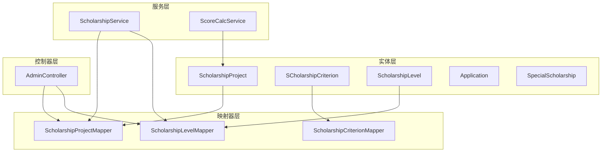
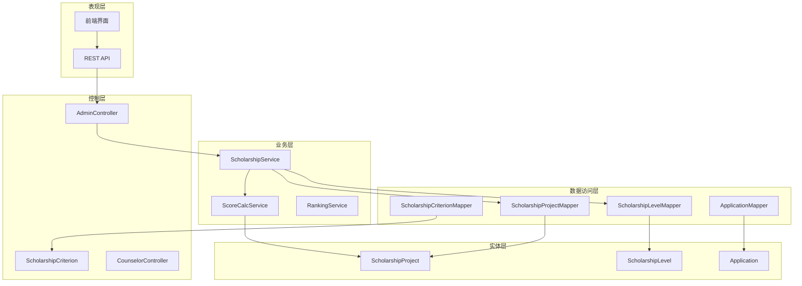
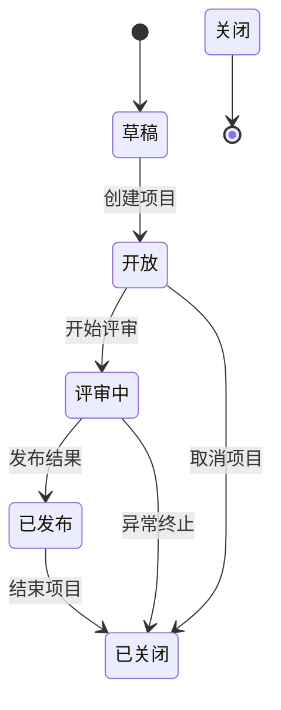
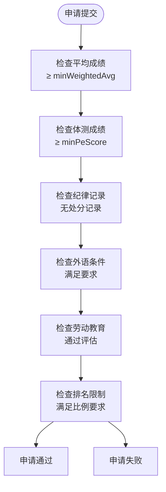
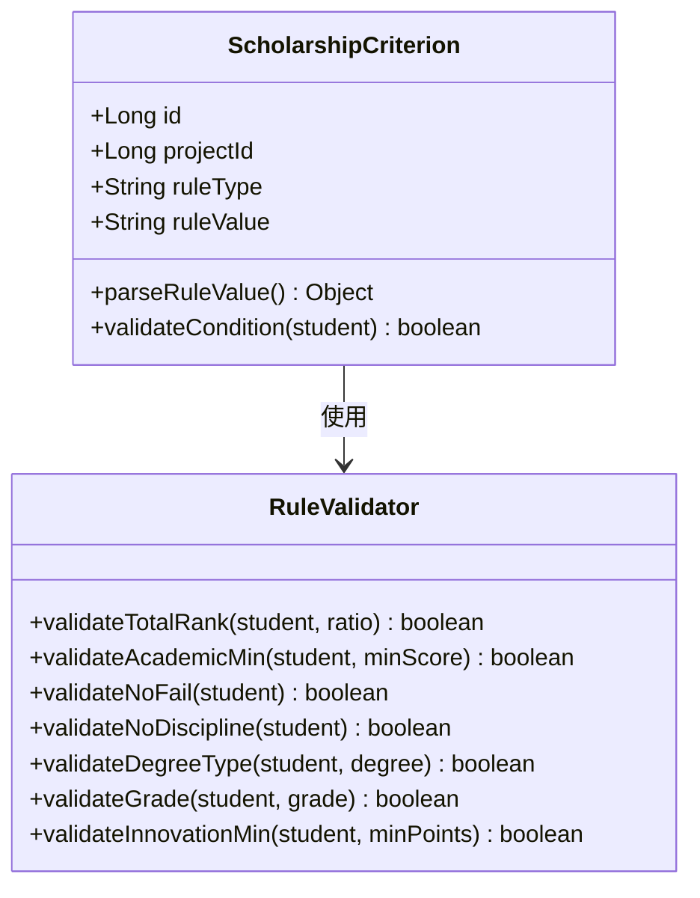
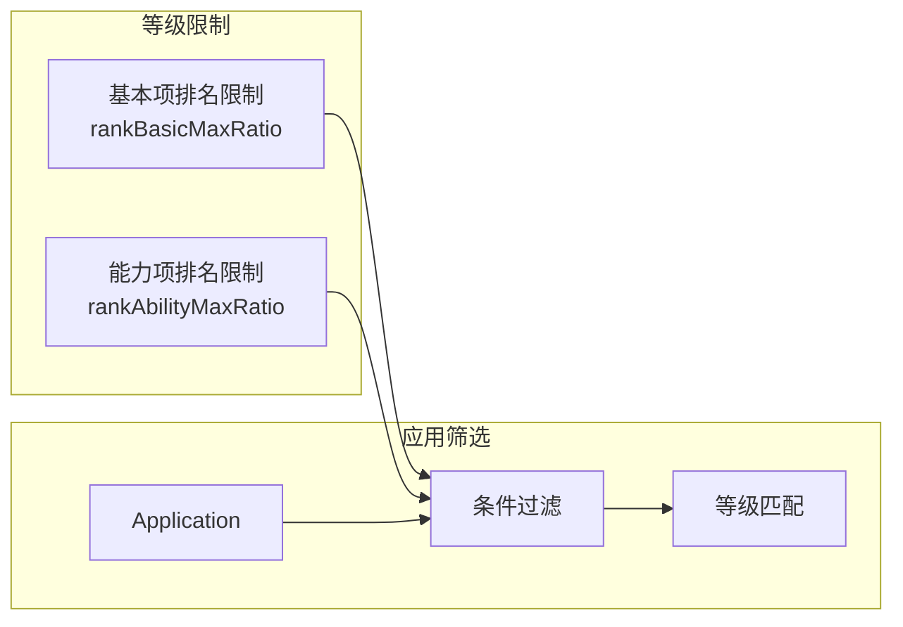
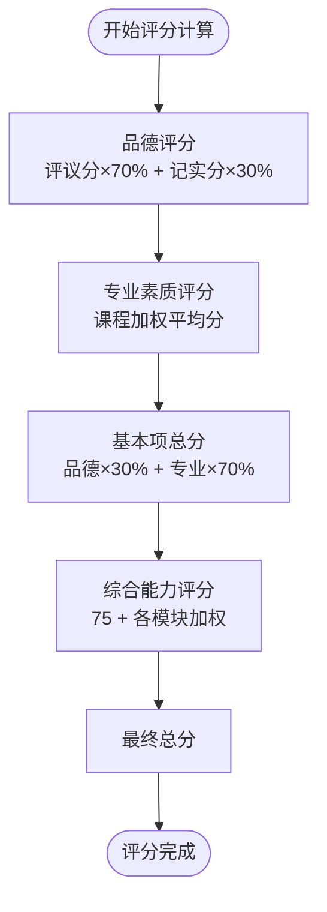
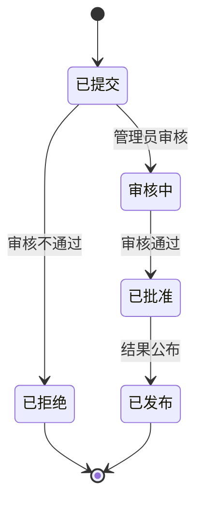
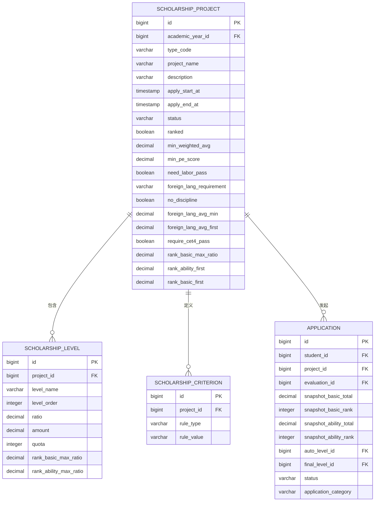
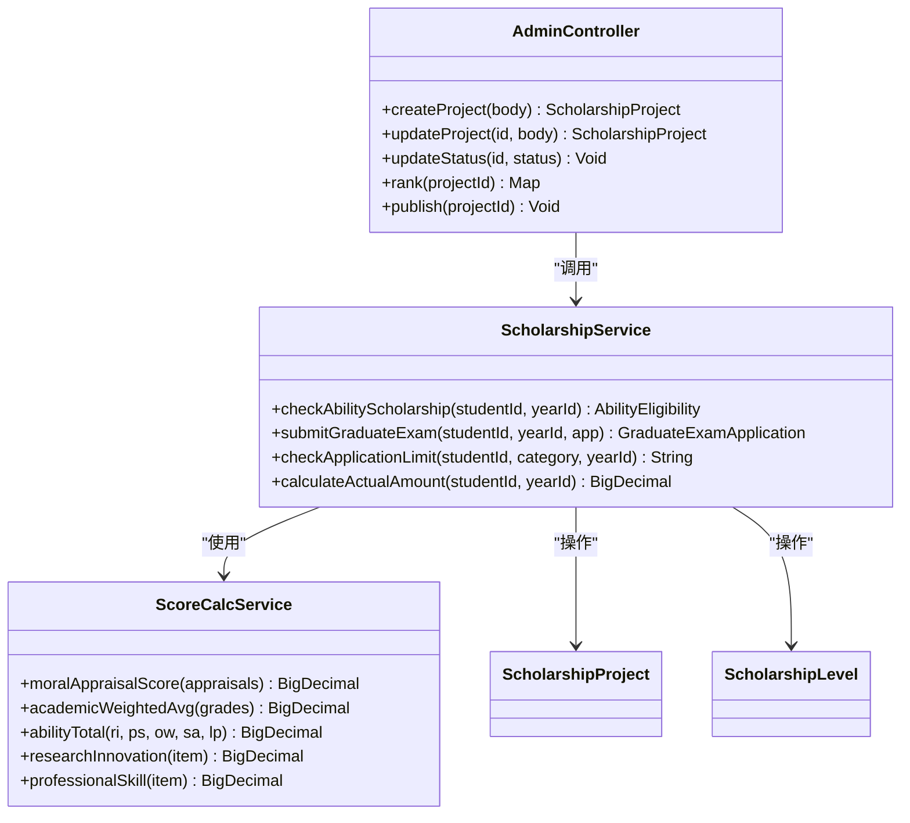

# 奖学金实体类

<cite>
**本文档引用的文件**
- [ScholarshipProject.java](file://backend/src/main/java/com/zjsu/scholarship/entity/ScholarshipProject.java)
- [ScholarshipCriterion.java](file://backend/src/main/java/com/zjsu/scholarship/entity/ScholarshipCriterion.java)
- [ScholarshipLevel.java](file://backend/src/main/java/com/zjsu/scholarship/entity/ScholarshipLevel.java)
- [Application.java](file://backend/src/main/java/com/zjsu/scholarship/entity/Application.java)
- [SpecialScholarship.java](file://backend/src/main/java/com/zjsu/scholarship/entity/SpecialScholarship.java)
- [ScholarshipService.java](file://backend/src/main/java/com/zjsu/scholarship/service/ScholarshipService.java)
- [ScoreCalcService.java](file://backend/src/main/java/com/zjsu/scholarship/service/ScoreCalcService.java)
- [AdminController.java](file://backend/src/main/java/com/zjsu/scholarship/controller/AdminController.java)
- [schema.sql](file://backend/src/main/resources/db/schema.sql)
- [ScholarshipProjectMapper.java](file://backend/src/main/java/com/zjsu/scholarship/mapper/ScholarshipProjectMapper.java)
- [ScholarshipCriterionMapper.java](file://backend/src/main/java/com/zjsu/scholarship/mapper/ScholarshipCriterionMapper.java)
- [ScholarshipLevelMapper.java](file://backend/src/main/java/com/zjsu/scholarship/mapper/ScholarshipLevelMapper.java)
</cite>

## 目录
1. [简介](#简介)
2. [项目结构](#项目结构)
3. [核心组件](#核心组件)
4. [架构概览](#架构概览)
5. [详细组件分析](#详细组件分析)
6. [依赖关系分析](#依赖关系分析)
7. [性能考虑](#性能考虑)
8. [故障排除指南](#故障排除指南)
9. [结论](#结论)

## 简介

本文件详细阐述了奖学金系统的三个核心实体类设计：ScholarshipProject（奖学金项目）、ScholarshipCriterion（评审标准）和ScholarshipLevel（等级）。这些实体构成了奖学金评选系统的基础数据结构，支持从项目创建、评审标准设定到等级划分的完整业务流程。

系统基于《浙江工商大学学生素质评价办法》(2025版)和《浙江工商大学奖学金实施办法》(2025版)设计，实现了自动化的评分计算、等级匹配和状态管理功能。

## 项目结构

奖学金实体类位于后端Java项目中，采用标准的分层架构设计：

**图表来源**
- [ScholarshipProject.java:1-50](file://backend/src/main/java/com/zjsu/scholarship/entity/ScholarshipProject.java#L1-L50)
- [ScholarshipCriterion.java:1-18](file://backend/src/main/java/com/zjsu/scholarship/entity/ScholarshipCriterion.java#L1-L18)
- [ScholarshipLevel.java:1-26](file://backend/src/main/java/com/zjsu/scholarship/entity/ScholarshipLevel.java#L1-L26)

**章节来源**
- [ScholarshipProject.java:1-50](file://backend/src/main/java/com/zjsu/scholarship/entity/ScholarshipProject.java#L1-L50)
- [ScholarshipCriterion.java:1-18](file://backend/src/main/java/com/zjsu/scholarship/entity/ScholarshipCriterion.java#L1-L18)
- [ScholarshipLevel.java:1-26](file://backend/src/main/java/com/zjsu/scholarship/entity/ScholarshipLevel.java#L1-L26)

## 核心组件

### ScholarshipProject 实体

ScholarshipProject是奖学金项目的核心实体，负责管理各类奖学金项目的配置信息和评审规则。

**关键字段设计考虑：**

- **项目标识**：`id` 和 `academicYearId` 用于唯一标识项目并关联学年
- **项目类型**：`typeCode` 支持多种奖学金类型，包括综合奖学金、能力突出奖学金、考研奖学金等
- **申请时间**：`applyStartAt` 和 `applyEndAt` 控制申请周期
- **项目状态**：`status` 支持草稿、开放、评审中、已发布、已关闭等状态
- **排名标记**：`ranked` 标识项目是否参与排名
- **硬性条件**：包含学术成绩、体测、外语等多维度的最低要求
- **排名限制**：新增的排名比例控制机制

### ScholarshipCriterion 实体

评审标准实体定义了项目的具体评审规则和条件。

**设计特点：**
- **规则类型**：支持总排名比例、最低成绩、无不及格、无纪律处分等多种规则类型
- **规则值**：灵活的规则值存储，支持不同类型的条件配置
- **项目关联**：通过 `projectId` 与具体项目建立关联关系

### ScholarshipLevel 实体

等级实体负责定义奖学金的等级划分和奖励标准。

**核心属性：**
- **等级标识**：`levelName` 和 `levelOrder` 确定等级的名称和排序
- **奖励标准**：`ratio`、`amount`、`quota` 定义奖励比例、金额和名额
- **排名限制**：新增的排名比例限制确保等级分配的公平性

**章节来源**
- [ScholarshipProject.java:17-49](file://backend/src/main/java/com/zjsu/scholarship/entity/ScholarshipProject.java#L17-L49)
- [ScholarshipCriterion.java:14-16](file://backend/src/main/java/com/zjsu/scholarship/entity/ScholarshipCriterion.java#L14-L16)
- [ScholarshipLevel.java:16-24](file://backend/src/main/java/com/zjsu/scholarship/entity/ScholarshipLevel.java#L16-L24)

## 架构概览

奖学金系统采用分层架构，各组件职责明确，耦合度低：

**图表来源**
- [AdminController.java:23-61](file://backend/src/main/java/com/zjsu/scholarship/controller/AdminController.java#L23-L61)
- [ScholarshipService.java:22-49](file://backend/src/main/java/com/zjsu/scholarship/service/ScholarshipService.java#L22-L49)
- [ScoreCalcService.java:18-19](file://backend/src/main/java/com/zjsu/scholarship/service/ScoreCalcService.java#L18-L19)

## 详细组件分析

### ScholarshipProject 详细分析

#### 字段设计深度解析

**项目基本信息字段：**
- `projectName`：项目名称，用于用户界面展示
- `description`：项目描述，提供详细的评选说明
- `typeCode`：项目类型编码，支持多种奖学金类型

**申请时间管理：**
- `applyStartAt` 和 `applyEndAt`：精确控制申请时间段
- 与学年系统的集成，确保时间逻辑的一致性

**状态管理系统：**

**硬性条件设计：**
系统实现了多层次的申请门槛控制：

**图表来源**
- [ScholarshipProject.java:25-49](file://backend/src/main/java/com/zjsu/scholarship/entity/ScholarshipProject.java#L25-L49)

#### 评审规则实现

**排名过滤机制：**
- `rankBasicMaxRatio`：基本项排名最大比例控制
- `rankAbilityFirst`：一等能力项排名限制
- `rankBasicFirst`：一等基本项排名限制

**外语条件结构化：**
- `foreignLangAvgMin`：外语课均分底线
- `foreignLangAvgFirst`：一等奖外语均分底线
- `requireCet4Pass`：CET4合格要求

**章节来源**
- [ScholarshipProject.java:17-49](file://backend/src/main/java/com/zjsu/scholarship/entity/ScholarshipProject.java#L17-L49)
- [schema.sql:235-260](file://backend/src/main/resources/db/schema.sql#L235-L260)

### ScholarshipCriterion 详细分析

#### 评审标准类型体系

**支持的规则类型：**
- `TOTAL_RANK_TOP_RATIO`：总排名前X%比例
- `ACADEMIC_MIN`：最低成绩要求
- `NO_FAIL`：不得有不及格科目
- `NO_DISCIPLINE`：无纪律处分记录
- `DEGREE_TYPE`：学位类型要求
- `GRADE`：年级要求
- `INNOVATION_MIN`：创新成果最低要求

**规则值解析机制：**

**图表来源**
- [ScholarshipCriterion.java:14-16](file://backend/src/main/java/com/zjsu/scholarship/entity/ScholarshipCriterion.java#L14-L16)

#### 条件判断逻辑

评审标准的条件判断遵循严格的优先级和组合规则：

**多条件组合验证：**
1. 所有条件必须同时满足
2. 不同类型的条件具有不同的权重
3. 特殊条件（如综合奖学金获奖者）有额外限制

**章节来源**
- [ScholarshipCriterion.java:1-18](file://backend/src/main/java/com/zjsu/scholarship/entity/ScholarshipCriterion.java#L1-L18)

### ScholarshipLevel 详细分析

#### 等级划分机制

**等级属性设计：**
- `levelName`：等级名称（如一等奖、二等奖）
- `levelOrder`：等级排序，决定等级优先级
- `ratio`：等级占比，影响获奖人数分配
- `amount`：奖励金额，直接决定奖学金数额
- `quota`：等级名额，控制获奖人数上限

**排名限制机制：**

**图表来源**
- [ScholarshipLevel.java:16-24](file://backend/src/main/java/com/zjsu/scholarship/entity/ScholarshipLevel.java#L16-L24)

#### 奖励标准设置

**金额计算逻辑：**
- 基于等级金额和获奖人数计算总预算
- 考虑项目总预算和等级配额的平衡
- 支持动态调整奖励金额以适应预算变化

**章节来源**
- [ScholarshipLevel.java:1-26](file://backend/src/main/java/com/zjsu/scholarship/entity/ScholarshipLevel.java#L1-L26)

### 评分计算引擎

#### ScoreCalcService 核心算法

**基本项评分计算：**

**综合能力模块评分：**
- 研究创新：竞赛、论文、专利、项目等多维度
- 专业技能：英语、计算机、职业证书等
- 组织工作：学生干部、社会工作等
- 体育美育：文体活动参与情况
- 劳动教育：社会实践、志愿服务等

**章节来源**
- [ScoreCalcService.java:18-423](file://backend/src/main/java/com/zjsu/scholarship/service/ScoreCalcService.java#L18-L423)

### 申请实体关联关系

#### Application 实体设计

**快照机制：**
- `snapshotBasicTotal`：基本项总分快照
- `snapshotBasicRank`：基本项排名快照
- `snapshotAbilityTotal`：综合能力总分快照
- `snapshotAbilityRank`：综合能力排名快照

**等级关联：**
- `autoLevelId`：系统推荐等级ID
- `finalLevelId`：最终授予等级ID

**状态管理：**

**章节来源**
- [Application.java:19-42](file://backend/src/main/java/com/zjsu/scholarship/entity/Application.java#L19-L42)

### 特殊奖学金处理

#### SpecialScholarship 实体

**学院自定义奖学金：**
- 支持各学院根据自身特色设立专项奖学金
- 灵活的金额设置和名额控制
- 独立的状态管理机制

**与常规奖学金的区别：**
- 评审标准相对简化
- 主要基于学业表现
- 金额相对较低但覆盖面广

**章节来源**
- [SpecialScholarship.java:10-22](file://backend/src/main/java/com/zjsu/scholarship/entity/SpecialScholarship.java#L10-L22)

## 依赖关系分析

### 实体间关系图

**图表来源**
- [schema.sql:235-315](file://backend/src/main/resources/db/schema.sql#L235-L315)

### 服务层依赖关系

**图表来源**
- [ScholarshipService.java:22-49](file://backend/src/main/java/com/zjsu/scholarship/service/ScholarshipService.java#L22-L49)
- [ScoreCalcService.java:18-19](file://backend/src/main/java/com/zjsu/scholarship/service/ScoreCalcService.java#L18-L19)
- [AdminController.java:23-61](file://backend/src/main/java/com/zjsu/scholarship/controller/AdminController.java#L23-L61)

**章节来源**
- [ScholarshipService.java:15-280](file://backend/src/main/java/com/zjsu/scholarship/service/ScholarshipService.java#L15-L280)
- [ScoreCalcService.java:10-423](file://backend/src/main/java/com/zjsu/scholarship/service/ScoreCalcService.java#L10-L423)

## 性能考虑

### 数据库优化策略

**索引设计：**
- 项目表：按学年ID和状态建立复合索引
- 等级表：按项目ID和等级顺序建立索引
- 申请表：按学生ID和项目ID建立唯一索引

**查询优化：**
- 使用分页查询处理大量数据
- 缓存常用配置数据
- 优化复杂统计查询

### 评分计算优化

**批量处理：**
- 支持批量评分计算
- 减少数据库往返次数
- 使用事务保证数据一致性

**内存管理：**
- 合理的数据结构选择
- 及时释放临时对象
- 避免内存泄漏

## 故障排除指南

### 常见问题及解决方案

**项目状态异常：**
- 检查项目状态转换逻辑
- 验证时间窗口设置
- 确认权限控制机制

**评分计算错误：**
- 验证输入数据格式
- 检查权重配置
- 确认边界条件处理

**等级匹配问题：**
- 检查排名数据准确性
- 验证等级配额设置
- 确认比例计算逻辑

**章节来源**
- [AdminController.java:108-115](file://backend/src/main/java/com/zjsu/scholarship/controller/AdminController.java#L108-L115)
- [ScholarshipService.java:223-240](file://backend/src/main/java/com/zjsu/scholarship/service/ScholarshipService.java#L223-L240)

## 结论

奖学金实体类设计体现了现代软件工程的最佳实践，通过清晰的职责分离、严格的类型安全和完善的业务逻辑实现了奖学金评选系统的高效运行。

**主要优势：**
1. **模块化设计**：三个核心实体职责明确，便于维护和扩展
2. **灵活配置**：支持多种奖学金类型和自定义规则
3. **自动化程度高**：评分计算和等级匹配实现完全自动化
4. **数据完整性**：完善的外键约束和数据验证机制
5. **状态管理**：完整的生命周期管理支持

**未来改进方向：**
1. 增强异常处理和日志记录
2. 优化大数据量场景下的性能
3. 扩展移动端支持
4. 加强数据可视化功能

该设计为高校奖学金管理提供了可靠的技术基础，能够有效提升工作效率和评选公正性。