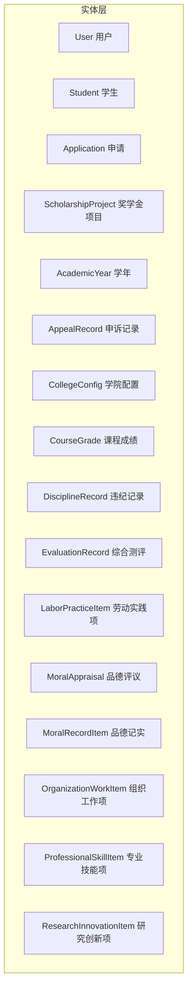
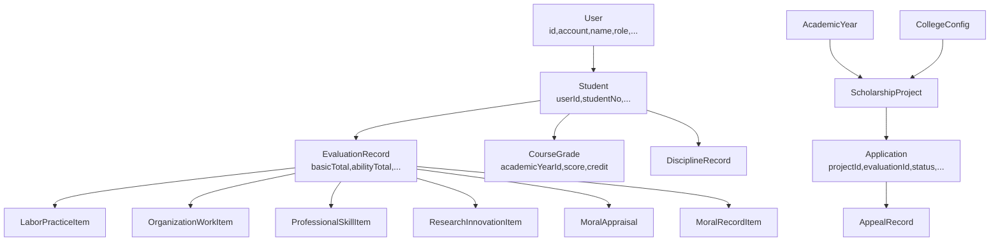
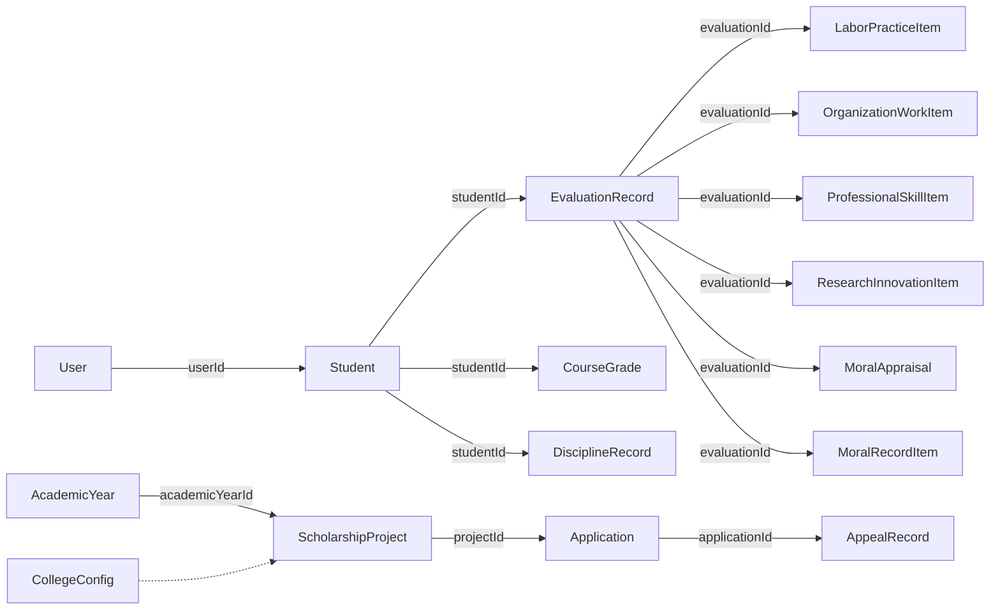

# 实体模型设计

<cite>
**本文引用的文件**
- [User.java](file://backend/src/main/java/com/zjsu/scholarship/entity/User.java)
- [Student.java](file://backend/src/main/java/com/zjsu/scholarship/entity/Student.java)
- [Application.java](file://backend/src/main/java/com/zjsu/scholarship/entity/Application.java)
- [ScholarshipProject.java](file://backend/src/main/java/com/zjsu/scholarship/entity/ScholarshipProject.java)
- [AcademicYear.java](file://backend/src/main/java/com/zjsu/scholarship/entity/AcademicYear.java)
- [AppealRecord.java](file://backend/src/main/java/com/zjsu/scholarship/entity/AppealRecord.java)
- [CollegeConfig.java](file://backend/src/main/java/com/zjsu/scholarship/entity/CollegeConfig.java)
- [CourseGrade.java](file://backend/src/main/java/com/zjsu/scholarship/entity/CourseGrade.java)
- [DisciplineRecord.java](file://backend/src/main/java/com/zjsu/scholarship/entity/DisciplineRecord.java)
- [EvaluationRecord.java](file://backend/src/main/java/com/zjsu/scholarship/entity/EvaluationRecord.java)
- [LaborPracticeItem.java](file://backend/src/main/java/com/zjsu/scholarship/entity/LaborPracticeItem.java)
- [MoralAppraisal.java](file://backend/src/main/java/com/zjsu/scholarship/entity/MoralAppraisal.java)
- [MoralRecordItem.java](file://backend/src/main/java/com/zjsu/scholarship/entity/MoralRecordItem.java)
- [OrganizationWorkItem.java](file://backend/src/main/java/com/zjsu/scholarship/entity/OrganizationWorkItem.java)
- [ProfessionalSkillItem.java](file://backend/src/main/java/com/zjsu/scholarship/entity/ProfessionalSkillItem.java)
- [ResearchInnovationItem.java](file://backend/src/main/java/com/zjsu/scholarship/entity/ResearchInnovationItem.java)
</cite>

## 目录
1. [引言](#引言)
2. [项目结构](#项目结构)
3. [核心组件](#核心组件)
4. [架构概览](#架构概览)
5. [详细组件分析](#详细组件分析)
6. [依赖分析](#依赖分析)
7. [性能考虑](#性能考虑)
8. [故障排查指南](#故障排查指南)
9. [结论](#结论)
10. [附录](#附录)

## 引言
本设计文档面向奖学金管理系统中的12个核心实体类，系统性阐述其字段定义、数据类型、约束条件与业务规则；解释实体之间的关系映射（一对一、一对多、多对多）；给出实体关系图与属性说明表；说明Lombok注解在简化代码方面的应用；解释实体与数据库表的映射关系及序列化/反序列化处理；总结实体验证与数据完整性约束的设计考量，并提出实体类的扩展与演进策略。

## 项目结构
实体类位于后端模块的实体包中，采用MyBatis-Plus注解进行表名与主键映射，统一使用Lombok的@Data注解生成getter/setter/toString等方法，确保代码简洁与一致性。

**图表来源**
- [User.java:1-24](file://backend/src/main/java/com/zjsu/scholarship/entity/User.java#L1-L24)
- [Student.java:1-33](file://backend/src/main/java/com/zjsu/scholarship/entity/Student.java#L1-L33)
- [Application.java:1-43](file://backend/src/main/java/com/zjsu/scholarship/entity/Application.java#L1-L43)
- [ScholarshipProject.java:1-50](file://backend/src/main/java/com/zjsu/scholarship/entity/ScholarshipProject.java#L1-L50)
- [AcademicYear.java:1-27](file://backend/src/main/java/com/zjsu/scholarship/entity/AcademicYear.java#L1-L27)
- [AppealRecord.java:1-27](file://backend/src/main/java/com/zjsu/scholarship/entity/AppealRecord.java#L1-L27)
- [CollegeConfig.java:1-18](file://backend/src/main/java/com/zjsu/scholarship/entity/CollegeConfig.java#L1-L18)
- [CourseGrade.java:1-21](file://backend/src/main/java/com/zjsu/scholarship/entity/CourseGrade.java#L1-L21)
- [DisciplineRecord.java:1-26](file://backend/src/main/java/com/zjsu/scholarship/entity/DisciplineRecord.java#L1-L26)
- [EvaluationRecord.java:1-45](file://backend/src/main/java/com/zjsu/scholarship/entity/EvaluationRecord.java#L1-L45)
- [LaborPracticeItem.java:1-37](file://backend/src/main/java/com/zjsu/scholarship/entity/LaborPracticeItem.java#L1-L37)
- [MoralAppraisal.java:1-36](file://backend/src/main/java/com/zjsu/scholarship/entity/MoralAppraisal.java#L1-L36)
- [MoralRecordItem.java:1-34](file://backend/src/main/java/com/zjsu/scholarship/entity/MoralRecordItem.java#L1-L34)
- [OrganizationWorkItem.java:1-39](file://backend/src/main/java/com/zjsu/scholarship/entity/OrganizationWorkItem.java#L1-L39)
- [ProfessionalSkillItem.java:1-33](file://backend/src/main/java/com/zjsu/scholarship/entity/ProfessionalSkillItem.java#L1-L33)
- [ResearchInnovationItem.java:1-49](file://backend/src/main/java/com/zjsu/scholarship/entity/ResearchInnovationItem.java#L1-L49)

**章节来源**
- [User.java:1-24](file://backend/src/main/java/com/zjsu/scholarship/entity/User.java#L1-L24)
- [Student.java:1-33](file://backend/src/main/java/com/zjsu/scholarship/entity/Student.java#L1-L33)
- [Application.java:1-43](file://backend/src/main/java/com/zjsu/scholarship/entity/Application.java#L1-L43)
- [ScholarshipProject.java:1-50](file://backend/src/main/java/com/zjsu/scholarship/entity/ScholarshipProject.java#L1-L50)
- [AcademicYear.java:1-27](file://backend/src/main/java/com/zjsu/scholarship/entity/AcademicYear.java#L1-L27)
- [AppealRecord.java:1-27](file://backend/src/main/java/com/zjsu/scholarship/entity/AppealRecord.java#L1-L27)
- [CollegeConfig.java:1-18](file://backend/src/main/java/com/zjsu/scholarship/entity/CollegeConfig.java#L1-L18)
- [CourseGrade.java:1-21](file://backend/src/main/java/com/zjsu/scholarship/entity/CourseGrade.java#L1-L21)
- [DisciplineRecord.java:1-26](file://backend/src/main/java/com/zjsu/scholarship/entity/DisciplineRecord.java#L1-L26)
- [EvaluationRecord.java:1-45](file://backend/src/main/java/com/zjsu/scholarship/entity/EvaluationRecord.java#L1-L45)
- [LaborPracticeItem.java:1-37](file://backend/src/main/java/com/zjsu/scholarship/entity/LaborPracticeItem.java#L1-L37)
- [MoralAppraisal.java:1-36](file://backend/src/main/java/com/zjsu/scholarship/entity/MoralAppraisal.java#L1-L36)
- [MoralRecordItem.java:1-34](file://backend/src/main/java/com/zjsu/scholarship/entity/MoralRecordItem.java#L1-L34)
- [OrganizationWorkItem.java:1-39](file://backend/src/main/java/com/zjsu/scholarship/entity/OrganizationWorkItem.java#L1-L39)
- [ProfessionalSkillItem.java:1-33](file://backend/src/main/java/com/zjsu/scholarship/entity/ProfessionalSkillItem.java#L1-L33)
- [ResearchInnovationItem.java:1-49](file://backend/src/main/java/com/zjsu/scholarship/entity/ResearchInnovationItem.java#L1-L49)

## 核心组件
本节概述12个核心实体类的职责与关键字段，便于快速理解业务含义与数据结构。

- User 用户：系统登录主体，包含账号、角色、状态、邮箱、电话等信息。
- Student 学生：学生基本信息与基础指标（性别、学院、专业、班级、宿舍号），语言与体测相关字段。
- Application 申请：记录学生针对某项目的申请快照、推荐等级、最终等级、状态与审核信息。
- ScholarshipProject 奖学金项目：项目类型、申请时间窗口、状态、是否排名、各类门槛与比例限制。
- AcademicYear 学年：学年周期与关键节点时间窗（填报、评审、公示）。
- AppealRecord 申诉记录：针对申请的申诉层级、原因、状态、回复与时间戳。
- CollegeConfig 学院配置：按键值存储的配置项与描述。
- CourseGrade 课程成绩：单科成绩与学分，关联学年与学生。
- DisciplineRecord 违纪记录：违纪类型、发生日期、是否解除、解除时间与创建时间。
- EvaluationRecord 综合测评：基本项与综合能力评分、排名、状态与提交时间。
- LaborPracticeItem 劳动实践项：劳动或社会实践获奖/参与记录，含级别、团队信息与附件。
- MoralAppraisal 品德评议：6维度评分与来源（自评/学生代表/辅导员）。
- MoralRecordItem 品德记实：志愿服务、荣誉、违纪等记实项，含时长/分数与审核状态。
- OrganizationWorkItem 组织工作项：学生干部任职、绩效与加分。
- ProfessionalSkillItem 专业技能项：语言、计算机、证书、入学考试等技能类加分。
- ResearchInnovationItem 研究创新项：竞赛、论文、专利、项目等创新成果加分。

**章节来源**
- [User.java:10-23](file://backend/src/main/java/com/zjsu/scholarship/entity/User.java#L10-L23)
- [Student.java:8-32](file://backend/src/main/java/com/zjsu/scholarship/entity/Student.java#L8-L32)
- [Application.java:11-42](file://backend/src/main/java/com/zjsu/scholarship/entity/Application.java#L11-L42)
- [ScholarshipProject.java:11-49](file://backend/src/main/java/com/zjsu/scholarship/entity/ScholarshipProject.java#L11-L49)
- [AcademicYear.java:11-26](file://backend/src/main/java/com/zjsu/scholarship/entity/AcademicYear.java#L11-L26)
- [AppealRecord.java:10-26](file://backend/src/main/java/com/zjsu/scholarship/entity/AppealRecord.java#L10-L26)
- [CollegeConfig.java:8-17](file://backend/src/main/java/com/zjsu/scholarship/entity/CollegeConfig.java#L8-L17)
- [CourseGrade.java:10-20](file://backend/src/main/java/com/zjsu/scholarship/entity/CourseGrade.java#L10-L20)
- [DisciplineRecord.java:11-25](file://backend/src/main/java/com/zjsu/scholarship/entity/DisciplineRecord.java#L11-L25)
- [EvaluationRecord.java:11-44](file://backend/src/main/java/com/zjsu/scholarship/entity/EvaluationRecord.java#L11-L44)
- [LaborPracticeItem.java:12-36](file://backend/src/main/java/com/zjsu/scholarship/entity/LaborPracticeItem.java#L12-L36)
- [MoralAppraisal.java:11-35](file://backend/src/main/java/com/zjsu/scholarship/entity/MoralAppraisal.java#L11-L35)
- [MoralRecordItem.java:12-33](file://backend/src/main/java/com/zjsu/scholarship/entity/MoralRecordItem.java#L12-L33)
- [OrganizationWorkItem.java:12-38](file://backend/src/main/java/com/zjsu/scholarship/entity/OrganizationWorkItem.java#L12-L38)
- [ProfessionalSkillItem.java:12-32](file://backend/src/main/java/com/zjsu/scholarship/entity/ProfessionalSkillItem.java#L12-L32)
- [ResearchInnovationItem.java:12-48](file://backend/src/main/java/com/zjsu/scholarship/entity/ResearchInnovationItem.java#L12-L48)

## 架构概览
实体层通过MyBatis-Plus注解与数据库表建立映射，Lombok统一生成访问器与toString，服务层基于实体进行业务编排，控制器层负责请求与响应封装。实体间通过外键关联形成清晰的层次结构：User与Student为身份与基础信息；AcademicYear驱动申请与评审流程；ScholarshipProject定义规则；Application承载申请与快照；EvaluationRecord汇总基本项与能力项；各能力项子表（劳动实践、组织工作、专业技能、研究创新、品德评议与记实）支撑评分；AppealRecord贯穿申诉流程；DisciplineRecord与CourseGrade提供约束与依据；CollegeConfig提供可配置参数。

**图表来源**
- [User.java:10-23](file://backend/src/main/java/com/zjsu/scholarship/entity/User.java#L10-L23)
- [Student.java:8-32](file://backend/src/main/java/com/zjsu/scholarship/entity/Student.java#L8-L32)
- [EvaluationRecord.java:11-44](file://backend/src/main/java/com/zjsu/scholarship/entity/EvaluationRecord.java#L11-L44)
- [LaborPracticeItem.java:12-36](file://backend/src/main/java/com/zjsu/scholarship/entity/LaborPracticeItem.java#L12-L36)
- [OrganizationWorkItem.java:12-38](file://backend/src/main/java/com/zjsu/scholarship/entity/OrganizationWorkItem.java#L12-L38)
- [ProfessionalSkillItem.java:12-32](file://backend/src/main/java/com/zjsu/scholarship/entity/ProfessionalSkillItem.java#L12-L32)
- [ResearchInnovationItem.java:12-48](file://backend/src/main/java/com/zjsu/scholarship/entity/ResearchInnovationItem.java#L12-L48)
- [MoralAppraisal.java:11-35](file://backend/src/main/java/com/zjsu/scholarship/entity/MoralAppraisal.java#L11-L35)
- [MoralRecordItem.java:12-33](file://backend/src/main/java/com/zjsu/scholarship/entity/MoralRecordItem.java#L12-L33)
- [CourseGrade.java:10-20](file://backend/src/main/java/com/zjsu/scholarship/entity/CourseGrade.java#L10-L20)
- [DisciplineRecord.java:11-25](file://backend/src/main/java/com/zjsu/scholarship/entity/DisciplineRecord.java#L11-L25)
- [AcademicYear.java:11-26](file://backend/src/main/java/com/zjsu/scholarship/entity/AcademicYear.java#L11-L26)
- [ScholarshipProject.java:11-49](file://backend/src/main/java/com/zjsu/scholarship/entity/ScholarshipProject.java#L11-L49)
- [Application.java:11-42](file://backend/src/main/java/com/zjsu/scholarship/entity/Application.java#L11-L42)
- [AppealRecord.java:10-26](file://backend/src/main/java/com/zjsu/scholarship/entity/AppealRecord.java#L10-L26)
- [CollegeConfig.java:8-17](file://backend/src/main/java/com/zjsu/scholarship/entity/CollegeConfig.java#L8-L17)

## 详细组件分析

### User 用户实体
- 字段与类型：自增主键、账号、姓名、角色、密码哈希、邮箱、电话、状态、创建时间。
- 约束与规则：账号唯一性由业务保证；角色用于权限控制；状态用于启用/禁用；密码需安全存储。
- 映射关系：与Student通过userId关联，体现“一对一”从属关系。
- 序列化：默认Java序列化，支持JSON转换。
- 验证：建议在服务层或控制器层进行非空与格式校验。

**章节来源**
- [User.java:10-23](file://backend/src/main/java/com/zjsu/scholarship/entity/User.java#L10-L23)

### Student 学生实体
- 字段与类型：自增主键、关联用户、学号、姓名、性别、学院、专业、年级、班级、宿舍号；语言成绩（CET-4/6）、体测/免测、劳动教育评价。
- 约束与规则：学号唯一性由业务保证；CET-6为0表示未报考；peExempt与peScore互斥逻辑在服务层校验。
- 映射关系：与User一对一；与CourseGrade、DisciplineRecord一对多；与EvaluationRecord一对一。
- 序列化：默认Java序列化，支持JSON转换。
- 验证：学号、姓名、学院、专业、班级、宿舍号必填；成绩与体测字段范围校验。

**章节来源**
- [Student.java:8-32](file://backend/src/main/java/com/zjsu/scholarship/entity/Student.java#L8-L32)

### Application 申请实体
- 字段与类型：自增主键、学生ID、项目ID、测评ID；基本项与综合能力快照（总分与排名）；推荐/最终等级ID；状态、拒绝原因、提交/审核时间、审核人；申请分类。
- 约束与规则：状态枚举受控；快照用于结果稳定；分类区分不同评审路径。
- 映射关系：与Student、ScholarshipProject、EvaluationRecord多对一；与AppealRecord一对一。
- 序列化：默认Java序列化，支持JSON转换。
- 验证：状态机校验；快照与最终等级一致性检查。

**章节来源**
- [Application.java:11-42](file://backend/src/main/java/com/zjsu/scholarship/entity/Application.java#L11-L42)

### ScholarshipProject 奖学金项目实体
- 字段与类型：自增主键、学年ID、类型编码、项目名称、描述、申请起止时间、状态、是否排名；各类门槛（加权平均、体测、劳动、外语、纪律）、备注、各类比例上限。
- 约束与规则：类型编码枚举化；状态枚举化；门槛字段用于资格筛选；比例上限用于等级分配。
- 映射关系：与AcademicYear一对多；与Application多对一。
- 序列化：默认Java序列化，支持JSON转换。
- 验证：时间窗口合法性；门槛与比例字段范围校验。

**章节来源**
- [ScholarshipProject.java:11-49](file://backend/src/main/java/com/zjsu/scholarship/entity/ScholarshipProject.java#L11-L49)

### AcademicYear 学年实体
- 字段与类型：自增主键、学年名称、起止日期、状态、各阶段起止时间。
- 约束与规则：状态驱动流程；时间窗决定申请/评审/公示阶段。
- 映射关系：与ScholarshipProject、CourseGrade、EvaluationRecord等多对一。
- 序列化：默认Java序列化，支持JSON转换。
- 验证：起止日期合法性；阶段时间窗顺序校验。

**章节来源**
- [AcademicYear.java:11-26](file://backend/src/main/java/com/zjsu/scholarship/entity/AcademicYear.java#L11-L26)

### AppealRecord 申诉记录实体
- 字段与类型：自增主键、申请ID、学生ID、项目ID、申诉层级、原因、状态、回复、提交/响应时间。
- 约束与规则：状态机受控；层级区分学院/学校两级。
- 映射关系：与Application一对一；与Student、ScholarshipProject多对一。
- 序列化：默认Java序列化，支持JSON转换。
- 验证：状态流转合法性；时间戳一致性。

**章节来源**
- [AppealRecord.java:10-26](file://backend/src/main/java/com/zjsu/scholarship/entity/AppealRecord.java#L10-L26)

### CollegeConfig 学院配置实体
- 字段与类型：自增主键、学院名称、配置键、配置值、描述。
- 约束与规则：键值对用于动态配置；描述辅助维护。
- 映射关系：与ScholarshipProject等可选关联。
- 序列化：默认Java序列化，支持JSON转换。
- 验证：键唯一性；值域合理性。

**章节来源**
- [CollegeConfig.java:8-17](file://backend/src/main/java/com/zjsu/scholarship/entity/CollegeConfig.java#L8-L17)

### CourseGrade 课程成绩实体
- 字段与类型：自增主键、学生ID、学年ID、课程名、学分、分数。
- 约束与规则：用于计算加权平均；与AcademicYear绑定。
- 映射关系：与Student、AcademicYear多对一。
- 序列化：默认Java序列化，支持JSON转换。
- 验证：学分与分数范围校验；唯一组合（学年+课程+学生）由业务保证。

**章节来源**
- [CourseGrade.java:10-20](file://backend/src/main/java/com/zjsu/scholarship/entity/CourseGrade.java#L10-L20)

### DisciplineRecord 违纪记录实体
- 字段与类型：自增主键、学生ID、违纪类型、描述、发生日期、是否解除、解除时间、创建时间。
- 约束与规则：noDiscipline条件依赖该记录；isResolved与解除时间联动。
- 映射关系：与Student一对多。
- 序列化：默认Java序列化，支持JSON转换。
- 验证：类型枚举；日期逻辑一致性。

**章节来源**
- [DisciplineRecord.java:11-25](file://backend/src/main/java/com/zjsu/scholarship/entity/DisciplineRecord.java#L11-L25)

### EvaluationRecord 综合测评实体
- 字段与类型：自增主键、学生ID、学年ID；基本项（品德、专业素质）与综合能力（研究创新、专业技能、组织工作、体育美育、劳动实践）评分与排名；状态与提交时间。
- 约束与规则：基本项=品德×30%+专业×70%；能力项按规则累加；排名用于等级分配。
- 映射关系：与Student、AcademicYear一对一；与各能力项一对多。
- 序列化：默认Java序列化，支持JSON转换。
- 验证：权重与合计合法性；排名唯一性与一致性。

**章节来源**
- [EvaluationRecord.java:11-44](file://backend/src/main/java/com/zjsu/scholarship/entity/EvaluationRecord.java#L11-L44)

### LaborPracticeItem 劳动实践项实体
- 字段与类型：自增主键、测评ID、类型（劳动/社会实践）、名称、级别、奖项等级、是否团队/核心成员、团队规模、描述、发生日期、分数、附件URL、审核状态与备注、创建时间。
- 约束与规则：级别与奖项等级枚举化；核心成员比例上限在项目规则中体现。
- 映射关系：与EvaluationRecord一对多。
- 序列化：默认Java序列化，支持JSON转换。
- 验证：类型与级别匹配；分数范围校验。

**章节来源**
- [LaborPracticeItem.java:12-36](file://backend/src/main/java/com/zjsu/scholarship/entity/LaborPracticeItem.java#L12-L36)

### OrganizationWorkItem 组织工作项实体
- 字段与类型：自增主键、测评ID、名称、组织级别、职位名称、岗位分、绩效等级与分数、任职月数、描述、发生日期、分数、附件URL、审核状态与备注、创建时间。
- 约束与规则：岗位分区间限定；绩效等级枚举化。
- 映射关系：与EvaluationRecord一对多。
- 序列化：默认Java序列化，支持JSON转换。
- 验证：岗位分与绩效分一致性；任职月数范围校验。

**章节来源**
- [OrganizationWorkItem.java:12-38](file://backend/src/main/java/com/zjsu/scholarship/entity/OrganizationWorkItem.java#L12-L38)

### ProfessionalSkillItem 专业技能项实体
- 字段与类型：自增主键、测评ID、类型（语言/计算机/证书/入学考试）、名称、技能类别、技能等级、描述、发生日期、分数、附件URL、审核状态与备注、创建时间。
- 约束与规则：技能等级枚举化；与项目规则中的语言门槛关联。
- 映射关系：与EvaluationRecord一对多。
- 序列化：默认Java序列化，支持JSON转换。
- 验证：类型与等级匹配；分数范围校验。

**章节来源**
- [ProfessionalSkillItem.java:12-32](file://backend/src/main/java/com/zjsu/scholarship/entity/ProfessionalSkillItem.java#L12-L32)

### ResearchInnovationItem 研究创新项实体
- 字段与类型：自增主键、测评ID、类型（竞赛/论文/专利/项目）、名称、竞赛类别、级别、奖项等级、专利类型、项目级别、项目状态、期刊级别、作者总数、本人排名、是否有导师、是否核心成员、描述、发生日期、分数、附件URL、审核状态与备注、创建时间。
- 约束与规则：核心成员比例上限；作者排名与总数关系；项目状态枚举化。
- 映射关系：与EvaluationRecord一对多。
- 序列化：默认Java序列化，支持JSON转换。
- 验证：核心成员与排名一致性；分数与级别匹配。

**章节来源**
- [ResearchInnovationItem.java:12-48](file://backend/src/main/java/com/zjsu/scholarship/entity/ResearchInnovationItem.java#L12-L48)

### MoralAppraisal 品德评议实体
- 字段与类型：自增主键、测评ID、评议者类型（自评/学生代表/辅导员）、政治素养、法治观念、心理素质、诚实守信、团队协作、社会责任、合计分、创建时间。
- 约束与规则：六维度分值范围一致；合计为维度之和。
- 映射关系：与EvaluationRecord一对多。
- 序列化：默认Java序列化，支持JSON转换。
- 验证：维度分范围校验；合计正确性。

**章节来源**
- [MoralAppraisal.java:11-35](file://backend/src/main/java/com/zjsu/scholarship/entity/MoralAppraisal.java#L11-L35)

### MoralRecordItem 品德记实实体
- 字段与类型：自增主键、测评ID、类型（志愿服务/违纪/荣誉/集体荣誉）、描述、发生日期、时长、原始分、荣誉级别、分数、附件URL、审核状态与备注、创建时间。
- 约束与规则：审核状态枚举化；分数与原始分关系明确。
- 映射关系：与EvaluationRecord一对多。
- 序列化：默认Java序列化，支持JSON转换。
- 验证：类型与分数规则匹配；状态流转合法性。

**章节来源**
- [MoralRecordItem.java:12-33](file://backend/src/main/java/com/zjsu/scholarship/entity/MoralRecordItem.java#L12-L33)

## 依赖分析
实体间依赖主要体现在外键与业务关系上，整体呈现“用户-学生-测评-能力项”的层次结构，以及“学年-项目-申请-申诉”的流程结构。

**图表来源**
- [User.java:10-23](file://backend/src/main/java/com/zjsu/scholarship/entity/User.java#L10-L23)
- [Student.java:8-32](file://backend/src/main/java/com/zjsu/scholarship/entity/Student.java#L8-L32)
- [EvaluationRecord.java:11-44](file://backend/src/main/java/com/zjsu/scholarship/entity/EvaluationRecord.java#L11-L44)
- [LaborPracticeItem.java:12-36](file://backend/src/main/java/com/zjsu/scholarship/entity/LaborPracticeItem.java#L12-L36)
- [OrganizationWorkItem.java:12-38](file://backend/src/main/java/com/zjsu/scholarship/entity/OrganizationWorkItem.java#L12-L38)
- [ProfessionalSkillItem.java:12-32](file://backend/src/main/java/com/zjsu/scholarship/entity/ProfessionalSkillItem.java#L12-L32)
- [ResearchInnovationItem.java:12-48](file://backend/src/main/java/com/zjsu/scholarship/entity/ResearchInnovationItem.java#L12-L48)
- [MoralAppraisal.java:11-35](file://backend/src/main/java/com/zjsu/scholarship/entity/MoralAppraisal.java#L11-L35)
- [MoralRecordItem.java:12-33](file://backend/src/main/java/com/zjsu/scholarship/entity/MoralRecordItem.java#L12-L33)
- [CourseGrade.java:10-20](file://backend/src/main/java/com/zjsu/scholarship/entity/CourseGrade.java#L10-L20)
- [DisciplineRecord.java:11-25](file://backend/src/main/java/com/zjsu/scholarship/entity/DisciplineRecord.java#L11-L25)
- [AcademicYear.java:11-26](file://backend/src/main/java/com/zjsu/scholarship/entity/AcademicYear.java#L11-L26)
- [ScholarshipProject.java:11-49](file://backend/src/main/java/com/zjsu/scholarship/entity/ScholarshipProject.java#L11-L49)
- [Application.java:11-42](file://backend/src/main/java/com/zjsu/scholarship/entity/Application.java#L11-L42)
- [AppealRecord.java:10-26](file://backend/src/main/java/com/zjsu/scholarship/entity/AppealRecord.java#L10-L26)
- [CollegeConfig.java:8-17](file://backend/src/main/java/com/zjsu/scholarship/entity/CollegeConfig.java#L8-L17)

**章节来源**
- [User.java:10-23](file://backend/src/main/java/com/zjsu/scholarship/entity/User.java#L10-L23)
- [Student.java:8-32](file://backend/src/main/java/com/zjsu/scholarship/entity/Student.java#L8-L32)
- [Application.java:11-42](file://backend/src/main/java/com/zjsu/scholarship/entity/Application.java#L11-L42)
- [ScholarshipProject.java:11-49](file://backend/src/main/java/com/zjsu/scholarship/entity/ScholarshipProject.java#L11-L49)
- [AcademicYear.java:11-26](file://backend/src/main/java/com/zjsu/scholarship/entity/AcademicYear.java#L11-L26)
- [AppealRecord.java:10-26](file://backend/src/main/java/com/zjsu/scholarship/entity/AppealRecord.java#L10-L26)
- [CollegeConfig.java:8-17](file://backend/src/main/java/com/zjsu/scholarship/entity/CollegeConfig.java#L8-L17)
- [CourseGrade.java:10-20](file://backend/src/main/java/com/zjsu/scholarship/entity/CourseGrade.java#L10-L20)
- [DisciplineRecord.java:11-25](file://backend/src/main/java/com/zjsu/scholarship/entity/DisciplineRecord.java#L11-L25)
- [EvaluationRecord.java:11-44](file://backend/src/main/java/com/zjsu/scholarship/entity/EvaluationRecord.java#L11-L44)
- [LaborPracticeItem.java:12-36](file://backend/src/main/java/com/zjsu/scholarship/entity/LaborPracticeItem.java#L12-L36)
- [MoralAppraisal.java:11-35](file://backend/src/main/java/com/zjsu/scholarship/entity/MoralAppraisal.java#L11-L35)
- [MoralRecordItem.java:12-33](file://backend/src/main/java/com/zjsu/scholarship/entity/MoralRecordItem.java#L12-L33)
- [OrganizationWorkItem.java:12-38](file://backend/src/main/java/com/zjsu/scholarship/entity/OrganizationWorkItem.java#L12-L38)
- [ProfessionalSkillItem.java:12-32](file://backend/src/main/java/com/zjsu/scholarship/entity/ProfessionalSkillItem.java#L12-L32)
- [ResearchInnovationItem.java:12-48](file://backend/src/main/java/com/zjsu/scholarship/entity/ResearchInnovationItem.java#L12-L48)

## 性能考虑
- 索引策略：在常用查询字段（如studentId、projectId、academicYearId、userId、status）上建立索引，提升关联查询效率。
- 分页与排序：对列表查询使用分页与稳定排序键，避免全表扫描。
- 缓存策略：对只读配置（如CollegeConfig）与静态枚举值进行缓存。
- 批量操作：在导入/统计场景下使用批量插入与更新，减少事务开销。
- 查询优化：尽量使用选择性字段投影，避免SELECT *。

## 故障排查指南
- 状态机异常：检查状态枚举与流转逻辑，确保状态变更符合业务规则。
- 时间窗不合法：核对AcademicYear与ScholarshipProject的时间字段，确保申请/评审/公示阶段连续且不重叠。
- 成绩与门槛不满足：核对CourseGrade与DisciplineRecord，确认加权平均、体测、劳动、语言门槛满足项目要求。
- 排名与比例冲突：核对EvaluationRecord的排名与ScholarshipProject的比例上限，确保不超过最大比例。
- 附件缺失：核查各能力项的attachmentUrl字段与实际存储路径。

**章节来源**
- [AcademicYear.java:11-26](file://backend/src/main/java/com/zjsu/scholarship/entity/AcademicYear.java#L11-L26)
- [ScholarshipProject.java:11-49](file://backend/src/main/java/com/zjsu/scholarship/entity/ScholarshipProject.java#L11-L49)
- [EvaluationRecord.java:11-44](file://backend/src/main/java/com/zjsu/scholarship/entity/EvaluationRecord.java#L11-L44)
- [CourseGrade.java:10-20](file://backend/src/main/java/com/zjsu/scholarship/entity/CourseGrade.java#L10-L20)
- [DisciplineRecord.java:11-25](file://backend/src/main/java/com/zjsu/scholarship/entity/DisciplineRecord.java#L11-L25)

## 结论
本实体模型围绕“用户—学生—测评—能力项—项目—申请—申诉”的主线构建，既满足当前业务需求，又具备良好的扩展性。通过MyBatis-Plus与Lombok的结合，实现了简洁高效的持久化与数据访问。建议在后续迭代中持续完善状态机与时间窗校验、增强数据一致性约束，并引入更细粒度的审计日志与版本控制。

## 附录

### 属性说明表（摘要）
- User：id、account、name、role、passwordHash、email、phone、status、createdAt
- Student：id、userId、studentNo、name、gender、college、major、grade、className、dormNo、cet4Score、cet6Score、peScore、laborEvaluation、peExempt
- Application：id、studentId、projectId、evaluationId、snapshotBasicTotal、snapshotBasicRank、snapshotAbilityTotal、snapshotAbilityRank、autoLevelId、finalLevelId、status、rejectReason、submittedAt、reviewedAt、reviewerId、applicationCategory
- ScholarshipProject：id、academicYearId、typeCode、projectName、description、applyStartAt、applyEndAt、status、ranked、minWeightedAvg、minPeScore、needLaborPass、foreignLangRequirement、noDiscipline、remark、foreignLangAvgMin、foreignLangAvgFirst、requireCet4Pass、rankBasicMaxRatio、rankAbilityFirst、rankBasicFirst
- AcademicYear：id、yearName、startDate、endDate、status、fillStartAt、fillEndAt、reviewStartAt、reviewEndAt、publicStartAt、publicEndAt
- AppealRecord：id、applicationId、studentId、projectId、appealLevel、reason、status、response、submittedAt、respondedAt
- CollegeConfig：id、collegeName、configKey、configValue、description
- CourseGrade：id、studentId、academicYearId、courseName、credit、score
- DisciplineRecord：id、studentId、disciplineType、description、occurredDate、isResolved、resolvedAt、createdAt
- EvaluationRecord：id、studentId、academicYearId、moralAppraisalScore、moralRecordScore、moralTotal、academicWeightedAvg、basicTotal、basicRank、abilityBase、researchInnovation、professionalSkill、organizationWork、sportsAesthetics、laborPractice、abilityTotal、abilityRank、status、submittedAt
- LaborPracticeItem：id、evaluationId、itemType、name、levelField、awardLevel、isTeam、isCoreMember、teamSize、description、occurredDate、score、attachmentUrl、reviewStatus、reviewRemark、createdAt
- MoralAppraisal：id、evaluationId、appraiserType、politicalLiteracy、legalAwareness、mentalQuality、integrityScore、teamwork、socialResponsibility、total、createdAt
- MoralRecordItem：id、evaluationId、itemType、description、occurredDate、hours、rawValue、honorLevel、score、attachmentUrl、reviewStatus、reviewRemark、createdAt
- OrganizationWorkItem：id、evaluationId、name、orgLevel、positionName、positionScore、performanceGrade、performanceScore、durationMonths、description、occurredDate、score、attachmentUrl、reviewStatus、reviewRemark、createdAt
- ProfessionalSkillItem：id、evaluationId、itemType、name、skillCategory、skillLevel、description、occurredDate、score、attachmentUrl、reviewStatus、reviewRemark、createdAt
- ResearchInnovationItem：id、evaluationId、itemType、name、competitionCategory、levelField、awardLevel、patentType、projectLevel、projectStatus、journalLevel、totalAuthors、myRank、hasAdvisor、isCoreMember、description、occurredDate、score、attachmentUrl、reviewStatus、reviewRemark、createdAt

### 关系映射说明
- 一对一：User—Student；EvaluationRecord—Application
- 一对多：Student—CourseGrade、Student—DisciplineRecord；AcademicYear—ScholarshipProject；ScholarshipProject—Application；Application—AppealRecord；EvaluationRecord—各能力项；User—Student
- 多对一：Application—ScholarshipProject；Application—EvaluationRecord；EvaluationRecord—Student；各能力项—EvaluationRecord；CourseGrade—AcademicYear；CourseGrade—Student；DisciplineRecord—Student

### Lombok注解使用
- @Data：统一生成getter、setter、toString、equals、hashCode，减少样板代码。
- 使用位置：所有实体类均标注，确保一致性与可维护性。

### 序列化与反序列化
- 默认采用Java序列化；在Spring MVC中自动转换为JSON；注意大数类型（BigDecimal）与时间类型（LocalDateTime/LocalDate）的序列化配置。
- 建议在DTO层进行显式字段映射，避免直接暴露实体。

### 数据完整性与验证
- 外键约束：通过实体关系与业务规则保障；数据库层面建议补充外键约束与唯一索引。
- 枚举约束：状态、类型、等级等字段采用枚举化，服务层进行严格校验。
- 范围约束：分数、比例、日期等字段设置合理范围并在服务层校验。
- 业务规则：核心成员比例、作者排名、加权平均、门槛条件等在服务层集中校验。

### 扩展与演进策略
- 向后兼容：新增字段建议nullable并提供默认值；旧字段保留但标记deprecated。
- 模块化：能力项拆分为独立模块，便于独立扩展与测试。
- 配置化：通过CollegeConfig与ScholarshipProject规则实现差异化配置。
- 版本化：对关键流程（如申诉、评审）增加版本号字段，支持历史回溯。