# 支持实体类

<cite>
**本文引用的文件**
- [AcademicYear.java](file://backend/src/main/java/com/zjsu/scholarship/entity/AcademicYear.java)
- [AcademicYearMapper.java](file://backend/src/main/java/com/zjsu/scholarship/mapper/AcademicYearMapper.java)
- [AppealRecord.java](file://backend/src/main/java/com/zjsu/scholarship/entity/AppealRecord.java)
- [AppealRecordMapper.java](file://backend/src/main/java/com/zjsu/scholarship/mapper/AppealRecordMapper.java)
- [CollegeConfig.java](file://backend/src/main/java/com/zjsu/scholarship/entity/CollegeConfig.java)
- [CollegeConfigMapper.java](file://backend/src/main/java/com/zjsu/scholarship/mapper/CollegeConfigMapper.java)
- [DisciplineRecord.java](file://backend/src/main/java/com/zjsu/scholarship/entity/DisciplineRecord.java)
- [DisciplineRecordMapper.java](file://backend/src/main/java/com/zjsu/scholarship/mapper/DisciplineRecordMapper.java)
- [GraduateExamApplication.java](file://backend/src/main/java/com/zjsu/scholarship/entity/GraduateExamApplication.java)
- [GraduateExamApplicationMapper.java](file://backend/src/main/java/com/zjsu/scholarship/mapper/GraduateExamApplicationMapper.java)
- [SchoolAuthMock.java](file://backend/src/main/java/com/zjsu/scholarship/entity/SchoolAuthMock.java)
- [SchoolAuthMockMapper.java](file://backend/src/main/java/com/zjsu/scholarship/mapper/SchoolAuthMockMapper.java)
- [SpecialScholarship.java](file://backend/src/main/java/com/zjsu/scholarship/entity/SpecialScholarship.java)
- [SpecialScholarshipMapper.java](file://backend/src/main/java/com/zjsu/scholarship/mapper/SpecialScholarshipMapper.java)
- [StudentRepresentative.java](file://backend/src/main/java/com/zjsu/scholarship/entity/StudentRepresentative.java)
- [StudentRepresentativeMapper.java](file://backend/src/main/java/com/zjsu/scholarship/mapper/StudentRepresentativeMapper.java)
</cite>

## 目录
1. [引言](#引言)
2. [项目结构](#项目结构)
3. [核心组件](#核心组件)
4. [架构总览](#架构总览)
5. [详细组件分析](#详细组件分析)
6. [依赖分析](#依赖分析)
7. [性能考虑](#性能考虑)
8. [故障排查指南](#故障排查指南)
9. [结论](#结论)
10. [附录](#附录)

## 引言
本文件聚焦于奖学金管理系统的“支持实体类”，围绕以下关键实体展开：AcademicYear（学年）、AppealRecord（申诉记录）、CollegeConfig（学院配置）、DisciplineRecord（违纪记录）、GraduateExamApplication（研究生入学考试申请）、SchoolAuthMock（学校认证模拟）、SpecialScholarship（专项奖学金）、StudentRepresentative（学生代表）。我们将从设计理念、业务实现、字段含义、状态机与流程、数据流转、扩展性与演进空间等维度进行系统化梳理，并通过图示展示实体间的关系与交互。

## 项目结构
后端采用分层架构：entity（实体）、mapper（MyBatis-Plus 映射接口）、controller/service（业务与接口层）。实体类位于 entity 包中，每个实体均配有对应的 Mapper 接口，遵循 MyBatis-Plus 的约定式开发模式，减少样板代码，提升可维护性。

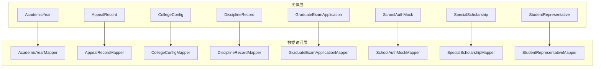

图表来源
- [AcademicYear.java:1-27](file://backend/src/main/java/com/zjsu/scholarship/entity/AcademicYear.java#L1-L27)
- [AcademicYearMapper.java:1-8](file://backend/src/main/java/com/zjsu/scholarship/mapper/AcademicYearMapper.java#L1-L8)
- [AppealRecord.java:1-27](file://backend/src/main/java/com/zjsu/scholarship/entity/AppealRecord.java#L1-L27)
- [AppealRecordMapper.java:1-10](file://backend/src/main/java/com/zjsu/scholarship/mapper/AppealRecordMapper.java#L1-L10)
- [CollegeConfig.java:1-18](file://backend/src/main/java/com/zjsu/scholarship/entity/CollegeConfig.java#L1-L18)
- [CollegeConfigMapper.java:1-10](file://backend/src/main/java/com/zjsu/scholarship/mapper/CollegeConfigMapper.java#L1-L10)
- [DisciplineRecord.java:1-26](file://backend/src/main/java/com/zjsu/scholarship/entity/DisciplineRecord.java#L1-L26)
- [DisciplineRecordMapper.java:1-10](file://backend/src/main/java/com/zjsu/scholarship/mapper/DisciplineRecordMapper.java#L1-L10)
- [GraduateExamApplication.java:1-31](file://backend/src/main/java/com/zjsu/scholarship/entity/GraduateExamApplication.java#L1-L31)
- [GraduateExamApplicationMapper.java:1-10](file://backend/src/main/java/com/zjsu/scholarship/mapper/GraduateExamApplicationMapper.java#L1-L10)
- [SchoolAuthMock.java:1-14](file://backend/src/main/java/com/zjsu/scholarship/entity/SchoolAuthMock.java#L1-L14)
- [SchoolAuthMockMapper.java:1-8](file://backend/src/main/java/com/zjsu/scholarship/mapper/SchoolAuthMockMapper.java#L1-L8)
- [SpecialScholarship.java:1-23](file://backend/src/main/java/com/zjsu/scholarship/entity/SpecialScholarship.java#L1-L23)
- [SpecialScholarshipMapper.java:1-8](file://backend/src/main/java/com/zjsu/scholarship/mapper/SpecialScholarshipMapper.java#L1-L8)
- [StudentRepresentative.java:1-20](file://backend/src/main/java/com/zjsu/scholarship/entity/StudentRepresentative.java#L1-L20)
- [StudentRepresentativeMapper.java:1-10](file://backend/src/main/java/com/zjsu/scholarship/mapper/StudentRepresentativeMapper.java#L1-L10)

章节来源
- [AcademicYear.java:1-27](file://backend/src/main/java/com/zjsu/scholarship/entity/AcademicYear.java#L1-L27)
- [AcademicYearMapper.java:1-8](file://backend/src/main/java/com/zjsu/scholarship/mapper/AcademicYearMapper.java#L1-L8)
- [AppealRecord.java:1-27](file://backend/src/main/java/com/zjsu/scholarship/entity/AppealRecord.java#L1-L27)
- [AppealRecordMapper.java:1-10](file://backend/src/main/java/com/zjsu/scholarship/mapper/AppealRecordMapper.java#L1-L10)
- [CollegeConfig.java:1-18](file://backend/src/main/java/com/zjsu/scholarship/entity/CollegeConfig.java#L1-L18)
- [CollegeConfigMapper.java:1-10](file://backend/src/main/java/com/zjsu/scholarship/mapper/CollegeConfigMapper.java#L1-L10)
- [DisciplineRecord.java:1-26](file://backend/src/main/java/com/zjsu/scholarship/entity/DisciplineRecord.java#L1-L26)
- [DisciplineRecordMapper.java:1-10](file://backend/src/main/java/com/zjsu/scholarship/mapper/DisciplineRecordMapper.java#L1-L10)
- [GraduateExamApplication.java:1-31](file://backend/src/main/java/com/zjsu/scholarship/entity/GraduateExamApplication.java#L1-L31)
- [GraduateExamApplicationMapper.java:1-10](file://backend/src/main/java/com/zjsu/scholarship/mapper/GraduateExamApplicationMapper.java#L1-L10)
- [SchoolAuthMock.java:1-14](file://backend/src/main/java/com/zjsu/scholarship/entity/SchoolAuthMock.java#L1-L14)
- [SchoolAuthMockMapper.java:1-8](file://backend/src/main/java/com/zjsu/scholarship/mapper/SchoolAuthMockMapper.java#L1-L8)
- [SpecialScholarship.java:1-23](file://backend/src/main/java/com/zjsu/scholarship/entity/SpecialScholarship.java#L1-L23)
- [SpecialScholarshipMapper.java:1-8](file://backend/src/main/java/com/zjsu/scholarship/mapper/SpecialScholarshipMapper.java#L1-L8)
- [StudentRepresentative.java:1-20](file://backend/src/main/java/com/zjsu/scholarship/entity/StudentRepresentative.java#L1-L20)
- [StudentRepresentativeMapper.java:1-10](file://backend/src/main/java/com/zjsu/scholarship/mapper/StudentRepresentativeMapper.java#L1-L10)

## 核心组件
- AcademicYear：用于统一管理学年的时间窗口与阶段节点，支撑奖学金申请、评审、公示等流程的时序控制。
- AppealRecord：承载学生对评审结果的申诉信息，包括申诉层级、原因、状态、回复与时间戳。
- CollegeConfig：以键值对形式存储学院级配置参数，为评审权限、特殊规则提供动态配置能力。
- DisciplineRecord：记录学生的纪律处分历史，含处分类型、发生日期、是否解除等，用于资格与加分/扣分影响评估。
- GraduateExamApplication：记录研究生入学考试的申请、资格、录取与等级信息，支撑跨系统数据对接。
- SchoolAuthMock：提供认证模拟账户与初始密码，便于权限测试与系统调试。
- SpecialScholarship：描述学院自定义单项奖学金的名称、金额、名额与状态，支持独立评审与计算。
- StudentRepresentative：记录学生代表的选举信息，包括学年、班级与当选时间，支撑代表履职与投票场景。

章节来源
- [AcademicYear.java:1-27](file://backend/src/main/java/com/zjsu/scholarship/entity/AcademicYear.java#L1-L27)
- [AppealRecord.java:1-27](file://backend/src/main/java/com/zjsu/scholarship/entity/AppealRecord.java#L1-L27)
- [CollegeConfig.java:1-18](file://backend/src/main/java/com/zjsu/scholarship/entity/CollegeConfig.java#L1-L18)
- [DisciplineRecord.java:1-26](file://backend/src/main/java/com/zjsu/scholarship/entity/DisciplineRecord.java#L1-L26)
- [GraduateExamApplication.java:1-31](file://backend/src/main/java/com/zjsu/scholarship/entity/GraduateExamApplication.java#L1-L31)
- [SchoolAuthMock.java:1-14](file://backend/src/main/java/com/zjsu/scholarship/entity/SchoolAuthMock.java#L1-L14)
- [SpecialScholarship.java:1-23](file://backend/src/main/java/com/zjsu/scholarship/entity/SpecialScholarship.java#L1-L23)
- [StudentRepresentative.java:1-20](file://backend/src/main/java/com/zjsu/scholarship/entity/StudentRepresentative.java#L1-L20)

## 架构总览
下图展示了支持实体在系统中的定位与典型交互路径：前端页面通过控制器调用服务层，服务层读写实体并通过对应 Mapper 持久化到数据库；部分实体还与主业务实体（如 Application、Student 等）存在外键关联，形成完整的数据闭环。

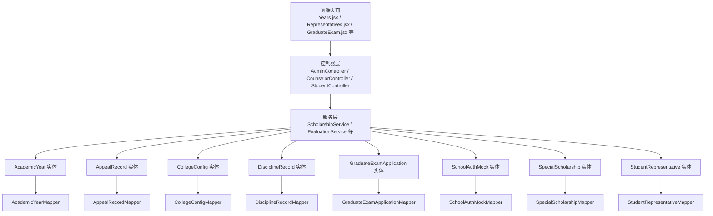

图表来源
- [AcademicYear.java:1-27](file://backend/src/main/java/com/zjsu/scholarship/entity/AcademicYear.java#L1-L27)
- [AppealRecord.java:1-27](file://backend/src/main/java/com/zjsu/scholarship/entity/AppealRecord.java#L1-L27)
- [CollegeConfig.java:1-18](file://backend/src/main/java/com/zjsu/scholarship/entity/CollegeConfig.java#L1-L18)
- [DisciplineRecord.java:1-26](file://backend/src/main/java/com/zjsu/scholarship/entity/DisciplineRecord.java#L1-L26)
- [GraduateExamApplication.java:1-31](file://backend/src/main/java/com/zjsu/scholarship/entity/GraduateExamApplication.java#L1-L31)
- [SchoolAuthMock.java:1-14](file://backend/src/main/java/com/zjsu/scholarship/entity/SchoolAuthMock.java#L1-L14)
- [SpecialScholarship.java:1-23](file://backend/src/main/java/com/zjsu/scholarship/entity/SpecialScholarship.java#L1-L23)
- [StudentRepresentative.java:1-20](file://backend/src/main/java/com/zjsu/scholarship/entity/StudentRepresentative.java#L1-L20)
- [AcademicYearMapper.java:1-8](file://backend/src/main/java/com/zjsu/scholarship/mapper/AcademicYearMapper.java#L1-L8)
- [AppealRecordMapper.java:1-10](file://backend/src/main/java/com/zjsu/scholarship/mapper/AppealRecordMapper.java#L1-L10)
- [CollegeConfigMapper.java:1-10](file://backend/src/main/java/com/zjsu/scholarship/mapper/CollegeConfigMapper.java#L1-L10)
- [DisciplineRecordMapper.java:1-10](file://backend/src/main/java/com/zjsu/scholarship/mapper/DisciplineRecordMapper.java#L1-L10)
- [GraduateExamApplicationMapper.java:1-10](file://backend/src/main/java/com/zjsu/scholarship/mapper/GraduateExamApplicationMapper.java#L1-L10)
- [SchoolAuthMockMapper.java:1-8](file://backend/src/main/java/com/zjsu/scholarship/mapper/SchoolAuthMockMapper.java#L1-L8)
- [SpecialScholarshipMapper.java:1-8](file://backend/src/main/java/com/zjsu/scholarship/mapper/SpecialScholarshipMapper.java#L1-L8)
- [StudentRepresentativeMapper.java:1-10](file://backend/src/main/java/com/zjsu/scholarship/mapper/StudentRepresentativeMapper.java#L1-L10)

## 详细组件分析

### AcademicYear（学年）
- 设计理念
  - 将“学年”抽象为一个可配置的时间周期与阶段节点集合，确保奖学金申请、评审、公示等流程严格受控于统一的时间轴。
  - 通过开始/结束时间与阶段起止时间，实现对“填报期、复核期、公示期”的精确控制，避免跨期操作。
- 关键字段与含义
  - 基础标识：id、yearName
  - 时间窗口：startDate、endDate
  - 流程节点：fillStartAt、fillEndAt、reviewStartAt、reviewEndAt、publicStartAt、publicEndAt
  - 状态：status（用于表示当前处于哪个阶段或整体状态）
- 业务实现要点
  - 服务层在执行申请、评审、发布前，应校验当前时间是否落在对应阶段窗口内。
  - 可扩展为“学期”概念：若需按学期细分，可在现有字段基础上增加学期标识与对应窗口。
- 数据模型示意

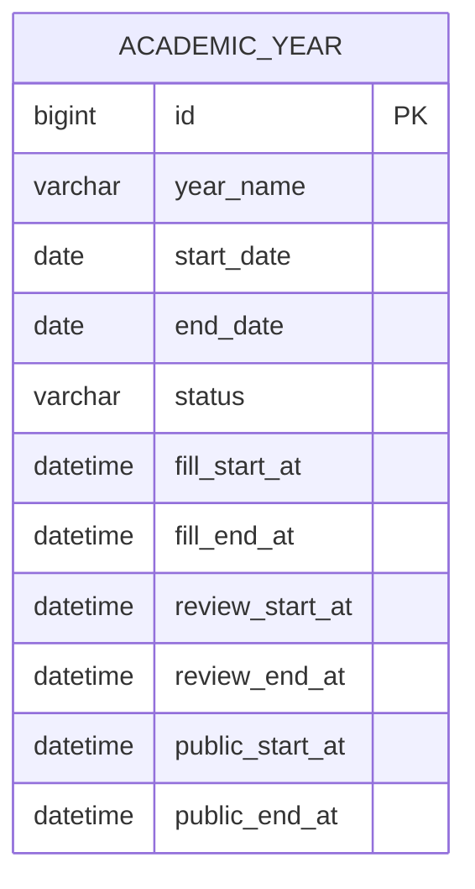

图表来源
- [AcademicYear.java:1-27](file://backend/src/main/java/com/zjsu/scholarship/entity/AcademicYear.java#L1-L27)

章节来源
- [AcademicYear.java:1-27](file://backend/src/main/java/com/zjsu/scholarship/entity/AcademicYear.java#L1-L27)
- [AcademicYearMapper.java:1-8](file://backend/src/main/java/com/zjsu/scholarship/mapper/AcademicYearMapper.java#L1-L8)

### AppealRecord（申诉记录）
- 设计理念
  - 将“申诉”流程标准化为统一的数据模型，覆盖申诉层级、原因、状态、回复与时间线，便于审计与追踪。
- 关键字段与含义
  - 关联标识：applicationId、studentId、projectId
  - 申诉层级：appealLevel（COLLEGE / UNIVERSITY）
  - 内容：reason（申诉原因）、response（处理回复）
  - 状态：status（PENDING / PROCESSING / RESOLVED / REJECTED）
  - 时间：submittedAt、respondedAt
- 业务实现要点
  - 服务层在创建申诉时校验关联申请是否存在、是否在申诉期内；处理时更新状态与回复时间。
  - 可扩展为“多级申诉”：通过新增父级申诉ID形成申诉树，支持逐级上申。
- 数据模型示意

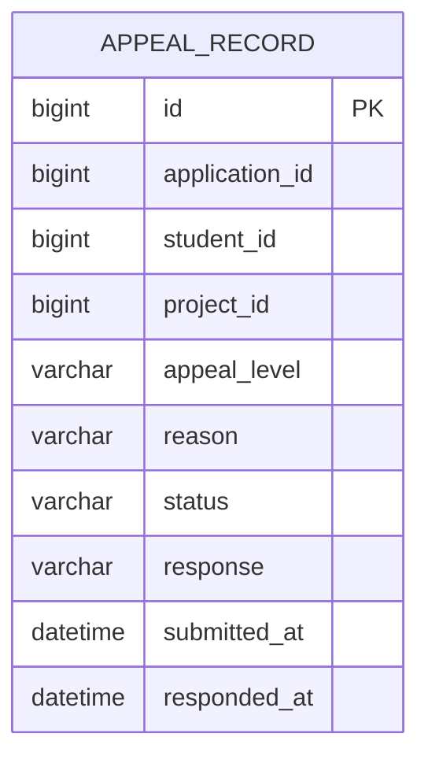

图表来源
- [AppealRecord.java:1-27](file://backend/src/main/java/com/zjsu/scholarship/entity/AppealRecord.java#L1-L27)

章节来源
- [AppealRecord.java:1-27](file://backend/src/main/java/com/zjsu/scholarship/entity/AppealRecord.java#L1-L27)
- [AppealRecordMapper.java:1-10](file://backend/src/main/java/com/zjsu/scholarship/mapper/AppealRecordMapper.java#L1-L10)

### CollegeConfig（学院配置）
- 设计理念
  - 以“键值对”形式存储学院级配置，降低硬编码风险，提高灵活性与可运维性。
- 关键字段与含义
  - 基础标识：id
  - 配置项：collegeName、configKey、configValue、description
- 业务实现要点
  - 服务层通过查询配置Key获取评审权限、阈值、开关等参数，驱动业务分支。
  - 建议引入“作用域”字段（如项目ID、学年ID）以支持更细粒度的配置隔离。
- 数据模型示意

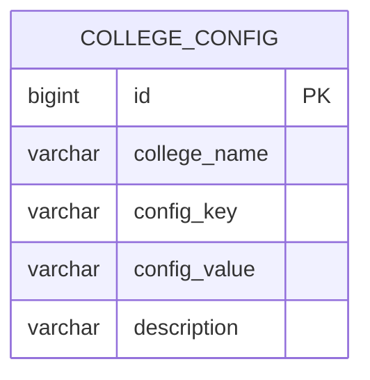

图表来源
- [CollegeConfig.java:1-18](file://backend/src/main/java/com/zjsu/scholarship/entity/CollegeConfig.java#L1-L18)

章节来源
- [CollegeConfig.java:1-18](file://backend/src/main/java/com/zjsu/scholarship/entity/CollegeConfig.java#L1-L18)
- [CollegeConfigMapper.java:1-10](file://backend/src/main/java/com/zjsu/scholarship/mapper/CollegeConfigMapper.java#L1-L10)

### DisciplineRecord（违纪记录）
- 设计理念
  - 将“违纪”作为影响奖学金资格与评分的重要外部约束，建立可追溯、可解除的记录体系。
- 关键字段与含义
  - 关联标识：studentId
  - 处分类型：disciplineType（WARNING、SEVERE_WARNING、DEMERIT、PROBATION、ILLEGAL）
  - 描述与时间：description、occurredDate、isResolved、resolvedAt、createdAt
- 业务实现要点
  - 服务层在资格审核时查询该生历史处分，按类型与解除状态决定是否影响加分/扣分或取消资格。
  - 可扩展为“影响系数”：不同处分类型对应不同的量化影响因子。
- 数据模型示意

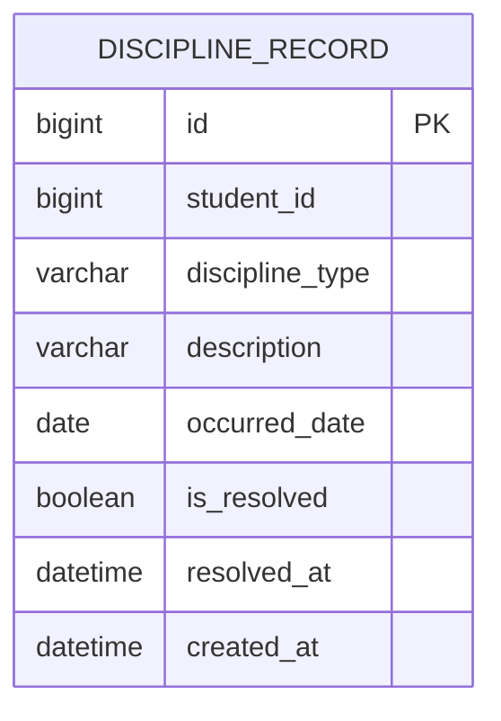

图表来源
- [DisciplineRecord.java:1-26](file://backend/src/main/java/com/zjsu/scholarship/entity/DisciplineRecord.java#L1-L26)

章节来源
- [DisciplineRecord.java:1-26](file://backend/src/main/java/com/zjsu/scholarship/entity/DisciplineRecord.java#L1-L26)
- [DisciplineRecordMapper.java:1-10](file://backend/src/main/java/com/zjsu/scholarship/mapper/DisciplineRecordMapper.java#L1-L10)

### GraduateExamApplication（研究生入学考试申请）
- 设计理念
  - 将“研考”申请纳入奖学金系统，统一管理申请、资格、录取与等级，便于跨模块数据联动。
- 关键字段与含义
  - 关联标识：studentId、academicYearId
  - 考试类型：examType（DOMESTIC / OVERSEAS）
  - 资格与结果：hasInterviewQualification、isAdmitted、schoolName、majorName
  - 状态与等级：status（SUBMITTED / APPROVED / REJECTED）、finalLevel（FIRST / SECOND）
  - 时间：submittedAt
- 业务实现要点
  - 服务层在资格审核时依据研考状态与等级确定加分或优先权；与学年绑定确保跨年度一致性。
  - 可扩展为“面试记录”与“导师推荐”等附加字段。
- 数据模型示意

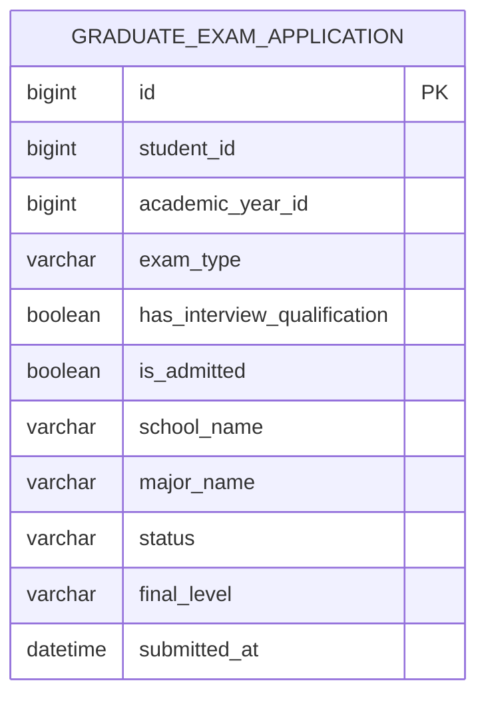

图表来源
- [GraduateExamApplication.java:1-31](file://backend/src/main/java/com/zjsu/scholarship/entity/GraduateExamApplication.java#L1-L31)

章节来源
- [GraduateExamApplication.java:1-31](file://backend/src/main/java/com/zjsu/scholarship/entity/GraduateExamApplication.java#L1-L31)
- [GraduateExamApplicationMapper.java:1-10](file://backend/src/main/java/com/zjsu/scholarship/mapper/GraduateExamApplicationMapper.java#L1-L10)

### SchoolAuthMock（学校认证模拟）
- 设计理念
  - 提供测试账户与初始密码，便于权限验证与系统调试，避免使用真实用户凭据。
- 关键字段与含义
  - 主键：account
  - 初始密码：initialPassword
- 业务实现要点
  - 仅限测试环境启用；建议配合安全策略限制访问来源与有效期。
- 数据模型示意

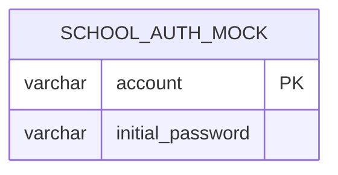

图表来源
- [SchoolAuthMock.java:1-14](file://backend/src/main/java/com/zjsu/scholarship/entity/SchoolAuthMock.java#L1-L14)

章节来源
- [SchoolAuthMock.java:1-14](file://backend/src/main/java/com/zjsu/scholarship/entity/SchoolAuthMock.java#L1-L14)
- [SchoolAuthMockMapper.java:1-8](file://backend/src/main/java/com/zjsu/scholarship/mapper/SchoolAuthMockMapper.java#L1-L8)

### SpecialScholarship（专项奖学金）
- 设计理念
  - 支持学院自定义单项奖学金，独立设定金额、名额与状态，满足差异化激励需求。
- 关键字段与含义
  - 关联标识：academicYearId
  - 奖学金信息：name、description、amount、quota、status
- 业务实现要点
  - 服务层在创建/修改时校验金额与名额的合理性；状态驱动是否开放申请。
  - 可扩展为“评审标准”字段，支持不同项目的独立评分细则。
- 数据模型示意

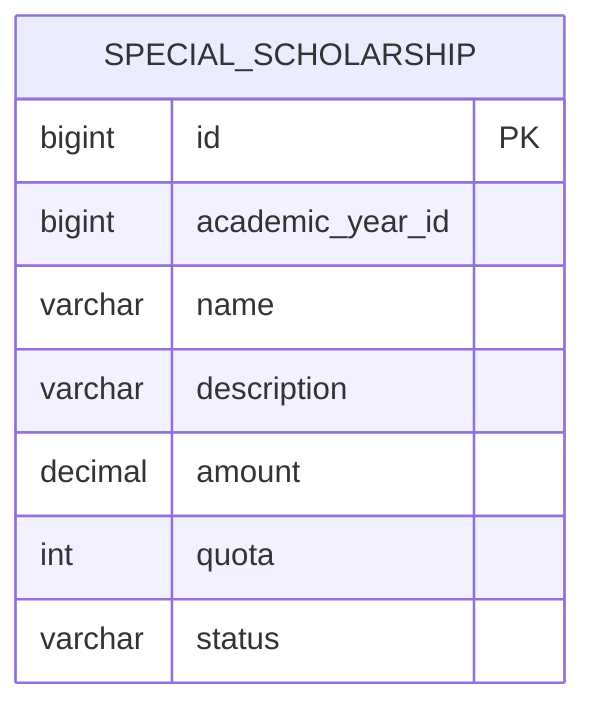

图表来源
- [SpecialScholarship.java:1-23](file://backend/src/main/java/com/zjsu/scholarship/entity/SpecialScholarship.java#L1-L23)

章节来源
- [SpecialScholarship.java:1-23](file://backend/src/main/java/com/zjsu/scholarship/entity/SpecialScholarship.java#L1-L23)
- [SpecialScholarshipMapper.java:1-8](file://backend/src/main/java/com/zjsu/scholarship/mapper/SpecialScholarshipMapper.java#L1-L8)

### StudentRepresentative（学生代表）
- 设计理念
  - 记录学生代表的选举与任期信息，支撑代表履职与投票场景。
- 关键字段与含义
  - 关联标识：academicYearId、studentId
  - 班级与当选：className、electedAt
- 业务实现要点
  - 服务层在选举期间校验候选人资格与任期冲突；与学年绑定确保跨年度合规。
  - 可扩展为“职责范围”字段，细化代表权限边界。
- 数据模型示意

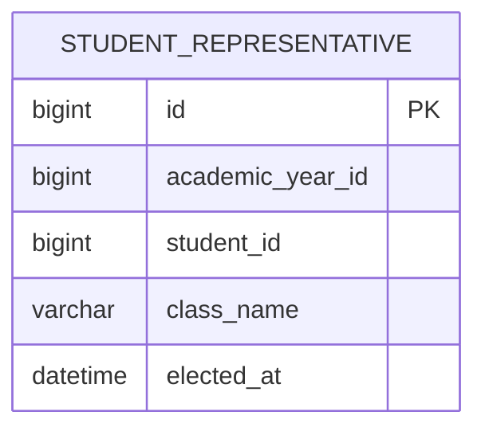

图表来源
- [StudentRepresentative.java:1-20](file://backend/src/main/java/com/zjsu/scholarship/entity/StudentRepresentative.java#L1-L20)

章节来源
- [StudentRepresentative.java:1-20](file://backend/src/main/java/com/zjsu/scholarship/entity/StudentRepresentative.java#L1-L20)
- [StudentRepresentativeMapper.java:1-10](file://backend/src/main/java/com/zjsu/scholarship/mapper/StudentRepresentativeMapper.java#L1-L10)

## 依赖分析
- 组件耦合与内聚
  - 各实体均为“薄模型”，主要承担数据承载职责，业务逻辑集中在服务层，符合高内聚低耦合原则。
  - 实体间直接依赖较少，主要通过外键与业务语义间接关联（如申请与学年、学生与处分记录等）。
- 直接与间接依赖
  - 实体依赖各自的 Mapper 接口；Mapper 由 MyBatis-Plus 提供基础设施能力，不引入额外业务依赖。
- 潜在循环依赖
  - 当前未发现实体间循环依赖；若后续引入“申诉-申请-记录”的双向引用，需谨慎设计外键与查询策略。
- 外部依赖与集成点
  - 与 MyBatis-Plus 的约定式映射、Spring 容器的依赖注入、以及前端页面的路由/页面组件存在集成关系。

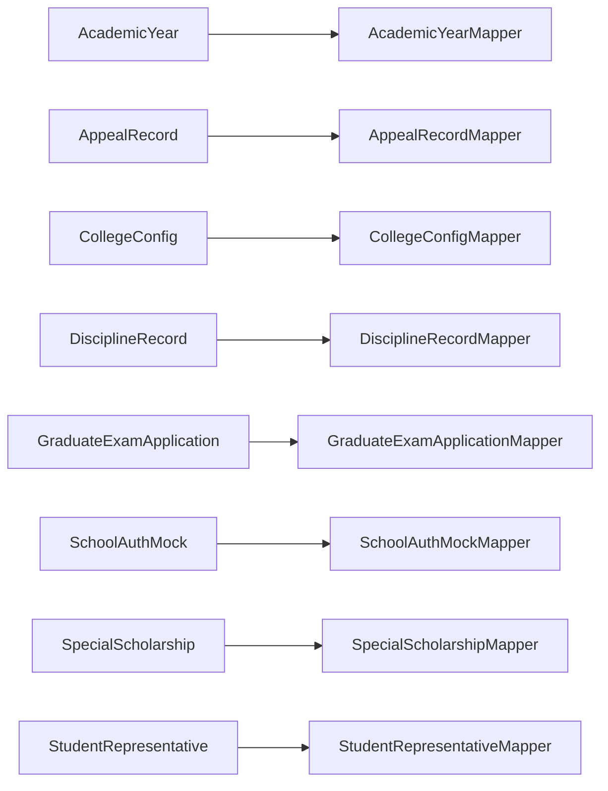

图表来源
- [AcademicYearMapper.java:1-8](file://backend/src/main/java/com/zjsu/scholarship/mapper/AcademicYearMapper.java#L1-L8)
- [AppealRecordMapper.java:1-10](file://backend/src/main/java/com/zjsu/scholarship/mapper/AppealRecordMapper.java#L1-L10)
- [CollegeConfigMapper.java:1-10](file://backend/src/main/java/com/zjsu/scholarship/mapper/CollegeConfigMapper.java#L1-L10)
- [DisciplineRecordMapper.java:1-10](file://backend/src/main/java/com/zjsu/scholarship/mapper/DisciplineRecordMapper.java#L1-L10)
- [GraduateExamApplicationMapper.java:1-10](file://backend/src/main/java/com/zjsu/scholarship/mapper/GraduateExamApplicationMapper.java#L1-L10)
- [SchoolAuthMockMapper.java:1-8](file://backend/src/main/java/com/zjsu/scholarship/mapper/SchoolAuthMockMapper.java#L1-L8)
- [SpecialScholarshipMapper.java:1-8](file://backend/src/main/java/com/zjsu/scholarship/mapper/SpecialScholarshipMapper.java#L1-L8)
- [StudentRepresentativeMapper.java:1-10](file://backend/src/main/java/com/zjsu/scholarship/mapper/StudentRepresentativeMapper.java#L1-L10)

章节来源
- [AcademicYearMapper.java:1-8](file://backend/src/main/java/com/zjsu/scholarship/mapper/AcademicYearMapper.java#L1-L8)
- [AppealRecordMapper.java:1-10](file://backend/src/main/java/com/zjsu/scholarship/mapper/AppealRecordMapper.java#L1-L10)
- [CollegeConfigMapper.java:1-10](file://backend/src/main/java/com/zjsu/scholarship/mapper/CollegeConfigMapper.java#L1-L10)
- [DisciplineRecordMapper.java:1-10](file://backend/src/main/java/com/zjsu/scholarship/mapper/DisciplineRecordMapper.java#L1-L10)
- [GraduateExamApplicationMapper.java:1-10](file://backend/src/main/java/com/zjsu/scholarship/mapper/GraduateExamApplicationMapper.java#L1-L10)
- [SchoolAuthMockMapper.java:1-8](file://backend/src/main/java/com/zjsu/scholarship/mapper/SchoolAuthMockMapper.java#L1-L8)
- [SpecialScholarshipMapper.java:1-8](file://backend/src/main/java/com/zjsu/scholarship/mapper/SpecialScholarshipMapper.java#L1-L8)
- [StudentRepresentativeMapper.java:1-10](file://backend/src/main/java/com/zjsu/scholarship/mapper/StudentRepresentativeMapper.java#L1-L10)

## 性能考虑
- 查询优化
  - 对常用过滤字段（如 academicYearId、studentId、status、appealLevel 等）建立索引，减少扫描成本。
  - 分页查询与条件裁剪：在服务层对大列表查询实施分页与必要字段投影。
- 写入优化
  - 批量插入/更新：针对配置项与代表选举等批量场景，采用批处理提升吞吐。
- 缓存策略
  - 对高频读取的配置项（如评审阈值、开关）引入本地缓存，结合失效策略保证一致性。
- 事务与锁
  - 在并发写入场景（如申诉状态变更、代表选举）使用乐观锁或分布式锁，避免竞态。

## 故障排查指南
- 常见问题与定位
  - 时间窗口异常：检查 AcademicYear 的阶段时间是否重叠或缺失，确认当前时间落在正确窗口。
  - 申诉状态不一致：核对 AppealRecord 的状态流转是否符合预期，检查 submittedAt/ respondedAt 是否正确更新。
  - 配置未生效：确认 CollegeConfig 的 key 值拼写与大小写，以及作用域匹配。
  - 处分影响误判：核查 DisciplineRecord 的 isResolved 与 occurredDate，确认是否已解除。
  - 代表重复当选：检查 StudentRepresentative 的学年与学生唯一性约束。
- 调试建议
  - 使用 SchoolAuthMock 创建测试账号，模拟不同角色登录，验证权限链路。
  - 在服务层增加关键节点的日志埋点，输出实体状态与时间戳，便于回溯。

## 结论
上述支持实体以“轻模型、强服务”的方式构建，既满足当前业务需求，又为未来扩展预留了充足空间。通过明确的状态机、清晰的字段语义与可演进的配置机制，系统能够在保持稳定的同时快速响应业务变化。

## 附录
- 扩展性设计与演进方向
  - 学年与学期：在 AcademicYear 中新增 semester 字段与学期窗口，支持按学期拆分流程。
  - 多级申诉：在 AppealRecord 中引入 parentAppealId，形成申诉树，支持逐级上申。
  - 影响系数：在 DisciplineRecord 中引入 numericImpact 字段，量化处分对评分的影响。
  - 专项评审：在 SpecialScholarship 中引入 criteriaJson 字段，存储独立评分细则。
  - 代表职责：在 StudentRepresentative 中引入 dutyScope 字段，细化代表权限边界。
  - 配置作用域：在 CollegeConfig 中引入 scopeType/scopeId 字段，支持项目/学年级配置隔离。
  - 认证模拟：在 SchoolAuthMock 中引入 expireAt 字段，限制测试账号有效期。