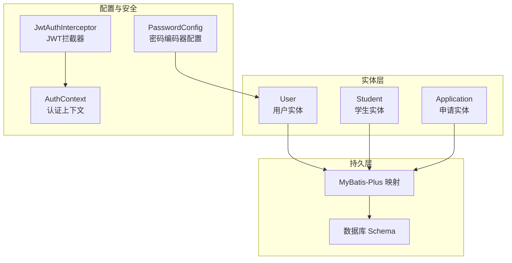
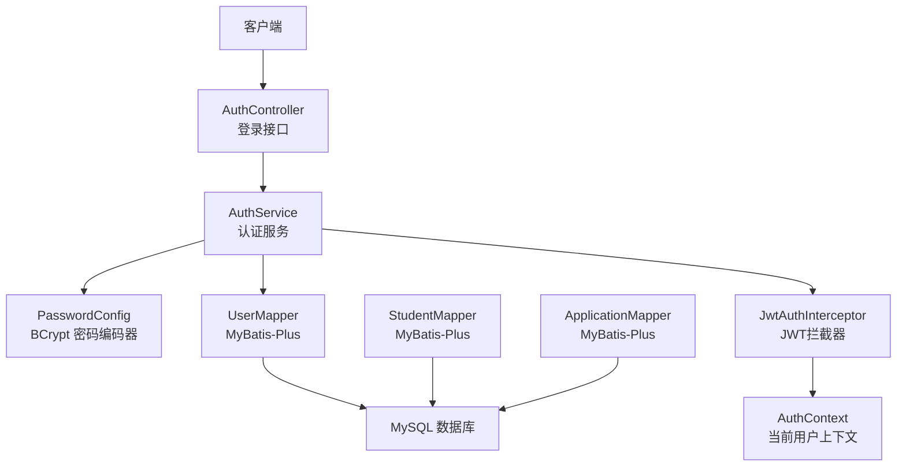
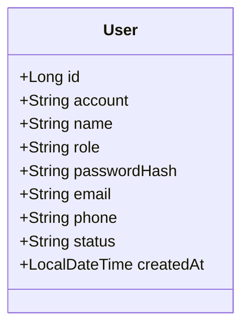
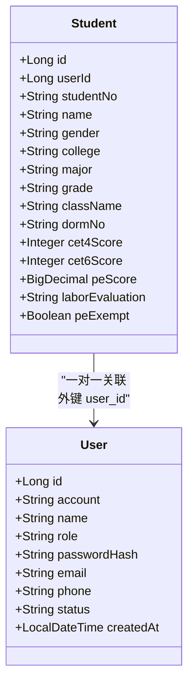
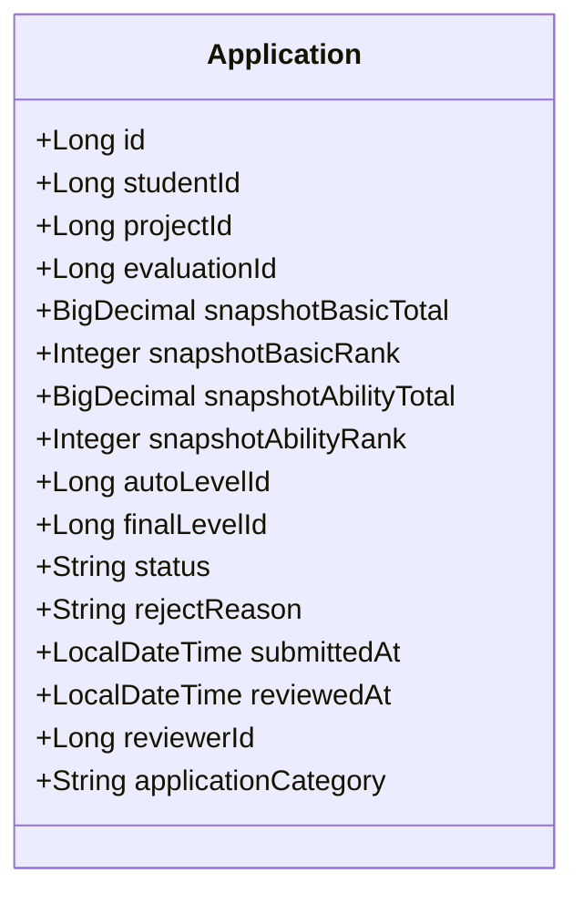
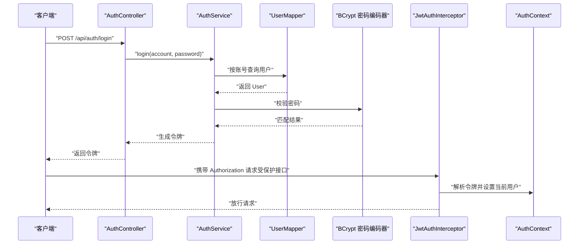
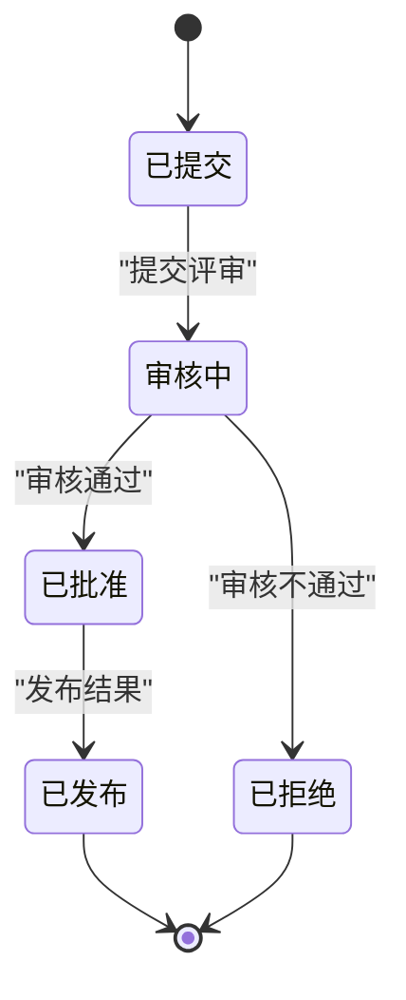
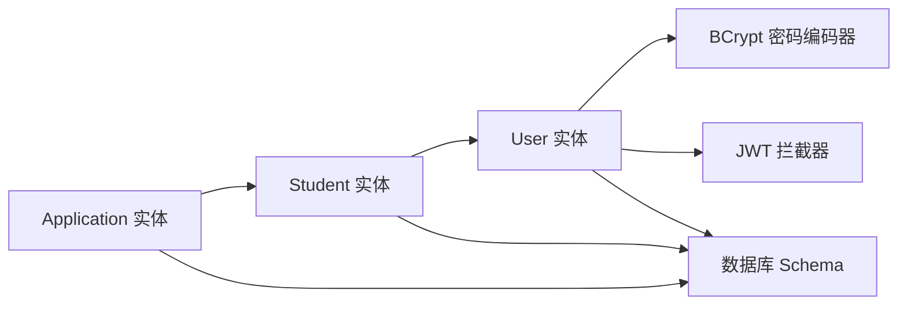

# 核心实体类

<cite>
**本文引用的文件**
- [User.java](file://backend/src/main/java/com/zjsu/scholarship/entity/User.java)
- [Student.java](file://backend/src/main/java/com/zjsu/scholarship/entity/Student.java)
- [Application.java](file://backend/src/main/java/com/zjsu/scholarship/entity/Application.java)
- [PasswordConfig.java](file://backend/src/main/java/com/zjsu/scholarship/config/PasswordConfig.java)
- [AuthService.java](file://backend/src/main/java/com/zjsu/scholarship/service/AuthService.java)
- [JwtAuthInterceptor.java](file://backend/src/main/java/com/zjsu/scholarship/security/JwtAuthInterceptor.java)
- [AuthContext.java](file://backend/src/main/java/com/zjsu/scholarship/security/AuthContext.java)
- [schema.sql](file://backend/src/main/resources/db/schema.sql)
- [pom.xml](file://backend/pom.xml)
</cite>

## 目录
1. [引言](#引言)
2. [项目结构](#项目结构)
3. [核心组件](#核心组件)
4. [架构概览](#架构概览)
5. [详细组件分析](#详细组件分析)
6. [依赖分析](#依赖分析)
7. [性能考虑](#性能考虑)
8. [故障排除指南](#故障排除指南)
9. [结论](#结论)

## 引言
本文件聚焦于奖学金申请系统中的三个核心实体类：User（用户）、Student（学生）与 Application（申请），系统性阐述其设计理念、实现细节与业务规则。内容涵盖：
- 实体字段定义、数据类型、约束条件与业务规则
- User 的角色权限设计、密码存储机制与用户状态管理
- Student 与 User 的一对一关联关系，以及学号、院系、年级等关键字段的设计考量
- Application 的申请状态流转、评分快照字段与评审流程
- Lombok 注解在实体类中的应用与设计意图
- 验证规则、时间戳字段处理与数据库映射关系
- 实体属性对照表与字段说明

## 项目结构
后端采用 Spring Boot + MyBatis-Plus 架构，实体类位于 entity 包中，并通过 MyBatis-Plus 的注解进行数据库映射；安全模块通过 JWT 进行鉴权与授权控制。

图表来源
- [User.java:10-23](file://backend/src/main/java/com/zjsu/scholarship/entity/User.java#L10-L23)
- [Student.java:8-32](file://backend/src/main/java/com/zjsu/scholarship/entity/Student.java#L8-L32)
- [Application.java:11-42](file://backend/src/main/java/com/zjsu/scholarship/entity/Application.java#L11-L42)
- [PasswordConfig.java:8-14](file://backend/src/main/java/com/zjsu/scholarship/config/PasswordConfig.java#L8-L14)
- [JwtAuthInterceptor.java:12-63](file://backend/src/main/java/com/zjsu/scholarship/security/JwtAuthInterceptor.java#L12-L63)
- [AuthContext.java:3-18](file://backend/src/main/java/com/zjsu/scholarship/security/AuthContext.java#L3-L18)
- [schema.sql:7-43](file://backend/src/main/resources/db/schema.sql#L7-L43)

章节来源
- [User.java:10-23](file://backend/src/main/java/com/zjsu/scholarship/entity/User.java#L10-L23)
- [Student.java:8-32](file://backend/src/main/java/com/zjsu/scholarship/entity/Student.java#L8-L32)
- [Application.java:11-42](file://backend/src/main/java/com/zjsu/scholarship/entity/Application.java#L11-L42)
- [schema.sql:7-43](file://backend/src/main/resources/db/schema.sql#L7-L43)

## 核心组件
本节概述三个核心实体类的职责与相互关系：
- User：系统用户主体，承载账户、角色、密码哈希、状态与创建时间等基础信息，为系统认证与授权提供支撑。
- Student：学生档案实体，与 User 通过外键关联，记录学号、院系、年级、班级、宿舍、英语与体育相关成绩等关键字段。
- Application：申请实体，关联学生与项目，维护评分快照、系统推荐等级、最终授予等级、申请状态与评审相关信息。

章节来源
- [User.java:10-23](file://backend/src/main/java/com/zjsu/scholarship/entity/User.java#L10-L23)
- [Student.java:8-32](file://backend/src/main/java/com/zjsu/scholarship/entity/Student.java#L8-L32)
- [Application.java:11-42](file://backend/src/main/java/com/zjsu/scholarship/entity/Application.java#L11-L42)

## 架构概览
下图展示用户认证、实体映射与数据库 Schema 的整体关系：

图表来源
- [AuthService.java:16-35](file://backend/src/main/java/com/zjsu/scholarship/service/AuthService.java#L16-L35)
- [PasswordConfig.java:8-14](file://backend/src/main/java/com/zjsu/scholarship/config/PasswordConfig.java#L8-L14)
- [JwtAuthInterceptor.java:12-63](file://backend/src/main/java/com/zjsu/scholarship/security/JwtAuthInterceptor.java#L12-L63)
- [AuthContext.java:3-18](file://backend/src/main/java/com/zjsu/scholarship/security/AuthContext.java#L3-L18)

## 详细组件分析

### User 用户实体
- 设计理念
  - 作为系统认证与授权的基础实体，集中管理用户身份信息与安全属性。
  - 通过角色字段支持多角色体系，结合拦截器实现基于角色的访问控制。
- 字段定义与约束
  - 主键：自增 Long 类型 id
  - 账户：VARCHAR(32)，唯一且非空
  - 姓名：VARCHAR(50)，非空
  - 角色：VARCHAR(20)，非空
  - 密码哈希：VARCHAR(120)，用于安全存储
  - 邮箱/电话：可选字符串
  - 状态：VARCHAR(20)，默认 ACTIVE
  - 创建时间：TIMESTAMP，默认当前时间
- 权限与状态管理
  - 角色字段配合拦截器使用，实现不同角色的资源访问控制。
  - 状态字段用于启用/禁用用户，便于统一管理。
- 密码存储机制
  - 通过 BCrypt 编码器进行加密存储，确保密码安全。
- 时间戳处理
  - 使用 Java 时间对象映射到数据库的 TIMESTAMP，默认值由数据库定义。
- 数据库映射
  - 表名 users，主键自增，部分字段具备唯一性与默认值约束。

图表来源
- [User.java:10-23](file://backend/src/main/java/com/zjsu/scholarship/entity/User.java#L10-L23)
- [schema.sql:7-17](file://backend/src/main/resources/db/schema.sql#L7-L17)

章节来源
- [User.java:10-23](file://backend/src/main/java/com/zjsu/scholarship/entity/User.java#L10-L23)
- [schema.sql:7-17](file://backend/src/main/resources/db/schema.sql#L7-L17)
- [PasswordConfig.java:8-14](file://backend/src/main/java/com/zjsu/scholarship/config/PasswordConfig.java#L8-L14)
- [AuthService.java:32-50](file://backend/src/main/java/com/zjsu/scholarship/service/AuthService.java#L32-L50)

### Student 学生实体
- 设计理念
  - 记录学生的完整学籍与表现信息，支撑奖学金评选所需的综合测评与资格审查。
  - 与 User 保持一对一关联，确保学生身份与系统账户的绑定。
- 字段定义与约束
  - 主键：自增 Long id
  - 关联字段：user_id（NOT NULL），指向 users.id
  - 学号：VARCHAR(20)，唯一且非空
  - 姓名/性别：可选
  - 院系/专业/年级/班级/宿舍：可选字符串
  - 英语成绩：CET-4/CET-6 分数，整型；CET-6 以 0 表示未报考
  - 体育成绩：PE 总分，小数；是否免测布尔标志
  - 劳动教育：PASS/FAIL/PENDING 三态
- 关联关系
  - 一对一关联至 User，外键 user_id 约束非空。
- 数据库映射
  - 表名 students，多字段具备唯一性与默认值约束。

图表来源
- [Student.java:8-32](file://backend/src/main/java/com/zjsu/scholarship/entity/Student.java#L8-L32)
- [User.java:10-23](file://backend/src/main/java/com/zjsu/scholarship/entity/User.java#L10-L23)
- [schema.sql:25-43](file://backend/src/main/resources/db/schema.sql#L25-L43)

章节来源
- [Student.java:8-32](file://backend/src/main/java/com/zjsu/scholarship/entity/Student.java#L8-L32)
- [schema.sql:25-43](file://backend/src/main/resources/db/schema.sql#L25-L43)

### Application 申请实体
- 设计理念
  - 记录学生针对具体奖学金项目的申请信息，包含评分快照、系统推荐与最终授予等级、申请状态与评审信息。
  - 支持多类别申请（综合、能力、考研、单项、命名等），便于差异化处理。
- 字段定义与约束
  - 主键：自增 Long id
  - 关联字段：student_id、project_id、evaluation_id（可空）
  - 评分快照：基本项与综合能力的总分与排名，用于历史复现
  - 等级字段：autoLevelId（系统推荐）、finalLevelId（最终授予）
  - 状态：SUBMITTED/REVIEWING/APPROVED/REJECTED/WITHDRAWN/PUBLISHED
  - 评审信息：拒绝原因、提交/评审时间、评审人 ID
  - 申请分类：COMPREHENSIVE/ABILITY/GRADUATE_EXAM/SPECIAL/NAMED
- 业务规则
  - 申请状态机驱动评审流程，状态变更需遵循预设规则。
  - 评分快照用于保证历史数据一致性与可追溯性。
- 数据库映射
  - 表名 applications，包含唯一性约束与默认值。

图表来源
- [Application.java:11-42](file://backend/src/main/java/com/zjsu/scholarship/entity/Application.java#L11-L42)
- [schema.sql:294-315](file://backend/src/main/resources/db/schema.sql#L294-L315)

章节来源
- [Application.java:11-42](file://backend/src/main/java/com/zjsu/scholarship/entity/Application.java#L11-L42)
- [schema.sql:294-315](file://backend/src/main/resources/db/schema.sql#L294-L315)

### 认证与授权流程（序列图）
展示从登录到设置认证上下文的完整流程，体现 User、AuthService、PasswordConfig、JwtAuthInterceptor 与 AuthContext 的协作。

图表来源
- [AuthService.java:32-50](file://backend/src/main/java/com/zjsu/scholarship/service/AuthService.java#L32-L50)
- [PasswordConfig.java:8-14](file://backend/src/main/java/com/zjsu/scholarship/config/PasswordConfig.java#L8-L14)
- [JwtAuthInterceptor.java:20-58](file://backend/src/main/java/com/zjsu/scholarship/security/JwtAuthInterceptor.java#L20-L58)
- [AuthContext.java:10-18](file://backend/src/main/java/com/zjsu/scholarship/security/AuthContext.java#L10-L18)

章节来源
- [AuthService.java:32-50](file://backend/src/main/java/com/zjsu/scholarship/service/AuthService.java#L32-L50)
- [JwtAuthInterceptor.java:20-58](file://backend/src/main/java/com/zjsu/scholarship/security/JwtAuthInterceptor.java#L20-L58)
- [AuthContext.java:10-18](file://backend/src/main/java/com/zjsu/scholarship/security/AuthContext.java#L10-L18)

### 申请状态流转（状态图）
展示 Application 的典型状态变化路径，体现从提交到发布的完整生命周期。

图表来源
- [Application.java:34-35](file://backend/src/main/java/com/zjsu/scholarship/entity/Application.java#L34-L35)

章节来源
- [Application.java:34-35](file://backend/src/main/java/com/zjsu/scholarship/entity/Application.java#L34-L35)

### 字段与约束对照表
以下表格汇总核心实体的关键字段、数据类型、约束与业务含义（来源于实体类与数据库 Schema）：

- User（用户）
  - id：Long，主键，自增
  - account：VARCHAR(32)，唯一，非空
  - name：VARCHAR(50)，非空
  - role：VARCHAR(20)，非空
  - passwordHash：VARCHAR(120)
  - email/phone：VARCHAR(100)/VARCHAR(20)
  - status：VARCHAR(20)，默认 ACTIVE
  - createdAt：TIMESTAMP，默认当前时间

- Student（学生）
  - id：Long，主键，自增
  - userId：BIGINT，非空，外键 users(id)
  - studentNo：VARCHAR(20)，唯一，非空
  - name/gender/college/major/grade/className/dormNo：可选
  - cet4Score/cet6Score：INT
  - peScore：DECIMAL(5,1)
  - laborEvaluation：VARCHAR(20)，默认 PENDING
  - peExempt：BOOLEAN，默认 FALSE

- Application（申请）
  - id：Long，主键，自增
  - studentId/projectId/evaluationId：BIGINT，前两者非空
  - snapshotBasicTotal/AbilityTotal：DECIMAL(8,3)
  - snapshotBasicRank/AbilityRank：INT
  - autoLevelId/finalLevelId：BIGINT
  - status：VARCHAR(20)，默认 SUBMITTED
  - rejectReason：VARCHAR(255)
  - submittedAt/reviewedAt：TIMESTAMP
  - reviewerId：BIGINT
  - applicationCategory：VARCHAR(30)

章节来源
- [User.java:10-23](file://backend/src/main/java/com/zjsu/scholarship/entity/User.java#L10-L23)
- [Student.java:8-32](file://backend/src/main/java/com/zjsu/scholarship/entity/Student.java#L8-L32)
- [Application.java:11-42](file://backend/src/main/java/com/zjsu/scholarship/entity/Application.java#L11-L42)
- [schema.sql:7-43](file://backend/src/main/resources/db/schema.sql#L7-L43)
- [schema.sql:294-315](file://backend/src/main/resources/db/schema.sql#L294-L315)

### Lombok 注解应用说明
- @Data：自动生成 getter/setter/toString/equals/hashCode 等方法，提升开发效率，减少样板代码。
- @TableName：指定实体对应的数据库表名，简化 ORM 映射。
- @TableId：标识主键字段及主键生成策略（如自增）。
- 设计意图：通过注解减少重复代码，明确数据库映射关系，同时保持实体类简洁易读。

章节来源
- [User.java:10-11](file://backend/src/main/java/com/zjsu/scholarship/entity/User.java#L10-L11)
- [Student.java:8-9](file://backend/src/main/java/com/zjsu/scholarship/entity/Student.java#L8-L9)
- [Application.java:11-12](file://backend/src/main/java/com/zjsu/scholarship/entity/Application.java#L11-L12)
- [pom.xml:73-75](file://backend/pom.xml#L73-L75)

## 依赖分析
- 实体类依赖 MyBatis-Plus 注解进行数据库映射，无需额外 ORM 配置。
- 安全模块通过 Spring Security 的 BCrypt 编码器与 JWT 拦截器实现认证与授权。
- 实体间通过外键建立关联，Application 与 Student、User 间接关联。

图表来源
- [User.java:10-23](file://backend/src/main/java/com/zjsu/scholarship/entity/User.java#L10-L23)
- [Student.java:8-32](file://backend/src/main/java/com/zjsu/scholarship/entity/Student.java#L8-L32)
- [Application.java:11-42](file://backend/src/main/java/com/zjsu/scholarship/entity/Application.java#L11-L42)
- [PasswordConfig.java:8-14](file://backend/src/main/java/com/zjsu/scholarship/config/PasswordConfig.java#L8-L14)
- [JwtAuthInterceptor.java:12-63](file://backend/src/main/java/com/zjsu/scholarship/security/JwtAuthInterceptor.java#L12-L63)
- [schema.sql:7-43](file://backend/src/main/resources/db/schema.sql#L7-L43)

章节来源
- [PasswordConfig.java:8-14](file://backend/src/main/java/com/zjsu/scholarship/config/PasswordConfig.java#L8-L14)
- [JwtAuthInterceptor.java:12-63](file://backend/src/main/java/com/zjsu/scholarship/security/JwtAuthInterceptor.java#L12-L63)
- [schema.sql:7-43](file://backend/src/main/resources/db/schema.sql#L7-L43)

## 性能考虑
- 字段精度选择：评分类字段采用 DECIMAL 类型，确保计算精度与存储效率平衡。
- 唯一性约束：账户与学号字段设置唯一索引，避免重复录入引发的数据问题。
- 时间戳默认值：数据库层面设置默认值，减少空值处理复杂度。
- 建议：在高频查询字段上建立索引（如 account、studentNo、status），并根据实际业务场景优化查询条件。

## 故障排除指南
- 登录失败
  - 检查账户是否存在与密码是否正确（BCrypt 校验）。
  - 确认用户状态为 ACTIVE。
- 权限不足
  - 核对角色字段与拦截器要求的角色列表是否匹配。
- 申请状态异常
  - 按状态机检查状态流转是否符合预期，必要时回溯评审记录。
- 数据重复
  - 核对唯一性约束字段（account、studentNo）是否冲突。

章节来源
- [AuthService.java:32-50](file://backend/src/main/java/com/zjsu/scholarship/service/AuthService.java#L32-L50)
- [JwtAuthInterceptor.java:40-51](file://backend/src/main/java/com/zjsu/scholarship/security/JwtAuthInterceptor.java#L40-L51)
- [schema.sql:7-17](file://backend/src/main/resources/db/schema.sql#L7-L17)
- [schema.sql:25-43](file://backend/src/main/resources/db/schema.sql#L25-L43)
- [schema.sql:294-315](file://backend/src/main/resources/db/schema.sql#L294-L315)

## 结论
本文件系统梳理了 User、Student 与 Application 三大核心实体的设计与实现要点，明确了字段定义、约束条件、业务规则与数据库映射关系。通过 Lombok 注解简化了实体类编写，借助 BCrypt 与 JWT 实现了安全的认证与授权。建议在后续迭代中持续关注字段精度、索引策略与状态机完整性，以保障系统的稳定性与可维护性。