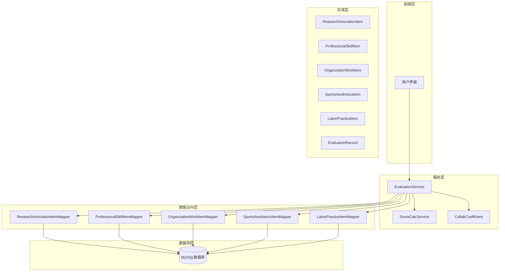
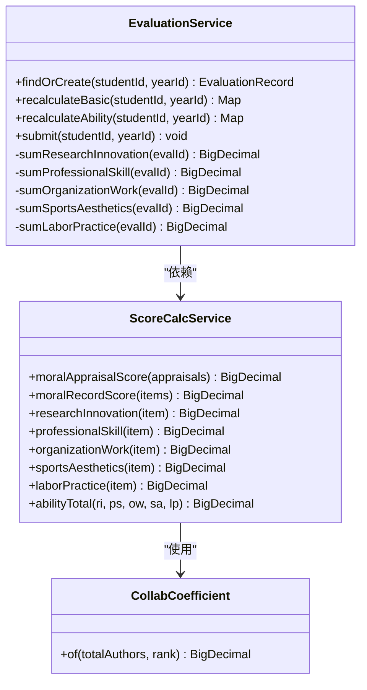
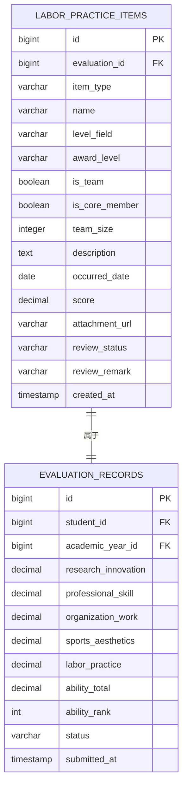
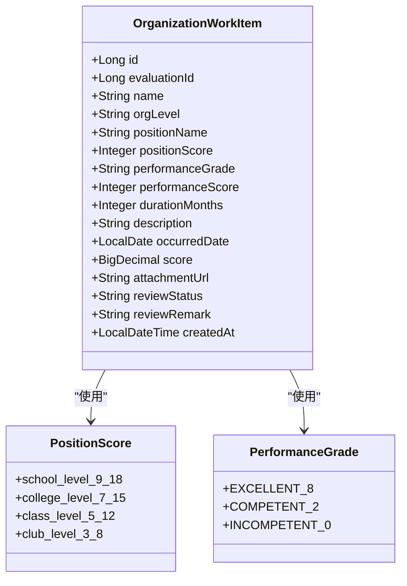
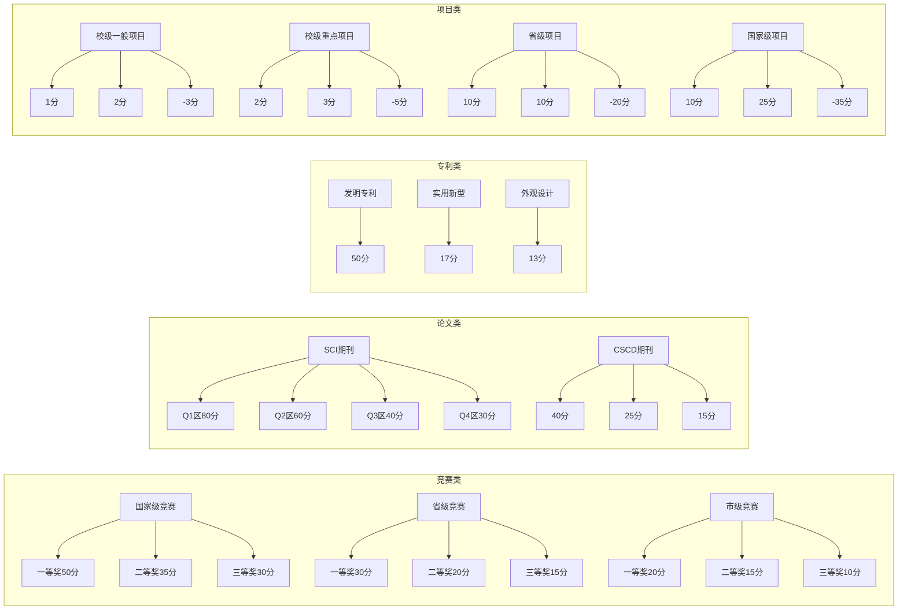
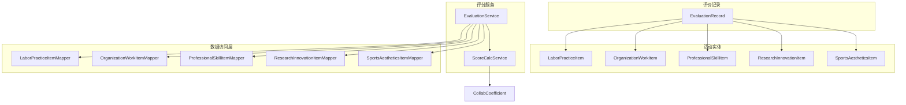
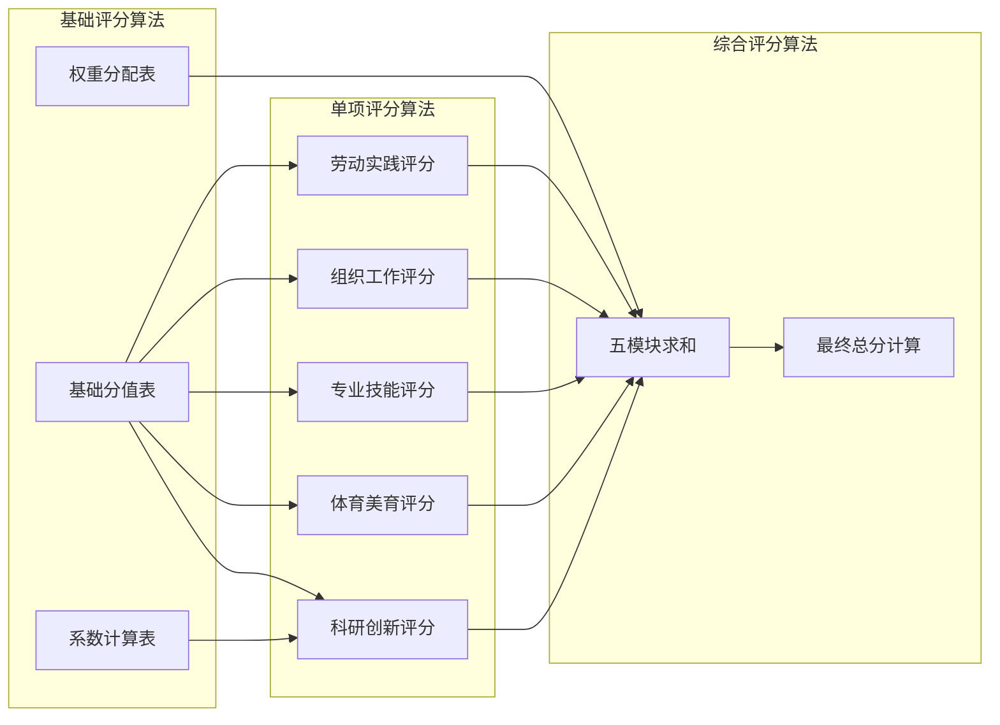
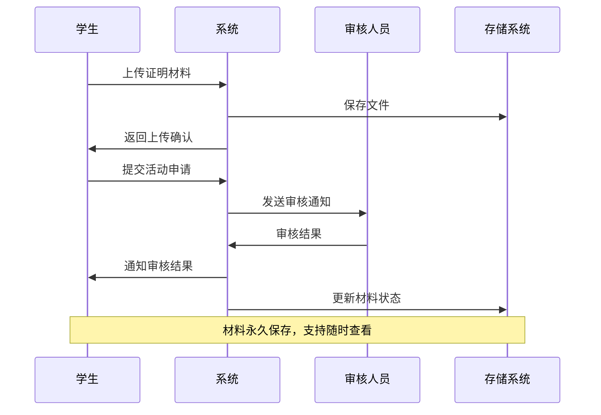

# 活动实体类

<cite>
**本文引用的文件**
- [LaborPracticeItem.java](file://backend/src/main/java/com/zjsu/scholarship/entity/LaborPracticeItem.java)
- [OrganizationWorkItem.java](file://backend/src/main/java/com/zjsu/scholarship/entity/OrganizationWorkItem.java)
- [ProfessionalSkillItem.java](file://backend/src/main/java/com/zjsu/scholarship/entity/ProfessionalSkillItem.java)
- [ResearchInnovationItem.java](file://backend/src/main/java/com/zjsu/scholarship/entity/ResearchInnovationItem.java)
- [SportsAestheticsItem.java](file://backend/src/main/java/com/zjsu/scholarship/entity/SportsAestheticsItem.java)
- [ScoreCalcService.java](file://backend/src/main/java/com/zjsu/scholarship/service/ScoreCalcService.java)
- [EvaluationService.java](file://backend/src/main/java/com/zjsu/scholarship/service/EvaluationService.java)
- [CollabCoefficient.java](file://backend/src/main/java/com/zjsu/scholarship/service/CollabCoefficient.java)
- [EvaluationRecord.java](file://backend/src/main/java/com/zjsu/scholarship/entity/EvaluationRecord.java)
- [schema.sql](file://backend/src/main/resources/db/schema.sql)
- [LaborPracticeItemMapper.java](file://backend/src/main/java/com/zjsu/scholarship/mapper/LaborPracticeItemMapper.java)
- [ResearchInnovationItemMapper.java](file://backend/src/main/java/com/zjsu/scholarship/mapper/ResearchInnovationItemMapper.java)
- [ProfessionalSkillItemMapper.java](file://backend/src/main/java/com/zjsu/scholarship/mapper/ProfessionalSkillItemMapper.java)
- [OrganizationWorkItemMapper.java](file://backend/src/main/java/com/zjsu/scholarship/mapper/OrganizationWorkItemMapper.java)
- [SportsAestheticsItemMapper.java](file://backend/src/main/java/com/zjsu/scholarship/mapper/SportsAestheticsItemMapper.java)
</cite>

## 目录
1. [简介](#简介)
2. [项目结构](#项目结构)
3. [核心组件](#核心组件)
4. [架构概览](#架构概览)
5. [详细组件分析](#详细组件分析)
6. [依赖关系分析](#依赖关系分析)
7. [性能考虑](#性能考虑)
8. [故障排除指南](#故障排除指南)
9. [结论](#结论)
10. [附录](#附录)

## 简介
本文档详细阐述了浙江工商大学本科生奖学金评选系统中各类能力活动实体的设计思路和评分机制。系统采用双轨制综合评价体系，包括基本项（品德×30% + 专业素质×70%）和综合能力（75 + 五模块加权）两大模块。本文重点分析以下五类活动实体：劳动实践项目、组织工作、专业技能、科研创新、体育美育，并提供统一的评分算法、累计计算规则、证明材料管理机制以及年度限制和重复认定规则。

## 项目结构
系统采用分层架构设计，主要分为实体层、服务层、数据访问层和数据库层：



**图表来源**
- [EvaluationService.java:23-61](file://backend/src/main/java/com/zjsu/scholarship/service/EvaluationService.java#L23-L61)
- [ScoreCalcService.java:18-423](file://backend/src/main/java/com/zjsu/scholarship/service/ScoreCalcService.java#L18-L423)

**章节来源**
- [EvaluationService.java:15-61](file://backend/src/main/java/com/zjsu/scholarship/service/EvaluationService.java#L15-L61)
- [schema.sql:1-402](file://backend/src/main/resources/db/schema.sql#L1-L402)

## 核心组件
系统的核心组件包括五个活动实体类和相应的评分服务：

### 活动实体类概述
- **LaborPracticeItem**：劳动实践项目实体，支持劳动教育和社会实践两类
- **OrganizationWorkItem**：组织工作实体，记录学生在各级组织的任职情况
- **ProfessionalSkillItem**：专业技能实体，涵盖语言、计算机、职业资格等技能
- **ResearchInnovationItem**：科研创新实体，包含竞赛、论文、专利、项目等多种类型
- **SportsAestheticsItem**：体育美育实体，涵盖体育竞技和艺术活动

### 评分服务架构
系统采用专门的评分计算服务，提供统一的评分算法和权重分配：



**图表来源**
- [ScoreCalcService.java:18-423](file://backend/src/main/java/com/zjsu/scholarship/service/ScoreCalcService.java#L18-L423)
- [EvaluationService.java:23-61](file://backend/src/main/java/com/zjsu/scholarship/service/EvaluationService.java#L23-L61)
- [CollabCoefficient.java:6-27](file://backend/src/main/java/com/zjsu/scholarship/service/CollabCoefficient.java#L6-L27)

**章节来源**
- [ScoreCalcService.java:10-423](file://backend/src/main/java/com/zjsu/scholarship/service/ScoreCalcService.java#L10-L423)
- [EvaluationService.java:15-308](file://backend/src/main/java/com/zjsu/scholarship/service/EvaluationService.java#L15-L308)

## 架构概览
系统采用双轨制综合评价架构，基本项和综合能力分别计算后合并：

```mermaid
flowchart TD
Start([开始计算]) --> Basic[基本项计算]
Basic --> Moral[品德评议分]
Basic --> Record[品德记实分]
Basic --> Academic[专业素质加权平均]
Basic --> BasicTotal[基本项总分 = 品德×30% + 专业×70%]
BasicTotal --> Ability[综合能力计算]
Ability --> RI[研究创新模块]
Ability --> PS[专业技能模块]
Ability --> OW[组织工作模块]
Ability --> SA[体育美育模块]
Ability --> LP[劳动实践模块]
RI --> RIcalc[单项评分计算]
PS --> PScalc[单项评分计算]
OW --> OWcalc[单项评分计算]
SA --> SAcalc[单项评分计算]
LP --> LPcalc[单项评分计算]
RIcalc --> SumRI[求和]
PScalc --> SumPS[求和]
OWcalc --> SumOW[求和]
SAcalc --> SumSA[求和]
LPcalc --> SumLP[求和]
SumRI --> WeightRI[乘以权重30%]
SumPS --> WeightPS[乘以权重25%]
SumOW --> WeightOW[乘以权重15%]
SumSA --> WeightSA[乘以权重15%]
SumLP --> WeightLP[乘以权重15%]
WeightRI --> Final[最终总分 = 基本项 + 75 + Σ(五模块×权重)]
WeightPS --> Final
WeightOW --> Final
WeightSA --> Final
WeightLP --> Final
Final --> End([结束])
```

**图表来源**
- [ScoreCalcService.java:184-414](file://backend/src/main/java/com/zjsu/scholarship/service/ScoreCalcService.java#L184-L414)
- [EvaluationService.java:139-173](file://backend/src/main/java/com/zjsu/scholarship/service/EvaluationService.java#L139-L173)

## 详细组件分析

### 劳动实践项目实体分析
劳动实践项目实体设计用于记录学生的劳动教育和社会实践经历，支持团队和个人两种参与方式。

#### 数据结构设计


**图表来源**
- [LaborPracticeItem.java:15-36](file://backend/src/main/java/com/zjsu/scholarship/entity/LaborPracticeItem.java#L15-L36)
- [schema.sql:214-232](file://backend/src/main/resources/db/schema.sql#L214-L232)

#### 学时计算机制
劳动实践项目的学时计算采用基础分制度，不同级别的奖项对应不同的基础分数：

| 等级 | 一等奖 | 二等奖 | 三等奖 |
|------|--------|--------|--------|
| 国家级 | 50分 | 35分 | 25分 |
| 省级 | 30分 | 20分 | 15分 |
| 市级 | 18分 | 12分 | 8分 |
| 校级 | 12分 | 8分 | 5分 |
| 院级 | 5分 | 3分 | 2分 |

#### 实践内容管理
系统支持多种劳动实践类型，包括：
- 社会实践：如暑期社会实践、志愿服务等
- 劳动教育：如校园劳动、生产实习等
- 志愿服务：如支教、社区服务等

#### 证明材料管理
每个劳动实践项目都要求提供相应的证明材料，包括：
- 活动组织方证明
- 参与证明
- 活动总结报告
- 相关照片或视频资料

**章节来源**
- [LaborPracticeItem.java:12-36](file://backend/src/main/java/com/zjsu/scholarship/entity/LaborPracticeItem.java#L12-L36)
- [schema.sql:214-232](file://backend/src/main/resources/db/schema.sql#L214-L232)
- [ScoreCalcService.java:359-371](file://backend/src/main/java/com/zjsu/scholarship/service/ScoreCalcService.java#L359-L371)

### 组织工作实体分析
组织工作实体用于记录学生在各级组织中的任职情况，包括学校、学院、班级、社团等不同层级。

#### 职务认定机制
组织工作的职务认定基于两个维度：
1. **岗位分值**：根据职务级别确定基础分值（9-18分）
2. **绩效评估**：根据工作表现确定绩效分值（优秀8分，称职2分，不称职0分）



**图表来源**
- [OrganizationWorkItem.java:15-38](file://backend/src/main/java/com/zjsu/scholarship/entity/OrganizationWorkItem.java#L15-L38)

#### 工作时长计算
组织工作的时长计算采用分段系数：
- 任职6个月以下：系数为0
- 任职6-12个月：系数为0.5
- 任职12个月以上：系数为1.0

#### 贡献评估机制
贡献评估通过"岗位分 + 绩效分"的方式体现，具体计算公式为：
**组织工作得分 = (岗位分 + 绩效分) × 任职系数**

**章节来源**
- [OrganizationWorkItem.java:12-38](file://backend/src/main/java/com/zjsu/scholarship/entity/OrganizationWorkItem.java#L12-L38)
- [ScoreCalcService.java:326-342](file://backend/src/main/java/com/zjsu/scholarship/service/ScoreCalcService.java#L326-L342)

### 专业技能实体分析
专业技能实体涵盖语言能力、计算机技能、职业资格等多个方面，为学生提供多元化的技能展示平台。

#### 证书管理体系
专业技能项目按类型分为五种：
1. **CET4**：大学英语四级考试
2. **CET6**：大学英语六级考试  
3. **COMPUTER**：计算机等级考试
4. **CERTIFICATE**：职业资格证书
5. **ENTRANCE_EXAM**：入学考试相关技能

#### 技能等级标准
不同类型的技能采用不同的评分标准：

**语言技能评分标准**：
- CET4：≥550分得10分，≥425分得6分，否则为0分
- CET6：≥520分得15分，≥425分得12分，否则为0分

**计算机技能评分标准**：
- 计算机三级：10分
- 计算机二级：6分
- 其他：0分

**职业资格证书评分标准**：
- 高级：30分
- 中级：20分
- 初级：10分

#### 加分规则
专业技能项目采用一次性认定原则，同一类型技能按最高分值认定，不重复累加。

**章节来源**
- [ProfessionalSkillItem.java:12-32](file://backend/src/main/java/com/zjsu/scholarship/entity/ProfessionalSkillItem.java#L12-L32)
- [ScoreCalcService.java:292-324](file://backend/src/main/java/com/zjsu/scholarship/service/ScoreCalcService.java#L292-L324)

### 科研创新实体分析
科研创新实体是系统中最复杂的模块，涵盖竞赛、论文、专利、项目等多种类型的创新成果。

#### 成果认定体系
科研创新项目按成果类型分为四种：



**图表来源**
- [ResearchInnovationItem.java:19-48](file://backend/src/main/java/com/zjsu/scholarship/entity/ResearchInnovationItem.java#L19-L48)
- [ScoreCalcService.java:184-262](file://backend/src/main/java/com/zjsu/scholarship/service/ScoreCalcService.java#L184-L262)

#### 创新级别评估
系统对不同类型的科研成果设定明确的级别标准：

**竞赛级别分类**：
- A类：国家级竞赛
- B类：省级竞赛  
- C类：市级竞赛

**期刊级别分类**：
- SCI期刊：按分区等级划分
- CSSCI期刊：核心期刊认定
- 一般期刊：普通学术期刊

**项目级别分类**：
- 校级一般项目
- 校级重点项目
- 省级项目
- 国家级项目

#### 学术价值评估
学术价值通过多个维度进行评估：
1. **影响因子**：期刊的影响因子和分区
2. **作者排序**：第一作者、通讯作者、其他作者
3. **合作系数**：多人成果的分摊系数
4. **核心成员认定**：核心成员享受额外加分

**章节来源**
- [ResearchInnovationItem.java:12-48](file://backend/src/main/java/com/zjsu/scholarship/entity/ResearchInnovationItem.java#L12-L48)
- [ScoreCalcService.java:184-262](file://backend/src/main/java/com/zjsu/scholarship/service/ScoreCalcService.java#L184-L262)

### 体育美育实体分析
体育美育实体涵盖体育竞技和艺术活动，鼓励学生全面发展。

#### 参与类型分类
体育美育项目按活动性质分为两类：
1. **SPORTS**：体育竞技类活动
2. **AESTHETICS**：艺术美育类活动

#### 获奖等级标准
体育美育项目的获奖等级与劳动实践项目一致，采用相同的分级标准：

| 等级 | 一等奖 | 二等奖 | 三等奖 |
|------|--------|--------|--------|
| 国家级 | 50分 | 35分 | 25分 |
| 省级 | 30分 | 20分 | 15分 |
| 市级 | 18分 | 12分 | 8分 |
| 校级 | 12分 | 8分 | 5分 |
| 院级 | 5分 | 3分 | 2分 |

#### 综合素质加分
体育美育项目采用团队系数进行差异化评分：
- **个人项目**：基础分不变
- **团队项目**：核心成员系数0.8，普通成员系数0.5

**章节来源**
- [SportsAestheticsItem.java:12-36](file://backend/src/main/java/com/zjsu/scholarship/entity/SportsAestheticsItem.java#L12-L36)
- [ScoreCalcService.java:344-357](file://backend/src/main/java/com/zjsu/scholarship/service/ScoreCalcService.java#L344-L357)

## 依赖关系分析

### 数据模型依赖关系
系统中的实体类遵循统一的依赖模式，所有活动实体都依赖于评价记录实体：



**图表来源**
- [EvaluationRecord.java:13-44](file://backend/src/main/java/com/zjsu/scholarship/entity/EvaluationRecord.java#L13-L44)
- [EvaluationService.java:25-61](file://backend/src/main/java/com/zjsu/scholarship/service/EvaluationService.java#L25-L61)

### 评分算法依赖关系
评分算法之间存在层次依赖关系，基础评分算法为上层算法提供支撑：



**图表来源**
- [ScoreCalcService.java:184-414](file://backend/src/main/java/com/zjsu/scholarship/service/ScoreCalcService.java#L184-L414)

**章节来源**
- [EvaluationService.java:137-173](file://backend/src/main/java/com/zjsu/scholarship/service/EvaluationService.java#L137-L173)
- [ScoreCalcService.java:18-423](file://backend/src/main/java/com/zjsu/scholarship/service/ScoreCalcService.java#L18-L423)

## 性能考虑
系统在设计时充分考虑了性能优化，主要体现在以下几个方面：

### 数据访问优化
1. **批量查询**：使用MyBatis-Plus的批量查询功能，减少数据库交互次数
2. **懒加载策略**：采用延迟加载机制，避免不必要的数据加载
3. **索引优化**：在关键查询字段上建立适当的数据库索引

### 计算性能优化
1. **缓存机制**：对常用的评分参数进行缓存，减少重复计算
2. **向量化计算**：使用BigDecimal的向量运算提高计算效率
3. **算法优化**：采用高效的算法实现，如快速查找表和分段函数

### 内存管理
1. **对象池**：对频繁创建的对象使用对象池技术
2. **内存回收**：合理设置BigDecimal的精度和舍入模式
3. **垃圾回收**：避免创建大量临时对象

## 故障排除指南

### 常见问题及解决方案

#### 评分异常问题
**问题描述**：某些活动的评分结果异常偏低或偏高
**可能原因**：
1. 数据类型转换错误
2. 系数计算逻辑错误
3. 权重分配不当

**解决步骤**：
1. 检查输入数据的格式和范围
2. 验证评分算法的正确性
3. 确认权重分配的合理性

#### 数据一致性问题
**问题描述**：不同模块间的评分结果不一致
**可能原因**：
1. 数据库事务处理不当
2. 并发访问冲突
3. 缓存数据过期

**解决步骤**：
1. 检查数据库事务的完整性
2. 实施适当的并发控制机制
3. 清理过期的缓存数据

#### 性能问题
**问题描述**：系统响应时间过长
**可能原因**：
1. 数据库查询效率低
2. 业务逻辑复杂度过高
3. 网络延迟过大

**解决步骤**：
1. 优化数据库查询语句
2. 简化复杂的业务逻辑
3. 实施负载均衡和缓存策略

**章节来源**
- [EvaluationService.java:91-135](file://backend/src/main/java/com/zjsu/scholarship/service/EvaluationService.java#L91-L135)
- [ScoreCalcService.java:18-423](file://backend/src/main/java/com/zjsu/scholarship/service/ScoreCalcService.java#L18-L423)

## 结论
本系统通过精心设计的活动实体类和评分机制，为浙江工商大学本科生提供了全面、公正、透明的综合素质评价体系。五大活动模块各有特色，既体现了学生在不同领域的特长，又确保了评价的科学性和可操作性。

系统的主要优势包括：
1. **模块化设计**：五大活动模块相对独立，便于维护和扩展
2. **标准化流程**：统一的评分算法和数据结构，确保评价的一致性
3. **灵活性强**：支持多种类型的活动和灵活的评分规则
4. **可追溯性**：完整的证明材料管理和审核流程
5. **性能优化**：合理的架构设计和性能优化措施

通过持续的优化和完善，该系统能够有效支撑学校的奖学金评选工作，促进学生全面发展。

## 附录

### 评分算法详细说明

#### 劳动实践评分算法
```
劳动实践得分 = 基础分 × 团队系数
团队系数 = 0.8（核心成员）或 0.5（普通成员）
```

#### 组织工作评分算法
```
组织工作得分 = (岗位分 + 绩效分) × 任职系数
任职系数 = 0（<6个月）或 0.5（6-12个月）或 1.0（>12个月）
```

#### 专业技能评分算法
```
专业技能得分 = 基础分值（根据证书类型和等级确定）
```

#### 体育美育评分算法
```
体育美育得分 = 基础分 × 团队系数
团队系数 = 0.8（核心成员）或 0.5（普通成员）
```

#### 科研创新评分算法
```
科研创新得分 = 基础分 × 竞赛系数 × 合作系数 × 核心成员系数
合作系数 = 根据作者总数和排名确定的分摊系数
核心成员系数 = 0.8（核心成员）或 0.5（非核心成员）
```

### 证明材料管理流程



**图表来源**
- [schema.sql:131-232](file://backend/src/main/resources/db/schema.sql#L131-L232)

### 年度限制和重复认定规则

#### 年度限制
1. **每学年限制**：同一活动在同一学年内只能认定一次
2. **跨学年重复**：不同学年的相同活动可以重复认定
3. **累计上限**：各模块设有累计得分上限

#### 重复认定规则
1. **类型相同**：同类型活动按最高分值认定
2. **类型不同**：不同类型活动可以累加
3. **时间冲突**：时间重叠的活动需要提供合理的解释

#### 特殊情况处理
1. **团队项目**：核心成员和普通成员享受不同的团队系数
2. **指导教师**：指导教师不计入作者总数
3. **多单位合作**：跨单位合作项目需要提供合作协议

**章节来源**
- [schema.sql:234-280](file://backend/src/main/resources/db/schema.sql#L234-L280)
- [ScoreCalcService.java:242-262](file://backend/src/main/java/com/zjsu/scholarship/service/ScoreCalcService.java#L242-L262)