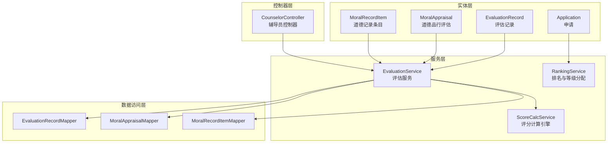
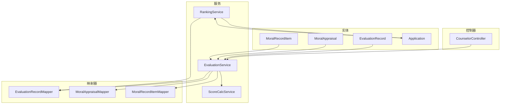
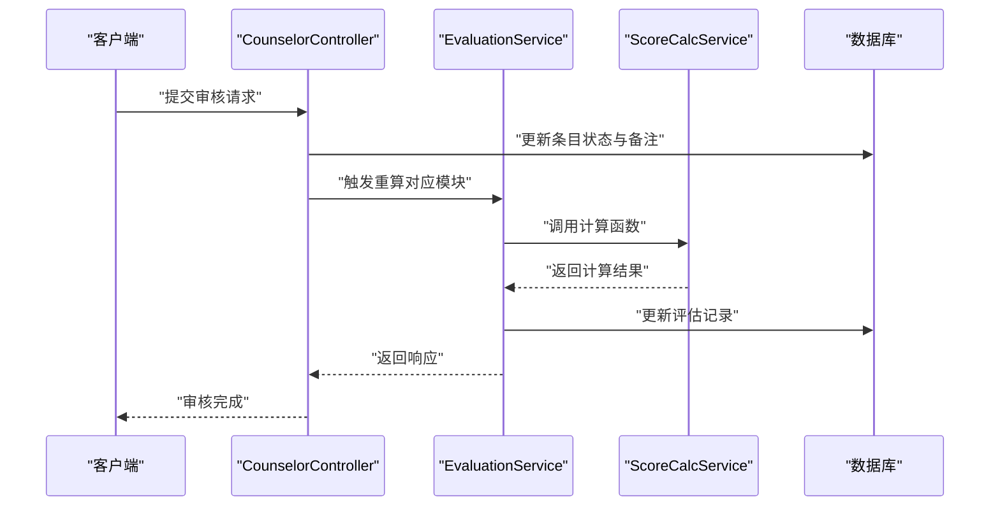
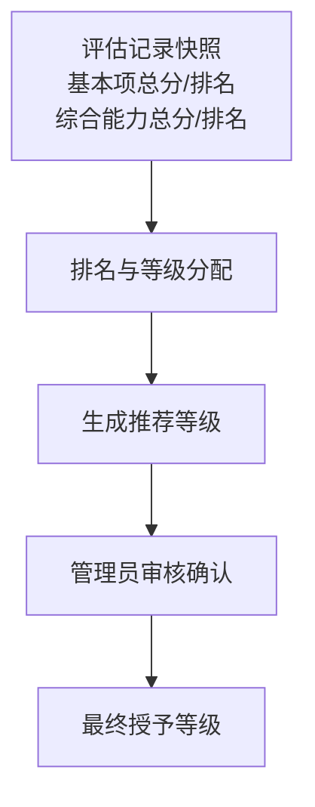
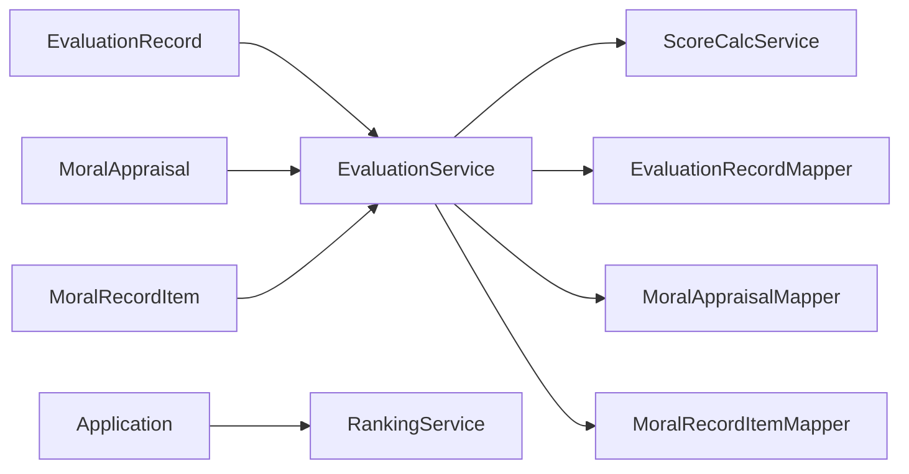
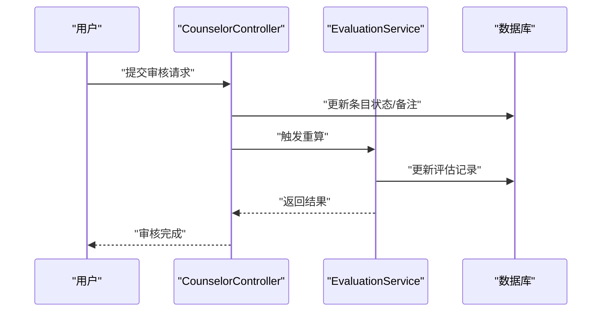

# 评估实体类

<cite>
**本文引用的文件**
- [EvaluationRecord.java](file://backend/src/main/java/com/zjsu/scholarship/entity/EvaluationRecord.java)
- [MoralAppraisal.java](file://backend/src/main/java/com/zjsu/scholarship/entity/MoralAppraisal.java)
- [MoralRecordItem.java](file://backend/src/main/java/com/zjsu/scholarship/entity/MoralRecordItem.java)
- [Application.java](file://backend/src/main/java/com/zjsu/scholarship/entity/Application.java)
- [EvaluationService.java](file://backend/src/main/java/com/zjsu/scholarship/service/EvaluationService.java)
- [ScoreCalcService.java](file://backend/src/main/java/com/zjsu/scholarship/service/ScoreCalcService.java)
- [RankingService.java](file://backend/src/main/java/com/zjsu/scholarship/service/RankingService.java)
- [CounselorController.java](file://backend/src/main/java/com/zjsu/scholarship/controller/CounselorController.java)
- [EvaluationRecordMapper.java](file://backend/src/main/java/com/zjsu/scholarship/mapper/EvaluationRecordMapper.java)
- [MoralAppraisalMapper.java](file://backend/src/main/java/com/zjsu/scholarship/mapper/MoralAppraisalMapper.java)
- [MoralRecordItemMapper.java](file://backend/src/main/java/com/zjsu/scholarship/mapper/MoralRecordItemMapper.java)
- [AuthContext.java](file://backend/src/main/java/com/zjsu/scholarship/security/AuthContext.java)
</cite>

## 目录
1. [引言](#引言)
2. [项目结构](#项目结构)
3. [核心组件](#核心组件)
4. [架构概览](#架构概览)
5. [详细组件分析](#详细组件分析)
6. [依赖分析](#依赖分析)
7. [性能考量](#性能考量)
8. [故障排查指南](#故障排查指南)
9. [结论](#结论)
10. [附录](#附录)

## 引言
本文件聚焦于评估实体类的设计与实现，系统性阐述以下三个核心实体：
- 评估记录实体：承载学生在特定学年的综合测评结果，包含品德、专业素质、综合能力等维度的得分与排名。
- 道德品行评估实体：记录自评、学生代表评议与辅导员评议的六维指标，用于生成品德评议分。
- 道德记录条目实体：记录品德记实项（志愿服务、处分、荣誉、集体荣誉等），用于计算品德记实分。

同时，文档将说明评估时间、评估人、评估结果与备注字段的设计考虑；剖析道德品行评分机制、辅导员评价内容与审核状态管理；解释具体评估项目、分数计算与证明材料管理；给出评估流程的完整生命周期（发起、评分录入、审核确认等）；阐明评估记录与申请实体的关联关系及评估结果对最终等级的影响机制；并提供统计分析（平均分、排名）与权限控制与数据安全保护措施。

## 项目结构
后端采用分层架构，实体位于 entity 包，业务逻辑位于 service 包，控制器位于 controller 包，数据访问位于 mapper 包。评估相关的核心实体与服务如下：

**图表来源**
- [EvaluationRecord.java:1-45](file://backend/src/main/java/com/zjsu/scholarship/entity/EvaluationRecord.java#L1-L45)
- [MoralAppraisal.java:1-36](file://backend/src/main/java/com/zjsu/scholarship/entity/MoralAppraisal.java#L1-L36)
- [MoralRecordItem.java:1-34](file://backend/src/main/java/com/zjsu/scholarship/entity/MoralRecordItem.java#L1-L34)
- [Application.java:1-43](file://backend/src/main/java/com/zjsu/scholarship/entity/Application.java#L1-L43)
- [EvaluationService.java:1-308](file://backend/src/main/java/com/zjsu/scholarship/service/EvaluationService.java#L1-L308)
- [ScoreCalcService.java:1-423](file://backend/src/main/java/com/zjsu/scholarship/service/ScoreCalcService.java#L1-L423)
- [RankingService.java:1-437](file://backend/src/main/java/com/zjsu/scholarship/service/RankingService.java#L1-L437)
- [CounselorController.java:1-391](file://backend/src/main/java/com/zjsu/scholarship/controller/CounselorController.java#L1-L391)
- [EvaluationRecordMapper.java:1-8](file://backend/src/main/java/com/zjsu/scholarship/mapper/EvaluationRecordMapper.java#L1-L8)
- [MoralAppraisalMapper.java:1-8](file://backend/src/main/java/com/zjsu/scholarship/mapper/MoralAppraisalMapper.java#L1-L8)
- [MoralRecordItemMapper.java:1-8](file://backend/src/main/java/com/zjsu/scholarship/mapper/MoralRecordItemMapper.java#L1-L8)

**章节来源**
- [EvaluationRecord.java:1-45](file://backend/src/main/java/com/zjsu/scholarship/entity/EvaluationRecord.java#L1-L45)
- [MoralAppraisal.java:1-36](file://backend/src/main/java/com/zjsu/scholarship/entity/MoralAppraisal.java#L1-L36)
- [MoralRecordItem.java:1-34](file://backend/src/main/java/com/zjsu/scholarship/entity/MoralRecordItem.java#L1-L34)
- [Application.java:1-43](file://backend/src/main/java/com/zjsu/scholarship/entity/Application.java#L1-L43)

## 核心组件
本节从设计目标、字段语义与业务约束角度，系统解析三大评估实体。

- 评估记录实体（EvaluationRecord）
  - 设计目标：统一承载学生在学年内的综合测评结果，支持基本项（品德×30% + 专业×70%）、综合能力（75 + 五模块加权）的计算与排名。
  - 关键字段
    - 品德相关：评议分、记实分、品德总分
    - 专业素质：加权平均分
    - 基本项：基本总分与基本排名
    - 综合能力：能力基础分（固定75）、研究创新、专业技能、组织工作、体育美育、劳动实践、综合能力总分与能力排名
    - 状态与时间：状态、提交时间
  - 设计考虑
    - 字段命名清晰区分“评议”“记实”“总分”“排名”，便于前端展示与后端计算。
    - 使用高精度数值类型保存分数，避免浮点误差累积。
    - 排名字段与总分字段成对出现，确保排名与分数的一致性更新。

- 道德品行评估实体（MoralAppraisal）
  - 设计目标：记录三种来源的六维指标评分，用于生成品德评议分。
  - 关键字段
    - 评估来源：SELF（自评）、STUDENT_REP（学生代表）、COUNSELOR（辅导员）
    - 六维指标：政治素养、法治观念、心理素质、诚实守信、团队协作、社会责任
    - 总分与创建时间
  - 设计考虑
    - 六维指标覆盖思想品德、遵纪守法、心理健康、诚信品质、团队意识、社会责任，符合高校德育要求。
    - 通过评估来源权重（自评5%、学生代表60%、辅导员35%）平衡主观与客观评价。

- 道德记录条目实体（MoralRecordItem）
  - 设计目标：记录品德记实项，支持加分、扣分与证明材料管理。
  - 关键字段
    - 条目类型：VOLUNTEER（志愿服务）、DISCIPLINE（处分）、HONOR（个人荣誉）、COLLECTIVE_HONOR（集体荣誉）
    - 描述、发生日期、时长（小时）、原始分值、荣誉等级、最终分数、证明材料URL
    - 审核状态与备注、创建时间
  - 设计考虑
    - 通过条目类型与原始分值/荣誉等级组合，灵活支持多种记实场景。
    - 审核状态（PENDING/APPROVED/REJECTED）与备注字段支撑流程化管理。
    - 证明材料URL便于存证与复核。

**章节来源**
- [EvaluationRecord.java:11-45](file://backend/src/main/java/com/zjsu/scholarship/entity/EvaluationRecord.java#L11-L45)
- [MoralAppraisal.java:11-36](file://backend/src/main/java/com/zjsu/scholarship/entity/MoralAppraisal.java#L11-L36)
- [MolecularRecordItem.java:12-34](file://backend/src/main/java/com/zjsu/scholarship/entity/MoralRecordItem.java#L12-L34)

## 架构概览
评估体系围绕“实体-服务-控制器-映射器”的分层展开，评分计算由独立的评分引擎驱动，排名与等级分配由专门服务处理，辅导员控制器负责审核与批量评议。

**图表来源**
- [CounselorController.java:18-65](file://backend/src/main/java/com/zjsu/scholarship/controller/CounselorController.java#L18-L65)
- [EvaluationService.java:22-61](file://backend/src/main/java/com/zjsu/scholarship/service/EvaluationService.java#L22-L61)
- [ScoreCalcService.java:18-47](file://backend/src/main/java/com/zjsu/scholarship/service/ScoreCalcService.java#L18-L47)
- [RankingService.java:25-47](file://backend/src/main/java/com/zjsu/scholarship/service/RankingService.java#L25-L47)
- [EvaluationRecord.java:11-45](file://backend/src/main/java/com/zjsu/scholarship/entity/EvaluationRecord.java#L11-L45)
- [MoralAppraisal.java:11-36](file://backend/src/main/java/com/zjsu/scholarship/entity/MoralAppraisal.java#L11-L36)
- [MoralRecordItem.java:12-34](file://backend/src/main/java/com/zjsu/scholarship/entity/MoralRecordItem.java#L12-L34)
- [Application.java:11-43](file://backend/src/main/java/com/zjsu/scholarship/entity/Application.java#L11-L43)

## 详细组件分析

### 评估记录实体（EvaluationRecord）
- 数据模型
  - 品德：评议分、记实分、品德总分
  - 专业素质：加权平均分
  - 基本项：基本总分、基本排名
  - 综合能力：能力基础分（固定75）、研究创新、专业技能、组织工作、体育美育、劳动实践、综合能力总分、能力排名
  - 状态与时间：状态、提交时间

- 设计要点
  - 字段命名与单位明确，便于前后端一致理解。
  - 排名与总分成对维护，保证排序一致性。
  - 状态字段支持草稿、提交等阶段流转。

- 与申请的关系
  - 申请实体持有“基本项总分/排名快照”“综合能力总分/排名快照”，用于最终等级确定与复核。

**章节来源**
- [EvaluationRecord.java:11-45](file://backend/src/main/java/com/zjsu/scholarship/entity/EvaluationRecord.java#L11-L45)
- [Application.java:19-42](file://backend/src/main/java/com/zjsu/scholarship/entity/Application.java#L19-L42)

### 道德品行评估实体（MoralAppraisal）
- 数据模型
  - 评估来源：SELF、STUDENT_REP、COUNSELOR
  - 六维指标：政治素养、法治观念、心理素质、诚实守信、团队协作、社会责任
  - 总分与创建时间

- 评分机制
  - 六维指标逐项累加得到来源总分。
  - 权重：自评×5% + 学生代表×60% + 辅导员×35%。
  - 结果保留两位小数，确保一致性。

- 辅导员评价内容
  - 控制器提供批量评议接口，支持按学生批量写入或更新辅导员评议记录，并触发基本项重算。

**章节来源**
- [MoralAppraisal.java:11-36](file://backend/src/main/java/com/zjsu/scholarship/entity/MoralAppraisal.java#L11-L36)
- [ScoreCalcService.java:28-46](file://backend/src/main/java/com/zjsu/scholarship/service/ScoreCalcService.java#L28-L46)
- [CounselorController.java:308-348](file://backend/src/main/java/com/zjsu/scholarship/controller/CounselorController.java#L308-L348)

### 道德记录条目实体（MoralRecordItem）
- 数据模型
  - 条目类型：志愿服务、处分、个人荣誉、集体荣誉
  - 描述、发生日期、时长（小时）、原始分值、荣誉等级、最终分数、证明材料URL
  - 审核状态（PENDING/APPROVED/REJECTED）、审核备注、创建时间

- 分数计算
  - 个人荣誉：按等级赋分（国家级最高、院级最低），或使用原始分值（若为正分且非处分）。
  - 集体荣誉：按等级赋分（优良学风班、五四团支部等），或使用原始分值。
  - 处分：原始分值取负，形成扣分。
  - 志愿服务：按小时累计，满4小时计4分，额外不足4小时计2分，单条封顶10分。
  - 总分：基准60分 + 各项增减分，个人荣誉与集体荣誉分别设上限，最终不得低于0。

- 证明材料管理
  - 通过URL字段存储附件链接，便于审核与复核。

**章节来源**
- [MoralRecordItem.java:12-34](file://backend/src/main/java/com/zjsu/scholarship/entity/MoralRecordItem.java#L12-L34)
- [ScoreCalcService.java:62-125](file://backend/src/main/java/com/zjsu/scholarship/service/ScoreCalcService.java#L62-L125)

### 评估流程生命周期
- 发起与初始化
  - 服务根据学生与学年ID查找或创建评估记录，初始状态为草稿，各分数字段归零。
- 评分录入
  - 品德：通过道德品行评估与道德记录条目计算生成。
  - 综合能力：研究创新、专业技能、组织工作、体育美育、劳动实践分别计算后加权汇总。
- 审核确认
  - 辅导员控制器提供多模块审核端点，支持将条目状态更新为批准或拒绝，并触发相应模块的重新计算。
- 提交
  - 服务在提交时执行全量重算，设置状态为已提交并记录提交时间。

**图表来源**
- [CounselorController.java:160-230](file://backend/src/main/java/com/zjsu/scholarship/controller/CounselorController.java#L160-L230)
- [EvaluationService.java:91-135](file://backend/src/main/java/com/zjsu/scholarship/service/EvaluationService.java#L91-L135)
- [ScoreCalcService.java:184-262](file://backend/src/main/java/com/zjsu/scholarship/service/ScoreCalcService.java#L184-L262)

**章节来源**
- [EvaluationService.java:63-87](file://backend/src/main/java/com/zjsu/scholarship/service/EvaluationService.java#L63-L87)
- [EvaluationService.java:175-184](file://backend/src/main/java/com/zjsu/scholarship/service/EvaluationService.java#L175-L184)
- [CounselorController.java:160-230](file://backend/src/main/java/com/zjsu/scholarship/controller/CounselorController.java#L160-L230)

### 评估记录与申请实体的关联与影响
- 关联关系
  - 申请实体持有评估记录ID，并在评审阶段写入“基本项/综合能力总分与排名快照”，用于最终等级确定。
- 影响机制
  - 排名与等级分配由排名服务基于快照执行双排名（基本项与综合能力），并结合项目规则与等级配额进行分配。
  - 申请最终授予等级受“推荐等级”与“审核状态”共同决定。

**图表来源**
- [Application.java:19-42](file://backend/src/main/java/com/zjsu/scholarship/entity/Application.java#L19-L42)
- [RankingService.java:197-227](file://backend/src/main/java/com/zjsu/scholarship/service/RankingService.java#L197-L227)

**章节来源**
- [Application.java:19-42](file://backend/src/main/java/com/zjsu/scholarship/entity/Application.java#L19-L42)
- [RankingService.java:197-227](file://backend/src/main/java/com/zjsu/scholarship/service/RankingService.java#L197-L227)

### 评估数据的统计分析
- 平均分计算
  - 专业素质：课程加权平均分，按学年维度聚合。
  - 品德记实：基准60分 + 各项增减分，分别统计个人荣誉与集体荣誉加分与处分扣分。
- 排名统计
  - 双排名：基本项排名与综合能力排名，按项目规则与配额分配等级。
  - 额外校验：一等奖学金需同时满足基本项前15%与综合能力前30%。

**章节来源**
- [ScoreCalcService.java:159-178](file://backend/src/main/java/com/zjsu/scholarship/service/ScoreCalcService.java#L159-L178)
- [RankingService.java:62-227](file://backend/src/main/java/com/zjsu/scholarship/service/RankingService.java#L62-L227)

### 权限控制与数据安全
- 权限控制
  - 控制器使用角色注解限定访问范围（如仅辅导员与管理员）。
  - 审核操作通过认证上下文记录经办人ID，确保可追溯。
- 数据安全
  - 服务层统一事务边界，避免中间态数据。
  - 审核状态与备注字段分离，便于审计与复核。
  - 评分计算引擎集中管理规则，减少业务分散导致的不一致。

**章节来源**
- [CounselorController.java:20-65](file://backend/src/main/java/com/zjsu/scholarship/controller/CounselorController.java#L20-L65)
- [AuthContext.java:1-20](file://backend/src/main/java/com/zjsu/scholarship/security/AuthContext.java#L1-L20)

## 依赖分析
- 实体间依赖
  - 评估记录实体被评估服务与排名服务广泛使用。
  - 道德品行评估与道德记录条目实体为评估服务提供输入。
  - 申请实体依赖评估记录快照进行等级分配。
- 映射器依赖
  - 评估服务通过各映射器查询与更新实体数据。
- 服务间耦合
  - 评估服务依赖评分计算引擎；排名服务依赖评估服务重算后的结果。

**图表来源**
- [EvaluationService.java:25-61](file://backend/src/main/java/com/zjsu/scholarship/service/EvaluationService.java#L25-L61)
- [RankingService.java:28-47](file://backend/src/main/java/com/zjsu/scholarship/service/RankingService.java#L28-L47)
- [EvaluationRecordMapper.java:1-8](file://backend/src/main/java/com/zjsu/scholarship/mapper/EvaluationRecordMapper.java#L1-L8)
- [MoralAppraisalMapper.java:1-8](file://backend/src/main/java/com/zjsu/scholarship/mapper/MoralAppraisalMapper.java#L1-L8)
- [MoralRecordItemMapper.java:1-8](file://backend/src/main/java/com/zjsu/scholarship/mapper/MoralRecordItemMapper.java#L1-L8)

**章节来源**
- [EvaluationService.java:25-61](file://backend/src/main/java/com/zjsu/scholarship/service/EvaluationService.java#L25-L61)
- [RankingService.java:28-47](file://backend/src/main/java/com/zjsu/scholarship/service/RankingService.java#L28-L47)

## 性能考量
- 计算复杂度
  - 基本项与综合能力计算涉及多表聚合与循环累加，时间复杂度与记录数量线性相关。
- 优化建议
  - 对常用查询添加索引（如学年ID、学生ID、状态等）。
  - 在批量审核与批量评议场景中，尽量合并SQL操作，减少往返次数。
  - 将评分规则常量化，避免重复计算与字符串匹配。

## 故障排查指南
- 常见问题
  - 审核状态未生效：检查控制器审核端点是否正确更新条目状态并触发重算。
  - 评分异常：核对评分计算引擎规则与输入数据（如荣誉等级、条目类型、时长等）。
  - 排名不一致：确认是否已完成全量重算与排名更新。
- 定位手段
  - 利用日志与事务边界定位数据更新时序。
  - 通过认证上下文确认经办人信息，便于审计。

**章节来源**
- [CounselorController.java:160-230](file://backend/src/main/java/com/zjsu/scholarship/controller/CounselorController.java#L160-L230)
- [EvaluationService.java:91-135](file://backend/src/main/java/com/zjsu/scholarship/service/EvaluationService.java#L91-L135)
- [RankingService.java:62-103](file://backend/src/main/java/com/zjsu/scholarship/service/RankingService.java#L62-L103)

## 结论
评估实体类围绕“品德评议分、品德记实分、专业素质、综合能力”四大维度构建，配合评分计算引擎与排名服务，实现了从数据采集、计算、审核到等级分配的闭环。通过明确的字段设计、严格的审核状态管理与集中的规则引擎，系统在保证公平性的同时提升了自动化程度与可审计性。建议持续完善索引策略与批量操作优化，以进一步提升性能与用户体验。

## 附录
- 关键流程时序图（提交与审核）

**图表来源**
- [CounselorController.java:160-230](file://backend/src/main/java/com/zjsu/scholarship/controller/CounselorController.java#L160-L230)
- [EvaluationService.java:91-135](file://backend/src/main/java/com/zjsu/scholarship/service/EvaluationService.java#L91-L135)