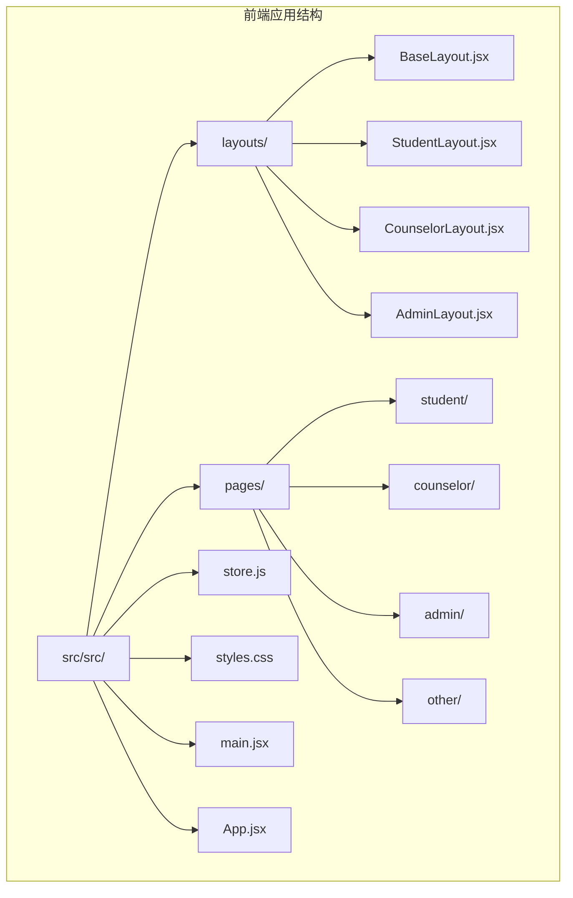
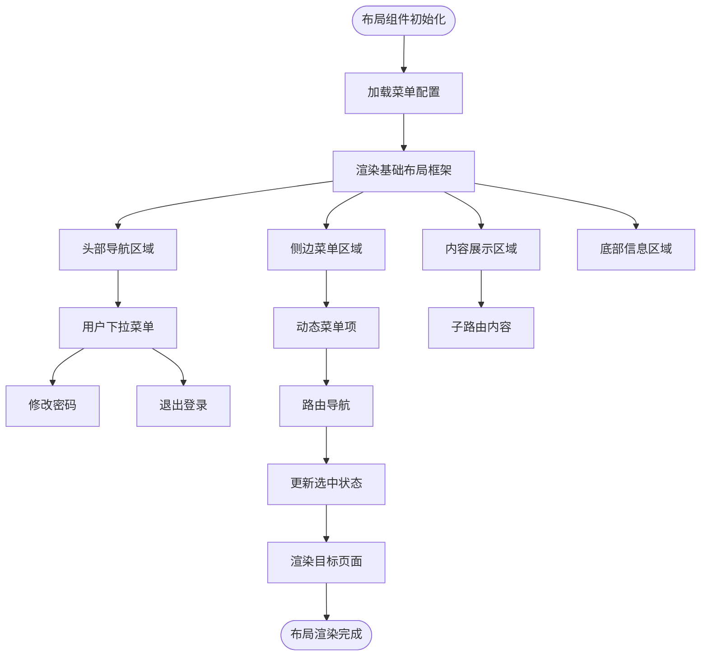
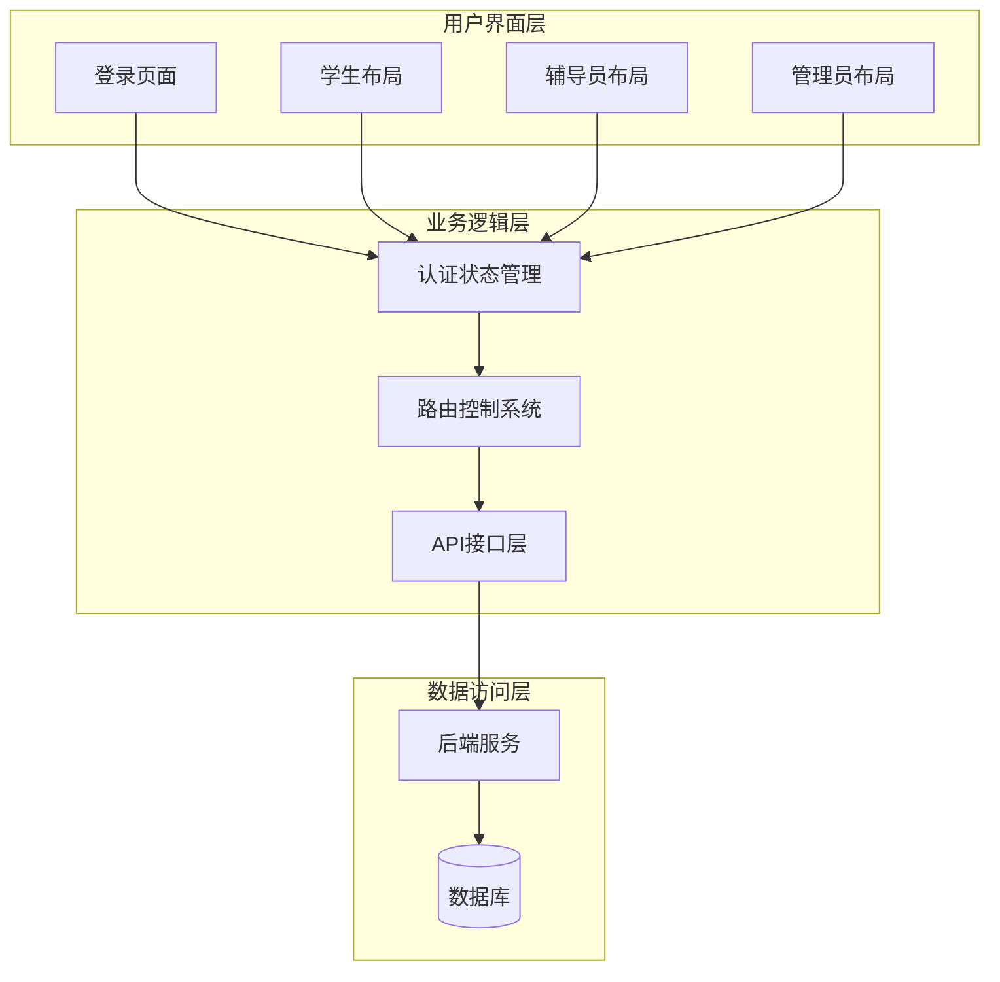
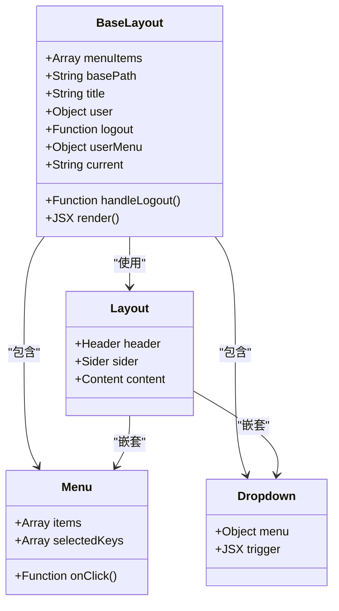
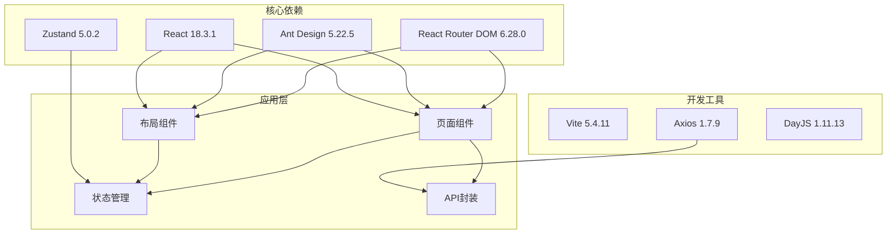
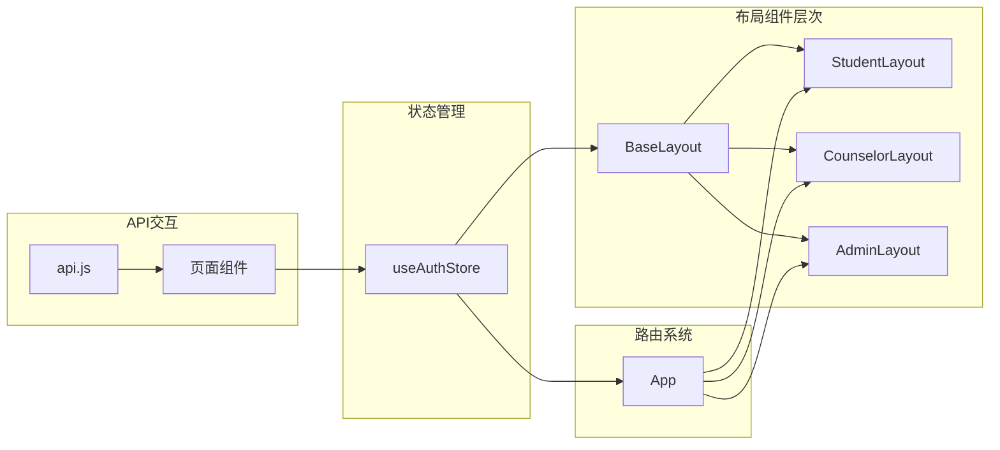

# 布局组件设计

<cite>
**本文档引用的文件**
- [frontend/src/layouts/BaseLayout.jsx](file://frontend/src/layouts/BaseLayout.jsx)
- [frontend/src/layouts/StudentLayout.jsx](file://frontend/src/layouts/StudentLayout.jsx)
- [frontend/src/layouts/CounselorLayout.jsx](file://frontend/src/layouts/CounselorLayout.jsx)
- [frontend/src/layouts/AdminLayout.jsx](file://frontend/src/layouts/AdminLayout.jsx)
- [frontend/src/App.jsx](file://frontend/src/App.jsx)
- [frontend/src/store.js](file://frontend/src/store.js)
- [frontend/src/main.jsx](file://frontend/src/main.jsx)
- [frontend/src/styles.css](file://frontend/src/styles.css)
- [frontend/src/api.js](file://frontend/src/api.js)
- [frontend/vite.config.js](file://frontend/vite.config.js)
- [frontend/package.json](file://frontend/package.json)
- [frontend/src/pages/student/Home.jsx](file://frontend/src/pages/student/Home.jsx)
- [frontend/src/pages/counselor/Students.jsx](file://frontend/src/pages/counselor/Students.jsx)
- [frontend/src/pages/admin/Dashboard.jsx](file://frontend/src/pages/admin/Dashboard.jsx)
- [frontend/src/pages/Login.jsx](file://frontend/src/pages/Login.jsx)
</cite>

## 目录
1. [引言](#引言)
2. [项目结构](#项目结构)
3. [核心组件](#核心组件)
4. [架构概览](#架构概览)
5. [详细组件分析](#详细组件分析)
6. [依赖分析](#依赖分析)
7. [性能考虑](#性能考虑)
8. [故障排除指南](#故障排除指南)
9. [结论](#结论)

## 引言

奖学金管理系统采用多角色布局架构设计，为学生、辅导员和管理员提供专门的界面体验。该系统基于React和Ant Design构建，实现了响应式布局、权限控制和状态管理的完整解决方案。

## 项目结构

前端项目采用模块化架构，主要目录结构如下：

**图表来源**
- [frontend/src/layouts/BaseLayout.jsx:1-66](file://frontend/src/layouts/BaseLayout.jsx#L1-L66)
- [frontend/src/App.jsx:1-83](file://frontend/src/App.jsx#L1-L83)

**章节来源**
- [frontend/src/App.jsx:1-83](file://frontend/src/App.jsx#L1-L83)
- [frontend/src/main.jsx:1-19](file://frontend/src/main.jsx#L1-L19)

## 核心组件

### 布局组件设计理念

系统采用分层布局架构，通过四个专门的布局组件服务于不同的用户角色：

| 布局组件 | 角色定位 | 主要功能 | 使用场景 |
|---------|----------|----------|----------|
| StudentLayout | 学生端 | 个人信息管理、测评填报、申请处理 | 学生日常操作界面 |
| CounselorLayout | 辅导员端 | 学生管理、材料审核、品德评议 | 辅导员工作界面 |
| AdminLayout | 管理员端 | 系统管理、数据导入、统计分析 | 系统管理员界面 |
| BaseLayout | 基础布局 | 通用导航、权限控制、用户管理 | 所有角色共享基础功能 |

### 布局组件结构设计

每个布局组件都遵循统一的结构模式：

**图表来源**
- [frontend/src/layouts/BaseLayout.jsx:27-65](file://frontend/src/layouts/BaseLayout.jsx#L27-L65)

**章节来源**
- [frontend/src/layouts/BaseLayout.jsx:1-66](file://frontend/src/layouts/BaseLayout.jsx#L1-L66)
- [frontend/src/layouts/StudentLayout.jsx:1-17](file://frontend/src/layouts/StudentLayout.jsx#L1-L17)
- [frontend/src/layouts/CounselorLayout.jsx:1-14](file://frontend/src/layouts/CounselorLayout.jsx#L1-L14)
- [frontend/src/layouts/AdminLayout.jsx:1-16](file://frontend/src/layouts/AdminLayout.jsx#L1-L16)

## 架构概览

系统采用分层架构设计，实现了清晰的关注点分离：

**图表来源**
- [frontend/src/App.jsx:27-41](file://frontend/src/App.jsx#L27-L41)
- [frontend/src/store.js:4-14](file://frontend/src/store.js#L4-L14)
- [frontend/src/api.js:5-43](file://frontend/src/api.js#L5-L43)

## 详细组件分析

### BaseLayout 基础布局组件

BaseLayout作为所有布局组件的基础，提供了统一的界面框架和核心功能：

#### 结构组成

**图表来源**
- [frontend/src/layouts/BaseLayout.jsx:8-65](file://frontend/src/layouts/BaseLayout.jsx#L8-L65)

#### 功能特性

1. **响应式布局**：采用Ant Design的Layout组件，支持自适应屏幕尺寸
2. **权限控制**：集成认证状态管理，实现基于角色的访问控制
3. **动态菜单**：支持根据用户角色动态生成菜单项
4. **用户管理**：提供修改密码和退出登录功能

**章节来源**
- [frontend/src/layouts/BaseLayout.jsx:1-66](file://frontend/src/layouts/BaseLayout.jsx#L1-L66)

### StudentLayout 学生布局组件

StudentLayout专为学生用户设计，提供个性化的学习和申请界面：

#### 菜单配置

| 菜单项 | 图标 | 功能描述 | 路由路径 |
|--------|------|----------|----------|
| 个人主页 | HomeOutlined | 学生个人信息和测评概览 | `/student` |
| 基本项测评 | FormOutlined | 基础学业表现评估 | `/student/basic-eval` |
| 综合能力测评 | ThunderboltOutlined | 全面能力发展评估 | `/student/ability-eval` |
| 奖学金申报 | GiftOutlined | 奖学金申请和管理 | `/student/scholarships` |
| 考研奖学金 | BookOutlined | 研究生入学奖学金申请 | `/student/graduate-exam` |
| 我的申请 | FileTextOutlined | 申请历史和状态查询 | `/student/applications` |
| 申诉 | AlertOutlined | 申诉流程和状态跟踪 | `/student/appeal` |

**章节来源**
- [frontend/src/layouts/StudentLayout.jsx:1-17](file://frontend/src/layouts/StudentLayout.jsx#L1-L17)

### CounselorLayout 辅导员布局组件

CounselorLayout为辅导员提供学生管理和审核功能：

#### 菜单配置

| 菜单项 | 图标 | 功能描述 | 路由路径 |
|--------|------|----------|----------|
| 我的学生 | TeamOutlined | 辅导学生列表管理 | `/counselor` |
| 材料审核 | AuditOutlined | 学生申请材料审核 | `/counselor/review` |
| 申请审核 | CheckSquareOutlined | 奖学金申请审核 | `/counselor/applications` |
| 品德评议 | FormOutlined | 学生品德表现评议 | `/counselor/appraisal` |

**章节来源**
- [frontend/src/layouts/CounselorLayout.jsx:1-14](file://frontend/src/layouts/CounselorLayout.jsx#L1-L14)

### AdminLayout 管理员布局组件

AdminLayout为系统管理员提供全面的管理功能：

#### 菜单配置

| 菜单项 | 图标 | 功能描述 | 路由路径 |
|--------|------|----------|----------|
| 统计看板 | DashboardOutlined | 系统运行统计和概览 | `/admin` |
| 学年管理 | CalendarOutlined | 学年设置和管理 | `/admin/years` |
| 奖学金项目 | BookOutlined | 奖学金项目配置 | `/admin/projects` |
| 综测排名 | TrophyOutlined | 综合测评排名管理 | `/admin/ranking` |
| 学生代表 | UserSwitchOutlined | 学生代表选举管理 | `/admin/representatives` |
| 数据导入 | ImportOutlined | 批量数据导入功能 | `/admin/import` |

**章节来源**
- [frontend/src/layouts/AdminLayout.jsx:1-16](file://frontend/src/layouts/AdminLayout.jsx#L1-L16)

## 依赖分析

### 技术栈依赖关系

**图表来源**
- [frontend/package.json:11-25](file://frontend/package.json#L11-L25)

### 组件间依赖关系

**图表来源**
- [frontend/src/App.jsx:4-25](file://frontend/src/App.jsx#L4-L25)
- [frontend/src/store.js:4-14](file://frontend/src/store.js#L4-L14)

**章节来源**
- [frontend/package.json:1-26](file://frontend/package.json#L1-L26)
- [frontend/src/App.jsx:1-83](file://frontend/src/App.jsx#L1-L83)

## 性能考虑

### 响应式设计实现

系统采用Ant Design的响应式栅格系统，确保在不同设备上的良好显示效果：

1. **移动端适配**：
   - 使用Ant Design的响应式断点
   - 自适应菜单折叠和展开
   - 移动端友好的触摸交互

2. **屏幕尺寸适配**：
   - 流式布局设计
   - 弹性字体大小
   - 自适应图片和表格

### 性能优化策略

1. **懒加载**：路由级别的代码分割
2. **状态缓存**：使用Zustand进行高效的状态管理
3. **API缓存**：合理的请求缓存策略
4. **组件优化**：React.memo和useMemo的合理使用

## 故障排除指南

### 常见问题及解决方案

#### 登录认证问题
- **症状**：登录后无法访问受保护页面
- **原因**：Token过期或用户角色不匹配
- **解决**：检查认证状态和路由守卫逻辑

#### 菜单权限问题
- **症状**：某些菜单项不可见或无法点击
- **原因**：用户角色权限不足
- **解决**：验证用户角色和菜单配置

#### 页面加载问题
- **症状**：页面空白或加载缓慢
- **原因**：API请求失败或组件渲染错误
- **解决**：检查网络连接和API响应

**章节来源**
- [frontend/src/App.jsx:27-41](file://frontend/src/App.jsx#L27-L41)
- [frontend/src/api.js:18-41](file://frontend/src/api.js#L18-L41)

## 结论

奖学金管理系统的布局组件设计体现了现代Web应用的最佳实践，通过模块化架构、清晰的职责分离和完善的权限控制，为不同角色用户提供了专业化的界面体验。系统的设计充分考虑了可扩展性和维护性，为后续的功能扩展奠定了坚实的基础。

该布局系统的核心优势包括：
- 完善的角色权限控制
- 优雅的响应式设计
- 高效的状态管理
- 清晰的组件架构
- 良好的用户体验