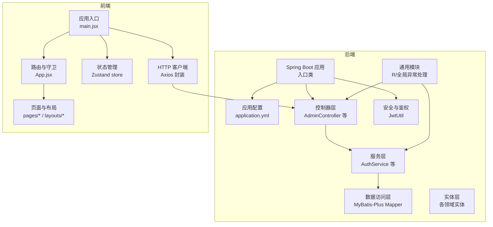
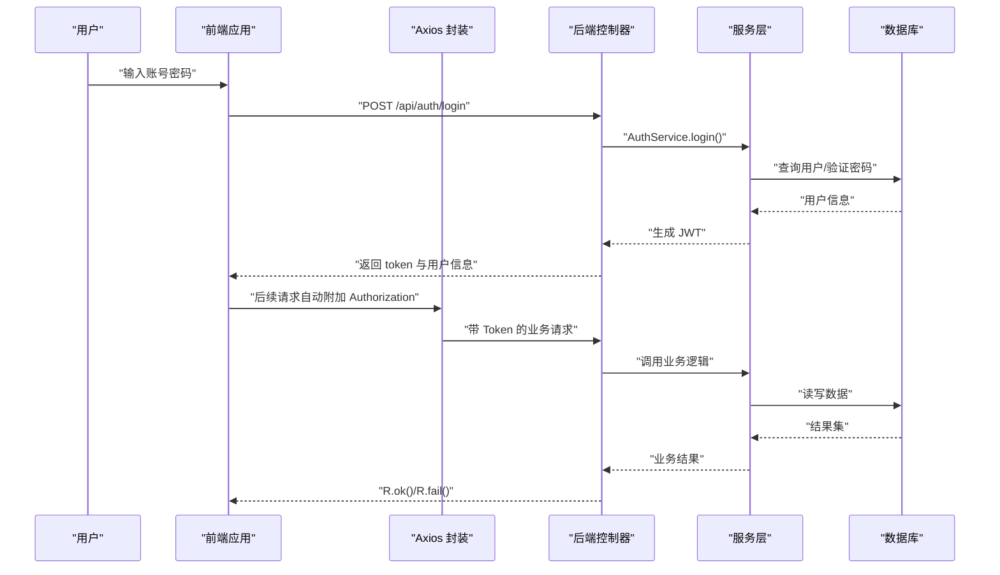
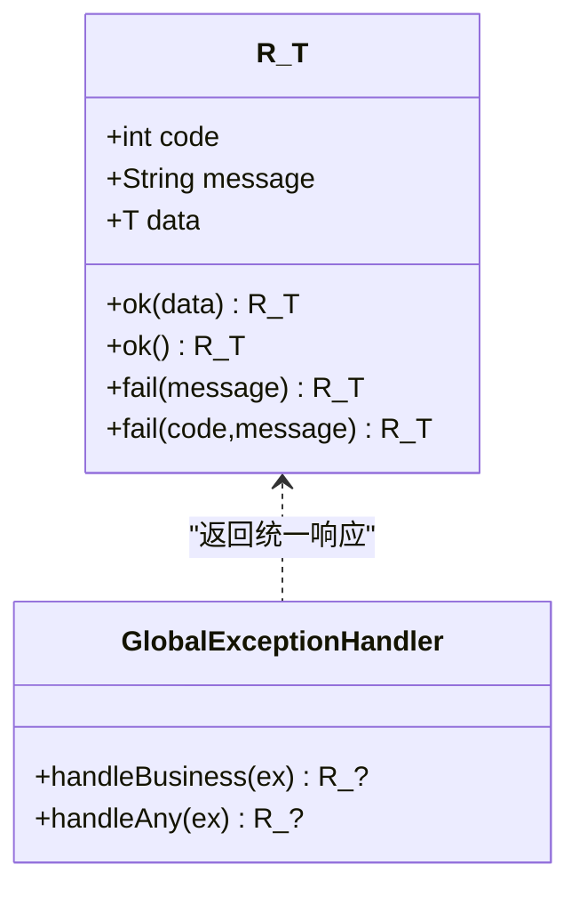
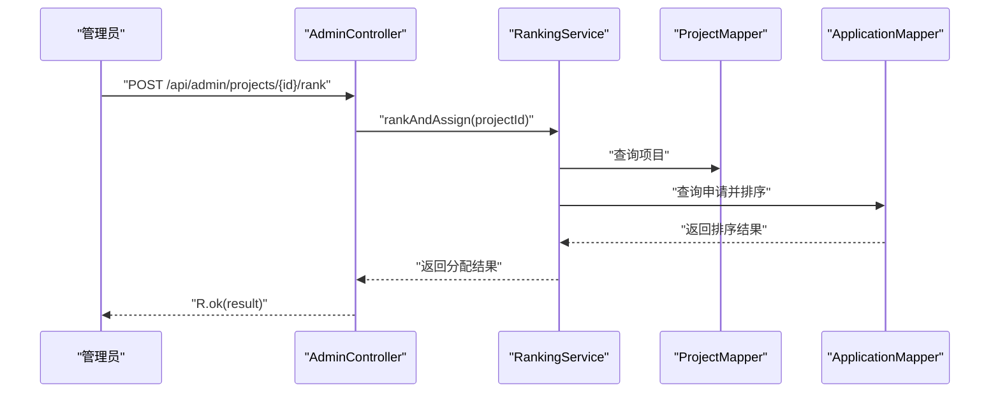
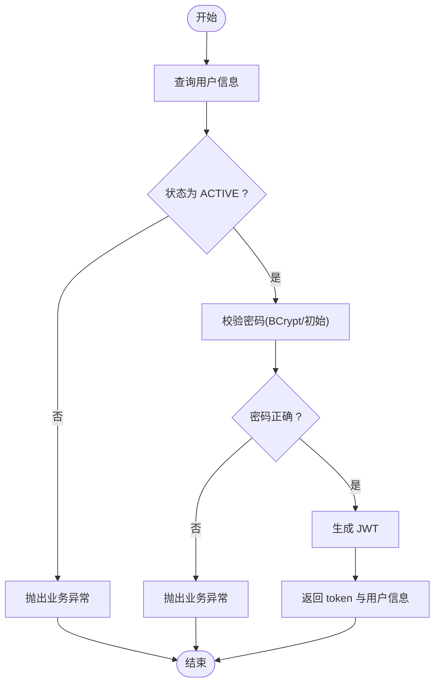
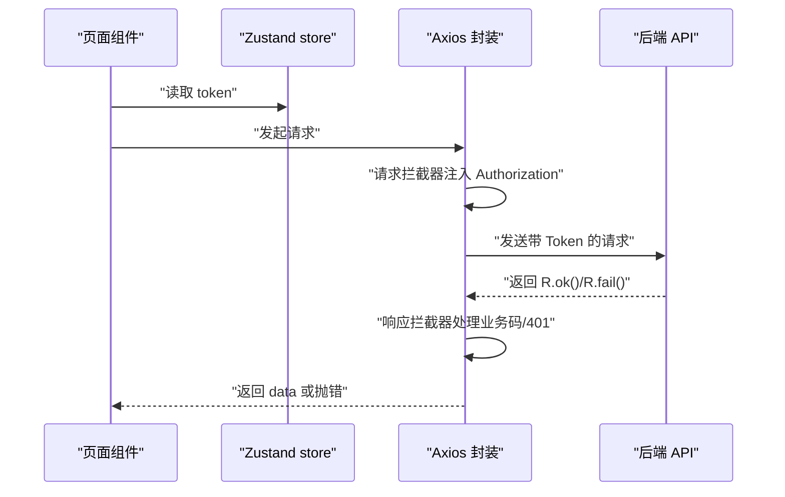
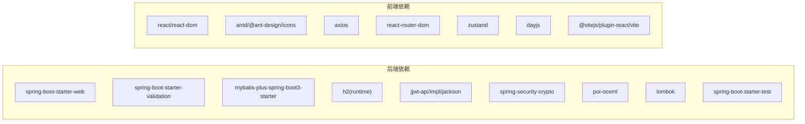

# 代码规范与约定

<cite>
**本文引用的文件**
- [backend/ScholarshipApplication.java](file://backend/src/main/java/com/zjsu/scholarship/ScholarshipApplication.java)
- [backend/pom.xml](file://backend/pom.xml)
- [backend/application.yml](file://backend/src/main/resources/application.yml)
- [backend/R.java](file://backend/src/main/java/com/zjsu/scholarship/common/R.java)
- [backend/GlobalExceptionHandler.java](file://backend/src/main/java/com/zjsu/scholarship/common/GlobalExceptionHandler.java)
- [backend/AdminController.java](file://backend/src/main/java/com/zjsu/scholarship/controller/AdminController.java)
- [backend/AuthService.java](file://backend/src/main/java/com/zjsu/scholarship/service/AuthService.java)
- [backend/JwtUtil.java](file://backend/src/main/java/com/zjsu/scholarship/security/JwtUtil.java)
- [frontend/package.json](file://frontend/package.json)
- [frontend/vite.config.js](file://frontend/vite.config.js)
- [frontend/App.jsx](file://frontend/src/App.jsx)
- [frontend/main.jsx](file://frontend/src/main.jsx)
- [frontend/store.js](file://frontend/src/store.js)
- [frontend/api.js](file://frontend/src/api.js)
- [README.md](file://README.md)
</cite>

## 目录
1. [引言](#引言)
2. [项目结构](#项目结构)
3. [核心组件](#核心组件)
4. [架构总览](#架构总览)
5. [详细组件分析](#详细组件分析)
6. [依赖分析](#依赖分析)
7. [性能考虑](#性能考虑)
8. [故障排查指南](#故障排查指南)
9. [结论](#结论)
10. [附录](#附录)

## 引言
本规范面向奖学金管理系统（Spring Boot 后端 + React 前端）的开发与维护，旨在统一代码风格、包命名、类与方法命名、注释与格式化要求，并明确前端组件组织、Hook 使用、状态管理与样式编写标准。同时提供代码审查清单、IDE 配置建议以及版本控制中的提交消息与分支命名约定。

## 项目结构
- 后端采用 Spring Boot 3.2 + MyBatis-Plus，使用 H2 文件数据库，提供 RESTful 接口。
- 前端采用 React 18 + Vite + Ant Design 5 + Zustand，通过 Axios 发起 API 请求，支持路由守卫与角色权限控制。

图表来源
- [backend/ScholarshipApplication.java:1-14](file://backend/src/main/java/com/zjsu/scholarship/ScholarshipApplication.java#L1-L14)
- [backend/application.yml:1-52](file://backend/src/main/resources/application.yml#L1-L52)
- [backend/AdminController.java:1-528](file://backend/src/main/java/com/zjsu/scholarship/controller/AdminController.java#L1-L528)
- [backend/AuthService.java:1-77](file://backend/src/main/java/com/zjsu/scholarship/service/AuthService.java#L1-L77)
- [backend/JwtUtil.java:1-52](file://backend/src/main/java/com/zjsu/scholarship/security/JwtUtil.java#L1-L52)
- [frontend/main.jsx:1-19](file://frontend/src/main.jsx#L1-L19)
- [frontend/App.jsx:1-83](file://frontend/src/App.jsx#L1-L83)
- [frontend/store.js:1-15](file://frontend/src/store.js#L1-L15)
- [frontend/api.js:1-44](file://frontend/src/api.js#L1-L44)

章节来源
- [README.md:123-154](file://README.md#L123-L154)

## 核心组件
- 统一响应体 R<T>：封装 code/message/data，便于前后端一致的返回格式。
- 全局异常处理：集中捕获业务异常与未处理异常，统一返回 R.fail(...)。
- JWT 工具：生成与解析令牌，携带用户角色与基本信息。
- Axios 封装：统一注入 Authorization 头、处理业务错误码与 401 清退逻辑。
- Zustand store：持久化存储 token 与用户信息，提供 setAuth/logout。

章节来源
- [backend/R.java:1-39](file://backend/src/main/java/com/zjsu/scholarship/common/R.java#L1-L39)
- [backend/GlobalExceptionHandler.java:1-23](file://backend/src/main/java/com/zjsu/scholarship/common/GlobalExceptionHandler.java#L1-L23)
- [backend/JwtUtil.java:1-52](file://backend/src/main/java/com/zjsu/scholarship/security/JwtUtil.java#L1-L52)
- [frontend/api.js:1-44](file://frontend/src/api.js#L1-L44)
- [frontend/store.js:1-15](file://frontend/src/store.js#L1-L15)

## 架构总览
系统遵循前后端分离，后端提供 RESTful API，前端通过 Axios 调用接口并进行路由守卫与角色控制。

图表来源
- [backend/AuthService.java:32-55](file://backend/src/main/java/com/zjsu/scholarship/service/AuthService.java#L32-L55)
- [backend/AdminController.java:64-76](file://backend/src/main/java/com/zjsu/scholarship/controller/AdminController.java#L64-L76)
- [frontend/api.js:10-41](file://frontend/src/api.js#L10-L41)

## 详细组件分析

### 后端：包与类命名规范
- 包命名：采用反向域名 com.zjsu.scholarship 下按层次划分 common/config/security/controller/entity/mapper/service。
- 类命名：采用帕斯卡命名法；控制器以 Controller 结尾；服务以 Service 结尾；工具类以 Util 结尾；异常类以 Exception/Exception 结尾；Mapper 接口以 Mapper 结尾；实体类与数据库表一一对应。
- 方法命名：采用动宾短语，如 login/changePassword/rankAndAssign 等，保持语义清晰。
- 注释规范：公共接口与复杂逻辑需提供简要注释；异常处理类使用日志记录并返回统一响应。

章节来源
- [backend/ScholarshipApplication.java:1-14](file://backend/src/main/java/com/zjsu/scholarship/ScholarshipApplication.java#L1-L14)
- [backend/AdminController.java:1-528](file://backend/src/main/java/com/zjsu/scholarship/controller/AdminController.java#L1-L528)
- [backend/AuthService.java:1-77](file://backend/src/main/java/com/zjsu/scholarship/service/AuthService.java#L1-L77)
- [backend/JwtUtil.java:1-52](file://backend/src/main/java/com/zjsu/scholarship/security/JwtUtil.java#L1-L52)
- [backend/R.java:1-39](file://backend/src/main/java/com/zjsu/scholarship/common/R.java#L1-L39)
- [backend/GlobalExceptionHandler.java:1-23](file://backend/src/main/java/com/zjsu/scholarship/common/GlobalExceptionHandler.java#L1-L23)

### 后端：统一响应与异常处理
- 统一响应体 R<T>：提供 ok()/fail() 静态工厂方法，简化控制器返回。
- 全局异常处理：RestControllerAdvice 捕获 BusinessException 并返回指定 code/message；捕获其他异常记录日志并返回通用错误码。

图表来源
- [backend/R.java:3-38](file://backend/src/main/java/com/zjsu/scholarship/common/R.java#L3-L38)
- [backend/GlobalExceptionHandler.java:8-22](file://backend/src/main/java/com/zjsu/scholarship/common/GlobalExceptionHandler.java#L8-L22)

章节来源
- [backend/R.java:1-39](file://backend/src/main/java/com/zjsu/scholarship/common/R.java#L1-L39)
- [backend/GlobalExceptionHandler.java:1-23](file://backend/src/main/java/com/zjsu/scholarship/common/GlobalExceptionHandler.java#L1-L23)

### 后端：控制器与业务流程
- 控制器职责：接收请求参数、调用服务层、返回 R.ok()/R.fail()。
- 示例流程：管理员创建学年、项目、等级与规则；执行排名与发布；导出账户与模板；批量导入数据；管理学生代表与处分记录；处理申诉。

图表来源
- [backend/AdminController.java:156-159](file://backend/src/main/java/com/zjsu/scholarship/controller/AdminController.java#L156-L159)

章节来源
- [backend/AdminController.java:1-528](file://backend/src/main/java/com/zjsu/scholarship/controller/AdminController.java#L1-L528)

### 后端：认证与授权
- 登录流程：校验账号状态与密码（BCrypt 或初始密码），签发 JWT。
- 修改密码：校验旧密码，更新为新密码哈希。
- JWT 解析：从令牌中提取用户角色与信息。

图表来源
- [backend/AuthService.java:32-55](file://backend/src/main/java/com/zjsu/scholarship/service/AuthService.java#L32-L55)
- [backend/JwtUtil.java:28-42](file://backend/src/main/java/com/zjsu/scholarship/security/JwtUtil.java#L28-L42)

章节来源
- [backend/AuthService.java:1-77](file://backend/src/main/java/com/zjsu/scholarship/service/AuthService.java#L1-L77)
- [backend/JwtUtil.java:1-52](file://backend/src/main/java/com/zjsu/scholarship/security/JwtUtil.java#L1-L52)

### 前端：组件命名与文件组织
- 组件命名：采用帕斯卡命名法；页面组件以.jsx 结尾；布局组件以 Layout.jsx 结尾；页面按角色分目录（student/counselor/admin）。
- 文件组织：src/ 下按功能域划分 layouts/pages，入口文件 main.jsx 配置国际化与主题，App.jsx 统一路由与角色守卫。
- Hook 使用规范：仅在函数组件顶层使用；避免在循环/条件中使用；组合多个自定义 Hook 时注意依赖顺序。
- 状态管理：使用 Zustand 管理认证状态，支持持久化；通过 store.js 提供 setAuth/logout。
- 样式编写标准：统一引入 Ant Design 主题与本地 styles.css；避免内联样式；优先使用组件库样式与 CSS 变量。

章节来源
- [frontend/App.jsx:1-83](file://frontend/src/App.jsx#L1-L83)
- [frontend/main.jsx:1-19](file://frontend/src/main.jsx#L1-L19)
- [frontend/store.js:1-15](file://frontend/src/store.js#L1-L15)
- [frontend/api.js:1-44](file://frontend/src/api.js#L1-L44)

### 前端：Axios 封装与路由守卫
- Axios 封装：统一 baseURL、超时；请求拦截器注入 Authorization；响应拦截器处理业务错误码与 401 清退。
- 路由守卫：Protected 组件根据角色判断；RootRedirect 根据角色跳转到对应首页；未登录跳转至 /login。

图表来源
- [frontend/api.js:10-41](file://frontend/src/api.js#L10-L41)
- [frontend/App.jsx:27-41](file://frontend/src/App.jsx#L27-L41)

章节来源
- [frontend/api.js:1-44](file://frontend/src/api.js#L1-L44)
- [frontend/App.jsx:1-83](file://frontend/src/App.jsx#L1-L83)

## 依赖分析
- 后端依赖：Spring Boot Web/Validation、MyBatis-Plus、H2、jjwt、BCrypt、Apache POI、Lombok、测试 Starter。
- 前端依赖：React、Ant Design、axios、dayjs、react-router-dom、zustand、vite 插件。

图表来源
- [backend/pom.xml:26-87](file://backend/pom.xml#L26-L87)
- [frontend/package.json:11-24](file://frontend/package.json#L11-L24)

章节来源
- [backend/pom.xml:1-108](file://backend/pom.xml#L1-L108)
- [frontend/package.json:1-26](file://frontend/package.json#L1-L26)

## 性能考虑
- 后端
  - 使用 MyBatis-Plus 分页与条件构造器减少 N+1 查询；合理索引与 SQL 日志配置（当前关闭日志实现）。
  - 控制一次性批量操作的数据量，分批导入与处理。
  - 合理使用缓存（如需要）与连接池配置。
- 前端
  - 懒加载页面组件与路由；避免不必要的重渲染；合理拆分 Zustand store，按域隔离状态。
  - 图片与大文件上传使用分片或流式处理（如需扩展）。

## 故障排查指南
- 登录失败
  - 检查账号是否存在、状态是否 ACTIVE；确认密码匹配（BCrypt 或初始密码）。
- 401 未授权
  - 检查前端是否正确注入 Authorization；确认后端 JWT secret 与过期时间配置。
- 数据库初始化
  - H2 初始化脚本路径与编码；必要时清理 data 目录重置数据。
- Axios 错误
  - 查看响应拦截器对业务码与异常的处理；确认跨域代理配置。

章节来源
- [backend/AuthService.java:32-55](file://backend/src/main/java/com/zjsu/scholarship/service/AuthService.java#L32-L55)
- [frontend/api.js:18-41](file://frontend/src/api.js#L18-L41)
- [backend/application.yml:22-28](file://backend/src/main/resources/application.yml#L22-L28)

## 结论
本规范基于现有代码库提炼了统一的开发与协作标准，涵盖后端包与类命名、统一响应与异常处理、认证流程、前端组件组织与状态管理等方面。建议在团队内推广并持续优化，确保代码一致性与可维护性。

## 附录

### 代码审查清单（后端）
- 包与类命名是否符合规范
- 控制器是否仅做参数校验与调用服务，返回统一响应
- 业务异常是否抛出 BusinessException 并被全局异常处理
- JWT 生成与解析是否正确，密钥与过期时间配置合理
- 数据访问层是否使用 MyBatis-Plus 条件构造器与分页
- 配置文件编码与多环境配置是否正确

章节来源
- [backend/R.java:1-39](file://backend/src/main/java/com/zjsu/scholarship/common/R.java#L1-L39)
- [backend/GlobalExceptionHandler.java:1-23](file://backend/src/main/java/com/zjsu/scholarship/common/GlobalExceptionHandler.java#L1-L23)
- [backend/JwtUtil.java:1-52](file://backend/src/main/java/com/zjsu/scholarship/security/JwtUtil.java#L1-L52)
- [backend/application.yml:1-52](file://backend/src/main/resources/application.yml#L1-L52)

### 代码审查清单（前端）
- 页面与布局组件命名是否符合规范
- 路由守卫与角色控制是否完备
- Zustand store 是否按域拆分与持久化
- Axios 封装是否统一处理业务码与 401
- 国际化与主题配置是否正确

章节来源
- [frontend/App.jsx:1-83](file://frontend/src/App.jsx#L1-L83)
- [frontend/store.js:1-15](file://frontend/src/store.js#L1-L15)
- [frontend/api.js:1-44](file://frontend/src/api.js#L1-L44)
- [frontend/main.jsx:1-19](file://frontend/src/main.jsx#L1-L19)

### IDE 配置建议
- Java 后端
  - 使用 Spotless 或 Google Java Format 插件进行格式化；集成 Checkstyle/SpotBugs 进行静态分析。
  - 在 Maven 中配置编译参数与编码（UTF-8）。
- JavaScript/TypeScript 前端
  - 使用 Prettier + ESLint；Vite 项目可结合 @vitejs/plugin-react。
  - VS Code 推荐插件：ESLint、Prettier、Bracket Pair Colorizer、EditorConfig。

### 版本控制规范
- 提交消息规范
  - 类型：feat/fix/docs/style/refactor/test/build/ci/chore
  - 格式：type(scope): subject（不超过 50 字），正文说明动机与影响，引用 Issue 编号
- 分支命名约定
  - develop、main 为主分支；功能分支 feature/xxx；修复分支 fix/xxx；热修复 hotfix/xxx