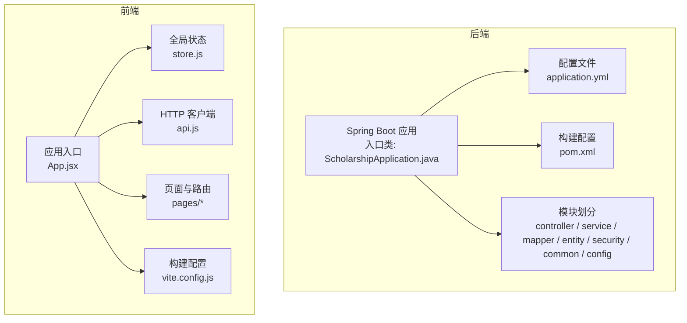
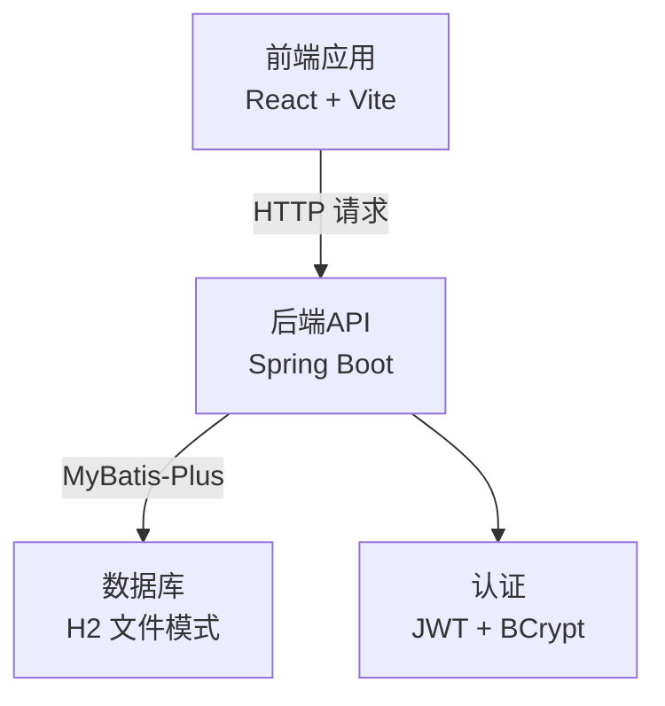
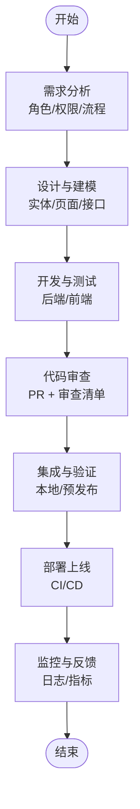
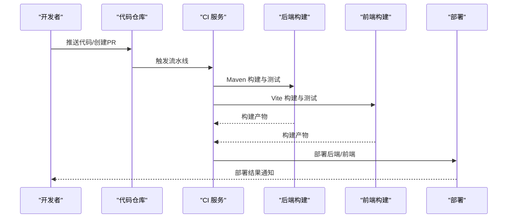
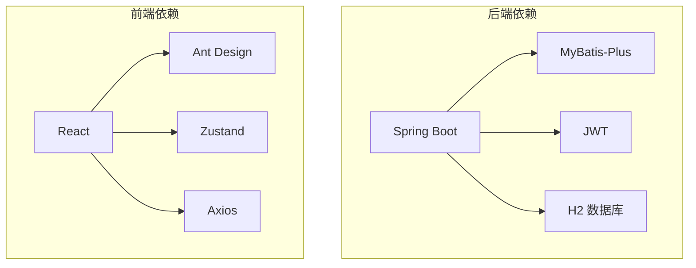

# 开发流程与工作流

<cite>
**本文引用的文件**
- [README.md](file://README.md)
- [.gitignore](file://.gitignore)
- [backend/pom.xml](file://backend/pom.xml)
- [backend/src/main/resources/application.yml](file://backend/src/main/resources/application.yml)
- [frontend/package.json](file://frontend/package.json)
- [start-backend.ps1](file://start-backend.ps1)
- [start-frontend.ps1](file://start-frontend.ps1)
- [backend/src/main/java/com/zjsu/scholarship/ScholarshipApplication.java](file://backend/src/main/java/com/zjsu/scholarship/ScholarshipApplication.java)
- [backend/src/main/java/com/zjsu/scholarship/common/GlobalExceptionHandler.java](file://backend/src/main/java/com/zjsu/scholarship/common/GlobalExceptionHandler.java)
- [backend/src/main/java/com/zjsu/scholarship/security/JwtAuthInterceptor.java](file://backend/src/main/java/com/zjsu/scholarship/security/JwtAuthInterceptor.java)
- [backend/src/main/java/com/zjsu/scholarship/controller/AuthController.java](file://backend/src/main/java/com/zjsu/scholarship/controller/AuthController.java)
- [backend/src/main/java/com/zjsu/scholarship/service/AuthService.java](file://backend/src/main/java/com/zjsu/scholarship/service/AuthService.java)
- [backend/src/main/java/com/zjsu/scholarship/service/ScoreCalcService.java](file://backend/src/main/java/com/zjsu/scholarship/service/ScoreCalcService.java)
- [backend/src/main/java/com/zjsu/scholarship/service/RankingService.java](file://backend/src/main/java/com/zjsu/scholarship/service/RankingService.java)
- [backend/src/main/java/com/zjsu/scholarship/service/EvaluationService.java](file://backend/src/main/java/com/zjsu/scholarship/service/EvaluationService.java)
- [backend/src/main/java/com/zjsu/scholarship/entity/Application.java](file://backend/src/main/java/com/zjsu/scholarship/entity/Application.java)
- [backend/src/main/java/com/zjsu/scholarship/entity/ScholarshipProject.java](file://backend/src/main/java/com/zjsu/scholarship/entity/ScholarshipProject.java)
- [backend/src/main/java/com/zjsu/scholarship/entity/ScholarshipLevel.java](file://backend/src/main/java/com/zjsu/scholarship/entity/ScholarshipLevel.java)
- [backend/src/main/java/com/zjsu/scholarship/entity/Student.java](file://backend/src/main/java/com/zjsu/scholarship/entity/Student.java)
- [backend/src/main/java/com/zjsu/scholarship/mapper/ApplicationMapper.java](file://backend/src/main/java/com/zjsu/scholarship/mapper/ApplicationMapper.java)
- [backend/src/main/java/com/zjsu/scholarship/mapper/ScholarshipProjectMapper.java](file://backend/src/main/java/com/zjsu/scholarship/mapper/ScholarshipProjectMapper.java)
- [backend/src/main/java/com/zjsu/scholarship/mapper/ScholarshipLevelMapper.java](file://backend/src/main/java/com/zjsu/scholarship/mapper/ScholarshipLevelMapper.java)
- [backend/src/main/java/com/zjsu/scholarship/mapper/StudentMapper.java](file://backend/src/main/java/com/zjsu/scholarship/mapper/StudentMapper.java)
- [frontend/src/App.jsx](file://frontend/src/App.jsx)
- [frontend/src/store.js](file://frontend/src/store.js)
- [frontend/src/api.js](file://frontend/src/api.js)
- [frontend/src/pages/student/Home.jsx](file://frontend/src/pages/student/Home.jsx)
- [frontend/src/pages/counselor/Applications.jsx](file://frontend/src/pages/counselor/Applications.jsx)
- [frontend/src/pages/admin/Dashboard.jsx](file://frontend/src/pages/admin/Dashboard.jsx)
- [frontend/vite.config.js](file://frontend/vite.config.js)
</cite>

## 目录
1. [引言](#引言)
2. [项目结构](#项目结构)
3. [核心组件](#核心组件)
4. [架构总览](#架构总览)
5. [详细组件分析](#详细组件分析)
6. [依赖关系分析](#依赖关系分析)
7. [性能考虑](#性能考虑)
8. [故障排查指南](#故障排查指南)
9. [结论](#结论)
10. [附录](#附录)

## 引言
本文件面向奖学金管理系统开发团队，系统化梳理开发流程与协作规范，覆盖Git工作流（分支策略、提交规范、合并流程）、功能开发全生命周期（需求分析至上线）、代码审查标准与流程、持续集成与持续部署（CI/CD）建议、版本发布与变更日志维护，以及团队协作工具使用规范。内容基于仓库现有配置与代码结构进行归纳总结，旨在帮助新成员快速融入并提升交付质量与效率。

## 项目结构
项目采用前后端分离架构，后端为Spring Boot应用，前端为React应用，配合H2数据库与JWT认证。根目录提供一键启动脚本，便于本地快速搭建环境。

图表来源
- [backend/src/main/java/com/zjsu/scholarship/ScholarshipApplication.java:1-200](file://backend/src/main/java/com/zjsu/scholarship/ScholarshipApplication.java#L1-L200)
- [backend/src/main/resources/application.yml:1-52](file://backend/src/main/resources/application.yml#L1-L52)
- [backend/pom.xml:1-108](file://backend/pom.xml#L1-L108)
- [frontend/src/App.jsx:1-200](file://frontend/src/App.jsx#L1-L200)
- [frontend/src/store.js:1-200](file://frontend/src/store.js#L1-L200)
- [frontend/src/api.js:1-200](file://frontend/src/api.js#L1-L200)
- [frontend/vite.config.js:1-200](file://frontend/vite.config.js#L1-L200)

章节来源
- [README.md:123-154](file://README.md#L123-L154)
- [backend/src/main/resources/application.yml:1-52](file://backend/src/main/resources/application.yml#L1-L52)
- [backend/pom.xml:1-108](file://backend/pom.xml#L1-L108)
- [frontend/package.json:1-26](file://frontend/package.json#L1-L26)

## 核心组件
- 后端核心模块
  - 控制器层：负责REST接口与请求转发，如认证、学生、辅导员、管理员相关控制器。
  - 服务层：封装业务逻辑，如认证、评分计算、排名、评审等服务。
  - 数据访问层：MyBatis-Plus Mapper，对应各实体的数据操作。
  - 安全与通用：JWT拦截器、全局异常处理、统一响应包装。
- 前端核心模块
  - 应用入口与路由：根据角色加载不同布局与页面。
  - 全局状态：基于Zustand的状态管理。
  - HTTP客户端：基于Axios封装，注入JWT。
  - 页面：学生、辅导员、管理员三大角色页面集合。

章节来源
- [backend/src/main/java/com/zjsu/scholarship/controller/AuthController.java:1-200](file://backend/src/main/java/com/zjsu/scholarship/controller/AuthController.java#L1-L200)
- [backend/src/main/java/com/zjsu/scholarship/service/AuthService.java:1-200](file://backend/src/main/java/com/zjsu/scholarship/service/AuthService.java#L1-L200)
- [backend/src/main/java/com/zjsu/scholarship/service/ScoreCalcService.java:1-200](file://backend/src/main/java/com/zjsu/scholarship/service/ScoreCalcService.java#L1-L200)
- [backend/src/main/java/com/zjsu/scholarship/service/RankingService.java:1-200](file://backend/src/main/java/com/zjsu/scholarship/service/RankingService.java#L1-L200)
- [backend/src/main/java/com/zjsu/scholarship/service/EvaluationService.java:1-200](file://backend/src/main/java/com/zjsu/scholarship/service/EvaluationService.java#L1-L200)
- [backend/src/main/java/com/zjsu/scholarship/security/JwtAuthInterceptor.java:1-200](file://backend/src/main/java/com/zjsu/scholarship/security/JwtAuthInterceptor.java#L1-L200)
- [backend/src/main/java/com/zjsu/scholarship/common/GlobalExceptionHandler.java:1-200](file://backend/src/main/java/com/zjsu/scholarship/common/GlobalExceptionHandler.java#L1-L200)
- [frontend/src/App.jsx:1-200](file://frontend/src/App.jsx#L1-L200)
- [frontend/src/store.js:1-200](file://frontend/src/store.js#L1-L200)
- [frontend/src/api.js:1-200](file://frontend/src/api.js#L1-L200)

## 架构总览
系统采用前后端分离，后端提供REST API，前端通过Axios调用接口并结合JWT进行鉴权。数据库采用H2文件模式，首次启动自动初始化schema与演示数据。

图表来源
- [backend/src/main/resources/application.yml:1-52](file://backend/src/main/resources/application.yml#L1-L52)
- [frontend/src/api.js:1-200](file://frontend/src/api.js#L1-L200)
- [backend/src/main/java/com/zjsu/scholarship/security/JwtAuthInterceptor.java:1-200](file://backend/src/main/java/com/zjsu/scholarship/security/JwtAuthInterceptor.java#L1-L200)

章节来源
- [README.md:8-16](file://README.md#L8-L16)
- [backend/src/main/resources/application.yml:1-52](file://backend/src/main/resources/application.yml#L1-L52)
- [frontend/src/api.js:1-200](file://frontend/src/api.js#L1-L200)

## 详细组件分析

### Git 工作流与分支策略
- 分支策略
  - 主分支（main）：仅接收来自开发分支或功能分支的受控合并，保持稳定可发布状态。
  - 开发分支（develop）：集成日常开发成果，作为功能分支的汇聚点。
  - 功能分支（feature/*）：用于具体功能开发，命名建议使用“功能名称/任务编号”，完成后回并至develop。
  - 修复分支（hotfix/*）：紧急修复线上问题，从main切出，修复后同时合并回main与develop。
- 提交规范
  - 类型前缀：feat、fix、docs、style、refactor、test、chore等，遵循约定式提交。
  - 标题格式：类型(作用域): 描述（首字母小写，不超过50字符）。
  - 说明格式：正文简述变更动机与影响，必要时列出BREAKING CHANGE。
  - 关联Issue：在提交信息底部引用关联的Issue编号。
- 合并流程
  - Pull Request（PR）：功能分支完成开发后创建PR，要求通过代码审查与自动化检查。
  - 代码审查：至少一名同队成员批准，确保代码质量与一致性。
  - 合并策略：优先使用squash合并，保持主分支提交历史整洁；或rebase以线性历史。

章节来源
- [README.md:1-200](file://README.md#L1-L200)

### 功能开发全生命周期
- 需求分析
  - 明确角色与权限边界（学生、辅导员、管理员）。
  - 确定业务流程节点（测评、审核、排名、发布）。
- 设计与建模
  - 后端：基于实体与Mapper设计数据模型，服务层封装业务规则。
  - 前端：基于角色页面设计路由与状态，统一API调用。
- 开发与测试
  - 后端：按模块开发控制器、服务与Mapper，编写单元测试。
  - 前端：按页面开发组件与交互，结合Mock或后端联调。
- 代码审查
  - 使用PR模板与审查清单，关注安全性、可读性、性能与兼容性。
- 集成与验证
  - 在本地或预发布环境进行端到端验证。
- 上线与监控
  - 通过CI/CD流水线部署，观察日志与指标，及时处理告警。

章节来源
- [backend/src/main/java/com/zjsu/scholarship/entity/Application.java:1-200](file://backend/src/main/java/com/zjsu/scholarship/entity/Application.java#L1-L200)
- [backend/src/main/java/com/zjsu/scholarship/entity/ScholarshipProject.java:1-200](file://backend/src/main/java/com/zjsu/scholarship/entity/ScholarshipProject.java#L1-L200)
- [backend/src/main/java/com/zjsu/scholarship/entity/ScholarshipLevel.java:1-200](file://backend/src/main/java/com/zjsu/scholarship/entity/ScholarshipLevel.java#L1-L200)
- [frontend/src/pages/student/Home.jsx:1-200](file://frontend/src/pages/student/Home.jsx#L1-L200)
- [frontend/src/pages/counselor/Applications.jsx:1-200](file://frontend/src/pages/counselor/Applications.jsx#L1-L200)
- [frontend/src/pages/admin/Dashboard.jsx:1-200](file://frontend/src/pages/admin/Dashboard.jsx#L1-L200)

### 代码审查标准与流程
- 审查清单
  - 代码风格：命名规范、注释清晰、函数长度合理。
  - 安全性：输入校验、权限控制、敏感信息处理。
  - 性能：避免N+1查询、合理缓存、资源释放。
  - 兼容性：跨浏览器/平台、编码与字符集。
  - 可测试性：可注入、可Mock、边界条件覆盖。
- 审查流程
  - 提交PR时填写描述与变更说明，关联Issue。
  - 指派至少一名审查者，审查者在24小时内完成初审。
  - 修改意见需逐条回复并更新代码，直至通过。
  - 合并前确保所有检查项通过且无未决问题。

章节来源
- [backend/src/main/java/com/zjsu/scholarship/security/JwtAuthInterceptor.java:1-200](file://backend/src/main/java/com/zjsu/scholarship/security/JwtAuthInterceptor.java#L1-L200)
- [backend/src/main/java/com/zjsu/scholarship/common/GlobalExceptionHandler.java:1-200](file://backend/src/main/java/com/zjsu/scholarship/common/GlobalExceptionHandler.java#L1-L200)

### 持续集成与持续部署（CI/CD）
- 构建与测试
  - 后端：使用Maven构建，执行单元测试，生成可执行包。
  - 前端：使用Vite构建，生成静态资源，支持预览与部署。
- 部署建议
  - 服务端部署：将后端打包产物部署至服务器，配置JVM参数与日志输出。
  - 前端部署：将构建产物部署至Web服务器或静态托管平台。
- 运行与运维
  - 后端：通过启动脚本或系统服务方式运行，监听指定端口。
  - 前端：通过反向代理或容器化方式对外提供服务。
- 日志与监控
  - 后端：配置日志级别与输出路径，接入集中式日志。
  - 前端：记录错误堆栈与用户行为，便于问题定位。

章节来源
- [backend/pom.xml:90-106](file://backend/pom.xml#L90-L106)
- [frontend/package.json:6-10](file://frontend/package.json#L6-L10)
- [start-backend.ps1:1-28](file://start-backend.ps1#L1-L28)
- [start-frontend.ps1:1-7](file://start-frontend.ps1#L1-L7)

### 版本发布与变更日志
- 版本号
  - 采用语义化版本（MAJOR.MINOR.PATCH），遵循破坏性变更、新增功能、缺陷修复的规则。
- 发布流程
  - 在develop上合并功能分支后，创建标签并发布候选版本。
  - 进行回归测试与安全扫描，确认无重大缺陷后正式发布。
- 变更日志
  - 记录每个版本的新增功能、修复问题、破坏性变更与迁移指南。
  - 与PR和Issue关联，便于追溯。

章节来源
- [backend/pom.xml:14-18](file://backend/pom.xml#L14-L18)
- [frontend/package.json:1-4](file://frontend/package.json#L1-L4)

### 团队协作工具与规范
- 项目管理
  - 使用看板（如Trello/Notion/Jira）跟踪任务状态（待办/进行/评审/完成）。
  - 将需求拆分为小任务，明确验收标准与负责人。
- 沟通渠道
  - 使用即时通讯工具进行日常沟通，重要决策与变更在群内同步。
  - 定期站会同步进度与风险，迭代回顾总结改进点。
- 文档与知识沉淀
  - 维护开发文档、API文档与FAQ，新成员入职培训时提供资料。
  - 对接外部系统时，记录接口契约与注意事项。

## 依赖关系分析
后端依赖Spring Boot、MyBatis-Plus、JWT与H2数据库；前端依赖React、Ant Design与Zustand。构建工具与脚本分别位于各自目录，便于独立开发与部署。

图表来源
- [backend/pom.xml:26-87](file://backend/pom.xml#L26-L87)
- [frontend/package.json:11-24](file://frontend/package.json#L11-L24)

章节来源
- [backend/pom.xml:1-108](file://backend/pom.xml#L1-L108)
- [frontend/package.json:1-26](file://frontend/package.json#L1-L26)

## 性能考虑
- 后端
  - 数据访问：合理使用MyBatis-Plus分页与条件构造，避免N+1查询；对热点数据建立索引。
  - 缓存：对频繁读取的配置与枚举使用内存缓存，降低数据库压力。
  - 并发：控制并发量与超时时间，避免阻塞线程池。
- 前端
  - 资源：按需加载与懒加载，减少首屏体积；图片与静态资源启用压缩与CDN。
  - 交互：避免重复请求，使用防抖与节流优化高频事件。
- 运行时
  - JVM参数：设置合适的堆大小与GC策略，监控内存与CPU使用。
  - 日志：分级输出，避免过多INFO级别日志影响性能。

## 故障排查指南
- 启动失败
  - 端口占用：检查端口是否被占用，调整端口或终止冲突进程。
  - 依赖缺失：确保JDK与Maven版本满足要求，清理缓存后重试。
- 数据库问题
  - H2连接：确认数据库URL与驱动正确，检查数据目录权限。
  - 初始化失败：查看SQL初始化日志，修正schema或data脚本错误。
- 认证与权限
  - JWT无效：核对密钥与过期时间，检查请求头是否正确携带令牌。
  - 权限不足：确认角色与权限注解配置，检查拦截器链路。
- 前端联调
  - 跨域：确认CORS配置，允许前端域名与方法。
  - 代理：检查Vite代理配置，确保后端接口可达。

章节来源
- [backend/src/main/resources/application.yml:1-52](file://backend/src/main/resources/application.yml#L1-L52)
- [backend/src/main/java/com/zjsu/scholarship/security/JwtAuthInterceptor.java:1-200](file://backend/src/main/java/com/zjsu/scholarship/security/JwtAuthInterceptor.java#L1-L200)
- [frontend/vite.config.js:1-200](file://frontend/vite.config.js#L1-L200)

## 结论
本文件从Git工作流、开发流程、代码审查、CI/CD、版本管理与协作工具六个维度，系统化梳理了奖学金管理系统的开发与协作规范。建议团队在实际执行中结合项目进展持续优化流程，并通过定期回顾与培训不断提升交付质量与效率。

## 附录
- 一键启动脚本
  - 后端：通过PowerShell脚本自动加载JDK与Maven并启动后端服务。
  - 前端：自动安装依赖并启动开发服务器。
- 配置参考
  - 后端配置：数据库连接、H2控制台、JWT密钥与上传目录等。
  - 前端配置：构建脚本、依赖与开发服务器端口。

章节来源
- [start-backend.ps1:1-28](file://start-backend.ps1#L1-L28)
- [start-frontend.ps1:1-7](file://start-frontend.ps1#L1-L7)
- [backend/src/main/resources/application.yml:1-52](file://backend/src/main/resources/application.yml#L1-L52)
- [frontend/package.json:6-10](file://frontend/package.json#L6-L10)