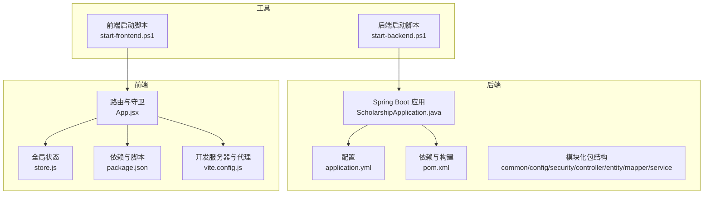
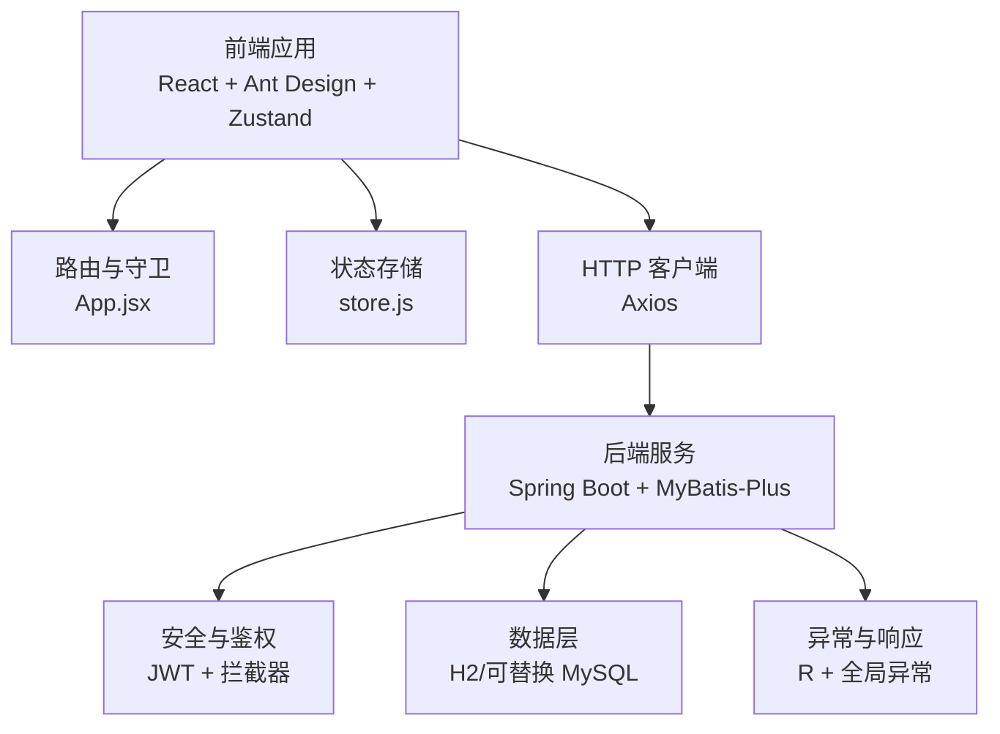
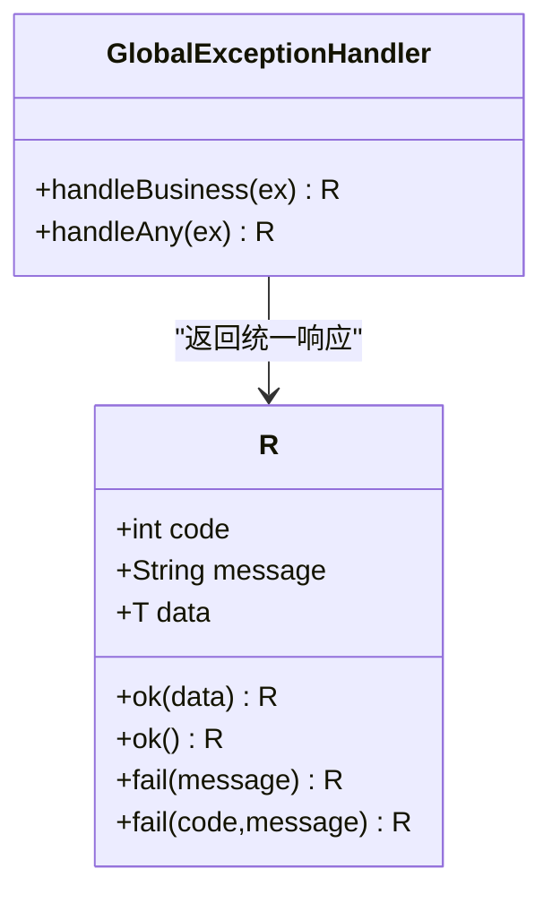
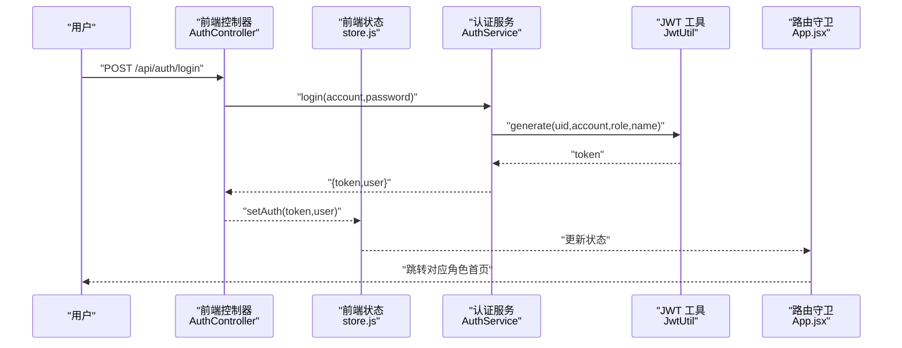
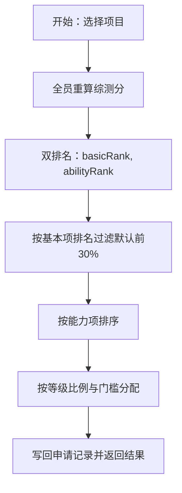
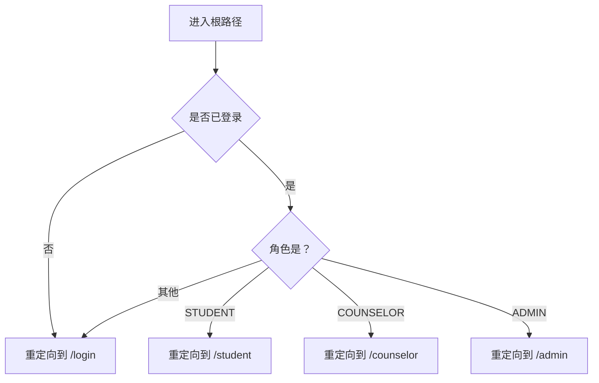
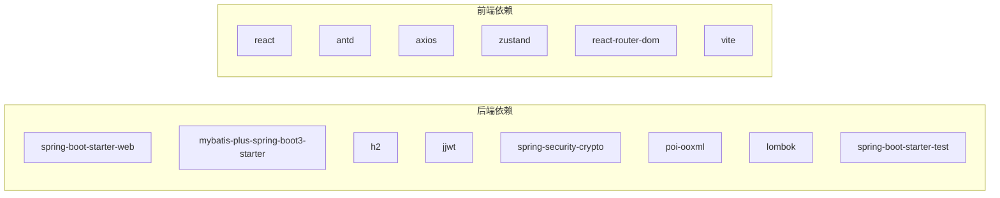

# 开发者指南

<cite>
**本文引用的文件**
- [README.md](file://README.md)
- [pom.xml](file://backend/pom.xml)
- [application.yml](file://backend/src/main/resources/application.yml)
- [ScholarshipApplication.java](file://backend/src/main/java/com/zjsu/scholarship/ScholarshipApplication.java)
- [R.java](file://backend/src/main/java/com/zjsu/scholarship/common/R.java)
- [GlobalExceptionHandler.java](file://backend/src/main/java/com/zjsu/scholarship/common/GlobalExceptionHandler.java)
- [JwtUtil.java](file://backend/src/main/java/com/zjsu/scholarship/security/JwtUtil.java)
- [AuthController.java](file://backend/src/main/java/com/zjsu/scholarship/controller/AuthController.java)
- [AuthService.java](file://backend/src/main/java/com/zjsu/scholarship/service/AuthService.java)
- [ScoreCalcService.java](file://backend/src/main/java/com/zjsu/scholarship/service/ScoreCalcService.java)
- [RankingService.java](file://backend/src/main/java/com/zjsu/scholarship/service/RankingService.java)
- [package.json](file://frontend/package.json)
- [vite.config.js](file://frontend/vite.config.js)
- [App.jsx](file://frontend/src/App.jsx)
- [store.js](file://frontend/src/store.js)
- [start-backend.ps1](file://start-backend.ps1)
- [start-frontend.ps1](file://start-frontend.ps1)
</cite>

## 目录
1. [简介](#简介)
2. [项目结构](#项目结构)
3. [核心组件](#核心组件)
4. [架构总览](#架构总览)
5. [详细组件分析](#详细组件分析)
6. [依赖分析](#依赖分析)
7. [性能考虑](#性能考虑)
8. [故障排查指南](#故障排查指南)
9. [结论](#结论)
10. [附录](#附录)

## 简介
本指南面向参与奖学金管理系统的工程师，提供从开发规范、环境搭建、工作流、测试、CI/CD、性能与压力测试、调试排错到知识传承与新功能评审的全流程最佳实践。系统采用前后端分离架构：后端基于 Java 17 + Spring Boot 3.2 + MyBatis-Plus，前端基于 React 18 + Vite 5 + Ant Design 5 + Zustand，接口遵循 RESTful 设计并通过 JWT 进行鉴权。

## 项目结构
项目分为后端与前端两大子项目，配合一键启动脚本与配置文件，便于本地快速搭建与验证。

图表来源
- [ScholarshipApplication.java:1-14](file://backend/src/main/java/com/zjsu/scholarship/ScholarshipApplication.java#L1-L14)
- [application.yml:1-52](file://backend/src/main/resources/application.yml#L1-L52)
- [pom.xml:1-108](file://backend/pom.xml#L1-L108)
- [App.jsx:1-83](file://frontend/src/App.jsx#L1-L83)
- [store.js:1-15](file://frontend/src/store.js#L1-L15)
- [package.json:1-26](file://frontend/package.json#L1-L26)
- [vite.config.js:1-21](file://frontend/vite.config.js#L1-L21)
- [start-backend.ps1](file://start-backend.ps1)
- [start-frontend.ps1](file://start-frontend.ps1)

章节来源
- [README.md:123-154](file://README.md#L123-L154)
- [pom.xml:1-108](file://backend/pom.xml#L1-L108)
- [application.yml:1-52](file://backend/src/main/resources/application.yml#L1-L52)
- [package.json:1-26](file://frontend/package.json#L1-L26)
- [vite.config.js:1-21](file://frontend/vite.config.js#L1-L21)
- [ScholarshipApplication.java:1-14](file://backend/src/main/java/com/zjsu/scholarship/ScholarshipApplication.java#L1-L14)
- [App.jsx:1-83](file://frontend/src/App.jsx#L1-L83)
- [store.js:1-15](file://frontend/src/store.js#L1-L15)

## 核心组件
- 统一响应与异常处理：后端通过通用响应包装类与全局异常处理器，确保接口返回格式一致且错误可追踪。
- 安全与鉴权：基于 JWT 的无状态认证，结合角色注解与拦截器实现权限控制。
- 业务引擎：评分计算与等级排名服务封装复杂规则，保证一致性与可维护性。
- 前端路由与状态：基于 React Router 的受保护路由与基于 Zustand 的持久化状态管理。

章节来源
- [R.java:1-39](file://backend/src/main/java/com/zjsu/scholarship/common/R.java#L1-L39)
- [GlobalExceptionHandler.java:1-23](file://backend/src/main/java/com/zjsu/scholarship/common/GlobalExceptionHandler.java#L1-L23)
- [JwtUtil.java:1-52](file://backend/src/main/java/com/zjsu/scholarship/security/JwtUtil.java#L1-L52)
- [ScoreCalcService.java:1-200](file://backend/src/main/java/com/zjsu/scholarship/service/ScoreCalcService.java#L1-L200)
- [RankingService.java:1-200](file://backend/src/main/java/com/zjsu/scholarship/service/RankingService.java#L1-L200)
- [App.jsx:1-83](file://frontend/src/App.jsx#L1-L83)
- [store.js:1-15](file://frontend/src/store.js#L1-L15)

## 架构总览
系统采用前后端分离，后端提供 REST API，前端通过 Axios 发起请求并携带 JWT；开发服务器通过 Vite 提供代理，转发 /api 与 /uploads 请求至后端。

图表来源
- [App.jsx:1-83](file://frontend/src/App.jsx#L1-L83)
- [store.js:1-15](file://frontend/src/store.js#L1-L15)
- [vite.config.js:1-21](file://frontend/vite.config.js#L1-L21)
- [application.yml:1-52](file://backend/src/main/resources/application.yml#L1-L52)
- [R.java:1-39](file://backend/src/main/java/com/zjsu/scholarship/common/R.java#L1-L39)
- [GlobalExceptionHandler.java:1-23](file://backend/src/main/java/com/zjsu/scholarship/common/GlobalExceptionHandler.java#L1-L23)

## 详细组件分析

### 后端统一响应与异常处理
- 统一响应包装类提供成功/失败的静态构造方法，简化控制器返回。
- 全局异常处理器捕获业务异常与未捕获异常，统一输出响应与日志。

图表来源
- [R.java:1-39](file://backend/src/main/java/com/zjsu/scholarship/common/R.java#L1-L39)
- [GlobalExceptionHandler.java:1-23](file://backend/src/main/java/com/zjsu/scholarship/common/GlobalExceptionHandler.java#L1-L23)

章节来源
- [R.java:1-39](file://backend/src/main/java/com/zjsu/scholarship/common/R.java#L1-L39)
- [GlobalExceptionHandler.java:1-23](file://backend/src/main/java/com/zjsu/scholarship/common/GlobalExceptionHandler.java#L1-L23)

### JWT 鉴权与登录流程
- 登录控制器接收账号密码，调用认证服务进行校验与密码匹配。
- 认证服务生成 JWT 并返回给前端；前端持久化 token 与用户信息。
- 前端路由守卫根据 token 与角色决定页面访问权限。

图表来源
- [AuthController.java:1-44](file://backend/src/main/java/com/zjsu/scholarship/controller/AuthController.java#L1-L44)
- [AuthService.java:1-77](file://backend/src/main/java/com/zjsu/scholarship/service/AuthService.java#L1-L77)
- [JwtUtil.java:1-52](file://backend/src/main/java/com/zjsu/scholarship/security/JwtUtil.java#L1-L52)
- [store.js:1-15](file://frontend/src/store.js#L1-L15)
- [App.jsx:1-83](file://frontend/src/App.jsx#L1-L83)

章节来源
- [AuthController.java:1-44](file://backend/src/main/java/com/zjsu/scholarship/controller/AuthController.java#L1-L44)
- [AuthService.java:1-77](file://backend/src/main/java/com/zjsu/scholarship/service/AuthService.java#L1-L77)
- [JwtUtil.java:1-52](file://backend/src/main/java/com/zjsu/scholarship/security/JwtUtil.java#L1-L52)
- [store.js:1-15](file://frontend/src/store.js#L1-L15)
- [App.jsx:1-83](file://frontend/src/App.jsx#L1-L83)

### 评分计算与等级分配引擎
- 评分引擎实现 2025 版规则，涵盖品德评议、品德记实、专业素质、综合能力五大模块。
- 等级分配服务执行双排名（基本项与综合能力），并按项目配置的比例与门槛分配等级。

图表来源
- [ScoreCalcService.java:1-200](file://backend/src/main/java/com/zjsu/scholarship/service/ScoreCalcService.java#L1-L200)
- [RankingService.java:1-200](file://backend/src/main/java/com/zjsu/scholarship/service/RankingService.java#L1-L200)

章节来源
- [ScoreCalcService.java:1-200](file://backend/src/main/java/com/zjsu/scholarship/service/ScoreCalcService.java#L1-L200)
- [RankingService.java:1-200](file://backend/src/main/java/com/zjsu/scholarship/service/RankingService.java#L1-L200)

### 前端路由与状态管理
- 路由守卫根据 token 与角色重定向至相应布局与页面。
- Zustand 状态持久化存储 token 与用户信息，避免刷新丢失。

图表来源
- [App.jsx:1-83](file://frontend/src/App.jsx#L1-L83)
- [store.js:1-15](file://frontend/src/store.js#L1-L15)

章节来源
- [App.jsx:1-83](file://frontend/src/App.jsx#L1-L83)
- [store.js:1-15](file://frontend/src/store.js#L1-L15)

## 依赖分析
- 后端依赖：Spring Boot Web、MyBatis-Plus、H2、jjwt、Spring Security Crypto、Lombok、Apache POI、JUnit。
- 前端依赖：React、Ant Design、Axios、dayjs、react-router-dom、zustand、Vite 插件。

图表来源
- [pom.xml:26-87](file://backend/pom.xml#L26-L87)
- [package.json:11-24](file://frontend/package.json#L11-L24)

章节来源
- [pom.xml:1-108](file://backend/pom.xml#L1-L108)
- [package.json:1-26](file://frontend/package.json#L1-L26)

## 性能考虑
- 数据库连接与 SQL 日志：生产建议关闭 MyBatis 日志实现，降低 IO 压力。
- 文件上传：后端配置了合理的上传大小限制，前端需配合分片或压缩策略。
- 评分与排名：批量重算与排序操作建议在低峰期执行，并对大列表分批处理。
- 前端渲染：Ant Design 组件按需引入，避免不必要的重渲染。

## 故障排查指南
- 启动失败：检查 JDK 与 Maven 环境变量，确认脚本路径与权限。
- 数据库初始化：确认 schema.sql 与 data.sql 路径与编码，必要时清理 data 目录重试。
- JWT 过期：调整配置中的过期小时数，或在前端定期刷新 token。
- 跨域与代理：确认 Vite 代理配置指向后端端口，代理路径覆盖 /api 与 /uploads。
- 密码重置：可通过清空用户密码哈希字段后使用初始密码登录。

章节来源
- [README.md:190-200](file://README.md#L190-L200)
- [application.yml:1-52](file://backend/src/main/resources/application.yml#L1-L52)
- [vite.config.js:1-21](file://frontend/vite.config.js#L1-L21)
- [JwtUtil.java:1-52](file://backend/src/main/java/com/zjsu/scholarship/security/JwtUtil.java#L1-L52)

## 结论
本指南提供了从开发规范、环境搭建、工作流、测试、CI/CD、性能与压力测试、调试排错到知识传承与新功能评审的完整实践路径。建议团队在开发过程中严格遵循命名与文件组织约定，保持前后端接口契约稳定，持续优化评分与排名算法的可读性与可维护性，并通过自动化工具保障质量与交付效率。

## 附录

### 开发环境搭建
- 后端：JDK 17 + Maven，一键启动脚本会自动加载工具链。
- 前端：Node.js + npm，安装依赖后启动开发服务器。
- 数据库：H2 文件模式，首次启动自动建表与导入演示数据。
- IDE 推荐：IntelliJ IDEA（后端）+ VS Code（前端），启用 Lombok 注解处理与 ESLint/Prettier。

章节来源
- [README.md:20-42](file://README.md#L20-L42)
- [start-backend.ps1](file://start-backend.ps1)
- [start-frontend.ps1](file://start-frontend.ps1)
- [application.yml:11-28](file://backend/src/main/resources/application.yml#L11-L28)

### Git 工作流与分支管理
- 主分支：仅允许通过合并请求（含代码审查）合并。
- 功能分支：基于 develop 创建 feature/*，完成后合并回 develop。
- 预发布分支：release/*，用于修复小问题与最终验证。
- 热修复分支：hotfix/*，直接从 master 派生，修复后同时合并回 master 与 develop。

### 代码规范与命名约定
- Java
  - 包名：com.zjsu.scholarship.*（common/config/security/controller/entity/mapper/service）
  - 类名：帕斯卡命名，如 ScoreCalcService
  - 方法：驼峰命名，如 rankAndAssign
  - 常量：全大写下划线，如 ZERO、ONE
  - 文件：按职责分层组织，避免跨层耦合
- React
  - 组件：帕斯卡命名，如 StudentLayout
  - 页面：按功能目录划分，如 student/*、counselor/*、admin/*
  - 状态：Zustand store 使用 setAuth/logout 等语义化动作
  - 路由：App.jsx 中集中声明受保护路由与重定向逻辑

### 单元测试与集成测试
- 单元测试：针对 Service 层（如 ScoreCalcService、RankingService）编写边界与规则驱动测试，覆盖评分与排名关键分支。
- 集成测试：使用 Spring Boot Test 与嵌入式 H2，模拟登录、提交材料、批量审核、执行排名与等级分配的端到端流程。
- 覆盖率：建议关键业务逻辑覆盖率不低于 80%，接口层不低于 60%。

### 持续集成与自动化部署
- CI：在 GitHub Actions 中配置 Java 构建、测试与覆盖率收集；前端构建与预览。
- 部署：后端打包为可执行 jar，前端构建产物部署至 Nginx 或静态托管；数据库支持切换为 MySQL。

### 性能与压力测试
- 性能测试：使用 JMeter 对登录、提交材料、批量审核、执行排名等高频接口进行吞吐与延迟测试。
- 压力测试：逐步提升并发与数据规模，观察数据库锁、内存与 GC 行为，定位瓶颈并优化查询与缓存。

### 文档维护与知识传承
- 维护：README 与各模块 README 更新与版本同步，重要变更在变更日志中记录。
- 知识传承：建立“新人入职手册”，包含环境搭建、常见问题、开发流程与评审清单。

### 新功能开发流程与评审标准
- 流程：需求评审 → 设计文档 → 开发分支 → 编码规范检查 → 单元测试 → 代码审查 → 集成测试 → 合并与回归测试 → 发布验证
- 评审标准：接口设计清晰、异常处理完备、日志与监控可追溯、性能与安全满足基线、文档与测试齐备