# 性能优化与监控

<cite>
**本文引用的文件**
- [application.yml](file://backend/src/main/resources/application.yml)
- [pom.xml](file://backend/pom.xml)
- [WebMvcConfig.java](file://backend/src/main/java/com/zjsu/scholarship/config/WebMvcConfig.java)
- [JwtAuthInterceptor.java](file://backend/src/main/java/com/zjsu/scholarship/security/JwtAuthInterceptor.java)
- [ScholarshipService.java](file://backend/src/main/java/com/zjsu/scholarship/service/ScholarshipService.java)
- [EvaluationService.java](file://backend/src/main/java/com/zjsu/scholarship/service/EvaluationService.java)
- [RankingService.java](file://backend/src/main/java/com/zjsu/scholarship/service/RankingService.java)
- [AdminController.java](file://backend/src/main/java/com/zjsu/scholarship/controller/AdminController.java)
- [vite.config.js](file://frontend/vite.config.js)
- [package.json](file://frontend/package.json)
- [api.js](file://frontend/src/api.js)
- [store.js](file://frontend/src/store.js)
- [App.jsx](file://frontend/src/App.jsx)
- [main.jsx](file://frontend/src/main.jsx)
</cite>

## 目录
1. [引言](#引言)
2. [项目结构](#项目结构)
3. [核心组件](#核心组件)
4. [架构概览](#架构概览)
5. [详细组件分析](#详细组件分析)
6. [依赖分析](#依赖分析)
7. [性能考虑](#性能考虑)
8. [故障排查指南](#故障排查指南)
9. [结论](#结论)
10. [附录](#附录)

## 引言
本文件面向奖学金管理系统，提供后端与前端的性能优化策略与监控方案。内容涵盖数据库查询优化、缓存策略、异步处理与并发控制；前端组件渲染优化、资源加载优化、状态管理优化与用户体验提升；性能监控工具配置与使用；系统瓶颈识别与分析方法；负载均衡与高可用实现；性能测试方法与工具；以及生产环境调优经验与最佳实践。

## 项目结构
系统采用前后端分离架构：
- 后端基于 Spring Boot 3 + MyBatis-Plus，使用 H2 数据库存储，提供 REST API。
- 前端基于 Vite + React + Ant Design + Zustand，通过代理访问后端 API。

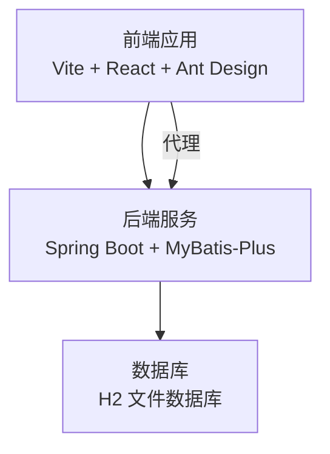

图表来源
- [vite.config.js:1-21](file://frontend/vite.config.js#L1-L21)
- [application.yml:1-52](file://backend/src/main/resources/application.yml#L1-L52)

章节来源
- [vite.config.js:1-21](file://frontend/vite.config.js#L1-L21)
- [application.yml:1-52](file://backend/src/main/resources/application.yml#L1-L52)

## 核心组件
- 后端配置与拦截器：跨域、资源映射、JWT 认证拦截。
- 业务服务层：奖学金业务、综合评价、排名与等级分配。
- 控制器层：管理员功能入口，提供项目管理、导入导出、统计看板等。
- 前端状态与 API：Axios 封装、Zustand 状态持久化、路由保护。

章节来源
- [WebMvcConfig.java:1-49](file://backend/src/main/java/com/zjsu/scholarship/config/WebMvcConfig.java#L1-L49)
- [JwtAuthInterceptor.java:1-65](file://backend/src/main/java/com/zjsu/scholarship/security/JwtAuthInterceptor.java#L1-L65)
- [ScholarshipService.java:1-280](file://backend/src/main/java/com/zjsu/scholarship/service/ScholarshipService.java#L1-L280)
- [EvaluationService.java:1-308](file://backend/src/main/java/com/zjsu/scholarship/service/EvaluationService.java#L1-L308)
- [RankingService.java:1-437](file://backend/src/main/java/com/zjsu/scholarship/service/RankingService.java#L1-L437)
- [AdminController.java:1-528](file://backend/src/main/java/com/zjsu/scholarship/controller/AdminController.java#L1-L528)
- [api.js:1-44](file://frontend/src/api.js#L1-L44)
- [store.js:1-15](file://frontend/src/store.js#L1-L15)

## 架构概览
后端通过 WebMvc 配置启用 CORS 与静态资源映射，JWT 拦截器在请求进入控制器前进行鉴权与权限校验。前端通过 Axios 统一封装请求与响应拦截，Zustand 进行轻量状态管理，并持久化认证信息。

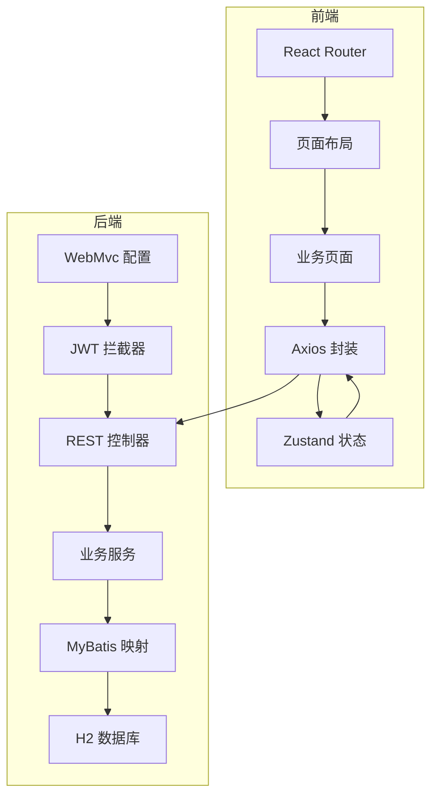

图表来源
- [WebMvcConfig.java:1-49](file://backend/src/main/java/com/zjsu/scholarship/config/WebMvcConfig.java#L1-L49)
- [JwtAuthInterceptor.java:1-65](file://backend/src/main/java/com/zjsu/scholarship/security/JwtAuthInterceptor.java#L1-L65)
- [api.js:1-44](file://frontend/src/api.js#L1-L44)
- [store.js:1-15](file://frontend/src/store.js#L1-L15)

## 详细组件分析

### 后端性能组件分析

#### JWT 认证拦截器
- 功能：解析 Authorization 头部，校验 JWT 并注入当前用户上下文，支持方法级角色注解校验。
- 性能要点：避免重复解析与异常开销；确保在 OPTIONS 预检时快速放行；请求结束后清理上下文。

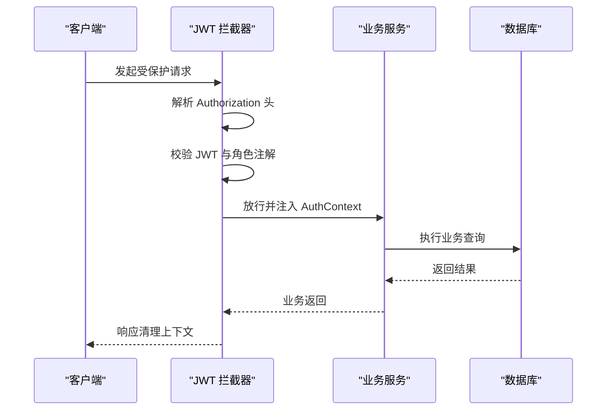

图表来源
- [JwtAuthInterceptor.java:20-63](file://backend/src/main/java/com/zjsu/scholarship/security/JwtAuthInterceptor.java#L20-L63)

章节来源
- [JwtAuthInterceptor.java:1-65](file://backend/src/main/java/com/zjsu/scholarship/security/JwtAuthInterceptor.java#L1-L65)

#### 综合评价服务
- 功能：计算基本项与综合能力分数，支持批量重算与提交。
- 性能要点：批量查询与聚合计算，避免 N+1 查询；更新时仅写入必要字段；合理使用 BigDecimal 精度。

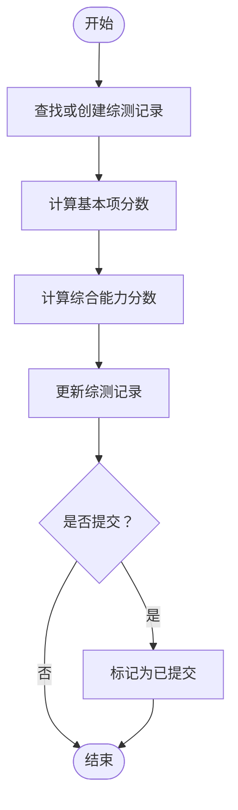

图表来源
- [EvaluationService.java:63-184](file://backend/src/main/java/com/zjsu/scholarship/service/EvaluationService.java#L63-L184)

章节来源
- [EvaluationService.java:1-308](file://backend/src/main/java/com/zjsu/scholarship/service/EvaluationService.java#L1-L308)

#### 排名与等级分配服务
- 功能：双排名（基本项、综合能力）、按比例分配等级、附加一等额外校验。
- 性能要点：全员重算后建立索引顺序；按比例计算名额并限制额外排名阈值；批量写入推荐等级。

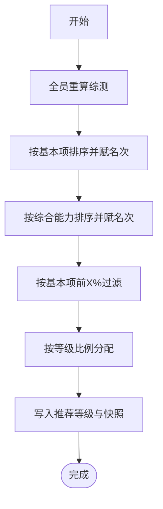

图表来源
- [RankingService.java:62-227](file://backend/src/main/java/com/zjsu/scholarship/service/RankingService.java#L62-L227)

章节来源
- [RankingService.java:1-437](file://backend/src/main/java/com/zjsu/scholarship/service/RankingService.java#L1-L437)

#### 奖学金业务服务
- 功能：能力突出奖学金资格判定、考研奖学金提交、申报限制校验、奖金计算。
- 性能要点：使用条件查询减少扫描；对多表关联结果进行必要字段选择；事务边界明确。

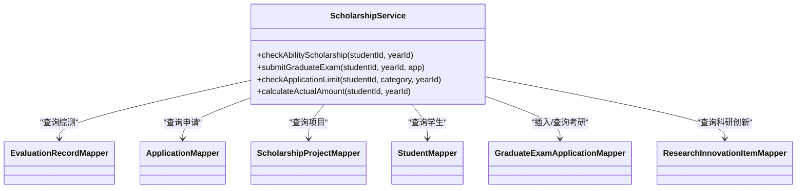

图表来源
- [ScholarshipService.java:22-49](file://backend/src/main/java/com/zjsu/scholarship/service/ScholarshipService.java#L22-L49)

章节来源
- [ScholarshipService.java:1-280](file://backend/src/main/java/com/zjsu/scholarship/service/ScholarshipService.java#L1-L280)

#### 管理员控制器
- 功能：项目管理、导入导出、统计看板、排名发布、学生代表管理、处分与申诉管理。
- 性能要点：批量导出 CSV 时注意流式输出；分页与筛选参数合理使用；批量操作使用事务。

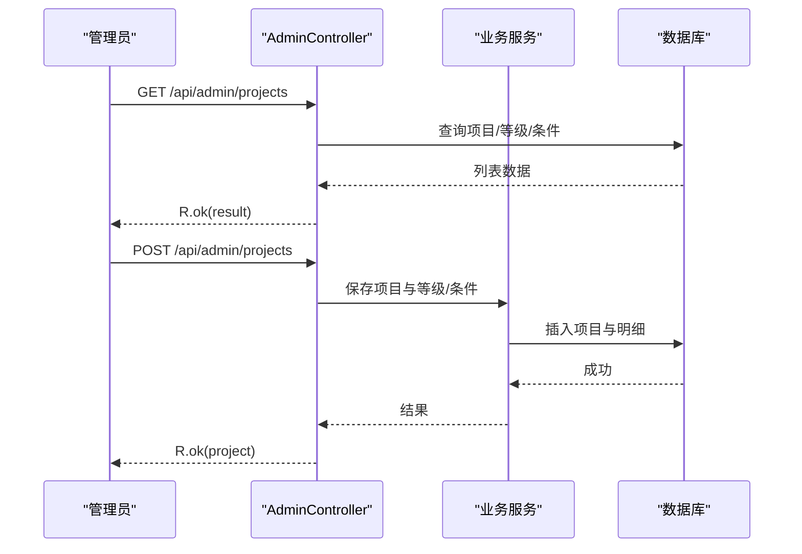

图表来源
- [AdminController.java:78-159](file://backend/src/main/java/com/zjsu/scholarship/controller/AdminController.java#L78-L159)

章节来源
- [AdminController.java:1-528](file://backend/src/main/java/com/zjsu/scholarship/controller/AdminController.java#L1-L528)

### 前端性能组件分析

#### Axios 封装与拦截器
- 功能：统一基础路径、超时设置、请求头注入、错误处理与登出逻辑。
- 性能要点：避免重复请求；错误提示统一；在 401 时主动清理本地状态。

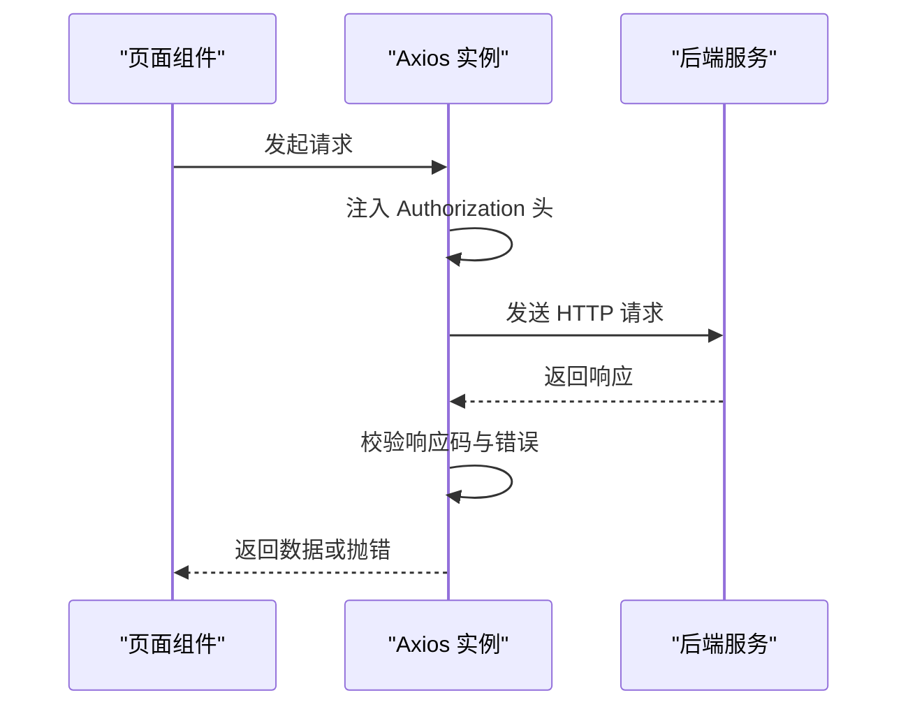

图表来源
- [api.js:5-41](file://frontend/src/api.js#L5-L41)

章节来源
- [api.js:1-44](file://frontend/src/api.js#L1-L44)

#### Zustand 状态管理
- 功能：存储 token 与用户信息，持久化到本地存储。
- 性能要点：最小化状态粒度；避免不必要的重渲染；持久化键名清晰。

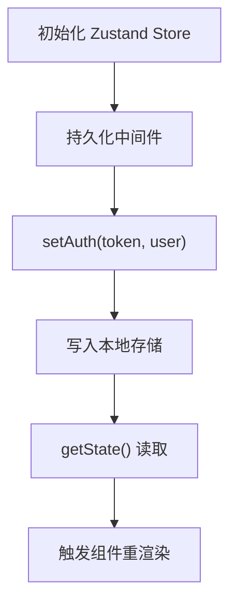

图表来源
- [store.js:4-14](file://frontend/src/store.js#L4-L14)

章节来源
- [store.js:1-15](file://frontend/src/store.js#L1-L15)

#### 路由与页面保护
- 功能：根据角色保护路由，未登录跳转登录页。
- 性能要点：避免重复鉴权；路由懒加载与按需加载资源。

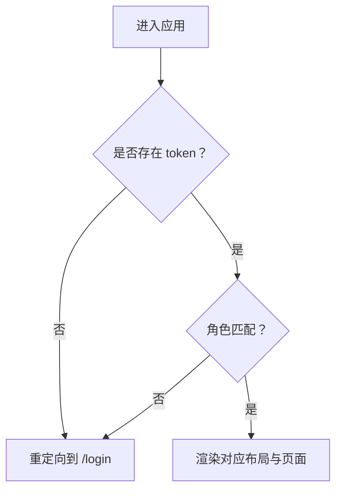

图表来源
- [App.jsx:27-41](file://frontend/src/App.jsx#L27-L41)

章节来源
- [App.jsx:1-83](file://frontend/src/App.jsx#L1-L83)

## 依赖分析
- 后端依赖：Spring Web、MyBatis-Plus、H2、JWT、Apache POI（Excel 导入导出）、测试 Starter。
- 前端依赖：React、Ant Design、Axios、Zustand、Vite。

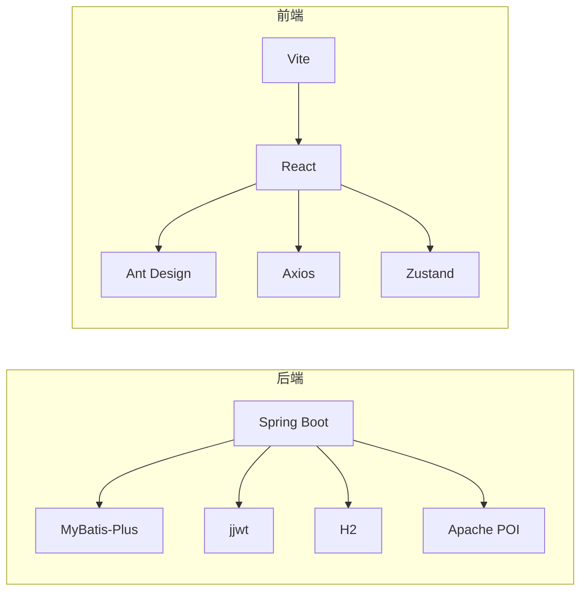

图表来源
- [pom.xml:26-87](file://backend/pom.xml#L26-L87)
- [package.json:11-24](file://frontend/package.json#L11-L24)

章节来源
- [pom.xml:1-108](file://backend/pom.xml#L1-L108)
- [package.json:1-26](file://frontend/package.json#L1-L26)

## 性能考虑

### 后端性能优化策略
- 数据库查询优化
  - 使用条件查询与精确字段选择，避免 SELECT *。
  - 对常用查询字段建立合适索引（如 EvaluationRecord 的 yearId、studentId，Application 的 studentId、projectId）。
  - 减少 N+1 查询：批量查询与一次性组装数据。
  - 使用分页与筛选参数，避免一次性加载大量数据。
- 缓存策略
  - 对热点读取数据（如项目配置、等级与条件）引入 Redis 缓存，设置合理过期时间。
  - 对排行榜结果进行缓存，结合事件驱动失效机制。
- 异步处理
  - 导入导出、批量重算等耗时操作使用异步任务队列（如 RabbitMQ/Kafka + Spring Task）。
  - 排名计算与奖金汇总在后台定时任务中执行，避免阻塞请求。
- 并发控制
  - 使用乐观锁或版本号控制并发更新。
  - 对关键业务（如提交申请、排名发布）使用分布式锁或数据库唯一约束。
- 日志与监控
  - 开启 SQL 日志与慢查询日志，定位慢查询。
  - 使用 Micrometer + Prometheus + Grafana 监控关键指标（QPS、P95/P99、线程池、JVM 垃圾回收）。
  - 集成 APM（如 SkyWalking 或自建 OpenTelemetry）追踪链路。

### 前端性能优化技巧
- 组件渲染优化
  - 使用 React.memo、useMemo、useCallback 降低重渲染。
  - 列表虚拟化（如 react-window 或 react-virtualized）处理大数据集。
  - 懒加载与代码分割，按需加载页面与组件。
- 资源加载优化
  - 启用 Vite 的构建优化与压缩，开启 Gzip/Brotli。
  - 图片与静态资源 CDN 化，合理设置缓存策略。
  - 使用浏览器缓存与 ETag/Cache-Control。
- 状态管理优化
  - Zustand 粒度拆分，避免全局状态风暴。
  - 使用持久化中间件时仅持久化必要字段。
- 用户体验提升
  - 加载骨架屏与占位符，提升感知性能。
  - 错误边界与降级策略，保证核心流程可用。

### 性能监控与告警
- APM 工具
  - SkyWalking/Zipkin/OpenTelemetry：链路追踪与依赖分析。
  - Prometheus + Grafana：指标采集与可视化。
  - ELK/EFK：日志聚合与检索。
- 指标收集
  - QPS、响应时间（P50/P90/P95/P99）、错误率、线程池活跃度、GC 时间。
  - 数据库慢查询、连接池使用率、缓存命中率。
- 告警设置
  - 响应时间超过阈值、错误率上升、数据库慢查询占比异常、缓存命中率下降。

### 系统瓶颈识别与分析
- 慢查询分析
  - 启用慢查询日志，定位执行时间长的 SQL。
  - 使用 EXPLAIN 分析执行计划，检查索引使用情况。
- 内存使用监控
  - 关注堆外内存（文件上传）、直接缓冲区使用。
  - JVM GC 日志分析，识别对象晋升与 Full GC。
- 响应时间分析
  - 通过 APM 链路图定位耗时环节（网络、序列化、数据库、缓存）。

### 负载均衡与高可用
- 负载均衡
  - Nginx/HAProxy 做反向代理与健康检查。
  - 应用层会话共享（Redis）或无状态设计。
- 高可用
  - 多实例部署，数据库主从复制与读写分离。
  - 缓存集群化（Redis Sentinel/Cluster）。
  - 自动扩缩容（Kubernetes HPA）与蓝绿/金丝雀发布。

### 性能测试方法与工具
- 基准测试
  - JMH（Java）评估热点方法性能。
  - Lighthouse（前端）评估首屏与交互性能。
- 压力测试
  - JMeter/Gatling（后端 API）模拟并发请求。
  - Artillery（前端）模拟用户行为与页面加载。
- 场景化测试
  - 排名计算、批量导入、导出报表等关键路径压测。
  - 渐进式加压，观察系统拐点与恢复能力。

### 生产环境调优经验与最佳实践
- 参数调优
  - JVM 堆大小与 GC 策略，线程池大小与队列长度。
  - 数据库连接池大小、超时与重试策略。
- 配置管理
  - 环境隔离（dev/test/prod），敏感配置外部化。
  - 动态配置中心（Apollo/Nacos）支持灰度与热更新。
- 安全与合规
  - 传输加密（HTTPS/TLS）、输入校验与防注入。
  - 审计日志与访问控制（RBAC）。

## 故障排查指南
- 登录鉴权问题
  - 检查 Authorization 头格式与 JWT 有效性；确认拦截器是否正确注入用户上下文。
- 数据不一致
  - 排名计算后未及时写入推荐等级；检查事务边界与异常回滚。
- 导入导出异常
  - Excel 格式不符、字段缺失；检查模板生成与校验逻辑。
- 前端状态异常
  - Token 过期未清理；检查响应拦截器与路由保护逻辑。

章节来源
- [JwtAuthInterceptor.java:20-63](file://backend/src/main/java/com/zjsu/scholarship/security/JwtAuthInterceptor.java#L20-L63)
- [api.js:18-41](file://frontend/src/api.js#L18-L41)
- [App.jsx:27-41](file://frontend/src/App.jsx#L27-L41)

## 结论
通过数据库查询优化、缓存与异步处理、并发控制与监控告警，结合前端渲染与资源加载优化，可显著提升奖学金管理系统的整体性能与稳定性。建议在生产环境中持续进行性能回归测试与容量规划，确保系统在高峰期仍能保持良好用户体验。

## 附录
- 配置参考
  - 后端端口、编码、H2 控制台、SQL 初始化、文件上传大小、JWT 秘钥与过期时间、日志级别。
  - 前端开发服务器端口、代理目标、依赖版本。

章节来源
- [application.yml:1-52](file://backend/src/main/resources/application.yml#L1-L52)
- [vite.config.js:1-21](file://frontend/vite.config.js#L1-L21)
- [package.json:1-26](file://frontend/package.json#L1-L26)