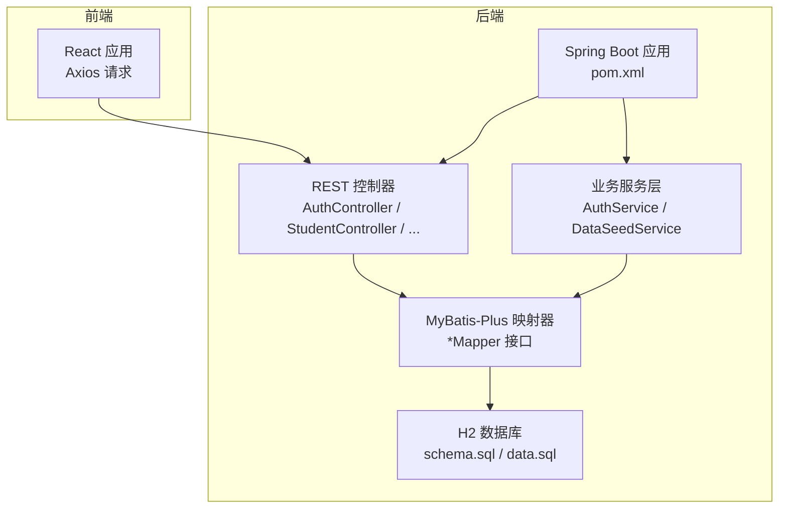
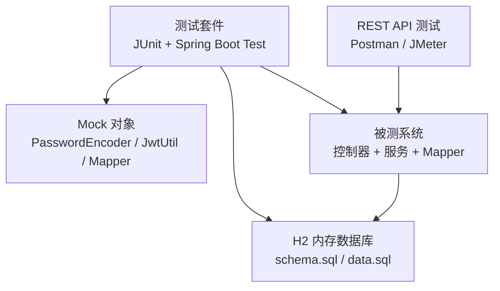
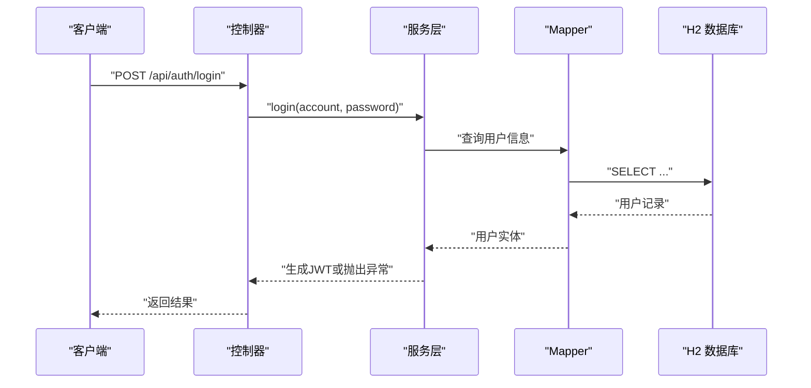
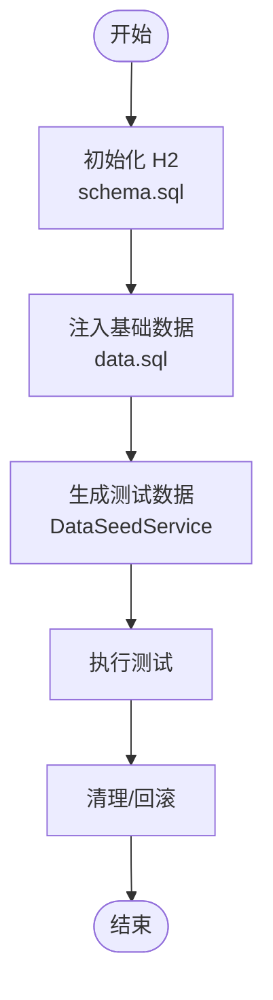
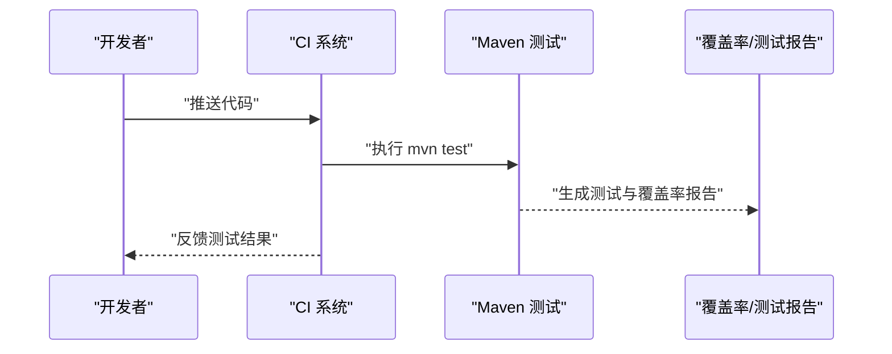
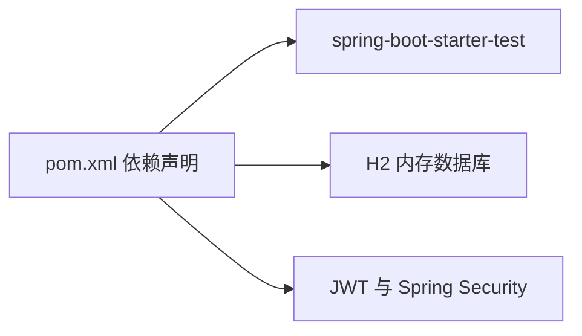

# 测试策略与实践

<cite>
**本文引用的文件**
- [pom.xml](file://backend/pom.xml)
- [README.md](file://README.md)
- [start-backend.ps1](file://start-backend.ps1)
- [.gitignore](file://.gitignore)
- [AuthService.java](file://backend/src/main/java/com/zjsu/scholarship/service/AuthService.java)
- [DataSeedService.java](file://backend/src/main/java/com/zjsu/scholarship/service/DataSeedService.java)
- [SchoolAuthMockMapper.java](file://backend/src/main/java/com/zjsu/scholarship/mapper/SchoolAuthMockMapper.java)
- [schema.sql](file://backend/src/main/resources/db/schema.sql)
- [data.sql](file://backend/src/main/resources/db/data.sql)
- [application.yml](file://backend/src/main/resources/application.yml)
</cite>

## 目录
1. [引言](#引言)
2. [项目结构](#项目结构)
3. [核心组件](#核心组件)
4. [架构总览](#架构总览)
5. [详细组件分析](#详细组件分析)
6. [依赖分析](#依赖分析)
7. [性能考虑](#性能考虑)
8. [故障排查指南](#故障排查指南)
9. [结论](#结论)
10. [附录](#附录)

## 引言
本文件面向奖学金管理系统，提供一套完整的测试策略与实践指南，覆盖单元测试、集成测试、端到端测试、测试数据管理、覆盖率要求、性能与压力测试、测试工具使用以及 CI/CD 中的测试集成。系统采用 Spring Boot + MyBatis-Plus + H2 的技术栈，具备良好的可测试性，便于通过 Mock、内存数据库与自动化脚本实现高效测试。

## 项目结构
后端基于 Maven 构建，使用 H2 内存数据库进行开发与测试，Spring Security + JWT 提供认证授权，服务层封装业务逻辑，控制器层暴露 REST API。前端为 React 应用，通过 Axios 发起请求并与后端交互。

图表来源
- [pom.xml:1-108](file://backend/pom.xml#L1-L108)
- [schema.sql](file://backend/src/main/resources/db/schema.sql)
- [data.sql](file://backend/src/main/resources/db/data.sql)
- [AuthService.java:1-35](file://backend/src/main/java/com/zjsu/scholarship/service/AuthService.java#L1-L35)
- [DataSeedService.java:35-110](file://backend/src/main/java/com/zjsu/scholarship/service/DataSeedService.java#L35-L110)

章节来源
- [pom.xml:1-108](file://backend/pom.xml#L1-L108)
- [README.md:123-154](file://README.md#L123-L154)

## 核心组件
- 认证服务（AuthService）：负责用户登录、密码校验与 JWT 签发，是安全测试的关键入口。
- 数据种子服务（DataSeedService）：用于生成测试数据，支持快速初始化测试环境。
- Mapper 接口：MyBatis-Plus 的数据访问层，便于通过 H2 进行数据库测试。
- 控制器层：对外暴露 REST API，是集成测试与端到端测试的主要目标。

章节来源
- [AuthService.java:1-35](file://backend/src/main/java/com/zjsu/scholarship/service/AuthService.java#L1-L35)
- [DataSeedService.java:35-110](file://backend/src/main/java/com/zjsu/scholarship/service/DataSeedService.java#L35-L110)
- [SchoolAuthMockMapper.java:1-7](file://backend/src/main/java/com/zjsu/scholarship/mapper/SchoolAuthMockMapper.java#L1-L7)

## 架构总览
下图展示测试相关的架构关系：测试通过 Mock 与 H2 隔离外部依赖，控制器层作为 API 测试入口，服务层承载业务逻辑验证点，数据库层通过 schema.sql 初始化结构与 data.sql 注入基础数据。

图表来源
- [pom.xml:84-87](file://backend/pom.xml#L84-L87)
- [schema.sql](file://backend/src/main/resources/db/schema.sql)
- [data.sql](file://backend/src/main/resources/db/data.sql)

## 详细组件分析

### 单元测试策略与规范
- 测试框架：使用 Spring Boot Starter Test 提供的 JUnit 与 Spring Test 支持。
- Mock 对象：对 PasswordEncoder、JwtUtil、Mapper 接口进行 Mock，确保测试隔离与可控。
- 断言方法：使用断言验证返回值、异常抛出、HTTP 状态码与响应体结构。
- 编写规范：
  - 每个类/方法一个测试类/测试方法，命名清晰表达意图。
  - 使用 @MockBean/@SpyBean 注入 Mock，@Autowired 注入真实组件。
  - 使用 @BeforeEach 初始化 Mock 行为与测试数据。
  - 避免直接依赖外部资源，所有外部依赖通过 Mock 或 H2 替代。

章节来源
- [pom.xml:84-87](file://backend/pom.xml#L84-L87)
- [AuthService.java:16-35](file://backend/src/main/java/com/zjsu/scholarship/service/AuthService.java#L16-L35)

### 集成测试设计与实现
- API 测试：针对控制器层接口进行集成测试，验证鉴权、参数校验、业务流程与错误处理。
- 数据库测试：使用 H2 文件模式，通过 schema.sql 初始化结构，data.sql 注入基础数据，确保测试一致性。
- 端到端测试：从前端发起请求到后端处理再到数据库落库，验证完整业务闭环。

图表来源
- [AuthService.java:32-35](file://backend/src/main/java/com/zjsu/scholarship/service/AuthService.java#L32-L35)
- [schema.sql](file://backend/src/main/resources/db/schema.sql)
- [data.sql](file://backend/src/main/resources/db/data.sql)

章节来源
- [AuthService.java:16-35](file://backend/src/main/java/com/zjsu/scholarship/service/AuthService.java#L16-L35)
- [schema.sql](file://backend/src/main/resources/db/schema.sql)
- [data.sql](file://backend/src/main/resources/db/data.sql)

### 测试数据准备与管理
- 数据库初始化：通过 schema.sql 定义表结构，data.sql 插入演示数据，确保测试环境一致性。
- 数据种子服务：DataSeedService 可用于生成大量测试数据，便于性能与边界条件测试。
- 环境隔离：H2 文件模式位于 backend/data/，通过 .gitignore 忽略持久化文件，避免污染版本库。
- 测试环境搭建：start-backend.ps1 默认跳过测试，可在本地手动执行 mvn test 进行测试。

图表来源
- [schema.sql](file://backend/src/main/resources/db/schema.sql)
- [data.sql](file://backend/src/main/resources/db/data.sql)
- [DataSeedService.java:85-110](file://backend/src/main/java/com/zjsu/scholarship/service/DataSeedService.java#L85-L110)
- [start-backend.ps1:10-12](file://start-backend.ps1#L10-L12)
- [.gitignore:4-5](file://.gitignore#L4-L5)

章节来源
- [schema.sql](file://backend/src/main/resources/db/schema.sql)
- [data.sql](file://backend/src/main/resources/db/data.sql)
- [DataSeedService.java:35-110](file://backend/src/main/java/com/zjsu/scholarship/service/DataSeedService.java#L35-L110)
- [start-backend.ps1:10-12](file://start-backend.ps1#L10-L12)
- [.gitignore:4-5](file://.gitignore#L4-L5)

### 测试覆盖率要求与测量
- 覆盖率目标：建议关键路径（控制器、服务、Mapper）行覆盖率≥80%，分支覆盖率≥60%。
- 测量工具：使用 JaCoCo 插件在 Maven 中生成覆盖率报告，结合 CI 平台阈值检查。
- 关注点：认证流程、评分计算、排名分配、异常处理等核心业务必须覆盖。

（本节为通用指导，不直接分析具体文件）

### 性能测试与压力测试
- 负载测试：使用 JMeter 对高频接口（如登录、提交测评、批量审核）进行并发压测，观察响应时间与错误率。
- 并发测试：模拟多用户同时操作（如辅导员批量审核、学生集中提交），评估系统吞吐与稳定性。
- 基准与回归：建立性能基线，每次重大变更后进行回归测试，防止性能退化。

（本节为通用指导，不直接分析具体文件）

### 测试工具使用指南
- Postman：导入 API 文档，构建集合，设置预请求脚本与测试脚本，进行接口自动化与回归测试。
- JMeter：录制/编写脚本，配置线程组与定时器，执行 HTTP 请求，收集聚合报告。
- H2 控制台：通过 http://localhost:8080/h2 验证数据库状态与数据一致性。

章节来源
- [README.md:158-186](file://README.md#L158-L186)

### 测试自动化与 CI/CD 集成
- Maven 测试命令：在 CI 中执行 mvn test，结合 JaCoCo 生成覆盖率报告。
- 脚本控制：start-backend.ps1 默认跳过测试，可在 CI 中显式调用测试阶段。
- 环境变量：通过 application.yml 配置 H2 数据库连接，确保测试环境一致。
- 结果输出：将测试报告与覆盖率报告上传至 CI 平台，设置失败阈值。

图表来源
- [pom.xml:90-106](file://backend/pom.xml#L90-L106)
- [start-backend.ps1:10-12](file://start-backend.ps1#L10-L12)
- [application.yml](file://backend/src/main/resources/application.yml)

章节来源
- [pom.xml:90-106](file://backend/pom.xml#L90-L106)
- [start-backend.ps1:10-12](file://start-backend.ps1#L10-L12)
- [application.yml](file://backend/src/main/resources/application.yml)

## 依赖分析
- 测试依赖：spring-boot-starter-test 提供 JUnit、Mockito、AssertJ、JsonPath 等常用测试工具。
- 数据库依赖：H2 作为内存数据库，零配置，适合快速测试与本地开发。
- 安全依赖：JWT 与 Spring Security 用于认证授权，需在测试中正确 Mock。

图表来源
- [pom.xml:26-87](file://backend/pom.xml#L26-L87)

章节来源
- [pom.xml:26-87](file://backend/pom.xml#L26-L87)

## 性能考虑
- 数据库性能：H2 文件模式适合中小规模测试，大规模并发建议使用 MySQL 并在 CI 中配置独立测试数据库。
- 缓存与连接池：合理配置连接池大小与超时，避免测试期间出现连接争用。
- 压测策略：优先选择高并发场景（批量审核、排名计算），关注 CPU、内存与数据库连接数指标。

（本节为通用指导，不直接分析具体文件）

## 故障排查指南
- 测试无法连接数据库：检查 H2 JDBC URL 与文件路径，确认 schema.sql 与 data.sql 已正确初始化。
- 登录失败：核对 AuthService 中密码编码与 JWT 生成逻辑，确保测试中使用 Mock 的 PasswordEncoder 与 JwtUtil 返回预期行为。
- 数据不一致：确认测试前是否执行了数据种子或初始化脚本，避免跨测试用例相互影响。

章节来源
- [AuthService.java:32-35](file://backend/src/main/java/com/zjsu/scholarship/service/AuthService.java#L32-L35)
- [schema.sql](file://backend/src/main/resources/db/schema.sql)
- [data.sql](file://backend/src/main/resources/db/data.sql)

## 结论
本测试策略以 Spring Boot + H2 为基础，结合 JUnit、Mockito 与 Postman/JMeter 实现从单元到端到端的全链路测试。通过合理的测试数据管理、覆盖率要求与性能压测，能够有效保障系统的稳定性与可靠性。建议在 CI/CD 中固化测试流程，持续监控测试质量与性能表现。

## 附录
- API 概览与端点清单可参考项目 README 的 API 概览部分，便于设计测试用例与脚本。
- H2 控制台地址与连接信息可用于调试与验证测试结果。

章节来源
- [README.md:158-186](file://README.md#L158-L186)