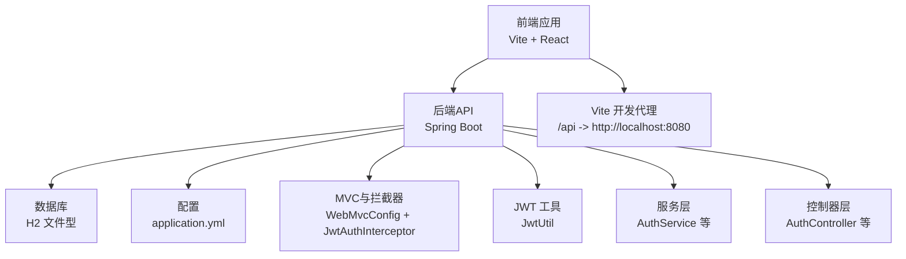
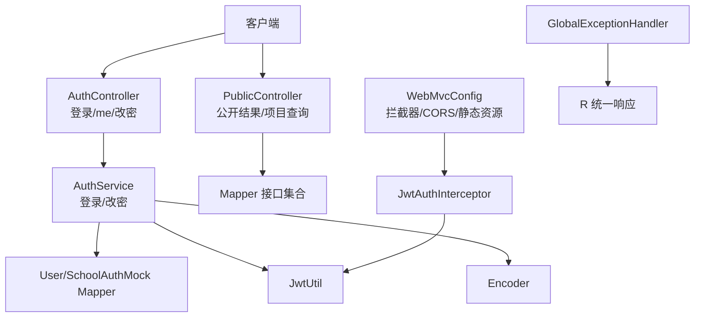
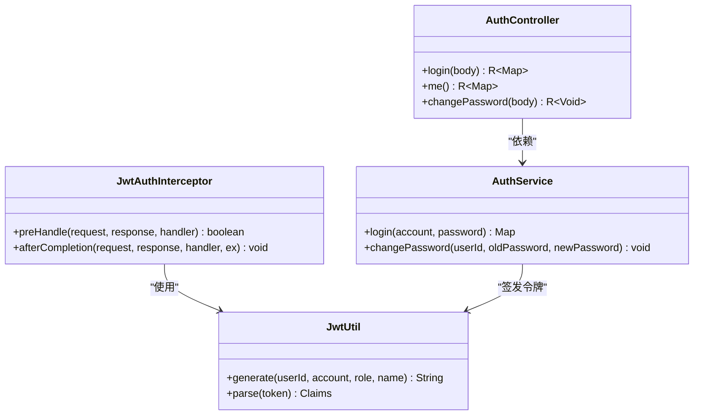
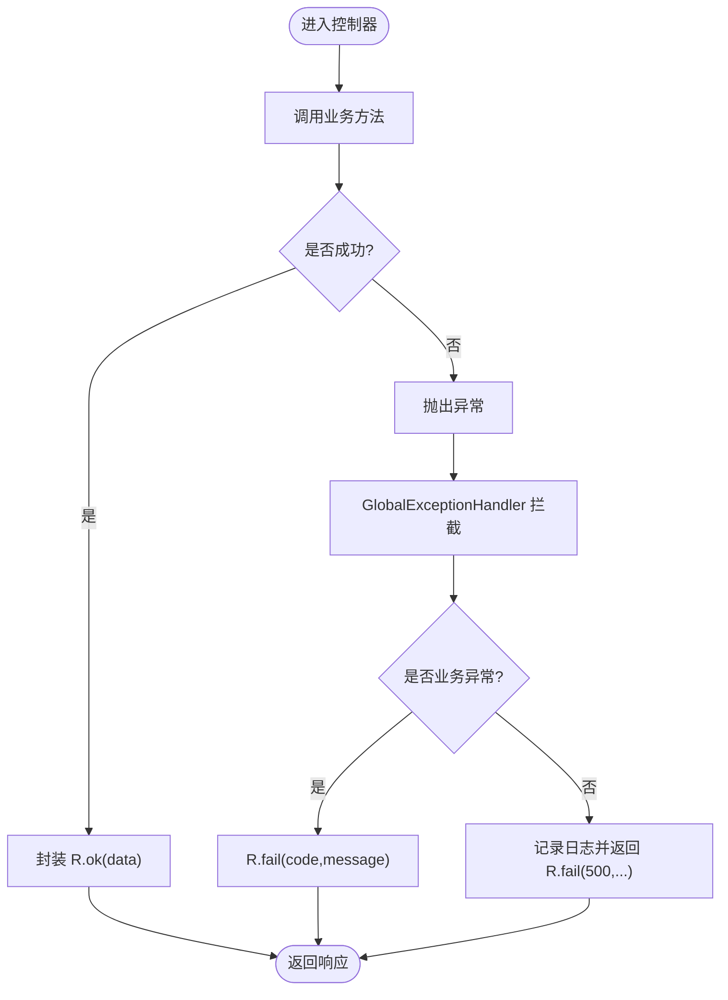
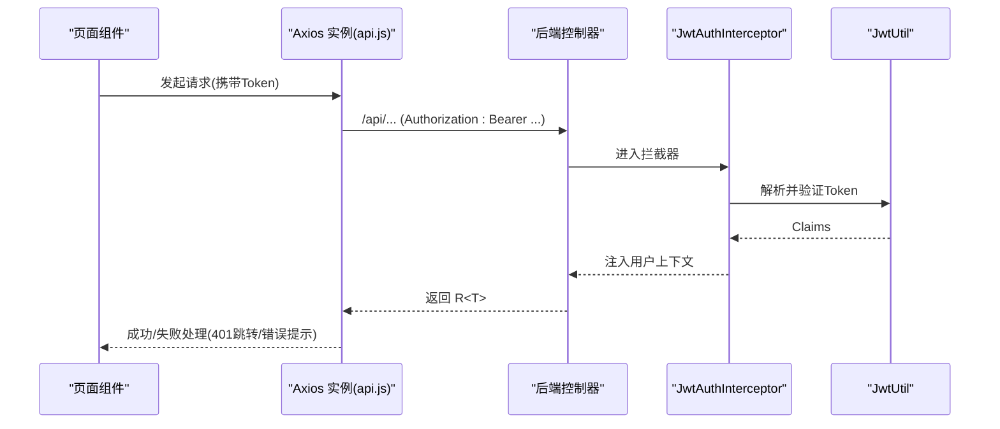
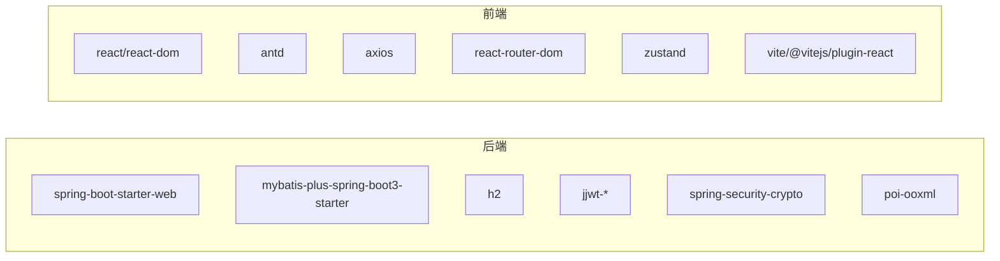
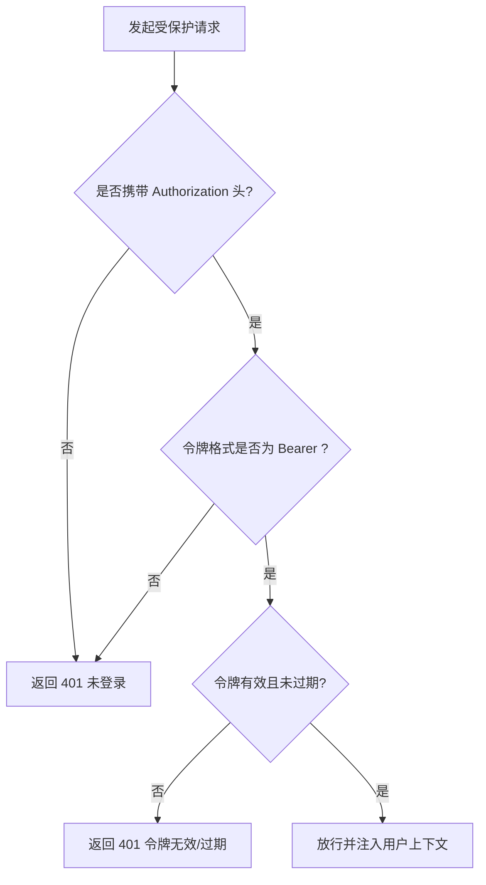

# 调试工具与故障排查

<cite>
**本文引用的文件**
- [application.yml](file://backend/src/main/resources/application.yml)
- [pom.xml](file://backend/pom.xml)
- [ScholarshipApplication.java](file://backend/src/main/java/com/zjsu/scholarship/ScholarshipApplication.java)
- [GlobalExceptionHandler.java](file://backend/src/main/java/com/zjsu/scholarship/common/GlobalExceptionHandler.java)
- [R.java](file://backend/src/main/java/com/zjsu/scholarship/common/R.java)
- [WebMvcConfig.java](file://backend/src/main/java/com/zjsu/scholarship/config/WebMvcConfig.java)
- [JwtUtil.java](file://backend/src/main/java/com/zjsu/scholarship/security/JwtUtil.java)
- [JwtAuthInterceptor.java](file://backend/src/main/java/com/zjsu/scholarship/security/JwtAuthInterceptor.java)
- [AuthService.java](file://backend/src/main/java/com/zjsu/scholarship/service/AuthService.java)
- [AuthController.java](file://backend/src/main/java/com/zjsu/scholarship/controller/AuthController.java)
- [PublicController.java](file://backend/src/main/java/com/zjsu/scholarship/controller/PublicController.java)
- [schema.sql](file://backend/src/main/resources/db/schema.sql)
- [package.json](file://frontend/package.json)
- [vite.config.js](file://frontend/vite.config.js)
- [api.js](file://frontend/src/api.js)
</cite>

## 目录
1. [简介](#简介)
2. [项目结构](#项目结构)
3. [核心组件](#核心组件)
4. [架构总览](#架构总览)
5. [详细组件分析](#详细组件分析)
6. [依赖分析](#依赖分析)
7. [性能考虑](#性能考虑)
8. [故障排查指南](#故障排查指南)
9. [结论](#结论)
10. [附录](#附录)

## 简介
本文件面向奖学金管理系统开发与运维团队，提供从开发到生产的完整调试与故障排查指南。内容覆盖后端调试工具（日志、远程调试、H2控制台）、前端调试技巧（浏览器开发者工具、网络监控）、常见问题排查流程（JWT认证失败、数据库连接问题、API响应异常）、性能诊断方法（内存/CPU分析、数据库查询优化），以及生产环境应急处理与回滚策略。同时给出开发工具推荐与配置建议。

## 项目结构
系统采用前后端分离架构：
- 后端基于 Spring Boot 3 + MyBatis-Plus，使用 H2 内嵌数据库，提供 REST API。
- 前端基于 Vite + React，通过代理将 /api 请求转发至后端，支持上传资源访问。

图表来源
- [vite.config.js:1-21](file://frontend/vite.config.js#L1-L21)
- [application.yml:1-52](file://backend/src/main/resources/application.yml#L1-L52)
- [WebMvcConfig.java:1-49](file://backend/src/main/java/com/zjsu/scholarship/config/WebMvcConfig.java#L1-L49)
- [JwtAuthInterceptor.java:1-65](file://backend/src/main/java/com/zjsu/scholarship/security/JwtAuthInterceptor.java#L1-L65)
- [JwtUtil.java:1-52](file://backend/src/main/java/com/zjsu/scholarship/security/JwtUtil.java#L1-L52)
- [AuthService.java:1-77](file://backend/src/main/java/com/zjsu/scholarship/service/AuthService.java#L1-L77)
- [AuthController.java:1-44](file://backend/src/main/java/com/zjsu/scholarship/controller/AuthController.java#L1-L44)

章节来源
- [package.json:1-26](file://frontend/package.json#L1-L26)
- [vite.config.js:1-21](file://frontend/vite.config.js#L1-L21)
- [application.yml:1-52](file://backend/src/main/resources/application.yml#L1-L52)
- [ScholarshipApplication.java:1-14](file://backend/src/main/java/com/zjsu/scholarship/ScholarshipApplication.java#L1-L14)

## 核心组件
- 配置与启动
  - 应用端口、数据源、SQL初始化、H2控制台、MyBatis-Plus配置、日志级别等集中于配置文件。
  - 启动类启用扫描 Mapper 包，确保 MyBatis-Plus 正常工作。
- 安全与认证
  - JWT 工具负责签发与解析；拦截器统一校验 Authorization 头并注入当前用户上下文；控制器提供登录、个人信息、改密接口。
- 全局异常处理
  - 统一包装响应体与异常捕获，便于前端识别业务错误与未处理异常。
- 前端通信
  - Axios 实例封装基础路径、超时、请求头注入与响应拦截，处理 401 重定向与错误提示。

章节来源
- [application.yml:1-52](file://backend/src/main/resources/application.yml#L1-L52)
- [ScholarshipApplication.java:1-14](file://backend/src/main/java/com/zjsu/scholarship/ScholarshipApplication.java#L1-L14)
- [JwtUtil.java:1-52](file://backend/src/main/java/com/zjsu/scholarship/security/JwtUtil.java#L1-L52)
- [JwtAuthInterceptor.java:1-65](file://backend/src/main/java/com/zjsu/scholarship/security/JwtAuthInterceptor.java#L1-L65)
- [AuthController.java:1-44](file://backend/src/main/java/com/zjsu/scholarship/controller/AuthController.java#L1-L44)
- [GlobalExceptionHandler.java:1-23](file://backend/src/main/java/com/zjsu/scholarship/common/GlobalExceptionHandler.java#L1-L23)
- [R.java:1-39](file://backend/src/main/java/com/zjsu/scholarship/common/R.java#L1-L39)
- [api.js:1-44](file://frontend/src/api.js#L1-L44)

## 架构总览
后端采用“控制器-服务-数据访问”分层，配合全局异常处理与 CORS/拦截器配置，形成清晰的请求处理链路。

图表来源
- [AuthController.java:1-44](file://backend/src/main/java/com/zjsu/scholarship/controller/AuthController.java#L1-L44)
- [PublicController.java:1-78](file://backend/src/main/java/com/zjsu/scholarship/controller/PublicController.java#L1-L78)
- [AuthService.java:1-77](file://backend/src/main/java/com/zjsu/scholarship/service/AuthService.java#L1-L77)
- [WebMvcConfig.java:1-49](file://backend/src/main/java/com/zjsu/scholarship/config/WebMvcConfig.java#L1-L49)
- [JwtAuthInterceptor.java:1-65](file://backend/src/main/java/com/zjsu/scholarship/security/JwtAuthInterceptor.java#L1-L65)
- [JwtUtil.java:1-52](file://backend/src/main/java/com/zjsu/scholarship/security/JwtUtil.java#L1-L52)
- [GlobalExceptionHandler.java:1-23](file://backend/src/main/java/com/zjsu/scholarship/common/GlobalExceptionHandler.java#L1-L23)
- [R.java:1-39](file://backend/src/main/java/com/zjsu/scholarship/common/R.java#L1-L39)

## 详细组件分析

### 认证与授权组件
- JwtUtil：基于对称密钥生成与解析 JWT，包含密钥派生与签名算法。
- JwtAuthInterceptor：在预处理阶段读取 Authorization 头，校验令牌有效性并将用户上下文注入线程本地存储；支持方法级角色注解校验。
- AuthService：实现登录与改密逻辑，包含账号状态检查、密码哈希匹配或初始密码比对、JWT签发与返回信息组装。
- AuthController：对外暴露登录、当前用户信息、修改密码接口。

图表来源
- [JwtUtil.java:1-52](file://backend/src/main/java/com/zjsu/scholarship/security/JwtUtil.java#L1-L52)
- [JwtAuthInterceptor.java:1-65](file://backend/src/main/java/com/zjsu/scholarship/security/JwtAuthInterceptor.java#L1-L65)
- [AuthService.java:1-77](file://backend/src/main/java/com/zjsu/scholarship/service/AuthService.java#L1-L77)
- [AuthController.java:1-44](file://backend/src/main/java/com/zjsu/scholarship/controller/AuthController.java#L1-L44)

章节来源
- [JwtUtil.java:1-52](file://backend/src/main/java/com/zjsu/scholarship/security/JwtUtil.java#L1-L52)
- [JwtAuthInterceptor.java:1-65](file://backend/src/main/java/com/zjsu/scholarship/security/JwtAuthInterceptor.java#L1-L65)
- [AuthService.java:1-77](file://backend/src/main/java/com/zjsu/scholarship/service/AuthService.java#L1-L77)
- [AuthController.java:1-44](file://backend/src/main/java/com/zjsu/scholarship/controller/AuthController.java#L1-L44)

### 响应与异常处理
- R<T>：统一响应载体，约定 code/message/data 字段，便于前端一致化处理。
- GlobalExceptionHandler：捕获业务异常与未处理异常，返回标准化错误响应，并记录日志。

图表来源
- [R.java:1-39](file://backend/src/main/java/com/zjsu/scholarship/common/R.java#L1-L39)
- [GlobalExceptionHandler.java:1-23](file://backend/src/main/java/com/zjsu/scholarship/common/GlobalExceptionHandler.java#L1-L23)

章节来源
- [R.java:1-39](file://backend/src/main/java/com/zjsu/scholarship/common/R.java#L1-L39)
- [GlobalExceptionHandler.java:1-23](file://backend/src/main/java/com/zjsu/scholarship/common/GlobalExceptionHandler.java#L1-L23)

### 前端通信与拦截
- api.js：Axios 实例设置基础路径为 /api，自动注入 Bearer Token；响应拦截中根据 code 判断成功/失败，401 触发登出与跳转，其他错误弹窗提示。

图表来源
- [api.js:1-44](file://frontend/src/api.js#L1-L44)
- [JwtAuthInterceptor.java:1-65](file://backend/src/main/java/com/zjsu/scholarship/security/JwtAuthInterceptor.java#L1-L65)
- [JwtUtil.java:1-52](file://backend/src/main/java/com/zjsu/scholarship/security/JwtUtil.java#L1-L52)
- [AuthController.java:1-44](file://backend/src/main/java/com/zjsu/scholarship/controller/AuthController.java#L1-L44)

章节来源
- [api.js:1-44](file://frontend/src/api.js#L1-L44)
- [JwtAuthInterceptor.java:1-65](file://backend/src/main/java/com/zjsu/scholarship/security/JwtAuthInterceptor.java#L1-L65)
- [JwtUtil.java:1-52](file://backend/src/main/java/com/zjsu/scholarship/security/JwtUtil.java#L1-L52)
- [AuthController.java:1-44](file://backend/src/main/java/com/zjsu/scholarship/controller/AuthController.java#L1-L44)

## 依赖分析
- 后端依赖
  - Spring Boot Web、Validation、MyBatis-Plus Starter、H2、jjwt、Spring Security Crypto、Apache POI、Lombok、测试 Starter。
- 前端依赖
  - React 生态、Ant Design、Axios、Day.js、路由与状态管理、Vite 开发工具链。

图表来源
- [pom.xml:26-87](file://backend/pom.xml#L26-L87)
- [package.json:11-24](file://frontend/package.json#L11-L24)

章节来源
- [pom.xml:1-108](file://backend/pom.xml#L1-L108)
- [package.json:1-26](file://frontend/package.json#L1-L26)

## 性能考虑
- 日志级别与输出
  - 当前日志级别对业务包为 INFO，Spring 为 WARN，便于在开发与生产间平衡可观测性与开销。
- 数据库与查询
  - 使用 MyBatis-Plus，SQL 初始化模式为 always，开发阶段可快速重建表结构；生产建议关闭自动建表。
- 并发与资源
  - 建议开启 JVM GC 日志与堆快照，结合 APM 工具定位热点方法与慢查询。
- 前端性能
  - 关注组件渲染次数与状态更新频率，避免不必要的重渲染；使用 React DevTools Profiler 分析性能瓶颈。

章节来源
- [application.yml:48-52](file://backend/src/main/resources/application.yml#L48-L52)
- [application.yml:22-28](file://backend/src/main/resources/application.yml#L22-L28)
- [pom.xml:90-106](file://backend/pom.xml#L90-L106)

## 故障排查指南

### 后端调试与监控
- 日志分析
  - 查看业务包与 Spring 的日志级别，结合全局异常处理器输出定位未处理异常。
  - 在开发环境临时提升日志级别以捕获更详细信息。
- H2 控制台
  - 启用后可通过 /h2 访问控制台进行 SQL 查询与表结构核对。
- 远程调试
  - Maven 插件已配置 JVM 参数，可在 IDE 中以远程调试方式附加到运行进程。
- Actuator（建议）
  - 可引入 actuator 依赖与健康检查端点，结合指标导出与健康页快速评估运行状态。

章节来源
- [application.yml:16-21](file://backend/src/main/resources/application.yml#L16-L21)
- [application.yml:48-52](file://backend/src/main/resources/application.yml#L48-L52)
- [pom.xml:90-106](file://backend/pom.xml#L90-L106)

### 前端调试技巧
- 浏览器开发者工具
  - Network 面板观察 /api 请求与响应，确认 Authorization 头、状态码与响应体结构。
  - Console 查看错误堆栈与警告；Elements 检查 DOM 结构与样式。
- React DevTools
  - 使用组件树与 Profiler 分析渲染性能与状态变化。
- 网络请求监控
  - 在 api.js 中拦截器已处理 401 与错误消息，结合浏览器 Network 面板定位具体失败原因。

章节来源
- [api.js:1-44](file://frontend/src/api.js#L1-L44)
- [vite.config.js:6-19](file://frontend/vite.config.js#L6-L19)

### 常见问题排查流程

#### JWT 认证失败
- 症状
  - 401 未登录或令牌缺失；401 令牌无效或已过期；403 无权限访问。
- 排查步骤
  - 检查前端是否正确携带 Authorization: Bearer Token。
  - 核对后端拦截器是否正确解析与验证令牌。
  - 确认 JWT 密钥与过期时间配置一致。
  - 若为跨域场景，确认 CORS 配置允许凭证与对应方法。
- 处理建议
  - 登录成功后持久化 Token；在拦截器中统一处理 401 并引导跳转登录页。

图表来源
- [JwtAuthInterceptor.java:20-58](file://backend/src/main/java/com/zjsu/scholarship/security/JwtAuthInterceptor.java#L20-L58)
- [api.js:18-41](file://frontend/src/api.js#L18-L41)

章节来源
- [JwtAuthInterceptor.java:1-65](file://backend/src/main/java/com/zjsu/scholarship/security/JwtAuthInterceptor.java#L1-L65)
- [JwtUtil.java:1-52](file://backend/src/main/java/com/zjsu/scholarship/security/JwtUtil.java#L1-L52)
- [WebMvcConfig.java:23-41](file://backend/src/main/java/com/zjsu/scholarship/config/WebMvcConfig.java#L23-L41)
- [api.js:1-44](file://frontend/src/api.js#L1-L44)

#### 数据库连接问题
- 症状
  - 应用启动失败或 SQL 初始化报错；运行时报连接异常。
- 排查步骤
  - 检查数据源 URL、驱动、用户名与密码；确认 H2 控制台可访问。
  - 核对 SQL 初始化脚本路径与编码；确认 schema.sql 与 data.sql 存在且可读。
  - 检查文件型数据库目录权限与磁盘空间。
- 处理建议
  - 开发环境使用文件型 H2；生产环境替换为 MySQL/PostgreSQL 并调整连接参数。

章节来源
- [application.yml:11-28](file://backend/src/main/resources/application.yml#L11-L28)
- [schema.sql:1-402](file://backend/src/main/resources/db/schema.sql#L1-L402)

#### API 响应异常
- 症状
  - 前端收到非 0 code 或 500 错误；控制台打印未处理异常。
- 排查步骤
  - 查看全局异常处理器日志输出；确认业务异常是否被正确包装。
  - 核对控制器返回值是否符合 R<T> 约定。
- 处理建议
  - 对业务异常抛出 BusinessException，由全局异常处理器统一返回；对未知异常记录日志并返回通用错误。

章节来源
- [GlobalExceptionHandler.java:1-23](file://backend/src/main/java/com/zjsu/scholarship/common/GlobalExceptionHandler.java#L1-L23)
- [R.java:1-39](file://backend/src/main/java/com/zjsu/scholarship/common/R.java#L1-L39)

#### 前端请求失败
- 症状
  - Network 显示 401/403/500；弹窗提示“请求失败”或“登录已过期”。
- 排查步骤
  - 检查 /api 代理配置是否指向后端地址；确认静态资源 /uploads 代理正确。
  - 核对 axios 拦截器是否注入 Token 与处理 401。
- 处理建议
  - 在拦截器中统一处理 401 并跳转登录；对业务错误显示友好提示。

章节来源
- [vite.config.js:6-19](file://frontend/vite.config.js#L6-L19)
- [api.js:1-44](file://frontend/src/api.js#L1-L44)

### 性能问题诊断方法
- 内存泄漏检测
  - 使用 JVM 堆快照对比，关注长时间存活对象与集合未释放。
- CPU 使用率分析
  - 采样热点方法，结合 APM 工具定位高频调用与锁竞争。
- 数据库查询优化
  - 使用慢查询日志与执行计划分析；对频繁查询建立索引；减少 N+1 查询。

章节来源
- [application.yml:48-52](file://backend/src/main/resources/application.yml#L48-L52)

### 日志系统配置与分析技巧
- 配置要点
  - 设置业务包日志级别为 INFO，框架日志级别为 WARN；必要时临时提升级别。
  - 使用统一异常处理器记录未处理异常堆栈。
- 分析技巧
  - 结合时间戳与请求 ID（如需）定位请求链路；按异常类型聚合统计。

章节来源
- [application.yml:48-52](file://backend/src/main/resources/application.yml#L48-L52)
- [GlobalExceptionHandler.java:17-21](file://backend/src/main/java/com/zjsu/scholarship/common/GlobalExceptionHandler.java#L17-L21)

### 生产环境应急处理与回滚策略
- 应急处理
  - 降级非关键功能；切换到只读模式；临时关闭高风险任务。
  - 快速修复后进行灰度发布，逐步扩大流量。
- 回滚策略
  - 保留最近一次稳定构建镜像与数据库备份；回滚时同步回滚数据库迁移。
  - 回滚前先停写，回滚后再恢复写入。

章节来源
- [application.yml:22-28](file://backend/src/main/resources/application.yml#L22-L28)

### 开发工具推荐与配置
- 后端
  - IDE：断点调试、远程调试附加；JVM 参数已在插件中配置。
  - 数据库客户端：H2 控制台 / DBeaver；用于 SQL 调试与表结构核对。
  - API 测试：Postman 或 Insomnia，模拟请求与验证响应。
- 前端
  - IDE：VS Code + React DevTools；使用 Vite 开发服务器热更新。
  - 网络抓包：浏览器 Network 面板 + Charles/Proxyman 辅助跨设备抓包。

章节来源
- [pom.xml:90-106](file://backend/pom.xml#L90-L106)
- [vite.config.js:1-21](file://frontend/vite.config.js#L1-L21)
- [application.yml:16-21](file://backend/src/main/resources/application.yml#L16-L21)

## 结论
通过统一的响应协议、完善的异常处理、清晰的认证拦截链与前后端调试工具链，系统具备良好的可观测性与可维护性。建议在生产环境中补充 Actuator、APM 与数据库慢查询分析能力，并完善灰度与回滚流程，以进一步提升稳定性与交付效率。

## 附录
- 关键端点与行为
  - 登录：POST /api/auth/login；返回 token 与用户信息。
  - 当前用户：GET /api/auth/me；需要 Bearer Token。
  - 修改密码：POST /api/auth/change-password；需要 Bearer Token。
  - 公开结果：GET /api/public/results；支持关键词筛选。
  - 公开项目：GET /api/public/projects；返回项目与等级列表。
- H2 控制台：启用后访问 /h2，输入 JDBC URL 与凭据即可查看表与数据。

章节来源
- [AuthController.java:21-42](file://backend/src/main/java/com/zjsu/scholarship/controller/AuthController.java#L21-L42)
- [PublicController.java:28-76](file://backend/src/main/java/com/zjsu/scholarship/controller/PublicController.java#L28-L76)
- [application.yml:16-21](file://backend/src/main/resources/application.yml#L16-L21)