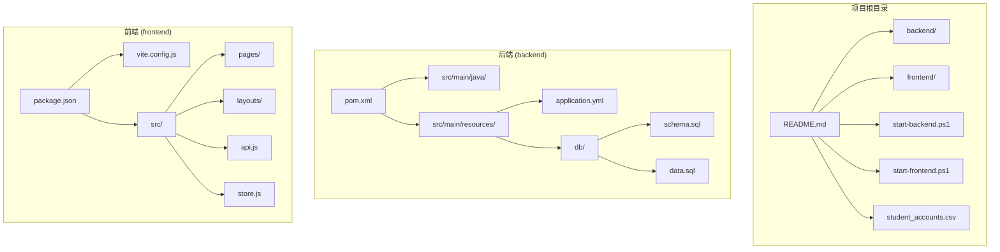
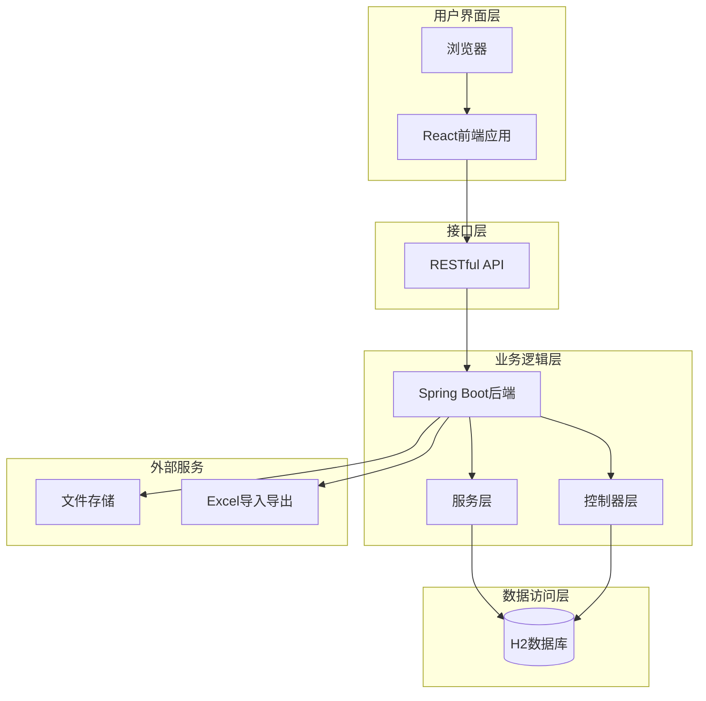
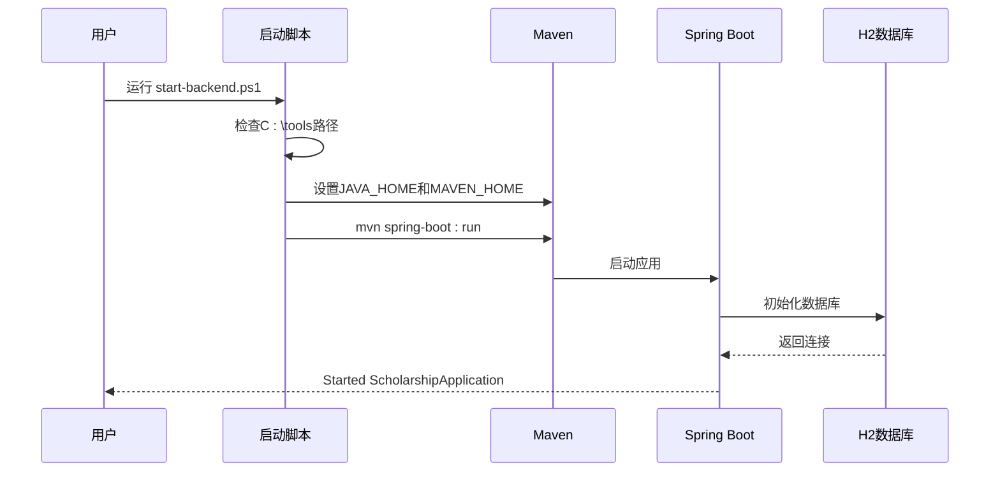
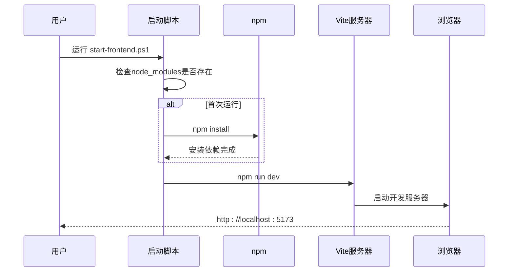
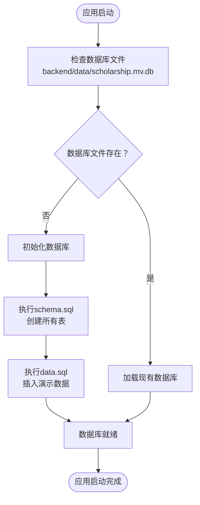
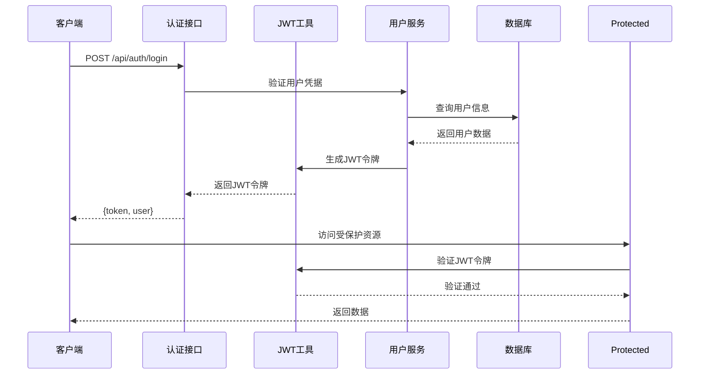
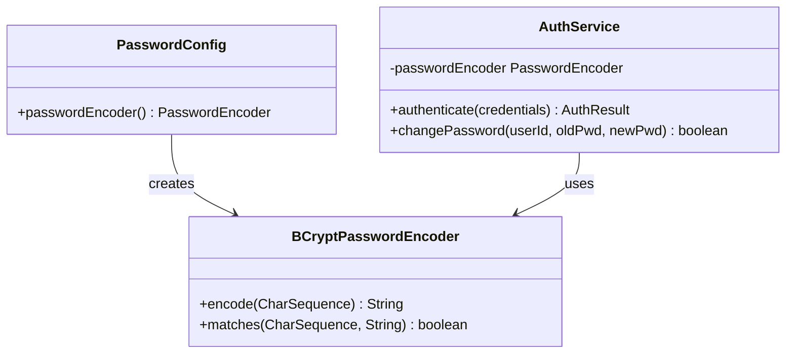
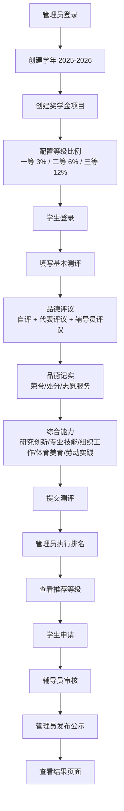
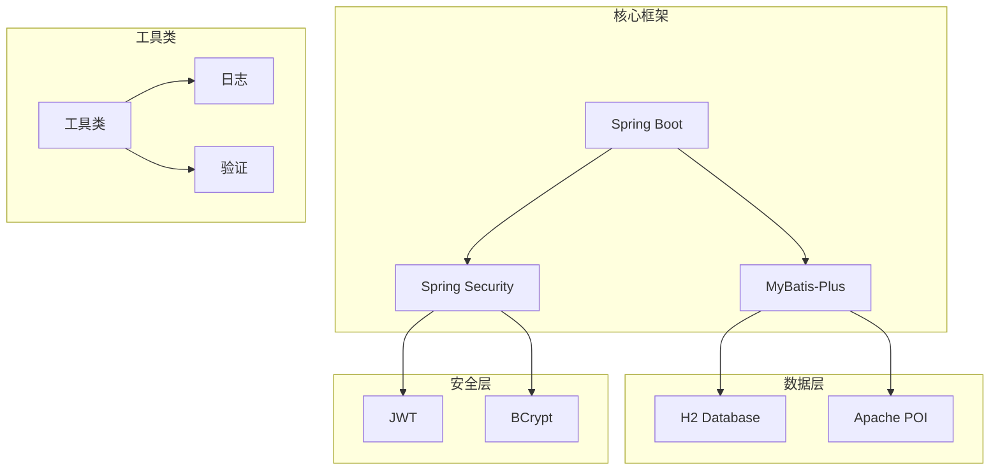

# 快速开始

<cite>
**本文引用的文件**
- [README.md](file://README.md)
- [start-backend.ps1](file://start-backend.ps1)
- [start-frontend.ps1](file://start-frontend.ps1)
- [backend/pom.xml](file://backend/pom.xml)
- [backend/src/main/resources/application.yml](file://backend/src/main/resources/application.yml)
- [backend/src/main/resources/db/schema.sql](file://backend/src/main/resources/db/schema.sql)
- [backend/src/main/resources/db/data.sql](file://backend/src/main/resources/db/data.sql)
- [frontend/package.json](file://frontend/package.json)
- [frontend/vite.config.js](file://frontend/vite.config.js)
- [backend/src/main/java/com/zjsu/scholarship/config/PasswordConfig.java](file://backend/src/main/java/com/zjsu/scholarship/config/PasswordConfig.java)
- [backend/src/main/java/com/zjsu/scholarship/config/WebMvcConfig.java](file://backend/src/main/java/com/zjsu/scholarship/config/WebMvcConfig.java)
- [backend/src/main/java/com/zjsu/scholarship/security/JwtUtil.java](file://backend/src/main/java/com/zjsu/scholarship/security/JwtUtil.java)
- [student_accounts.csv](file://student_accounts.csv)
</cite>

## 目录
1. [简介](#简介)
2. [项目结构](#项目结构)
3. [核心组件](#核心组件)
4. [架构概览](#架构概览)
5. [详细组件分析](#详细组件分析)
6. [依赖关系分析](#依赖关系分析)
7. [性能考虑](#性能考虑)
8. [故障排除指南](#故障排除指南)
9. [结论](#结论)
10. [附录](#附录)

## 简介
本指南旨在帮助开发者快速搭建和运行奖学金管理系统。该系统采用前后端分离架构，后端基于Spring Boot 3.2 + Java 17，前端基于React 18 + Vite 5，数据库使用H2（文件模式）。系统提供了完整的奖学金评选流程，包括综合测评、申请评审、等级分配等功能。

## 项目结构
奖学金管理系统采用标准的前后端分离项目结构：



**图表来源**
- [README.md:123-154](file://README.md#L123-L154)
- [backend/pom.xml:1-108](file://backend/pom.xml#L1-L108)
- [frontend/package.json:1-26](file://frontend/package.json#L1-L26)

**章节来源**
- [README.md:123-154](file://README.md#L123-L154)

## 核心组件
系统的核心组件包括：

### 后端技术栈
- **Spring Boot 3.2**: 提供Web应用框架和依赖注入
- **MyBatis-Plus 3.5**: ORM框架，简化数据库操作
- **H2数据库**: 内嵌数据库，支持文件模式存储
- **JWT认证**: 基于JSON Web Token的身份验证
- **BCrypt加密**: 密码哈希加密

### 前端技术栈
- **React 18**: 用户界面框架
- **Vite 5**: 构建工具和开发服务器
- **Ant Design 5**: UI组件库
- **Zustand**: 状态管理
- **Axios**: HTTP客户端

**章节来源**
- [README.md:8-16](file://README.md#L8-L16)
- [backend/pom.xml:26-87](file://backend/pom.xml#L26-L87)
- [frontend/package.json:11-24](file://frontend/package.json#L11-L24)

## 架构概览
系统采用经典的三层架构设计，前后端完全分离：



**图表来源**
- [README.md:158-187](file://README.md#L158-L187)
- [backend/src/main/resources/application.yml:1-52](file://backend/src/main/resources/application.yml#L1-L52)

## 详细组件分析

### 环境准备与安装

#### JDK 17+ 配置
系统要求Java 17或更高版本。项目提供了自动化的环境配置脚本：

1. **检查系统环境**：
   - 确保系统已安装JDK 17+
   - 验证JAVA_HOME环境变量设置

2. **使用内置脚本**：
   ```powershell
   # 使用系统默认JDK
   .\start-backend.ps1
   ```

3. **手动配置JDK路径**：
   - 默认路径：`C:\tools\jdk\jdk-17.0.13+11`
   - Maven路径：`C:\tools\maven\apache-maven-3.9.16`

#### Maven 依赖管理
项目使用Maven进行依赖管理，核心依赖包括：
- Spring Boot Starter Web
- MyBatis-Plus
- H2 Database
- JWT相关依赖
- Apache POI用于Excel处理

#### Node.js 和前端依赖
前端使用Node.js进行开发和构建：
- Node.js版本：16+
- 包管理器：npm
- 开发服务器：Vite 5

**章节来源**
- [README.md:20-43](file://README.md#L20-L43)
- [start-backend.ps1:1-13](file://start-backend.ps1#L1-L13)
- [start-frontend.ps1:1-8](file://start-frontend.ps1#L1-L8)
- [backend/pom.xml:20-24](file://backend/pom.xml#L20-L24)
- [frontend/package.json:1-10](file://frontend/package.json#L1-L10)

### 一键启动脚本详解

#### 后端启动脚本 (`start-backend.ps1`)
该脚本负责启动Spring Boot后端服务：



**图表来源**
- [start-backend.ps1:1-13](file://start-backend.ps1#L1-L13)
- [backend/src/main/resources/application.yml:11-28](file://backend/src/main/resources/application.yml#L11-L28)

#### 前端启动脚本 (`start-frontend.ps1`)
该脚本负责启动React前端开发服务器：



**图表来源**
- [start-frontend.ps1:1-8](file://start-frontend.ps1#L1-L8)
- [frontend/vite.config.js:6-19](file://frontend/vite.config.js#L6-L19)

**章节来源**
- [start-backend.ps1:10-12](file://start-backend.ps1#L10-L12)
- [start-frontend.ps1:1-7](file://start-frontend.ps1#L1-L7)

### H2数据库自动配置机制

#### 数据库初始化流程
系统使用Spring Boot的自动数据库初始化功能：



**图表来源**
- [backend/src/main/resources/application.yml:23-28](file://backend/src/main/resources/application.yml#L23-L28)
- [backend/src/main/resources/db/schema.sql:1-402](file://backend/src/main/resources/db/schema.sql#L1-L402)
- [backend/src/main/resources/db/data.sql:1-66](file://backend/src/main/resources/db/data.sql#L1-L66)

#### 数据库配置参数
- **文件位置**: `backend/data/scholarship.mv.db`
- **连接URL**: `jdbc:h2:file:./data/scholarship`
- **控制台**: `http://localhost:8080/h2`
- **用户名**: `sa`
- **密码**: 空

**章节来源**
- [README.md:32](file://README.md#L32)
- [README.md:184-186](file://README.md#L184-L186)
- [backend/src/main/resources/application.yml:11-19](file://backend/src/main/resources/application.yml#L11-L19)

### 认证与授权机制

#### JWT认证流程
系统采用JWT进行身份验证：



**图表来源**
- [backend/src/main/java/com/zjsu/scholarship/security/JwtUtil.java:28-42](file://backend/src/main/java/com/zjsu/scholarship/security/JwtUtil.java#L28-L42)
- [backend/src/main/java/com/zjsu/scholarship/config/WebMvcConfig.java:24-31](file://backend/src/main/java/com/zjsu/scholarship/config/WebMvcConfig.java#L24-L31)

#### 密码加密机制
系统使用BCrypt进行密码加密：



**图表来源**
- [backend/src/main/java/com/zjsu/scholarship/config/PasswordConfig.java:8-14](file://backend/src/main/java/com/zjsu/scholarship/config/PasswordConfig.java#L8-L14)
- [backend/src/main/java/com/zjsu/scholarship/config/WebMvcConfig.java:14-21](file://backend/src/main/java/com/zjsu/scholarship/config/WebMvcConfig.java#L14-L21)

**章节来源**
- [README.md:13](file://README.md#L13)
- [backend/src/main/java/com/zjsu/scholarship/security/JwtUtil.java:15-52](file://backend/src/main/java/com/zjsu/scholarship/security/JwtUtil.java#L15-L52)
- [backend/src/main/java/com/zjsu/scholarship/config/PasswordConfig.java:1-15](file://backend/src/main/java/com/zjsu/scholarship/config/PasswordConfig.java#L1-L15)

### 演示账号与初始密码

#### 系统管理员账号
- **账号**: `admin`
- **初始密码**: `admin@2026`
- **角色**: ADMIN
- **权限**: 学年管理、项目管理、规则配置、排名执行、结果发布

#### 辅导员账号
- **账号**: `T2023001`
- **初始密码**: `T2023001@zjsu`
- **角色**: COUNSELOR
- **权限**: 学生材料审核、申请审核、批量处理

- **账号**: `T2023002`
- **初始密码**: `T2023002@zjsu`

#### 学生账号示例
- **账号**: `20231001` (张明)
- **初始密码**: `123456`
- **专业**: 人工智能
- **年级**: 大二

**章节来源**
- [README.md:46-57](file://README.md#L46-L57)
- [backend/src/main/resources/db/data.sql:6-19](file://backend/src/main/resources/db/data.sql#L6-L19)

### 系统功能演示流程

#### 完整业务流程演示
系统提供了完整的奖学金评选业务流程演示：



**图表来源**
- [README.md:99-120](file://README.md#L99-L120)

**章节来源**
- [README.md:99-120](file://README.md#L99-L120)

## 依赖关系分析

### 后端依赖关系
系统后端采用模块化设计，各组件之间职责清晰：



**图表来源**
- [backend/pom.xml:26-87](file://backend/pom.xml#L26-L87)

### 前端依赖关系
前端采用现代化的React生态：

```mermaid
graph TB
subgraph "核心框架"
REACT[React 18] --> ROUTER[React Router]
REACT --> ZUSTAND[Zustand]
end
subgraph "UI组件"
ANT[Ant Design 5] --> ICONS[@ant-design/icons]
end
subgraph "开发工具"
VITE[Vite 5] --> DEV[开发服务器]
VITE --> BUILD[构建工具]
end
subgraph "HTTP客户端"
AXIOS[Axios] --> INTER[拦截器]
end
```

**图表来源**
- [frontend/package.json:11-24](file://frontend/package.json#L11-L24)

**章节来源**
- [backend/pom.xml:26-87](file://backend/pom.xml#L26-L87)
- [frontend/package.json:11-24](file://frontend/package.json#L11-L24)

## 性能考虑
系统在设计时充分考虑了性能优化：

### 数据库性能
- **H2文件模式**: 零配置，自动建表和数据初始化
- **连接池配置**: Spring Boot自动配置
- **查询优化**: MyBatis-Plus提供高效的ORM操作

### 前端性能
- **Vite开发服务器**: 快速热重载
- **按需加载**: React组件懒加载
- **状态管理**: Zustand轻量级状态管理

### 缓存策略
- **JWT令牌缓存**: 减少重复认证开销
- **静态资源缓存**: CDN友好的缓存策略

## 故障排除指南

### 常见启动问题

#### 端口冲突
**问题**: 端口8080或5173被占用
**解决方案**:
1. 查找占用进程：`netstat -ano | findstr :8080`
2. 结束占用进程：`taskkill /PID <进程ID> /F`
3. 或修改端口配置

#### 依赖下载失败
**问题**: Maven依赖下载缓慢或失败
**解决方案**:
1. 配置国内镜像源
2. 清理本地缓存：`mvn clean`
3. 检查网络连接

#### 数据库初始化失败
**问题**: H2数据库无法初始化
**解决方案**:
1. 检查数据库文件权限
2. 删除`backend/data/`目录重新启动
3. 确认磁盘空间充足

#### 前端依赖安装失败
**问题**: npm install失败
**解决方案**:
1. 清理npm缓存：`npm cache clean --force`
2. 更新npm版本：`npm install -g npm@latest`
3. 检查Node.js版本兼容性

**章节来源**
- [README.md:190-200](file://README.md#L190-L200)

### 开发调试技巧

#### 后端调试
- **日志配置**: `application.yml`中调整日志级别
- **断点调试**: IDE直接调试Spring Boot应用
- **数据库监控**: H2控制台查看SQL执行情况

#### 前端调试
- **React DevTools**: 检查组件状态和props
- **网络面板**: 查看API请求响应
- **状态检查**: Zustand DevTools监控状态变化

## 结论
奖学金管理系统提供了完整的奖学金评选解决方案，具有以下优势：

1. **开箱即用**: 自动化的环境配置和数据库初始化
2. **技术先进**: 采用最新的Spring Boot和React技术栈
3. **功能完整**: 覆盖奖学金评选的全流程
4. **易于扩展**: 模块化设计便于功能扩展
5. **文档完善**: 详细的使用说明和故障排除指南

系统适合高校信息化建设、教学管理平台开发以及企业内部评估系统的参考实现。

## 附录

### API接口概览
系统提供RESTful API接口，支持完整的CRUD操作和业务流程：

| 方法 | 路径 | 权限 |
|------|------|------|
| POST | `/api/auth/login` | 公开 |
| GET | `/api/auth/me` | 已登录 |
| POST | `/api/auth/change-password` | 已登录 |
| GET | `/api/student/me` | STUDENT |
| POST | `/api/student/evaluation/moral-items` | STUDENT |
| POST | `/api/student/evaluation/submit` | STUDENT |
| POST | `/api/counselor/items/{kind}/{id}/review` | COUNSELOR/ADMIN |
| POST | `/api/admin/projects/{id}/rank` | ADMIN |
| GET | `/api/public/results` | 公开 |

### 数据库表结构
系统包含20+个核心数据表，支持完整的奖学金评选业务：

- **用户管理**: users, school_auth_mock
- **学生信息**: students, course_grades
- **测评体系**: evaluation_records, moral_appraisals
- **能力项**: research_innovation_items, professional_skill_items
- **奖学金项目**: scholarship_projects, scholarship_levels
- **申请流程**: applications, appeal_records

### 配置文件说明
- **application.yml**: Spring Boot配置文件
- **vite.config.js**: Vite开发服务器配置
- **pom.xml**: Maven依赖管理配置
- **package.json**: 前端包管理配置