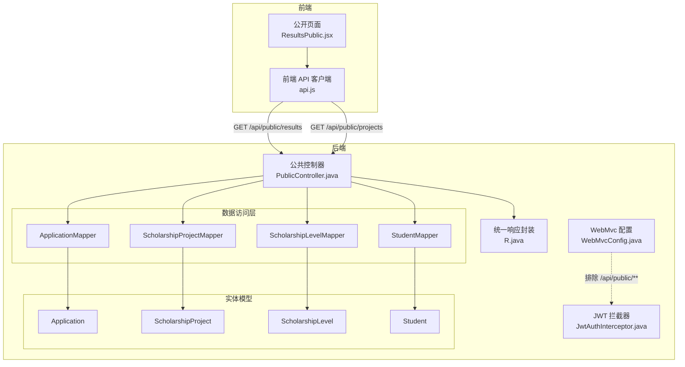
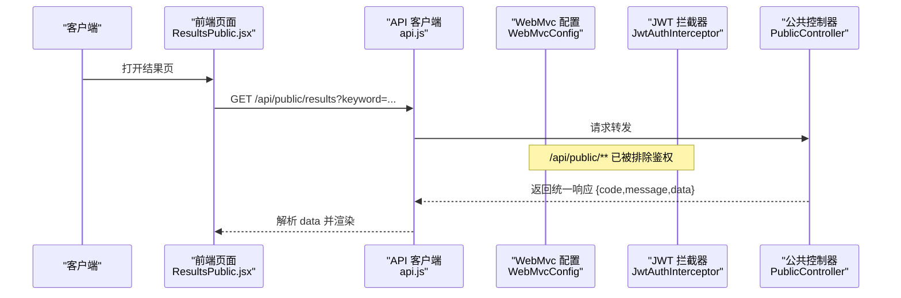
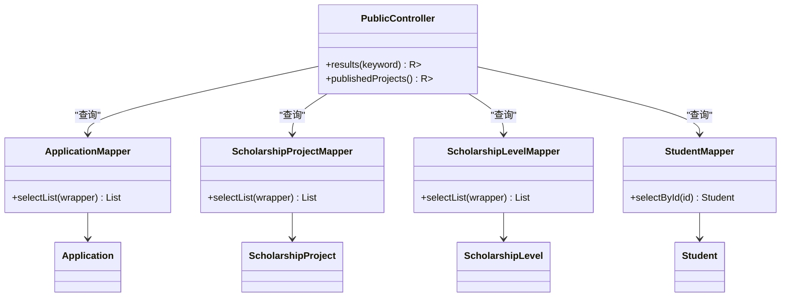
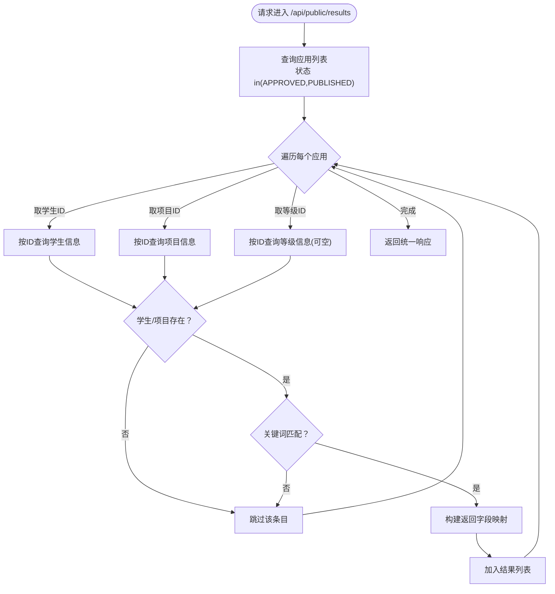
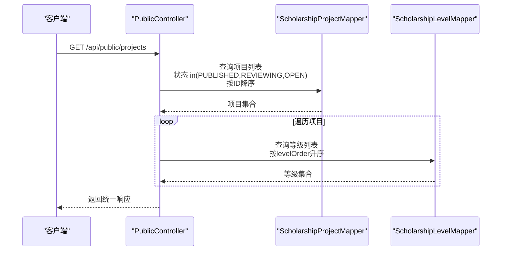
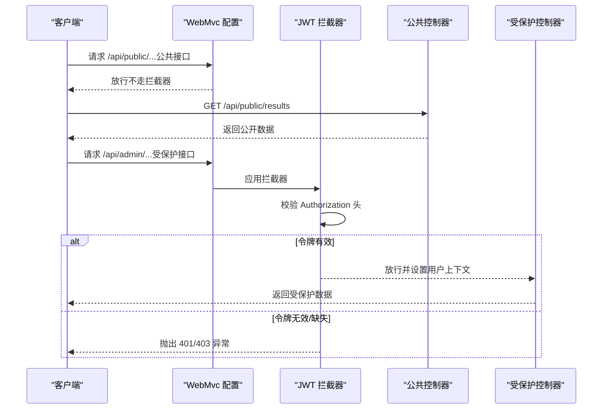
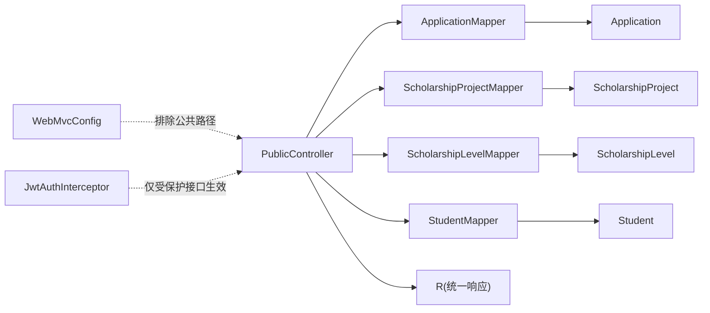

# 公共控制器

<cite>
**本文引用的文件**
- [PublicController.java](file://backend/src/main/java/com/zjsu/scholarship/controller/PublicController.java)
- [R.java](file://backend/src/main/java/com/zjsu/scholarship/common/R.java)
- [WebMvcConfig.java](file://backend/src/main/java/com/zjsu/scholarship/config/WebMvcConfig.java)
- [JwtAuthInterceptor.java](file://backend/src/main/java/com/zjsu/scholarship/security/JwtAuthInterceptor.java)
- [Application.java](file://backend/src/main/java/com/zjsu/scholarship/entity/Application.java)
- [ScholarshipProject.java](file://backend/src/main/java/com/zjsu/scholarship/entity/ScholarshipProject.java)
- [ScholarshipLevel.java](file://backend/src/main/java/com/zjsu/scholarship/entity/ScholarshipLevel.java)
- [Student.java](file://backend/src/main/java/com/zjsu/scholarship/entity/Student.java)
- [ApplicationMapper.java](file://backend/src/main/java/com/zjsu/scholarship/mapper/ApplicationMapper.java)
- [ScholarshipProjectMapper.java](file://backend/src/main/java/com/zjsu/scholarship/mapper/ScholarshipProjectMapper.java)
- [ScholarshipLevelMapper.java](file://backend/src/main/java/com/zjsu/scholarship/mapper/ScholarshipLevelMapper.java)
- [StudentMapper.java](file://backend/src/main/java/com/zjsu/scholarship/mapper/StudentMapper.java)
- [application.yml](file://backend/src/main/resources/application.yml)
- [ResultsPublic.jsx](file://frontend/src/pages/ResultsPublic.jsx)
- [api.js](file://frontend/src/api.js)
</cite>

## 目录
1. [简介](#简介)
2. [项目结构](#项目结构)
3. [核心组件](#核心组件)
4. [架构概览](#架构概览)
5. [详细组件分析](#详细组件分析)
6. [依赖分析](#依赖分析)
7. [性能考虑](#性能考虑)
8. [故障排查指南](#故障排查指南)
9. [结论](#结论)
10. [附录](#附录)

## 简介
本文件聚焦于系统中的公共控制器（PublicController），系统性阐述其设计理念与实现方式。PublicController 提供无需身份认证即可访问的公开接口，主要包括：
- 结果查询：支持关键词筛选，返回已批准/已发布的获奖学生信息（学号、姓名、学院、专业、项目名称、等级、金额、各分值与排名等）。
- 项目查询：返回处于“已发布/审核中/开放”状态的奖学金项目及其等级配置。

公共接口在安全上采用“零令牌”设计，与受保护接口通过拦截器排除策略实现清晰分离；在数据层面仅暴露必要字段，避免敏感信息泄露；在性能方面通过数据库层查询与简单内存聚合实现高效响应。本文还提供完整公开 API 文档、与受保护接口的差异对比、数据过滤机制、使用场景示例、缓存策略与安全建议。

## 项目结构
后端采用 Spring MVC + MyBatis-Plus 架构，公共控制器位于 controller 层，统一前缀为 /api/public；公共接口由 WebMvc 配置排除鉴权拦截，直接放行。

图表来源
- [WebMvcConfig.java:24-31](file://backend/src/main/java/com/zjsu/scholarship/config/WebMvcConfig.java#L24-L31)
- [JwtAuthInterceptor.java:20-58](file://backend/src/main/java/com/zjsu/scholarship/security/JwtAuthInterceptor.java#L20-L58)
- [PublicController.java:11-77](file://backend/src/main/java/com/zjsu/scholarship/controller/PublicController.java#L11-L77)
- [R.java:3-39](file://backend/src/main/java/com/zjsu/scholarship/common/R.java#L3-L39)

章节来源
- [WebMvcConfig.java:24-31](file://backend/src/main/java/com/zjsu/scholarship/config/WebMvcConfig.java#L24-L31)
- [PublicController.java:11-77](file://backend/src/main/java/com/zjsu/scholarship/controller/PublicController.java#L11-L77)

## 核心组件
- 公共控制器（PublicController）
  - 路径前缀：/api/public
  - 接口：
    - GET /api/public/results：查询已批准/已发布的获奖结果，支持关键词模糊匹配（学号、姓名、项目名称）。
    - GET /api/public/projects：查询处于“已发布/审核中/开放”的项目及对应等级列表。
- 统一响应封装（R）
  - 统一返回格式：{ code, message, data }，成功时 code=0，message="ok"。
- 数据访问层（Mappers）
  - ApplicationMapper、ScholarshipProjectMapper、ScholarshipLevelMapper、StudentMapper。
- 实体模型（Entities）
  - Application、ScholarshipProject、ScholarshipLevel、Student。

章节来源
- [PublicController.java:28-76](file://backend/src/main/java/com/zjsu/scholarship/controller/PublicController.java#L28-L76)
- [R.java:16-30](file://backend/src/main/java/com/zjsu/scholarship/common/R.java#L16-L30)
- [ApplicationMapper.java:1-8](file://backend/src/main/java/com/zjsu/scholarship/mapper/ApplicationMapper.java#L1-L8)
- [ScholarshipProjectMapper.java:1-8](file://backend/src/main/java/com/zjsu/scholarship/mapper/ScholarshipProjectMapper.java#L1-L8)
- [ScholarshipLevelMapper.java:1-8](file://backend/src/main/java/com/zjsu/scholarship/mapper/ScholarshipLevelMapper.java#L1-L8)
- [StudentMapper.java:1-8](file://backend/src/main/java/com/zjsu/scholarship/mapper/StudentMapper.java#L1-L8)

## 架构概览
公共接口与受保护接口通过拦截器排除策略实现严格分离：
- 受保护接口：需携带 Bearer Token，拦截器解析并校验 JWT，若无权限或令牌无效则抛出业务异常。
- 公共接口：在 WebMvc 配置中明确排除鉴权拦截，无需任何认证头即可访问。

图表来源
- [WebMvcConfig.java:24-31](file://backend/src/main/java/com/zjsu/scholarship/config/WebMvcConfig.java#L24-L31)
- [JwtAuthInterceptor.java:20-58](file://backend/src/main/java/com/zjsu/scholarship/security/JwtAuthInterceptor.java#L20-L58)
- [ResultsPublic.jsx:11](file://frontend/src/pages/ResultsPublic.jsx#L11)
- [api.js:10-16](file://frontend/src/api.js#L10-L16)

## 详细组件分析

### PublicController 类图

图表来源
- [PublicController.java:15-26](file://backend/src/main/java/com/zjsu/scholarship/controller/PublicController.java#L15-L26)
- [ApplicationMapper.java:1-8](file://backend/src/main/java/com/zjsu/scholarship/mapper/ApplicationMapper.java#L1-L8)
- [ScholarshipProjectMapper.java:1-8](file://backend/src/main/java/com/zjsu/scholarship/mapper/ScholarshipProjectMapper.java#L1-L8)
- [ScholarshipLevelMapper.java:1-8](file://backend/src/main/java/com/zjsu/scholarship/mapper/ScholarshipLevelMapper.java#L1-L8)
- [StudentMapper.java:1-8](file://backend/src/main/java/com/zjsu/scholarship/mapper/StudentMapper.java#L1-L8)
- [Application.java:14-42](file://backend/src/main/java/com/zjsu/scholarship/entity/Application.java#L14-L42)
- [ScholarshipProject.java:14-49](file://backend/src/main/java/com/zjsu/scholarship/entity/ScholarshipProject.java#L14-L49)
- [ScholarshipLevel.java:14-25](file://backend/src/main/java/com/zjsu/scholarship/entity/ScholarshipLevel.java#L14-L25)
- [Student.java:12-32](file://backend/src/main/java/com/zjsu/scholarship/entity/Student.java#L12-L32)

#### 结果查询接口（GET /api/public/results）
- 功能概述
  - 查询状态为“已批准/已发布”的申请记录，关联学生、项目与最终等级，组装必要字段返回。
  - 支持关键词模糊匹配（学号、姓名、项目名称），大小写不敏感。
- 关键处理逻辑
  - 过滤条件：应用状态 in(APPROVED, PUBLISHED)。
  - 关联查询：根据 studentId 获取学生信息，根据 projectId 获取项目信息，根据 finalLevelId 获取等级信息（可为空）。
  - 字段映射：仅返回对外展示所需字段，避免泄露内部细节。
  - 关键词过滤：对学号、姓名、项目名称进行包含匹配，若任一不匹配则跳过该条目。
- 返回结构
  - 使用统一响应封装，data 为数组，元素为包含上述字段的映射对象。
- 性能特征
  - 单表查询 + 内存聚合，复杂度近似 O(n)，n 为符合条件的应用数量。
  - 建议前端传入关键词以减少数据量，提升交互体验。

图表来源
- [PublicController.java:29-58](file://backend/src/main/java/com/zjsu/scholarship/controller/PublicController.java#L29-L58)

章节来源
- [PublicController.java:28-59](file://backend/src/main/java/com/zjsu/scholarship/controller/PublicController.java#L28-L59)

#### 项目查询接口（GET /api/public/projects）
- 功能概述
  - 查询状态为“已发布/审核中/开放”的项目，并附带该项目下的等级列表（按等级序号升序）。
- 关键处理逻辑
  - 过滤条件：项目状态 in(PUBLISHED, REVIEWING, OPEN)，按 ID 降序排列。
  - 对每个项目，查询其等级列表并按 levelOrder 升序排序。
- 返回结构
  - 使用统一响应封装，data 为数组，元素为 { project, levels } 的映射对象。

图表来源
- [PublicController.java:61-76](file://backend/src/main/java/com/zjsu/scholarship/controller/PublicController.java#L61-L76)

章节来源
- [PublicController.java:61-76](file://backend/src/main/java/com/zjsu/scholarship/controller/PublicController.java#L61-L76)

### 公共接口与受保护接口的差异
- 访问控制
  - 公共接口：在 WebMvc 配置中明确排除鉴权拦截，无需 Authorization 头。
  - 受保护接口：拦截器强制要求 Bearer Token，解析失败或角色不符将抛出异常。
- 安全考虑
  - 公共接口不涉及用户上下文，不读取 AuthContext，避免泄露用户信息。
  - 返回数据严格限定为对外展示字段，不包含隐私或内部细节。
- 认证流程对比

图表来源
- [WebMvcConfig.java:24-31](file://backend/src/main/java/com/zjsu/scholarship/config/WebMvcConfig.java#L24-L31)
- [JwtAuthInterceptor.java:20-58](file://backend/src/main/java/com/zjsu/scholarship/security/JwtAuthInterceptor.java#L20-L58)

章节来源
- [WebMvcConfig.java:24-31](file://backend/src/main/java/com/zjsu/scholarship/config/WebMvcConfig.java#L24-L31)
- [JwtAuthInterceptor.java:20-58](file://backend/src/main/java/com/zjsu/scholarship/security/JwtAuthInterceptor.java#L20-L58)

### 数据过滤机制
- 结果查询
  - 状态过滤：仅取 APPROVED/PUBLISHED。
  - 关键词过滤：对学号、姓名、项目名称执行包含匹配，任一不满足即剔除。
  - 等级信息：finalLevelId 可为空，此时等级名称/金额也为空。
- 项目查询
  - 状态过滤：PUBLISHED/REVIEWING/OPEN。
  - 等级排序：按 levelOrder 升序。

章节来源
- [PublicController.java:30-43](file://backend/src/main/java/com/zjsu/scholarship/controller/PublicController.java#L30-L43)
- [PublicController.java:63-72](file://backend/src/main/java/com/zjsu/scholarship/controller/PublicController.java#L63-L72)

### 使用场景示例
- 结果查询
  - 场景：学生或家长在校园网站查看获奖名单。
  - 前端调用：ResultsPublic.jsx 通过 api.js 发起 GET /api/public/results，支持 keyword 参数。
  - 响应处理：前端接收 data 数组并渲染表格。
- 项目查询
  - 场景：新生浏览可申报的奖学金项目与等级。
  - 前端调用：api.js 发起 GET /api/public/projects，渲染项目列表与等级信息。

章节来源
- [ResultsPublic.jsx:11](file://frontend/src/pages/ResultsPublic.jsx#L11)
- [api.js:10-16](file://frontend/src/api.js#L10-L16)

## 依赖分析
- 控制器依赖
  - PublicController 依赖四个 Mapper，分别用于应用、项目、等级、学生数据的查询。
- 实体依赖
  - Application、ScholarshipProject、ScholarshipLevel、Student 定义了数据模型与字段约束。
- 配置依赖
  - WebMvcConfig 将 /api/public/** 排除在鉴权拦截之外，确保公共接口可直接访问。
  - JwtAuthInterceptor 仅对受保护接口生效，负责令牌解析与角色校验。
- 统一响应
  - R 提供统一的响应包装，简化前后端契约。

图表来源
- [PublicController.java:15-26](file://backend/src/main/java/com/zjsu/scholarship/controller/PublicController.java#L15-L26)
- [WebMvcConfig.java:24-31](file://backend/src/main/java/com/zjsu/scholarship/config/WebMvcConfig.java#L24-L31)
- [JwtAuthInterceptor.java:20-58](file://backend/src/main/java/com/zjsu/scholarship/security/JwtAuthInterceptor.java#L20-L58)
- [R.java:3-39](file://backend/src/main/java/com/zjsu/scholarship/common/R.java#L3-L39)

章节来源
- [PublicController.java:15-26](file://backend/src/main/java/com/zjsu/scholarship/controller/PublicController.java#L15-L26)
- [WebMvcConfig.java:24-31](file://backend/src/main/java/com/zjsu/scholarship/config/WebMvcConfig.java#L24-L31)
- [JwtAuthInterceptor.java:20-58](file://backend/src/main/java/com/zjsu/scholarship/security/JwtAuthInterceptor.java#L20-L58)
- [R.java:3-39](file://backend/src/main/java/com/zjsu/scholarship/common/R.java#L3-L39)

## 性能考虑
- 查询路径
  - 结果查询：一次应用表查询 + n 次学生/项目/等级查询（n 为符合条件的应用数）。可通过关键词过滤显著降低 n。
  - 项目查询：一次项目查询 + n 次等级查询（n 为项目数）。项目数通常较小，整体开销可控。
- 缓存策略建议
  - 结果查询：对“已发布/已批准”的应用集合可引入短期缓存（如 5-10 分钟），结合状态变更事件失效。
  - 项目查询：对“已发布/审核中/开放”的项目列表可缓存，定期刷新。
  - 缓存键：基于状态与时间戳生成，避免脏读。
- 其他优化
  - 前端传入合理关键词，减少后端数据量。
  - 后端可考虑分页参数（当前版本未实现，后续可扩展）。
  - 数据库索引：为应用状态、项目状态、项目ID、等级序号建立合适索引以提升查询效率。

## 故障排查指南
- 401 未登录或令牌缺失
  - 现象：受保护接口返回 401。
  - 原因：请求缺少 Authorization 或格式不正确（非 Bearer）。
  - 处理：在请求头添加正确的 Bearer Token。
- 403 无权限访问
  - 现象：受保护接口返回 403。
  - 原因：令牌有效但角色不满足接口所需角色。
  - 处理：确认用户角色是否具备访问权限。
- 公共接口返回空数据
  - 现象：/api/public/results 或 /api/public/projects 返回空列表。
  - 原因：无符合条件的数据（状态未达到 APPROVED/PUBLISHED 或项目未处于目标状态）。
  - 处理：检查数据库状态字段与关键词输入。
- 前端无法访问公共接口
  - 现象：浏览器直接访问 /api/public/... 报 401。
  - 原因：WebMvc 配置误改导致公共路径也被拦截。
  - 处理：核对 WebMvcConfig 中排除路径配置。

章节来源
- [JwtAuthInterceptor.java:25-28](file://backend/src/main/java/com/zjsu/scholarship/security/JwtAuthInterceptor.java#L25-L28)
- [JwtAuthInterceptor.java:45-50](file://backend/src/main/java/com/zjsu/scholarship/security/JwtAuthInterceptor.java#L45-L50)
- [WebMvcConfig.java:24-31](file://backend/src/main/java/com/zjsu/scholarship/config/WebMvcConfig.java#L24-L31)

## 结论
PublicController 通过简洁的查询逻辑与严格的访问控制，实现了面向公众的稳定接口。其设计遵循“最小权限、最小暴露”的原则：无需认证、仅展示必要字段、严格过滤状态与关键词。配合 WebMvc 配置的拦截器排除策略，公共接口与受保护接口边界清晰。建议在生产环境引入短期缓存与数据库索引优化，进一步提升性能与稳定性。

## 附录

### 公开 API 文档

- 基础信息
  - 基础路径：/api/public
  - 认证：无需
  - 响应格式：统一响应封装 R，成功时 code=0，message="ok"，data 为具体数据。

- 接口定义

  - 结果查询
    - 方法与路径：GET /api/public/results
    - 查询参数：
      - keyword（可选）：关键词，支持学号、姓名、项目名称的包含匹配
    - 返回字段（data 为数组，每项字段说明）：
      - studentNo：学号
      - name：姓名
      - college：学院
      - major：专业
      - projectName：项目名称
      - levelName：等级名称（可能为空）
      - amount：等级金额（可能为空）
      - basicTotal：基本分快照
      - abilityTotal：能力分快照
      - basicRank：基本分排名快照
      - abilityRank：能力分排名快照
    - 示例请求：
      - GET /api/public/results?keyword=张三
    - 示例响应：
      - data：[{ studentNo, name, college, major, projectName, levelName, amount, basicTotal, abilityTotal, basicRank, abilityRank }, ...]

  - 项目查询
    - 方法与路径：GET /api/public/projects
    - 查询参数：无
    - 返回字段（data 为数组，每项字段说明）：
      - project：项目对象（包含项目基本信息）
      - levels：等级列表（按等级序号升序）
    - 示例请求：
      - GET /api/public/projects
    - 示例响应：
      - data：[{ project, levels }, ...]

- 与受保护接口的区别
  - 访问控制：公共接口无需 Authorization 头；受保护接口需要 Bearer Token。
  - 数据范围：公共接口仅返回对外展示字段；受保护接口可能包含更多内部信息。
  - 安全策略：公共接口不读取用户上下文，避免信息泄露；受保护接口依赖角色校验。

- 安全建议与最佳实践
  - 公共接口
    - 不在响应中包含任何用户身份信息或内部字段。
    - 使用关键词过滤减少数据量，避免全表扫描。
    - 对高频查询引入短期缓存，降低数据库压力。
  - 受保护接口
    - 严格校验 Authorization 头与角色注解。
    - 对关键操作增加审计日志。
  - 通用
    - 前端统一通过 api.js 发起请求，利用拦截器自动注入 Token（仅对受保护接口生效）。
    - 生产环境配置 HTTPS 与 CORS 白名单，防止跨域风险。

章节来源
- [PublicController.java:28-76](file://backend/src/main/java/com/zjsu/scholarship/controller/PublicController.java#L28-L76)
- [R.java:16-30](file://backend/src/main/java/com/zjsu/scholarship/common/R.java#L16-L30)
- [WebMvcConfig.java:24-31](file://backend/src/main/java/com/zjsu/scholarship/config/WebMvcConfig.java#L24-L31)
- [JwtAuthInterceptor.java:20-58](file://backend/src/main/java/com/zjsu/scholarship/security/JwtAuthInterceptor.java#L20-L58)
- [api.js:10-16](file://frontend/src/api.js#L10-L16)