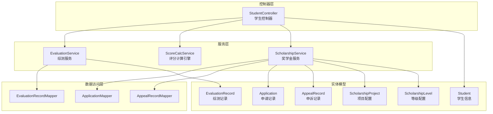
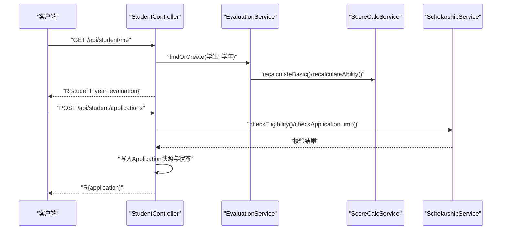
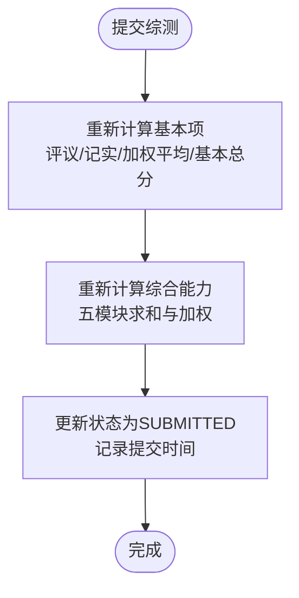
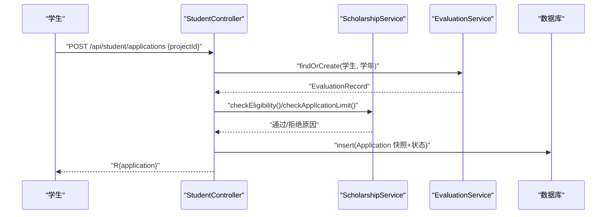
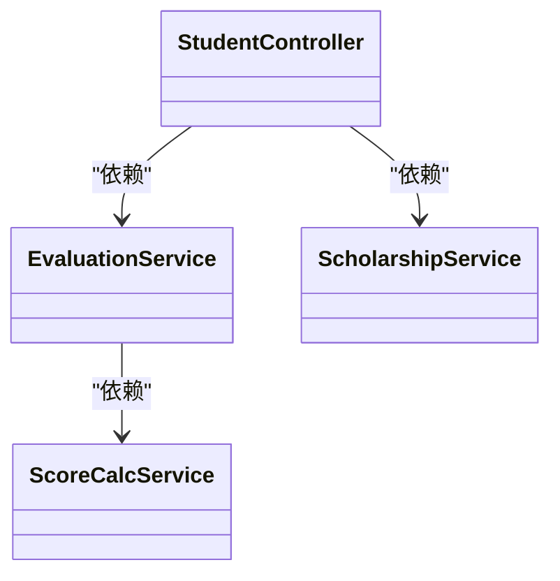
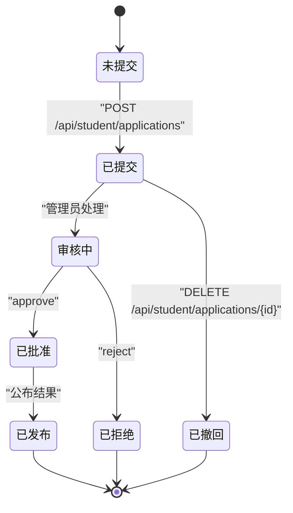

# 学生控制器

<cite>
**本文引用的文件**
- [StudentController.java](file://backend/src/main/java/com/zjsu/scholarship/controller/StudentController.java)
- [EvaluationService.java](file://backend/src/main/java/com/zjsu/scholarship/service/EvaluationService.java)
- [ScoreCalcService.java](file://backend/src/main/java/com/zjsu/scholarship/service/ScoreCalcService.java)
- [ScholarshipService.java](file://backend/src/main/java/com/zjsu/scholarship/service/ScholarshipService.java)
- [EvaluationRecord.java](file://backend/src/main/java/com/zjsu/scholarship/entity/EvaluationRecord.java)
- [Application.java](file://backend/src/main/java/com/zjsu/scholarship/entity/Application.java)
- [AppealRecord.java](file://backend/src/main/java/com/zjsu/scholarship/entity/AppealRecord.java)
- [Student.java](file://backend/src/main/java/com/zjsu/scholarship/entity/Student.java)
- [ScholarshipProject.java](file://backend/src/main/java/com/zjsu/scholarship/entity/ScholarshipProject.java)
- [ScholarshipLevel.java](file://backend/src/main/java/com/zjsu/scholarship/entity/ScholarshipLevel.java)
- [R.java](file://backend/src/main/java/com/zjsu/scholarship/common/R.java)
- [RequireRole.java](file://backend/src/main/java/com/zjsu/scholarship/security/RequireRole.java)
- [AuthContext.java](file://backend/src/main/java/com/zjsu/scholarship/security/AuthContext.java)
</cite>

## 目录
1. [简介](#简介)
2. [项目结构](#项目结构)
3. [核心组件](#核心组件)
4. [架构总览](#架构总览)
5. [详细组件分析](#详细组件分析)
6. [依赖分析](#依赖分析)
7. [性能考虑](#性能考虑)
8. [故障排查指南](#故障排查指南)
9. [结论](#结论)
10. [附录](#附录)

## 简介
本文件为“学生控制器”的权威技术文档，面向后端开发与产品/测试人员，系统化阐述学生端功能的接口设计与业务逻辑实现。重点覆盖以下模块：
- 个人信息与综测基础信息
- 综合测评（品德评议、品德记实、课程成绩、综合能力五模块）
- 奖学金申请与状态管理
- 成绩申诉与查询
- 结果查询与奖金金额计算
- 权限控制与数据验证规则
- 接口调用最佳实践与常见问题

## 项目结构
学生控制器位于后端 Java 工程中，采用 Spring Boot + MyBatis-Plus 架构，控制器层统一返回统一响应包装对象，业务层通过服务类完成复杂计算与规则校验。

图表来源
- [StudentController.java:1-719](file://backend/src/main/java/com/zjsu/scholarship/controller/StudentController.java#L1-L719)
- [EvaluationService.java:1-308](file://backend/src/main/java/com/zjsu/scholarship/service/EvaluationService.java#L1-L308)
- [ScoreCalcService.java:1-423](file://backend/src/main/java/com/zjsu/scholarship/service/ScoreCalcService.java#L1-L423)
- [ScholarshipService.java:1-280](file://backend/src/main/java/com/zjsu/scholarship/service/ScholarshipService.java#L1-L280)

章节来源
- [StudentController.java:22-86](file://backend/src/main/java/com/zjsu/scholarship/controller/StudentController.java#L22-L86)

## 核心组件
- 控制器：StudentController，基于注解鉴权，提供学生端全部业务接口。
- 服务层：
  - EvaluationService：负责综测记录的创建、计算与提交。
  - ScoreCalcService：负责评分计算引擎（品德、专业素质、综合能力五模块）。
  - ScholarshipService：负责奖学金资格判定、申请限制、考研申请、奖金计算。
- 实体与映射：EvaluationRecord、Application、AppealRecord、Student、ScholarshipProject、ScholarshipLevel 等。
- 统一响应：R<T>，封装 code、message、data 字段。

章节来源
- [R.java:1-39](file://backend/src/main/java/com/zjsu/scholarship/common/R.java#L1-L39)
- [RequireRole.java:1-13](file://backend/src/main/java/com/zjsu/scholarship/security/RequireRole.java#L1-L13)
- [AuthContext.java:1-20](file://backend/src/main/java/com/zjsu/scholarship/security/AuthContext.java#L1-L20)

## 架构总览
学生控制器采用“控制器-服务-数据访问-实体”分层架构，接口统一由控制器暴露，权限通过注解拦截器生效，业务逻辑集中在服务层，评分与规则通过独立服务类实现。

图表来源
- [StudentController.java:113-123](file://backend/src/main/java/com/zjsu/scholarship/controller/StudentController.java#L113-L123)
- [StudentController.java:549-589](file://backend/src/main/java/com/zjsu/scholarship/controller/StudentController.java#L549-L589)
- [EvaluationService.java:63-87](file://backend/src/main/java/com/zjsu/scholarship/service/EvaluationService.java#L63-L87)
- [ScholarshipService.java:223-240](file://backend/src/main/java/com/zjsu/scholarship/service/ScholarshipService.java#L223-L240)

## 详细组件分析

### 1. 个人信息与基础信息
- 接口：GET /api/student/me
  - 功能：返回当前学生、当前学年及对应的综测记录。
  - 权限：仅 STUDENT 可访问。
  - 数据来源：AuthContext 当前用户账号匹配 Student；查询 AcademicYear ACTIVE 最大学年；通过 EvaluationService 创建或获取 EvaluationRecord。
  - 返回：R{student, year, evaluation}

章节来源
- [StudentController.java:113-123](file://backend/src/main/java/com/zjsu/scholarship/controller/StudentController.java#L113-L123)
- [EvaluationService.java:63-87](file://backend/src/main/java/com/zjsu/scholarship/service/EvaluationService.java#L63-L87)

### 2. 综合测评数据加载与提交
- 接口：
  - GET /api/student/evaluation/items：加载综测填报所需全部数据（品德评议、品德记实、课程成绩、五模块能力项）
  - POST /api/student/evaluation/submit：提交综测，触发重新计算并锁定状态
- 权限与校验：
  - 当前必须存在 ACTIVE 学年；否则抛出异常。
  - 所有 CRUD 操作均通过 assertOwn 校验数据归属。
- 计算链路：
  - 品德：评议分（自评/学生代表/辅导员加权）、记实分（荣誉/处分/志愿等累加，有上限约束）、品德总分（评议×70% + 记实×30%）
  - 专业素质：课程加权平均分
  - 基本项：品德总分×30% + 专业素质×70%
  - 综合能力：75 + 五模块加权（研究创新30%+专业技能25%+组织工作15%+体育美育15%+劳动教育15%）

图表来源
- [StudentController.java:165-174](file://backend/src/main/java/com/zjsu/scholarship/controller/StudentController.java#L165-L174)
- [EvaluationService.java:91-184](file://backend/src/main/java/com/zjsu/scholarship/service/EvaluationService.java#L91-L184)
- [ScoreCalcService.java:28-178](file://backend/src/main/java/com/zjsu/scholarship/service/ScoreCalcService.java#L28-L178)
- [ScoreCalcService.java:405-414](file://backend/src/main/java/com/zjsu/scholarship/service/ScoreCalcService.java#L405-L414)

章节来源
- [StudentController.java:126-174](file://backend/src/main/java/com/zjsu/scholarship/controller/StudentController.java#L126-L174)
- [EvaluationService.java:91-184](file://backend/src/main/java/com/zjsu/scholarship/service/EvaluationService.java#L91-L184)
- [ScoreCalcService.java:28-178](file://backend/src/main/java/com/zjsu/scholarship/service/ScoreCalcService.java#L28-L178)

### 3. 品德评议与记实管理
- 品德评议 CRUD
  - POST /api/student/evaluation/appraisals：新增评议，自动计算六项维度总分并写入 total
  - PUT /api/student/evaluation/appraisals/{id}：更新评议，重算总分并触发基本项重算
- 品德记实 CRUD
  - POST /api/student/evaluation/moral-records：新增记实，默认状态 PENDING，自动计算增减分
  - PUT /api/student/evaluation/moral-records/{id}：更新记实，若已审核通过则禁止修改
  - DELETE /api/student/evaluation/moral-records/{id}：删除记实，已审核通过不可删
- 审核状态与规则
  - 新增/更新默认状态 PENDING，审核通过后不可再修改
  - 记实项增减分规则：志愿服务（按4小时为单位累加，额外2分封顶，单次最多10分）、处分按原始分负值、荣誉按级别赋分、集体荣誉单独累加上限

章节来源
- [StudentController.java:186-262](file://backend/src/main/java/com/zjsu/scholarship/controller/StudentController.java#L186-L262)
- [ScoreCalcService.java:62-125](file://backend/src/main/java/com/zjsu/scholarship/service/ScoreCalcService.java#L62-L125)

### 4. 综合能力五模块管理
- 研究创新（竞赛/论文/专利/项目）
  - 新增/更新默认状态 PENDING，审核通过不可改
  - 计算规则：基础分对照表 + 分类系数 + 合作系数（多人成果按系数折算，核心成员系数更低）
- 专业技能（英语/计算机/证书/入学考试）
  - CET4/CET6 按分数段赋分；计算机按等级；证书按高级/中级/初级赋分；入学考试固定加分
- 组织工作（岗位分+绩效分，按任期折算系数）
- 体育美育/劳动教育（按竞赛等级与团队角色折算）
- 删除能力项：统一入口 deleteAbilityItem，校验状态与归属，审核通过不可删

章节来源
- [StudentController.java:264-442](file://backend/src/main/java/com/zjsu/scholarship/controller/StudentController.java#L264-L442)
- [ScoreCalcService.java:184-371](file://backend/src/main/java/com/zjsu/scholarship/service/ScoreCalcService.java#L184-L371)

### 5. 奖学金申请与状态管理
- 查询可申请项目
  - GET /api/student/scholarships/eligible：返回项目、等级、预估等级、资格检查、已申请状态、综测记录
- 提交申请
  - POST /api/student/applications：校验项目开放状态、资格（含硬性条件、课程全过、无未解除处分、外语要求等）、申请限制（每类限报一项，除综合奖学金外）
  - 写入快照：basicTotal/basicRank/abilityTotal/abilityRank，状态 SUBMITTED
- 我的申请
  - GET /api/student/applications：返回申请列表，补充项目、自动等级、最终等级
- 撤回申请
  - DELETE /api/student/applications/{id}：仅 SUBMITTED 状态可撤回

图表来源
- [StudentController.java:516-589](file://backend/src/main/java/com/zjsu/scholarship/controller/StudentController.java#L516-L589)
- [ScholarshipService.java:223-240](file://backend/src/main/java/com/zjsu/scholarship/service/ScholarshipService.java#L223-L240)
- [EvaluationService.java:63-87](file://backend/src/main/java/com/zjsu/scholarship/service/EvaluationService.java#L63-L87)

章节来源
- [StudentController.java:516-620](file://backend/src/main/java/com/zjsu/scholarship/controller/StudentController.java#L516-L620)
- [ScholarshipService.java:223-240](file://backend/src/main/java/com/zjsu/scholarship/service/ScholarshipService.java#L223-L240)

### 6. 能力突出奖学金（P1）
- 查询资格
  - GET /api/student/ability-scholarship/eligibility：自动判定学习优秀奖（前20%）、综合能力突出奖（前20%）、研究创新奖（竞赛/论文），并提示每人限报一项
- 与综合奖学金互斥：若已获综合奖学金，则不符合能力突出奖学金申请条件

章节来源
- [StudentController.java:624-634](file://backend/src/main/java/com/zjsu/scholarship/controller/StudentController.java#L624-L634)
- [ScholarshipService.java:72-171](file://backend/src/main/java/com/zjsu/scholarship/service/ScholarshipService.java#L72-L171)

### 7. 考研奖学金（P1）
- 提交申请
  - POST /api/student/graduate-exam：本学年仅能提交一次；根据是否拟录取/面试资格自动定级
- 查询状态
  - GET /api/student/graduate-exam：返回申请记录与最终等级

章节来源
- [StudentController.java:638-661](file://backend/src/main/java/com/zjsu/scholarship/controller/StudentController.java#L638-L661)
- [ScholarshipService.java:177-210](file://backend/src/main/java/com/zjsu/scholarship/service/ScholarshipService.java#L177-L210)

### 8. 奖金查询（P1）
- GET /api/student/bonus-amount：计算应发奖金（综合/单项荣誉可同时获得，按最高额度发放）

章节来源
- [StudentController.java:665-676](file://backend/src/main/java/com/zjsu/scholarship/controller/StudentController.java#L665-L676)
- [ScholarshipService.java:260-278](file://backend/src/main/java/com/zjsu/scholarship/service/ScholarshipService.java#L260-L278)

### 9. 成绩申诉（P2）
- 提交申诉
  - POST /api/student/appeals：同一申请同一层级的申诉需等待处理完毕；支持 COLLEGE/UNIVERSITY 两级
- 我的申诉
  - GET /api/student/appeals：按时间倒序返回

章节来源
- [StudentController.java:680-717](file://backend/src/main/java/com/zjsu/scholarship/controller/StudentController.java#L680-L717)

### 10. 文件上传
- POST /api/student/upload：上传文件并返回访问 URL

章节来源
- [StudentController.java:177-183](file://backend/src/main/java/com/zjsu/scholarship/controller/StudentController.java#L177-L183)

## 依赖分析
- 控制器依赖：各 Mapper、EvaluationService、ScholarshipService、ScoreCalcService、FileStorageService、RankingService
- 服务间耦合：
  - StudentController 依赖 EvaluationService 与 ScholarshipService
  - EvaluationService 依赖 ScoreCalcService 完成评分计算
  - ScholarshipService 依赖 Application、ScholarshipProject、ScholarshipLevel、GraduateExamApplication 等实体与映射
- 权限控制：RequireRole("STUDENT") 注解确保仅学生角色可访问

图表来源
- [StudentController.java:27-86](file://backend/src/main/java/com/zjsu/scholarship/controller/StudentController.java#L27-L86)
- [EvaluationService.java:25-61](file://backend/src/main/java/com/zjsu/scholarship/service/EvaluationService.java#L25-L61)
- [ScoreCalcService.java:18-18](file://backend/src/main/java/com/zjsu/scholarship/service/ScoreCalcService.java#L18-L18)
- [ScholarshipService.java:22-49](file://backend/src/main/java/com/zjsu/scholarship/service/ScholarshipService.java#L22-L49)

章节来源
- [StudentController.java:27-86](file://backend/src/main/java/com/zjsu/scholarship/controller/StudentController.java#L27-L86)

## 性能考虑
- 评分计算集中于 ScoreCalcService，避免在控制器重复计算，提升复用性与一致性。
- 综测提交采用事务性重算，保证基本项与能力项数据一致性。
- 申请限制与资格检查在提交阶段一次性完成，减少后续流程分支判断成本。
- 建议：
  - 对批量查询（如我的申请）增加分页参数
  - 对评分计算结果进行缓存（如学年不变时可缓存快照）
  - 对文件上传路径与存储策略进行容量规划

## 故障排查指南
- 常见错误与定位
  - “学生档案未找到”：当前登录账号未绑定学生信息，检查 AuthContext 与 Student 映射
  - “当前没有有效学年”：AcademicYear ACTIVE 缺失，需后台维护学年状态
  - “无权操作他人数据”：assertOwn 校验失败，确认 EvaluationRecord.studentId 与当前学生匹配
  - “已审核通过的记录不可修改/删除”：moralRecordItem 与能力项 reviewStatus=APPROVED
  - “不符合申报条件/已申请过该项目”：资格检查或申请限制导致
- 统一响应
  - 所有接口返回 R<T>，code=0 表示成功，非0为业务异常；建议前端统一解析 message 并提示用户

章节来源
- [StudentController.java:89-110](file://backend/src/main/java/com/zjsu/scholarship/controller/StudentController.java#L89-L110)
- [StudentController.java:199-203](file://backend/src/main/java/com/zjsu/scholarship/controller/StudentController.java#L199-L203)
- [StudentController.java:555-574](file://backend/src/main/java/com/zjsu/scholarship/controller/StudentController.java#L555-L574)
- [R.java:16-30](file://backend/src/main/java/com/zjsu/scholarship/common/R.java#L16-L30)

## 结论
学生控制器以清晰的模块划分与严格的权限控制，实现了从综测填报到奖学金申请、申诉与结果查询的完整闭环。通过服务层的评分引擎与规则校验，保障了评分的准确性与公平性。建议在前端接入时遵循接口规范与错误码约定，并结合业务场景做好数据校验与用户体验优化。

## 附录

### A. 接口清单与规范
- 权限控制
  - 所有接口标注 RequireRole("STUDENT")，仅学生角色可访问
- 统一响应
  - 成功：code=0，message="ok"，data=具体数据
  - 失败：code≠0，message=错误描述
- 请求参数与响应结构
  - 详见各接口下方“请求参数”“响应数据结构”“错误码定义”

#### 个人信息与基础信息
- GET /api/student/me
  - 请求参数：无
  - 响应数据结构：R{student: Student, year: AcademicYear, evaluation: EvaluationRecord}
  - 错误码定义：无特殊业务错误，异常由全局处理器捕获

章节来源
- [StudentController.java:113-123](file://backend/src/main/java/com/zjsu/scholarship/controller/StudentController.java#L113-L123)

#### 综合测评数据加载
- GET /api/student/evaluation/items
  - 请求参数：无
  - 响应数据结构：R{
      evaluation: EvaluationRecord,
      appraisals: MoralAppraisal[],
      moralRecords: MoralRecordItem[],
      courses: CourseGrade[],
      riItems: ResearchInnovationItem[],
      psItems: ProfessionalSkillItem[],
      owItems: OrganizationWorkItem[],
      saItems: SportsAestheticsItem[],
      lpItems: LaborPracticeItem[]
    }
  - 错误码：无有效学年 → 业务异常

章节来源
- [StudentController.java:126-162](file://backend/src/main/java/com/zjsu/scholarship/controller/StudentController.java#L126-L162)

#### 提交综测
- POST /api/student/evaluation/submit
  - 请求参数：无
  - 响应数据结构：R{evaluation: EvaluationRecord}
  - 错误码：无有效学年 → 业务异常

章节来源
- [StudentController.java:165-174](file://backend/src/main/java/com/zjsu/scholarship/controller/StudentController.java#L165-L174)

#### 品德评议 CRUD
- POST /api/student/evaluation/appraisals
  - 请求参数：MoralAppraisal（不含 id，evaluationId 将由服务端注入）
  - 响应数据结构：R{MoralAppraisal}
  - 错误码：无
- PUT /api/student/evaluation/appraisals/{id}
  - 请求参数：MoralAppraisal（仅允许更新字段）
  - 响应数据结构：R{MoralAppraisal}
  - 错误码：记录不存在 → 业务异常；已审核通过 → 业务异常

章节来源
- [StudentController.java:186-212](file://backend/src/main/java/com/zjsu/scholarship/controller/StudentController.java#L186-L212)

#### 品德记实 CRUD
- POST /api/student/evaluation/moral-records
  - 请求参数：MoralRecordItem（不含 id，evaluationId 将由服务端注入）
  - 响应数据结构：R{MoralRecordItem}
  - 错误码：无
- PUT /api/student/evaluation/moral-records/{id}
  - 请求参数：MoralRecordItem
  - 响应数据结构：R{MoralRecordItem}
  - 错误码：记录不存在 → 业务异常；已审核通过 → 业务异常
- DELETE /api/student/evaluation/moral-records/{id}
  - 请求参数：无
  - 响应数据结构：R<void>
  - 错误码：记录不存在 → 成功（幂等）；已审核通过 → 业务异常

章节来源
- [StudentController.java:215-262](file://backend/src/main/java/com/zjsu/scholarship/controller/StudentController.java#L215-L262)

#### 研究创新 CRUD
- POST /api/student/evaluation/ri-items
- PUT /api/student/evaluation/ri-items/{id}
- DELETE /api/student/evaluation/ri-items/{id}
  - 请求参数：对应实体（新增不含 id，更新需 id）
  - 响应数据结构：R{实体}
  - 错误码：记录不存在 → 业务异常；已审核通过 → 业务异常

章节来源
- [StudentController.java:264-278](file://backend/src/main/java/com/zjsu/scholarship/controller/StudentController.java#L264-L278)
- [StudentController.java:482-513](file://backend/src/main/java/com/zjsu/scholarship/controller/StudentController.java#L482-L513)

#### 专业技能 CRUD
- POST /api/student/evaluation/ps-items
- PUT /api/student/evaluation/ps-items/{id}
- DELETE /api/student/evaluation/ps-items/{id}
  - 请求参数：对应实体
  - 响应数据结构：R{实体}
  - 错误码：记录不存在 → 业务异常；已审核通过 → 业务异常

章节来源
- [StudentController.java:281-319](file://backend/src/main/java/com/zjsu/scholarship/controller/StudentController.java#L281-L319)

#### 组织工作 CRUD
- POST /api/student/evaluation/ow-items
- PUT /api/student/evaluation/ow-items/{id}
- DELETE /api/student/evaluation/ow-items/{id}
  - 请求参数：对应实体
  - 响应数据结构：R{实体}
  - 错误码：记录不存在 → 业务异常；已审核通过 → 业务异常

章节来源
- [StudentController.java:322-360](file://backend/src/main/java/com/zjsu/scholarship/controller/StudentController.java#L322-L360)

#### 体育美育 CRUD
- POST /api/student/evaluation/sa-items
- PUT /api/student/evaluation/sa-items/{id}
- DELETE /api/student/evaluation/sa-items/{id}
  - 请求参数：对应实体
  - 响应数据结构：R{实体}
  - 错误码：记录不存在 → 业务异常；已审核通过 → 业务异常

章节来源
- [StudentController.java:363-401](file://backend/src/main/java/com/zjsu/scholarship/controller/StudentController.java#L363-L401)

#### 劳动教育 CRUD
- POST /api/student/evaluation/lp-items
- PUT /api/student/evaluation/lp-items/{id}
- DELETE /api/student/evaluation/lp-items/{id}
  - 请求参数：对应实体
  - 响应数据结构：R{实体}
  - 错误码：记录不存在 → 业务异常；已审核通过 → 业务异常

章节来源
- [StudentController.java:404-442](file://backend/src/main/java/com/zjsu/scholarship/controller/StudentController.java#L404-L442)

#### 奖学金申请
- GET /api/student/scholarships/eligible
  - 请求参数：无
  - 响应数据结构：R{List[{
      project: ScholarshipProject,
      levels: ScholarshipLevel[],
      recommendLevelId: Long,
      eligibilityCheck: String,
      application: Application,
      evaluation: EvaluationRecord
    }]}
- POST /api/student/applications
  - 请求参数：{projectId: Number}
  - 响应数据结构：R{Application}
  - 错误码：项目不存在/不在申报期 → 业务异常；已申请过 → 业务异常；不符合条件 → 业务异常；超限 → 业务异常
- GET /api/student/applications
  - 请求参数：无
  - 响应数据结构：R[List[{
      application: Application,
      project: ScholarshipProject,
      autoLevel: ScholarshipLevel,
      finalLevel: ScholarshipLevel
    }]]
- DELETE /api/student/applications/{id}
  - 请求参数：无
  - 响应数据结构：R<void>
  - 错误码：申请不存在/非本人/非SUBMITTED → 业务异常

章节来源
- [StudentController.java:516-620](file://backend/src/main/java/com/zjsu/scholarship/controller/StudentController.java#L516-L620)

#### 能力突出奖学金
- GET /api/student/ability-scholarship/eligibility
  - 请求参数：无
  - 响应数据结构：R{eligibility: AbilityEligibility, student: Student}

章节来源
- [StudentController.java:624-634](file://backend/src/main/java/com/zjsu/scholarship/controller/StudentController.java#L624-L634)

#### 考研奖学金
- POST /api/student/graduate-exam
  - 请求参数：GraduateExamApplication
  - 响应数据结构：R{GraduateExamApplication}
  - 错误码：本学年已提交 → 业务异常
- GET /api/student/graduate-exam
  - 请求参数：无
  - 响应数据结构：R{application: GraduateExamApplication, student: Student}

章节来源
- [StudentController.java:638-661](file://backend/src/main/java/com/zjsu/scholarship/controller/StudentController.java#L638-L661)

#### 奖金查询
- GET /api/student/bonus-amount
  - 请求参数：无
  - 响应数据结构：R{amount: BigDecimal, message: String}

章节来源
- [StudentController.java:665-676](file://backend/src/main/java/com/zjsu/scholarship/controller/StudentController.java#L665-L676)

#### 成绩申诉
- POST /api/student/appeals
  - 请求参数：{applicationId: Number, projectId: Number, appealLevel: "COLLEGE"|"UNIVERSITY", reason: String}
  - 响应数据结构：R{AppealRecord}
  - 错误码：存在在处理中申诉 → 业务异常
- GET /api/student/appeals
  - 请求参数：无
  - 响应数据结构：R<List<AppealRecord>>

章节来源
- [StudentController.java:680-717](file://backend/src/main/java/com/zjsu/scholarship/controller/StudentController.java#L680-L717)

#### 文件上传
- POST /api/student/upload
  - 请求参数：file: MultipartFile
  - 响应数据结构：R{url: String}

章节来源
- [StudentController.java:177-183](file://backend/src/main/java/com/zjsu/scholarship/controller/StudentController.java#L177-L183)

### B. 数据模型与字段说明
- EvaluationRecord（综测记录）
  - 关键字段：moralAppraisalScore、moralRecordScore、moralTotal、academicWeightedAvg、basicTotal、basicRank、abilityBase、abilityTotal、abilityRank、status、submittedAt
- Application（申请记录）
  - 关键字段：studentId、projectId、evaluationId、snapshotBasicTotal、snapshotBasicRank、snapshotAbilityTotal、snapshotAbilityRank、autoLevelId、finalLevelId、status、rejectReason、submittedAt、reviewedAt、reviewerId、applicationCategory
- AppealRecord（申诉记录）
  - 关键字段：applicationId、studentId、projectId、appealLevel、reason、status、response、submittedAt、respondedAt
- Student（学生信息）
  - 关键字段：studentNo、name、gender、college、major、grade、className、cet4Score、cet6Score、peScore、laborEvaluation、peExempt
- ScholarshipProject（项目配置）
  - 关键字段：typeCode、projectName、description、applyStartAt、applyEndAt、status、ranked、minWeightedAvg、minPeScore、needLaborPass、foreignLangRequirement、noDiscipline、foreignLangAvgMin、foreignLangAvgFirst、requireCet4Pass、rankBasicMaxRatio、rankAbilityFirst、rankBasicFirst
- ScholarshipLevel（等级配置）
  - 关键字段：projectId、levelName、levelOrder、ratio、amount、quota、rankBasicMaxRatio、rankAbilityMaxRatio

章节来源
- [EvaluationRecord.java:1-45](file://backend/src/main/java/com/zjsu/scholarship/entity/EvaluationRecord.java#L1-L45)
- [Application.java:1-43](file://backend/src/main/java/com/zjsu/scholarship/entity/Application.java#L1-L43)
- [AppealRecord.java:1-27](file://backend/src/main/java/com/zjsu/scholarship/entity/AppealRecord.java#L1-L27)
- [Student.java:1-33](file://backend/src/main/java/com/zjsu/scholarship/entity/Student.java#L1-L33)
- [ScholarshipProject.java:1-50](file://backend/src/main/java/com/zjsu/scholarship/entity/ScholarshipProject.java#L1-L50)
- [ScholarshipLevel.java:1-26](file://backend/src/main/java/com/zjsu/scholarship/entity/ScholarshipLevel.java#L1-L26)

### C. 权限控制与鉴权机制
- 控制器层：@RequireRole("STUDENT") 限定角色
- 上下文：AuthContext.CurrentUser 提供 userId、account、role、name
- 数据归属：assertOwn 校验 EvaluationRecord.studentId 与当前学生一致

章节来源
- [RequireRole.java:8-12](file://backend/src/main/java/com/zjsu/scholarship/security/RequireRole.java#L8-L12)
- [AuthContext.java:10-18](file://backend/src/main/java/com/zjsu/scholarship/security/AuthContext.java#L10-L18)
- [StudentController.java:104-110](file://backend/src/main/java/com/zjsu/scholarship/controller/StudentController.java#L104-L110)

### D. 业务流程图示例
- 申请状态流转（简化）

图表来源
- [Application.java:34-42](file://backend/src/main/java/com/zjsu/scholarship/entity/Application.java#L34-L42)
- [StudentController.java:591-620](file://backend/src/main/java/com/zjsu/scholarship/controller/StudentController.java#L591-L620)