# 控制器层设计

<cite>
**本文档引用的文件**
- [AuthController.java](file://backend/src/main/java/com/zjsu/scholarship/controller/AuthController.java)
- [StudentController.java](file://backend/src/main/java/com/zjsu/scholarship/controller/StudentController.java)
- [CounselorController.java](file://backend/src/main/java/com/zjsu/scholarship/controller/CounselorController.java)
- [AdminController.java](file://backend/src/main/java/com/zjsu/scholarship/controller/AdminController.java)
- [PublicController.java](file://backend/src/main/java/com/zjsu/scholarship/controller/PublicController.java)
- [RequireRole.java](file://backend/src/main/java/com/zjsu/scholarship/security/RequireRole.java)
- [JwtAuthInterceptor.java](file://backend/src/main/java/com/zjsu/scholarship/security/JwtAuthInterceptor.java)
- [AuthContext.java](file://backend/src/main/java/com/zjsu/scholarship/security/AuthContext.java)
- [R.java](file://backend/src/main/java/com/zjsu/scholarship/common/R.java)
- [GlobalExceptionHandler.java](file://backend/src/main/java/com/zjsu/scholarship/common/GlobalExceptionHandler.java)
- [AuthService.java](file://backend/src/main/java/com/zjsu/scholarship/service/AuthService.java)
- [EvaluationService.java](file://backend/src/main/java/com/zjsu/scholarship/service/EvaluationService.java)
- [WebMvcConfig.java](file://backend/src/main/java/com/zjsu/scholarship/config/WebMvcConfig.java)
- [application.yml](file://backend/src/main/resources/application.yml)
</cite>

## 目录
1. [引言](#引言)
2. [项目结构](#项目结构)
3. [核心组件](#核心组件)
4. [架构概览](#架构概览)
5. [详细组件分析](#详细组件分析)
6. [依赖分析](#依赖分析)
7. [性能考虑](#性能考虑)
8. [故障排除指南](#故障排除指南)
9. [结论](#结论)

## 引言

奖学金管理系统采用经典的MVC架构模式，控制器层作为系统的核心入口，负责处理HTTP请求、参数验证、业务调度和响应返回。本设计文档深入分析了五个核心控制器的架构模式和实现细节，包括AuthController（用户认证）、StudentController（学生端业务）、CounselorController（辅导员功能）、AdminController（管理员操作）和PublicController（公开接口）。

系统采用Spring Boot框架，结合JWT令牌认证机制，实现了完整的权限控制和统一响应格式。控制器层通过依赖注入与Service层交互，确保了清晰的职责分离和良好的可维护性。

## 项目结构

奖学金管理系统的控制器层位于`backend/src/main/java/com/zjsu/scholarship/controller/`目录下，采用按功能模块划分的组织方式：

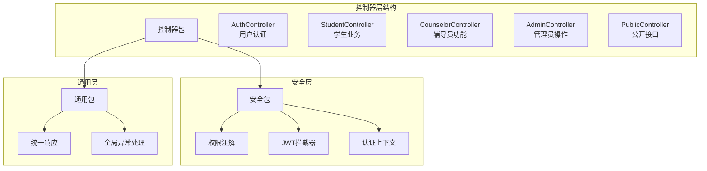

**图表来源**
- [AuthController.java:1-44](file://backend/src/main/java/com/zjsu/scholarship/controller/AuthController.java#L1-L44)
- [StudentController.java:1-719](file://backend/src/main/java/com/zjsu/scholarship/controller/StudentController.java#L1-L719)
- [CounselorController.java:1-391](file://backend/src/main/java/com/zjsu/scholarship/controller/CounselorController.java#L1-L391)
- [AdminController.java:1-528](file://backend/src/main/java/com/zjsu/scholarship/controller/AdminController.java#L1-L528)
- [PublicController.java:1-78](file://backend/src/main/java/com/zjsu/scholarship/controller/PublicController.java#L1-L78)

**章节来源**
- [AuthController.java:1-44](file://backend/src/main/java/com/zjsu/scholarship/controller/AuthController.java#L1-L44)
- [StudentController.java:1-719](file://backend/src/main/java/com/zjsu/scholarship/controller/StudentController.java#L1-L719)
- [CounselorController.java:1-391](file://backend/src/main/java/com/zjsu/scholarship/controller/CounselorController.java#L1-L391)
- [AdminController.java:1-528](file://backend/src/main/java/com/zjsu/scholarship/controller/AdminController.java#L1-L528)
- [PublicController.java:1-78](file://backend/src/main/java/com/zjsu/scholarship/controller/PublicController.java#L1-L78)

## 核心组件

### 控制器架构模式

系统采用RESTful API设计模式，每个控制器都遵循统一的架构模式：

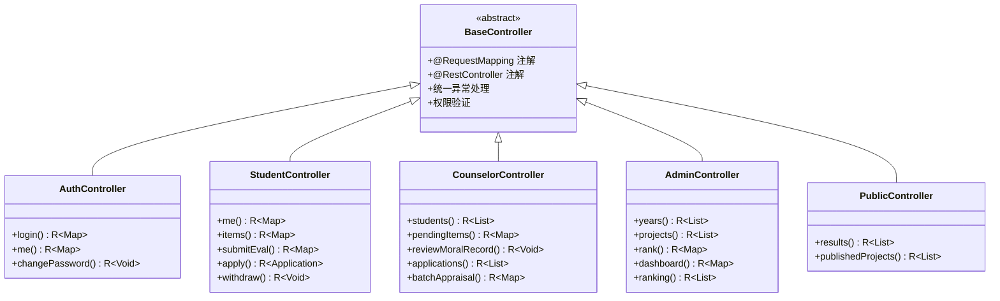

**图表来源**
- [AuthController.java:11-44](file://backend/src/main/java/com/zjsu/scholarship/controller/AuthController.java#L11-L44)
- [StudentController.java:22-86](file://backend/src/main/java/com/zjsu/scholarship/controller/StudentController.java#L22-L86)
- [CounselorController.java:18-65](file://backend/src/main/java/com/zjsu/scholarship/controller/CounselorController.java#L18-L65)
- [AdminController.java:20-61](file://backend/src/main/java/com/zjsu/scholarship/controller/AdminController.java#L20-L61)
- [PublicController.java:11-26](file://backend/src/main/java/com/zjsu/scholarship/controller/PublicController.java#L11-L26)

### 权限控制机制

系统通过自定义注解`@RequireRole`实现基于角色的访问控制：

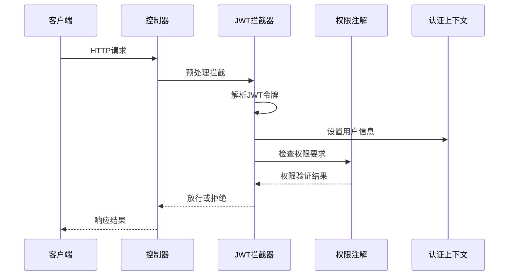

**图表来源**
- [JwtAuthInterceptor.java:20-58](file://backend/src/main/java/com/zjsu/scholarship/security/JwtAuthInterceptor.java#L20-L58)
- [RequireRole.java:8-12](file://backend/src/main/java/com/zjsu/scholarship/security/RequireRole.java#L8-L12)
- [AuthContext.java:3-18](file://backend/src/main/java/com/zjsu/scholarship/security/AuthContext.java#L3-L18)

**章节来源**
- [RequireRole.java:1-13](file://backend/src/main/java/com/zjsu/scholarship/security/RequireRole.java#L1-L13)
- [JwtAuthInterceptor.java:1-65](file://backend/src/main/java/com/zjsu/scholarship/security/JwtAuthInterceptor.java#L1-L65)
- [AuthContext.java:1-20](file://backend/src/main/java/com/zjsu/scholarship/security/AuthContext.java#L1-L20)

## 架构概览

### MVC架构模式

系统采用经典的MVC架构模式，控制器层作为View和Model之间的协调者：

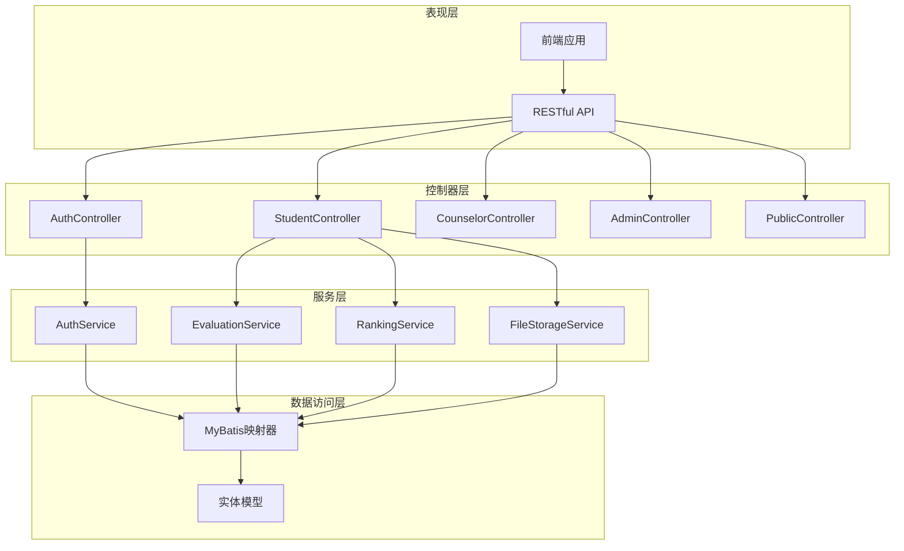

**图表来源**
- [AuthController.java:15-19](file://backend/src/main/java/com/zjsu/scholarship/controller/AuthController.java#L15-L19)
- [StudentController.java:48-85](file://backend/src/main/java/com/zjsu/scholarship/controller/StudentController.java#L48-L85)
- [AuthService.java:16-30](file://backend/src/main/java/com/zjsu/scholarship/service/AuthService.java#L16-L30)
- [EvaluationService.java:22-48](file://backend/src/main/java/com/zjsu/scholarship/service/EvaluationService.java#L22-L48)

### 统一响应格式

系统采用统一的响应格式`R<T>`，确保所有API响应的一致性：

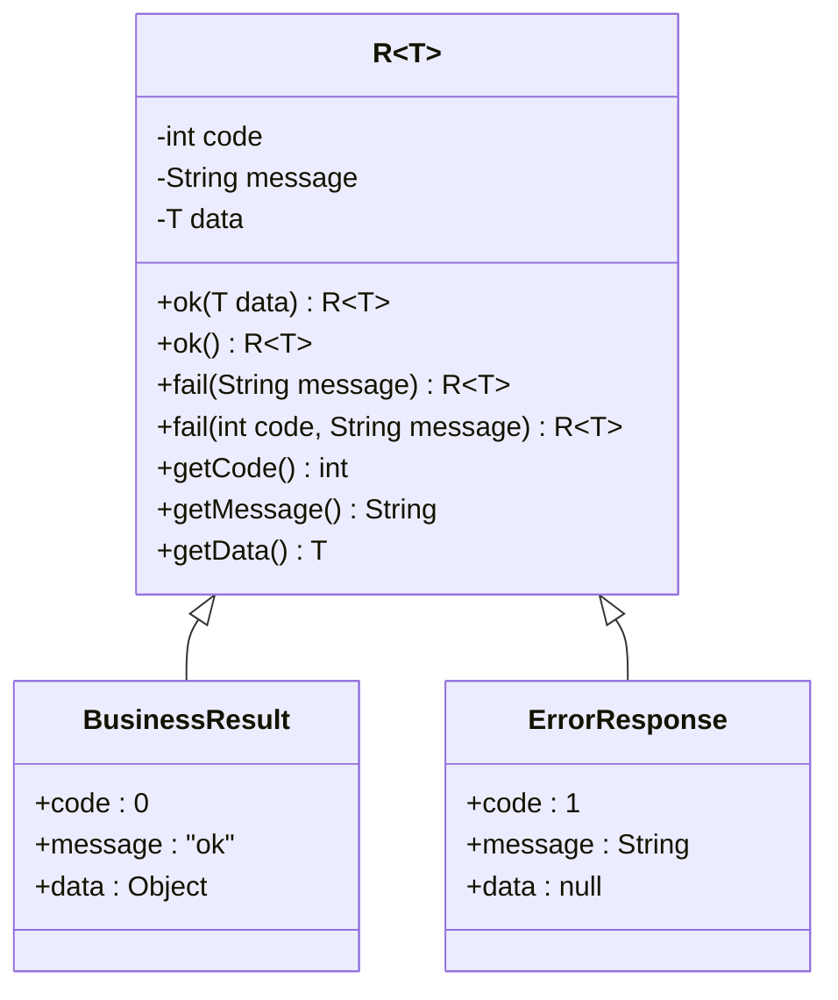

**图表来源**
- [R.java:3-39](file://backend/src/main/java/com/zjsu/scholarship/common/R.java#L3-L39)

**章节来源**
- [R.java:1-39](file://backend/src/main/java/com/zjsu/scholarship/common/R.java#L1-L39)
- [GlobalExceptionHandler.java:1-23](file://backend/src/main/java/com/zjsu/scholarship/common/GlobalExceptionHandler.java#L1-L23)

## 详细组件分析

### AuthController - 用户认证控制器

AuthController负责处理用户认证相关的所有接口，是系统安全体系的核心入口。

#### 核心功能边界

| 接口 | 方法 | 路径 | 权限 | 功能描述 |
|------|------|------|------|----------|
| 登录 | POST | `/api/auth/login` | 无 | 用户身份验证，生成JWT令牌 |
| 当前用户 | GET | `/api/auth/me` | STUDENT/COUNSELOR/ADMIN | 获取当前登录用户信息 |
| 修改密码 | POST | `/api/auth/change-password` | STUDENT/COUNSELOR/ADMIN | 更新用户密码 |

#### 请求处理流程

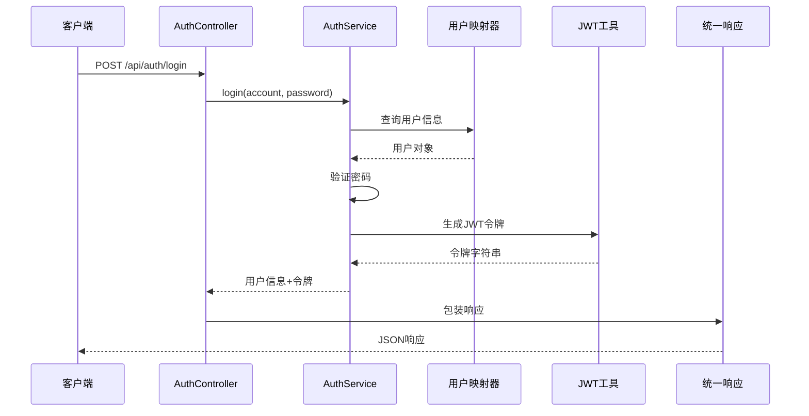

**图表来源**
- [AuthController.java:21-24](file://backend/src/main/java/com/zjsu/scholarship/controller/AuthController.java#L21-L24)
- [AuthService.java:32-55](file://backend/src/main/java/com/zjsu/scholarship/service/AuthService.java#L32-L55)

#### 参数验证策略

AuthController采用简单直接的参数验证方式：
- 使用`@RequestBody Map<String, String>`接收JSON参数
- 在Service层进行详细的业务逻辑验证
- 通过`BusinessException`抛出业务异常

**章节来源**
- [AuthController.java:1-44](file://backend/src/main/java/com/zjsu/scholarship/controller/AuthController.java#L1-L44)
- [AuthService.java:1-77](file://backend/src/main/java/com/zjsu/scholarship/service/AuthService.java#L1-L77)

### StudentController - 学生业务控制器

StudentController是系统最复杂的控制器，涵盖了学生从基本信息到奖学金申请的完整业务流程。

#### 核心功能模块

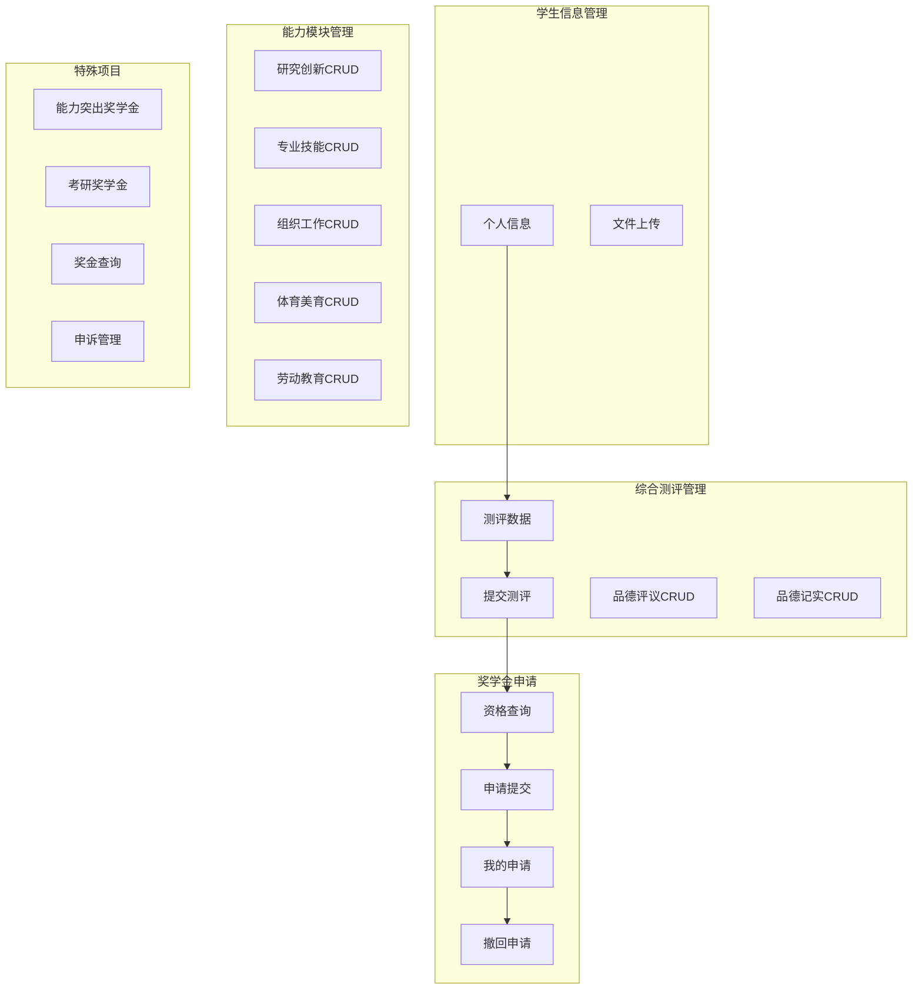

**图表来源**
- [StudentController.java:113-183](file://backend/src/main/java/com/zjsu/scholarship/controller/StudentController.java#L113-L183)
- [StudentController.java:186-480](file://backend/src/main/java/com/zjsu/scholarship/controller/StudentController.java#L186-L480)
- [StudentController.java:515-718](file://backend/src/main/java/com/zjsu/scholarship/controller/StudentController.java#L515-L718)

#### 数据流处理

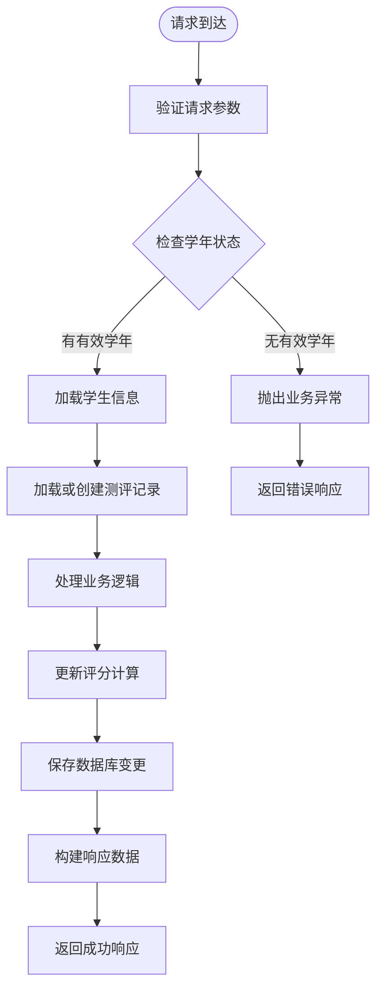

**图表来源**
- [StudentController.java:166-174](file://backend/src/main/java/com/zjsu/scholarship/controller/StudentController.java#L166-L174)
- [StudentController.java:186-197](file://backend/src/main/java/com/zjsu/scholarship/controller/StudentController.java#L186-L197)

#### 权限控制机制

StudentController使用`@RequireRole("STUDENT")`注解确保只有学生角色可以访问：

```java
@RestController
@RequestMapping("/api/student")
@RequireRole("STUDENT")
public class StudentController {
    // 学生专属业务逻辑
}
```

**章节来源**
- [StudentController.java:1-719](file://backend/src/main/java/com/zjsu/scholarship/controller/StudentController.java#L1-L719)

### CounselorController - 辅导员功能控制器

CounselorController为辅导员和管理员提供综合评审和管理功能。

#### 核心管理功能

| 功能模块 | 主要接口 | 描述 |
|----------|----------|------|
| 学生管理 | `GET /api/counselor/students` | 查询学生列表及测评状态 |
| 待审核项目 | `GET /api/counselor/items/pending` | 查看待审核的各类能力项目 |
| 项目审核 | `POST /api/counselor/items/*/review` | 审核品德记实和能力项目 |
| 申请管理 | `GET /api/counselor/applications` | 查看申请列表 |
| 批量审核 | `POST /api/counselor/applications/batch-review` | 批量批准申请 |
| 批量评议 | `POST /api/counselor/batch-appraisal` | 批量进行品德评议 |

#### 审核流程

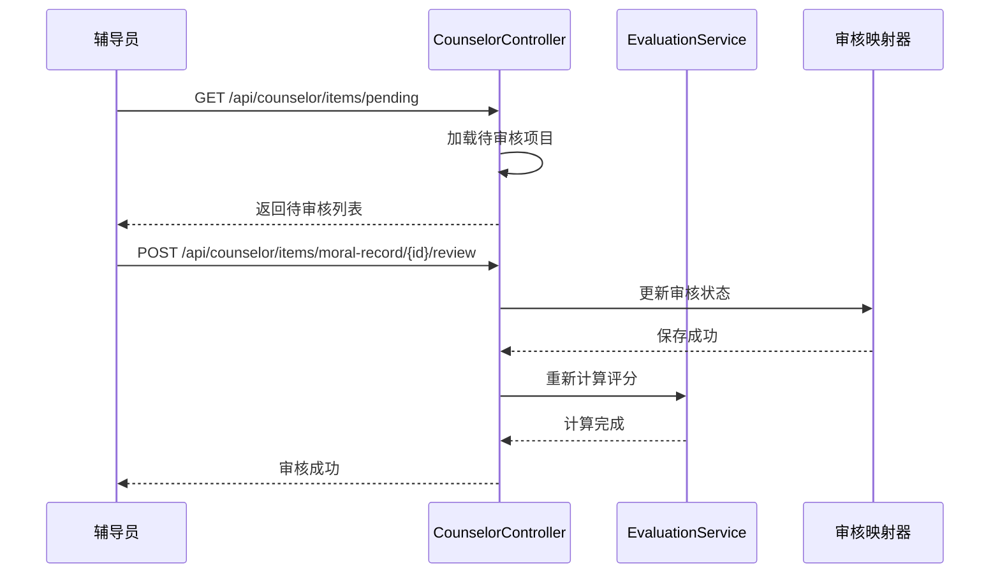

**图表来源**
- [CounselorController.java:91-135](file://backend/src/main/java/com/zjsu/scholarship/controller/CounselorController.java#L91-L135)
- [CounselorController.java:160-170](file://backend/src/main/java/com/zjsu/scholarship/controller/CounselorController.java#L160-L170)

**章节来源**
- [CounselorController.java:1-391](file://backend/src/main/java/com/zjsu/scholarship/controller/CounselorController.java#L1-L391)

### AdminController - 管理员操作控制器

AdminController为管理员提供系统管理和数据维护功能。

#### 系统管理功能

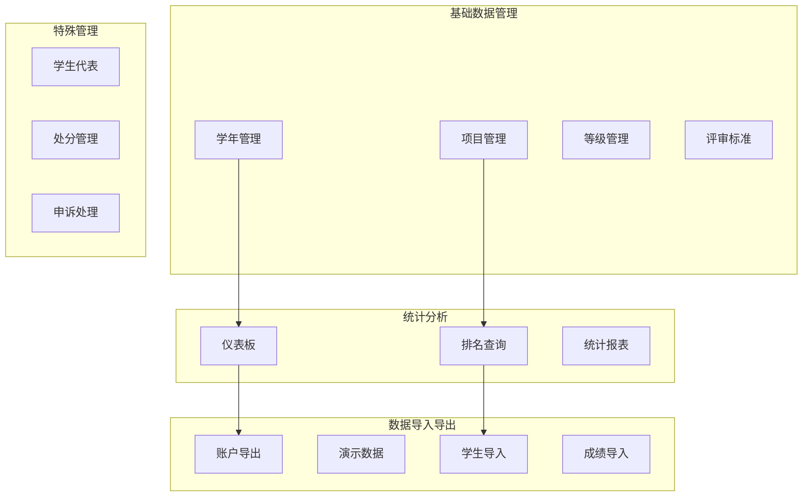

**图表来源**
- [AdminController.java:63-160](file://backend/src/main/java/com/zjsu/scholarship/controller/AdminController.java#L63-L160)
- [AdminController.java:177-210](file://backend/src/main/java/com/zjsu/scholarship/controller/AdminController.java#L177-L210)
- [AdminController.java:267-314](file://backend/src/main/java/com/zjsu/scholarship/controller/AdminController.java#L267-L314)

#### 排名计算流程

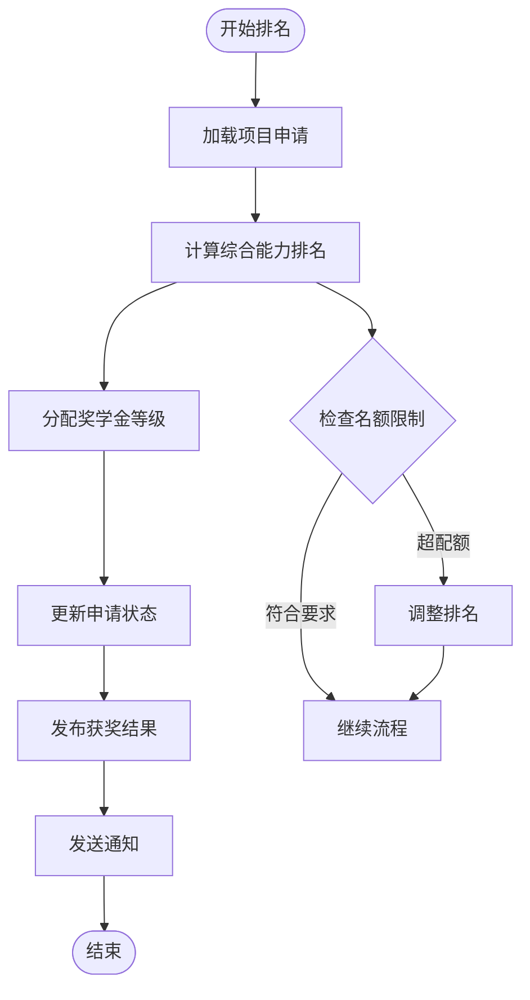

**图表来源**
- [AdminController.java:156-175](file://backend/src/main/java/com/zjsu/scholarship/controller/AdminController.java#L156-L175)

**章节来源**
- [AdminController.java:1-528](file://backend/src/main/java/com/zjsu/scholarship/controller/AdminController.java#L1-L528)

### PublicController - 公开接口控制器

PublicController提供无需认证即可访问的公开信息接口。

#### 公开信息功能

| 接口 | 方法 | 路径 | 功能描述 |
|------|------|------|----------|
| 获奖结果 | GET | `/api/public/results` | 查询获奖学生信息 |
| 项目信息 | GET | `/api/public/projects` | 获取公开的奖学金项目信息 |
| 关键字搜索 | GET | `/api/public/results` | 支持关键字模糊搜索 |

#### 数据过滤机制

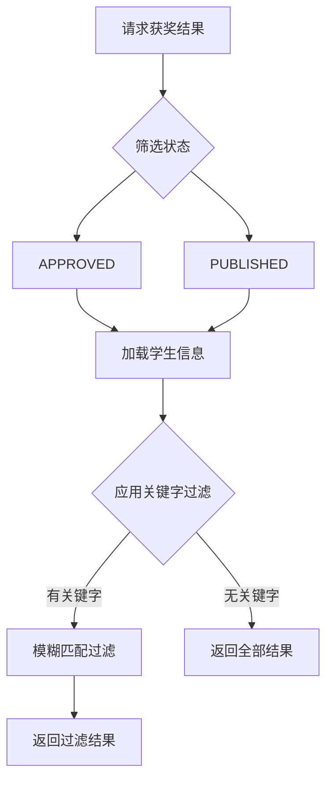

**图表来源**
- [PublicController.java:28-59](file://backend/src/main/java/com/zjsu/scholarship/controller/PublicController.java#L28-L59)

**章节来源**
- [PublicController.java:1-78](file://backend/src/main/java/com/zjsu/scholarship/controller/PublicController.java#L1-L78)

## 依赖分析

### 控制器间依赖关系

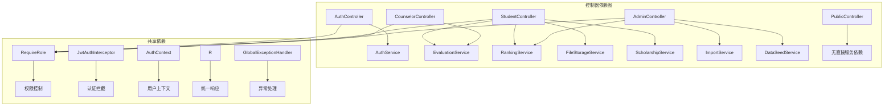

**图表来源**
- [AuthController.java:3-5](file://backend/src/main/java/com/zjsu/scholarship/controller/AuthController.java#L3-L5)
- [StudentController.java:9-14](file://backend/src/main/java/com/zjsu/scholarship/controller/StudentController.java#L9-L14)
- [CounselorController.java:8-11](file://backend/src/main/java/com/zjsu/scholarship/controller/CounselorController.java#L8-L11)
- [AdminController.java:8-12](file://backend/src/main/java/com/zjsu/scholarship/controller/AdminController.java#L8-L12)

### 服务层交互模式

系统采用依赖注入模式，控制器通过构造函数注入所需的Service实例：

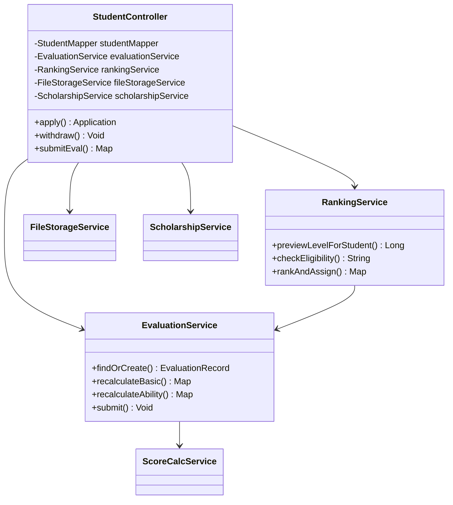

**图表来源**
- [StudentController.java:48-85](file://backend/src/main/java/com/zjsu/scholarship/controller/StudentController.java#L48-L85)
- [EvaluationService.java:22-61](file://backend/src/main/java/com/zjsu/scholarship/service/EvaluationService.java#L22-L61)

**章节来源**
- [StudentController.java:1-719](file://backend/src/main/java/com/zjsu/scholarship/controller/StudentController.java#L1-L719)
- [EvaluationService.java:1-200](file://backend/src/main/java/com/zjsu/scholarship/service/EvaluationService.java#L1-L200)

## 性能考虑

### 缓存策略

系统在以下场景中采用缓存优化：

1. **JWT令牌缓存**：避免重复解析JWT令牌
2. **用户信息缓存**：在请求生命周期内缓存当前用户信息
3. **学年信息缓存**：缓存当前有效学年信息

### 数据库优化

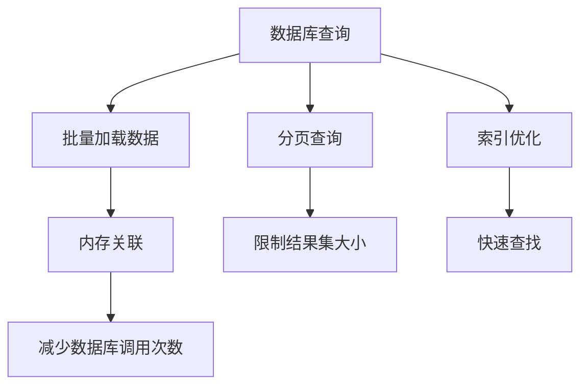

### 并发控制

系统通过以下机制保证并发安全性：
- 使用`ThreadLocal`存储认证上下文，避免线程安全问题
- 在关键业务操作上使用事务管理
- 对批量操作采用原子性处理

## 故障排除指南

### 常见异常类型

| 异常类型 | 触发条件 | 错误码 | 处理建议 |
|----------|----------|--------|----------|
| Business异常 | 业务逻辑验证失败 | 1 | 检查输入参数和业务规则 |
| 权限异常 | 无访问权限 | 403 | 验证用户角色和权限 |
| 认证异常 | 令牌无效或过期 | 401 | 重新登录获取新令牌 |
| 服务器异常 | 未捕获的系统异常 | 500 | 查看服务器日志 |

### 异常处理流程

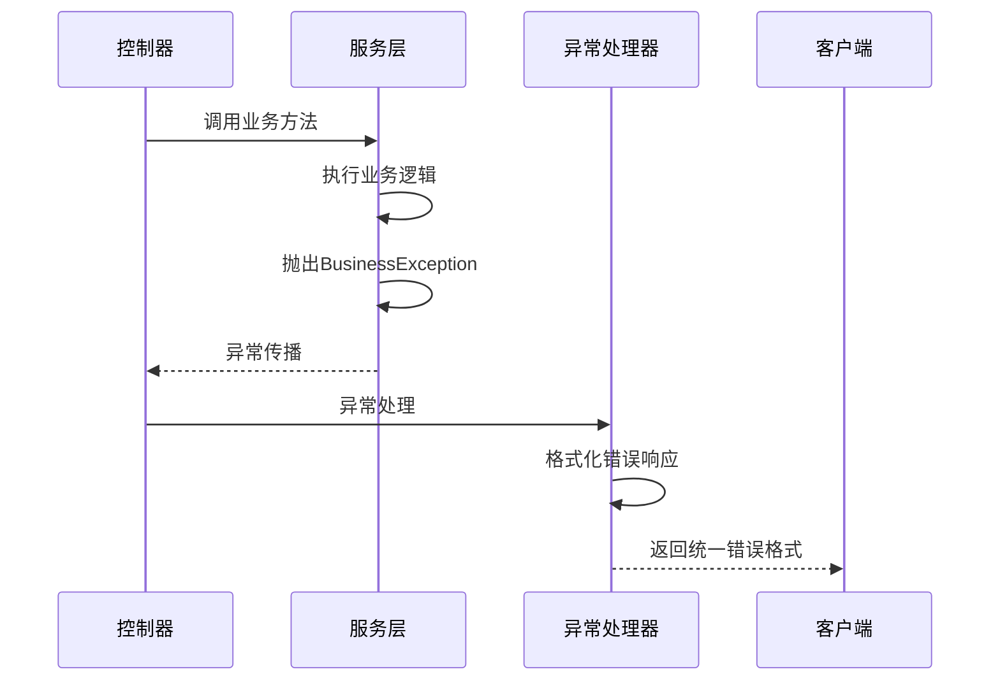

**图表来源**
- [GlobalExceptionHandler.java:12-21](file://backend/src/main/java/com/zjsu/scholarship/common/GlobalExceptionHandler.java#L12-L21)

### 调试技巧

1. **启用详细日志**：在`application.yml`中调整日志级别
2. **检查JWT令牌**：使用在线JWT解析工具验证令牌有效性
3. **验证数据库连接**：确认H2数据库配置正确
4. **测试API端点**：使用Postman或curl工具测试各个接口

**章节来源**
- [GlobalExceptionHandler.java:1-23](file://backend/src/main/java/com/zjsu/scholarship/common/GlobalExceptionHandler.java#L1-L23)
- [application.yml:48-52](file://backend/src/main/resources/application.yml#L48-L52)

## 结论

奖学金管理系统的控制器层设计体现了现代Web应用的最佳实践：

1. **清晰的职责分离**：每个控制器专注于特定的业务领域，职责明确且相互独立
2. **统一的架构模式**：采用一致的设计模式和编码规范，便于维护和扩展
3. **完善的权限控制**：基于角色的访问控制机制确保系统安全性
4. **优雅的异常处理**：统一的异常处理机制提供一致的用户体验
5. **良好的性能设计**：通过缓存、批量操作等技术手段优化系统性能

该设计为后续的功能扩展和系统维护奠定了坚实的基础，能够支持奖学金管理系统的长期发展需求。