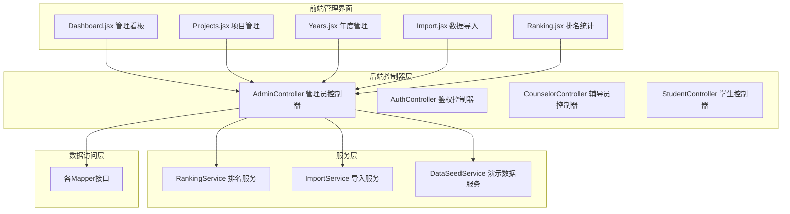
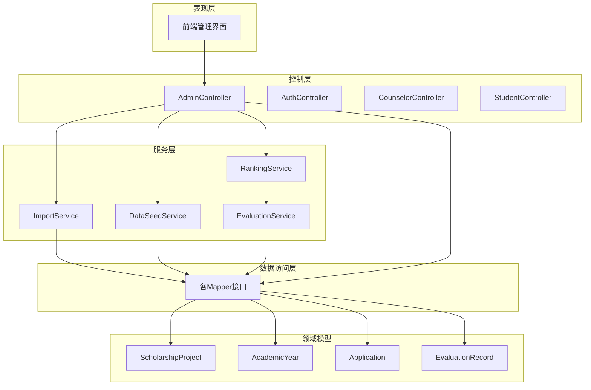
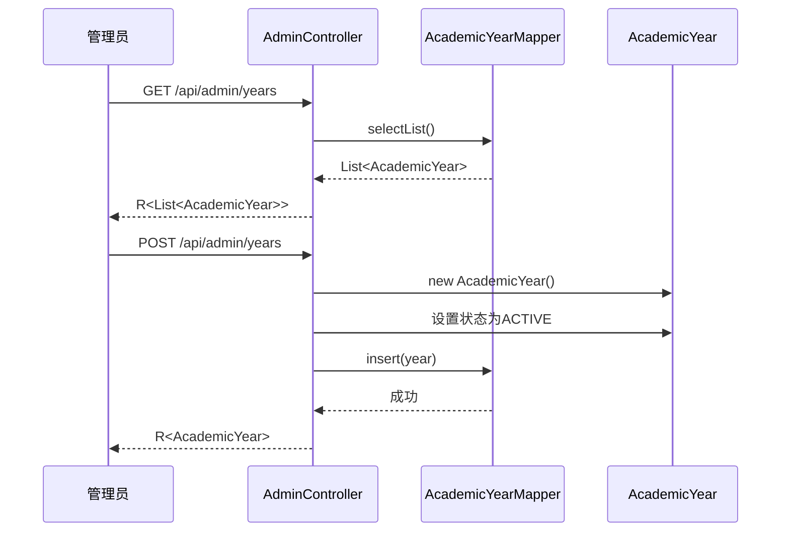
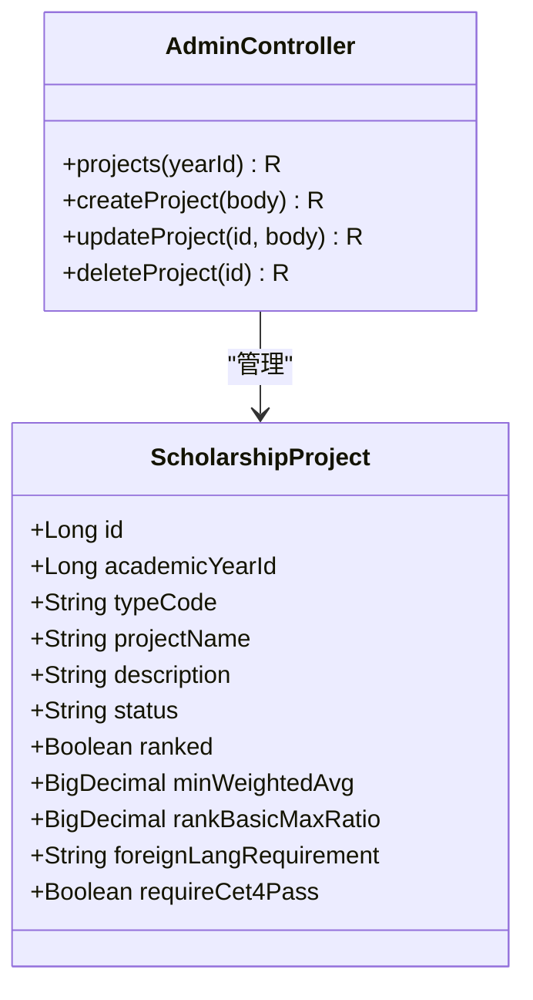
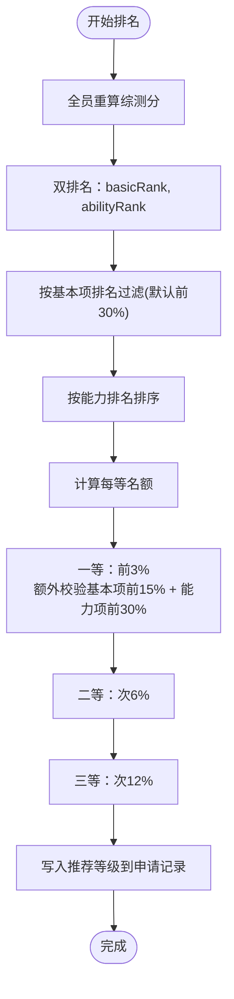
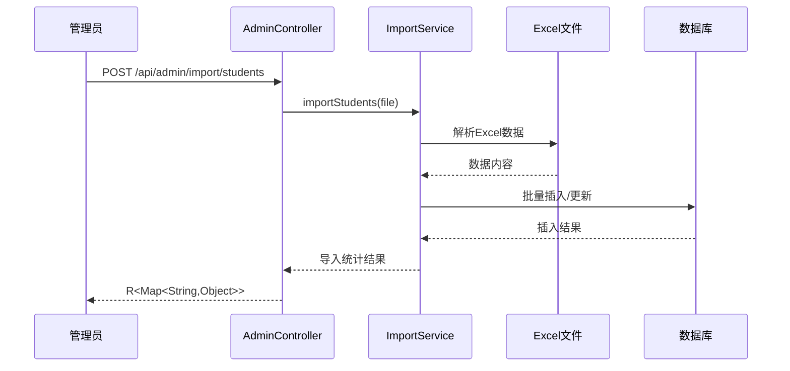
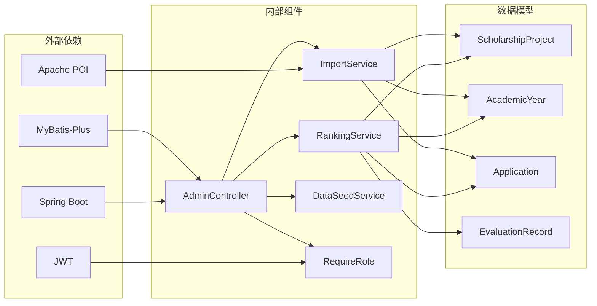

# 管理员控制器

<cite>
**本文档引用的文件**
- [AdminController.java](file://backend/src/main/java/com/zjsu/scholarship/controller/AdminController.java)
- [RequireRole.java](file://backend/src/main/java/com/zjsu/scholarship/security/RequireRole.java)
- [RankingService.java](file://backend/src/main/java/com/zjsu/scholarship/service/RankingService.java)
- [ImportService.java](file://backend/src/main/java/com/zjsu/scholarship/service/ImportService.java)
- [DataSeedService.java](file://backend/src/main/java/com/zjsu/scholarship/service/DataSeedService.java)
- [ScholarshipProject.java](file://backend/src/main/java/com/zjsu/scholarship/entity/ScholarshipProject.java)
- [AcademicYear.java](file://backend/src/main/java/com/zjsu/scholarship/entity/AcademicYear.java)
- [Application.java](file://backend/src/main/java/com/zjsu/scholarship/entity/Application.java)
- [AcademicYearMapper.java](file://backend/src/main/java/com/zjsu/scholarship/mapper/AcademicYearMapper.java)
- [ScholarshipProjectMapper.java](file://backend/src/main/java/com/zjsu/scholarship/mapper/ScholarshipProjectMapper.java)
- [Dashboard.jsx](file://frontend/src/pages/admin/Dashboard.jsx)
- [Projects.jsx](file://frontend/src/pages/admin/Projects.jsx)
- [Years.jsx](file://frontend/src/pages/admin/Years.jsx)
- [Import.jsx](file://frontend/src/pages/admin/Import.jsx)
- [Ranking.jsx](file://frontend/src/pages/admin/Ranking.jsx)
</cite>

## 目录
1. [简介](#简介)
2. [项目结构](#项目结构)
3. [核心组件](#核心组件)
4. [架构概览](#架构概览)
5. [详细组件分析](#详细组件分析)
6. [依赖分析](#依赖分析)
7. [性能考虑](#性能考虑)
8. [故障排除指南](#故障排除指南)
9. [结论](#结论)
10. [附录](#附录)

## 简介
管理员控制器是奖学金管理系统的核心管理入口，负责提供完整的系统管理能力。该控制器实现了从系统配置管理到高级业务功能的全栈管理接口，包括系统配置管理、奖学金项目管理、年度管理、排名统计、数据导入导出等关键功能。本文档将深入分析AdminController的设计理念、接口规范、业务流程以及与各子系统的集成机制。

## 项目结构
奖学金管理系统采用前后端分离架构，后端基于Spring Boot框架，前端使用React技术栈。管理员控制器位于后端的controller包中，通过RESTful API为前端管理界面提供数据支持。



**图表来源**
- [AdminController.java:1-528](file://backend/src/main/java/com/zjsu/scholarship/controller/AdminController.java#L1-L528)
- [Dashboard.jsx:1-35](file://frontend/src/pages/admin/Dashboard.jsx#L1-L35)
- [Projects.jsx:1-416](file://frontend/src/pages/admin/Projects.jsx#L1-L416)

**章节来源**
- [AdminController.java:1-528](file://backend/src/main/java/com/zjsu/scholarship/controller/AdminController.java#L1-L528)
- [RequireRole.java:1-13](file://backend/src/main/java/com/zjsu/scholarship/security/RequireRole.java#L1-L13)

## 核心组件
管理员控制器作为系统的核心管理入口，承担着多重职责：

### 主要职责
- **系统配置管理**：学年管理、系统参数配置
- **业务项目管理**：奖学金项目创建、编辑、状态控制
- **数据统计分析**：综合测评排名、获奖名单预览
- **数据导入导出**：批量数据处理、演示数据生成
- **权限控制**：基于角色的访问控制机制

### 设计特点
- 基于注解的权限控制，支持ADMIN和COUNSELOR角色
- 统一的响应格式R<T>，确保API一致性
- 完善的异常处理机制，提供友好的错误信息
- 事务性操作保证数据一致性

**章节来源**
- [AdminController.java:20-61](file://backend/src/main/java/com/zjsu/scholarship/controller/AdminController.java#L20-L61)
- [RequireRole.java:8-12](file://backend/src/main/java/com/zjsu/scholarship/security/RequireRole.java#L8-L12)

## 架构概览
管理员控制器采用分层架构设计，通过清晰的职责分离实现高内聚低耦合的系统结构。



**图表来源**
- [AdminController.java:25-61](file://backend/src/main/java/com/zjsu/scholarship/controller/AdminController.java#L25-L61)
- [RankingService.java:25-47](file://backend/src/main/java/com/zjsu/scholarship/service/RankingService.java#L25-L47)
- [ImportService.java:21-34](file://backend/src/main/java/com/zjsu/scholarship/service/ImportService.java#L21-L34)

## 详细组件分析

### 系统配置管理模块
系统配置管理模块负责维护奖学金系统的基础配置信息，包括学年管理和系统参数设置。

#### 学年管理功能
学年管理是整个奖学金系统的时间轴基础，支持学年的创建、查询和状态管理。



**图表来源**
- [AdminController.java:64-76](file://backend/src/main/java/com/zjsu/scholarship/controller/AdminController.java#L64-L76)
- [AcademicYear.java:13-26](file://backend/src/main/java/com/zjsu/scholarship/entity/AcademicYear.java#L13-L26)

#### 项目配置管理
奖学金项目配置支持多种类型的奖学金项目，包括综合奖学金、能力突出奖学金等。



**图表来源**
- [ScholarshipProject.java:14-49](file://backend/src/main/java/com/zjsu/scholarship/entity/ScholarshipProject.java#L14-L49)
- [AdminController.java:79-154](file://backend/src/main/java/com/zjsu/scholarship/controller/AdminController.java#L79-L154)

**章节来源**
- [AdminController.java:64-154](file://backend/src/main/java/com/zjsu/scholarship/controller/AdminController.java#L64-L154)
- [ScholarshipProject.java:14-49](file://backend/src/main/java/com/zjsu/scholarship/entity/ScholarshipProject.java#L14-L49)

### 排名统计模块
排名统计模块是奖学金系统的核心算法引擎，实现了复杂的双排名算法和等级分配机制。

#### 双排名算法实现
排名服务实现了《浙江工商大学奖学金实施办法》(2025版)的双排名算法，确保公平公正的等级分配。



**图表来源**
- [RankingService.java:62-227](file://backend/src/main/java/com/zjsu/scholarship/service/RankingService.java#L62-L227)

#### 等级分配策略
系统支持两种等级分配方式：按比例分配和固定名额分配，满足不同场景需求。

**章节来源**
- [RankingService.java:14-437](file://backend/src/main/java/com/zjsu/scholarship/service/RankingService.java#L14-L437)

### 数据导入导出模块
数据导入导出模块提供了完整的批量数据处理能力，支持学生信息和课程成绩的批量导入。

#### 批量导入流程
导入服务支持Excel格式的数据批量导入，提供完整的模板下载和错误处理机制。



**图表来源**
- [AdminController.java:302-313](file://backend/src/main/java/com/zjsu/scholarship/controller/AdminController.java#L302-L313)
- [ImportService.java:75-137](file://backend/src/main/java/com/zjsu/scholarship/service/ImportService.java#L75-L137)

#### 演示数据生成功能
演示数据服务提供了完整的测试数据生成功能，便于系统初始化和功能验证。

**章节来源**
- [ImportService.java:37-194](file://backend/src/main/java/com/zjsu/scholarship/service/ImportService.java#L37-L194)
- [DataSeedService.java:61-182](file://backend/src/main/java/com/zjsu/scholarship/service/DataSeedService.java#L61-L182)

### 权限控制与安全机制
管理员控制器采用了多层安全防护机制，确保系统的安全性和数据的完整性。

#### 角色权限体系
系统实现了基于角色的访问控制，支持ADMIN和COUNSELOR两个管理角色。

```mermaid
classDiagram
class RequireRole {
<<annotation>>
+String[] value()
}
class AdminController {
+@RequireRole({"ADMIN", "COUNSELOR"})
+years() R<List>
+projects() R<List>
+dashboard() R<Map>
}
class AdminOnlyController {
+@RequireRole("ADMIN")
+seedDemo() R<Map>
+importStudents() R<Map>
}
RequireRole <|-- AdminController
RequireRole <|-- AdminOnlyController
```

**图表来源**
- [RequireRole.java:10-12](file://backend/src/main/java/com/zjsu/scholarship/security/RequireRole.java#L10-L12)
- [AdminController.java:22](file://backend/src/main/java/com/zjsu/scholarship/controller/AdminController.java#L22)
- [AdminController.java:286](file://backend/src/main/java/com/zjsu/scholarship/controller/AdminController.java#L286)

#### 操作审计机制
系统通过统一的响应格式和异常处理机制，为操作审计提供了完整的数据支撑。

**章节来源**
- [RequireRole.java:1-13](file://backend/src/main/java/com/zjsu/scholarship/security/RequireRole.java#L1-L13)
- [AdminController.java:4-6](file://backend/src/main/java/com/zjsu/scholarship/controller/AdminController.java#L4-L6)

## 依赖分析
管理员控制器的依赖关系体现了清晰的分层架构设计，各组件之间的耦合度较低，便于维护和扩展。



**图表来源**
- [AdminController.java:3-14](file://backend/src/main/java/com/zjsu/scholarship/controller/AdminController.java#L3-L14)
- [RankingService.java:3-8](file://backend/src/main/java/com/zjsu/scholarship/service/RankingService.java#L3-L8)
- [ImportService.java:3-11](file://backend/src/main/java/com/zjsu/scholarship/service/ImportService.java#L3-L11)

### 关键依赖关系
- **数据访问层**：通过MyBatis-Plus的BaseMapper接口实现数据持久化
- **文件处理**：使用Apache POI处理Excel文件的导入导出
- **安全控制**：通过自定义注解实现基于角色的权限控制
- **服务协调**：通过服务层协调复杂的业务逻辑

**章节来源**
- [AdminController.java:25-61](file://backend/src/main/java/com/zjsu/scholarship/controller/AdminController.java#L25-L61)
- [RankingService.java:28-46](file://backend/src/main/java/com/zjsu/scholarship/service/RankingService.java#L28-L46)

## 性能考虑
管理员控制器在设计时充分考虑了性能优化，通过合理的架构设计和算法实现确保系统的高效运行。

### 数据访问优化
- 使用MyBatis-Plus的链式查询API，减少SQL编写复杂度
- 通过批量操作减少数据库交互次数
- 合理使用缓存机制避免重复计算

### 排名算法优化
- 双排名算法采用一次遍历完成，时间复杂度O(n log n)
- 支持大数据量的高效处理
- 提供进度反馈机制

### 文件处理优化
- Excel文件处理采用流式读取，避免内存溢出
- 错误处理机制确保部分数据错误不影响整体导入
- 提供详细的导入统计信息

## 故障排除指南
管理员控制器提供了完善的错误处理机制，帮助快速定位和解决系统问题。

### 常见问题及解决方案
- **项目不存在**：检查项目ID的有效性，确认项目状态
- **学年配置错误**：验证学年状态，确保ACTIVE状态的学年存在
- **导入文件格式错误**：检查Excel模板格式，确保必填字段完整
- **权限不足**：确认用户角色，ADMIN角色才能执行敏感操作

### 调试建议
- 查看系统日志中的异常堆栈信息
- 使用Postman等工具测试API接口
- 检查数据库连接状态和权限配置
- 验证Excel文件的编码格式

**章节来源**
- [AdminController.java:111](file://backend/src/main/java/com/zjsu/scholarship/controller/AdminController.java#L111)
- [ImportService.java:132](file://backend/src/main/java/com/zjsu/scholarship/service/ImportService.java#L132)

## 结论
管理员控制器作为奖学金管理系统的核心组件，通过精心设计的架构和完善的功能实现，为系统的稳定运行提供了坚实保障。其模块化的设计理念、严格的权限控制机制以及高效的算法实现，使得系统能够满足复杂的管理需求。

未来可以进一步优化的方向包括：引入更细粒度的权限控制、增强系统的监控和告警能力、提供更多的数据分析功能等。通过持续的改进和完善，管理员控制器将继续为奖学金管理提供强有力的技术支撑。

## 附录

### API接口规范
管理员控制器提供了一套完整的RESTful API接口，涵盖系统管理的各个方面。

#### 系统配置管理接口
- `GET /api/admin/years` - 获取所有学年列表
- `POST /api/admin/years` - 创建新学年
- `GET /api/admin/projects` - 获取项目列表
- `POST /api/admin/projects` - 创建奖学金项目

#### 排名统计接口
- `POST /api/admin/projects/{id}/rank` - 执行排名和等级分配
- `GET /api/admin/ranking` - 获取综合测评排名
- `GET /api/admin/projects/{id}/award-preview` - 获奖名单预览

#### 数据导入导出接口
- `GET /api/admin/import/template/students` - 下载学生导入模板
- `GET /api/admin/import/template/grades` - 下载成绩导入模板
- `POST /api/admin/import/students` - 导入学生信息
- `POST /api/admin/import/grades` - 导入课程成绩

#### 演示数据接口
- `POST /api/admin/seed-demo` - 生成演示数据

**章节来源**
- [AdminController.java:64-313](file://backend/src/main/java/com/zjsu/scholarship/controller/AdminController.java#L64-L313)

### 前端集成说明
管理员控制器与前端管理界面通过标准的HTTP协议进行通信，支持完整的CRUD操作和实时数据更新。

#### 管理界面功能
- **管理看板**：展示系统关键指标和状态信息
- **项目管理**：支持奖学金项目的全生命周期管理
- **年度管理**：学年的创建和状态管理
- **数据导入**：批量数据处理和模板下载
- **排名统计**：综合测评排名和数据分析

**章节来源**
- [Dashboard.jsx:6-34](file://frontend/src/pages/admin/Dashboard.jsx#L6-L34)
- [Projects.jsx:20-416](file://frontend/src/pages/admin/Projects.jsx#L20-L416)
- [Import.jsx:9-203](file://frontend/src/pages/admin/Import.jsx#L9-L203)