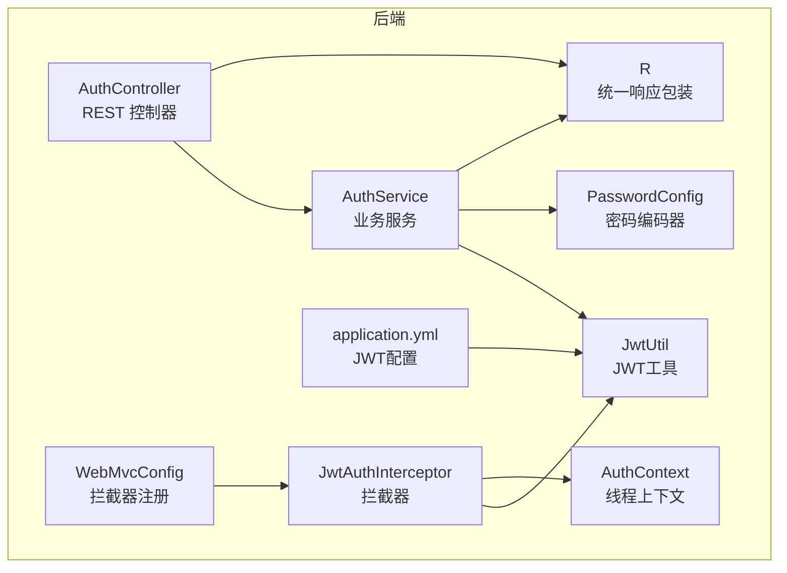
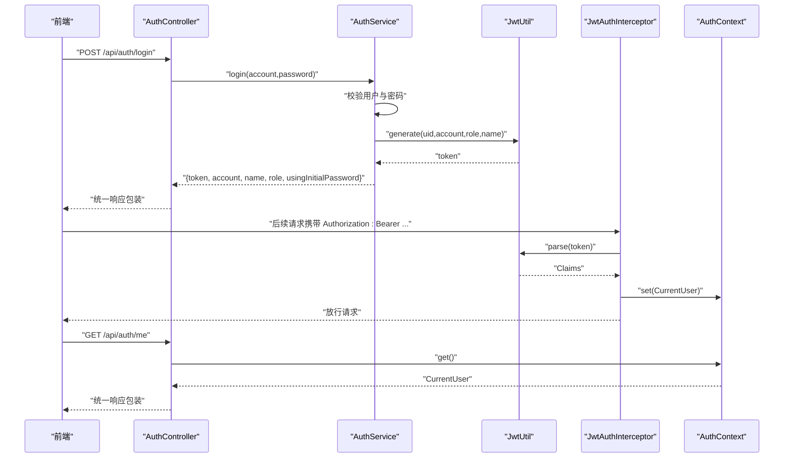
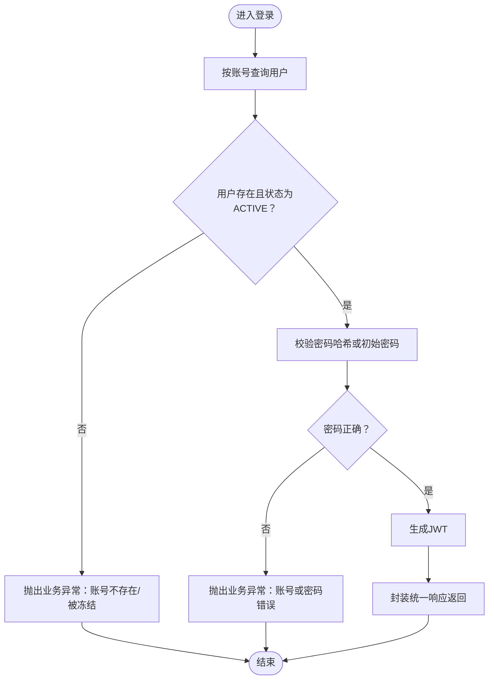
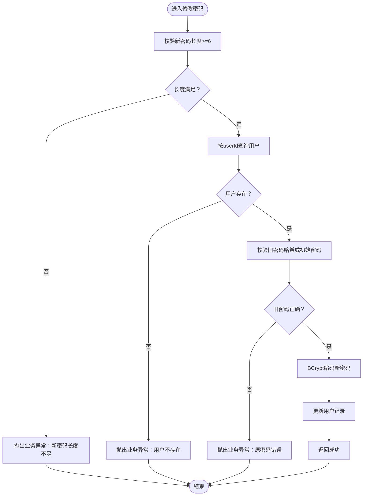
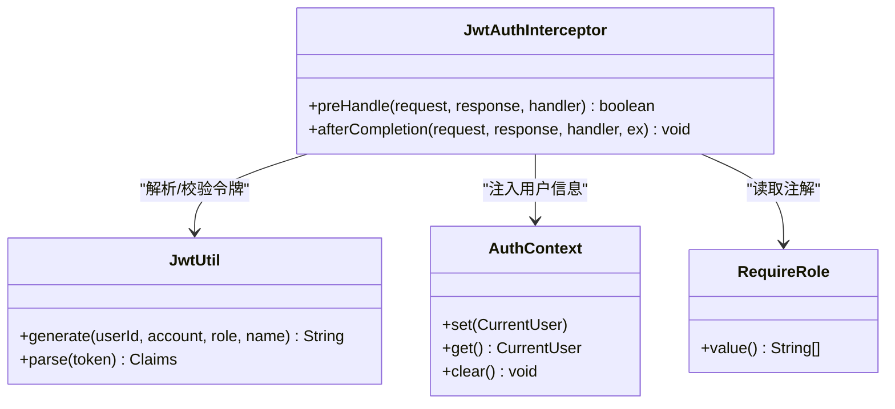
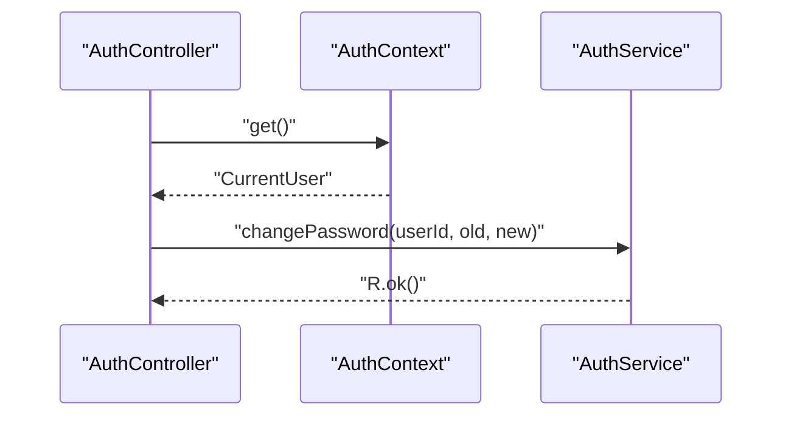
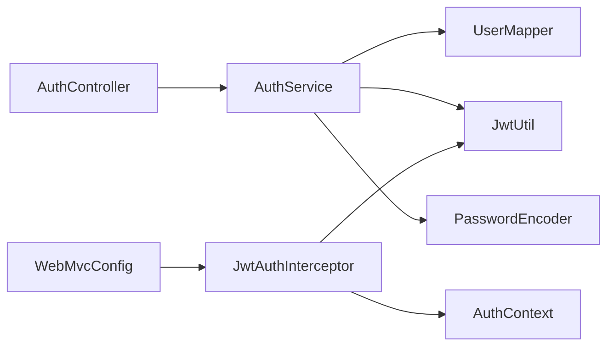

# 认证控制器

<cite>
**本文引用的文件**
- [AuthController.java](file://backend/src/main/java/com/zjsu/scholarship/controller/AuthController.java)
- [AuthService.java](file://backend/src/main/java/com/zjsu/scholarship/service/AuthService.java)
- [AuthContext.java](file://backend/src/main/java/com/zjsu/scholarship/security/AuthContext.java)
- [JwtUtil.java](file://backend/src/main/java/com/zjsu/scholarship/security/JwtUtil.java)
- [JwtAuthInterceptor.java](file://backend/src/main/java/com/zjsu/scholarship/security/JwtAuthInterceptor.java)
- [RequireRole.java](file://backend/src/main/java/com/zjsu/scholarship/security/RequireRole.java)
- [WebMvcConfig.java](file://backend/src/main/java/com/zjsu/scholarship/config/WebMvcConfig.java)
- [PasswordConfig.java](file://backend/src/main/java/com/zjsu/scholarship/config/PasswordConfig.java)
- [R.java](file://backend/src/main/java/com/zjsu/scholarship/common/R.java)
- [application.yml](file://backend/src/main/resources/application.yml)
- [User.java](file://backend/src/main/java/com/zjsu/scholarship/entity/User.java)
- [api.js](file://frontend/src/api.js)
- [Login.jsx](file://frontend/src/pages/Login.jsx)
- [ChangePassword.jsx](file://frontend/src/pages/ChangePassword.jsx)
</cite>

## 目录
1. [简介](#简介)
2. [项目结构](#项目结构)
3. [核心组件](#核心组件)
4. [架构总览](#架构总览)
5. [详细组件分析](#详细组件分析)
6. [依赖分析](#依赖分析)
7. [性能考虑](#性能考虑)
8. [故障排查指南](#故障排查指南)
9. [结论](#结论)
10. [附录](#附录)

## 简介
本文件面向认证控制器与用户认证系统的实现机制，围绕以下目标展开：
- 解释认证控制器的核心功能：用户登录验证、当前用户信息获取、密码修改等接口的设计思路与实现细节
- 阐述RESTful API设计原则：HTTP方法选择、URL路径设计、状态码使用
- 提供完整接口文档：请求参数、响应格式、错误处理
- 分析JWT在认证流程中的作用：令牌生成、验证与刷新机制
- 解释AuthContext上下文的作用与用户身份信息的传递方式
- 提供实际API调用示例与常见问题的解决方案

## 项目结构
后端采用Spring MVC + MyBatis-Plus架构，认证相关代码集中在controller、service、security与config包中，并通过拦截器统一接入JWT校验与角色控制。

图表来源
- [AuthController.java:1-44](file://backend/src/main/java/com/zjsu/scholarship/controller/AuthController.java#L1-L44)
- [AuthService.java:1-77](file://backend/src/main/java/com/zjsu/scholarship/service/AuthService.java#L1-L77)
- [JwtAuthInterceptor.java:1-65](file://backend/src/main/java/com/zjsu/scholarship/security/JwtAuthInterceptor.java#L1-L65)
- [JwtUtil.java:1-52](file://backend/src/main/java/com/zjsu/scholarship/security/JwtUtil.java#L1-L52)
- [AuthContext.java:1-20](file://backend/src/main/java/com/zjsu/scholarship/security/AuthContext.java#L1-L20)
- [WebMvcConfig.java:1-49](file://backend/src/main/java/com/zjsu/scholarship/config/WebMvcConfig.java#L1-L49)
- [PasswordConfig.java:1-15](file://backend/src/main/java/com/zjsu/scholarship/config/PasswordConfig.java#L1-L15)
- [R.java:1-39](file://backend/src/main/java/com/zjsu/scholarship/common/R.java#L1-L39)
- [application.yml:42-46](file://backend/src/main/resources/application.yml#L42-L46)

章节来源
- [AuthController.java:1-44](file://backend/src/main/java/com/zjsu/scholarship/controller/AuthController.java#L1-L44)
- [WebMvcConfig.java:23-31](file://backend/src/main/java/com/zjsu/scholarship/config/WebMvcConfig.java#L23-L31)

## 核心组件
- 认证控制器：提供登录、获取当前用户信息、修改密码三个接口，均返回统一响应包装对象
- 认证服务：负责用户凭据校验、密码哈希匹配、令牌签发、密码修改逻辑
- JWT工具：封装密钥加载、令牌生成与解析
- 拦截器：从请求头提取令牌、解析并注入AuthContext，同时进行角色校验
- 上下文：基于ThreadLocal存储当前用户信息，贯穿一次请求生命周期
- 配置：拦截器注册、CORS策略、密码编码器、JWT配置项

章节来源
- [AuthController.java:21-42](file://backend/src/main/java/com/zjsu/scholarship/controller/AuthController.java#L21-L42)
- [AuthService.java:32-75](file://backend/src/main/java/com/zjsu/scholarship/service/AuthService.java#L32-L75)
- [JwtUtil.java:28-50](file://backend/src/main/java/com/zjsu/scholarship/security/JwtUtil.java#L28-L50)
- [JwtAuthInterceptor.java:20-58](file://backend/src/main/java/com/zjsu/scholarship/security/JwtAuthInterceptor.java#L20-L58)
- [AuthContext.java:3-18](file://backend/src/main/java/com/zjsu/scholarship/security/AuthContext.java#L3-L18)
- [WebMvcConfig.java:24-31](file://backend/src/main/java/com/zjsu/scholarship/config/WebMvcConfig.java#L24-L31)
- [PasswordConfig.java:9-13](file://backend/src/main/java/com/zjsu/scholarship/config/PasswordConfig.java#L9-L13)
- [R.java:16-30](file://backend/src/main/java/com/zjsu/scholarship/common/R.java#L16-L30)
- [application.yml:42-46](file://backend/src/main/resources/application.yml#L42-L46)

## 架构总览
认证流程的关键步骤如下：
- 客户端发起登录请求，携带账号与密码
- 服务端通过认证服务校验凭据，成功则签发JWT
- 前端将令牌保存并在后续请求头中携带
- 拦截器解析令牌，填充AuthContext，完成鉴权与授权
- 控制器读取AuthContext中的用户信息，执行业务逻辑

图表来源
- [AuthController.java:21-35](file://backend/src/main/java/com/zjsu/scholarship/controller/AuthController.java#L21-L35)
- [AuthService.java:32-55](file://backend/src/main/java/com/zjsu/scholarship/service/AuthService.java#L32-L55)
- [JwtUtil.java:28-50](file://backend/src/main/java/com/zjsu/scholarship/security/JwtUtil.java#L28-L50)
- [JwtAuthInterceptor.java:20-58](file://backend/src/main/java/com/zjsu/scholarship/security/JwtAuthInterceptor.java#L20-L58)
- [AuthContext.java:6-8](file://backend/src/main/java/com/zjsu/scholarship/security/AuthContext.java#L6-L8)

## 详细组件分析

### 接口定义与RESTful设计
- 登录接口
  - 方法与路径：POST /api/auth/login
  - 请求体字段：account（字符串）、password（字符串）
  - 成功响应：包含token、account、name、role、usingInitialPassword
  - 错误场景：账号不存在、账号被冻结、账号或密码错误
- 当前用户接口
  - 方法与路径：GET /api/auth/me
  - 请求头：Authorization: Bearer <token>
  - 成功响应：包含userId、account、role、name
  - 无权限场景：未登录或令牌缺失、令牌无效或已过期
- 修改密码接口
  - 方法与路径：POST /api/auth/change-password
  - 请求体字段：oldPassword（字符串）、newPassword（字符串）
  - 成功响应：空数据
  - 错误场景：新密码长度不足、用户不存在、原密码错误

章节来源
- [AuthController.java:21-42](file://backend/src/main/java/com/zjsu/scholarship/controller/AuthController.java#L21-L42)
- [R.java:16-30](file://backend/src/main/java/com/zjsu/scholarship/common/R.java#L16-L30)

### 登录流程与密码校验
- 用户查询与状态检查：根据account查询用户，若不存在或状态非ACTIVE则抛出业务异常
- 凭据校验：优先使用BCrypt哈希比对；若未设置哈希，则回退到初始密码模拟表进行比对
- 令牌签发：通过JwtUtil生成包含uid、account、role、name的JWT，设置过期时间
- 响应封装：统一使用R.ok返回结果

图表来源
- [AuthService.java:32-55](file://backend/src/main/java/com/zjsu/scholarship/service/AuthService.java#L32-L55)
- [PasswordConfig.java:9-13](file://backend/src/main/java/com/zjsu/scholarship/config/PasswordConfig.java#L9-L13)
- [application.yml:42-46](file://backend/src/main/resources/application.yml#L42-L46)

章节来源
- [AuthService.java:32-55](file://backend/src/main/java/com/zjsu/scholarship/service/AuthService.java#L32-L55)
- [PasswordConfig.java:9-13](file://backend/src/main/java/com/zjsu/scholarship/config/PasswordConfig.java#L9-L13)
- [application.yml:42-46](file://backend/src/main/resources/application.yml#L42-L46)

### 密码修改流程
- 参数校验：新密码长度至少6位
- 用户查询与旧密码校验：与登录逻辑一致，支持哈希与初始密码两种模式
- 更新逻辑：对新密码进行BCrypt编码并更新用户记录

图表来源
- [AuthService.java:57-75](file://backend/src/main/java/com/zjsu/scholarship/service/AuthService.java#L57-L75)

章节来源
- [AuthService.java:57-75](file://backend/src/main/java/com/zjsu/scholarship/service/AuthService.java#L57-L75)

### JWT令牌生成、验证与角色控制
- 令牌生成：JwtUtil根据用户信息构建claims，设置签发时间与过期时间，使用对称密钥签名
- 令牌解析：拦截器从Authorization头提取Bearer令牌，调用JwtUtil解析并校验签名
- 上下文注入：将解析得到的用户信息封装为CurrentUser并写入AuthContext
- 角色校验：拦截器读取方法或类上的RequireRole注解，判断当前用户角色是否允许访问
- 生命周期：请求完成后清理AuthContext，避免线程复用导致的数据泄露

图表来源
- [JwtUtil.java:15-52](file://backend/src/main/java/com/zjsu/scholarship/security/JwtUtil.java#L15-L52)
- [JwtAuthInterceptor.java:12-65](file://backend/src/main/java/com/zjsu/scholarship/security/JwtAuthInterceptor.java#L12-L65)
- [AuthContext.java:3-18](file://backend/src/main/java/com/zjsu/scholarship/security/AuthContext.java#L3-L18)
- [RequireRole.java:8-12](file://backend/src/main/java/com/zjsu/scholarship/security/RequireRole.java#L8-L12)

章节来源
- [JwtUtil.java:24-50](file://backend/src/main/java/com/zjsu/scholarship/security/JwtUtil.java#L24-L50)
- [JwtAuthInterceptor.java:20-63](file://backend/src/main/java/com/zjsu/scholarship/security/JwtAuthInterceptor.java#L20-L63)
- [RequireRole.java:8-12](file://backend/src/main/java/com/zjsu/scholarship/security/RequireRole.java#L8-L12)
- [AuthContext.java:6-8](file://backend/src/main/java/com/zjsu/scholarship/security/AuthContext.java#L6-L8)

### 控制器与上下文交互
- 获取当前用户：控制器直接从AuthContext读取当前用户信息，组装响应
- 修改密码：控制器从AuthContext获取userId，交由服务层执行密码变更
- 统一响应：所有接口均通过R封装，便于前端统一处理

图表来源
- [AuthController.java:26-42](file://backend/src/main/java/com/zjsu/scholarship/controller/AuthController.java#L26-L42)
- [AuthContext.java:7-8](file://backend/src/main/java/com/zjsu/scholarship/security/AuthContext.java#L7-L8)
- [AuthService.java:57-75](file://backend/src/main/java/com/zjsu/scholarship/service/AuthService.java#L57-L75)

章节来源
- [AuthController.java:26-42](file://backend/src/main/java/com/zjsu/scholarship/controller/AuthController.java#L26-L42)
- [AuthContext.java:7-8](file://backend/src/main/java/com/zjsu/scholarship/security/AuthContext.java#L7-L8)

### 前端集成与示例
- 请求拦截器：自动在请求头添加Authorization: Bearer token
- 登录流程：提交账号密码，接收token与用户信息，跳转对应角色页面
- 修改密码：提交旧密码与新密码，成功后更新本地用户状态

章节来源
- [api.js:10-16](file://frontend/src/api.js#L10-L16)
- [Login.jsx:22-34](file://frontend/src/pages/Login.jsx#L22-L34)
- [ChangePassword.jsx:10-16](file://frontend/src/pages/ChangePassword.jsx#L10-L16)

## 依赖分析
- 控制器依赖服务层与上下文
- 服务层依赖用户映射、密码编码器、JWT工具
- 拦截器依赖JWT工具与上下文
- 配置类注册拦截器并排除无需鉴权的路径

图表来源
- [AuthController.java:15-19](file://backend/src/main/java/com/zjsu/scholarship/controller/AuthController.java#L15-L19)
- [AuthService.java:19-30](file://backend/src/main/java/com/zjsu/scholarship/service/AuthService.java#L19-L30)
- [JwtAuthInterceptor.java:14-18](file://backend/src/main/java/com/zjsu/scholarship/security/JwtAuthInterceptor.java#L14-L18)
- [WebMvcConfig.java:24-31](file://backend/src/main/java/com/zjsu/scholarship/config/WebMvcConfig.java#L24-L31)

章节来源
- [AuthController.java:15-19](file://backend/src/main/java/com/zjsu/scholarship/controller/AuthController.java#L15-L19)
- [AuthService.java:19-30](file://backend/src/main/java/com/zjsu/scholarship/service/AuthService.java#L19-L30)
- [JwtAuthInterceptor.java:14-18](file://backend/src/main/java/com/zjsu/scholarship/security/JwtAuthInterceptor.java#L14-L18)
- [WebMvcConfig.java:24-31](file://backend/src/main/java/com/zjsu/scholarship/config/WebMvcConfig.java#L24-L31)

## 性能考虑
- 密码校验：使用BCrypt，安全性高但计算成本较高，建议在并发场景下关注数据库连接池与线程数配置
- 令牌有效期：默认24小时，可根据业务调整过期时长以平衡安全与体验
- 线程安全：AuthContext基于ThreadLocal，请求结束后必须清理，避免内存泄漏
- CORS与跨域：生产环境建议限制具体域名而非通配符，提升安全性

## 故障排查指南
- 401 未登录或令牌缺失：检查请求头Authorization是否正确携带Bearer token
- 401 令牌无效或已过期：确认JWT密钥一致、服务器时间同步、过期时间合理
- 403 无权限访问该资源：检查方法或类上RequireRole注解与当前用户角色是否匹配
- 400 账号或密码错误：确认账号是否存在、状态是否正常、密码是否匹配
- 400 新密码长度不足：确保新密码长度不少于6位
- 统一响应code为0表示成功，非0表示业务异常，前端可据此做统一提示与路由跳转

章节来源
- [JwtAuthInterceptor.java:26-56](file://backend/src/main/java/com/zjsu/scholarship/security/JwtAuthInterceptor.java#L26-L56)
- [AuthService.java:35-71](file://backend/src/main/java/com/zjsu/scholarship/service/AuthService.java#L35-L71)
- [R.java:16-30](file://backend/src/main/java/com/zjsu/scholarship/common/R.java#L16-L30)
- [api.js:18-35](file://frontend/src/api.js#L18-L35)

## 结论
本认证体系以JWT为核心，结合拦截器与上下文实现统一鉴权与授权，配合统一响应包装与前端拦截器，形成闭环的安全访问链路。登录、当前用户信息获取、密码修改三大接口覆盖了典型认证场景，具备良好的扩展性与可维护性。

## 附录

### 接口文档

- 登录
  - 方法：POST
  - 路径：/api/auth/login
  - 请求体
    - account: 字符串，账号
    - password: 字符串，密码
  - 成功响应
    - code: 0
    - message: "ok"
    - data.token: 字符串，JWT令牌
    - data.account: 字符串，账号
    - data.name: 字符串，姓名
    - data.role: 字符串，角色
    - data.usingInitialPassword: 布尔，是否使用初始密码
  - 失败响应
    - 账号不存在/被冻结：code=1，message为相应提示
    - 账号或密码错误：code=1，message为相应提示

- 获取当前用户
  - 方法：GET
  - 路径：/api/auth/me
  - 请求头：Authorization: Bearer <token>
  - 成功响应
    - code: 0
    - message: "ok"
    - data.userId: 数字，用户ID
    - data.account: 字符串，账号
    - data.role: 字符串，角色
    - data.name: 字符串，姓名
  - 失败响应
    - 未登录或令牌缺失：code=1，message为相应提示
    - 令牌无效或已过期：code=1，message为相应提示

- 修改密码
  - 方法：POST
  - 路径：/api/auth/change-password
  - 请求体
    - oldPassword: 字符串，旧密码
    - newPassword: 字符串，新密码（至少6位）
  - 成功响应
    - code: 0
    - message: "ok"
    - data: null
  - 失败响应
    - 新密码长度不足：code=1，message为相应提示
    - 用户不存在：code=1，message为相应提示
    - 原密码错误：code=1，message为相应提示

章节来源
- [AuthController.java:21-42](file://backend/src/main/java/com/zjsu/scholarship/controller/AuthController.java#L21-L42)
- [R.java:16-30](file://backend/src/main/java/com/zjsu/scholarship/common/R.java#L16-L30)

### JWT配置
- app.jwt.secret: JWT对称密钥
- app.jwt.expire-hours: 令牌过期小时数

章节来源
- [application.yml:42-46](file://backend/src/main/resources/application.yml#L42-L46)
- [JwtUtil.java:18-22](file://backend/src/main/java/com/zjsu/scholarship/security/JwtUtil.java#L18-L22)

### 实际调用示例（前端）
- 登录
  - 发送POST /api/auth/login，携带account与password
  - 成功后保存token与用户信息，按角色跳转
- 修改密码
  - 发送POST /api/auth/change-password，携带oldPassword与newPassword
  - 成功后更新本地用户状态

章节来源
- [Login.jsx:22-34](file://frontend/src/pages/Login.jsx#L22-L34)
- [ChangePassword.jsx:10-16](file://frontend/src/pages/ChangePassword.jsx#L10-L16)
- [api.js:10-16](file://frontend/src/api.js#L10-L16)