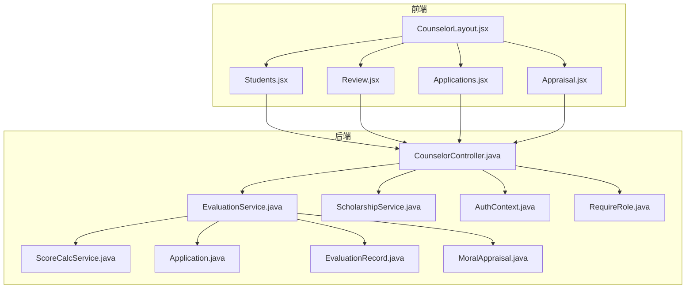
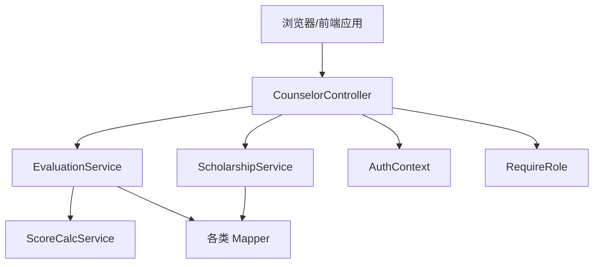
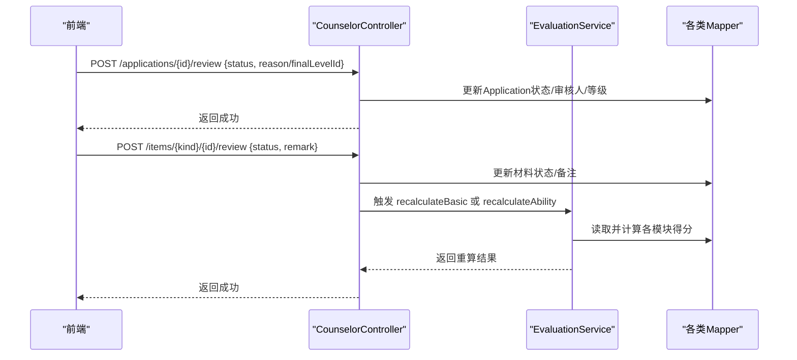
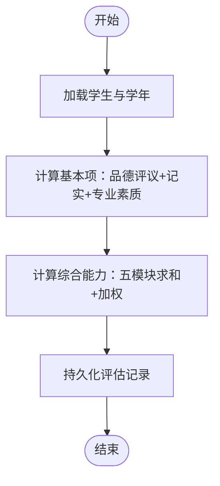
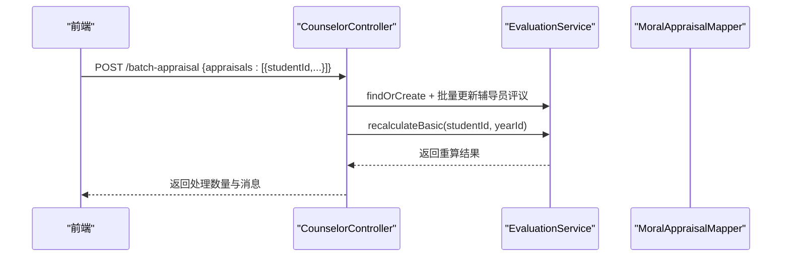
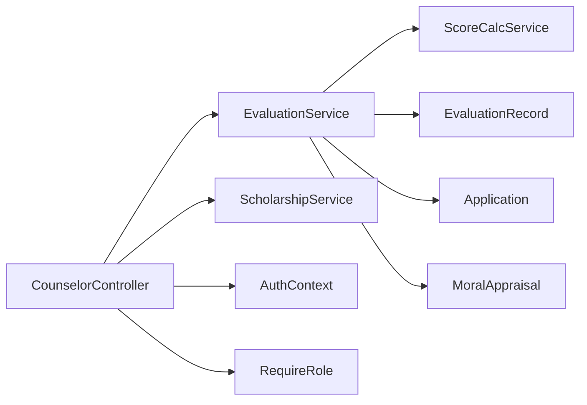

# 辅导员控制器

<cite>
**本文引用的文件**
- [CounselorController.java](file://backend/src/main/java/com/zjsu/scholarship/controller/CounselorController.java)
- [EvaluationService.java](file://backend/src/main/java/com/zjsu/scholarship/service/EvaluationService.java)
- [ScoreCalcService.java](file://backend/src/main/java/com/zjsu/scholarship/service/ScoreCalcService.java)
- [ScholarshipService.java](file://backend/src/main/java/com/zjsu/scholarship/service/ScholarshipService.java)
- [RequireRole.java](file://backend/src/main/java/com/zjsu/scholarship/security/RequireRole.java)
- [AuthContext.java](file://backend/src/main/java/com/zjsu/scholarship/security/AuthContext.java)
- [Application.java](file://backend/src/main/java/com/zjsu/scholarship/entity/Application.java)
- [EvaluationRecord.java](file://backend/src/main/java/com/zjsu/scholarship/entity/EvaluationRecord.java)
- [MoralAppraisal.java](file://backend/src/main/java/com/zjsu/scholarship/entity/MoralAppraisal.java)
- [Applications.jsx](file://frontend/src/pages/counselor/Applications.jsx)
- [Review.jsx](file://frontend/src/pages/counselor/Review.jsx)
- [Appraisal.jsx](file://frontend/src/pages/counselor/Appraisal.jsx)
- [Students.jsx](file://frontend/src/pages/counselor/Students.jsx)
- [CounselorLayout.jsx](file://frontend/src/layouts/CounselorLayout.jsx)
- [application.yml](file://backend/src/main/resources/application.yml)
</cite>

## 目录
1. [简介](#简介)
2. [项目结构](#项目结构)
3. [核心组件](#核心组件)
4. [架构概览](#架构概览)
5. [详细组件分析](#详细组件分析)
6. [依赖分析](#依赖分析)
7. [性能考虑](#性能考虑)
8. [故障排查指南](#故障排查指南)
9. [结论](#结论)
10. [附录](#附录)

## 简介
本文件面向“辅导员控制器”的完整技术文档，聚焦于辅导员端在奖学金评审体系中的职责边界与实现细节。重点覆盖以下方面：
- 接口设计与权限控制机制
- 学生信息管理、申请审核、综合评估、批量操作等核心功能
- 数据访问范围与安全策略
- 审核流程、评估标准、批量评议与状态转换
- 与学生控制器、管理员控制器的协作关系
- 实际业务场景示例与最佳实践

## 项目结构
后端采用 Spring Boot + MyBatis-Plus 架构，控制器位于 controller 层，服务层封装业务逻辑，实体与映射器对应数据库表结构。前端使用 React + Ant Design，提供四类页面：我的学生、材料审核、申请审核、品德评议。

**图表来源**
- [CounselorController.java:1-391](file://backend/src/main/java/com/zjsu/scholarship/controller/CounselorController.java#L1-L391)
- [EvaluationService.java:1-308](file://backend/src/main/java/com/zjsu/scholarship/service/EvaluationService.java#L1-L308)
- [ScoreCalcService.java:1-423](file://backend/src/main/java/com/zjsu/scholarship/service/ScoreCalcService.java#L1-L423)
- [ScholarshipService.java:1-280](file://backend/src/main/java/com/zjsu/scholarship/service/ScholarshipService.java#L1-L280)
- [AuthContext.java:1-20](file://backend/src/main/java/com/zjsu/scholarship/security/AuthContext.java#L1-L20)
- [RequireRole.java:1-13](file://backend/src/main/java/com/zjsu/scholarship/security/RequireRole.java#L1-L13)
- [Application.java:1-43](file://backend/src/main/java/com/zjsu/scholarship/entity/Application.java#L1-L43)
- [EvaluationRecord.java:1-45](file://backend/src/main/java/com/zjsu/scholarship/entity/EvaluationRecord.java#L1-L45)
- [MoralAppraisal.java:1-36](file://backend/src/main/java/com/zjsu/scholarship/entity/MoralAppraisal.java#L1-L36)
- [CounselorLayout.jsx:1-14](file://frontend/src/layouts/CounselorLayout.jsx#L1-L14)
- [Students.jsx:1-111](file://frontend/src/pages/counselor/Students.jsx#L1-L111)
- [Review.jsx:1-97](file://frontend/src/pages/counselor/Review.jsx#L1-L97)
- [Applications.jsx:1-100](file://frontend/src/pages/counselor/Applications.jsx#L1-L100)
- [Appraisal.jsx:1-156](file://frontend/src/pages/counselor/Appraisal.jsx#L1-L156)

**章节来源**
- [CounselorController.java:18-65](file://backend/src/main/java/com/zjsu/scholarship/controller/CounselorController.java#L18-L65)
- [CounselorLayout.jsx:4-9](file://frontend/src/layouts/CounselorLayout.jsx#L4-L9)

## 核心组件
- 控制器层：CounselorController 提供学生信息查询、待审核材料汇总、单项材料审核、申请审核与批量审核、辅导员批量品德评议等接口，并通过注解实现角色级权限控制。
- 服务层：
  - EvaluationService：负责综合评价记录的创建与重算（基本项、综合能力），并提供提交、全课合格检查、外语课加权平均、处分校验等能力。
  - ScoreCalcService：具体评分算法引擎，定义品德评议权重、品德记实增减分规则、各模块计分细则与综合能力加权公式。
  - ScholarshipService：能力突出奖学金资格判定、考研奖学金申报、申报限制校验与奖金发放规则计算。
- 安全层：RequireRole 注解用于方法/类级别角色白名单控制；AuthContext 提供当前登录用户上下文（含 userId、role 等）。
- 实体层：Application、EvaluationRecord、MoralAppraisal 等实体承载评审状态、分数与快照数据。

**章节来源**
- [CounselorController.java:18-65](file://backend/src/main/java/com/zjsu/scholarship/controller/CounselorController.java#L18-L65)
- [EvaluationService.java:22-61](file://backend/src/main/java/com/zjsu/scholarship/service/EvaluationService.java#L22-L61)
- [ScoreCalcService.java:18-423](file://backend/src/main/java/com/zjsu/scholarship/service/ScoreCalcService.java#L18-L423)
- [ScholarshipService.java:21-49](file://backend/src/main/java/com/zjsu/scholarship/service/ScholarshipService.java#L21-L49)
- [RequireRole.java:10-12](file://backend/src/main/java/com/zjsu/scholarship/security/RequireRole.java#L10-L12)
- [AuthContext.java:3-18](file://backend/src/main/java/com/zjsu/scholarship/security/AuthContext.java#L3-L18)
- [Application.java:14-42](file://backend/src/main/java/com/zjsu/scholarship/entity/Application.java#L14-L42)
- [EvaluationRecord.java:14-44](file://backend/src/main/java/com/zjsu/scholarship/entity/EvaluationRecord.java#L14-L44)
- [MoralAppraisal.java:15-35](file://backend/src/main/java/com/zjsu/scholarship/entity/MoralAppraisal.java#L15-L35)

## 架构概览
辅导员控制器围绕“学年”和“学生”两条主线展开，通过服务层统一调度评分引擎与持久化操作，前端以表格与弹窗形式提供交互入口。

**图表来源**
- [CounselorController.java:18-65](file://backend/src/main/java/com/zjsu/scholarship/controller/CounselorController.java#L18-L65)
- [EvaluationService.java:22-61](file://backend/src/main/java/com/zjsu/scholarship/service/EvaluationService.java#L22-L61)
- [ScholarshipService.java:21-49](file://backend/src/main/java/com/zjsu/scholarship/service/ScholarshipService.java#L21-L49)
- [ScoreCalcService.java:18-423](file://backend/src/main/java/com/zjsu/scholarship/service/ScoreCalcService.java#L18-L423)
- [AuthContext.java:3-18](file://backend/src/main/java/com/zjsu/scholarship/security/AuthContext.java#L3-L18)
- [RequireRole.java:10-12](file://backend/src/main/java/com/zjsu/scholarship/security/RequireRole.java#L10-L12)

## 详细组件分析

### 接口设计与权限控制
- 路由前缀：/api/counselor
- 角色控制：@RequireRole({"COUNSELOR", "ADMIN"}) 应用于控制器类，确保仅辅导员与管理员可访问。
- 权限上下文：AuthContext.get().userId 用于记录审核人 ID 与操作审计。

典型接口清单（路径与语义）：
- GET /api/counselor/students?major=...：按专业返回学生列表及当前学年综合评价摘要
- GET /api/counselor/items/pending：返回各类待审核材料（品德记实、研究创新、专业技能、组织工作、体育美育、劳动实践）
- POST /api/counselor/items/{kind}/{id}/review：对单项材料进行审核（通过/驳回），并触发相应模块的重新计算
- GET /api/counselor/applications?status=...：查询学生申请列表（支持按状态过滤）
- POST /api/counselor/applications/{id}/review：对单个申请进行审核（通过/退回），并写入审核人与最终等级
- POST /api/counselor/applications/batch-review：批量通过（仅针对状态为 SUBMITTED 的申请）
- POST /api/counselor/batch-appraisal：辅导员批量品德评议（6维度评分）
- GET /api/counselor/batch-appraisal/students?major=&className=：查询可评议学生及其现有评议记录

权限与数据范围：
- 所有接口均基于当前有效学年（ACTIVE）进行数据筛选
- “我的学生”接口按辅导员所带学生集合过滤，避免越权访问其他学生数据
- 审核接口在更新时写入 reviewerId，便于审计追踪

**章节来源**
- [CounselorController.java:20](file://backend/src/main/java/com/zjsu/scholarship/controller/CounselorController.java#L20)
- [CounselorController.java:72-89](file://backend/src/main/java/com/zjsu/scholarship/controller/CounselorController.java#L72-L89)
- [CounselorController.java:91-135](file://backend/src/main/java/com/zjsu/scholarship/controller/CounselorController.java#L91-L135)
- [CounselorController.java:160-230](file://backend/src/main/java/com/zjsu/scholarship/controller/CounselorController.java#L160-L230)
- [CounselorController.java:233-279](file://backend/src/main/java/com/zjsu/scholarship/controller/CounselorController.java#L233-L279)
- [CounselorController.java:281-299](file://backend/src/main/java/com/zjsu/scholarship/controller/CounselorController.java#L281-L299)
- [CounselorController.java:308-375](file://backend/src/main/java/com/zjsu/scholarship/controller/CounselorController.java#L308-L375)
- [RequireRole.java:10-12](file://backend/src/main/java/com/zjsu/scholarship/security/RequireRole.java#L10-L12)
- [AuthContext.java:10-18](file://backend/src/main/java/com/zjsu/scholarship/security/AuthContext.java#L10-L18)

### 审核流程接口（材料审核与申请审核）
材料审核流程（单项）：
- 获取待审核材料 → 前端展示 → 辅导员选择通过/驳回 → 后端更新状态与备注 → 触发对应模块重算（基本项或综合能力）

申请审核流程（单个与批量）：
- 查询申请列表 → 选择通过或退回（退回需填写原因） → 写入审核时间、审核人、最终等级（若通过） → 批量通过仅对 SUBMITTED 状态生效

**图表来源**
- [CounselorController.java:259-279](file://backend/src/main/java/com/zjsu/scholarship/controller/CounselorController.java#L259-L279)
- [CounselorController.java:160-230](file://backend/src/main/java/com/zjsu/scholarship/controller/CounselorController.java#L160-L230)
- [EvaluationService.java:91-135](file://backend/src/main/java/com/zjsu/scholarship/service/EvaluationService.java#L91-L135)
- [EvaluationService.java:139-167](file://backend/src/main/java/com/zjsu/scholarship/service/EvaluationService.java#L139-L167)

**章节来源**
- [Applications.jsx:20-43](file://frontend/src/pages/counselor/Applications.jsx#L20-L43)
- [Review.jsx:29-45](file://frontend/src/pages/counselor/Review.jsx#L29-L45)
- [CounselorController.java:233-299](file://backend/src/main/java/com/zjsu/scholarship/controller/CounselorController.java#L233-L299)

### 综合评估与评分引擎
- 基本项 = 品德总分 × 30% + 专业素质（加权平均）× 70%
- 综合能力 = 75 + 五模块加权（研究创新×30% + 专业技能×25% + 组织工作×15% + 体育美育×15% + 劳动实践×15%）
- 品德评议权重：自评×5% + 学生代表×60% + 辅导员×35%
- 品德记实增减分：荣誉、集体荣誉、志愿服务、处分等，存在上限与区间约束

**图表来源**
- [EvaluationService.java:91-167](file://backend/src/main/java/com/zjsu/scholarship/service/EvaluationService.java#L91-L167)
- [ScoreCalcService.java:28-178](file://backend/src/main/java/com/zjsu/scholarship/service/ScoreCalcService.java#L28-L178)
- [ScoreCalcService.java:184-414](file://backend/src/main/java/com/zjsu/scholarship/service/ScoreCalcService.java#L184-L414)

**章节来源**
- [EvaluationService.java:15-21](file://backend/src/main/java/com/zjsu/scholarship/service/EvaluationService.java#L15-L21)
- [ScoreCalcService.java:28-178](file://backend/src/main/java/com/zjsu/scholarship/service/ScoreCalcService.java#L28-L178)
- [EvaluationRecord.java:19-44](file://backend/src/main/java/com/zjsu/scholarship/entity/EvaluationRecord.java#L19-L44)

### 辅导员批量品德评议
- 接口：POST /api/counselor/batch-appraisal
- 输入：appraisals 数组，每项包含 studentId 与六个维度评分
- 流程：查找或创建评估记录 → 查找或创建辅导员评议记录 → 更新并触发基本项重算
- 输出：统计处理人数与提示信息

**图表来源**
- [CounselorController.java:308-348](file://backend/src/main/java/com/zjsu/scholarship/controller/CounselorController.java#L308-L348)
- [EvaluationService.java:91-135](file://backend/src/main/java/com/zjsu/scholarship/service/EvaluationService.java#L91-L135)
- [MoralAppraisal.java:15-35](file://backend/src/main/java/com/zjsu/scholarship/entity/MoralAppraisal.java#L15-L35)

**章节来源**
- [Appraisal.jsx:55-74](file://frontend/src/pages/counselor/Appraisal.jsx#L55-L74)
- [CounselorController.java:308-375](file://backend/src/main/java/com/zjsu/scholarship/controller/CounselorController.java#L308-L375)

### 数据导出与统计
- 当前后端未提供专用导出接口；前端可通过“我的学生”页面导出表格数据（由前端表格组件提供导出能力）
- 申请审核页面支持按状态筛选与批量操作，便于后续扩展导出

**章节来源**
- [Students.jsx:94-109](file://frontend/src/pages/counselor/Students.jsx#L94-L109)
- [Applications.jsx:68-99](file://frontend/src/pages/counselor/Applications.jsx#L68-L99)

### 与学生控制器、管理员控制器的协作
- 学生控制器：主要负责学生端的个人信息、申请提交、申诉等，辅导员无直接访问权限
- 管理员控制器：负责项目配置、导入导出、排名发布等后台管理功能，辅导员具备访问权限（@RequireRole 同时包含 ADMIN）
- 协作点：辅导员在“申请审核”中对申请状态进行 APPROVED/REJECTED/PUBLISHED 等流转，与管理员的“发布”环节衔接

**章节来源**
- [CounselorController.java:20](file://backend/src/main/java/com/zjsu/scholarship/controller/CounselorController.java#L20)
- [RequireRole.java:10-12](file://backend/src/main/java/com/zjsu/scholarship/security/RequireRole.java#L10-L12)

## 依赖分析
- 控制器依赖服务层与实体映射器，服务层依赖评分引擎与若干实体
- 前端页面通过统一 API 适配器调用后端接口，形成清晰的前后端契约

**图表来源**
- [CounselorController.java:23-64](file://backend/src/main/java/com/zjsu/scholarship/controller/CounselorController.java#L23-L64)
- [EvaluationService.java:25-60](file://backend/src/main/java/com/zjsu/scholarship/service/EvaluationService.java#L25-L60)
- [ScholarshipService.java:24-48](file://backend/src/main/java/com/zjsu/scholarship/service/ScholarshipService.java#L24-L48)
- [ScoreCalcService.java:18-423](file://backend/src/main/java/com/zjsu/scholarship/service/ScoreCalcService.java#L18-L423)
- [EvaluationRecord.java:14-44](file://backend/src/main/java/com/zjsu/scholarship/entity/EvaluationRecord.java#L14-L44)
- [Application.java:14-42](file://backend/src/main/java/com/zjsu/scholarship/entity/Application.java#L14-L42)
- [MoralAppraisal.java:15-35](file://backend/src/main/java/com/zjsu/scholarship/entity/MoralAppraisal.java#L15-L35)
- [AuthContext.java:3-18](file://backend/src/main/java/com/zjsu/scholarship/security/AuthContext.java#L3-L18)
- [RequireRole.java:10-12](file://backend/src/main/java/com/zjsu/scholarship/security/RequireRole.java#L10-L12)

**章节来源**
- [CounselorController.java:23-64](file://backend/src/main/java/com/zjsu/scholarship/controller/CounselorController.java#L23-L64)
- [EvaluationService.java:25-60](file://backend/src/main/java/com/zjsu/scholarship/service/EvaluationService.java#L25-L60)

## 性能考虑
- 批量操作：批量品德评议与批量申请通过在后端循环处理，建议在数据量较大时考虑分页或异步任务队列
- 重算成本：每次审核通过后触发对应模块重算，涉及多表读取与聚合计算，建议在高峰期控制并发与增加缓存策略
- 查询优化：按学年与学生集合过滤，避免全表扫描；前端分页参数合理设置

[本节为通用指导，无需特定文件来源]

## 故障排查指南
常见问题与定位要点：
- 审核状态异常：检查 Application.status 字段与审核接口请求体，确认 status 仅允许 APPROVED/REJECTED
- 评分未更新：确认是否触发 recalculateBasic/recalculateAbility，以及学年 ACTIVE 状态是否正确
- 权限拒绝：确认请求头携带的令牌是否包含 COUNSELOR 或 ADMIN 角色
- 数据越权：确认“我的学生”接口按辅导员所带学生集合过滤，避免跨专业访问

**章节来源**
- [CounselorController.java:264-265](file://backend/src/main/java/com/zjsu/scholarship/controller/CounselorController.java#L264-L265)
- [EvaluationService.java:91-167](file://backend/src/main/java/com/zjsu/scholarship/service/EvaluationService.java#L91-L167)
- [RequireRole.java:10-12](file://backend/src/main/java/com/zjsu/scholarship/security/RequireRole.java#L10-L12)

## 结论
CounselorController 以“学年”和“学生”为核心，构建了从材料审核到申请审批再到综合评估的完整闭环。通过 RequireRole 与 AuthContext 实现角色与审计控制，结合 EvaluationService 与 ScoreCalcService 的评分引擎，确保评审过程的规范性与一致性。建议在后续迭代中增强导出能力、异步批处理与缓存策略，进一步提升性能与用户体验。

[本节为总结性内容，无需特定文件来源]

## 附录

### API 设计说明（摘要）
- 学生信息管理
  - GET /api/counselor/students?major=...：返回学生与当前学年评估摘要
  - GET /api/counselor/batch-appraisal/students?major=&className=：返回可评议学生与现有辅导员评议
- 材料审核
  - GET /api/counselor/items/pending：返回各类待审核材料
  - POST /api/counselor/items/{kind}/{id}/review：更新材料状态与备注，触发重算
- 申请审核
  - GET /api/counselor/applications?status=...：按状态筛选申请
  - POST /api/counselor/applications/{id}/review：单个申请审核（通过/退回）
  - POST /api/counselor/applications/batch-review：批量通过（仅 SUBMITTED）
- 综合评估
  - POST /api/counselor/batch-appraisal：批量品德评议（6维度）
- 数据导出
  - 建议在前端表格组件基础上扩展导出功能，或新增后端导出接口

**章节来源**
- [CounselorController.java:72-89](file://backend/src/main/java/com/zjsu/scholarship/controller/CounselorController.java#L72-L89)
- [CounselorController.java:91-135](file://backend/src/main/java/com/zjsu/scholarship/controller/CounselorController.java#L91-L135)
- [CounselorController.java:160-230](file://backend/src/main/java/com/zjsu/scholarship/controller/CounselorController.java#L160-L230)
- [CounselorController.java:233-299](file://backend/src/main/java/com/zjsu/scholarship/controller/CounselorController.java#L233-L299)
- [CounselorController.java:308-375](file://backend/src/main/java/com/zjsu/scholarship/controller/CounselorController.java#L308-L375)

### 权限验证与数据安全实现方案
- 角色控制：@RequireRole({"COUNSELOR","ADMIN"}) 保证接口访问权限
- 审计追踪：AuthContext.get().userId 写入 reviewerId，记录审核人
- 数据隔离：按学年 ACTIVE 与学生集合过滤，防止越权访问
- 传输安全：生产环境启用 HTTPS，JWT 密钥与过期策略见 application.yml

**章节来源**
- [RequireRole.java:10-12](file://backend/src/main/java/com/zjsu/scholarship/security/RequireRole.java#L10-L12)
- [AuthContext.java:10-18](file://backend/src/main/java/com/zjsu/scholarship/security/AuthContext.java#L10-L18)
- [application.yml:42-46](file://backend/src/main/resources/application.yml#L42-L46)