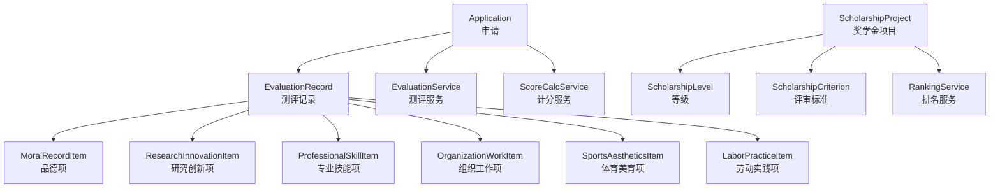
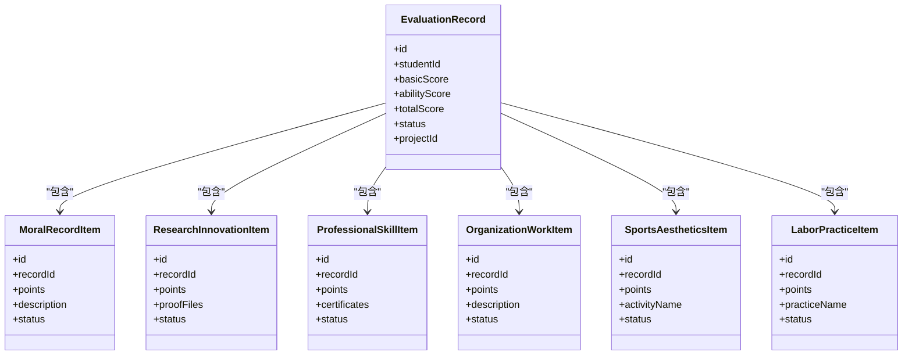
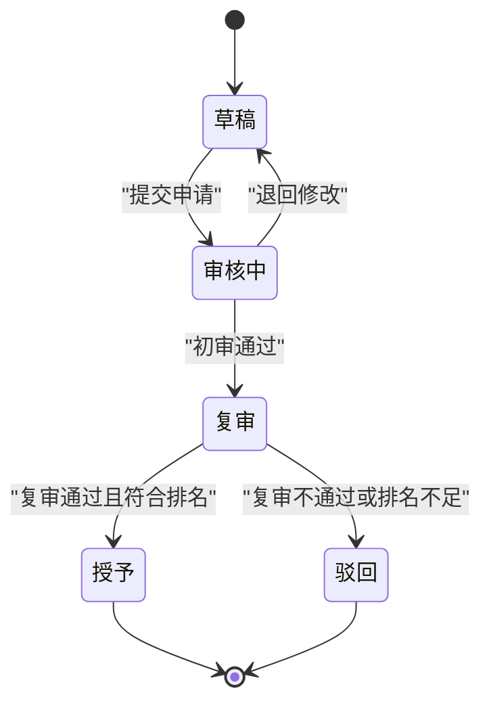
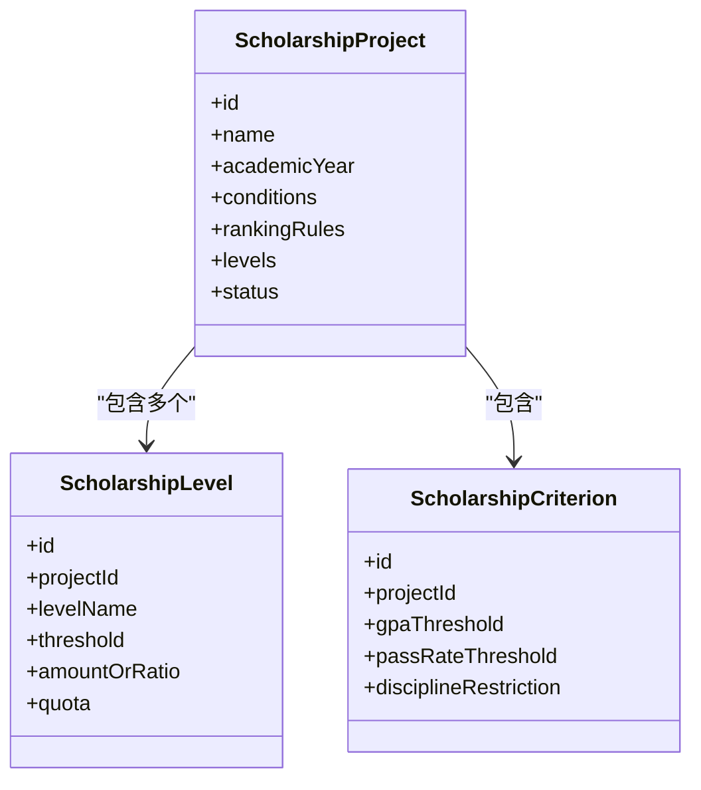
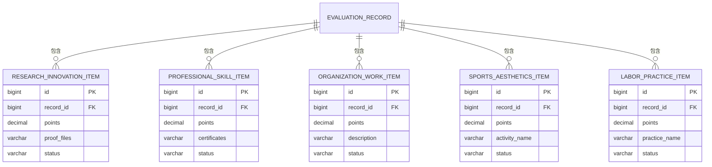
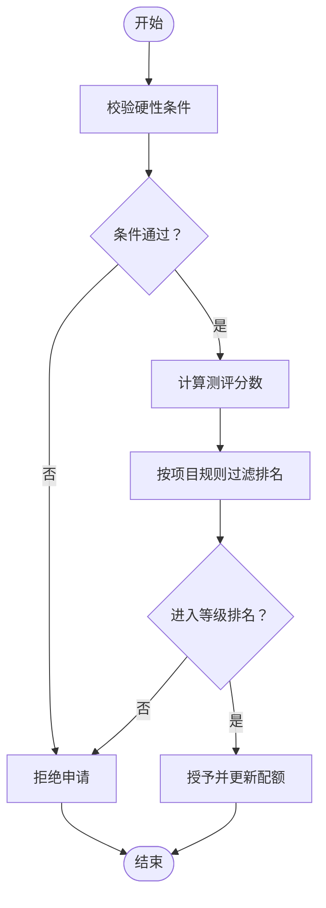
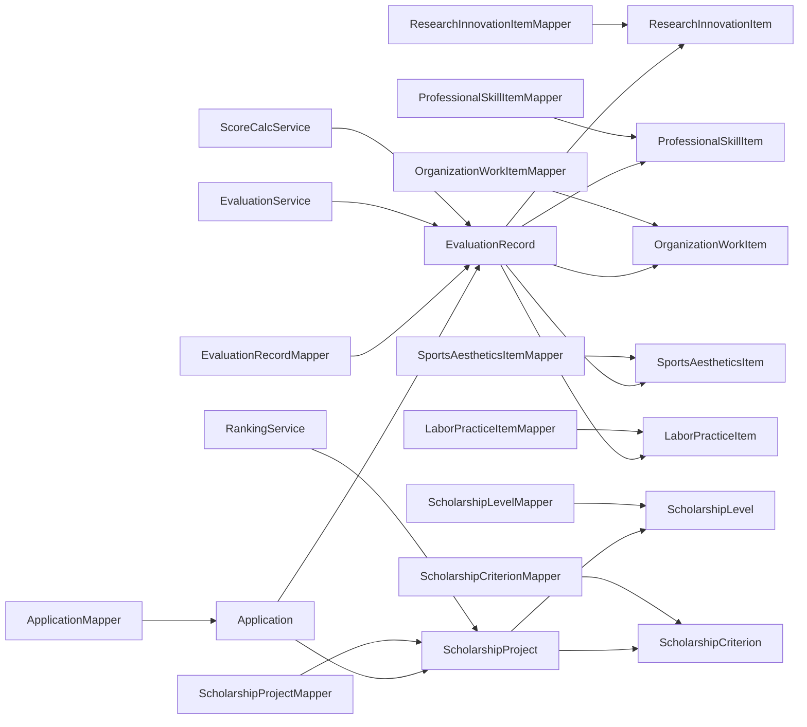

# 业务数据模型

<cite>
**本文引用的文件**
- [Application.java](file://backend/src/main/java/com/zjsu/scholarship/entity/Application.java)
- [EvaluationRecord.java](file://backend/src/main/java/com/zjsu/scholarship/entity/EvaluationRecord.java)
- [MoralRecordItem.java](file://backend/src/main/java/com/zjsu/scholarship/entity/MoralRecordItem.java)
- [ResearchInnovationItem.java](file://backend/src/main/java/com/zjsu/scholarship/entity/ResearchInnovationItem.java)
- [ProfessionalSkillItem.java](file://backend/src/main/java/com/zjsu/scholarship/entity/ProfessionalSkillItem.java)
- [OrganizationWorkItem.java](file://backend/src/main/java/com/zjsu/scholarship/entity/OrganizationWorkItem.java)
- [SportsAestheticsItem.java](file://backend/src/main/java/com/zjsu/scholarship/entity/SportsAestheticsItem.java)
- [LaborPracticeItem.java](file://backend/src/main/java/com/zjsu/scholarship/entity/LaborPracticeItem.java)
- [ScholarshipProject.java](file://backend/src/main/java/com/zjsu/scholarship/entity/ScholarshipProject.java)
- [ScholarshipLevel.java](file://backend/src/main/java/com/zjsu/scholarship/entity/ScholarshipLevel.java)
- [ScholarshipCriterion.java](file://backend/src/main/java/com/zjsu/scholarship/entity/ScholarshipCriterion.java)
- [EvaluationService.java](file://backend/src/main/java/com/zjsu/scholarship/service/EvaluationService.java)
- [ScoreCalcService.java](file://backend/src/main/java/com/zjsu/scholarship/service/ScoreCalcService.java)
- [RankingService.java](file://backend/src/main/java/com/zjsu/scholarship/service/RankingService.java)
- [ApplicationMapper.java](file://backend/src/main/java/com/zjsu/scholarship/mapper/ApplicationMapper.java)
- [EvaluationRecordMapper.java](file://backend/src/main/java/com/zjsu/scholarship/mapper/EvaluationRecordMapper.java)
- [ResearchInnovationItemMapper.java](file://backend/src/main/java/com/zjsu/scholarship/mapper/ResearchInnovationItemMapper.java)
- [ProfessionalSkillItemMapper.java](file://backend/src/main/java/com/zjsu/scholarship/mapper/ProfessionalSkillItemMapper.java)
- [OrganizationWorkItemMapper.java](file://backend/src/main/java/com/zjsu/scholarship/mapper/OrganizationWorkItemMapper.java)
- [SportsAestheticsItemMapper.java](file://backend/src/main/java/com/zjsu/scholarship/mapper/SportsAestheticsItemMapper.java)
- [LaborPracticeItemMapper.java](file://backend/src/main/java/com/zjsu/scholarship/mapper/LaborPracticeItemMapper.java)
- [ScholarshipProjectMapper.java](file://backend/src/main/java/com/zjsu/scholarship/mapper/ScholarshipProjectMapper.java)
- [ScholarshipLevelMapper.java](file://backend/src/main/java/com/zjsu/scholarship/mapper/ScholarshipLevelMapper.java)
- [ScholarshipCriterionMapper.java](file://backend/src/main/java/com/zjsu/scholarship/mapper/ScholarshipCriterionMapper.java)
- [schema.sql](file://backend/src/main/resources/db/schema.sql)
- [data.sql](file://backend/src/main/resources/db/data.sql)
</cite>

## 目录
1. [引言](#引言)
2. [项目结构](#项目结构)
3. [核心组件](#核心组件)
4. [架构总览](#架构总览)
5. [详细组件分析](#详细组件分析)
6. [依赖关系分析](#依赖关系分析)
7. [性能考虑](#性能考虑)
8. [故障排除指南](#故障排除指南)
9. [结论](#结论)
10. [附录](#附录)

## 引言
本文件系统化梳理奖学金管理系统的业务数据模型，重点覆盖以下方面：
- 综合测评模型（evaluation_records）的双轨制设计原理与评分算法
- 申请状态流转（Application）的完整生命周期
- 奖学金项目（ScholarshipProject）的配置模型：硬性条件、排名过滤、等级设置
- 能力项数据结构与评分规则：研究创新、专业技能、组织工作、体育美育、劳动实践
- 业务规则验证机制与数据一致性保障方案
- 典型业务场景的数据模型使用示例与查询优化策略

## 项目结构
后端采用分层架构：entity（实体）、mapper（数据访问）、service（业务服务）、controller（接口层）。数据库脚本位于 resources/db 下，包含 schema.sql 和 data.sql。

```mermaid
graph TB
subgraph "实体层"
E1["Application<br/>申请"]
E2["EvaluationRecord<br/>测评记录"]
E3["MoralRecordItem<br/>品德项"]
E4["ResearchInnovationItem<br/>研究创新项"]
E5["ProfessionalSkillItem<br/>专业技能项"]
E6["OrganizationWorkItem<br/>组织工作项"]
E7["SportsAestheticsItem<br/>体育美育项"]
E8["LaborPracticeItem<br/>劳动实践项"]
E9["ScholarshipProject<br/>奖学金项目"]
E10["ScholarshipLevel<br/>等级"]
E11["ScholarshipCriterion<br/>评审标准"]
end
subgraph "数据访问层"
M1["ApplicationMapper"]
M2["EvaluationRecordMapper"]
M3["ResearchInnovationItemMapper"]
M4["ProfessionalSkillItemMapper"]
M5["OrganizationWorkItemMapper"]
M6["SportsAestheticsItemMapper"]
M7["LaborPracticeItemMapper"]
M8["ScholarshipProjectMapper"]
M9["ScholarshipLevelMapper"]
M10["ScholarshipCriterionMapper"]
end
subgraph "业务服务层"
S1["EvaluationService"]
S2["ScoreCalcService"]
S3["RankingService"]
end
E1 --> M1
E2 --> M2
E4 --> M3
E5 --> M4
E6 --> M5
E7 --> M6
E8 --> M7
E9 --> M8
E10 --> M9
E11 --> M10
E1 --> S1
E2 --> S1
E1 --> S2
E9 --> S3
```

**图表来源**
- [Application.java](file://backend/src/main/java/com/zjsu/scholarship/entity/Application.java)
- [EvaluationRecord.java](file://backend/src/main/java/com/zjsu/scholarship/entity/EvaluationRecord.java)
- [ResearchInnovationItem.java](file://backend/src/main/java/com/zjsu/scholarship/entity/ResearchInnovationItem.java)
- [ProfessionalSkillItem.java](file://backend/src/main/java/com/zjsu/scholarship/entity/ProfessionalSkillItem.java)
- [OrganizationWorkItem.java](file://backend/src/main/java/com/zjsu/scholarship/entity/OrganizationWorkItem.java)
- [SportsAestheticsItem.java](file://backend/src/main/java/com/zjsu/scholarship/entity/SportsAestheticsItem.java)
- [LaborPracticeItem.java](file://backend/src/main/java/com/zjsu/scholarship/entity/LaborPracticeItem.java)
- [ScholarshipProject.java](file://backend/src/main/java/com/zjsu/scholarship/entity/ScholarshipProject.java)
- [ScholarshipLevel.java](file://backend/src/main/java/com/zjsu/scholarship/entity/ScholarshipLevel.java)
- [ScholarshipCriterion.java](file://backend/src/main/java/com/zjsu/scholarship/entity/ScholarshipCriterion.java)
- [ApplicationMapper.java](file://backend/src/main/java/com/zjsu/scholarship/mapper/ApplicationMapper.java)
- [EvaluationRecordMapper.java](file://backend/src/main/java/com/zjsu/scholarship/mapper/EvaluationRecordMapper.java)
- [ResearchInnovationItemMapper.java](file://backend/src/main/java/com/zjsu/scholarship/mapper/ResearchInnovationItemMapper.java)
- [ProfessionalSkillItemMapper.java](file://backend/src/main/java/com/zjsu/scholarship/mapper/ProfessionalSkillItemMapper.java)
- [OrganizationWorkItemMapper.java](file://backend/src/main/java/com/zjsu/scholarship/mapper/OrganizationWorkItemMapper.java)
- [SportsAestheticsItemMapper.java](file://backend/src/main/java/com/zjsu/scholarship/mapper/SportsAestheticsItemMapper.java)
- [LaborPracticeItemMapper.java](file://backend/src/main/java/com/zjsu/scholarship/mapper/LaborPracticeItemMapper.java)
- [ScholarshipProjectMapper.java](file://backend/src/main/java/com/zjsu/scholarship/mapper/ScholarshipProjectMapper.java)
- [ScholarshipLevelMapper.java](file://backend/src/main/java/com/zjsu/scholarship/mapper/ScholarshipLevelMapper.java)
- [ScholarshipCriterionMapper.java](file://backend/src/main/java/com/zjsu/scholarship/mapper/ScholarshipCriterionMapper.java)
- [EvaluationService.java](file://backend/src/main/java/com/zjsu/scholarship/service/EvaluationService.java)
- [ScoreCalcService.java](file://backend/src/main/java/com/zjsu/scholarship/service/ScoreCalcService.java)
- [RankingService.java](file://backend/src/main/java/com/zjsu/scholarship/service/RankingService.java)

**章节来源**
- [schema.sql](file://backend/src/main/resources/db/schema.sql)
- [data.sql](file://backend/src/main/resources/db/data.sql)

## 核心组件
本节聚焦四大核心业务对象：综合测评模型、申请生命周期、奖学金项目配置、能力项评分。

- 综合测评模型（evaluation_records）
  - 双轨制设计：基本项（品德+专业）与能力项（研究创新+专业技能+组织工作+体育美育+劳动实践）
  - 评分算法：各能力项独立计算，叠加形成总分；基本项权重由项目配置决定
- 申请状态流转（Application）
  - 生命周期：草稿 → 审核中 → 复审 → 授予/驳回
  - 状态迁移受项目规则与排名过滤约束
- 奖学金项目配置（ScholarshipProject）
  - 硬性条件：必修课程通过率、平均绩点阈值、纪律处分限制
  - 排名过滤：按班级/年级/学院维度进行排名门槛控制
  - 等级设置：多等级阈值与金额/比例配置
- 能力项数据结构与评分规则
  - research_innovation_items、professional_skill_items、organization_work_items、sports_aesthetics_items、labor_practice_items

**章节来源**
- [EvaluationRecord.java](file://backend/src/main/java/com/zjsu/scholarship/entity/EvaluationRecord.java)
- [Application.java](file://backend/src/main/java/com/zjsu/scholarship/entity/Application.java)
- [ScholarshipProject.java](file://backend/src/main/java/com/zjsu/scholarship/entity/ScholarshipProject.java)
- [ResearchInnovationItem.java](file://backend/src/main/java/com/zjsu/scholarship/entity/ResearchInnovationItem.java)
- [ProfessionalSkillItem.java](file://backend/src/main/java/com/zjsu/scholarship/entity/ProfessionalSkillItem.java)
- [OrganizationWorkItem.java](file://backend/src/main/java/com/zjsu/scholarship/entity/OrganizationWorkItem.java)
- [SportsAestheticsItem.java](file://backend/src/main/java/com/zjsu/scholarship/entity/SportsAestheticsItem.java)
- [LaborPracticeItem.java](file://backend/src/main/java/com/zjsu/scholarship/entity/LaborPracticeItem.java)

## 架构总览
下图展示业务数据模型在系统中的交互关系：实体定义、数据访问层映射、业务服务处理与状态流转。

**图表来源**
- [Application.java](file://backend/src/main/java/com/zjsu/scholarship/entity/Application.java)
- [EvaluationRecord.java](file://backend/src/main/java/com/zjsu/scholarship/entity/EvaluationRecord.java)
- [MoralRecordItem.java](file://backend/src/main/java/com/zjsu/scholarship/entity/MoralRecordItem.java)
- [ResearchInnovationItem.java](file://backend/src/main/java/com/zjsu/scholarship/entity/ResearchInnovationItem.java)
- [ProfessionalSkillItem.java](file://backend/src/main/java/com/zjsu/scholarship/entity/ProfessionalSkillItem.java)
- [OrganizationWorkItem.java](file://backend/src/main/java/com/zjsu/scholarship/entity/OrganizationWorkItem.java)
- [SportsAestheticsItem.java](file://backend/src/main/java/com/zjsu/scholarship/entity/SportsAestheticsItem.java)
- [LaborPracticeItem.java](file://backend/src/main/java/com/zjsu/scholarship/entity/LaborPracticeItem.java)
- [ScholarshipProject.java](file://backend/src/main/java/com/zjsu/scholarship/entity/ScholarshipProject.java)
- [ScholarshipLevel.java](file://backend/src/main/java/com/zjsu/scholarship/entity/ScholarshipLevel.java)
- [ScholarshipCriterion.java](file://backend/src/main/java/com/zjsu/scholarship/entity/ScholarshipCriterion.java)
- [EvaluationService.java](file://backend/src/main/java/com/zjsu/scholarship/service/EvaluationService.java)
- [ScoreCalcService.java](file://backend/src/main/java/com/zjsu/scholarship/service/ScoreCalcService.java)
- [RankingService.java](file://backend/src/main/java/com/zjsu/scholarship/service/RankingService.java)

## 详细组件分析

### 综合测评模型（evaluation_records）双轨制设计
- 设计原理
  - 基本项：品德与专业基础素养，体现学生综合素质与学业表现
  - 能力项：研究创新、专业技能、组织工作、体育美育、劳动实践，鼓励多元发展
- 数据结构要点
  - 基本项：对应品德项与专业项的明细与得分
  - 能力项：每类能力项独立记录，含评分依据、证明材料、审核状态
- 评分算法
  - 各能力项独立计算，汇总为总分
  - 基本项权重由项目配置决定，能力项权重可按项目设定
  - 最终得分 = 基本项加权分 + 能力项加权分

**图表来源**
- [EvaluationRecord.java](file://backend/src/main/java/com/zjsu/scholarship/entity/EvaluationRecord.java)
- [MoralRecordItem.java](file://backend/src/main/java/com/zjsu/scholarship/entity/MoralRecordItem.java)
- [ResearchInnovationItem.java](file://backend/src/main/java/com/zjsu/scholarship/entity/ResearchInnovationItem.java)
- [ProfessionalSkillItem.java](file://backend/src/main/java/com/zjsu/scholarship/entity/ProfessionalSkillItem.java)
- [OrganizationWorkItem.java](file://backend/src/main/java/com/zjsu/scholarship/entity/OrganizationWorkItem.java)
- [SportsAestheticsItem.java](file://backend/src/main/java/com/zjsu/scholarship/entity/SportsAestheticsItem.java)
- [LaborPracticeItem.java](file://backend/src/main/java/com/zjsu/scholarship/entity/LaborPracticeItem.java)

**章节来源**
- [EvaluationRecord.java](file://backend/src/main/java/com/zjsu/scholarship/entity/EvaluationRecord.java)
- [MoralRecordItem.java](file://backend/src/main/java/com/zjsu/scholarship/entity/MoralRecordItem.java)
- [ResearchInnovationItem.java](file://backend/src/main/java/com/zjsu/scholarship/entity/ResearchInnovationItem.java)
- [ProfessionalSkillItem.java](file://backend/src/main/java/com/zjsu/scholarship/entity/ProfessionalSkillItem.java)
- [OrganizationWorkItem.java](file://backend/src/main/java/com/zjsu/scholarship/entity/OrganizationWorkItem.java)
- [SportsAestheticsItem.java](file://backend/src/main/java/com/zjsu/scholarship/entity/SportsAestheticsItem.java)
- [LaborPracticeItem.java](file://backend/src/main/java/com/zjsu/scholarship/entity/LaborPracticeItem.java)

### 申请状态流转（Application）业务逻辑
- 生命周期阶段
  - 草稿：学生填写基本信息与材料
  - 审核中：辅导员/班主任初审
  - 复审：学院复审
  - 授予/驳回：根据项目规则与排名确定结果
- 关键控制点
  - 状态迁移需满足项目硬性条件与排名门槛
  - 每个阶段的审核人角色与权限由系统控制
  - 授予后生成相应记录并更新项目配额

**图表来源**
- [Application.java](file://backend/src/main/java/com/zjsu/scholarship/entity/Application.java)

**章节来源**
- [Application.java](file://backend/src/main/java/com/zjsu/scholarship/entity/Application.java)

### 奖学金项目配置（ScholarshipProject）模型
- 硬性条件
  - 必修课程通过率阈值
  - 平均绩点（GPA）最低要求
  - 违纪处分限制（如取消参评资格）
- 排名过滤
  - 支持按班级、年级、学院维度设置排名门槛
  - 可配置不同等级的排名比例或人数上限
- 等级设置
  - 多等级阈值（如特等奖、一等奖、二等奖）
  - 对应金额或比例分配，以及等级人数上限

**图表来源**
- [ScholarshipProject.java](file://backend/src/main/java/com/zjsu/scholarship/entity/ScholarshipProject.java)
- [ScholarshipLevel.java](file://backend/src/main/java/com/zjsu/scholarship/entity/ScholarshipLevel.java)
- [ScholarshipCriterion.java](file://backend/src/main/java/com/zjsu/scholarship/entity/ScholarshipCriterion.java)

**章节来源**
- [ScholarshipProject.java](file://backend/src/main/java/com/zjsu/scholarship/entity/ScholarshipProject.java)
- [ScholarshipLevel.java](file://backend/src/main/java/com/zjsu/scholarship/entity/ScholarshipLevel.java)
- [ScholarshipCriterion.java](file://backend/src/main/java/com/zjsu/scholarship/entity/ScholarshipCriterion.java)

### 能力项数据结构与评分规则
- 研究创新项（research_innovation_items）
  - 记录类型：论文、专利、竞赛获奖、学术活动等
  - 评分依据：级别、等级、数量、证明材料
- 专业技能项（professional_skill_items）
  - 记录类型：职业资格证书、技能等级证书、培训结业等
  - 评分依据：证书等级、颁发机构、有效期
- 组织工作项（organization_work_items）
  - 记录类型：学生干部任职、社团活动、志愿服务等
  - 评分依据：职务级别、时长、贡献评价
- 体育美育项（sports_aesthetics_items）
  - 记录类型：体育竞赛、艺术活动、健康促进等
  - 评分依据：比赛等级、参与形式、成果证明
- 劳动实践项（labor_practice_items）
  - 记录类型：社会实践、实习、公益劳动等
  - 评分依据：时长、单位评价、证明材料

**图表来源**
- [ResearchInnovationItem.java](file://backend/src/main/java/com/zjsu/scholarship/entity/ResearchInnovationItem.java)
- [ProfessionalSkillItem.java](file://backend/src/main/java/com/zjsu/scholarship/entity/ProfessionalSkillItem.java)
- [OrganizationWorkItem.java](file://backend/src/main/java/com/zjsu/scholarship/entity/OrganizationWorkItem.java)
- [SportsAestheticsItem.java](file://backend/src/main/java/com/zjsu/scholarship/entity/SportsAestheticsItem.java)
- [LaborPracticeItem.java](file://backend/src/main/java/com/zjsu/scholarship/entity/LaborPracticeItem.java)
- [EvaluationRecord.java](file://backend/src/main/java/com/zjsu/scholarship/entity/EvaluationRecord.java)

**章节来源**
- [ResearchInnovationItem.java](file://backend/src/main/java/com/zjsu/scholarship/entity/ResearchInnovationItem.java)
- [ProfessionalSkillItem.java](file://backend/src/main/java/com/zjsu/scholarship/entity/ProfessionalSkillItem.java)
- [OrganizationWorkItem.java](file://backend/src/main/java/com/zjsu/scholarship/entity/OrganizationWorkItem.java)
- [SportsAestheticsItem.java](file://backend/src/main/java/com/zjsu/scholarship/entity/SportsAestheticsItem.java)
- [LaborPracticeItem.java](file://backend/src/main/java/com/zjsu/scholarship/entity/LaborPracticeItem.java)

### 业务规则验证机制与数据一致性
- 规则验证
  - 申请提交前校验硬性条件（GPA、通过率、处分）
  - 申请提交后按项目规则进行排名过滤
  - 测评记录审核时校验能力项证明材料完整性
- 数据一致性
  - 使用事务确保状态变更与计分同步
  - 通过唯一索引与外键约束保证关联完整性
  - 服务层统一入口，避免脏写

**图表来源**
- [ScholarshipProject.java](file://backend/src/main/java/com/zjsu/scholarship/entity/ScholarshipProject.java)
- [Application.java](file://backend/src/main/java/com/zjsu/scholarship/entity/Application.java)
- [EvaluationRecord.java](file://backend/src/main/java/com/zjsu/scholarship/entity/EvaluationRecord.java)

**章节来源**
- [ScholarshipProject.java](file://backend/src/main/java/com/zjsu/scholarship/entity/ScholarshipProject.java)
- [Application.java](file://backend/src/main/java/com/zjsu/scholarship/entity/Application.java)
- [EvaluationRecord.java](file://backend/src/main/java/com/zjsu/scholarship/entity/EvaluationRecord.java)

### 典型业务场景与查询优化策略
- 场景一：学生提交申请并查看状态
  - 查询路径：ApplicationMapper.selectByStudentId → ApplicationMapper.selectStatus
  - 优化建议：为 student_id、status 添加复合索引
- 场景二：辅导员批量审核
  - 查询路径：ApplicationMapper.selectByCounselor → ApplicationMapper.updateStatusBatch
  - 优化建议：分页查询 + 批量更新，减少网络往返
- 场景三：项目排名统计
  - 查询路径：RankingService.rankApplications → ScholarshipLevelMapper.selectLevels
  - 优化建议：缓存项目等级阈值，避免重复查询
- 场景四：能力项材料审核
  - 查询路径：各 Item Mapper 的 selectByRecordId → updateStatus
  - 优化建议：按 record_id 分组查询，批量审批

**章节来源**
- [ApplicationMapper.java](file://backend/src/main/java/com/zjsu/scholarship/mapper/ApplicationMapper.java)
- [ScholarshipLevelMapper.java](file://backend/src/main/java/com/zjsu/scholarship/mapper/ScholarshipLevelMapper.java)
- [RankingService.java](file://backend/src/main/java/com/zjsu/scholarship/service/RankingService.java)

## 依赖关系分析
- 实体间依赖
  - Application 依赖 EvaluationRecord 与 ScholarshipProject
  - EvaluationRecord 包含多种能力项实体
  - ScholarshipProject 包含等级与评审标准
- 数据访问层依赖
  - 各 Mapper 与对应实体一一对应
  - 业务服务层依赖 Mapper 与实体
- 服务层依赖
  - EvaluationService 负责测评流程
  - ScoreCalcService 负责计分
  - RankingService 负责排名与等级匹配

**图表来源**
- [Application.java](file://backend/src/main/java/com/zjsu/scholarship/entity/Application.java)
- [EvaluationRecord.java](file://backend/src/main/java/com/zjsu/scholarship/entity/EvaluationRecord.java)
- [ResearchInnovationItem.java](file://backend/src/main/java/com/zjsu/scholarship/entity/ResearchInnovationItem.java)
- [ProfessionalSkillItem.java](file://backend/src/main/java/com/zjsu/scholarship/entity/ProfessionalSkillItem.java)
- [OrganizationWorkItem.java](file://backend/src/main/java/com/zjsu/scholarship/entity/OrganizationWorkItem.java)
- [SportsAestheticsItem.java](file://backend/src/main/java/com/zjsu/scholarship/entity/SportsAestheticsItem.java)
- [LaborPracticeItem.java](file://backend/src/main/java/com/zjsu/scholarship/entity/LaborPracticeItem.java)
- [ScholarshipProject.java](file://backend/src/main/java/com/zjsu/scholarship/entity/ScholarshipProject.java)
- [ScholarshipLevel.java](file://backend/src/main/java/com/zjsu/scholarship/entity/ScholarshipLevel.java)
- [ScholarshipCriterion.java](file://backend/src/main/java/com/zjsu/scholarship/entity/ScholarshipCriterion.java)
- [ApplicationMapper.java](file://backend/src/main/java/com/zjsu/scholarship/mapper/ApplicationMapper.java)
- [EvaluationRecordMapper.java](file://backend/src/main/java/com/zjsu/scholarship/mapper/EvaluationRecordMapper.java)
- [ResearchInnovationItemMapper.java](file://backend/src/main/java/com/zjsu/scholarship/mapper/ResearchInnovationItemMapper.java)
- [ProfessionalSkillItemMapper.java](file://backend/src/main/java/com/zjsu/scholarship/mapper/ProfessionalSkillItemMapper.java)
- [OrganizationWorkItemMapper.java](file://backend/src/main/java/com/zjsu/scholarship/mapper/OrganizationWorkItemMapper.java)
- [SportsAestheticsItemMapper.java](file://backend/src/main/java/com/zjsu/scholarship/mapper/SportsAestheticsItemMapper.java)
- [LaborPracticeItemMapper.java](file://backend/src/main/java/com/zjsu/scholarship/mapper/LaborPracticeItemMapper.java)
- [ScholarshipProjectMapper.java](file://backend/src/main/java/com/zjsu/scholarship/mapper/ScholarshipProjectMapper.java)
- [ScholarshipLevelMapper.java](file://backend/src/main/java/com/zjsu/scholarship/mapper/ScholarshipLevelMapper.java)
- [ScholarshipCriterionMapper.java](file://backend/src/main/java/com/zjsu/scholarship/mapper/ScholarshipCriterionMapper.java)
- [EvaluationService.java](file://backend/src/main/java/com/zjsu/scholarship/service/EvaluationService.java)
- [ScoreCalcService.java](file://backend/src/main/java/com/zjsu/scholarship/service/ScoreCalcService.java)
- [RankingService.java](file://backend/src/main/java/com/zjsu/scholarship/service/RankingService.java)

**章节来源**
- [EvaluationService.java](file://backend/src/main/java/com/zjsu/scholarship/service/EvaluationService.java)
- [ScoreCalcService.java](file://backend/src/main/java/com/zjsu/scholarship/service/ScoreCalcService.java)
- [RankingService.java](file://backend/src/main/java/com/zjsu/scholarship/service/RankingService.java)

## 性能考虑
- 查询优化
  - 为高频查询字段建立索引：student_id、status、record_id、project_id
  - 使用分页查询避免一次性加载大量数据
  - 缓存项目等级阈值与硬性条件，减少重复查询
- 写入优化
  - 批量插入与更新，降低数据库往返次数
  - 使用事务保证状态变更与计分的一致性
- 读写分离
  - 报表与统计查询走只读副本
  - 业务主流程保持单实例写入

## 故障排除指南
- 常见问题
  - 申请无法提交：检查 GPA 与通过率是否满足硬性条件
  - 排名不足被拒：确认所在班级/年级/学院的排名门槛
  - 材料缺失导致审核失败：核查能力项证明材料是否上传完整
- 排查步骤
  - 核对 Application 状态与历史记录
  - 检查 EvaluationRecord 的各项得分与状态
  - 验证 ScholarshipProject 的等级阈值与配额
- 修复建议
  - 补充材料后重新提交
  - 联系管理员调整项目配置（如阈值或配额）

**章节来源**
- [Application.java](file://backend/src/main/java/com/zjsu/scholarship/entity/Application.java)
- [EvaluationRecord.java](file://backend/src/main/java/com/zjsu/scholarship/entity/EvaluationRecord.java)
- [ScholarshipProject.java](file://backend/src/main/java/com/zjsu/scholarship/entity/ScholarshipProject.java)

## 结论
本数据模型以“双轨制测评 + 多维能力项”为核心，结合严格的项目配置与排名过滤，实现了公平、透明、可追溯的奖学金评选体系。通过服务层统一校验与事务控制，保障了业务规则与数据一致性。建议在实际部署中配合索引优化与缓存策略，进一步提升系统性能与用户体验。

## 附录
- 数据库脚本位置
  - [schema.sql](file://backend/src/main/resources/db/schema.sql)
  - [data.sql](file://backend/src/main/resources/db/data.sql)