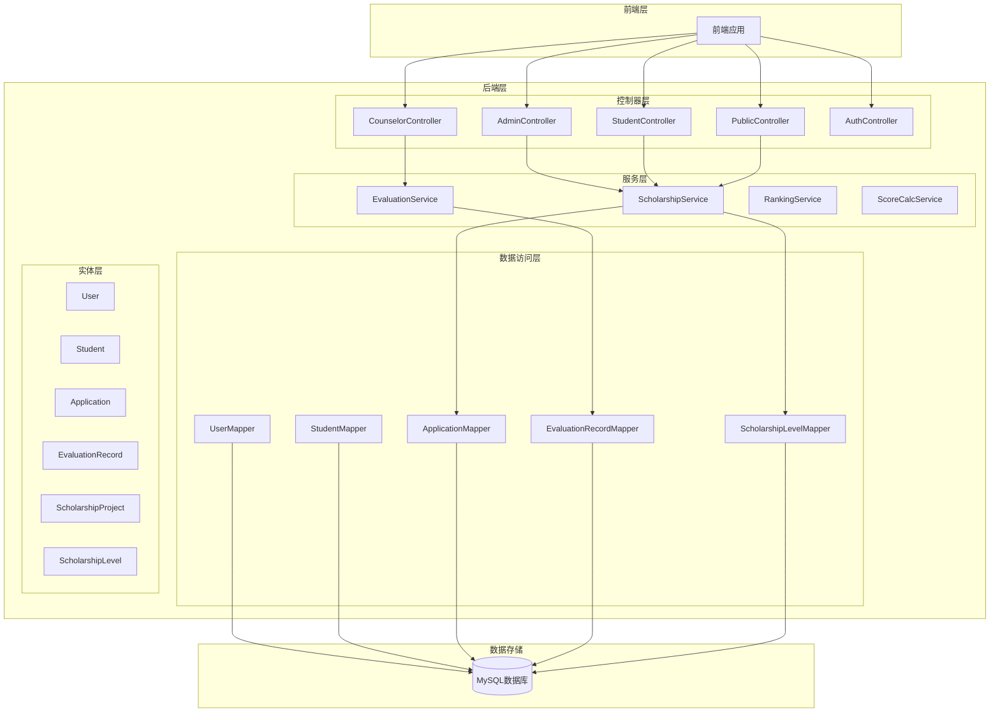
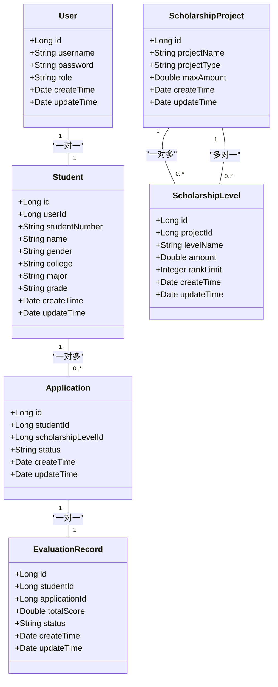
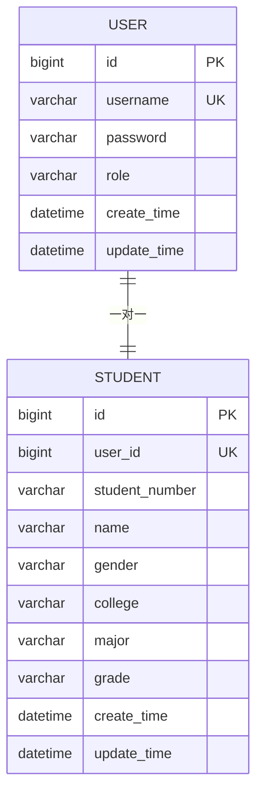
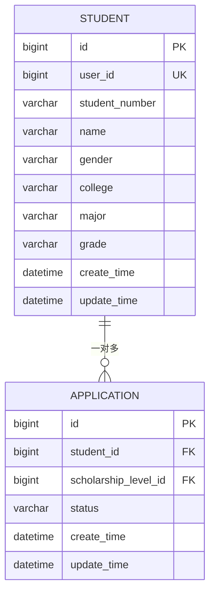
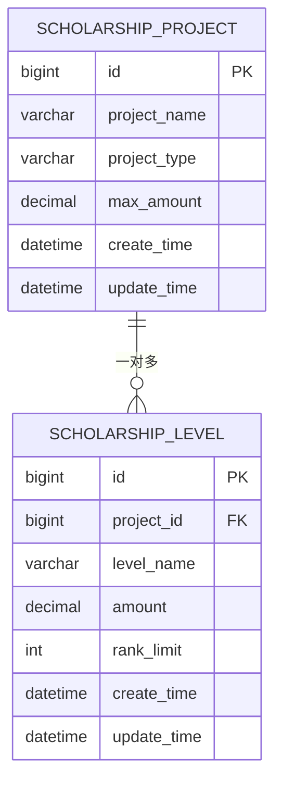
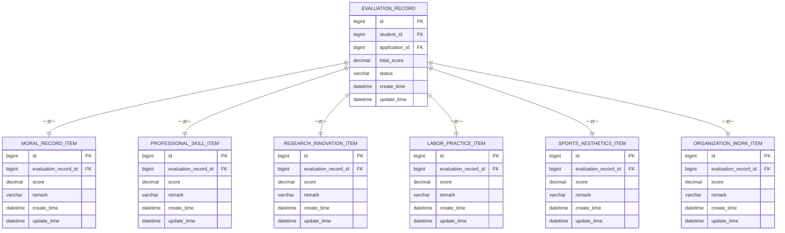
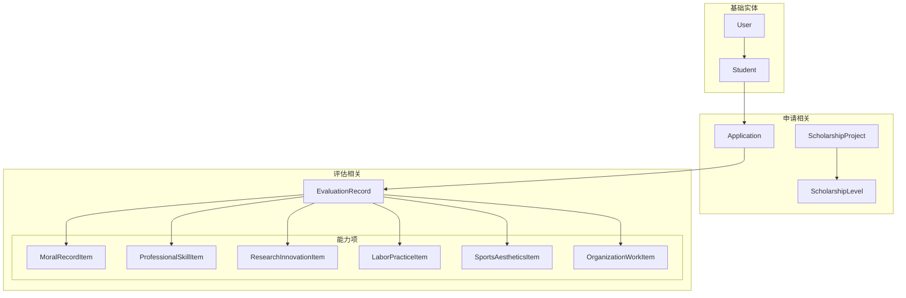

# 实体关系设计

<cite>
**本文档引用的文件**
- [schema.sql](file://backend/src/main/resources/db/schema.sql)
- [data.sql](file://backend/src/main/resources/db/data.sql)
- [User.java](file://backend/src/main/java/com/zjsu/scholarship/entity/User.java)
- [Student.java](file://backend/src/main/java/com/zjsu/scholarship/entity/Student.java)
- [Application.java](file://backend/src/main/java/com/zjsu/scholarship/entity/Application.java)
- [ScholarshipProject.java](file://backend/src/main/java/com/zjsu/scholarship/entity/ScholarshipProject.java)
- [ScholarshipLevel.java](file://backend/src/main/java/com/zjsu/scholarship/entity/ScholarshipLevel.java)
- [EvaluationRecord.java](file://backend/src/main/java/com/zjsu/scholarship/entity/EvaluationRecord.java)
- [MoralRecordItem.java](file://backend/src/main/java/com/zjsu/scholarship/entity/MoralRecordItem.java)
- [ProfessionalSkillItem.java](file://backend/src/main/java/com/zjsu/scholarship/entity/ProfessionalSkillItem.java)
- [ResearchInnovationItem.java](file://backend/src/main/java/com/zjsu/scholarship/entity/ResearchInnovationItem.java)
- [LaborPracticeItem.java](file://backend/src/main/java/com/zjsu/scholarship/entity/LaborPracticeItem.java)
- [SportsAestheticsItem.java](file://backend/src/main/java/com/zjsu/scholarship/entity/SportsAestheticsItem.java)
- [OrganizationWorkItem.java](file://backend/src/main/java/com/zjsu/scholarship/entity/OrganizationWorkItem.java)
- [CourseGrade.java](file://backend/src/main/java/com/zjsu/scholarship/entity/CourseGrade.java)
</cite>

## 目录
1. [引言](#引言)
2. [项目结构](#项目结构)
3. [核心组件](#核心组件)
4. [架构概览](#架构概览)
5. [详细组件分析](#详细组件分析)
6. [依赖分析](#依赖分析)
7. [性能考虑](#性能考虑)
8. [故障排除指南](#故障排除指南)
9. [结论](#结论)

## 引言

本文件为奖学金管理系统实体关系设计文档，基于数据库模式文件和实体类定义，详细说明系统中各实体间的关联关系和业务逻辑。该系统采用标准的关系型数据库设计，通过外键约束保证参照完整性，并通过联合唯一约束确保业务规则的执行。

## 项目结构

奖学金管理系统采用典型的三层架构设计，包含以下核心模块：

**图表来源**
- [schema.sql](file://backend/src/main/resources/db/schema.sql)
- [User.java](file://backend/src/main/java/com/zjsu/scholarship/entity/User.java)
- [Student.java](file://backend/src/main/java/com/zjsu/scholarship/entity/Student.java)

**章节来源**
- [schema.sql](file://backend/src/main/resources/db/schema.sql)
- [User.java](file://backend/src/main/java/com/zjsu/scholarship/entity/User.java)

## 核心组件

系统的核心实体包括用户管理、学生信息、申请管理和评估记录等关键业务实体。每个实体都遵循统一的命名规范和设计原则。

### 用户管理实体
- **User实体**：系统基础用户表，包含用户身份认证信息
- **Student实体**：学生基本信息表，与User实体建立一对一关系

### 申请管理实体
- **Application实体**：奖学金申请表，与Student实体建立一对多关系
- **ScholarshipProject实体**：奖学金项目表，定义各类奖学金项目
- **ScholarshipLevel实体**：奖学金等级表，与项目形成多对一关系

### 评估管理实体
- **EvaluationRecord实体**：评估记录表，记录学生的各项能力评估
- **能力项实体组**：包括道德品行、专业技能、研究创新、劳动实践、体育美学、组织工作等

**章节来源**
- [Student.java](file://backend/src/main/java/com/zjsu/scholarship/entity/Student.java)
- [Application.java](file://backend/src/main/java/com/zjsu/scholarship/entity/Application.java)
- [ScholarshipProject.java](file://backend/src/main/java/com/zjsu/scholarship/entity/ScholarshipProject.java)
- [ScholarshipLevel.java](file://backend/src/main/java/com/zjsu/scholarship/entity/ScholarshipLevel.java)
- [EvaluationRecord.java](file://backend/src/main/java/com/zjsu/scholarship/entity/EvaluationRecord.java)

## 架构概览

系统采用标准的企业级Java Spring Boot架构，通过清晰的分层设计实现业务逻辑的分离和数据访问的抽象化。

**图表来源**
- [User.java](file://backend/src/main/java/com/zjsu/scholarship/entity/User.java)
- [Student.java](file://backend/src/main/java/com/zjsu/scholarship/entity/Student.java)
- [Application.java](file://backend/src/main/java/com/zjsu/scholarship/entity/Application.java)
- [ScholarshipProject.java](file://backend/src/main/java/com/zjsu/scholarship/entity/ScholarshipProject.java)
- [ScholarshipLevel.java](file://backend/src/main/java/com/zjsu/scholarship/entity/ScholarshipLevel.java)
- [EvaluationRecord.java](file://backend/src/main/java/com/zjsu/scholarship/entity/EvaluationRecord.java)

## 详细组件分析

### 用户与学生实体关系

User与Student实体之间建立了一对一的强关联关系，这种设计确保了系统中每个用户的唯一性和完整性。

**图表来源**
- [User.java](file://backend/src/main/java/com/zjsu/scholarship/entity/User.java)
- [Student.java](file://backend/src/main/java/com/zjsu/scholarship/entity/Student.java)

这种一对一关系的设计原则：
- **外键约束**：Student.user_id字段作为外键引用User.id，确保数据完整性
- **联合唯一约束**：User.username和Student.student_number的唯一性保证用户标识的唯一性
- **业务一致性**：每个学生必须对应一个有效的User账户，反之亦然

**章节来源**
- [User.java](file://backend/src/main/java/com/zjsu/scholarship/entity/User.java)
- [Student.java](file://backend/src/main/java/com/zjsu/scholarship/entity/Student.java)

### 学生与申请实体关系

Student与Application实体之间建立了典型的一对多关系，体现了学生可以申请多个奖学金项目的业务需求。

**图表来源**
- [Student.java](file://backend/src/main/java/com/zjsu/scholarship/entity/Student.java)
- [Application.java](file://backend/src/main/java/com/zjsu/scholarship/entity/Application.java)

**章节来源**
- [Application.java](file://backend/src/main/java/com/zjsu/scholarship/entity/Application.java)

### 奖学金项目与等级实体关系

ScholarshipProject与ScholarshipLevel实体之间形成了多对一的关系，体现了项目下包含多个等级的层次结构。

**图表来源**
- [ScholarshipProject.java](file://backend/src/main/java/com/zjsu/scholarship/entity/ScholarshipProject.java)
- [ScholarshipLevel.java](file://backend/src/main/java/com/zjsu/scholarship/entity/ScholarshipLevel.java)

**章节来源**
- [ScholarshipProject.java](file://backend/src/main/java/com/zjsu/scholarship/entity/ScholarshipProject.java)
- [ScholarshipLevel.java](file://backend/src/main/java/com/zjsu/scholarship/entity/ScholarshipLevel.java)

### 评估记录与能力项组合关系

EvaluationRecord与各项能力项之间形成了复杂的组合关系，通过独立的实体表实现灵活的能力评估体系。

**图表来源**
- [EvaluationRecord.java](file://backend/src/main/java/com/zjsu/scholarship/entity/EvaluationRecord.java)
- [MoralRecordItem.java](file://backend/src/main/java/com/zjsu/scholarship/entity/MoralRecordItem.java)
- [ProfessionalSkillItem.java](file://backend/src/main/java/com/zjsu/scholarship/entity/ProfessionalSkillItem.java)
- [ResearchInnovationItem.java](file://backend/src/main/java/com/zjsu/scholarship/entity/ResearchInnovationItem.java)
- [LaborPracticeItem.java](file://backend/src/main/java/com/zjsu/scholarship/entity/LaborPracticeItem.java)
- [SportsAestheticsItem.java](file://backend/src/main/java/com/zjsu/scholarship/entity/SportsAestheticsItem.java)
- [OrganizationWorkItem.java](file://backend/src/main/java/com/zjsu/scholarship/entity/OrganizationWorkItem.java)

**章节来源**
- [EvaluationRecord.java](file://backend/src/main/java/com/zjsu/scholarship/entity/EvaluationRecord.java)
- [MoralRecordItem.java](file://backend/src/main/java/com/zjsu/scholarship/entity/MoralRecordItem.java)
- [ProfessionalSkillItem.java](file://backend/src/main/java/com/zjsu/scholarship/entity/ProfessionalSkillItem.java)
- [ResearchInnovationItem.java](file://backend/src/main/java/com/zjsu/scholarship/entity/ResearchInnovationItem.java)
- [LaborPracticeItem.java](file://backend/src/main/java/com/zjsu/scholarship/entity/LaborPracticeItem.java)
- [SportsAestheticsItem.java](file://backend/src/main/java/com/zjsu/scholarship/entity/SportsAestheticsItem.java)
- [OrganizationWorkItem.java](file://backend/src/main/java/com/zjsu/scholarship/entity/OrganizationWorkItem.java)

### 外键约束设计原则

系统中的外键约束设计严格遵循以下原则：

1. **参照完整性**：所有外键引用都指向对应的主键，确保删除和更新操作的一致性
2. **级联操作**：根据业务需求设置适当的级联删除和更新策略
3. **索引优化**：对外键字段建立索引以提高查询性能
4. **数据类型一致性**：确保外键字段与被引用字段的数据类型完全匹配

### 联合唯一约束应用场景

系统中应用了两个重要的联合唯一约束：

#### uk_app_ug 约束
- **应用场景**：确保同一学生在同一申请周期内只能提交一次申请
- **业务意义**：防止重复申请，维护申请流程的规范性
- **约束字段**：student_id + scholarship_level_id

#### uk_eval_ug 约束  
- **应用场景**：确保评估记录的唯一性，避免重复评估
- **业务意义**：保证评估结果的准确性和可追溯性
- **约束字段**：student_id + application_id

**章节来源**
- [schema.sql](file://backend/src/main/resources/db/schema.sql)

## 依赖分析

系统实体间存在复杂的依赖关系，通过依赖图可以清晰地展示这些关系：

**图表来源**
- [schema.sql](file://backend/src/main/resources/db/schema.sql)
- [User.java](file://backend/src/main/java/com/zjsu/scholarship/entity/User.java)
- [Student.java](file://backend/src/main/java/com/zjsu/scholarship/entity/Student.java)
- [Application.java](file://backend/src/main/java/com/zjsu/scholarship/entity/Application.java)
- [ScholarshipProject.java](file://backend/src/main/java/com/zjsu/scholarship/entity/ScholarshipProject.java)
- [ScholarshipLevel.java](file://backend/src/main/java/com/zjsu/scholarship/entity/ScholarshipLevel.java)
- [EvaluationRecord.java](file://backend/src/main/java/com/zjsu/scholarship/entity/EvaluationRecord.java)

**章节来源**
- [schema.sql](file://backend/src/main/resources/db/schema.sql)

## 性能考虑

### 索引优化策略

1. **主键索引**：所有实体的主键自动创建聚簇索引
2. **外键索引**：为所有外键字段创建单独索引
3. **联合索引**：为常用查询条件创建联合索引
4. **唯一索引**：为唯一约束字段自动创建唯一索引

### 查询性能优化

1. **连接查询优化**：合理使用INNER JOIN减少数据扫描
2. **分页查询**：对大数据量查询使用LIMIT和OFFSET
3. **批量操作**：支持批量插入和更新操作
4. **缓存策略**：对静态数据建立缓存机制

### 数据库设计最佳实践

1. **范式设计**：遵循第三范式，消除数据冗余
2. **命名规范**：统一使用下划线分隔的英文命名
3. **数据类型选择**：根据业务需求选择合适的数据类型
4. **默认值设置**：为可选字段设置合理的默认值

## 故障排除指南

### 常见约束冲突

1. **唯一约束冲突**：检查uk_app_ug和uk_eval_ug约束是否被违反
2. **外键约束冲突**：确认被引用记录是否存在且状态有效
3. **数据类型冲突**：验证输入数据与字段定义的数据类型匹配

### 数据完整性检查

1. **空值检查**：确保必需字段不为空
2. **范围检查**：验证数值字段在合理范围内
3. **格式检查**：确认字符串字段符合格式要求

**章节来源**
- [schema.sql](file://backend/src/main/resources/db/schema.sql)

## 结论

奖学金管理系统的实体关系设计体现了良好的数据库规范化原则和业务逻辑映射。通过清晰的实体关系定义、严格的外键约束和合理的联合唯一约束，系统能够有效保证数据的完整性和一致性。

该设计的主要优势包括：
- **关系清晰**：实体间关系明确，便于理解和维护
- **约束完善**：通过多种约束机制保证数据质量
- **扩展性强**：模块化设计支持功能扩展和业务变化
- **性能优化**：合理的索引设计和查询优化策略

建议在后续开发中继续关注：
- 性能监控和调优
- 数据备份和恢复策略
- 权限控制和安全加固
- 日志记录和审计功能