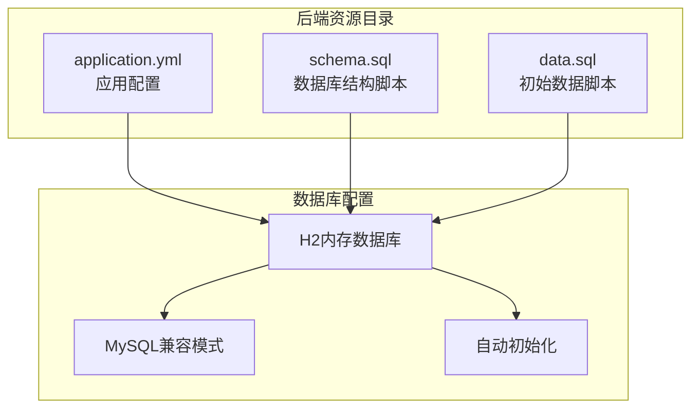
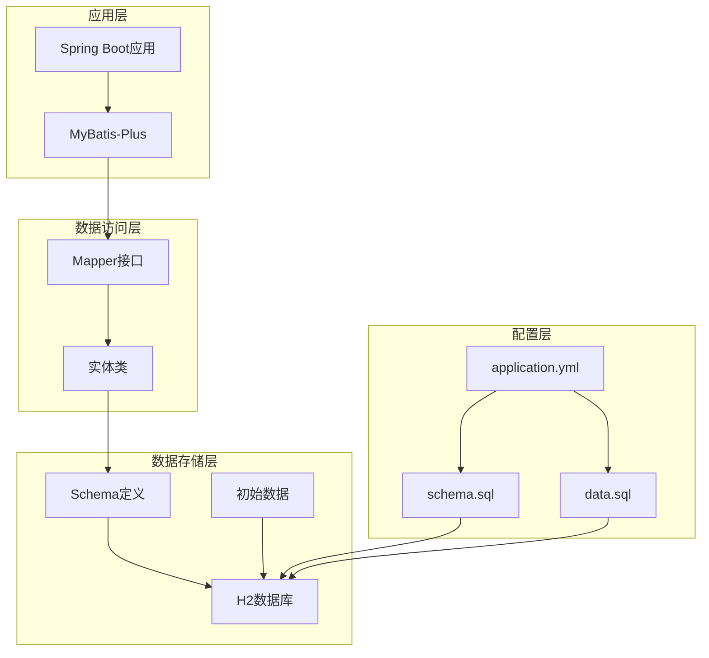
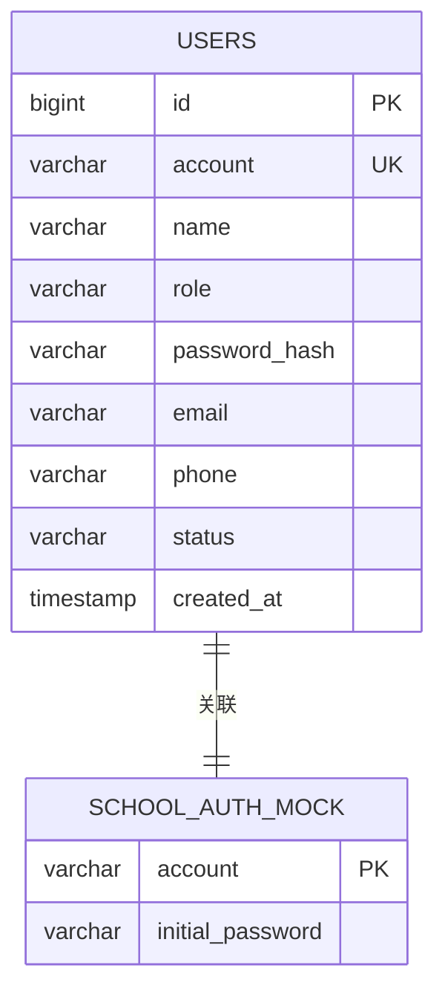
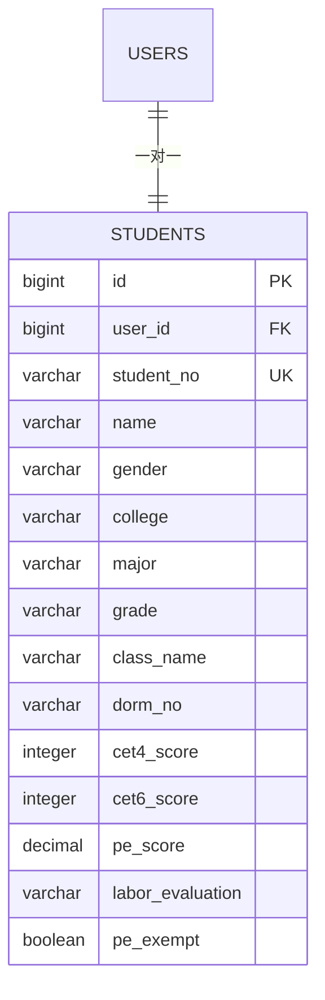
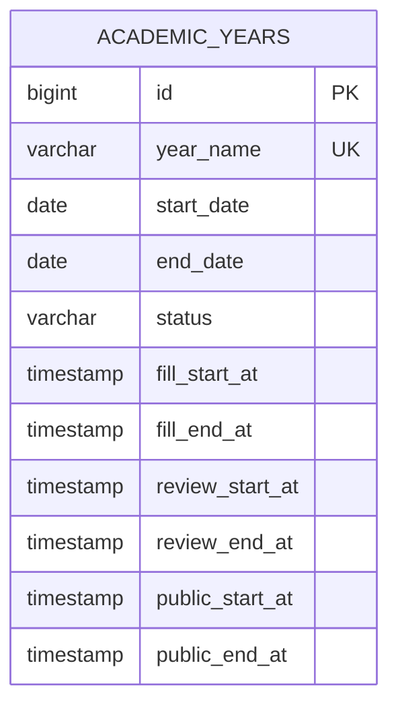
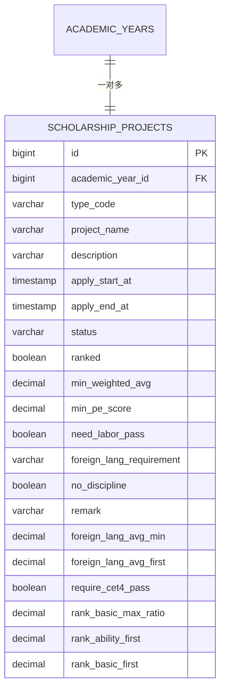
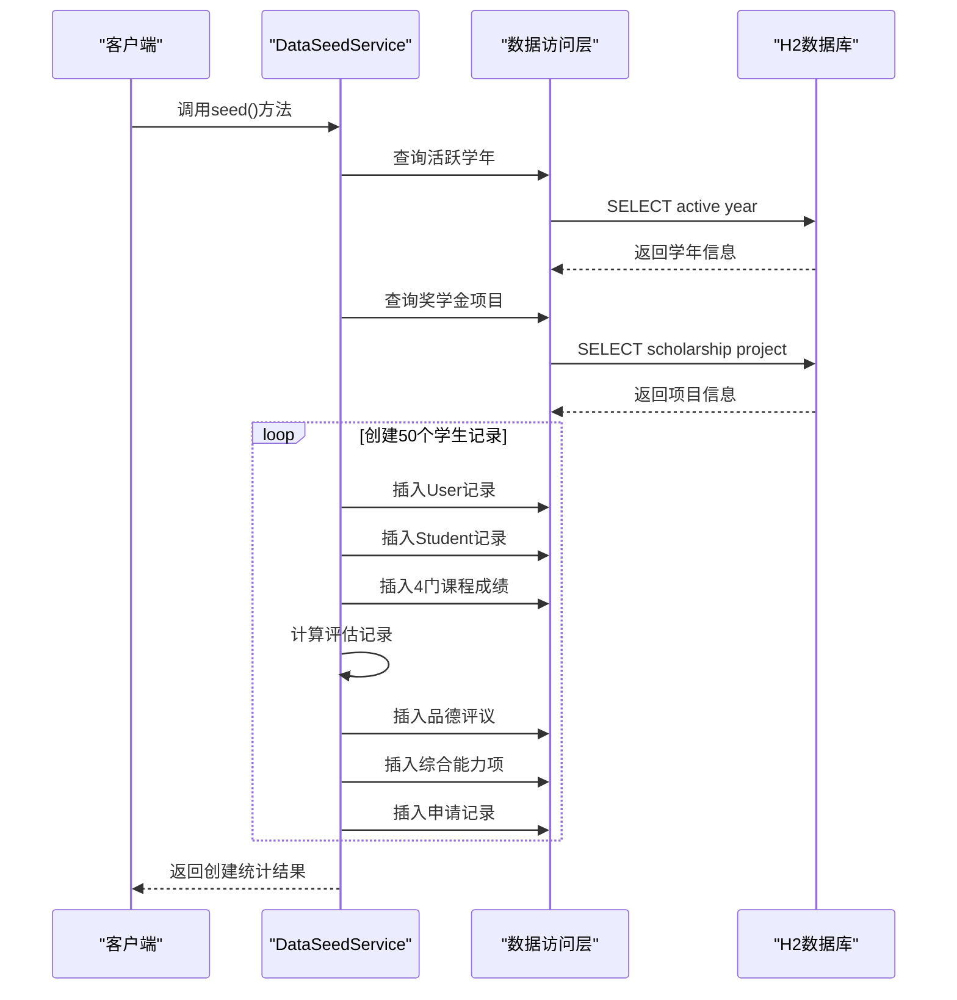
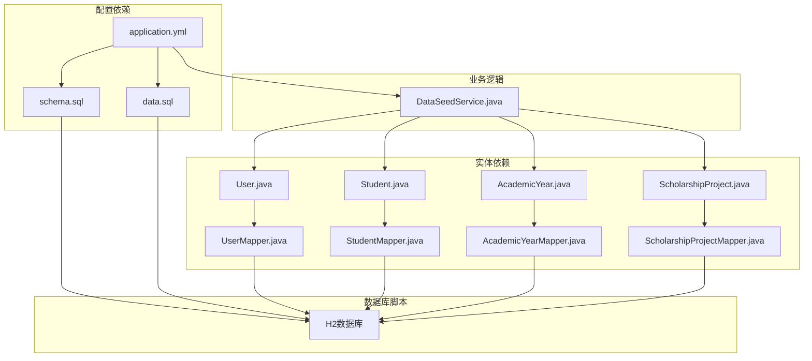

# 数据库初始化与数据字典

<cite>
**本文档引用的文件**
- [application.yml](file://backend/src/main/resources/application.yml)
- [schema.sql](file://backend/src/main/resources/db/schema.sql)
- [data.sql](file://backend/src/main/resources/db/data.sql)
- [DataSeedService.java](file://backend/src/main/java/com/zjsu/scholarship/service/DataSeedService.java)
- [User.java](file://backend/src/main/java/com/zjsu/scholarship/entity/User.java)
- [Student.java](file://backend/src/main/java/com/zjsu/scholarship/entity/Student.java)
- [AcademicYear.java](file://backend/src/main/java/com/zjsu/scholarship/entity/AcademicYear.java)
- [ScholarshipProject.java](file://backend/src/main/java/com/zjsu/scholarship/entity/ScholarshipProject.java)
- [UserMapper.java](file://backend/src/main/java/com/zjsu/scholarship/mapper/UserMapper.java)
- [StudentMapper.java](file://backend/src/main/java/com/zjsu/scholarship/mapper/StudentMapper.java)
- [AcademicYearMapper.java](file://backend/src/main/java/com/zjsu/scholarship/mapper/AcademicYearMapper.java)
- [ScholarshipProjectMapper.java](file://backend/src/main/java/com/zjsu/scholarship/mapper/ScholarshipProjectMapper.java)
</cite>

## 目录
1. [简介](#简介)
2. [项目结构](#项目结构)
3. [核心组件](#核心组件)
4. [架构概览](#架构概览)
5. [详细组件分析](#详细组件分析)
6. [依赖分析](#依赖分析)
7. [性能考虑](#性能考虑)
8. [故障排除指南](#故障排除指南)
9. [结论](#结论)
10. [附录](#附录)

## 简介

本项目采用H2内存数据库作为开发和测试环境的数据存储解决方案。数据库初始化流程通过Spring Boot的自动配置机制实现，确保应用启动时能够正确创建数据库表结构并加载初始演示数据。

系统使用MyBatis-Plus作为ORM框架，通过实体类与数据库表进行映射。数据库配置采用H2的MySQL兼容模式，支持大小写不敏感标识符和MySQL语法兼容性。

## 项目结构

后端项目采用标准的Maven目录结构，数据库相关文件位于`backend/src/main/resources`目录下：

**图表来源**
- [application.yml:8-28](file://backend/src/main/resources/application.yml#L8-L28)
- [schema.sql:1-402](file://backend/src/main/resources/db/schema.sql#L1-L402)
- [data.sql:1-66](file://backend/src/main/resources/db/data.sql#L1-L66)

**章节来源**
- [application.yml:1-52](file://backend/src/main/resources/application.yml#L1-L52)
- [schema.sql:1-402](file://backend/src/main/resources/db/schema.sql#L1-L402)
- [data.sql:1-66](file://backend/src/main/resources/db/data.sql#L1-L66)

## 核心组件

### H2数据库配置

系统使用H2内存数据库作为主要数据存储，配置参数如下：

- **数据库URL**: `jdbc:h2:file:./data/scholarship;DB_CLOSE_DELAY=-1;AUTO_SERVER=TRUE;MODE=MySQL;DATABASE_TO_LOWER=TRUE;CASE_INSENSITIVE_IDENTIFIERS=TRUE`
- **驱动类名**: `org.h2.Driver`
- **用户名**: `sa`
- **密码**: 空值
- **H2控制台**: 启用，路径为 `/h2`

### Spring Boot自动初始化

数据库初始化通过以下配置实现：

- **初始化模式**: `always` - 每次启动都执行
- **Schema位置**: `classpath:db/schema.sql`
- **数据位置**: `classpath:db/data.sql`
- **编码格式**: UTF-8
- **错误处理**: 遇到错误立即停止

**章节来源**
- [application.yml:11-28](file://backend/src/main/resources/application.yml#L11-L28)

## 架构概览

系统数据库架构采用分层设计，包含以下核心层次：

**图表来源**
- [application.yml:8-28](file://backend/src/main/resources/application.yml#L8-L28)
- [schema.sql:1-402](file://backend/src/main/resources/db/schema.sql#L1-L402)
- [data.sql:1-66](file://backend/src/main/resources/db/data.sql#L1-L66)

## 详细组件分析

### 数据库表结构分析

系统包含38个核心数据表，涵盖用户管理、学生信息、奖学金评估等完整业务场景。

#### 用户与认证表

**图表来源**
- [schema.sql:7-22](file://backend/src/main/resources/db/schema.sql#L7-L22)

#### 学生信息表

**图表来源**
- [schema.sql:25-43](file://backend/src/main/resources/db/schema.sql#L25-L43)

#### 学年配置表

**图表来源**
- [schema.sql:46-58](file://backend/src/main/resources/db/schema.sql#L46-L58)

#### 奖学金项目表

**图表来源**
- [schema.sql:235-260](file://backend/src/main/resources/db/schema.sql#L235-L260)

### 初始数据加载机制

系统通过`data.sql`文件提供完整的演示数据，包含以下关键数据集：

#### 用户账号数据

系统预置了13个用户账号，涵盖不同角色：
- 1个系统管理员 (`admin`)
- 2个辅导员 (`T2023001`, `T2023002`)
- 10个学生 (`20231001`-`20231010`)

#### 学生信息数据

包含10名学生的基础信息，涵盖：
- 3个专业：人工智能、通信工程、电子信息工程
- 2个年级：大一、大二
- 10个班级：AI2301、CE2301、EE2301、EE2401

#### 学年配置数据

设置当前学年配置：
- 学年名称：`2025-2026`
- 开始日期：2025-09-01
- 结束日期：2026-08-31
- 状态：`ACTIVE`

#### 课程成绩数据

为每个学生生成4门课程的成绩记录，涵盖：
- 课程：高等数学、线性代数、C语言程序设计、大学英语
- 学分：4.0、3.0、3.0、2.0
- 成绩范围：65-95分

**章节来源**
- [data.sql:5-66](file://backend/src/main/resources/db/data.sql#L5-L66)

### 数据播种服务

系统提供`DataSeedService`用于动态生成演示数据：

**图表来源**
- [DataSeedService.java:61-182](file://backend/src/main/java/com/zjsu/scholarship/service/DataSeedService.java#L61-L182)

**章节来源**
- [DataSeedService.java:13-194](file://backend/src/main/java/com/zjsu/scholarship/service/DataSeedService.java#L13-L194)

## 依赖分析

系统数据库相关组件之间的依赖关系如下：

**图表来源**
- [application.yml:8-28](file://backend/src/main/resources/application.yml#L8-L28)
- [User.java:1-24](file://backend/src/main/java/com/zjsu/scholarship/entity/User.java#L1-L24)
- [Student.java:1-33](file://backend/src/main/java/com/zjsu/scholarship/entity/Student.java#L1-L33)
- [AcademicYear.java:1-27](file://backend/src/main/java/com/zjsu/scholarship/entity/AcademicYear.java#L1-L27)
- [ScholarshipProject.java:1-50](file://backend/src/main/java/com/zjsu/scholarship/entity/ScholarshipProject.java#L1-L50)

**章节来源**
- [UserMapper.java:1-8](file://backend/src/main/java/com/zjsu/scholarship/mapper/UserMapper.java#L1-L8)
- [StudentMapper.java:1-8](file://backend/src/main/java/com/zjsu/scholarship/mapper/StudentMapper.java#L1-L8)
- [AcademicYearMapper.java:1-8](file://backend/src/main/java/com/zjsu/scholarship/mapper/AcademicYearMapper.java#L1-L8)
- [ScholarshipProjectMapper.java:1-8](file://backend/src/main/java/com/zjsu/scholarship/mapper/ScholarshipProjectMapper.java#L1-L8)

## 性能考虑

### H2数据库特性优化

系统针对H2数据库的性能特点进行了以下优化：

- **内存数据库**: 使用`jdbc:h2:file:`模式，支持文件持久化同时保持内存数据库的高性能
- **自动服务器**: 启用`AUTO_SERVER=TRUE`，允许多进程访问同一数据库文件
- **MySQL兼容**: 设置`MODE=MySQL`，确保SQL语法兼容性
- **大小写处理**: `DATABASE_TO_LOWER=TRUE`和`CASE_INSENSITIVE_IDENTIFIERS=TRUE`简化查询逻辑

### 初始化性能优化

- **UTF-8编码**: 确保所有SQL脚本使用UTF-8编码，避免字符集问题
- **错误处理**: `continue-on-error=false`确保初始化失败时及时发现并处理问题
- **事务管理**: `DataSeedService`使用`@Transactional`注解确保数据一致性

## 故障排除指南

### 常见初始化问题

#### 数据库连接问题

**症状**: 应用启动时报数据库连接错误
**解决方案**:
1. 检查数据库URL配置是否正确
2. 确认H2驱动已正确引入
3. 验证数据库文件权限

#### SQL执行错误

**症状**: 初始化过程中出现SQL语法错误
**解决方案**:
1. 检查`schema.sql`和`data.sql`文件的SQL语法
2. 确认H2 MySQL兼容模式设置正确
3. 验证表名和列名的大小写

#### 数据重复问题

**症状**: 执行MERGE语句时报主键冲突
**解决方案**:
1. 确认`MERGE INTO`语句的KEY定义正确
2. 检查现有数据是否已存在
3. 考虑清理现有数据后重新初始化

### 调试方法

#### 启用H2控制台

系统提供了H2数据库控制台，可通过以下步骤访问：
1. 启动应用后访问`http://localhost:8080/h2`
2. 在控制台中输入数据库URL：`jdbc:h2:./data/scholarship`
3. 使用用户名`sa`登录

#### 日志监控

通过调整日志级别可以更好地监控数据库初始化过程：
- 将`com.zjsu.scholarship`日志级别设为`DEBUG`
- 监控SQL执行日志
- 查看初始化完成后的系统日志

**章节来源**
- [application.yml:16-22](file://backend/src/main/resources/application.yml#L16-L22)

## 结论

本项目成功实现了基于H2内存数据库的完整初始化流程，通过Spring Boot的自动配置机制确保了开发和测试环境的一致性。数据库结构设计涵盖了奖学金评选系统的完整业务需求，初始数据提供了丰富的演示内容。

系统的关键优势包括：
- 自动化的数据库初始化流程
- 完整的演示数据集
- 灵活的扩展机制
- 良好的性能表现

## 附录

### 生产环境迁移策略

对于生产环境，建议采用以下迁移策略：

#### 数据库迁移工具
- 使用Flyway或Liquibase进行版本化数据库迁移
- 将`schema.sql`转换为版本化的迁移脚本
- 为每个功能模块创建独立的迁移文件

#### 数据备份与恢复
- 定期导出数据库快照
- 使用H2的备份功能定期备份数据文件
- 建立灾难恢复计划

#### 版本管理最佳实践
- 为每个数据库变更创建独立的迁移脚本
- 在开发环境中先验证迁移脚本
- 使用Git管理数据库迁移文件
- 建立变更审查流程

### 数据库配置参数详解

| 参数 | 默认值 | 说明 |
|------|--------|------|
| `DB_CLOSE_DELAY=-1` | -1 | 关闭延迟，防止数据库意外关闭 |
| `AUTO_SERVER=TRUE` | TRUE | 允许多进程访问 |
| `MODE=MySQL` | MySQL | MySQL语法兼容模式 |
| `DATABASE_TO_LOWER=TRUE` | TRUE | 数据库名转小写 |
| `CASE_INSENSITIVE_IDENTIFIERS=TRUE` | TRUE | 标识符大小写不敏感 |